[TOC]

# MIT 6.828 JOS 总结


## Lab 1: Booting a PC

**目的**：开机启动流程

**核心概念**：[BIOS](https://en.wikipedia.org/wiki/BIOS)

**图解**：


### power-on bootstrap procedure 

```c

+------------------+  <- 0xFFFFFFFF (4GB)
|      32-bit      |
|  memory mapped   |
|     devices      |
|                  |
/\/\/\/\/\/\/\/\/\/\

/\/\/\/\/\/\/\/\/\/\
|                  |
|      Unused      |
|                  |
+------------------+  <- depends on amount of RAM
|                  |
|                  |
| Extended Memory  |
|                  |
|                  |
+------------------+  <- 0x00100000 (1MB)
|     BIOS ROM     |
+------------------+  <- 0x000F0000 (960KB)
|  16-bit devices, |
|  expansion ROMs  |
+------------------+  <- 0x000C0000 (768KB)
|   VGA Display    |
+------------------+  <- 0x000A0000 (640KB)
|                  |
|    Low Memory    |
|                  |
+------------------+  <- 0x00000000
```

**GDB执行的第一条指令**(位于f000：fff0)：---- (**real mode**)

物理地址 = 段寄存器CS左移4位 + 指令寄存器IP    $2^{16}(64KB) ---> 2^{20}(1MB)$​​​

```assembly
[f000:fff0]    0xffff0:	ljmp   $0xf000,$0xe05b   
```

- PC 在物理地址 `0x000ffff0` 处开始执行，该地址位于为 ROM BIOS 保留的 64KB 区域的最顶部。

  ```c
  16 * 0xf000 + 0xfff0 
     = 0xf0000 + 0xfff0
     = 0xffff0
  ```

- 长跳转指令跳转到分段地址`CS = 0xf000`和`IP = 0xe05b`, 

  ```c
  	0xf000 * 16 + 0xe05b
  	= 0xf0000 + 0xe05b
  	= 0xfe05b
  ```

**BIOS运行：**

- 开机自检(Power-On Self-Test, POST)
- 初始化：创建**中断描述符表**(interrupt descriptor table)、初始化PCI总线、寄存器、VGA显示器等

- 引导程序：将磁盘0号扇区(512字节)的boot loader拷贝到`0x7c00 - 0x7dff(512 byte)`, 然后使用 jmp 指令将 CS:IP 设置为 0000:7c00，将控制权交给引导装载机

### boot loader 

**作用：**

- real mode --->  32-bit protected mode
- 通过 x86 的特殊 I/O 指令直接访问 IDE 磁盘设备寄存器，从硬盘读取内核。

**分工：**

-  `boot/boot.S` ---- 在引导内核之前，boot loader必须对CPU进行初始化

  - 基本初始化

    ```assembly
     .code16                      # Assemble for 16-bit mode 为16位模式汇编
      cli                         # Disable interrupts       禁用响应中断 - 引导过程原子
      cld                         # String operations increment 字符串操作增量
    
      # Set up the important data segment registers (DS, ES, SS).
      # 设置重要的数据段寄存器（DS、ES、SS）
      xorw    %ax,%ax             # Segment number zero  段号为0
      movw    %ax,%ds             # -> Data Segment  数据段
      movw    %ax,%es             # -> Extra Segment 额外段
      movw    %ax,%ss             # -> Stack Segment 堆栈段
    ```

  - 打开A20 Gate: 要开启保护模式，首先要禁用地址卷绕，也就是**开启编号为20的地址线**，即第21位地址

    ```assembly
    seta20.1:
      inb     $0x64,%al               # Wait for not busy
      testb   $0x2,%al
      jnz     seta20.1
    
      movb    $0xd1,%al               # 0xd1 -> port 0x64 写入1字节
      outb    %al,$0x64
    
    seta20.2:
      inb     $0x64,%al               # Wait for not busy
      testb   $0x2,%al
      jnz     seta20.2
    
      movb    $0xdf,%al               # 0xdf -> port 0x60 开启A20
      outb    %al,$0x60=
    ```

  - GDT(global descriptor table)  ---- 保护模式下的内存分段

  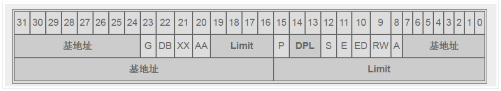

  ```assembly
  # Bootstrap GDT 全局段描述符表（GDT）  -- 引导GDT
  .p2align 2                              # force 4 byte alignment 强制 4 字节对齐
  gdt:
    SEG_NULL                              # null seg  空段
    SEG(STA_X|STA_R, 0x0, 0xffffffff)     # code seg  代码段
    SEG(STA_W, 0x0, 0xffffffff)           # data seg  数据段
  
  gdtdesc:
    .word   0x17                            # sizeof(gdt) - 1 
    .long   gdt                             # address gdt   地址GDT
  ```

  - 开启保护模式

  ```assembly
  ljmp    $PROT_MODE_CSEG, $protcseg
  ```

  PROT_MODE_CSEG这个宏是1，该语句会把cs寄存器的值设为0x08

  - 最后准备：设置保护模式下的数据段寄存器，设置堆栈指针调用bootmain

  ```assembly
   .code32                     # Assemble for 32-bit mode
  protcseg:
    # Set up the protected-mode data segment registers
    movw    $PROT_MODE_DSEG, %ax    # Our data segment selector
    movw    %ax, %ds                # -> DS: Data Segment
    movw    %ax, %es                # -> ES: Extra Segment
    movw    %ax, %fs                # -> FS
    movw    %ax, %gs                # -> GS
    movw    %ax, %ss                # -> SS: Stack Segment
  
  # Set up the stack pointer and call into C.
    movl    $start, %esp
    call bootmain   # 调用main.c程序
  
    # If bootmain returns (it shouldn't), loop.
  spin:
    jmp spin
  ```

  

-  `boot/main.c `   --- 加载内核文件到内存中。  **ELF文件**

  - 加载ELF头部与程序头表

  ```c
  #define SECTSIZE        512                      
  #define ELFHDR          ((struct Elf *) 0x10000) // scratch space 
  void
  bootmain{
      ...
  		struct Proghdr *ph, *eph;
  		// read 1st page off disk
        	readseg((uint32_t) ELFHDR, SECTSIZE*8, 0); // 映射4KB到物理地址0x10000处
          // is this a valid ELF?
          if (ELFHDR->e_magic != ELF_MAGIC)
                  goto bad;
      ...
  }
  ```

  内核文件加载到物理内存`0x10000`开始的位置，即Extended memory部分，与low memory里的boot loader和堆栈区错开

  - 加载内核程序

  ```c
   		// load each program segment (ignores ph flags) 
  		ph = (struct Proghdr *) ((uint8_t *) ELFHDR + ELFHDR->e_phoff);
          eph = ph + ELFHDR->e_phnum;
          for (; ph < eph; ph++)
                  // p_pa is the load address of this segment (as well
                  // as the physical address)
                  readseg(ph->p_pa, ph->p_memsz, ph->p_offset);
  ```

**OK!!!!**    加载完成后，就可以执行内核入口程序了！入口程序的物理地址记录在elf头部中。之后，就是内核接管计算机的时代了！bootstrap引导操作正式完成！

###  The kernel  

- **ELF文件**

main.c(源文件) ----编译器----> main.o(对象文件) --------链接器-------> 二进制映像(ELF文件)

```shell
# 检查内核可执行文件中所有部分的名称、大小和链接地址的完整列表
llf@ubuntu:~/6.828/lab$ objdump -h obj/kern/kernel

obj/kern/kernel:     file format elf32-i386

Sections:
Idx Name          Size      VMA       LMA       File off  Algn
  0 .text         00001acd  f0100000  00100000  00001000  2**4
                  CONTENTS, ALLOC, LOAD, READONLY, CODE
  1 .rodata       000006bc  f0101ae0  00101ae0  00002ae0  2**5
                  CONTENTS, ALLOC, LOAD, READONLY, DATA
  2 .stab         00004291  f010219c  0010219c  0000319c  2**2
                  CONTENTS, ALLOC, LOAD, READONLY, DATA
  3 .stabstr      0000197f  f010642d  0010642d  0000742d  2**0
                  CONTENTS, ALLOC, LOAD, READONLY, DATA
  4 .data         00009300  f0108000  00108000  00009000  2**12
                  CONTENTS, ALLOC, LOAD, DATA
  5 .got          00000008  f0111300  00111300  00012300  2**2
                  CONTENTS, ALLOC, LOAD, DATA
  6 .got.plt      0000000c  f0111308  00111308  00012308  2**2
                  CONTENTS, ALLOC, LOAD, DATA
  7 .data.rel.local 00001000  f0112000  00112000  00013000  2**12
                  CONTENTS, ALLOC, LOAD, DATA
  8 .data.rel.ro.local 00000044  f0113000  00113000  00014000  2**2
                  CONTENTS, ALLOC, LOAD, DATA
  9 .bss          00000648  f0113060  00113060  00014060  2**5
                  CONTENTS, ALLOC, LOAD, DATA
 10 .comment      0000002a  00000000  00000000  000146a8  2**0
                  CONTENTS, READONLY
```

- boot loader链接地址和加载地址是相同的, 内核的加载地址和链接地址不同

```shell
# 链接地址和加载地址是相同的 ---- 查看boot loader中的.text
llf@ubuntu:~/6.828/lab$ objdump -h obj/boot/boot.out

obj/boot/boot.out:     file format elf32-i386

Sections:
Idx Name          Size      VMA       LMA       File off  Algn
  0 .text         0000019c  00007c00  00007c00  00000074  2**2
                  CONTENTS, ALLOC, LOAD, CODE
```

- **Using virtual memory to work around position dependence**

- **Formatted Printing to the Console**

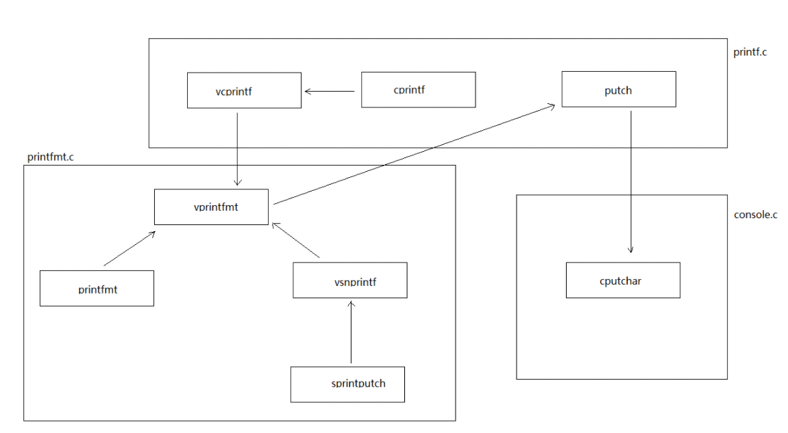

这些函数最终都会调用到`cputchar()`，`cputchar()`打印一个字符到屏幕。`cputchar()`会调到`kern/console.c`中的`cga_putc()`，该函数将`int c`打印到控制台，可以看到该函数处理会打印正常的字符外，还能处理回车换行等控制字符，甚至还能处理滚屏。`cga_putc()`会将字符对应的ascii码存储到`crt_buf[crt_pos]`处，实际上`crt_buf`在初始化的时候被初始为
`KERNBASE(0xF00B8000) + CGA_BUF(0xB8000)`，也就是虚拟地址`0xF00B8000`处，这里正是显存的起始地址（根据目前的页表虚拟地址`0xF00B8000`将被映射到物理地址`0xB8000`处）。
**所以往控制台写字符串，本质还是往物理地址0xB8000开始的显存写数据。**

- **The Stack**   向下生长


```c
int cprintf(const char *format, ...);
```

参数压栈顺序：从左到右？？？ 从右到左？？

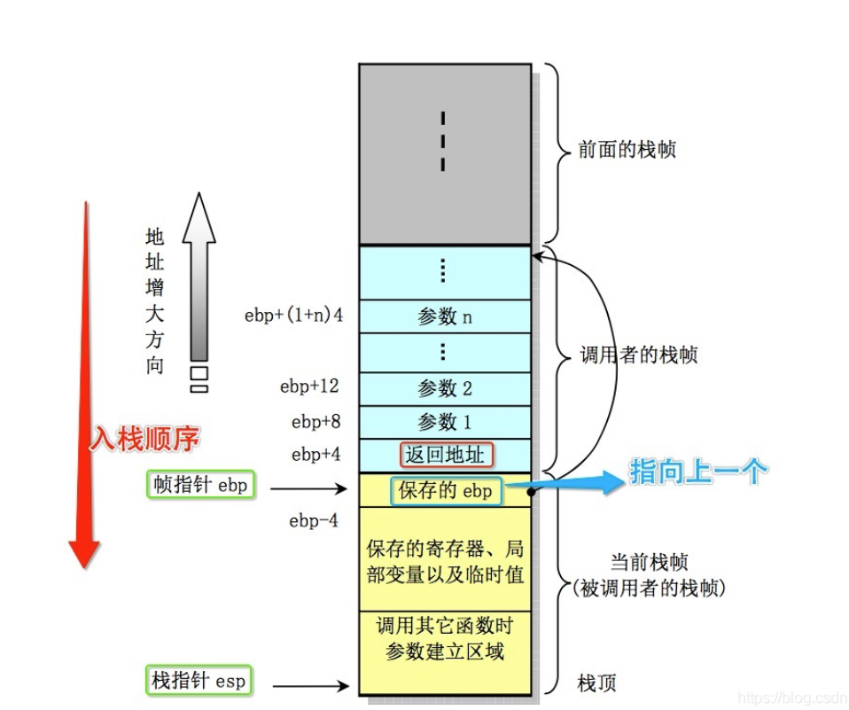

- **mon_backtrace()**

```c
cprintf("  ebp %08x  eip %08x  args %08x %08x %08x %08x %08x\r\n",
                ebp, ebp[1], ebp[2], ebp[3], ebp[4], ebp[5], ebp[6]);
...
ebp = (uint32_t *)*ebp;  // next ebp info
```


```shell
llf@ubuntu:~/6.828/lab$ ./grade-lab1 
+ cc kern/kdebug.c
+ ld obj/kern/kernel
ld: warning: section `.bss' type changed to PROGBITS
+ mk obj/kern/kernel.img
running JOS: (0.5s) 
  printf: OK 
  backtrace count: OK 
  backtrace arguments: OK 
  backtrace symbols: OK 
  backtrace lines: OK 
Score: 50/50
```


## Lab 2: Memory Management

**GOAL:** memory management 

- physical memory allocator

- *virtual memory*

### Part 1: Physical Page Management

#### physical page allocator

- `PageInfo`  -- `memlayout.h`

  - 结构

  ```c
  // All physical memory mapped at this address
  #define KERNBASE        0xF0000000
  struct PageInfo {
          // Next page on the free list.
          struct PageInfo *pp_link;   // 链接指针
  
          // pp_ref is the count of pointers (usually in page table entries)
          // to this page, for pages allocated using page_alloc.
          // Pages allocated at boot time using pmap.c's
          // boot_alloc do not have valid reference count fields.
  
          uint16_t pp_ref;  // 指针计数
  };
  ```

  `pages[npages]`: 所有的物理内存页

  `page_free_list[]`: `pp_ref`值为0的元素的链表  --- 链表

  `pages[X]`: 对应物理内存`X*4K~(X+1)*4K` --- 数组

  - 存储到物理地址

  ```c
  static inline physaddr_t
  page2pa(struct PageInfo *pp)
  {
          return (pp - pages) << PGSHIFT;  // 左移PGSHIFT位  PGSHIFT=12
  }
  ```


- **physical page allocator**

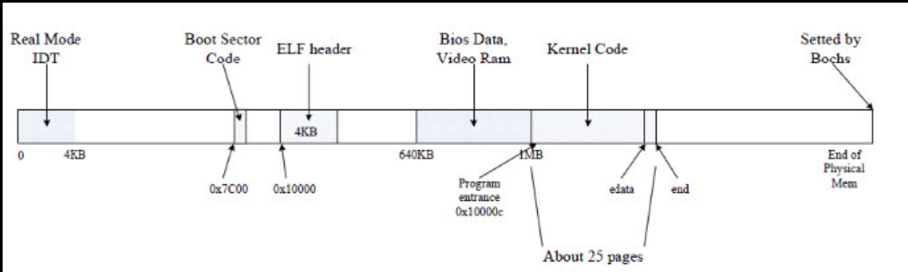

```c
static void *boot_alloc(uint32_t n) // 分配n字节 ---> 分配初始页目录
mem_init()   // 建立二级页表。kern_pgdir --- 页目录地址
page_init()  // 初始物理页面
page_alloc() // 真正分配器，从空闲链表page_free_list依次取出
page_free()  // 前插法释放页，加入page_free_list
```

```C
// At IOPHYSMEM (640K) there is a 384K hole for I/O.  From the kernel,
// IOPHYSMEM can be addressed at KERNBASE + IOPHYSMEM.  The hole ends
// at physical address EXTPHYSMEM.
#define IOPHYSMEM       0x0A0000
#define EXTPHYSMEM      0x100000
```

- `[0, 0]` in use
- `[1, npages_basemem)` is free.
- `[IOPHYSMEM/PGSIZE, EXTPHYSMEM/PGSIZE)` in use
- `[EXTPHYSMEM/PGSIZE, ...)`   extended memory - some in use, some is free

`page_init()`

```c
		// 1 in use, 0 is free
        size_t i;  
    	for (i = 0; i < npages; i++){
            if (i == 0){   // Mark physical page 0 as in use.
                pages[i].pp_ref = 1;
                pages[i].pp_link = NULL;
            }
            else if (i >= 1 && i < npages_basemem){ //  base memory
            	pages[i].pp_ref = 0;
        		pages[i].pp_link = page_free_list;
        		page_free_list = &pages[i];
            }
            else if (i >= IOPHYSMEM / PGSIZE && i < EXTPHYSMEM / PGSIZE){ // IO hole
                 pages[i].pp_ref = 1;
                 pages[i].pp_link = NULL; 
            }
            else{ // extended memory
                 if (i < PADDR(boot_alloc(0)) / PGSIZE) { // kernel zone
            		pages[i].pp_ref = 1;
                    pages[i].pp_link = NULL; 
        		}
                else {
            		pages[i].pp_ref = 0;
            		pages[i].pp_link = page_free_list;
            		page_free_list = &pages[i];
        		}
            }
        }
```

`page_alloc()`

```c
struct PageInfo *
page_alloc(int alloc_flags)
{
         if (page_free_list == NULL) // no free page
    		return NULL;
  
  		struct PageInfo * freePtr = page_free_list; // use from head of page_free_list
  		page_free_list = freePtr->pp_link;
    	freePtr->pp_link = NULL;

  		if (alloc_flags & ALLOC_ZERO){
    		memset(page2kva(ptr), 0, PGSIZE);
  		}
  		return freePtr;
}
```


### Part 2: Virtual Memory

#### 32-bit protected mode: 

- segment  translation：logical address ---->   linear address
- page translation：linear address -----> physical address

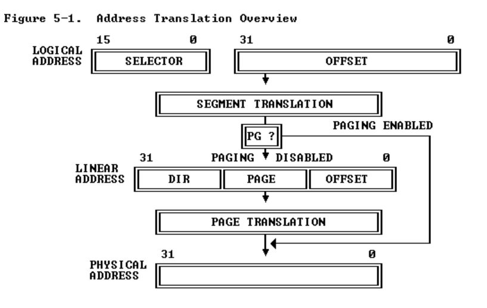

- **Segment Translation**

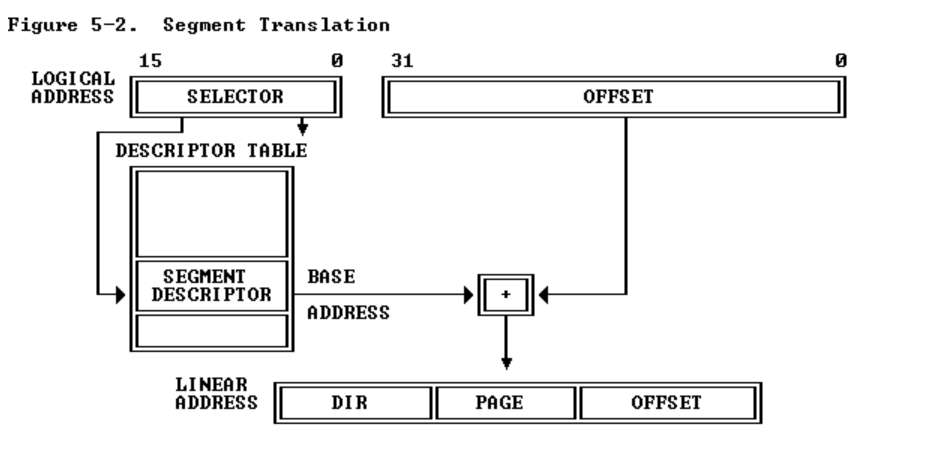

 **Descriptors** 

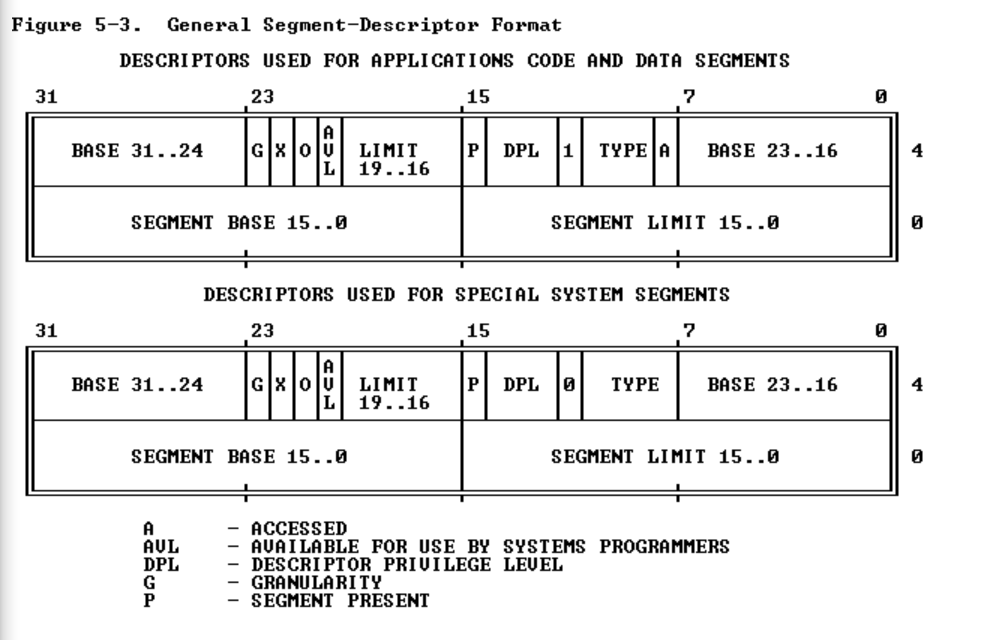


- **Page Translation**

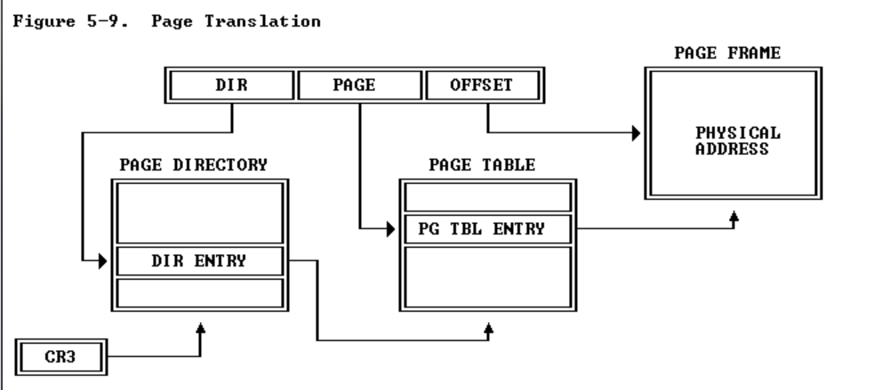

两级页表：

-  `DIR` 字段作为页目录(page directory)的索引
-  `PAGE` 字段作为页目录确定的页表(page table)的索引
-  `OFFSET` 字段对页表确定的页内的字节进行寻址。

===============>


JOS忽略段转换，只实现分页机制。


#### Page Table Management

页表项权限标志：

```c
// Page table/directory entry flags. 
#define PTE_P           0x001   // Present
#define PTE_W           0x002   // Writeable
#define PTE_U           0x004   // User
```


- `pgdir_walk()`: 给定`pgdir`，一个指向页目录的指针，`pgdir_walk` 返回一个指向线性地址`va`的页表条目（PTE）的指针。

```c
pte_t *
pgdir_walk(pde_t *pgdir, const void *va, int create)
{
    struct PageInfo* new_page = NULL;    // new page
    pde_t * pde_ptr = pgdir + PDX(va);   // Page directory entry address
    if (!(*pde_ptr & PTE_P)){   // page table in memory ?
        if(create)   // create != false
        {
            // Allocate a page as a page table
            new_page = page_alloc(1);
            if (new_page == NULL) return NULL; // no more mem
            new_page->pp_ref++;  // new page's reference count is incremented
            *pde_ptr = (page2pa(new_page) | PTE_P | PTE_W | PTE_U);   
        }
        else{
            return NULL;
        }
    }
    
    unsigned int page_off = PTX(va);
    pte_t * page_base = (pte_t *)KADDR(PTE_ADDR(*pde_ptr)); // Base address of page table page, KADDR return void*
    return &page_base[page_off];  // page_base + PTX(va)
}
```

- `boot_map_region()` : 将虚拟地址空间的 `[va, va+size)` 映射到以 `pgdir` 为根的页表中的物理 `[pa, pa+size)`。

```c
static void
boot_map_region(pde_t *pgdir, uintptr_t va, size_t size, physaddr_t pa, int perm)
{
    int i;
    for (i = 0; i < size / PGSIZE; ++i, va += PGSIZE, pa += PGSIZE) {
        pte_t *pte = pgdir_walk(pgdir, (void *) va, 1); // Get the table entry of this page.
        if (!pte) 
            panic("boot_map_region panic, out of memory");
        *pte = pa | perm | PTE_P;
    }
}
```

```c
// 返回映射到虚拟地址 `va` 的页
struct PageInfo *
page_lookup(pde_t *pgdir, void *va, pte_t **pte_store)
    
// 取消映射虚拟地址 `va`处的物理页面
void
page_remove(pde_t *pgdir, void *va)
    
// 将物理页 `pp` 映射到虚拟地址 `va`
int
page_insert(pde_t *pgdir, struct PageInfo *pp, void *va, int perm)
```


### Part 3: Kernel Address Space

- **Virtual memory map**

```c
/*
 * Virtual memory map:                                Permissions
 *                                                    kernel/user
 *
 *    4 Gig -------->  +------------------------------+
 *                     |                              | RW/--
 *                     ~~~~~~~~~~~~~~~~~~~~~~~~~~~~~~~~
 *                     :              .               :
 *                     :              .               :
 *                     :              .               :
 *                     |~~~~~~~~~~~~~~~~~~~~~~~~~~~~~~| RW/--
 *                     |                              | RW/--
 *                     |   Remapped Physical Memory   | RW/--
 *                     |                              | RW/--
 *    KERNBASE, ---->  +------------------------------+ 0xf0000000      --+
 *    KSTACKTOP        |     CPU0's Kernel Stack      | RW/--  KSTKSIZE   |
 *                     | - - - - - - - - - - - - - - -|                   |
 *                     |      Invalid Memory (*)      | --/--  KSTKGAP    |
 *                     +------------------------------+                   |
 *                     |     CPU1's Kernel Stack      | RW/--  KSTKSIZE   |
 *                     | - - - - - - - - - - - - - - -|                 PTSIZE
 *                     |      Invalid Memory (*)      | --/--  KSTKGAP    |
 *                     +------------------------------+                   |
 *                     :              .               :                   |
 *                     :              .               :                   |
 *    MMIOLIM ------>  +------------------------------+ 0xefc00000      --+
 *                     |       Memory-mapped I/O      | RW/--  PTSIZE
 * ULIM, MMIOBASE -->  +------------------------------+ 0xef800000
 *                     |  Cur. Page Table (User R-)   | R-/R-  PTSIZE
 *    UVPT      ---->  +------------------------------+ 0xef400000
 *                     |          RO PAGES            | R-/R-  PTSIZE
 *    UPAGES    ---->  +------------------------------+ 0xef000000
 *                     |           RO ENVS            | R-/R-  PTSIZE
 * UTOP,UENVS ------>  +------------------------------+ 0xeec00000
 * UXSTACKTOP -/       |     User Exception Stack     | RW/RW  PGSIZE
 *                     +------------------------------+ 0xeebff000
 *                     |       Empty Memory (*)       | --/--  PGSIZE
 *    USTACKTOP  --->  +------------------------------+ 0xeebfe000
 *                     |      Normal User Stack       | RW/RW  PGSIZE
 *                     +------------------------------+ 0xeebfd000
 *                     |                              |
 *                     |                              |
 *                     ~~~~~~~~~~~~~~~~~~~~~~~~~~~~~~~~
 *                     .                              .
 *                     .                              .
 *                     .                              .
 *                     |~~~~~~~~~~~~~~~~~~~~~~~~~~~~~~|
 *                     |     Program Data & Heap      |
 *    UTEXT -------->  +------------------------------+ 0x00800000
 *    PFTEMP ------->  |       Empty Memory (*)       |        PTSIZE
 *                     |                              |
 *    UTEMP -------->  +------------------------------+ 0x00400000      --+
 *                     |       Empty Memory (*)       |                   |
 *                     | - - - - - - - - - - - - - - -|                   |
 *                     |  User STAB Data (optional)   |                 PTSIZE
 *    USTABDATA ---->  +------------------------------+ 0x00200000        |
 *                     |       Empty Memory (*)       |                   |
 *    0 ------------>  +------------------------------+                 --+
 *
 * (*) Note: The kernel ensures that "Invalid Memory" is *never* mapped.
 *     "Empty Memory" is normally unmapped, but user programs may map pages
 *     there if desired.  JOS user programs map pages temporarily at UTEMP.
 */
```


- **virtual memory -----> physics memory**

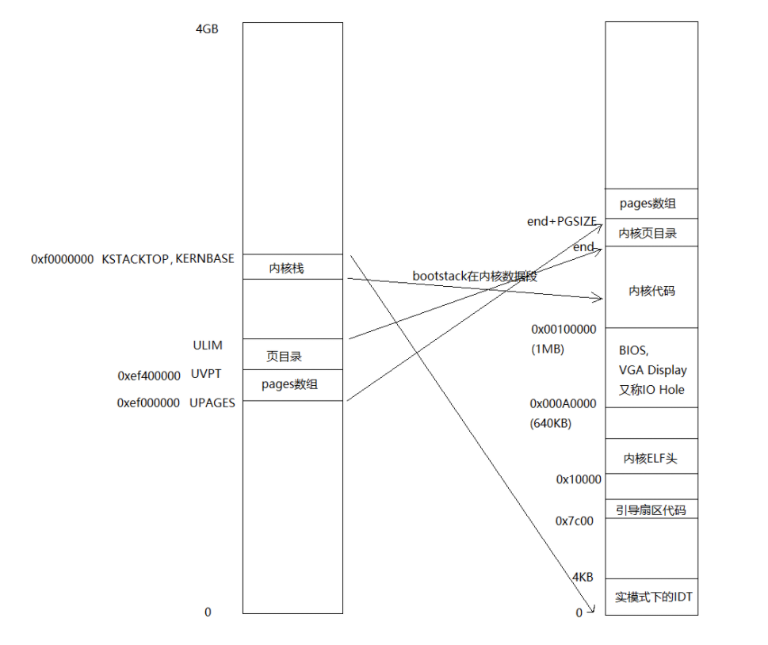


```c
llf@ubuntu:~/Documents/6.828/lab$ ./grade-lab2
+ cc kern/pmap.c
+ ld obj/kern/kernel
ld: warning: section `.bss' type changed to PROGBITS
+ mk obj/kern/kernel.img
running JOS: (1.2s) 
  Physical page allocator: OK 
  Page management: OK 
  Kernel page directory: OK 
  Page management 2: OK 
Score: 70/70
```


## Lab 3: User Environments

**GOAL:**

- 进程
- 异常处理
- 系统调用

(“环境”即进程!)

### Part A: User Environments and Exception Handling

#### User Environments 

- **Environment State**

```c
// Values of env_status in struct Env
enum {
        ENV_FREE = 0,
        ENV_DYING,
        ENV_RUNNABLE,
        ENV_RUNNING,
        ENV_NOT_RUNNABLE
};
```

```c
struct Env {
	struct Trapframe env_tf;	// Saved registers
	struct Env *env_link;		// Next free Env
	envid_t env_id;			// Unique environment identifier
	envid_t env_parent_id;		// env_id of this env's parent
	enum EnvType env_type;		// Indicates special system environments
	unsigned env_status;		// Status of the environment
	uint32_t env_runs;		// Number of times environment has run

	// Address space
	pde_t *env_pgdir;		// Kernel virtual address of page dir
};
```

`env_tf` ---- 当从用户模式切换到内核模式时，内核会保存这些信息，以便稍后可以从中断处恢复环境。

```c
struct Trapframe {
        struct PushRegs tf_regs;
        uint16_t tf_es;
        uint16_t tf_padding1;
        uint16_t tf_ds;
        uint16_t tf_padding2;
        uint32_t tf_trapno;
        /* below here defined by x86 hardware */
        uint32_t tf_err;
        uintptr_t tf_eip;
        uint16_t tf_cs;
        uint16_t tf_padding3;
        uint32_t tf_eflags;
        /* below here only when crossing rings, such as from user to kernel */
        uintptr_t tf_esp;
        uint16_t tf_ss;
        uint16_t tf_padding4;
} __attribute__((packed));
```

- **Allocating the Environments Array**

```c
struct Env *envs = NULL;		    // All environments -- 所有进程
struct Env *curenv = NULL;		    // The current env -- 当前进程
static struct Env *env_free_list;	// Free environment list -- 空闲进程

// 初始化
envs = (struct Env*)boot_alloc(sizeof(struct Env) * NENV);
memset(envs, 0, sizeof(struct Env) * NENV);

// 映射到UENVS
boot_map_region(kern_pgdir, UENVS, PTSIZE, PADDR(envs), PTE_U);
```

```c
... 
 *    UVPT      ---->  +------------------------------+ 0xef400000
 *                     |          RO PAGES            | R-/R-  PTSIZE
 *    UPAGES    ---->  +------------------------------+ 0xef000000
 *                     |           RO ENVS            | R-/R-  PTSIZE
 * UTOP,UENVS ------>  +------------------------------+ 0xeec00000
...
```

- **Creating and Running Environments**

  - `env_init()` -- 初始化 `envs `数组中的所有 Env 结构并将它们添加到 `env_free_list`。还调用 `env_init_percpu`，它使用单独的段为权限级别 0（内核）和权限级别 3（用户）配置分段硬件。

  **权限**

  ```c
  // Load GDT and segment descriptors.  加载GDT和段描述符
  void
  env_init_percpu(void)
  {
          lgdt(&gdt_pd);
          // The kernel never uses GS or FS, so we leave those set to
          // the user data segment.
          asm volatile("movw %%ax,%%gs" : : "a" (GD_UD|3));
          asm volatile("movw %%ax,%%fs" : : "a" (GD_UD|3));
          // The kernel does use ES, DS, and SS.  We'll change between
          // the kernel and user data segments as needed. 
          asm volatile("movw %%ax,%%es" : : "a" (GD_KD));
          asm volatile("movw %%ax,%%ds" : : "a" (GD_KD));
          asm volatile("movw %%ax,%%ss" : : "a" (GD_KD));
          // Load the kernel text segment into CS.
          asm volatile("ljmp %0,$1f\n 1:\n" : : "i" (GD_KT));
          // For good measure, clear the local descriptor table (LDT),
          // since we don't use it. 
          lldt(0);
  }
  ```

  **GDT(Global descriptor table)**

  ```c
  struct Segdesc gdt[] =
  {
          // 0x0 - unused (always faults -- for trapping NULL far pointers)
          SEG_NULL,
  
          // 0x8 - kernel code segment
          [GD_KT >> 3] = SEG(STA_X | STA_R, 0x0, 0xffffffff, 0),
  
          // 0x10 - kernel data segment
          [GD_KD >> 3] = SEG(STA_W, 0x0, 0xffffffff, 0),
  
          // 0x18 - user code segment
          [GD_UT >> 3] = SEG(STA_X | STA_R, 0x0, 0xffffffff, 3),
  
          // 0x20 - user data segment
          [GD_UD >> 3] = SEG(STA_W, 0x0, 0xffffffff, 3),
  
          // 0x28 - tss, initialized in trap_init_percpu()
          [GD_TSS0 >> 3] = SEG_NULL
  };
  
  struct Pseudodesc gdt_pd = {
          sizeof(gdt) - 1, (unsigned long) gdt
  };
  ```

  - `env_setup_vm()` ---- 为新环境分配页目录(page directory)并初始化新环境地址空间的内核部分。[注意：页框计数++]

  - `region_alloc()` --- 为用户环境分配和映射物理内存(physical memory)，需要把起始地址和终止地址进行**页对齐**。
  - `load_icode()` --- 加载binary地址开始处的ELF文件 [参考boot loader]  -- **ELF可执行文件加载器**

  **!!!!** 将 ELF 文件加载到环境的用户内存后，我们应该再次切换到 kern_pgdir，因为我们仍然处于内核模式

  ```c
     lcr3(PADDR(e->env_pgdir));
  .....
     lcr3(PADDR(kern_pgdir));
  ```

  

  ```c
  static void
  load_icode(struct Env *e, uint8_t *binary)
  {
          // access the ELF file
          struct Elf * ElfHeader = (struct Elf *)binary;
          if(ElfHeader->e_magic != ELF_MAGIC) {
                  panic("load_icode failed: The binary we load is not ELF format.\n");
          }
          if(ElfHeader->e_entry == 0){
                   panic("load_icode failed: The elf file can't be excuterd.\n");
          }
          struct Proghdr * ph = (struct Proghdr *) ((uint8_t *) ElfHeader + ElfHeader->e_phoff);  // program header
          struct Proghdr * eph = ph + ElfHeader->e_phnum; // end program  header
  
          // load the ELF files to the environment's user memory
          // switch to env_pgdir
          lcr3(PADDR(e->env_pgdir));
          // Load each program segment into virtual memory
          for(; ph < eph; ph++) {
                  if(ph->p_type == ELF_PROG_LOAD){
                          if(ph->p_memsz < ph->p_filesz)
                                  panic("load_icode failed: p_memsz < p_filesz.\n");
  
                          region_alloc(e, (void*)ph->p_va, ph->p_memsz);
                          memmove((void*)ph->p_va, (uint8_t *)binary + ph->p_offset, ph->p_filesz);
                          memset((void*)ph->p_va+ph->p_filesz, 0, ph->p_memsz-ph->p_filesz);
                  }
          }
  
          // switch to kern_pgdir again since we still in the kernel mode
          lcr3(PADDR(kern_pgdir));
  
          // program's entry point 
          e->env_tf.tf_eip = ElfHeader->e_entry;
  
          // Now map one page for the program's initial stack
          // at virtual address USTACKTOP - PGSIZE.
  
          // LAB 3: Your code here.
          region_alloc(e, (void*)(USTACKTOP-PGSIZE), PGSIZE);
  }
  ```

  - `env_create()` -- 使用 `env_alloc` 分配环境并调用 `load_icode `将 ELF 二进制文件加载到到用户环境中
  - `env_run()` -- 启动在用户模式下运行的给定环境

  ```c
  void
  env_run(struct Env *e)
  {
          if(e == NULL)
                  panic("env_run failed: invalid environment\n");
          if(curenv != e && curenv != NULL) {
                  if(curenv->env_status == ENV_RUNNING)
                          curenv->env_status = ENV_RUNNABLE;
          }
  
          curenv = e;
          curenv->env_status = ENV_RUNNING;
          curenv->env_runs++;  // Update its 'env_runs' counter
          unlock_kernel();   // release the lock before switching to user mode
          lcr3(PADDR(curenv->env_pgdir)); // switch to its address space
          env_pop_tf(&(curenv->env_tf));  // restore the environment's registers and drop into user mode in the environment.
  }
  ```

还未实现中断! 用户空间中的第一条 `int $0x30` 系统调用指令是一条死胡同：一旦处理器进入用户模式，就无法退出。

```c
Triple fault.  Halting for inspection via QEMU monitor.  # int    $0x30
```


#### Handling Interrupts and Exceptions

80386 程序员手册 -- **异常**(exception)、**陷阱**(trap)、**中断**(interrupt)、**故障**(fault)和**中止**(abort)

- **Enabling and Disabling Interrupts**

IF（interrupt-enable flag， 中断启用标志）: 当IF=0时，INTR中断被禁止；当 IF=1 时，INTR 中断被启用。

CLI（Clear Interrupt-Enable Flag，清除中断启用标志）和 STI（Set Interrupt-Enable Flag，设置中断启用标志）显式更改 IF（标志寄存器中的第 9 位）。

- **中断流程**

**IDT**(Interrupt Descriptor Table) ---->  IDT Descriptors (Task gates\ Interrupt gates\ Trap gates ) -----> Interrupt Procedures ----> Returning from an Interrupt Procedure（Stack of Interrupt Procedure）

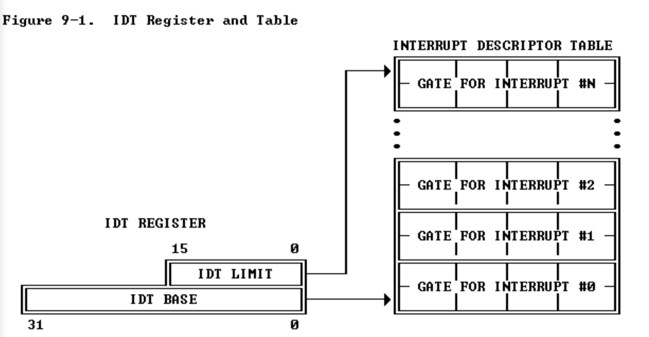

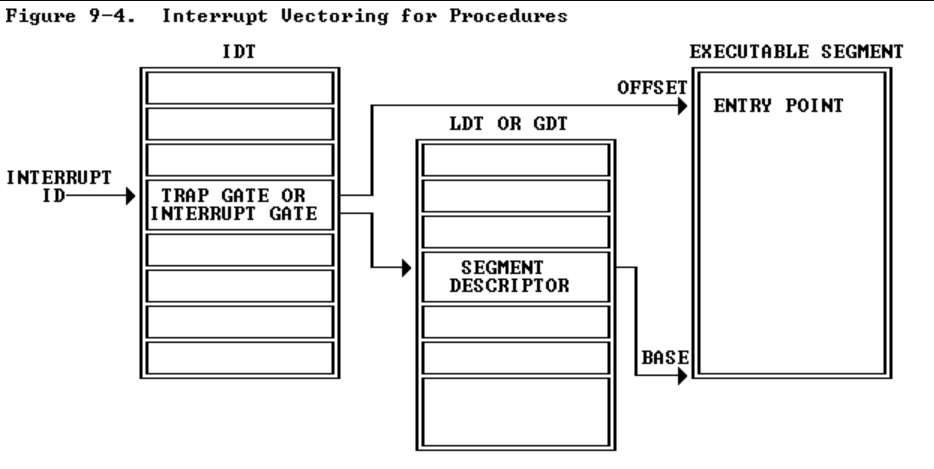

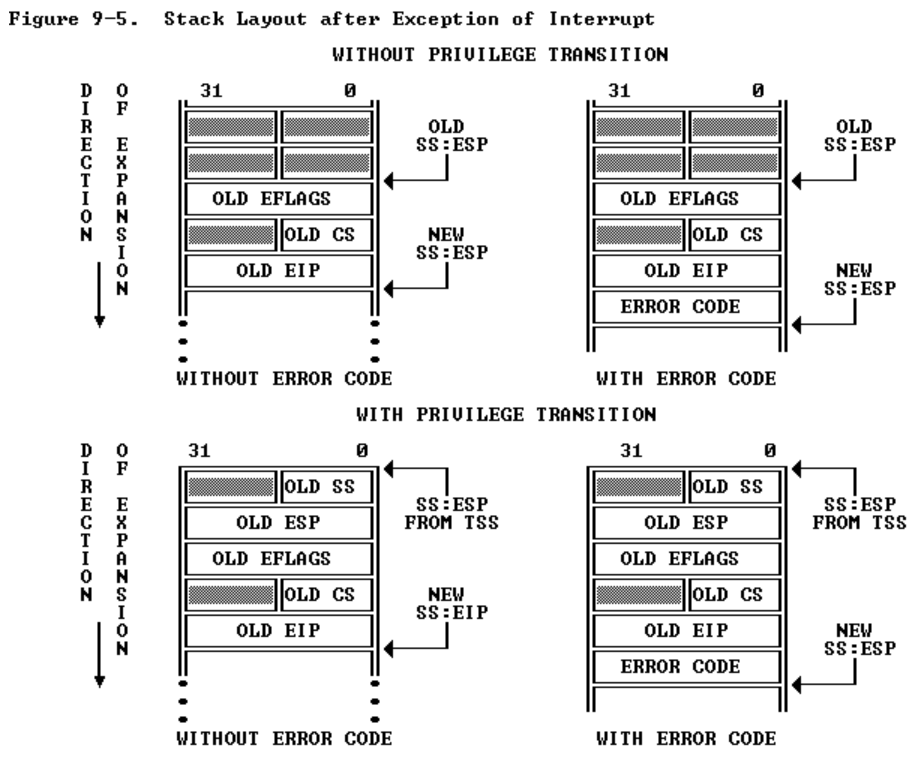


- 实现

 `inc/trap.h`  -- interrupt vector table

```c
// Trap numbers
// These are processor defined:
#define T_DIVIDE     0          // divide error
#define T_DEBUG      1          // debug exception
#define T_NMI        2          // non-maskable interrupt
#define T_BRKPT      3          // breakpoint
#define T_OFLOW      4          // overflow
#define T_BOUND      5          // bounds check
#define T_ILLOP      6          // illegal opcode
#define T_DEVICE     7          // device not available
#define T_DBLFLT     8          // double fault
/* #define T_COPROC  9 */       // reserved (not generated by recent processors)
#define T_TSS       10          // invalid task switch segment
#define T_SEGNP     11          // segment not present
#define T_STACK     12          // stack exception
#define T_GPFLT     13          // general protection fault
#define T_PGFLT     14          // page fault
/* #define T_RES    15 */       // reserved
#define T_FPERR     16          // floating point error
#define T_ALIGN     17          // aligment check
#define T_MCHK      18          // machine check
#define T_SIMDERR   19          // SIMD floating point error
```

`kern/trapentry.S` --  TRAPHANDLER 和 TRAPHANDLER_NOEC将错误代码和 trapno 压入堆栈。然后调用_alltraps

```assembly
/* See COPYRIGHT for copyright information. */

#include <inc/mmu.h>
#include <inc/memlayout.h>
#include <inc/trap.h>

###################################################################
# exceptions/interrupts
###################################################################

#define TRAPHANDLER(name, num)                                          \
        .globl name;            /* define global symbol for 'name' */   \
        .type name, @function;  /* symbol type is function */           \
        .align 2;               /* align function definition */         \
        name:                   /* function starts here */              \
        pushl $(num);                                                   \
        jmp _alltraps

#define TRAPHANDLER_NOEC(name, num)                                     \
        .globl name;                                                    \
        .type name, @function;                                          \
        .align 2;                                                       \
        name:                                                           \
        pushl $0;                                                       \
        pushl $(num);                                                   \
        jmp _alltraps

.text

/*
 * Lab 3: Your code here for generating entry points for the different traps.
 */
	TRAPHANDLER_NOEC(th_divide, T_DIVIDE)
	TRAPHANDLER_NOEC(th_debug, T_DEBUG)
	TRAPHANDLER_NOEC(th_nmi, T_NMI)
	TRAPHANDLER_NOEC(th_brkpt, T_BRKPT)
	TRAPHANDLER_NOEC(th_oflow, T_OFLOW)
	TRAPHANDLER_NOEC(th_bound, T_BOUND)
	TRAPHANDLER_NOEC(th_illop, T_ILLOP)
	TRAPHANDLER_NOEC(th_device, T_DEVICE)
	TRAPHANDLER(th_dblflt, T_DBLFLT)
	TRAPHANDLER(th_tss, T_TSS)
	TRAPHANDLER(th_segnp, T_SEGNP)
	TRAPHANDLER(th_stack, T_STACK)
	TRAPHANDLER(th_gpflt, T_GPFLT)
	TRAPHANDLER(th_pgflt, T_PGFLT)
	TRAPHANDLER_NOEC(th_fperr, T_FPERR)
	TRAPHANDLER(th_align, T_ALIGN)
	TRAPHANDLER_NOEC(th_mchk, T_MCHK)
	TRAPHANDLER_NOEC(th_simderr, T_SIMDERR)
	TRAPHANDLER_NOEC(th_syscall, T_SYSCALL) # !!! 不要忘记这个


/*
 * Lab 3: Your code here for _alltraps
 */
 	_alltraps:
    pushl %ds
    pushl %es
    pushal
    movw $GD_KD, %ax
    movw %ax, %ds
    movw %ax, %es
    pushl %esp
    call trap
```

 `trap_init()` 将 `idt` 初始化为指向 `trapentry.S` 中定义的每个入口点

```c
void
trap_init(void)
{
    extern struct Segdesc gdt[];

    void th_divide();
    void th_debug();
    void th_nmi();
    void th_brkpt();
    void th_oflow();
    void th_bound();
    void th_illop();
    void th_device();
    void th_dblflt();
    void th_tss();
    void th_segnp();
    void th_stack();
    void th_gpflt();
    void th_pgflt();
    void th_fperr();
    void th_align();
    void th_mchk();
    void th_simderr();
    void th_syscall();   // 不要忘记！！！

    // initialize IDT
    SETGATE(idt[T_DIVIDE], 0, GD_KT, &th_divide, 0);
    SETGATE(idt[T_DEBUG], 0, GD_KT, &th_debug, 0);
    SETGATE(idt[T_NMI], 0, GD_KT, &th_nmi, 0);
    SETGATE(idt[T_BRKPT], 0, GD_KT, &th_brkpt, 0);
    SETGATE(idt[T_OFLOW], 0, GD_KT, &th_oflow, 0);
    SETGATE(idt[T_BOUND], 0, GD_KT, &th_bound, 0);
    SETGATE(idt[T_ILLOP], 0, GD_KT, &th_illop, 0);
    SETGATE(idt[T_DEVICE], 0, GD_KT, &th_device, 0);
    SETGATE(idt[T_DBLFLT], 0, GD_KT, &th_dblflt, 0);
    SETGATE(idt[T_TSS], 0, GD_KT, &th_tss, 0);
    SETGATE(idt[T_SEGNP], 0, GD_KT, &th_segnp, 0);
    SETGATE(idt[T_STACK], 0, GD_KT, &th_stack, 0);
    SETGATE(idt[T_GPFLT], 0, GD_KT, &th_gpflt, 0);
    SETGATE(idt[T_PGFLT], 0, GD_KT, &th_pgflt, 0);
    SETGATE(idt[T_FPERR], 0, GD_KT, &th_fperr, 0);
    SETGATE(idt[T_ALIGN], 0, GD_KT, &th_align, 0);
    SETGATE(idt[T_MCHK], 0, GD_KT, &th_mchk, 0);
    SETGATE(idt[T_SIMDERR], 0, GD_KT, &th_simderr, 0);
	SETGATE(idt[T_SYSCALL], 0, GD_KT, &th_syscall, 3);
    
    // Per-CPU setup 
    trap_init_percpu(); // lidt(&idt_pd);   load IDT
}
```

第一个 0 是 `istrap` 字段。如果关闭，CPU 在切换到内核时清除 `%eflags` 中的 FL_IF 位。(外部中断)

第二个 0 是 `dpl` 字段。如果是 3，则用户程序可以使用 int 指令引发此异常。


### Part B: Page Faults, Breakpoints Exceptions, and System Calls

#### Handling Page Faults

中断向量 14 (T_PGFLT) --- 当处理器发生页面错误时，它会将导致错误的线性（即虚拟）地址存储在特殊的处理器控制寄存器 CR2 中。

#### The Breakpoint Exception

中断向量 3 (T_BRKPT) -- 通常用于允许调试器通过用特殊的 1 字节 `int3` 软件中断指令临时替换相关程序指令来在程序代码中插入断点。

```c
void
page_fault_handler(struct Trapframe *tf)
{
        uint32_t fault_va;

        // Read processor's CR2 register to find the faulting address
        fault_va = rcr2();

        // Handle kernel-mode page faults.

        // LAB 3: Your code here.
        if ((tf->tf_cs && 3) == 0) { // tf_cs user mode = 3, kernel mode = 0
                panic("page_fault_handler: page fault in kernel mode");
        }
    
    	// We've already handled kernel-mode exceptions, so if we get here,        		// the page fault happened in user mode. 

        // Destroy the environment that caused the fault.
        cprintf("[%08x] user fault va %08x ip %08x\n",
                curenv->env_id, fault_va, tf->tf_eip);
        print_trapframe(tf);
        env_destroy(curenv);
}
```

缺页异常调度

```c
static void
trap_dispatch(struct Trapframe *tf)
{
        // Handle processor exceptions.
        // LAB 3: Your code here.
        switch(tf->tf_trapno){
                case T_PGFLT:
                        page_fault_handler(tf);
                        return;
                case T_BRPKT:                
                	monitor(tf);                
                	return;   
        ........
        }
}
```


#### System calls   

用户进程通过调用系统调用来要求内核为它们做事。`int $0x30` 作为系统调用中断。中断向量 `T_SYSCALL` 为 `48 (0x30)`。

**系统调用流程**

- 以`user/hello.c`为例。

```c
// hello, world
#include <inc/lib.h>

void
umain(int argc, char **argv)
{
        cprintf("hello, world\n");
        cprintf("i am environment %08x\n", thisenv->env_id);
}
```

其中调用了`lib/printf.c`中的`cprintf()`, 该`cprintf()`调用了`vcprintf()`

```c
int
vcprintf(const char *fmt, va_list ap)
{
        struct printbuf b;

        b.idx = 0;
        b.cnt = 0;
        vprintfmt((void*)putch, &b, fmt, ap);
        sys_cputs(b.buf, b.idx);

        return b.cnt;
}
```

然后会调用`lib/syscall.c`中的`sys_cputs()`，

```c
// System call stubs.

#include <inc/syscall.h>
#include <inc/lib.h>

static inline int32_t
syscall(int num, int check, uint32_t a1, uint32_t a2, uint32_t a3, uint32_t a4, uint32_t a5)
{
        int32_t ret;

        // Generic system call: pass system call number in AX,
        // up to five parameters in DX, CX, BX, DI, SI.
        // Interrupt kernel with T_SYSCALL.
        //
        // The "volatile" tells the assembler not to optimize
        // this instruction away just because we don't use the
        // return value.
        //
        // The last clause tells the assembler that this can
        // potentially change the condition codes and arbitrary
        // memory locations.

        asm volatile("int %1\n"
                     : "=a" (ret)
                     : "i" (T_SYSCALL),
                       "a" (num),
                       "d" (a1),
                       "c" (a2),
                       "b" (a3),
                       "D" (a4),
                       "S" (a5)
                     : "cc", "memory");

        if(check && ret > 0)
                panic("syscall %d returned %d (> 0)", num, ret);

        return ret;
}

// 将字符串打印到系统控制台。该字符串的长度正好是 'len' 个字符。
void
sys_cputs(const char *s, size_t len)
{
        syscall(SYS_cputs, 0, (uint32_t)s, len, 0, 0, 0);
}
```

`syscall()`函数将系统调用号放入`%eax`寄存器，五个参数依次放入 `DX, CX, BX, DI, SI`，然后执行指令`int 0x30`，发生**中断**后，去IDT(在`kern/trap.c`中的`trap_init()`中初始化)中查找中断处理函数，

```c
        SETGATE(idt[T_SYSCALL], 0, GD_KT, th_syscall, 3);
```

最终会走到`kern/trap.c`的`trap_dispatch()`中

```c
// Dispatches to the correct kernel function, passing the arguments.
int32_t
syscall(uint32_t syscallno, uint32_t a1, uint32_t a2, uint32_t a3, uint32_t a4, uint32_t a5)
{
       switch (syscallno) {
		...

		case T_SYSCALL:
               tf->tf_regs.reg_eax = syscall(tf->tf_regs.reg_eax,
                                             tf->tf_regs.reg_edx,
                                             tf->tf_regs.reg_ecx,
                                             tf->tf_regs.reg_ebx,
                                             tf->tf_regs.reg_edi,
                                             tf->tf_regs.reg_esi);
                return;
            ...
       }
}
```

在该函数中根据系统调用号调用`kern/syscall.c ---- sys_cputs`函数

```c
static void
sys_cputs(const char *s, size_t len)
{
        // Check that the user has permission to read memory [s, s+len).
        // Destroy the environment if not.

        // LAB 3: Your code here.
        user_mem_assert(curenv, s, len, PTE_U);  // PTE_U = 0

        // Print the string supplied by the user.
        cprintf("%.*s", len, s);
}
```

该函数中调用`kern/print.c`中的`cprintf()`函数，

```c
// Simple implementation of cprintf console output for the kernel,
// based on printfmt() and the kernel console's cputchar().

#include <inc/types.h>
#include <inc/stdio.h>
#include <inc/stdarg.h>


static void
putch(int ch, int *cnt)
{
        cputchar(ch);
        *cnt++;
}

int
vcprintf(const char *fmt, va_list ap)
{
        int cnt = 0;

        vprintfmt((void*)putch, &cnt, fmt, ap);
        return cnt;
}

int
cprintf(const char *fmt, ...)
{
        va_list ap;
        int cnt;

        va_start(ap, fmt);
        cnt = vcprintf(fmt, ap);
        va_end(ap);

        return cnt;
}
```

该函数最终调用`vprintfmt()`和`kern/console.c`中的`cputchar()`将字符串打印到控制台。

```c
voidcputchar(int c){        
    cons_putc(c);
}
```

最后在`trap_dispatch()`将返回值(0)存在寄存器`eax`中，任务完成后重新回到用户模式(CPL=3)

#### User-mode startup

#### Page faults and memory protection

**用户态内核态**：根据 CS 段寄存器的低2位，这两位的名称叫做 **CPL 位**，表示当前运行的代码的访问权限级别，0代表是内核态，3代表是用户态。


```shell
llf@ubuntu:~/Documents/6.828/lab$ ./grade-lab3
+ cc kern/init.c
+ ld obj/kern/kernel
ld: warning: section `.bss' type changed to PROGBITS+ mk obj/kern/kernel.img
divzero: OK (0.6s) softint: OK (0.8s)
badsegment: OK (1.2s) Part A score: 30/30

faultread: OK (0.8s)
faultreadkernel: OK (1.1s)
faultwrite: OK (0.9s) 
faultwritekernel: OK (1.0s)
breakpoint: OK (1.2s) 
testbss: OK (1.0s) 
hello: OK (1.0s) 
buggyhello: OK (1.0s)     
	(Old jos.out.buggyhello failure log removed)
buggyhello2: OK (0.8s)    
	(Old jos.out.buggyhello2 failure log removed)
evilhello: OK (1.0s) 
	(Old jos.out.evilhello failure log removed)
Part B score: 50/50Score: 80/80
```


## Lab 4: Preemptive Multitasking

**GOAL:**  抢占式多任务处理

- A: 多处理器支持，实现循环调度(round-robin scheduling)，并添加基本的环境管理系统调用

- B: 类 Unix 的 `fork()`，它允许用户模式环境创建其自身的副本
- C: 进程间通信 ( inter-process communication ， IPC), 硬件时钟中断和抢占

### Part A: Multiprocessor Support and Cooperative Multitasking

#### Multiprocessor Support 

- 对称多处理(SMP) --- 所有 CPU 对系统资源（如内存和 I/O 总线）具有同等访问权限

  - **引导处理器 (bootstrap processor, BSP)** 负责初始化系统和引导操作系统；

  - **应用处理器（application processor, AP）**: OS启动并运行后，BSP才激活

  - **LAPIC:** 每个 CPU 都有一个伴随的local APIC (LAPIC) 单元。 LAPIC 单元负责在整个系统中传送中断。LAPIC 还为其连接的 CPU 提供唯一标识符。

  ```c
  // 获取当前运行CPU的ID
  int
  cpunum(void)
  {
          if (lapic)
                  return lapic[ID] >> 24;
          return 0;
  }
  ```

  - 处理器使用内存映射 I/O (memory-mapped I/O, MMIO) 访问其 LAPIC。

  ```c
   *                     +------------------------------+                   |
   *                     :              .               :                   |
   *                     :              .               :                   |
   *    MMIOLIM ------>  +------------------------------+ 0xefc00000      --+
   *                     |       Memory-mapped I/O      | RW/--  PTSIZE
   * ULIM, MMIOBASE -->  +------------------------------+ 0xef800000
   *                     |  Cur. Page Table (User R-)   | R-/R-  PTSIZE
   *    UVPT      ---->  +------------------------------+ 0xef400000
  ```

  `mmio_map_region()` 

- Application Processor Bootstrap 应用处理器引导程序

  - `kern/mpconfig.c` 中的 `mp_init()` 函数通过读取驻留在 BIOS 内存区域中的 MP 配置表(MP configuration table)来检索系统CPU数、APIC ID、LAPIC单元的MMIO地址等信息。
  - `boot_aps()` 函数（在 `kern/init.c` 中）驱动 AP 引导程序(AP bootstrap process)。

  - AP 以实模式(real mode)启动， `boot_aps()` 将 AP 入口代码 (`kern/mpentry.S`) 复制到可在实模式下寻址的内存位置(`0x7000` (`MPENTRY_PADDR`))。

  - `boot_aps()` 通过向相应 AP 的 LAPIC 单元发送 `STARTUP` IPIs 以及 AP 应开始运行其入口代码的初始 `CS:IP` 地址（在我们的示例中为 `MPENTRY_PADDR`）来一个接一个地激活 AP。 

  - `kern/mpentry.S` 中的入口代码将 AP 置于启用分页的保护模式，然后调用 C 设置例程 `mp_main()`（也在 `kern/init.c` 中）。 `boot_aps()` 等待 AP 在其 `struct CpuInfo` 的 `cpu_status` 字段中发送一个 `CPU_STARTED` 标志，然后继续唤醒下一个。

- Per-CPU State and Initialization  

  ```c
  // Per-CPU state
  struct CpuInfo {
          uint8_t cpu_id;   // Local APIC ID; index into cpus[] below
          volatile unsigned cpu_status;   // The status of the CPU
          struct Env *cpu_env;            // The currently-running environment.
          struct Taskstate cpu_ts;    // Used by x86 to find stack for interrupt
      								// x86 使用它来查找中断堆栈
  };
  ```

  ```c
  // Values of status in struct Cpu
  enum {
          CPU_UNUSED = 0,
          CPU_STARTED,
          CPU_HALTED,
  };
  ```

  - ​	Per-CPU kernel stack -- 数组 `percpu_kstacks[NCPU][KSTKSIZE]`为 NCPU 的内核堆栈保留空间。 `CPU 0` 的堆栈仍会从 `KSTACKTOP` 向下增长； `CPU 1` 的堆栈将从 `CPU 0 `堆栈底部下方的 `KSTKGAP` 字节开始, 以此类推。

  ```c
   *    KERNBASE, ---->  +------------------------------+ 0xf0000000      --+
   *    KSTACKTOP        |     CPU0's Kernel Stack      | RW/--  KSTKSIZE   |
   *                     | - - - - - - - - - - - - - - -|                   |
   *                     |      Invalid Memory (*)      | --/--  KSTKGAP    |
   *                     +------------------------------+                   |
   *                     |     CPU1's Kernel Stack      | RW/--  KSTKSIZE   |
   *                     | - - - - - - - - - - - - - - -|                 PTSIZE
   *                     |      Invalid Memory (*)      | --/--  KSTKGAP    |
   *                     +------------------------------+                   |
  ```

  - Per-CPU TSS and TSS descriptor --- 每个 CPU 的**任务状态段** (task state segment, TSS) 用于指定每个 CPU 的内核堆栈所在的位置。 CPU i的TSS存储在`cpus[i].cpu_ts`中，对应的TSS描述符定义在GDT入口`gdt[(GD_TSS0 >> 3) + i]`中。

  - Per-CPU current environment pointer
  - Per-CPU system registers

#### Locking

**big kernel lock**  --  一个全局自旋锁，每当环境进入内核模式时都会持有，并在环境返回用户模式时释放。在这个模型中，用户态的环境可以在任何可用的 CPU 上并发运行，但内核态下只能运行一个环境；任何其他尝试进入内核模式的环境都被迫等待。

- 在` i386_init()` 中，在 BSP(引导处理器 ) 唤醒其他 CPU 之前获取锁。
- 在`mp_main()`中，初始化AP后获取锁，然后调用`sched_yield()`开始在这个AP上运行环境。
- 在 `trap()` 中，从用户模式捕获时获取锁。要确定陷阱发生在用户模式还是内核模式，请检查 `tf_cs` 的低位。
- 在 `env_run()` 中，在切换到用户模式之前释放锁。


#### Round-Robin Scheduling

`sched_yield()` 负责选择一个新的运行环境。它以循环方式顺序搜索 `envs[]` 数组，从之前运行的环境之后开始（或者如果之前没有运行环境，则在数组的开头），选择它找到的**第一个**状态为 ENV_RUNNABLE 的环境（参见`inc/env.h`)，并调用 `env_run()` 跳转到该环境。

```c
// Choose a user environment to run and run it.
void
sched_yield(void)
{
        struct Env *idle;

        // LAB 4: Your code here
        int i, j;
        j = (curenv) ? (ENVX(curenv->env_id) + 1) : 0;
        for (i = 0; i < NENV; i++) {
                idle = &envs[(j + i) % NENV];
                if (idle->env_status == ENV_RUNNABLE)
                        env_run(idle);
        }

        if (curenv && curenv->env_status == ENV_RUNNING){
                env_run(curenv);
        }

        // sched_halt never returns
        sched_halt();   //stop CPU
}
```


#### System Calls for Environment Creation

===> 允许用户环境创建和启动其他新用户环境

- `sys_exofork`: 创建了(`env_alloc()`)一个几乎空白的新环境：在其地址空间的用户部分中没有映射任何内容，并且它是不可运行的(ENV_NOT_RUNNABLE)。

- `sys_env_set_status`: 将指定环境的**状态**设置为 ENV_RUNNABLE 或 ENV_NOT_RUNNABLE。

- `sys_page_alloc`:分 配一页物理内存并将其**映射**到给定环境地址空间中的给定虚拟地址。对 `kern/pmap.c` 中 `page_alloc()` 和 `page_insert()` 的封装。

- `sys_page_map`:将页面映射（不是页面的内容！）从一个环境的**地址空间**复制到另一个环境，保留内存**共享**安排(memory sharing arrangemen)，以便**新的和旧的映射都引用物理内存的同一页面**。对 `kern/pmap.c` 中 `page_lookup()` 和 `page_insert()` 的封装。
- `sys_page_unmap`:**取消映射**在给定环境中的给定虚拟地址上映射的页面。对`page_remove()` 的包装。

====》 BUG： Triple fault --  LDT 或 GDT 问题、虚假指针或错误的内存映射是常见的问题。

```c
 .bss : {
                PROVIDE(edata = .);
                *(.dynbss)
                *(.bss)
                *(COMMON)
                PROVIDE(end = .);
        }
```


### Part B: Copy-on-Write Fork

**Copy-on-Write**：利用**虚拟内存硬件(virtual memory hardware)**来允许父进程和子进程**共享(share)**映射到各自地址空间的内存，直到其中一个进程实际修改它。这种技术称为**写时复制(*copy-on-write***)。

**fork()**：内核会将**地址空间**映射从父级复制到子级，而不是映射页面的内容，同时将现在共享的页面标记为**只读**。当两个进程之一尝试写入这些共享页面之一时，该进程会出现**页面错误**(Page Fault )。

#### User-level page fault handling

`sys_env_set_pgfault_upcall()` ----> `page_fault_handler()` ---> `pgfault()`

- 内核将页面错误传到 `_pgfault_upcall`，后者调用 `fork() `的 `pgfault()` 处理程序。
- `pgfault()` 检查错误是由于写入（检查错误代码中的 FEC_WR）并且页面的 PTE 标记为 PTE_COW。如果没有，panic。
- `pgfault()` 分配一个映射在临时位置的新页面，并将故障页面的**内容**复制到其中。然后故障处理程序将新页面映射到具有**读/写权限**的适当地址，代替旧的只读映射。


#### Copy-on-Write Fork

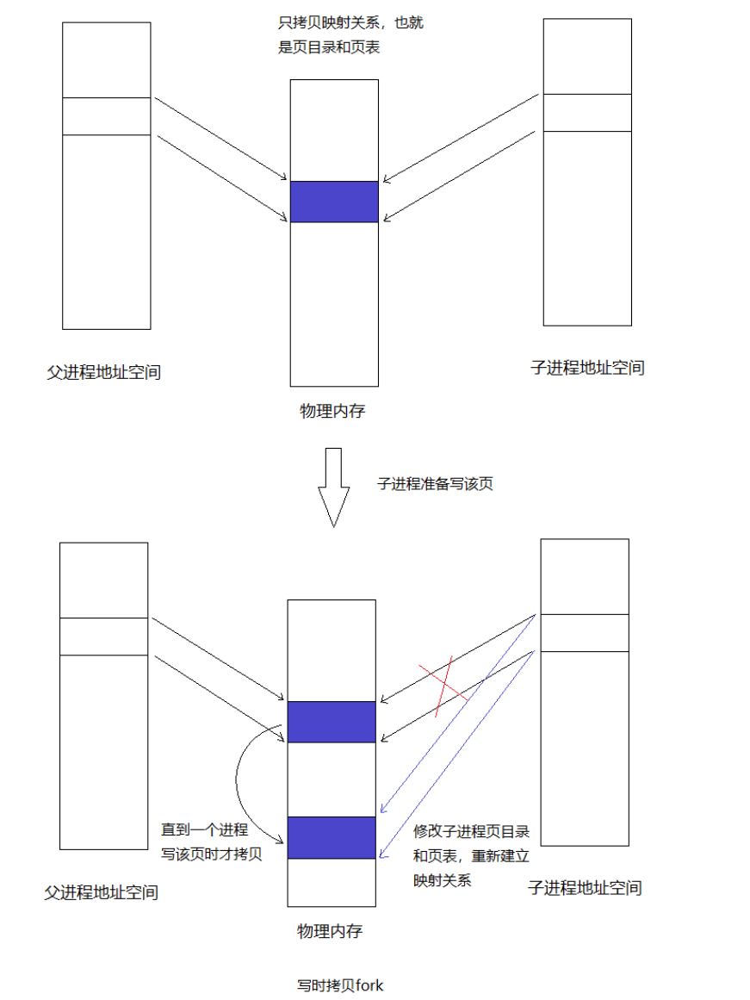

**流程：**

- 使用`set_pgfault_handler()`设置缺页处理函数。

- 调用`sys_exofork()`系统调用，在内核中创建一个Env结构，复制当前用户环境寄存器状态，UTOP以下的页目录还没有建立，新创建的进程还不能直接运行。

- 拷贝父进程的页表和页目录到子进程。对于可写的页，将对应的PTE的PTE_COW位设置为1。

- 为子进程设置`_pgfault_upcall`。

- 将子进程状态设置为ENV_RUNNABLE。

```c
envid_t
fork(void)
{
        // LAB 4: Your code here.
        extern void _pgfault_upcall(void);
		set_pgfault_handler(pgfault);	//设置缺页处理函数
		envid_t envid = sys_exofork();	//系统调用，只是简单创建一个Env结构，复制当前用户环境寄存器状态，UTOP以下的页目录还没有建立
		if (envid == 0) {				//子进程将走这个逻辑
			thisenv = &envs[ENVX(sys_getenvid())];
			return 0;     // 子进程返回0，父进程返回子进程ID
		}
		if (envid < 0) {
			panic("sys_exofork: %e", envid);
		}

		uint32_t addr;
		for (addr = 0; addr < USTACKTOP; addr += PGSIZE) {
			if ((uvpd[PDX(addr)] & PTE_P) && (uvpt[PGNUM(addr)] & PTE_P) && (uvpt[PGNUM(addr)] & PTE_U)) {
				duppage(envid, PGNUM(addr));	//拷贝当前进程映射关系到子进程
			}
		}
    
		int r;
		if ((r = sys_page_alloc(envid, (void *)(UXSTACKTOP-PGSIZE), PTE_P | PTE_W | PTE_U)) < 0)	//为子进程分配异常栈
			panic("sys_page_alloc: %e", r);
    
		sys_env_set_pgfault_upcall(envid, _pgfault_upcall);		//为子进程设置_pgfault_upcall

		if ((r = sys_env_set_status(envid, ENV_RUNNABLE)) < 0)	//设置子进程为ENV_RUNNABLE状态
			panic("sys_env_set_status: %e", r);
    
		return envid;  
}
```


```shell
make grade
...
faultread: OK (1.1s) 
faultwrite: OK (0.9s) 
faultdie: OK (1.0s) 
faultregs: OK (1.1s) 
faultalloc: OK (1.0s) 
faultallocbad: OK (1.0s) 
faultnostack: OK (1.1s) 
faultbadhandler: OK (0.9s) 
faultevilhandler: OK (1.0s) 
forktree: OK (1.0s) 
Part B score: 50/50
...
```


### Part C: Preemptive Multitasking and Inter-Process communication (IPC)

#### Clock Interrupts and Preemption  时钟中断和抢占

为了让内核抢占运行环境，强行夺回对 CPU 的控制，我们必须扩展 JOS 内核以支持来自时钟硬件(clock hardware)的外部硬件中断(**external hardware interrupts**)。

外部中断（External interrupts ,即设备中断, device interrupts）称为 IRQ。在JOS中，只在用户中启用，内核中禁用。

```c
#define IRQ_OFFSET      32      // IRQ 0 corresponds to int IRQ_OFFSET

// Hardware IRQ numbers. We receive these as (IRQ_OFFSET+IRQ_WHATEVER)
#define IRQ_TIMER        0
#define IRQ_KBD          1
#define IRQ_SERIAL       4
#define IRQ_SPURIOUS     7
#define IRQ_IDE         14
#define IRQ_ERROR       19
```

外部中断由 `%eflags` 寄存器的 `FL_IF` 标志位控制，在用户环境运行时在**用户**环境中设置 `FL_IF `标志，以便在中断到达时将其传递给处理器的中断代码处理(**内核**)。

```c
// Eflags register
#define FL_IF           0x00000200      // Interrupt Flag
#define FL_DF           0x00000400      // Direction Flag
#define FL_OF           0x00000800      // Overflow Flag
#define FL_IOPL_MASK    0x00003000      // I/O Privilege Level bitmask
#define FL_IOPL_0       0x00000000      //   IOPL == 0
#define FL_IOPL_1       0x00001000      //   IOPL == 1
#define FL_IOPL_2       0x00002000      //   IOPL == 2
#define FL_IOPL_3       0x00003000      //   IOPL == 3
```

```c
 SETGATE(idt[IRQ_OFFSET + IRQ_TIMER], 0, GD_KT, th_irq_timer, 0);
```

第一个 0 是 `istrap` 字段。如果关闭，CPU 在切换到内核时清除 `%eflags` 中的 FL_IF 位。这就是我们如何强制执行在 JOS 内核中始终禁用中断的规则。

第二个 0 是 `dpl` 字段。如果是 3，则用户程序可以使用 int 指令引发此异常。

**时钟中断(clock interrupts):** 强制控制回到内核，以控制切换到不同的用户环境。


#### Inter-Process communication (IPC)

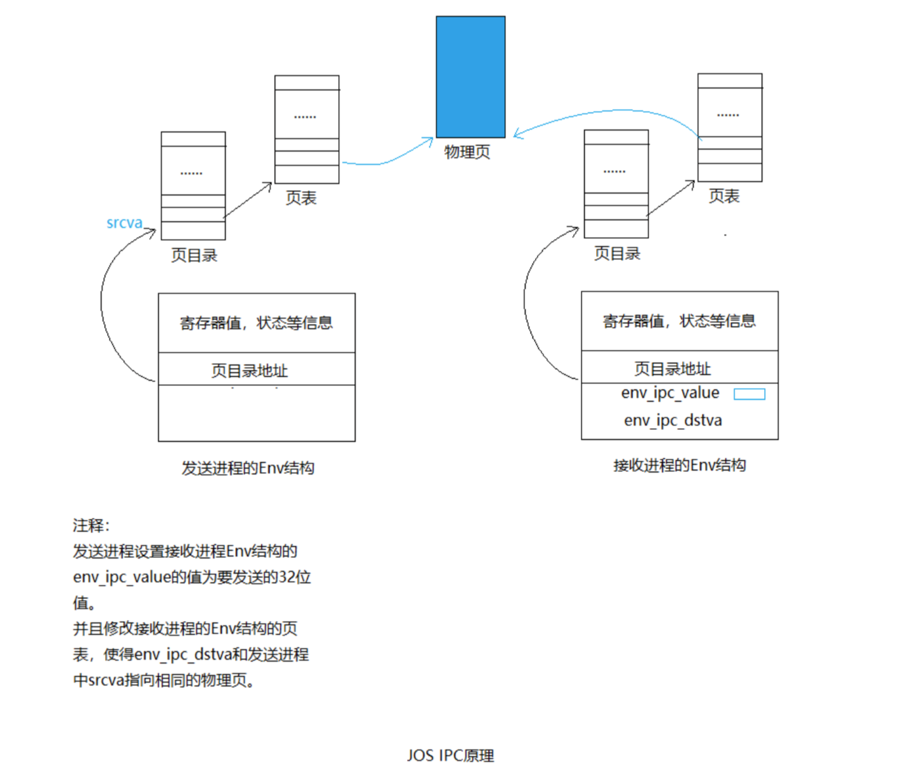

`sys_ipc_recv` 和 `sys_ipc_try_send` : 两个库包装器(library wrappers) `ipc_recv` 和 `ipc_send`。

```c
int32_t
ipc_recv(envid_t *from_env_store, void *pg, int *perm_store)
    
void
ipc_send(envid_t to_env, uint32_t val, void *pg, int perm)
```


```shell
make grade
...
dumbfork: OK (3.0s) 
Part A score: 5/5
...
faultread: OK (2.1s) 
faultwrite: OK (2.1s) 
faultdie: OK (2.1s) 
faultregs: OK (2.1s) 
faultalloc: OK (2.0s) 
faultallocbad: OK (2.9s) 
faultnostack: OK (3.1s) 
faultbadhandler: OK (3.0s) 
faultevilhandler: OK (3.1s) 
forktree: OK (2.2s) 
Part B score: 50/50
...
spin: OK (2.9s) 
stresssched: OK (3.6s) 
sendpage: OK (3.1s) 
pingpong: OK (3.2s) 
primes: OK (6.9s) 
Part C score: 25/25

Score: 80/80
```


## Lab 5: File system, Spawn and Shell

**GOAL：**

-  spawn：加载和运行磁盘可执行文件的库调用
- shell
- 简单的读/写文件系统

### The File System

**Sectors and Blocks**：文件系统的块大小(4096字节)必须是底层磁盘扇区大小(512字节)的倍数。

**Superblocks**： 整个文件系统属性的元数据(meta-data)，始终位于磁盘上的**块 1**。

```c
struct Super {
    	// 幻数：FS_MAGIC
        uint32_t s_magic;               // Magic number: FS_MAGIC
    	// 磁盘上的块总数
        uint32_t s_nblocks;             // Total number of blocks on disk
    	// 根目录节点
        struct File s_root;             // Root directory node
};
```

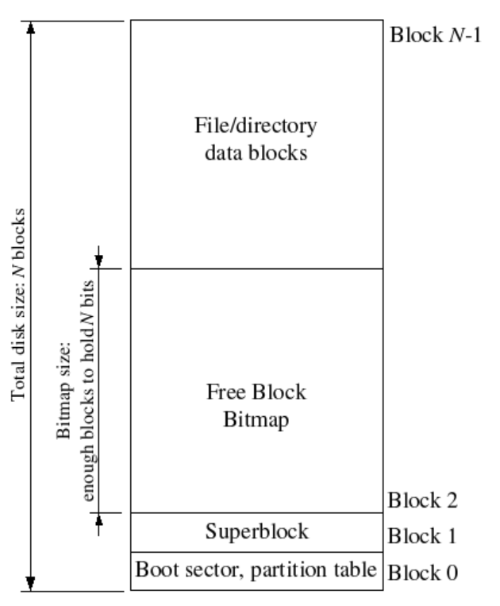

**File Meta-data** 

```c
// Maximum size of a complete pathname, including null
#define MAXPATHLEN      1024

// Number of block pointers in a File descriptor
#define NDIRECT         10
// Number of direct block pointers in an indirect block
#define NINDIRECT       (BLKSIZE / 4)

#define MAXFILESIZE     ((NDIRECT + NINDIRECT) * BLKSIZE)

struct File {
        char f_name[MAXNAMELEN];        // filename
        off_t f_size;                   // file size in bytes
        uint32_t f_type;                // file type

        // Block pointers.
        // A block is allocated iff its value is != 0.
        uint32_t f_direct[NDIRECT];     // direct blocks
        uint32_t f_indirect;            // indirect block

        // Pad out to 256 bytes; must do arithmetic in case we're compiling
        // fsformat on a 64-bit machine.
        uint8_t f_pad[256 - MAXNAMELEN - 8 - 4*NDIRECT - 4];
} __attribute__((packed));      // required only on some 64-bit machines
```

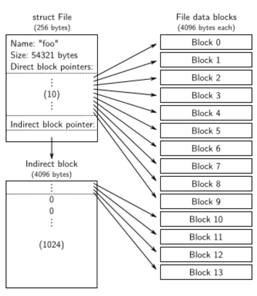

**Disk Access**

由于我们需要访问的所有 IDE 磁盘寄存器都位于 x86 的 I/O 空间中而不是内存映射，因此我们唯一需要为文件系统环境提供“**I/O 特权**”以便允许文件系统访问这些寄存器。

```c
// Eflags register
#define FL_IOPL_MASK    0x00003000      // I/O Privilege Level bitmask  
```

**The Block Cache**

从` 0x10000000 `(DISKMAP) 到 `0xD0000000` (DISKMAP+DISKMAX)，作为磁盘的“内存映射”版本。

**请求分页**(demand paging)：只在磁盘映射区域中分配页面，并从磁盘中读取相应的块以响应此区域中的页面错误。这样，我们就可以假装整个磁盘都在内存中。

`bc_pgfault` -- 从磁盘加载页面以响应页面错误

`flush_block` 将一个块写入磁盘。

**The Block Bitmap** 

```c
bool block_is_free(uint32_t blockno);
void free_block(uint32_t blockno);
int alloc_block(void); // 轮询
```


#### File Operations

- **Super block**

```c
void check_super(void);
```

- **Free block bitmap**

```c
bool block_is_free(uint32_t blockno);
bool block_is_free(uint32_t blockno);
void free_block(uint32_t blockno);
int alloc_block(void);
void check_bitmap(void);
```

- **File system structures**

```c
// Initialize the file system
void fs_init(void);
static int file_block_walk(struct File *f, uint32_t filebno, uint32_t **ppdiskbno, bool alloc);
int file_get_block(struct File *f, uint32_t filebno, char **blk);
static int dir_lookup(struct File *dir, const char *name, struct File **file);
static int dir_alloc_file(struct File *dir, struct File **file);
static int walk_path(const char *path, struct File **pdir, struct File **pf, char *lastelem);
```

- **File operations**

```c
int file_create(const char *path, struct File **pf);
int file_open(const char *path, struct File **pf);
ssize_t file_read(struct File *f, void *buf, size_t count, off_t offset);
static int file_free_block(struct File *f, uint32_t filebno);
static void file_truncate_blocks(struct File *f, off_t newsize);
void file_flush(struct File *f);
```


**BUG:**

```shell
make grade
...
fs/fs.c: In function ‘file_block_walk’:
fs/fs.c:152:24: error: taking address of packed member of ‘struct File’ may result in an unaligned pointer value [-Werror=address-of-packed-member]
  152 |           *ppdiskbno = &(f->f_direct[filebno]);
      |                        ^~~~~~~~~~~~~~~~~~~~~~~
cc1: all warnings being treated as errors
...
```

```c
struct File {
        char f_name[MAXNAMELEN];        // filename
        off_t f_size;                   // file size in bytes
        uint32_t f_type;                // file type

        // Block pointers.
        // A block is allocated iff its value is != 0.
        uint32_t f_direct[NDIRECT];     // direct blocks
        uint32_t f_indirect;            // indirect block

        // Pad out to 256 bytes; must do arithmetic in case we're compiling
        // fsformat on a 64-bit machine.
        uint8_t f_pad[256 - MAXNAMELEN - 8 - 4*NDIRECT - 4];
} __attribute__((packed));   // required only on some 64-bit machines
```


#### The file system interface

##### RPC机制

```c
   Regular env           FS env
   +---------------+   +---------------+
   |      read     |   |   file_read   |
   |   (lib/fd.c)  |   |   (fs/fs.c)   |
...|.......|.......|...|.......^.......|...............
   |       v       |   |       |       | RPC mechanism
   |  devfile_read |   |  serve_read   |
   |  (lib/file.c) |   |  (fs/serv.c)  |
   |       |       |   |       ^       |
   |       v       |   |       |       |
   |     fsipc     |   |     serve     |
   |  (lib/file.c) |   |  (fs/serv.c)  |
   |       |       |   |       ^       |
   |       v       |   |       |       |
   |   ipc_send    |   |   ipc_recv    |
   |       |       |   |       ^       |
   +-------|-------+   +-------|-------+
           |                   |
           +-------------------+
```


### Spawning Processes

**作用：**创建一个新环境，将文件系统中的程序映像加载到其中，然后启动运行该程序的子环境。然后父进程独立于子进程继续运行。 `spawn` 函数的作用类似于 UNIX 中的 `fork`，然后是子进程中的立即 `exec`。

**流程：**

- 从文件系统打开`prog`程序文件

- 调用系统调用`sys_exofork()`创建一个新的Env结构

- 调用系统调用`sys_env_set_trapframe()`，设置新的Env结构的`Trapframe`字段（该字段包含寄存器信息）。

- 根据ELF文件中program herder，将用户程序以Segment读入内存，并映射到指定的线性地址处。

- 调用系统调用`sys_env_set_status()`设置新的Env结构状态为ENV_RUNNABLE。


### Shell

每当 shell 执行一个新命令时，它就会生成一个子 shell 并让子 shell 执行命令。此行为是通过 `fork` 和 `execlp `系统调用实现的。如果shell 收到`;`作为命令分隔符或不接收分隔符，它必须等待生成的子进程终止，这是通过`wait`系统调用实现的。如果它接收`&`作为命令分隔符，它就不必等待子进程终止。如果 shell 收到一系列命令，每个命令都用`|`连接，它必须递归地创建与命令编号相同的子级。哪个子进程执行哪个命令有点棘手。最远的后代将执行第一个命令，孙子将执行第二个最后一个命令，子代将执行最后一个命令。它们的标准输入和输出必须相应地使用`pipe`和 `dup2` 系统调用间接进行。下面的图片描述了如何执行`who | wc -l`，以及如何使用`pipe`系统调用。

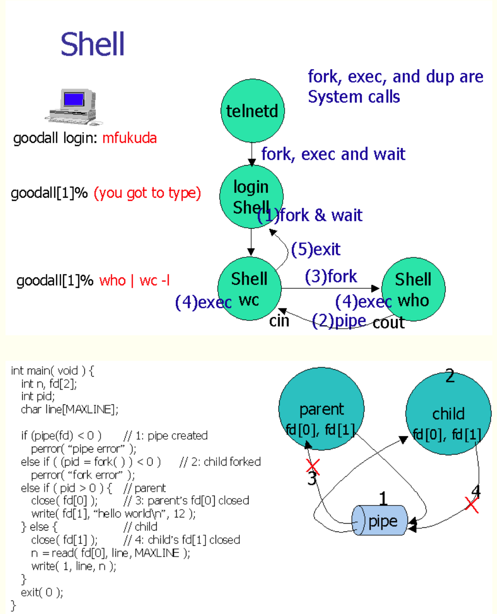


```shell
make grade
...
internal FS tests [fs/test.c]: OK (0.8s) 
  fs i/o: OK 
  check_bc: OK 
  check_super: OK 
  check_bitmap: OK 
  alloc_block: OK 
  file_open: OK 
  file_get_block: OK 
  file_flush/file_truncate/file rewrite: OK 
testfile: OK (1.5s) 
  serve_open/file_stat/file_close: OK 
  file_read: OK 
  file_write: OK 
  file_read after file_write: OK 
  open: OK 
  large file: OK 
spawn via spawnhello: OK (0.7s) 
    (Old jos.out.spawn failure log removed)
Protection I/O space: OK (0.8s) 
PTE_SHARE [testpteshare]: OK (1.1s) 
PTE_SHARE [testfdsharing]: OK (0.9s) 
start the shell [icode]: Timeout! OK (30.5s) 
testshell: OK (1.6s) 
primespipe: OK (3.6s) 
Score: 150/150
```

