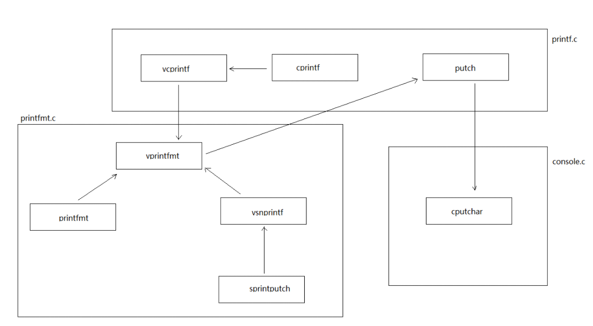

[TOC]

# Lab 1: Booting a PC

**LAB TARGET**

- Part1

  - getting familiarized with x86 assembly language(熟悉x86汇编语言)
  - the QEMU x86 emulator (熟悉QEMU模拟器)
  - the PC's power-on bootstrap procedure （熟悉开机自举程序）

- Part2

  -  examines the boot loader for 6.828 kernel, which resides in the `boot` directory of the `lab` tree (内核引导程序)

- Part3

  delves into the initial template for our 6.828 kernel itself, named JOS, which resides in the `kernel` directory (深入研究内核初始模板)


## 实验环境配置

```shell
# 查看机器是否符合实验要求
uname -a
Linux ubuntu 5.8.0-59-generic #66~20.04.1-Ubuntu SMP Thu Jun 17 11:14:10 UTC 2021 x86_64 x86_64 x86_64 GNU/Linux

输出信息应该有： i386 GNU/Linux or i686 GNU/Linux or x86_64 GNU/Linux

# clone lab 在自己想放的文件夹中
git clone https://pdos.csail.mit.edu/6.828/2018/jos.git lab

# 查看
llf@ubuntu:~/6.828$ cd lab
llf@ubuntu:~/6.828/lab$ ls
boot    conf  GNUmakefile  gradelib.py  kern  mergedep.pl
CODING  fs    grade-lab1   inc          lib   user

# 进入lab编译源码
cd lab
make 
# 模拟器运行
make qemu
```

进入界面


**查看信息**

```shell
# help ---- 查看帮助信息
# kerninfo  --- 查看内核信息
K> kerninfo
Special kernel symbols:
entry f010000c (virt) 0010000c (phys)
etext f0101a75 (virt) 00101a75 (phys)
edata f0112300 (virt) 00112300 (phys)
end f0112960 (virt) 00112960 (phys)
Kernel executable memory footprint: 75KB
```


## Git Study  ---- 版本控制

[Linux安装git及使用](https://blog.csdn.net/qq_42690368/article/details/82319238?ops_request_misc=%257B%2522request%255Fid%2522%253A%2522162676626116780366579727%2522%252C%2522scm%2522%253A%252220140713.130102334..%2522%257D&request_id=162676626116780366579727&biz_id=0&utm_medium=distribute.pc_search_result.none-task-blog-2~all~sobaiduend~default-1-82319238.pc_search_result_control_group&utm_term=Linux+git&spm=1018.2226.3001.4187)

```shell
# 安装git
sudo apt install git

# 配置git账号
git config --global user.name "git的用户名"
git config --global user.email "git的邮箱"
```


```git
# create a new repository on the command line
echo "# 6.828" >> README.md
git init
git add README.md
git commit -m "first commit"
git branch -M main
git remote add origin https://github.com/lif314/6.828.git
git push -u origin main

# push an existing repository from the command line
git remote add origin https://github.com/lif314/6.828.git
git branch -M main
git push -u origin main
```

**常用命令**

```shell
# 提交
git add "filename"

git commit -m "提交信息"

git push -u origin master  # push
```


## Part1: PC Bootstrap  PC引导程序

**Purpose**

- x86 assembly language   ----- GNU 汇编程序
- PC bootstrap process
- QEMU & QEMU/GDB debugging

### Getting Started with x86 assembly

#### Exercise 1 : 熟悉x86汇编语言

- AT&T assembly syntax ------- AT&T 汇编语法

- Brennan's Guide to Inline Assembly ------ Brennan 内联汇编指南


**REF**

《x86汇编语言：从实模式到保护模式》

- 二进制 --- 电路状态

高电平----- 1      低电平----- 0

- 十六进制   ---- 缩小比特串

  

- **寄存器和算术逻辑单元**

                          寄存器是双向器件，可以在一端接受输入并加以锁存，同时，它会向另一端产生一摸一样的输出。与寄存器RA和RB相连的是算术逻辑单元（ALU)，专门负责运算的电路。处理器中含控制器，调度总线等资源。

  1 byte = 8 bit   1 word = 2 byte = 16 bit（16位寄存器） 1 double word（32位寄存器)

  

- **内存储器**


内存按照字节来组织，单次访问的最小单位是1 byte， 每个存储单元中是一个字节(0...7)。内存中每个字节对应一个地址(0000H)

- **指令和指令集**


低端字节序(Little Endian)：如果访问内存中的一个字，高字节位位于高地址部分，低字节位于低地址部分。

代码区：存放指令       数据区：存放数据

- **Intel 8086处理器**

  - 8086通用寄存器

  8个16位通用寄存器：AX, BX, CX, DX, SI, DI, BP, SP

  

  - 程序的重定位 ------- 内存分段机制

  代码段：将完成某个工作的指令集中放在内存某个位置

  数据段：程序执行需要的数据存放的位置

  

只要所有指令在内存是连续存放的，代码段位于内存中的什么地方都可以正常执行。


**内存的分段机制**


段地址+偏移地址

段寄存器：代码段寄存器(Code Segment,CS)  数据段寄存器(Data Segment, DS)

**当处理器访问内存时，指令中的地址被看作段内的偏移地址，而不是物理地址**


- 8086的内存分段机制

  

**16字节对齐**：起始地址都是16的倍数


- **Assembly Language** ------  AT&T 汇编语法

  - 对大小写没有要求

  - 16进制： H后缀 0x前缀  ------ 3fh  === 0x3f  ==== 63 ==== 00111111B

  - 汇编语法

    | Function                                                     | AT&T                                                         | Intel                                                        |
    | :----------------------------------------------------------- | ------------------------------------------------------------ | :----------------------------------------------------------- |
    | AT&T : 寄存器名要加上 '%' 作为前缀 <br />Intel : 寄存器名不需要加前缀 | pushl %eax                                                   | push eax                                                     |
    | AT&T : 用 '$' 前缀表示一个立即操作数 <br />Intel : 立即数的表示不用带任何前缀 | pushl $1                                                     | push 1                                                       |
    | 源操作数和目标操作数的位置正好相反 <br />Intel : 目标操作数在源操作数的左边 <br />AT&T : 目标操作数在源操作数的右边 | addl $1, %eax                                                | add eax 1                                                    |
    | AT&T: 操作数的字长由操作符的最后一个字母决定<br />后缀'b'、'w'、'l'分别表示操作数为字节（byte，8 比特）<br />        字（word，16 比特）和长字（long，32比特<br /> Intel : 操作数的字长是用 "byte ptr" 和 "word ptr" 等前缀来表示的。 | movb val, %al                                                | mov al, byte ptr val                                         |
    | AT&T : 绝对转移和调用指令（jump/call）的操作数前要加上'*'作为前缀<br /> Intel : 不需要 | ljump $section, $offset                                      | jmp far section:offset                                       |
    | 远程转移指令和远程子调用指令的操作码 <br />AT&T :  "ljump" 和 "lcall"<br />Intel ： "jmp far" 和 "call far" | lcall $section, $offset                                      | call far section:offset                                      |
    | 远程返回指令                                                 | lret $stack_adjust                                           | ret far stack_adjust                                         |
    | 内存操作数寻址方式                                           | section:disp(base, index, scale)                             | section:[base + index*scale + disp]                          |
    | 内存操作数实例                                               | movl -4(%ebp), %eax<br />movl array(, %eax, 4), %eax<br />movw array(%ebx, %eax, 4), %cx<br />movb $4, %fs:(%eax) | mov eax, [ebp - 4]<br /> mov eax, [eax*4 + array]<br /> mov cx, [ebx + 4*eax + array]<br />mov fs:eax, 4 |

  - Hello World

    在 Linux 操作系统中，你有很多办法可以实现在屏幕上显示一个字符串，但最简洁的方式是使用 Linux 内核提供的系统调用。使用这种方法最大的好处是可以直接和操作系统的内核进行通讯，不需要链接诸如 libc 这样的函数库，也不需要使用 ELF 解释器，因而代码尺寸小且执行速度快。

    Linux 是一个运行在保护模式下的 32 位操作系统，采用 flat memory 模式，目前最常用到的是 ELF 格式的二进制代码。一个 ELF 格式的可执行程序通常划分为如下几个部分：`.text`、`.data` 和 `.bss`，其中 `.text` 是只读的代码区，`.data` 是可读可写的数据区，而 `.bss` 则是可读可写且没有初始化的数据区。代码区和数据区在 ELF 中统称为 section，根据实际需要你可以使用其它标准的 section，也可以添加自定义 section，但一个 ELF 可执行程序至少应该有一个 `.text` 部分。

    ```assembly
    # AT&T 格式
    #hello.s
    .data                              # 数据段声明
                    msg : .string "Hello, world!\\n" # 要输出的字符串
                    len = . - msg      # 字串长度
    .text                              # 代码段声明
    .global _start                     # 指定入口函数
    _start:                            # 在屏幕上显示一个字符串
                    movl $len, %edx    # 参数三：字符串长度
                    movl $msg, %ecx    # 参数二：要显示的字符串
                    movl $1, %ebx      # 参数一：文件描述符(stdout)
                    movl $4, %eax      # 系统调用号(sys_write)
                    int    $0x80       # 调用内核功能
                                       # 退出程序
                    movl $0,%ebx       # 参数一：退出代码
                    movl $1,%eax       # 系统调用号(sys_exit)
                    int    $0x80       # 调用内核功能
    ```

    ```assembly
    ; Intel
    ; hello.asm
    section .data                        ; 数据段声明
                    msg db "Hello, world!", 0xA         ; 要输出的字符串
                    len equ $ - msg      ; 字串长度
    section .text                        ; 代码段声明
    global _start                        ; 指定入口函数
    _start:                              ; 在屏幕上显示一个字符串
                    mov edx, len         ; 参数三：字符串长度
                    mov ecx, msg         ; 参数二：要显示的字符串
                    mov ebx, 1           ; 参数一：文件描述符(stdout)
                    mov eax, 4           ; 系统调用号(sys_write)
                    int 0x80             ; 调用内核功能
                                         ; 退出程序
                    mov ebx, 0           ; 参数一：退出代码
                    mov eax, 1           ; 系统调用号(sys_exit)
                    int 0x80             ; 调用内核功能
    ```

    

### Simulating the x86

- **GNU Debugger(GDB)**      

```shell
# 查看帮助文档
man gdb


						gdb - The GNU Debugger

Synopsis
gdb
[-help] [-nx] [-q] [-batch] [-cd=dir] [-f] [-b bps] [-tty=dev] [-s symfile] [-e prog] [-se prog] [-c core] [-x cmds] [-d dir] [prog[core|procID]]

Description
The purpose of a debugger such as GDB is to allow you to see what is going on ''inside'' another program while it executes-or what another program was doing at the moment it crashed.

# 四大功能
GDB can do four main kinds of things (plus other things in support of these) to help you catch bugs in the act:
	- Start your program, specifying anything that might affect its behavior. # 启动您的程序，指定可能影响其行为的任何内容
	- Make your program stop on specified conditions. # 使您的程序在指定条件下停止。
	- Examine what has happened, when your program has stopped.# 检查发生了什么，当您的程序停止时
	- Change things in your program, so you can experiment with correcting the effects of one bug and go on to learn about another. # 更改程序中的内容，以便您可以尝试纠正一个错误的影响并继续了解另一个错误。

# gdb支持的语言
You can use GDB to debug programs written in C, C++, and Modula-2. Fortran support will be added when a GNU Fortran compiler is ready.
GDB is invoked with the shell command gdb. Once started, it reads commands from the terminal until you tell it to exit with the GDB command quit. You can get online help from gdb itself by using the command help.

# 运行命令
You can run gdb with no arguments or options; but the most usual way to start GDB is with one argument or two, specifying an executable program as the argument:

gdb program   # 无参数运行

You can also start with both an executable program and a core file specified:

gdb program core   # 参数为核心文件

You can, instead, specify a process ID as a second argument, if you want to debug a running process:

gdb program 1234  # 参数为指定进程的ID

would attach GDB to process 1234 (unless you also have a file named '1234'; GDB does check for a core file first).

# gdb常用命令
Here are some of the most frequently needed GDB commands:

break [file:]function    # 中断函数 ---- 设置断点
Set a breakpoint at function (in file).  

run [arglist]      # 运行
Start your program (with arglist, if specified).   

bt      # 显示程序堆栈
Backtrace: display the program stack.   

print expr   # 显示表达式的值
Display the value of an expression.

c     # 继续执行，在断点后执行
Continue running your program (after stopping, e.g. at a breakpoint).

next  # 执行下一个程序行（停止后）；跳过该行中的任何函数调用

Execute next program line (after stopping); step over any function calls in the line.

edit [file:]function   # 查看当前停止的程序行
look at the program line where it is presently stopped.

list [file:]function  # 在当前停止的位置附近键入程序的文本
type the text of the program in the vicinity of where it is presently stopped.

step    # 执行下一个程序行（停止后）；进入该行中的任何函数调用
Execute next program line (after stopping); step into any function calls in the line.

help [name]  # 帮助信息
Show information about GDB command name, or general information about using GDB.
 
quit  # 退出gdb
Exit from GDB.

For full details on GDB, see Using GDB: A Guide to the GNU Source-Level Debugger, by Richard M. Stallman and Roland H. Pesch. The same text is available online as the gdb entry in the info program.
Options
Any arguments other than options specify an executable file and core file (or process ID); that is, the first argument encountered with no associated option flag is equivalent to a '-se' option, and the second, if any, is equivalent to a '-c' option if it's the name of a file. Many options have both long and short forms; both are shown here. The long forms are also recognized if you truncate them, so long as enough of the option is present to be unambiguous. (If you prefer, you can flag option arguments with '+' rather than '-', though we illustrate the more usual convention.)

All the options and command line arguments you give are processed in sequential order. The order makes a difference when the '-x' option is used.

# 所有命令
-help
-h

List all options, with brief explanations.

-symbols=file
-s file
Read symbol table from file file.
-write
Enable writing into executable and core files.

-exec=file
-e file
Use file file as the executable file to execute when appropriate, and for examining pure data in conjunction with a core dump.
-se=file
Read symbol table from file file and use it as the executable file.
-core=file
-c file
Use file file as a core dump to examine.
-command=file
-x file
Execute GDB commands from file file.
-directory=directory
-d directory
Add directory to the path to search for source files.
-nx
-n

Do not execute commands from any '.gdbinit' initialization files. Normally, the commands in these files are executed after all the command options and arguments have been processed.

-quiet

-q

''Quiet''. Do not print the introductory and copyright messages. These messages are also suppressed in batch mode.

-batch

Run in batch mode. Exit with status 0 after processing all the command files specified with '-x' (and '.gdbinit', if not inhibited). Exit with nonzero status if an error occurs in executing the GDB commands in the command files.

Batch mode may be useful for running GDB as a filter, for example to download and run a program on another computer; in order to make this more useful, the message
Program exited normally.
(which is ordinarily issued whenever a program running under GDB control terminates) is not issued when running in batch mode.

-cd=directory
Run GDB using directory as its working directory, instead of the current directory.
-fullname
-f
Emacs sets this option when it runs GDB as a subprocess. It tells GDB to output the full file name and line number in a standard, recognizable fashion each time a stack frame is displayed (which includes each time the program stops). This recognizable format looks like two ' 32' characters, followed by the file name, line number and character position separated by colons, and a newline. The Emacs-to-GDB interface program uses the two ' 32' characters as a signal to display the source code for the frame.

-b bps

Set the line speed (baud rate or bits per second) of any serial interface used by GDB for remote debugging.

-tty=device
Run using device for your program's standard input and output.
```


**gdb使用实例**

编写hello.c程序

```c++
#include <iostream>
using namespace std;
int main(){
        cout << "hello world" << endl;
        return 0;
}
```

编译，-g 表示可以调试

```shell
g++ -g hello.c -o hello  # C使用gcc
```

启动gdb调试

```shell
gdb hello
gdb -q hello # 不打印版本信息

For help, type "help".
Type "apropos word" to search for commands related to "word"...
Reading symbols from hello...
(gdb)

# 查看源码
list (l)  # 默认10行，回车键继续

(gdb) l
1       #include <iostream>
2       using namespace std;
3       int main(){
4               cout << "hello world" << endl;
5               return 0;
6       }
7

# 运行程序
run (r)    # 运程序直到遇到 结束或者遇到断点等待下一个命令

(gdb) r
Starting program: /home/lilinfei/hello
hello world
[Inferior 1 (process 58) exited normally]

# 设置断点
break (b) 行号   # 在某行设置断点
info breakpoints # 显示断点信息
Num # 断点编号
Disp # 断点执行一次后是否有效  keep:有效    dis 无效
End # 当前断点是否有效   y | n
Address # 内存地址
What # 位置

(gdb) b 3
Breakpoint 1 at 0x11a9: file hello.c, line 3.
(gdb) b 4
Breakpoint 2 at 0x11b1: file hello.c, line 4.


(gdb) info breakpoints
Num     Type           Disp Enb Address            What
1       breakpoint     keep y   0x00000000000011a9 in main()
                                                   at hello.c:3
2       breakpoint     keep y   0x00000000000011b1 in main()
                                                   at hello.c:4
# 单步执行
continue (c)  # 继续执行
step (s)   # 执行下一个程序行（停止后）；进入该行中的任何函数调用   
next  (n)  # 执行下一个程序行（停止后）；跳过该行中的任何函数调用                                             
# 查看变量
print 变量名   # 查看值
whatis 变量名  # 查看类型

# 退出
quit (q)
```


**gdb命令**

运行命令

```
run：简记为 r ，其作用是运行程序，当遇到断点后，程序会在断点处停止运行，等待用户输入下一步的命令。
continue （简写c ）：继续执行，到下一个断点处（或运行结束）
next：（简写 n），单步跟踪程序，当遇到函数调用时，也不进入此函数体；此命令同 step 的主要区别是，step 遇到用户自定义的函数，将步进到函数中去运行，而 next 则直接调用函数，不会进入到函数体内。
step （简写s）：单步调试如果有函数调用，则进入函数；与命令n不同，n是不进入调用的函数的
until：当你厌倦了在一个循环体内单步跟踪时，这个命令可以运行程序直到退出循环体。
until+行号： 运行至某行，不仅仅用来跳出循环
finish： 运行程序，直到当前函数完成返回，并打印函数返回时的堆栈地址和返回值及参数值等信息。
call 函数(参数)：调用程序中可见的函数，并传递“参数”，如：call gdb_test(55)
quit：简记为 q ，退出gdb
```

设置断点

```
break n （简写b n）:在第n行处设置断点
（可以带上代码路径和代码名称： b OAGUPDATE.cpp:578）
b fn1 if a＞b：条件断点设置
break func（break缩写为b）：在函数func()的入口处设置断点，如：break cb_button
delete 断点号n：删除第n个断点
disable 断点号n：暂停第n个断点
enable 断点号n：开启第n个断点
clear 行号n：清除第n行的断点
info b （info breakpoints） ：显示当前程序的断点设置情况
delete breakpoints：清除所有断点：
```

查看源码

```
list ：简记为 l ，其作用就是列出程序的源代码，默认每次显示10行。
list 行号：将显示当前文件以“行号”为中心的前后10行代码，如：list 12
list 函数名：将显示“函数名”所在函数的源代码，如：list main
list ：不带参数，将接着上一次 list 命令的，输出下边的内容。
```

打印表达式

```
print 表达式：简记为 p ，其中“表达式”可以是任何当前正在被测试程序的有效表达式，比如当前正在调试C语言的程序，那么“表达式”可以是任何C语言的有效表达式，包括数字，变量甚至是函数调用。
print a：将显示整数 a 的值
print ++a：将把 a 中的值加1,并显示出来
print name：将显示字符串 name 的值
print gdb_test(22)：将以整数22作为参数调用 gdb_test() 函数
print gdb_test(a)：将以变量 a 作为参数调用 gdb_test() 函数
display 表达式：在单步运行时将非常有用，使用display命令设置一个表达式后，它将在每次单步进行指令后，紧接着输出被设置的表达式及值。如： display a
watch 表达式：设置一个监视点，一旦被监视的“表达式”的值改变，gdb将强行终止正在被调试的程序。如： watch a
whatis ：查询变量或函数
info function： 查询函数
扩展info locals： 显示当前堆栈页的所有变量
```

查看运行信息

```
where/bt ：当前运行的堆栈列表；
bt backtrace 显示当前调用堆栈
up/down 改变堆栈显示的深度
set args 参数:指定运行时的参数
show args：查看设置好的参数
info program： 来查看程序的是否在运行，进程号，被暂停的原因。
```

分割窗口

```
layout：用于分割窗口，可以一边查看代码，一边测试：
layout src：显示源代码窗口
layout asm：显示反汇编窗口
layout regs：显示源代码/反汇编和CPU寄存器窗口
layout split：显示源代码和反汇编窗口
Ctrl + L：刷新窗口
```

cgdb

```
cgdb主要功能是在调试时进行代码的同步显示，这无疑增加了调试的方便性，提高了调试效率。界面类似vi，符合unix/linux下开发人员习惯;如果熟悉gdb和vi，几乎可以立即使用cgdb。
```


- **build the minimal 6.828 boot loader and kernel** (构建加载程序和内核)

  - lab tree (便于看清楚项目框架)

  ```shell
  ├── boot 
  │   ├── boot.S
  │   ├── main.c
  │   ├── Makefrag
  │   └── sign.pl
  ├── CODING
  ├── conf
  │   ├── env.mk
  │   └── lab.mk
  ├── fs
  │   ├── test.c
  │   └── testshell.key
  ├── GNUmakefile   # makefile文件
  ├── grade-lab1
  ├── gradelib.py
  ├── inc
  │   ├── assert.h
  │   ├── COPYRIGHT
  │   ├── elf.h
  │   ├── error.h
  │   ├── kbdreg.h
  │   ├── memlayout.h
  │   ├── mmu.h
  │   ├── stab.h
  │   ├── stdarg.h
  │   ├── stdio.h
  │   ├── string.h
  │   ├── types.h
  │   └── x86.h
  ├── kern
  │   ├── console.c
  │   ├── console.h
  │   ├── COPYRIGHT
  │   ├── entrypgdir.c
  │   ├── entry.S
  │   ├── init.c
  │   ├── kdebug.c
  │   ├── kdebug.h
  │   ├── kernel.ld
  │   ├── Makefrag
  │   ├── monitor.c
  │   ├── monitor.h
  │   └── printf.c
  ├── lib
  │   ├── printfmt.c
  │   ├── readline.c
  │   └── string.c
  ├── mergedep.pl
  ├── obj
  │   ├── boot
  │   │   ├── boot   # 引导加载程序
  │   │   ├── boot.asm
  │   │   ├── boot.o
  │   │   ├── boot.out
  │   │   └── main.o
  │   └── kern   # 内核
  │       ├── console.o
  │       ├── entry.o
  │       ├── entrypgdir.o
  │       ├── init.o
  │       ├── kdebug.o
  │       ├── kernel
  │       ├── kernel.asm
  │       ├── kernel.img   # 虚拟硬盘：包含引导加载程序和内核
  │       ├── kernel.sym
  │       ├── monitor.o
  │       ├── printfmt.o
  │       ├── printf.o
  │       ├── readline.o
  │       └── string.o
  └── user
      └── sendpage.c
  
  
  ```
  
  

```shell
# 编译JOS
cd lab
make  # make的作用: 根据makefile编译链接文件之间的依赖关系

+ as kern/entry.S
+ cc kern/entrypgdir.c
+ cc kern/init.c
+ cc kern/console.c
+ cc kern/monitor.c
+ cc kern/printf.c
+ cc kern/kdebug.c
+ cc lib/printfmt.c
+ cc lib/readline.c
+ cc lib/string.c
+ ld obj/kern/kernel
+ as boot/boot.S
+ cc -Os boot/main.c
+ ld boot/boot
boot block is 380 bytes (max 510)
+ mk obj/kern/kernel.img  # 虚拟硬盘

# obj/kern/kernel.img 作为模拟 PC 的“虚拟硬盘”的内容。这个硬盘映像包含我们的引导加载程序（obj/boot/boot）和内核（obj/kernel） 


# 查看makefile
#
# This makefile system follows the structuring conventions
# recommended by Peter Miller in his excellent paper:
#
#       Recursive Make Considered Harmful
#       http://aegis.sourceforge.net/auug97.pdf
#

# Cross-compiler jos toolchain
#
# This Makefile will automatically use the cross-compiler toolchain
# installed as 'i386-jos-elf-*', if one exists.  If the host tools ('gcc',
# 'objdump', and so forth) compile for a 32-bit x86 ELF target, that will
# be detected as well.  If you have the right compiler toolchain installed
# using a different name, set GCCPREFIX explicitly in conf/env.mk
```

**make&makefile**

文件和文件间或模块或模块间有可能存在倚赖关系，make命令也是依据这种依赖关系来进行维护的，所以我们有必要了解什么是依赖关系；make命令当然不会自己知道这些依赖关系，而需要程序员将这些依赖关系写入一个叫makefile的文件中。Makefile文件中包含着一些目标，通常目标就是文件名，对每一个目标，提供了实现这个目标的一组命令以及和这个目标有依赖关系的其他目标或文件名。

make和makefile的关系是：**make是一个命令工具，是一个解释makefile中指令的命令工具，**一般来说，大多数的IDE都有这个命令


makefile的产生：

对于很大的项目来说，自己手写Makefile非常麻烦，而标准的GNU软件（如Apacle）都是运行一个configure脚本文件来产生Makefile；GNU软件automake和autoconf就是自动生成configure的工具。开发人员只需要先定义好宏，automake处理后会产生供autoconf使用的Makefine.in，再用autoconf就可以产生configure。


make 命令：

**make**

根据Makefile文件编译源代码、连接、生成目标文件、可执行文件。 
 **make clean** 
 清除上次的make命令所产生的object文件（后缀为“.o”的文件）及可执行文件。 
 **make install** 
 将编译成功的可执行文件安装到系统目录中，一般为/usr/local/bin目录。 
 **make dist** 
 产生发布软件包文件（即distribution package）。这个命令将会将可执行文件及相关文件打包成一个tar.gz压缩的文件用来作为发布软件的软件包。 它会在当前目录下生成一个名字类似“PACKAGE-VERSION.tar.gz”的文件。PACKAGE和VERSION,是我们在configure.in中定义的AM_INIT_AUTOMAKE（PACKAGE, VERSION）。 
 **make distcheck** 
 生成发布软件包并对其进行测试检查，以确定发布包的正确性。这个操作将自动把压缩包文件解开，然后执行configure命令，并且执行make,来确认编译不出现错误，最后提示你软件包已经准备好，可以发布了。 
 **make distclean** 
 类似make clean,但同时也将configure生成的文件全部删除掉，包括Makefile文件。 


```shell
# 启动qemu --- 需要设置硬盘和直接串行端口输出到终端
make qemu  

make qemu-nox # 没有虚拟VGA(QEMU window)的情况下使用串行控制台

Booting from Hard Disk...   # 从硬盘启动
6828 decimal is XXX octal!  # JOS内核框架
entering test_backtrace 5
entering test_backtrace 4
entering test_backtrace 3
entering test_backtrace 2
entering test_backtrace 1
entering test_backtrace 0
leaving test_backtrace 0
leaving test_backtrace 1
leaving test_backtrace 2
leaving test_backtrace 3
leaving test_backtrace 4
leaving test_backtrace 5
Welcome to the JOS kernel monitor!
Type 'help' for a list of commands.
K>    # 内核中的小监视器或交互式控制程序打印的提示

# 内核监视器的初始命令 -- help & kerninfo
K> help   # 帮助信息
help - display this list of commands
kerninfo - display information about the kernel

K> kerninfo   # 内核信息
Special kernel symbols:
  entry  f010000c (virt)  0010000c (phys) # 入口地址信息
  etext  f0101a75 (virt)  00101a75 (phys) # 代码段
  edata  f0112300 (virt)  00112300 (phys) # 数据段
  end    f0112960 (virt)  00112960 (phys) 
Kernel executable memory footprint: 75KB # 内核可执行内存占用：75KB
#kerninfo: 尽管很简单，但重要的是要注意这个内核监视器“直接”在模拟 PC 的“原始（虚拟）硬件”上运行。这意味着您应该能够将 obj/kern/kernel.img 的内容复制到真实硬盘的前几个扇区，将该硬盘插入真实 PC，打开它，然后看到完全相同的内容就像您在 QEMU 窗口中所做的那样，PC 的真实屏幕。 （不过，我们不建议您在硬盘上有有用信息的真机上执行此操作，因为将 kernel.img 复制到其硬盘的开头会破坏主引导记录和第一个分区的开头，有效地导致以前硬盘上的所有内容都丢失了！）
```

### The PC's Physical Address Space -- PC启动

- PC物理地址空间


- PC的物理地址空间是硬连线的(hard-wired)
- 0x00000000-0x000A0000(640KB):低内存区域，用于唯一的随机存取存储器(RAM)

```
第一批基于 16 位 Intel 8088 处理器的 PC 只能寻址1MB(0x00000000-0x000FFFFF)的物理内存。因此，早期 PC 的物理地址空间将从 0x00000000 开始，但以 0x000FFFFF 而不是 0xFFFFFFFF 结束。标记为“低内存”的 640KB 区域是早期 PC 可以使用的唯一随机存取存储器 (RAM)；事实上，最早的 PC 只能配置 16KB、32KB 或 64KB 的 RAM！
```

- 0x000A0000-0x000FFFFF(384KB):为硬件保留(视频显示缓冲区、BIOS、非易失性存储器中保存的固件)
- 0x000F0000-0x000FFFFF(64KB):BIOS  ---   BIOS 负责执行基本的系统初始化，例如激活显卡和检查安装的内存量。执行此初始化后，BIOS 从软盘、硬盘、CD-ROM 或网络等适当位置加载操作系统，并将机器的控制权交给操作系统。

```
从 0x000A0000 到 0x000FFFFF 的 384KB 区域由硬件保留，用于特殊用途，例如视频显示缓冲区和非易失性存储器中保存的固件。这个保留区域最重要的部分是基本输入/输出系统 (BIOS)，它占据了从 0x000F0000 到 0x000FFFFF 的 64KB 区域。在早期的 PC 中，BIOS 保存在真正的只读存储器 (ROM) 中，但当前的 PC 将 BIOS 存储在可更新的闪存中。 BIOS 负责执行基本的系统初始化，例如激活显卡和检查安装的内存量。执行此初始化后，BIOS 从软盘、硬盘、CD-ROM 或网络等适当位置加载操作系统，并将机器的控制权交给操作系统。

当 Intel 终于用分别支持 16MB 和 4GB 物理地址空间的 80286 和 80386 处理器“打破了 1MB 的障碍”时，PC 架构师仍然保留了低 1MB 物理地址空间的原始布局，以确保向后兼容现有的软件。因此，现代 PC 在物理内存中存在一个从 0x000A0000 到 0x00100000 的“空洞”，将 RAM 分为“低”或“常规内存”（前 640KB）和“扩展内存”（其他所有内容）。此外，位于 PC 32 位物理地址空间最顶端的一些空间，首先是物理 RAM，现在通常由 BIOS 保留供 32 位 PCI 设备使用。

最近的 x86 处理器可以支持超过 4GB 的物理 RAM，因此 RAM 可以进一步扩展到 0xFFFFFFFF 以上。在这种情况下，BIOS 必须安排在 32 位可寻址区域顶部的系统 RAM 中留下第二个孔，以便为这些 32 位设备的映射留出空间。由于设计限制，JOS 无论如何只能使用 PC 物理内存的前 256MB，因此现在我们假设所有 PC 都“只有”一个 32 位物理地址空间。但是处理复杂的物理地址空间和经过多年发展的硬件组织的其他方面是操作系统开发的重要实际挑战之一。
```

- **由于设计限制，JOS 无论如何只能使用 PC 物理内存的前 256MB**

### The ROM BIOS

- 调试方法：打开两个shell

一个输入：

```shell
# 启动QEMU
make qemu-gdb   
# or make qemu-nox-gdb

# 显示
***
*** Now run 'make gdb'.
***
qemu-system-i386 -drive file=obj/kern/kernel.img,index=0,media=disk,format=raw -serial mon:stdio -gdb tcp::26000 -D qemu.log  -S
Gtk-Message: 21:43:00.577: Failed to load module "canberra-gtk-module"
```

第二个终端输入：

```shell
# 启动gdb
make gdb

# 显示
The target architecture is assumed to be i8086
[f000:fff0]    0xffff0:	ljmp   $0xf000,$0xe05b   
0x0000fff0 in ?? ()
+ symbol-file obj/kern/kernel
```

--------------------------------------

```shell
[f000:fff0]    0xffff0:	ljmp   $0xf000,$0xe05b   
```

GDB对要执行的第一条指令的反汇编。提供一下信息：

- IBM PC 在物理地址 0x000ffff0 处开始执行，该地址位于为 ROM BIOS 保留的 64KB 区域的最顶部。

- PC 以 CS = 0xf000 和 IP = 0xfff0 开始执行。

- 要执行的第一条指令是jmp指令，它跳转到分段地址CS = 0xf000和IP = 0xe05b。

  ```
  	0xf000 * 16 + 0xe05b
  	= 0xf0000 + 0xe05b
  	= 0xfe05b
  ```

  

```
QEMU 为什么这样启动？这就是英特尔设计8088处理器的方式，IBM 在其原始PC中使用了该处理器。因为 PC 中的 BIOS 是“硬连线”(hard-wired)到物理地址范围 0x000f0000-0x000fffff，这种设计确保 BIOS 在开机或任何系统重启后总是首先获得对机器的控制——这很关键，因为在开机时——在机器的 RAM 中，处理器可以执行任何其他软件。 QEMU 仿真器带有自己的 BIOS，它放置在处理器模拟物理地址空间中的这个位置。在处理器复位时，（模拟）处理器进入实模式并将 CS 设置为 0xf000，将 IP 设置为 0xfff0，以便从 (CS:IP) 段地址开始执行。分段地址 0xf000:fff0 如何变成物理地址？

为了回答这个问题，我们需要对实模式寻址(real mode addressing)有所了解。在实模式（PC 启动的模式）下，地址转换按照以下公式进行：物理地址 = 16 * 段 + 偏移量。因此，当 PC 将 CS 设置为 0xf000 并将 IP 设置为 0xfff0 时，引用的物理地址为：

   16 * 0xf000 + 0xfff0 # 十六进制乘以 16 是
   = 0xf0000 + 0xfff0 # 简单的——只需附加一个 0。
   = 0xffff0
   
0xffff0 是 BIOS 结束前的 16 个字节（0x100000）。因此我们不应该对 BIOS 做的第一件事是 jmp 倒退到 BIOS 中较早的位置感到惊讶。毕竟它可以在 16 个字节中完成多少工作？

当 BIOS 运行时，它会建立一个中断描述符表(interrupt descriptor table)并初始化各种设备，例如 VGA 显示器。这就是您在 QEMU 窗口中看到的“正在启动 SeaBIOS”消息的来源。

在初始化 PCI 总线和 BIOS 知道的所有重要设备后，它会搜索可引导设备，例如软盘、硬盘驱动器或 CD-ROM。最终，当它找到可引导磁盘(bootable disk)时，BIOS 从磁盘读取引导加载程序(boot loader)并将控制权转移给它。
```

- **Exercise 2**

   使用 GDB 的 si（Step Instruction）命令跟踪 ROM BIOS 以获得更多指令，并尝试猜测它可能在做什么。您可能需要查看 Phil Storrs I/O 端口描述以及 6.828 参考资料页面上的其他资料。无需弄清楚所有细节 - 只需了解 BIOS 首先执行的操作的总体思路。

  

开始调试：

```assembly
[f000:fff0]    0xffff0:	ljmp   $0xf000,$0xe05b  
```

　在计算机刚开机时候，内存除了BIOS ROM里的程序外没有任何程序。因此最开始必须由BIOS进行引导。当我们按下开机键，CPU执行的第一条指令位于内存F000:FFF0位置。此时CPU工作于实时模式，该模式会通过段寄存器CS与指令寄存器IP共同寻找指令所在的物理地址。计算方法是CS里的内容左移4位再加上IP里的内容，得到实际物理地址，这里BIOS第一条指令的物理地址是0xffff0。与上面的内存布局图对照，这个位置正是BIOS ROM区域的顶部。

　跳转到物理地址0xfe05b位置，执行后续的指令。这个也比较好理解，因为0xffff0比较接近0xfffff这个物理内存地址的最顶端，这么少的内存空间做不了什么事，这时候就转移一下代码的所在位置。然后，BIOS会进行一系列的硬件初始化工作。当这些工作都完成了，计算机的硬件都处在一个基础的就绪状态，就可以进行操作系统的引导了。xv6作为一个精简的unix操作系统，其boot loader在可启动磁盘上的第一个扇区，即第一个512字节的区域。BIOS会把这段代码拷贝到物理地址0x7c00到0x7dff的内存空间中。这段代码就叫做boot loader，主要用于引导操作系统内核。

```shell
# 参考信息
# + symbol-file obj/kern/kernel  --- ElF
entering test_backtrace %d
^@leaving test_backtrace %d
^@6828 decimal is %o octal!
^@kernel panic at %s:%d: ^@kernel warning at %s:%d: ^@Rebooting!
^@Serial port does not exist!

Display this list of commands^@help^@%s - %s
^@kerninfo^@Special kernel symbols:
^@K> ^@ ^M
 ^@Too many arguments (max %d)
^@Unknown command '%s'
^@^@^@Display information about the kernel^@^@^@^@  _start                  %08x (phys)
^@^@  entry  %08x (virt)  %08x (phys)
^@^@  etext  %08x (virt)  %08x (phys)
^@^@  edata  %08x (virt)  %08x (phys)
^@^@  end    %08x (virt)  %08x (phys)

^@obj/kern/entry.o^@relocated^@spin^@entrypgdir.c^@init.c^@console.c^@serial_proc_data^@cons_intr^@kbd_proc_data^@shift.1385^@shiftcode^@togglecode^@charcode^@cons_putc^@crt_pos^@addr_6845^@crt_buf^@serial_exists^@normalmap^@shiftmap^@ctlmap^@monitor.c^@commands^@printf.c^@kdebug.c^@stab_binsearch^@printfmt.c^@printnum^@sprintputch^@error_string^@.L20^@.L36^@.L35^@.L34^@.L66^@.L33^@.L32^@.L31^@.L30^@.L29^@.L28^@.L27^@.L26^@.L25^@.L24^@.L23^@.L21^@readline.c^@string.c^@_GLOBAL_OFFSET_TABLE_^@__x86.get_pc_thunk.cx^@entry^@strcpy^@kbd_intr^@mon_backtrace^@_panic^@__x86.get_pc_thunk.si^@i386_init^@memmove^@vprintfmt^@cons_getc^@memcpy^@readline^@entry_pgtable^@test_backtrace^@vsnprintf^@edata^@cons_init^@__x86.get_pc_thunk.ax^@__STAB_END__^@__STABSTR_BEGIN__^@__umoddi3^@serial_intr^@__udivdi3^@iscons^@strtol^@strnlen^@strcat^@panicstr^@end^@_warn^@strfind^@etext^@_start^@strlcpy^@strncmp^@strncpy^@__x86.get_pc_thunk.bx^@memcmp^@cputchar^@memset^@getchar^@__STABSTR_END__^@strcmp^@debuginfo_eip^@vcprintf^@bootstacktop^@entry_pgdir^@bootstack^@__STAB_BEGIN__^@strlen^@strchr^@mon_kerninfo^@monitor^@memfind^@mon_help^@^@.symtab^@.strtab^@.shstrtab^@.text^@.rodata^@.stab^@.stabstr^@.data^@.got^@.got.plt^@.data.rel.local^@.data.rel.ro.local^@.bss^@.comment^@
```

```shell
# POST (Power on Self Test) --- 开机自检
# start
[f000:fff0]    0xffff0:	ljmp   $0xf000,$0xe05b   # 跳转指令 - 跳转到0xfe05b
0x0000fff0 in ?? ()

# 查看源码
(gdb) list
1	in {standard input}

# si   -- 单步调试
(gdb) si
[f000:e05b]    0xfe05b:	cmpl   $0x0,%cs:0x6ac8#比较:用于确定是否正在重新启动或恢复
0x0000e05b in ?? ()

(gdb) si
[f000:e062]    0xfe062:	jne    0xfd2e1 # JNE 前不等于后  Jump if not equal
0x0000e062 in ?? ()
```

**[Why BIOS need to compare a value in (seemly) randomized address to zero in the second instruction?](https://stackoverflow.com/questions/59479227/why-bios-need-to-compare-a-value-in-seemly-randomized-address-to-zero-in-the-s)**

```shell
# XOR 指令在两个操作数的对应位之间进行（按位）逻辑异或（XOR）操作，并将结果存放在目标操作数中
# 两者相同为0，不同为1
(gdb) si
[f000:e066]    0xfe066:	xor    %dx,%dx # 
0x0000e066 in ?? ()

# 数据传送    ss --> dx
(gdb) si 
[f000:e068]    0xfe068:	mov    %dx,%ss
0x0000e068 in ?? ()

(gdb) si
[f000:e06a]    0xfe06a:	mov    $0x7000,%esp
0x0000e06a in ?? ()

(gdb) si
[f000:e070]    0xfe070:	mov    $0xf34c2,%edx
0x0000e070 in ?? ()

(gdb) si
[f000:e076]    0xfe076:	jmp    0xfd15c
0x0000e076 in ?? ()

(gdb) si 
[f000:d15c]    0xfd15c:	mov    %eax,%ecx
0x0000d15c in ?? ()


(gdb) si
[f000:d15f]    0xfd15f:	cli    
0x0000d15f in ?? ()

(gdb) si
[f000:d160]    0xfd160:	cld    
0x0000d160 in ?? ()

(gdb) si
[f000:d161]    0xfd161:	mov    $0x8f,%eax
0x0000d161 in ?? ()

(gdb) si
[f000:d167]    0xfd167:	out    %al,$0x70
0x0000d167 in ?? ()

(gdb) si
[f000:d169]    0xfd169:	in     $0x71,%al
0x0000d169 in ?? ()

(gdb) si
[f000:d16b]    0xfd16b:	in     $0x92,%al
0x0000d16b in ?? ()

(gdb) si
[f000:d16d]    0xfd16d:	or     $0x2,%al
0x0000d16d in ?? ()

(gdb) si
[f000:d16f]    0xfd16f:	out    %al,$0x92
0x0000d16f in ?? ()

(gdb) si
[f000:d171]    0xfd171:	lidtw  %cs:0x6ab8
0x0000d171 in ?? ()

(gdb) si
[f000:d177]    0xfd177:	lgdtw  %cs:0x6a74
0x0000d177 in ?? ()

(gdb) si
[f000:d17d]    0xfd17d:	mov    %cr0,%eax
0x0000d17d in ?? ()

(gdb) si
[f000:d180]    0xfd180:	or     $0x1,%eax
0x0000d180 in ?? ()

(gdb) si
[f000:d184]    0xfd184:	mov    %eax,%cr0
0x0000d184 in ?? ()

(gdb) si
[f000:d187]    0xfd187:	ljmpl  $0x8,$0xfd18f
0x0000d187 in ?? ()

# 至此，通过一个长跳转进入保护模式，实模式结束。
(gdb) si 
The target architecture is assumed to be i386
=> 0xfd18f:	mov    $0x10,%eax
0x000fd18f in ?? ()
```

大致含义：首先，设置了ss 和 esp寄存器；然后呢，cli屏蔽了中断，cld是一个控制字符流向的命令，和后面的in out有关，暂时先不管；然后通过in out 和IO设备交互，进行一些初始化，打开A20门；然后lidtw lgdtw两条命令就是加载idtr gdtr寄存器；最后enable %cr0寄存器，进入实模式，长跳转到内核部分执行。

## Part 2: The Boot Loader 引导加载程序

- **boot sector**

PC 的软盘和硬盘分为 512 字节的区域，称为扇区(sectors)。扇区是磁盘的最小传输粒度(minimum transfer granularity)：每个读取或写入操作的大小必须是一个或多个扇区，并且在扇区边界上对齐。如果磁盘是可引导的，则第一个扇区称为引导扇区(boot sector)，因为这是引导加载程序代码所在的位置。当 BIOS 找到可引导软盘或硬盘时，它会将 512 字节的引导扇区加载到物理地址 0x7c00 到 0x7dff 的内存中，然后使用 jmp 指令将 CS:IP 设置为 0000:7c00，将控制权交给引导装载机。与 BIOS 加载地址一样，这些地址是相当随意的——但它们对于 PC 来说是固定和标准化的。

从 CD-ROM 引导的能力在 PC 的发展过程中出现得更晚，因此 PC 架构师借此机会稍微重新考虑了引导过程。因此，现代 BIOS 从 CD-ROM 启动的方式有点复杂（也更强大）。 CD-ROM 使用 2048 字节而不是 512 字节的扇区大小，并且 BIOS 可以在将控制权转移到内存之前将更大的引导映像从磁盘加载到内存（不仅仅是一个扇区）中。

REF: ["El Torito" Bootable CD-ROM Format Specification](https://pdos.csail.mit.edu/6.828/2018/readings/boot-cdrom.pdf).

- **6.628**

我们将使用传统的硬盘驱动器引导机制，这意味着我们的引导加载程序必须适合 512 字节。引导加载程序由一个汇编语言源文件 `boot/boot.S` 和一个 C 源文件 `boot/main.c` 组成。仔细查看这些源文件，确保您了解发生了什么。引导加载程序必须执行两个主要功能：

- 引导加载程序将处理器从实模式(real mode)切换到 32 位保护模式(32-bit protected mode)，因为只有在这种模式下，软件才能访问处理器物理地址空间中 1MB 以上的所有内存。在这一点上，您只需要了解分段地址（段：偏移量对）到物理地址的转换在保护模式下发生的不同，并且转换后偏移量是 32 位而不是 16 位。
- 引导加载程序通过 x86 的特殊 I/O 指令直接访问 IDE 磁盘设备寄存器，从硬盘读取内核。在本课程中，您不需要学习太多关于特定设备编程的知识：编写设备驱动程序实际上是操作系统开发的一个非常重要的部分，但从概念或架构的角度来看，它也是最不有趣的部分。(IDE hard drive controller)

了解引导加载程序源代码后，查看文件 `obj/boot/boot.asm`。这个文件是我们的 GNUmakefile 在编译引导加载程序后创建的引导加载程序的反汇编。该反汇编文件可以轻松查看所有引导加载程序代码驻留在物理内存中的确切位置，并且可以更轻松地跟踪 GDB 中单步执行(`si`)引导加载程序时发生的情况。同样，`obj/kern/kernel.asm` 包含 JOS 内核的反汇编，这通常对调试很有用。

您可以使用 `b` 命令在 GDB 中设置地址断点。例如，`b *0x7c00` 在地址 0x7C00 设置断点。一旦到达断点，您可以使用 `c` 和 `si` 命令继续执行：`c` 使 QEMU 继续执行直到下一个断点（或直到您在 GDB 中按 Ctrl-C），并且 `si N` 一次单步执行 N 条指令。

要检查内存中的指令（除了下一个要执行的指令，GDB 会自动打印），您可以使用 `x/i` 命令。此命令的语法为 `x/Ni ADDR`，其中 N 是要反汇编的连续指令数，ADDR 是开始反汇编的内存地址。

- **Exercise 3**
  - 在地址 0x7c00 处设置一个断点(b)，即引导扇区将被加载的位置。继续执行(`c`)直到那个断点。跟踪 `boot/boot.S` 中的代码，使用源代码和反汇编文件 `obj/boot/boot.asm` 来跟踪您所在的位置。还可以使用 GDB 中的 `x/i` 命令反汇编引导加载程序中的指令序列，并将原始引导加载程序源代码与 `obj/boot/boot.asm`和 GDB 中的反汇编代码进行比较。
  - 跟踪到 `boot/main.c` 中的 `bootmain()`，然后进入 `readect()`。确定与`readsect()` 中的每个语句对应的确切汇编指令。跟踪`readsect()` 的其余部分并返回到`bootmain()`，并确定从磁盘读取内核剩余扇区的`for` 循环的开始和结束。找出循环结束时将运行的代码，在那里设置断点，然后继续(`c`)到该断点。然后逐步执行(`si`)引导加载程序的其余部分。

- **Exercise 3 Process**

`boot.S`

```shell
# 在0x7c00设置断点
(gdb) b *0x7c00
Breakpoint 1 at 0x7c00

# 继续执行到断点
(gdb) c
Continuing.
[   0:7c00] => 0x7c00:	cli    # 禁用中断响应

Breakpoint 1, 0x00007c00 in ?? ()

# 查看0x7c00后10条指令
(gdb) x/10i 0x7c00                  # 从0x7c00开始
=> 0x7c00:	cli                     # 禁用中断
   0x7c01:	cld                     # 字符串常量增量
   0x7c02:	xor    %ax,%ax          # 初始化寄存器
   0x7c04:	mov    %ax,%ds
   0x7c06:	mov    %ax,%es
   0x7c08:	mov    %ax,%ss
   0x7c0a:	in     $0x64,%al        # 启动A20
   0x7c0c:	test   $0x2,%al
   0x7c0e:	jne    0x7c0a
   0x7c10:	mov    $0xd1,%al

# 启动A20 --- 0x7c0a  : 查看boot.asm文件信息
(gdb) b *0x7c0a
Breakpoint 2 at 0x7c0a

# 继续执行到断点
(gdb) c
Continuing.
[   0:7c0a] => 0x7c0a:	in     $0x64,%al

Breakpoint 2, 0x00007c0a in ?? ()

# 从实模式切换到保护模式
(gdb) b *0x7c1e
Breakpoint 3 at 0x7c1e
(gdb) c
Continuing.
[   0:7c1e] => 0x7c1e:	lgdtw  0x7c64

Breakpoint 3, 0x00007c1e in ?? ()

# 跳转指令
(gdb) b *0x7c2d
Breakpoint 4 at 0x7c2d
(gdb) c
Continuing.
[   0:7c2d] => 0x7c2d:	ljmp   $0x8,$0x7c32    # 长跳转到32位保护模式

Breakpoint 4, 0x00007c2d in ?? ()

# boot.asm 32位模式标志 --- 自此进入32位保护模式
00007c32 <protcseg>:

# 初始化保护模式下寄存器的值
(gdb) b *0x7c32
Breakpoint 5 at 0x7c32
(gdb) c
Continuing.
The target architecture is assumed to be i386
=> 0x7c32:	mov    $0x10,%ax

Breakpoint 5, 0x00007c32 in ?? ()

# 查看指令
(gdb) x/10i 0x7c32
=> 0x7c32:	mov    $0x10,%ax   # 初始化寄存器
   0x7c36:	mov    %eax,%ds
   0x7c38:	mov    %eax,%es
   0x7c3a:	mov    %eax,%fs
   0x7c3c:	mov    %eax,%gs
   0x7c3e:	mov    %eax,%ss
   0x7c40:	mov    $0x7c00,%esp # 设置堆栈指针
   0x7c45:	call   0x7d25       # 调用main.c程序中bootmain()函数
   0x7c4a:	jmp    0x7c4a       # 如果main.c返回，则跳入循环
```

`main.c`

```assembly
# boot.asm 
# <bootmain>
00007d25 <bootmain>:
{
    7d25:       f3 0f 1e fb             endbr32
    7d29:       55                      push   %ebp
    7d2a:       89 e5                   mov    %esp,%ebp
    7d2c:       56                      push   %esi
    7d2d:       53                      push   %ebx
        readseg((uint32_t) ELFHDR, SECTSIZE*8, 0);
    7d2e:       52                      push   %edx
    7d2f:       6a 00                   push   $0x0
    7d31:       68 00 10 00 00          push   $0x1000
    7d36:       68 00 00 01 00          push   $0x10000
    7d3b:       e8 a2 ff ff ff          call   7ce2 <readseg> # 进入readseg函数
        if (ELFHDR->e_magic != ELF_MAGIC)
    7d40:       83 c4 10                add    $0x10,%esp
    7d43:       81 3d 00 00 01 00 7f    cmpl   $0x464c457f,0x10000
    7d4a:       45 4c 46
    7d4d:       75 38                   jne    7d87 <bootmain+0x62>
        ph = (struct Proghdr *) ((uint8_t *) ELFHDR + ELFHDR->e_phoff);
    7d4f:       a1 1c 00 01 00          mov    0x1001c,%eax
        eph = ph + ELFHDR->e_phnum;
    7d54:       0f b7 35 2c 00 01 00    movzwl 0x1002c,%esi
        ph = (struct Proghdr *) ((uint8_t *) ELFHDR + ELFHDR->e_phoff);
    7d5b:       8d 98 00 00 01 00       lea    0x10000(%eax),%ebx
        eph = ph + ELFHDR->e_phnum;
    7d61:       c1 e6 05                shl    $0x5,%esi
    7d64:       01 de                   add    %ebx,%esi
        for (; ph < eph; ph++)
    7d66:       39 f3                   cmp    %esi,%ebx
    7d68:       73 17                   jae    7d81 <bootmain+0x5c>
                readseg(ph->p_pa, ph->p_memsz, ph->p_offset);
    7d6a:       50                      push   %eax        # 进入for循环
        for (; ph < eph; ph++)
    7d6b:       83 c3 20                add    $0x20,%ebx
                readseg(ph->p_pa, ph->p_memsz, ph->p_offset);
    7d6e:       ff 73 e4                pushl  -0x1c(%ebx)
    7d71:       ff 73 f4                pushl  -0xc(%ebx)
    7d74:       ff 73 ec                pushl  -0x14(%ebx)
    7d77:       e8 66 ff ff ff          call   7ce2 <readseg>
        for (; ph < eph; ph++)
    7d7c:       83 c4 10                add    $0x10,%esp
    7d7f:       eb e5                   jmp    7d66 <bootmain+0x41>
        ((void (*)(void)) (ELFHDR->e_entry))();
    7d81:       ff 15 18 00 01 00       call   *0x10018
}
```


```shell
# 在bootmain()设置断点
(gdb) b *0x7d25
Breakpoint 1 at 0x7d25
(gdb) c
Continuing.
The target architecture is assumed to be i386  
=> 0x7d25:	endbr32            # 进入bootmain()函数             

Breakpoint 1, 0x00007d25 in ?? ()

# 查看指令
(gdb) x/10i 0x7d25
=> 0x7d25:	endbr32 
   0x7d29:	push   %ebp
   0x7d2a:	mov    %esp,%ebp
   0x7d2c:	push   %esi
   0x7d2d:	push   %ebx
   0x7d2e:	push   %edx
   0x7d2f:	push   $0x0
   0x7d31:	push   $0x1000
   0x7d36:	push   $0x10000
   0x7d3b:	call   0x7ce2    # 调用readseg()函数

# 进入readseg函数
(gdb) b *0x7ce2
Breakpoint 2 at 0x7ce2
(gdb) c
Continuing.
=> 0x7ce2:	endbr32 

Breakpoint 2, 0x00007ce2 in ?? ()
(gdb) si 
=> 0x7ce6:	push   %ebp
0x00007ce6 in ?? ()

# 查看指令
(gdb) x/30i 0x7ce2
   0x7ce2:	endbr32 
=> 0x7ce6:	push   %ebp
   0x7ce7:	mov    %esp,%ebp
   0x7ce9:	push   %edi
   0x7cea:	push   %esi
   0x7ceb:	push   %ebx
   0x7cec:	sub    $0xc,%esp
   0x7cef:	mov    0x10(%ebp),%edi
   0x7cf2:	mov    0x8(%ebp),%ebx
   0x7cf5:	mov    0xc(%ebp),%esi
   0x7cf8:	shr    $0x9,%edi
   0x7cfb:	add    %ebx,%esi
   0x7cfd:	inc    %edi
   0x7cfe:	and    $0xfffffe00,%ebx
   0x7d04:	cmp    %esi,%ebx
   0x7d06:	jae    0x7d1d
   0x7d08:	push   %eax
   0x7d09:	push   %eax
   0x7d0a:	push   %edi
   0x7d0b:	inc    %edi
   0x7d0c:	push   %ebx
   0x7d0d:	add    $0x200,%ebx
   0x7d13:	call   0x7c7c     # 调用readsect()
   
   
# 进入readsect()
(gdb) b *0x7c7c
Breakpoint 3 at 0x7c7c
(gdb) c
Continuing.
=> 0x7c7c:	endbr32 

Breakpoint 3, 0x00007c7c in ?? ()
(gdb) si
=> 0x7c80:	push   %ebp
0x00007c80 in ?? ()

# 查看指令
(gdb) x/10i 0x7c7c
   0x7c7c:	endbr32 
=> 0x7c80:	push   %ebp
   0x7c81:	mov    %esp,%ebp
   0x7c83:	push   %edi
   0x7c84:	push   %eax
   0x7c85:	mov    0xc(%ebp),%ecx
   0x7c88:	call   0x7c6a            # 调用waitdisk()函数
   0x7c8d:	mov    $0x1,%al
   0x7c8f:	mov    $0x1f2,%edx
   0x7c94:	out    %al,(%dx)
   
# 进入waitdisk()
(gdb) si
=> 0x7c6a:	endbr32 
0x00007c6a in ?? ()
(gdb) si
=> 0x7c6e:	mov    $0x1f7,%edx
0x00007c6e in ?? ()
(gdb) si
=> 0x7c73:	in     (%dx),%al
0x00007c73 in ?? ()
(gdb) x/10i 0x7c6a
   0x7c6a:	endbr32 
   0x7c6e:	mov    $0x1f7,%edx
=> 0x7c73:	in     (%dx),%al
   0x7c74:	and    $0xffffffc0,%eax
   0x7c77:	cmp    $0x40,%al
   0x7c79:	jne    0x7c73
   0x7c7b:	ret    
   0x7c7c:	endbr32           # 退出waitdisk()
   0x7c80:	push   %ebp       # 继续执行readsect()中
   0x7c81:	mov    %esp,%ebp
```


```assembly
# main.c
# readseg()
00007ce2 <readseg>:
{
    7ce2:       f3 0f 1e fb             endbr32
    7ce6:       55                      push   %ebp
    7ce7:       89 e5                   mov    %esp,%ebp
    7ce9:       57                      push   %edi
    7cea:       56                      push   %esi
    7ceb:       53                      push   %ebx
    7cec:       83 ec 0c                sub    $0xc,%esp
        offset = (offset / SECTSIZE) + 1;
    7cef:       8b 7d 10                mov    0x10(%ebp),%edi
{
    7cf2:       8b 5d 08                mov    0x8(%ebp),%ebx
        end_pa = pa + count;
    7cf5:       8b 75 0c                mov    0xc(%ebp),%esi
        offset = (offset / SECTSIZE) + 1;
    7cf8:       c1 ef 09                shr    $0x9,%edi
        end_pa = pa + count;
    7cfb:       01 de                   add    %ebx,%esi
        offset = (offset / SECTSIZE) + 1;
    7cfd:       47                      inc    %edi
        pa &= ~(SECTSIZE - 1);
    7cfe:       81 e3 00 fe ff ff       and    $0xfffffe00,%ebx
        while (pa < end_pa) {
    7d04:       39 f3                   cmp    %esi,%ebx
    7d06:       73 15                   jae    7d1d <readseg+0x3b>
                readsect((uint8_t*) pa, offset);
    7d08:       50                      push   %eax
    7d09:       50                      push   %eax
    7d0a:       57                      push   %edi
                offset++;
    7d0b:       47                      inc    %edi
                readsect((uint8_t*) pa, offset);
    7d0c:       53                      push   %ebx
                pa += SECTSIZE;
    7d0d:       81 c3 00 02 00 00       add    $0x200,%ebx
                readsect((uint8_t*) pa, offset);
    7d13:       e8 64 ff ff ff          call   7c7c <readsect>  # 进入readsect()
                offset++;
    7d18:       83 c4 10                add    $0x10,%esp
    7d1b:       eb e7                   jmp    7d04 <readseg+0x22>
}
    7d1d:       8d 65 f4                lea    -0xc(%ebp),%esp
    7d20:       5b                      pop    %ebx
    7d21:       5e                      pop    %esi
    7d22:       5f                      pop    %edi
    7d23:       5d                      pop    %ebp
    7d24:       c3                      ret
```


```assembly
# main.c
# readsect()
void
readsect(void *dst, uint32_t offset)
{
    7c7c:       f3 0f 1e fb             endbr32
    7c80:       55                      push   %ebp
    7c81:       89 e5                   mov    %esp,%ebp
    7c83:       57                      push   %edi
    7c84:       50                      push   %eax
    7c85:       8b 4d 0c                mov    0xc(%ebp),%ecx
        // wait for disk to be ready
        waitdisk();
    7c88:       e8 dd ff ff ff          call   7c6a <waitdisk>
}

# waitdisk()
00007c6a <waitdisk>:
        }
}

void
waitdisk(void)
{
    7c6a:       f3 0f 1e fb             endbr32


# source code 
void
readsect(void *dst, uint32_t offset)
{
        // wait for disk to be ready
        waitdisk();

        outb(0x1F2, 1);         // count = 1
        outb(0x1F3, offset);
        outb(0x1F4, offset >> 8);
        outb(0x1F5, offset >> 16);
        outb(0x1F6, (offset >> 24) | 0xE0);
        outb(0x1F7, 0x20);      // cmd 0x20 - read sectors

        // wait for disk to be ready
        waitdisk();

        // read a sector
        insl(0x1F0, dst, SECTSIZE/4);
}

void
waitdisk(void)
{
        // wait for disk reaady
        while ((inb(0x1F7) & 0xC0) != 0x40)
                /* do nothing */;
}
```


- **Lab Result**

BIOS设置cs寄存器为0x0，ip寄存器为0x7c00，开始执行boot loader程序。该程序可分为两部分：

 `boot/boot.S` ---- 在引导内核之前，boot loader必须对CPU进行一些必要的设置，这部分代码就是完成这些初始化的工作，为后续c程序接管作准备。

```assembly
#include <inc/mmu.h>

# Start the CPU: switch to 32-bit protected mode, jump into C.
# The BIOS loads this code from the first sector of the hard disk into
# memory at physical address 0x7c00 and starts executing in real mode
# with %cs=0 %ip=7c00.

# 启动CPU：切换到32位保护模式，跳转到C。
# BIOS将此代码从硬盘的第一个扇区加载到物理地址0x7c00处的内存
# 并开始以实模式执行 %cs=0 %ip=7c00。

.set PROT_MODE_CSEG, 0x8         # kernel code segment selector 内核代码段选择器
.set PROT_MODE_DSEG, 0x10        # kernel data segment selector 内核数据段选择器
.set CR0_PE_ON,      0x1         # protected mode enable flag   保护模式使能标志

.globl start
start:
  .code16                     # Assemble for 16-bit mode 为16位模式汇编
  cli                         # Disable interrupts       禁用响应中断 - 引导过程原子
  cld                         # String operations increment 字符串操作增量,将标志寄                               # 存器Flag的方向标志位DF清零。在字串操作中使变址寄存器SI或                               # DI的地址指针自动增加，字串处理由前往后。
 

  # Set up the important data segment registers (DS, ES, SS).
  # 设置重要的数据段寄存器（DS、ES、SS）
  xorw    %ax,%ax             # Segment number zero  段号为0
  movw    %ax,%ds             # -> Data Segment  数据段
  movw    %ax,%es             # -> Extra Segment 额外段
  movw    %ax,%ss             # -> Stack Segment 堆栈段

  # Enable A20:
  #   For backwards compatibility with the earliest PCs, physical
  #   address line 20 is tied low, so that addresses higher than
  #   1MB wrap around to zero by default.  This code undoes this.
  
  # 启动A20：为了os有完整的地址空间可用
  # 为了与最早的 PC 向后兼容，物理地址线20被绑定到低电平，
  # 因此默认情况下高于 1MB 的地址会环绕为零。
  # 这段代码就是这样做的。
seta20.1:
  inb     $0x64,%al               # Wait for not busy
  testb   $0x2,%al
  jnz     seta20.1

  movb    $0xd1,%al               # 0xd1 -> port 0x64
  outb    %al,$0x64

seta20.2:
  inb     $0x64,%al               # Wait for not busy
  testb   $0x2,%al
  jnz     seta20.2

  movb    $0xdf,%al               # 0xdf -> port 0x60
  outb    %al,$0x60

  # Switch from real to protected mode, using a bootstrap GDT
  # and segment translation that makes virtual addresses 
  # identical to their physical addresses, so that the 
  # effective memory map does not change during the switch.
  
  # 使用引导GDT从实模式切换到保护模式
  # 使虚拟地址与其物理地址相同的段转换，以便在切换期间有效内存映射不会改变。
  lgdt    gdtdesc
  movl    %cr0, %eax
  orl     $CR0_PE_ON, %eax
  movl    %eax, %cr0

  # Jump to next instruction, but in 32-bit code segment.
  # Switches processor into 32-bit mode.
  
  # 跳转到下一条指令，但在32位代码段中。
  # 将处理器切换到 32 位模式。
  ljmp    $PROT_MODE_CSEG, $protcseg

  .code32                     # Assemble for 32-bit mode  为32位模式汇编
protcseg:
  # Set up the protected-mode data segment registers
  # 设置保护模式数据段寄存器
  movw    $PROT_MODE_DSEG, %ax    # Our data segment selector  数据段选择器
  movw    %ax, %ds                # -> DS: Data Segment
  movw    %ax, %es                # -> ES: Extra Segment
  movw    %ax, %fs                # -> FS
  movw    %ax, %gs                # -> GS
  movw    %ax, %ss                # -> SS: Stack Segment

# Set up the stack pointer and call into C.
# 设置堆栈指针并调用 C
  movl    $start, %esp
  call bootmain   # 调用main.c程序

  # If bootmain returns (it shouldn't), loop.
  # 如果bootmain返回（不应该），则循环。
spin:
  jmp spin

# Bootstrap GDT 全局段描述符表（GDT）  -- 引导GDT
.p2align 2                              # force 4 byte alignment 强制 4 字节对齐
gdt:
  SEG_NULL                              # null seg  空段
  SEG(STA_X|STA_R, 0x0, 0xffffffff)     # code seg  代码段
  SEG(STA_W, 0x0, 0xffffffff)           # data seg  数据段

gdtdesc:
  .word   0x17                            # sizeof(gdt) - 1 
  .long   gdt                             # address gdt   地址GDT
```

[bootloader - switching processor to protected mode](https://stackoverflow.com/questions/5211541/bootloader-switching-processor-to-protected-mode)  -- `ljmp    $PROT_MODE_CSEG, $protcseg`

- 一些 BIOS 实现在进入引导加载程序之前进入保护模式。大多数没有。 BIOS 可能会在短时间内切换到保护模式，然后在进入引导加载程序之前切换回，这将允许它使用保护模式的一些好处（例如 32 位是默认地址大小）。引导加载程序应该处于实模式的原因是大多数 BIOS 功能只能在实模式下工作，因此您需要处于实模式才能使用它们。

- ljmp 除了要跳转到的地址外，还指定了要切换到的代码段。它们非常相似，以至于（至少在 GAS 中）汇编器会为您将带有 2 个操作数的 jmp 切换为 ljmp。

- ljmp 是更改 cs 寄存器的唯一方法之一。需要这样做以激活保护模式，因为 cs 寄存器需要包含 GDT 中代码段的选择器。 （如果您想知道，其他更改 cs 的方法是远调用、远返回和中断返回）

- 请参阅第 1 项。要么 BIOS 切换回实模式，要么此引导加载程序将无法与此 BIOS 一起使用。

- 参见第 3 项。它更改 cs 以指定 32 位代码段，因此处理器进入 32 位模式。

- 当您查看 .asm 文件时，该指令被解释为地址大小为 32 位，但 GDB 将其解释为地址大小为 16 位。指令地址处的数据为 0xEA 32 7C 08 00 66 B8。 EA 是跳远操作码。在 32 位地址空间中，地址将使用接下来的四个字节指定，地址为 0x87C32，但在 16 位地址空间中，仅使用 2 个字节，地址为 0x7C32。地址后的 2 个字节指定请求的代码段，在 32 位模式下为 0xB866，在 16 位模式下为 0x0008。 0x66 B8 是下一条指令的开始，它将一个 16 位的立即数移动到 ax 寄存器中，可能是为了设置保护模式的数据段。

REF:[引导程序源码解读](https://wjqwsp.github.io/2017/06/06/xv6-bootstrap%E9%83%A8%E5%88%86%E6%BA%90%E4%BB%A3%E7%A0%81%E5%88%86%E6%9E%90/)

**基本初始化**

```assembly
 .code16                      # Assemble for 16-bit mode 为16位模式汇编
  cli                         # Disable interrupts       禁用响应中断 - 引导过程原子
  cld                         # String operations increment 字符串操作增量

  # Set up the important data segment registers (DS, ES, SS).
  # 设置重要的数据段寄存器（DS、ES、SS）
  xorw    %ax,%ax             # Segment number zero  段号为0
  movw    %ax,%ds             # -> Data Segment  数据段
  movw    %ax,%es             # -> Extra Segment 额外段
  movw    %ax,%ss             # -> Stack Segment 堆栈段
```

这是boot loader最开始的代码。首先禁用中断响应。在BIOS执行时，是开启了中断的，这里必须把中断禁用，以防引导过程被干扰。然后把ax,ds,es,ss寄存器都清零，作为初始化。

**打开A20 Gate**

在段寄存器加偏移量的内存地址计算方式里，最多可以用到21位的地址，但在实时模式下CPU只支持20位的地址寻址。那么多出来的一位是通过**地址卷绕机制**忽略的，简单来说就是忽略第21位地址，例如物理地址0x10ffef会被当做0x0ffef。

　　在实时模式下，每个地址段的只能用16位偏移量表示，只有64KB大小，这样如果执行大型程序的话则很不方便，往往需要跨多个地址段。而且寻址空间是在太小，完全不能满足现代计算机的需要。因此，现代的CPU还提供了一种保护模式，能够大幅度提升寻址空间，并且用32位来表示物理地址。

　　要开启保护模式，首先要禁用地址卷绕，也就是**开启编号为20的地址线**，即第21位地址。xv6采用的方法是==键盘控制器法==，通过输出命令到键盘控制器的IO接口，控制A20的开启与关闭。

```assembly
 # Enable A20:
  #   For backwards compatibility with the earliest PCs, physical
  #   address line 20 is tied low, so that addresses higher than
  #   1MB wrap around to zero by default.  This code undoes this.
  
  # 启动A20：为了os有完整的地址空间可用
  # 为了与最早的 PC 向后兼容，物理地址线20被绑定到低电平，
  # 因此默认情况下高于 1MB 的地址会环绕为零。
  # 这段代码就是这样做的。
seta20.1:
  inb     $0x64,%al               # Wait for not busy
  testb   $0x2,%al
  jnz     seta20.1

  movb    $0xd1,%al               # 0xd1 -> port 0x64 写入1字节
  outb    %al,$0x64

seta20.2:
  inb     $0x64,%al               # Wait for not busy
  testb   $0x2,%al
  jnz     seta20.2

  movb    $0xdf,%al               # 0xdf -> port 0x60 开启A20
  outb    %al,$0x60=
```

　与键盘控制器有关的IO接口是0x60和0x64。其中0x64起到一个状态控制的功能，0x60则是数据端口。首先需要检查键盘控制器是否忙碌，例如是否正有键盘输入等等。这个状态检查是通过读取0x64实现的。通过检查该状态数据的低第二个比特位是否为高，来判断是否忙碌。等到该比特位为低，就可以向0x64写命令了。

　　向0x64写入命令0xd1，该命令用于指示即将向键盘控制器的输出端口写一个字节的数据。

　　再检查0x64，判断键盘控制器是否忙碌。等不忙碌后，就可以向0x60写入数据0xdf。该数据代表开启A20。

**GDT的设置**

在实时模式下，每个地址段只有64KB。而保护模式则采用了段模式进行内存管理。该模式会通过一个全局的段描述符表（GDT）来进行内存分段。这里的段不再有64KB的限制，而可以指定更大的段。该段描述符表的每一项叫做段描述符，每项占8个字节。**在保护模式下，物理地址的计算不再采用段寄存器加偏移量的方式，而用段寄存器来存储段描述符的索引，通过该索引找到段描述符，再通过段描述符找到物理地址段。**下面先给出段描述符的结构:


　3块基地址组合起来刚好是32位地址，两块limit段共20个比特，代表该内存段的长度。剩余其他比特位都是一些属性信息。

- P:       0 本段不在内存中
- DPL:     访问该段内存所需权限等级 00 — 11，0为最大权限级别
- S:       1 代表数据段、代码段或堆栈段，0 代表系统段如中断门或调用门
- E:       1 代表代码段，可执行标记，0 代表数据段
- ED:      0 代表忽略特权级，1 代表遵守特权级
- RW:      如果是数据段（E=0）则1 代表可写入，0 代表只读；如果是代码段（E=1）则1 代表可读取，0 代表不可读取
- A:       1 表示该段内存访问过，0 表示没有被访问过
- G:       1 表示 20 位段界限单位是 4KB，最大长度 4GB；0 表示 20 位段界限单位是 1 字节，最大长度 1MB
- DB:      1 表示地址和操作数是 32 位，0 表示地址和操作数是 16 位
- XX:      保留位永远是 0
- AA:      给系统提供的保留位

　要启用保护模式，首先需要设置好GDT，下面看一下xv6的bootloader如何设置GDT。

```assembly
# Bootstrap GDT 全局段描述符表（GDT）  -- 引导GDT
.p2align 2                              # force 4 byte alignment 强制 4 字节对齐
gdt:
  SEG_NULL                              # null seg  空段
  SEG(STA_X|STA_R, 0x0, 0xffffffff)     # code seg  代码段
  SEG(STA_W, 0x0, 0xffffffff)           # data seg  数据段

gdtdesc:
  .word   0x17                            # sizeof(gdt) - 1 
  .long   gdt                             # address gdt   地址GDT
```

这里的gdt标号就是GDT的地址。现在把宏全部翻译过来，看看xv6的GDT是怎么样的。

```assembly
gdt:
  .word 0, 0;
  .byte 0, 0, 0, 0                             # 空
  .word 0xffff, 0x0000;
  .byte 0x00, 0x9a, 0xcf, 0x00                 # 代码段
  .word 0xffff, 0x0000;
  .byte 0x00, 0x92, 0xcf, 0x00                 # 数据段
```

　先定义了一个空的段描述符，64位全0。

　　然后定义代码段。下面看看代码段的结构：


　DB=1表示地址和操作数都是32位，通过这项正式启用32位模式。G=1表示段界限单位是4KB，由于界限是0xfffff，则代码段的总长度为4KB*2^20=4GB，说明该代码段的寻址空间是4GB。DPL代表该段内存权限最高，相当于root。这是因为xv6是一款精简的操作系统，并没有高级的用户功能，因此这里不作特别设置。S=1与E=1代表是代码段。RW=1说明该代码段可读取。基地址是0x00000000，说明该段的物理地址范围是0~4GB。

　　数据段的定义也是类似，下面是数据段的结构：


这里与代码段不同的就是E=0，代表数据段。RW=1虽然与代码段相同，但表示的意义不同，对于数据段表示可读可写。

　　不难发现，代码段与数据段的寻址空间都是0~4GB。其实这里的段模式只是走个形式，并没有真正采用该模式来进行内存管理，而是简单地进行全部内存寻址。xv6实际上是用分页模式来管理内存的，这在后面会看到。

**开启保护模式**

GDT设置好以后，需要加载。CPU单独准备了一个寄存器GDTR来保存GDT在内存中的位置和我们GDT的长度，它共有48位。

```assembly
 # Switch from real to protected mode, using a bootstrap GDT
  # and segment translation that makes virtual addresses 
  # identical to their physical addresses, so that the 
  # effective memory map does not change during the switch.
  
  # 使用引导GDT从实模式切换到保护模式
  # 使虚拟地址与其物理地址相同的段转换，以便在切换期间有效内存映射不会改变。
  lgdt    gdtdesc
  movl    %cr0, %eax
  orl     $CR0_PE_ON, %eax
  movl    %eax, %cr0
```

lgdt指令会把gdtdesc地址的48比特内容加载到GDTR寄存器里。其中低16位用来存储GDT有多少个段描述符信息，单位是字节。16位可以表示65536个数，而每个段描述符需要8个字节，所以最多可以有8192个段描述符。高32位就是GDT的物理地址。

　　要开启保护模式，需要打开一个开关。该开关用cr0寄存器的最低位表示，该寄存器为1代表开启保护模式。

　　单纯启用保护模式，处理器仍然不能马上利用保护模式进行寻址。只有当cs段寄存器的值被更新以后，才会读取GDT表来进行逻辑地址到物理地址的映射。xv6采用以下方式更新cs段寄存器的值：

```assembly
  # Jump to next instruction, but in 32-bit code segment.
  # Switches processor into 32-bit mode.
  
  # 跳转到下一条指令，但在32位代码段中。
  # 将处理器切换到 32 位模式。
  ljmp    $PROT_MODE_CSEG, $protcseg
```

　PROT_MODE_CSEG这个宏是1，该语句会把cs寄存器的值设为0x08。前面说到，最多可以有8192个段描述符，而16位的寄存器只需要用高13位即可表示8192个数。所以这里的索引是1，代表标号为1的内存段，这正是代码段。这时候会执行start32地址里的代码，正式开启32位模式与保护模式。

##### 引导内核前的最后准备

```assembly
 .code32                     # Assemble for 32-bit mode  为32位模式汇编
protcseg:
  # Set up the protected-mode data segment registers
  # 设置保护模式数据段寄存器
  movw    $PROT_MODE_DSEG, %ax    # Our data segment selector  数据段选择器
  movw    %ax, %ds                # -> DS: Data Segment
  movw    %ax, %es                # -> ES: Extra Segment
  movw    %ax, %fs                # -> FS
  movw    %ax, %gs                # -> GS
  movw    %ax, %ss                # -> SS: Stack Segment

# Set up the stack pointer and call into C.
# 设置堆栈指针并调用 C
  movl    $start, %esp
  call bootmain   # 调用main.c程序

  # If bootmain returns (it shouldn't), loop.
  # 如果bootmain返回（不应该），则循环。
spin:
  jmp spin
```

把数据段的索引写入ds,es,ss寄存器。把ax,fs,gs寄存器清零。将start代表的地址写入堆栈的偏移寄存器，代表堆栈指针。start是boot loader的第一条指令所在内存位置，即物理地址0x7c00，而堆栈是向下生长的，就不会与boot loader所在内存产生重叠。然后就可以调用bootmain函数，正式进入c程序阶段。

　　bootmain一般是不返回的，除非出现错误。这时候就可以在bootmain.S里编写一些错误处理或者日志汇报的代码。xv6并没有做多少这方面的工作，在向0x8a00这个IO接口写某些数据之后，主要就是进入一个死循环。


 `boot/main.c `   --- 这部分c代码的主要作用是加载内核文件到内存中。

```c
#include <inc/x86.h>
#include <inc/elf.h>

/**********************************************************************
 * This a dirt simple boot loader, whose sole job is to boot
 * an ELF kernel image from the first IDE hard disk.
 * 这是一个简单的引导加载程序，它的唯一工作是引导
 * 来自第一个 IDE 硬盘的 ELF 内核映像。
 *
 * DISK LAYOUT  --- 磁盘布局
 *  * This program(boot.S and main.c) is the bootloader.  It should
 *    be stored in the first sector of the disk.
 *  * 这个程序（boot.S 和 main.c）是引导加载程序。它应该存储在磁盘的第一个扇区中。
 *
 *  * The 2nd sector onward holds the kernel image.
 *  * 第二个扇区以后保存内核映像。
 *
 *  * The kernel image must be in ELF format.
 *  * 内核映像必须是 ELF 格式。
 *
 * BOOT UP STEPS  --- 启动步骤
 *  * when the CPU boots it loads the BIOS into memory and executes it
 *  * 当 CPU 启动时，它会将 BIOS 加载到内存中并执行它
 *
 *  * the BIOS intializes devices, sets of the interrupt routines, and
 *    reads the first sector of the boot device(e.g., hard-drive)
 *    into memory and jumps to it.
 *  * BIOS初始化设备，设置中断例程，并将引导设备（例如，硬盘驱动器）的第一个扇区
 *    读入内存并跳转到它。
 *
 *  * Assuming this boot loader is stored in the first sector of the
 *    hard-drive, this code takes over...
 *  * 假设此引导加载程序存储在硬盘驱动器的第一个扇区中，此代码将接管...
 *
 *  * control starts in boot.S -- which sets up protected mode,
 *    and a stack so C code then run, then calls bootmain()
 *  * 控制从boot.S开始——它设置保护模式和一个堆栈，然后运行
 *    C代码，然后调用bootmain()
 *
 *  * bootmain() in this file takes over, reads in the kernel and jumps to it.
 *  * 这个文件中的bootmain()接管，读入内核并跳转到它。
 **********************************************************************/

#define SECTSIZE        512                      // 扇区大小 512字节
#define ELFHDR          ((struct Elf *) 0x10000) // scratch space 暂存空间

void readsect(void*, uint32_t);                 // 读扇区
void readseg(uint32_t, uint32_t, uint32_t); // 从磁盘里加载ELF头部

void
bootmain(void)
{
        struct Proghdr *ph, *eph;

        // read 1st page off disk 从磁盘读取第一页 --- 加载ELF头部
        readseg((uint32_t) ELFHDR, SECTSIZE*8, 0);

        // is this a valid ELF? 这是一个有效的 ELF 吗？
        if (ELFHDR->e_magic != ELF_MAGIC)
                goto bad;

        // load each program segment (ignores ph flags) 
        // 加载每个程序段（忽略 ph 标志）
        ph = (struct Proghdr *) ((uint8_t *) ELFHDR + ELFHDR->e_phoff);
        eph = ph + ELFHDR->e_phnum;
        for (; ph < eph; ph++)
                // p_pa is the load address of this segment (as well
                // as the physical address)
            	// p_pa 是这个段的加载地址（也是物理地址）
                readseg(ph->p_pa, ph->p_memsz, ph->p_offset);

        // call the entry point from the ELF header
        // note: does not return!
    	// 从 ELF 头调用入口点
        // 注意：不返回！
        ((void (*)(void)) (ELFHDR->e_entry))();

bad:
        outw(0x8A00, 0x8A00);
        outw(0x8A00, 0x8E00);
        while (1)
                /* do nothing */;
}

// Read 'count' bytes at 'offset' from kernel into physical address 'pa'.
// Might copy more than asked
// 将“偏移”处的“计数”字节从内核读取到物理地址“pa”中。可能会复制超过要求的数量
void
readseg(uint32_t pa, uint32_t count, uint32_t offset)
{
        uint32_t end_pa;

        end_pa = pa + count;

        // round down to sector boundary
    	// 向下舍入到扇区边界
        pa &= ~(SECTSIZE - 1);

        // translate from bytes to sectors, and kernel starts at sector 1
    	// 从字节转换为扇区，内核从扇区 1 开始
        offset = (offset / SECTSIZE) + 1;

        // If this is too slow, we could read lots of sectors at a time.
        // We'd write more to memory than asked, but it doesn't matter --
        // we load in increasing order.
    	// 如果这太慢，我们可以一次读取很多扇区。
    	// 我们向内存写入的内容比要求的要多，但这并不重要——我们按递增顺序加载。
        while (pa < end_pa) {
                // Since we haven't enabled paging yet and we're using
                // an identity segment mapping (see boot.S), we can
                // use physical addresses directly.  This won't be the
                // case once JOS enables the MMU.
            	// 由于我们还没有启用分页并且我们正在使用身份段映射（参见 boot.S），
            	// 我们可以直接使用物理地址。一旦 JOS 启用 MMU，情况就不会如此。
                readsect((uint8_t*) pa, offset);
                pa += SECTSIZE;
                offset++;
        }
}

void
waitdisk(void)
{
        // wait for disk reaady
        while ((inb(0x1F7) & 0xC0) != 0x40)
                /* do nothing */;
}

void
readsect(void *dst, uint32_t offset)
{
        // wait for disk to be ready
        waitdisk();

        outb(0x1F2, 1);         // count = 1
        outb(0x1F3, offset);
        outb(0x1F4, offset >> 8);
        outb(0x1F5, offset >> 16);
        outb(0x1F6, (offset >> 24) | 0xE0);
        outb(0x1F7, 0x20);      // cmd 0x20 - read sectors

        // wait for disk to be ready
        waitdisk();

        // read a sector
        insl(0x1F0, dst, SECTSIZE/4);
}
```


**加载ELF头部与程序头表**

kernel是一个ELF格式的可执行文件，它遵守标准的ELF格式。我们暂时关心的就是ELF头部与程序头表，通过把它们从磁盘里加载到内存中，就可以让内核正式接管计算机了！

　　kernel文件的ELF头部从启动磁盘的第二个扇区开始。前面已经说到，第一个扇区512字节就是boot loader。ELF头部与程序头表大小是4KB。

```c
void
bootmain(void)
{
        struct Proghdr *ph, *eph;

        // read 1st page off disk 从磁盘读取第一页
        readseg((uint32_t) ELFHDR, SECTSIZE*8, 0);

        // is this a valid ELF? 这是一个有效的 ELF 吗？
        if (ELFHDR->e_magic != ELF_MAGIC)
                goto bad;

        // load each program segment (ignores ph flags) 
        // 加载每个程序段（忽略 ph 标志）
        ph = (struct Proghdr *) ((uint8_t *) ELFHDR + ELFHDR->e_phoff);
        eph = ph + ELFHDR->e_phnum;
        for (; ph < eph; ph++)
                // p_pa is the load address of this segment (as well
                // as the physical address)
            	// p_pa 是这个段的加载地址（也是物理地址）
                readseg(ph->p_pa, ph->p_memsz, ph->p_offset);

        // call the entry point from the ELF header
        // note: does not return!
    	// 从 ELF 头调用入口点
        // 注意：不返回！
        ((void (*)(void)) (ELFHDR->e_entry))();

bad:
        outw(0x8A00, 0x8A00);
        outw(0x8A00, 0x8E00);
        while (1)
                /* do nothing */;
}
```

xv6把内核文件加载到物理内存0x10000开始的位置，也就是本文第一张图里的Extended memory部分，正好与low memory里的boot loader和堆栈区错开。bootmain函数首先加载ELF头部，从磁盘里加载ELF头部主要就是用的readseg()这个函数。

```c
// Read 'count' bytes at 'offset' from kernel into physical address 'pa'.
// Might copy more than asked
void
readseg(uint32_t pa, uint32_t count, uint32_t offset)
{
        uint32_t end_pa;

        end_pa = pa + count;

        // round down to sector boundary
        pa &= ~(SECTSIZE - 1);

        // translate from bytes to sectors, and kernel starts at sector 1
        offset = (offset / SECTSIZE) + 1;

        // If this is too slow, we could read lots of sectors at a time.
        // We'd write more to memory than asked, but it doesn't matter --
        // we load in increasing order.
        while (pa < end_pa) {
                // Since we haven't enabled paging yet and we're using
                // an identity segment mapping (see boot.S), we can
                // use physical addresses directly.  This won't be the
                // case once JOS enables the MMU.
                readsect((uint8_t*) pa, offset);
                pa += SECTSIZE;
                offset++;
        }
}
```

这个函数的功能是从磁盘里某个扇区开始，把数据加载到内存的pa位置。从代码可以看出，是一个扇区一个扇区地按顺序读数据的。首先要保证pa在完整扇区的头部，如果不是，则通过对扇区头部的偏移量来计算出完整扇区头部的地址。这里读ELF头部时，是从磁盘第一个扇区的头部开始的，读4096字节。读某个扇区的数据由readsect()函数完成。

```c
void
readsect(void *dst, uint32_t offset)
{
        // wait for disk to be ready
        waitdisk();

        outb(0x1F2, 1);         // count = 1
        outb(0x1F3, offset);
        outb(0x1F4, offset >> 8);
        outb(0x1F5, offset >> 16);
        outb(0x1F6, (offset >> 24) | 0xE0);
        outb(0x1F7, 0x20);      // cmd 0x20 - read sectors

        // wait for disk to be ready
        waitdisk();

        // read a sector
        insl(0x1F0, dst, SECTSIZE/4);
}
```

xv6作为精简的Unix操作系统，只针对IDE接口的磁盘读写，默认启动磁盘就是采用IDE接口的。要阐述从磁盘读数据的方法，先给出IDE的IO接口对应的寄存器参数。


```
1F0        - 数据寄存器。读写数据都必须通过这个寄存器
1F1        - 错误寄存器，每一位代表一类错误。全零表示操作成功。
1F2        - 扇区计数。这里面存放你要操作的扇区数量
1F3        - 扇区LBA地址的0-7位
1F4        - 扇区LBA地址的8-15位
1F5        - 扇区LBA地址的16-23位
1F6 (低4位) - 扇区LBA地址的24-27位
1F6 (第4位) - 0表示选择主盘，1表示选择从盘
1F6 (5-7位) - 必须为1
1F7 (写)    - 命令寄存器
1F7 (读)    - 状态寄存器
              bit 7 = 1  控制器忙
              bit 6 = 1  驱动器就绪
              bit 5 = 1  设备错误
              bit 4        N/A
              bit 3 = 1  扇区缓冲区错误
              bit 2 = 1  磁盘已被读校验
              bit 1        N/A
              bit 0 = 1  上一次命令执行失败
```


　在读取扇区数据之前，先用waitdisk()函数检查磁盘是否准备好。

```c
void
waitdisk(void)
{
        // wait for disk reaady
        while ((inb(0x1F7) & 0xC0) != 0x40)
                /* do nothing */;
}
```


这里在c语言里调用了汇编命令来进行磁盘读写。读取IO接口0x1F7，检查IDE磁盘的状态寄存器高两位。如果最高为为0，高二位为1，说明磁盘准备好，可以读数据了。

　　磁盘就绪后，用LBA寻址方式来寻找扇区，offset变量就是表示第几个扇区，从第一个扇区开始，拷贝4KB数据到内存，一个一个扇区地拷贝。需要先向接口0x1F2,0x1F3,0x1F4,0x1F5,0x1F6写入扇区编号。然后向0x1F7写入命令0x20，代表读扇区。

　　等待磁盘再次准备好后，就可以用insl()函数读取扇区数据了。

```assembly
static inline void
insl(int port, void *addr, int cnt)
{
  asm volatile("cld; rep insl" :
               "=D" (addr), "=c" (cnt) :
               "d" (port), "0" (addr), "1" (cnt) :
               "memory", "cc");
}
```

这段代码仍然是调用了汇编命令，做了以下几件事：

1. 把DF寄存器清零。
2. 把循环次数写进cx计数寄存器中。
3. 循环执行insl指令，把IO接口0x1F0的数据读取并写到对应的内存区域上，每次读取4个字节。
4. 每次循环会让cx计数寄存器的值减1，并更新DI寄存器的值，让它加4。
5. 这样，在循环结束时候，刚好读取完1个扇区的所有数据。

　　读取完ELF头部后，检查magic字段，看是否真的是一个ELF文件。


##### 加载内核程序

ELF头部与程序头表加载到内存以后，下一步就是加载内核程序了。这里再引用一下bootmain()函数的代码。

```c
void
bootmain(void)
{
        struct Proghdr *ph, *eph;

        // read 1st page off disk 从磁盘读取第一页
        readseg((uint32_t) ELFHDR, SECTSIZE*8, 0);

        // is this a valid ELF? 这是一个有效的 ELF 吗？
        if (ELFHDR->e_magic != ELF_MAGIC)
                goto bad;

        // load each program segment (ignores ph flags) 
        // 加载每个程序段（忽略 ph 标志）
        ph = (struct Proghdr *) ((uint8_t *) ELFHDR + ELFHDR->e_phoff);
        eph = ph + ELFHDR->e_phnum;
        for (; ph < eph; ph++)
                // p_pa is the load address of this segment (as well
                // as the physical address)
            	// p_pa 是这个段的加载地址（也是物理地址）
                readseg(ph->p_pa, ph->p_memsz, ph->p_offset);

        // call the entry point from the ELF header
        // note: does not return!
    	// 从 ELF 头调用入口点
        // 注意：不返回！
        ((void (*)(void)) (ELFHDR->e_entry))();

bad:
        outw(0x8A00, 0x8A00);
        outw(0x8A00, 0x8E00);
        while (1)
                /* do nothing */;
}
```

利用ELF头部的phoff字段，找出程序头表的内存地址。然后用ELF头部的phnum字段找出一共有多少个程序入口。循环每个程序入口，用程序头表的paddr参数找出相应内核程序的位置。然后还是用readseg()函数把磁盘里的程序加载到内存中。filesz字段代表程序在文件中的长度，off代表程序在文件中的偏移量，可以通过该偏移量计算出程序在哪个扇区。

　　memsz字段代表程序在内存中的长度，如果在内存中长度比在文件中长，则要用stosb()函数在后面补0。

```assembly
static inline void
stosb(void *addr, int data, int cnt)
{
  asm volatile("cld; rep stosb" :
               "=D" (addr), "=c" (cnt) :
               "0" (addr), "1" (cnt), "a" (data) :
               "memory", "cc");
}
```

　这个函数的循环逻辑类似insl()函数，循环地向内存中程序段后面填0，直到程序段大小与memsz一致。

　　在这些都加载完成后，就可以执行内核入口程序了！入口程序的物理地址记录在elf头部中。之后，就是内核接管计算机的时代了！bootstrap引导操作正式完成！


- **TASK**

  - At what point does the processor start executing 32-bit code? What exactly causes the switch from 16- to 32-bit mode? 处理器从什么时候开始执行 32 位代码？究竟是什么导致从 16 位模式切换到 32 位模式？

    ```shell
    # 从实模式切换到保护模式
    (gdb) b *0x7c1e
    Breakpoint 3 at 0x7c1e
    (gdb) c
    Continuing.
    [   0:7c1e] => 0x7c1e:	lgdtw  0x7c64
    
    Breakpoint 3, 0x00007c1e in ?? ()
    
    # 跳转指令
    (gdb) b *0x7c2d
    Breakpoint 4 at 0x7c2d
    (gdb) c
    Continuing.
    [   0:7c2d] => 0x7c2d:	ljmp   $0x8,$0x7c32    # 长跳转到32位保护模式
    
    Breakpoint 4, 0x00007c2d in ?? ()
    
    # boot.asm 32位模式标志 --- 自此进入32位保护模式
    00007c32 <protcseg>:
    ```
  
    因为只有在32位保护模式下，软件才能访问处理器物理地址空间中 1MB 以上的所有内存。
  
  
  
  - What is the *last* instruction of the boot loader executed, and what is the *first* instruction of the kernel it just loaded? 引导加载程序执行的最后一条指令是什么，它刚刚加载的内核的第一条指令是什么？
  
    Because the actual runtime is only in the qemu to understand the statement or not. Therefore, you need to find the command of this command in the compiled file, which is known in obj/boot/booy.asm.
  
  ```assembly
       # bootmain函数中
       ((void (*)(void)) (ELFHDR->e_entry))();
      7d81:       ff 15 18 00 01 00       call   *0x10018
  ```
  
  Because the boot system is responsible for loading the kernel, the first code in the kernel is the code that leads the next line, so the start command is to look in 0x10018.
  
  ```shell
  (gdb) b *0x7d81
  Breakpoint 1 at 0x7d81
  (gdb) c
  Continuing.
  The target architecture is assumed to be i386
  => 0x7d81:	call   *0x10018
  
  Breakpoint 1, 0x00007d81 in ?? ()
  (gdb) si 
  => 0x10000c:	movw   $0x1234,0x472    # 加载内核的第一条指令
  0x0010000c in ?? ()
  ```
  
  
  
  - *Where* is the first instruction of the kernel? 内核的第一条指令在哪里？
  
  As can be seen from the second question above, the first step is the instruction corresponding to 0x0010000c. Find a better way to find a week on the Internet, use which objdump command to view the corresponding situation (view in the obj/kern directory)
  
  ```shell
  llf@ubuntu:~/6.828/lab/obj/kern$ objdump -f kernel
  
  kernel:     file format elf32-i386
  architecture: i386, flags 0x00000112:
  EXEC_P, HAS_SYMS, D_PAGED
  start address 0x0010000c
  ```
  
  - How does the boot loader decide how many sectors it must read in order to fetch the entire kernel from disk? Where does it find this information? 引导加载程序如何决定它必须读取多少个扇区才能从磁盘获取整个内核？它在哪里找到这些信息？
  
  This is a bit difficult, first look for the location of the boot loader (relatively better to find, because the boot loader is the boot startup program, therefore, for this file should be in the boot folder) The distribution of the boot folder is obvious. The most important thing in the boot folder is the main.c file.
  
  ```c
  void
  bootmain(void)
  {
          struct Proghdr *ph, *eph;
  
          // read 1st page off disk 从磁盘读取第一页
          readseg((uint32_t) ELFHDR, SECTSIZE*8, 0);
  
          // is this a valid ELF? 这是一个有效的 ELF 吗？
          if (ELFHDR->e_magic != ELF_MAGIC)
                  goto bad;
  
          // load each program segment (ignores ph flags) 
          // 加载每个程序段（忽略 ph 标志）
          ph = (struct Proghdr *) ((uint8_t *) ELFHDR + ELFHDR->e_phoff);
          eph = ph + ELFHDR->e_phnum;
          for (; ph < eph; ph++)
                  // p_pa is the load address of this segment (as well
                  // as the physical address)
              	// p_pa 是这个段的加载地址（也是物理地址）
                  readseg(ph->p_pa, ph->p_memsz, ph->p_offset);
  
          // call the entry point from the ELF header
          // note: does not return!
      	// 从 ELF 头调用入口点
          // 注意：不返回！
          ((void (*)(void)) (ELFHDR->e_entry))();
  
  bad:
          outw(0x8A00, 0x8A00);
          outw(0x8A00, 0x8E00);
          while (1)
                  /* do nothing */;
  }
  ```
  
  
  
  It is known from the title that the ELF file header, **ELFHDR**, can tell how much the ELF file is guided.
  Execute the following command in the file directory
  
  ```shell
  llf@ubuntu:~/6.828/lab/obj/kern$ objdump -p kernel
  
  kernel:     file format elf32-i386
  
  Program Header:
      LOAD off    0x00001000 vaddr 0xf0100000 paddr 0x00100000 align 2**12
           filesz 0x00007dac memsz 0x00007dac flags r-x
      LOAD off    0x00009000 vaddr 0xf0108000 paddr 0x00108000 align 2**12
           filesz 0x0000b6a8 memsz 0x0000b6a8 flags rw-
     STACK off    0x00000000 vaddr 0x00000000 paddr 0x00000000 align 2**4
           filesz 0x00000000 memsz 0x00000000 flags rwx
  ```
  
  Therefore, the number of regions sought and the number of sectors read are specified in the main function.
  
  ```c
  // 在主函数中指定了搜索区域的数量和读取的扇区数量。
   readseg((uint32_t) ELFHDR, SECTSIZE*8, 0);    // 字节数和偏移量
  
  // Read 'count' bytes at 'offset' from kernel into physical address 'pa'.
  // Might copy more than asked
  void
  readseg(uint32_t pa, uint32_t count, uint32_t offset)
  {
          uint32_t end_pa;
  
          end_pa = pa + count;
  
          // round down to sector boundary
          pa &= ~(SECTSIZE - 1);
  
          // translate from bytes to sectors, and kernel starts at sector 1
          offset = (offset / SECTSIZE) + 1;
  
          // If this is too slow, we could read lots of sectors at a time.
          // We'd write more to memory than asked, but it doesn't matter --
          // we load in increasing order.
          while (pa < end_pa) {
                  // Since we haven't enabled paging yet and we're using
                  // an identity segment mapping (see boot.S), we can
                  // use physical addresses directly.  This won't be the
                  // case once JOS enables the MMU.
                  readsect((uint8_t*) pa, offset);
                  pa += SECTSIZE;
                  offset++;
          }
  }
  ```


### Loading the Kernel

**Exercise 4**  --- 复习C和指针

```
C语言的最佳参考是 Brian Kernighan 和 Dennis Ritchie 的 The C Programming Language（称为“K&R”）
警告：除非您已经精通 C，否则不要跳过甚至略读本阅读练习。如果你没有真正理解 C 中的指针，你将在随后的实验中遭受难以言喻的痛苦和痛苦，然后最终很难理解它们。相信我们;你不想知道什么是“艰难的道路”。
```

**ELF文件**

main.c(源文件) ----编译器----> main.o(对象文件) --------链接器-------> 二进制映像

要理解 boot/main.c，您需要知道 ELF 二进制文件是什么。当您编译和链接 C 程序（例如 JOS 内核）时，编译器会将每个 C 源 ('.c') 文件转换为一个对象 ('.o') 文件，其中包含以硬件所需的二进制格式编码的汇编语言指令.链接器然后将所有编译的目标文件组合成一个二进制映像，例如 obj/kern/kernel，在这种情况下，它是 ELF 格式的二进制文件，代表“可执行和可链接格式”。

出于 6.828 的目的，您可以将 ELF 可执行文件视为包含加载信息的标头，后跟几个程序段(program sections)，每个程序段都是打算加载到内存中指定地址的连续代码或数据块。引导加载程序不会修改代码或数据；它将它加载到内存中并开始执行它。

一个 ELF 二进制文件以一个固定长度的 ELF header开始，然后是一个列出每个要加载的程序段的可变长度程序头(program header )。这些 ELF 头文件的 C 定义在 `inc/elf.h` 中。我们感兴趣的程序部分是：

- `.text`：程序的可执行指令。
- `.rodata`：(Read-only data)只读数据，例如 C 编译器生成的 ASCII 字符串常量。 （不过，我们不会费心设置硬件来禁止写入。）
- `.data`：数据部分保存程序的初始化数据，例如使用 `int x = 5`初始化器声明的全局变量。

当链接器为一段程序计算的内存空间布局时，它会在内存中紧跟在 `.data `地址空间之后的名为`.bss` 的部分中为未初始化的全局变量（例如 `int x;`）保留空间。 **C 要求“未初始化”的全局变量以零值开始。**因此不需要在 ELF 二进制文件中存储 `.bss` 的内容；相反，链接器只记录 `.bss` 部分的地址和大小。**加载程序或程序本身必须将 `.bss` 中的变量初始为零。**

```shell
# 检查内核可执行文件中所有部分的名称、大小和链接地址的完整列表
llf@ubuntu:~/6.828/lab$ objdump -h obj/kern/kernel

obj/kern/kernel:     file format elf32-i386

Sections:
Idx Name          Size      VMA       LMA       File off  Algn
  0 .text         00001acd  f0100000  00100000  00001000  2**4
                  CONTENTS, ALLOC, LOAD, READONLY, CODE
  1 .rodata       000006bc  f0101ae0  00101ae0  00002ae0  2**5
                  CONTENTS, ALLOC, LOAD, READONLY, DATA
  2 .stab         00004291  f010219c  0010219c  0000319c  2**2
                  CONTENTS, ALLOC, LOAD, READONLY, DATA
  3 .stabstr      0000197f  f010642d  0010642d  0000742d  2**0
                  CONTENTS, ALLOC, LOAD, READONLY, DATA
  4 .data         00009300  f0108000  00108000  00009000  2**12
                  CONTENTS, ALLOC, LOAD, DATA
  5 .got          00000008  f0111300  00111300  00012300  2**2
                  CONTENTS, ALLOC, LOAD, DATA
  6 .got.plt      0000000c  f0111308  00111308  00012308  2**2
                  CONTENTS, ALLOC, LOAD, DATA
  7 .data.rel.local 00001000  f0112000  00112000  00013000  2**12
                  CONTENTS, ALLOC, LOAD, DATA
  8 .data.rel.ro.local 00000044  f0113000  00113000  00014000  2**2
                  CONTENTS, ALLOC, LOAD, DATA
  9 .bss          00000648  f0113060  00113060  00014060  2**5
                  CONTENTS, ALLOC, LOAD, DATA
 10 .comment      0000002a  00000000  00000000  000146a8  2**0
                  CONTENTS, READONLY
```

- 其他部分：大多数是保存调试信息，这些信息通常包含在程序的可执行文件中，但不会由程序加载器加载到内存中。

- VMA(link address) --- 链接地址。段的链接地址是该段期望执行的内存地址。链接器以各种方式对二进制文件中的链接地址进行编码，例如当代码需要全局变量的地址时，如果从未链接的地址处执行二进制文件，则它通常无法工作. （可以生成不包含任何此类绝对地址的与位置无关的代码(*position-independent* code )。这被现代共享库广泛使用，但它具有性能和复杂性成本，因此我们不会在 6.828 中使用它。）
- LMA(load address) --- 加载地址。段(section)的加载地址是该段应加载到内存的内存地址。

- 通常，链接地址和加载地址是相同的。

```shell
# 链接地址和加载地址是相同的 ---- 查看boot loader中的.text
llf@ubuntu:~/6.828/lab$ objdump -h obj/boot/boot.out

obj/boot/boot.out:     file format elf32-i386

Sections:
Idx Name          Size      VMA       LMA       File off  Algn
  0 .text         0000019c  00007c00  00007c00  00000074  2**2
                  CONTENTS, ALLOC, LOAD, CODE
  1 .eh_frame     0000009c  00007d9c  00007d9c  00000210  2**2
                  CONTENTS, ALLOC, LOAD, READONLY, DATA
  2 .stab         00000870  00000000  00000000  000002ac  2**2
                  CONTENTS, READONLY, DEBUGGING
  3 .stabstr      00000940  00000000  00000000  00000b1c  2**0
                  CONTENTS, READONLY, DEBUGGING
  4 .comment      0000002a  00000000  00000000  0000145c  2**0
                  CONTENTS, READONLY
```

**引导加载程序(boot loader)使用 ELF 程序头文件( ELF program headers)来决定如何加载这些段(sections)。程序头指定 ELF 对象的哪些部分要加载到内存中，以及每个部分应该占用的目标地址。**

```shell
# 检查程序头
# 需要加载到内存中的 ELF 对象的区域是那些标记为“LOAD”的区域。给出了每个程序头的其他信息，例如# 虚拟地址（“vaddr”）、物理地址（“paddr”）和加载区域的大小（“memsz”和“filesz”）。

llf@ubuntu:~/6.828/lab$ objdump -x obj/kern/kernel

obj/kern/kernel:     file format elf32-i386
obj/kern/kernel
architecture: i386, flags 0x00000112:
EXEC_P, HAS_SYMS, D_PAGED
start address 0x0010000c               # 开始地址

Program Header:   # 程序头
    LOAD off    0x00001000 vaddr 0xf0100000 paddr 0x00100000 align 2**12
         filesz 0x00007dac memsz 0x00007dac flags r-x   # 加载
    LOAD off    0x00009000 vaddr 0xf0108000 paddr 0x00108000 align 2**12
         filesz 0x0000b6a8 memsz 0x0000b6a8 flags rw-   # 加载
   STACK off    0x00000000 vaddr 0x00000000 paddr 0x00000000 align 2**4
         filesz 0x00000000 memsz 0x00000000 flags rwx

Sections: 
Idx Name          Size      VMA       LMA       File off  Algn
  0 .text         00001acd  f0100000  00100000  00001000  2**4
                  CONTENTS, ALLOC, LOAD, READONLY, CODE
```

` boot/main.c`中

```c
readseg(ph->p_pa, ph->p_memsz, ph->p_offset);
// 每个程序头的 ph->p_pa 字段包含了段的目标物理地址
```

- **BIOS 将引导扇区(boot sector)加载到内存中，从地址 `0x7c00` 开始，因此这是引导扇区的加载地址(load address)。这也是引导扇区执行的地方，所以这也是它的链接地址(link address)。我们通过将` -Ttext 0x7C00` 传递给 `boot/Makefrag` 中的链接器来设置链接地址，因此链接器将在生成的代码中生成正确的内存地址。**

**Exercise 5**

```
再次跟踪引导加载程序的前几条指令，并确定如果引导加载程序(boot loader)的链接地址错误，第一条指令会“中断”或以其他方式做错事。然后将 boot/Makefrag 中的链接地址更改为错误的内容，运行 make clean，使用 make 重新编译实验室，并再次跟踪到引导加载程序，看看会发生什么。别忘了把链接地址改回来，然后再清理一次！
```

` boot/Makefrag`

```makefile
#
# Makefile fragment for the JOS kernel.
# This is NOT a complete makefile;
# you must run GNU make in the top-level directory
# where the GNUmakefile is located.
#

OBJDIRS += boot

BOOT_OBJS := $(OBJDIR)/boot/boot.o $(OBJDIR)/boot/main.o

$(OBJDIR)/boot/%.o: boot/%.c
        @echo + cc -Os $<
        @mkdir -p $(@D)
        $(V)$(CC) -nostdinc $(KERN_CFLAGS) -Os -c -o $@ $<

$(OBJDIR)/boot/%.o: boot/%.S
        @echo + as $<
        @mkdir -p $(@D)
        $(V)$(CC) -nostdinc $(KERN_CFLAGS) -c -o $@ $<

$(OBJDIR)/boot/main.o: boot/main.c
        @echo + cc -Os $<
        $(V)$(CC) -nostdinc $(KERN_CFLAGS) -Os -c -o $(OBJDIR)/boot/main.o boot/main.c

$(OBJDIR)/boot/boot: $(BOOT_OBJS)
        @echo + ld boot/boot
        $(V)$(LD) $(LDFLAGS) -N -e start -Ttext 0x7C00 -o $@.out $^
        $(V)$(OBJDUMP) -S $@.out >$@.asm
        $(V)$(OBJCOPY) -S -O binary -j .text $@.out $@
        $(V)perl boot/sign.pl $(OBJDIR)/boot/boot
```

- 正常执行

```shell
(gdb) b *0x7c00    
Breakpoint 1 at 0x7c00
(gdb) c
Continuing.
[   0:7c00] => 0x7c00:	cli    

Breakpoint 1, 0x00007c00 in ?? ()
(gdb) si
[   0:7c01] => 0x7c01:	cld    
0x00007c01 in ?? ()
(gdb) si
[   0:7c02] => 0x7c02:	xor    %ax,%ax
0x00007c02 in ?? ()
```

- 将`0x7c00`改为`0x8c00`

```shell
# boot/Makefrag中
$(OBJDIR)/boot/boot: $(BOOT_OBJS)
        @echo + ld boot/boot
        $(V)$(LD) $(LDFLAGS) -N -e start -Ttext 0x8C00 -o $@.out $^
        $(V)$(OBJDUMP) -S $@.out >$@.asm
        $(V)$(OBJCOPY) -S -O binary -j .text $@.out $@
        $(V)perl boot/sign.pl $(OBJDIR)/boot/boot

make clean
make
make qemu-gdb
make gdb

# 运行结果
(gdb) si
[f000:d15f]    0xfd15f:	cli    
0x0000d15f in ?? ()
(gdb) si
[f000:d160]    0xfd160:	cld    
0x0000d160 in ?? ()
(gdb) si
[f000:d161]    0xfd161:	mov    $0x8f,%eax
0x0000d161 in ?? ()
(gdb) si
[f000:d167]    0xfd167:	out    %al,$0x70
0x0000d167 in ?? ()
(gdb) si
[f000:d169]    0xfd169:	in     $0x71,%al
0x0000d169 in ?? ()

# xor指令未执行。。。。。

# 结果 ---- 加载失败--- 未进入界面
sed "s/localhost:1234/localhost:26000/" < .gdbinit.tmpl > .gdbinit
***
*** Now run 'make gdb'.
***
qemu-system-i386 -drive file=obj/kern/kernel.img,index=0,media=disk,format=raw -serial mon:stdio -gdb tcp::26000 -D qemu.log  -S
Gtk-Message: 22:58:00.900: Failed to load module "canberra-gtk-module"
EAX=00000011 EBX=00000000 ECX=00000000 EDX=00000080
ESI=00000000 EDI=00000000 EBP=00000000 ESP=00006f20
EIP=00007c2d EFL=00000006 [-----P-] CPL=0 II=0 A20=1 SMM=0 HLT=0
ES =0000 00000000 0000ffff 00009300 DPL=0 DS16 [-WA]
CS =0000 00000000 0000ffff 00009b00 DPL=0 CS16 [-RA]
SS =0000 00000000 0000ffff 00009300 DPL=0 DS16 [-WA]
DS =0000 00000000 0000ffff 00009300 DPL=0 DS16 [-WA]
FS =0000 00000000 0000ffff 00009300 DPL=0 DS16 [-WA]
GS =0000 00000000 0000ffff 00009300 DPL=0 DS16 [-WA]
LDT=0000 00000000 0000ffff 00008200 DPL=0 LDT
TR =0000 00000000 0000ffff 00008b00 DPL=0 TSS32-busy
GDT=     00000000 00000000
IDT=     00000000 000003ff
CR0=00000011 CR2=00000000 CR3=00000000 CR4=00000000
DR0=00000000 DR1=00000000 DR2=00000000 DR3=00000000 
DR6=ffff0ff0 DR7=00000400
EFER=0000000000000000
Triple fault.  Halting for inspection via QEMU monitor.

# 改为正常的
make clean
# 0x7c00
make
```


- **内核的加载地址和链接地址不同**。与引导加载程序不同，这两个地址并不相同：**内核告诉引导加载程序在低地址（1 兆字节）将其加载到内存中，但它希望从高地址执行。**

```shell
# 检查内核可执行文件中所有部分的名称、大小和链接地址的完整列表
llf@ubuntu:~/6.828/lab$ objdump -h obj/kern/kernel

obj/kern/kernel:     file format elf32-i386

Sections:
Idx Name          Size      VMA       LMA       File off  Algn
  0 .text         00001acd  f0100000  00100000  00001000  2**4
                  CONTENTS, ALLOC, LOAD, READONLY, CODE
```

- `e_entry` --- ，ELF 头中重要的字段。该字段保存程序中入口点(entry point)的链接地址：the memory address in the program's text section at which the program should begin executing.程序文本部分中程序应该开始执行的内存地址。

```shell
# 查看内核入口点
llf@ubuntu:~/6.828/lab$ objdump -f obj/kern/kernel

obj/kern/kernel:     file format elf32-i386
architecture: i386, flags 0x00000112:
EXEC_P, HAS_SYMS, D_PAGED
start address 0x0010000c    # kernel entry address

# 查看引导加载程序入口地址
llf@ubuntu:~/6.828/lab/obj/boot$ objdump -f boot.out

boot.out:     file format elf32-i386
architecture: i386, flags 0x00000012:
EXEC_P, HAS_SYMS
start address 0x00007c00        # boot loader entry address 
```

- `boot/main.c`  ----  the minimal ELF loader --- 它将内核的每个部分从磁盘读取到该部分加载地址的内存中，然后跳转到内核的入口点。

```
您现在应该能够理解 boot/main.c 中的最小 ELF 加载程序。它将内核的每个部分从磁盘读取到该部分加载地址的内存中，然后跳转到内核的入口点。
```

**Exercise 6**

我们可以使用 GDB 的 `x` 命令检查内存。 GDB 手册有完整的细节，但现在知道命令 `x/Nx ADDR` 在 `ADDR` 处打印 `N` 个内存字就足够了。在 GNU 汇编中，一个字是两个字节（xorw 中的“w”代表字，表示 2 个字节）。

重置机器（退出 QEMU/GDB 并重新启动它们）。在 BIOS 进入引导加载程序时检查内存 0x00100000 处的 8 个字，然后在引导加载程序进入内核时再次检查。他们为什么不同？第二个断点有什么？ （你真的不需要使用 QEMU 来回答这个问题。想想吧。）

```shell
# BIOS 进入引导加载程序时
(gdb) b *0x7c00
Breakpoint 1 at 0x7c00
(gdb) c
Continuing.
[   0:7c00] => 0x7c00:	cli    

Breakpoint 1, 0x00007c00 in ?? ()
(gdb) x/8x 0x00100000
0x100000:	0x00000000	0x00000000	0x00000000	0x00000000
0x100010:	0x00000000	0x00000000	0x00000000	0x00000000

# 引导加载程序进入内核时
(gdb) b *0x0010000c
Breakpoint 2 at 0x10000c
(gdb) c
Continuing.
The target architecture is assumed to be i386 # 第二个断点处多！！！
=> 0x10000c:	movw   $0x1234,0x472

Breakpoint 2, 0x0010000c in ?? ()
(gdb) x/8x 0x00100000
0x100000:	0x1badb002	0x00000000	0xe4524ffe	0x7205c766
0x100010:	0x34000004	0x2000b812	0x220f0011	0xc0200fd8
```

从0x7c00开始的boot code是将boot code引导加载到0x10000地址处。如果启动代码正常执行，第二个断点就有程序的主代码。如果没有正常执行，则不包含任何代码。这也意味着电脑会自动清除0x10000的空间。

## Part 3: The Kernel

- start to examine the minimal JOS kernel in a bit more detail
- Like the boot loader, the kernel begins with some assembly language code that sets things up so that C language code can execute properly.

### Using virtual memory to work around position dependence

（使用虚拟内存解决位置依赖问题）

- 引导加载程序(boot loader)的链接和加载地址是完全匹配的，但内核的链接地址与其加载地址之间存在（相当大的）差异。原因是链接内核比引导加载程序更复杂，因此链接和加载地址位于 `kern/kernel.ld` 的顶部。

```shell
# boot loader 链接地址和加载地址是相同的 ---- 查看boot loader中的.text
llf@ubuntu:~/6.828/lab$ objdump -h obj/boot/boot.out

obj/boot/boot.out:     file format elf32-i386

Sections:
Idx Name          Size      VMA       LMA       File off  Algn
  0 .text         0000019c  00007c00  00007c00  00000074  2**2
                  CONTENTS, ALLOC, LOAD, CODE
  1 .eh_frame     0000009c  00007d9c  00007d9c  00000210  2**2
                  CONTENTS, ALLOC, LOAD, READONLY, DATA

# 检查内核可执行文件中所有部分的名称、大小和链接地址的完整列表
llf@ubuntu:~/6.828/lab$ objdump -h obj/kern/kernel

obj/kern/kernel:     file format elf32-i386

Sections:
Idx Name          Size      VMA       LMA       File off  Algn
  0 .text         00001acd  f0100000  00100000  00001000  2**4
                  CONTENTS, ALLOC, LOAD, READONLY, CODE
```

`kern/kernrl.ld`   ---- 链接内核

```c
/* Simple linker script for the JOS kernel.
   See the GNU ld 'info' manual ("info ld") to learn the syntax. */

OUTPUT_FORMAT("elf32-i386", "elf32-i386", "elf32-i386")
OUTPUT_ARCH(i386)
ENTRY(_start)

SECTIONS
{
        /* Link the kernel at this address: "." means the current address */
        . = 0xF0100000;

        /* AT(...) gives the load address of this section, which tells
           the boot loader where to load the kernel in physical memory */
        .text : AT(0x100000) {
                *(.text .stub .text.* .gnu.linkonce.t.*)
        }

        PROVIDE(etext = .);     /* Define the 'etext' symbol to this value */

        .rodata : {
                *(.rodata .rodata.* .gnu.linkonce.r.*)
        }

        /* Include debugging information in kernel memory */
        .stab : {
                PROVIDE(__STAB_BEGIN__ = .);
                *(.stab);
                PROVIDE(__STAB_END__ = .);
                BYTE(0)         /* Force the linker to allocate space
                                   for this section */
        }

        .stabstr : {
                PROVIDE(__STABSTR_BEGIN__ = .);
                *(.stabstr);
                PROVIDE(__STABSTR_END__ = .);
                BYTE(0)         /* Force the linker to allocate space
                                   for this section */
        }

        /* Adjust the address for the data segment to the next page */
        . = ALIGN(0x1000);

        /* The data segment */
        .data : {
                *(.data)
        }

        .bss : {
                PROVIDE(edata = .);
                *(.bss)
                PROVIDE(end = .);
                BYTE(0)
        }


        /DISCARD/ : {
                *(.eh_frame .note.GNU-stack)
        }
}
```

- **操作系统内核往往喜欢被链接并运行在非常高的虚拟地址(high virtual address)，例如`0xf0100000`，以便将处理器虚拟地址空间的较低部分留给用户程序使用。**这种安排的原因将在下一个实验中变得更加清晰。
- 许多机器在地址 `0xf0100000 `处没有任何物理内存，因此我们不能指望能够在那里存储内核。相反，我们将**使用处理器的内存管理硬件(processor's memory management hardware)将虚拟地址 0xf0100000（内核代码期望运行的链接地址）映射到物理地址 0x00100000（引导加载程序将内核加载到物理内存的位置）**。这样，虽然内核的虚拟地址足够高，可以为用户进程留下足够的地址空间，但它会被加载到 PC RAM 中 1MB 点的物理内存中，就在 BIOS ROM 的上方。这种方法要求 PC 至少有几兆字节的物理内存（这样物理地址 0x00100000 才能工作），但这可能适用于大约 1990 年以后制造的任何 PC。实际上，在下一个实验中，我们将把 PC 物理地址空间的整个底部 256MB，从物理地址 0x00000000 到 0x0fffffff，分别映射到虚拟地址 0xf0000000 到 0xffffffff。您现在应该明白为什么 JOS 只能使用前 256MB 的物理内存。


- **地址转换：**
  - 现在，我们只映射前 4MB 的物理内存，这足以让我们启动和运行。我们使用 `kern/entrypgdir.c `中手写的、静态初始化的页目录和页表**(hand-written, statically-initialized page directory and page table**)来做到这一点。现在，您不必了解它是如何工作的细节，只需了解它实现的效果。
  - 在 `kern/entry.S` 设置 `CR0_PG` 标志之前，内存引用(memory references)被视为物理地址（严格来说，它们是线性地址，但 `boot/boot.S` 设置了从线性地址到物理地址的身份映射，我们永远不会改变这一点）。一旦设置了 `CR0_PG`，内存引用就是由虚拟内存硬件转换为物理地址的虚拟地址。
  -  `entry_pgdir` 将 `0xf0000000` 到 `0xf0400000` 范围内的虚拟地址转换为物理地址 `0x00000000` 到 `0x00400000`，以及将虚拟地址 `0x00000000` 到 `0x00400000` 转换为物理地址 `0x00000000` 到 `0x00400000`。任何不在这两个范围内的虚拟地址都会导致硬件异常，因为我们还没有设置中断处理(interrupt handling)，这将导致 QEMU 转储机器状态并退出（或者如果您不使用，则无休止地重新启动）。

**Exercise 7**

使用 QEMU 和 GDB 跟踪 JOS 内核并在 `movl %eax, %cr0` 处停止。检查 0x00100000 和 0xf0100000 处的内存。现在，使用 `stepi` GDB 命令单步执行该指令。再次检查 0x00100000 和 0xf0100000 处的内存。确保您了解刚刚发生的事情。

建立新映射后的第一条指令是什么，如果映射没有到位，它将无法正常工作？注释掉 `kern/entry.S` 中的 `movl %eax, %cr0`，跟踪它，看看你是否正确。

问题一：

```shell
# 查看/obj/kern/kernel.asm中movl %eax, %cr0

      # Load the physical address of entry_pgdir into cr3.  entry_pgdir
        # is defined in entrypgdir.c.
        movl    $(RELOC(entry_pgdir)), %eax
f0100015:       b8 00 20 11 00          mov    $0x112000,%eax
        movl    %eax, %cr3
f010001a:       0f 22 d8                mov    %eax,%cr3
        # Turn on paging.
        movl    %cr0, %eax
f010001d:       0f 20 c0                mov    %cr0,%eax
        orl     $(CR0_PE|CR0_PG|CR0_WP), %eax
f0100020:       0d 01 00 01 80          or     $0x80010001,%eax
        movl    %eax, %cr0                      # !!!!!!!
f0100025:       0f 22 c0                mov    %eax,%cr0

# 在0x100025处设置断点
(gdb) b *0x100025
Breakpoint 1 at 0x100025
(gdb) c
Continuing.
The target architecture is assumed to be i386
=> 0x100025:	mov    %eax,%cr0

Breakpoint 1, 0x00100025 in ?? ()

# 查看0x100000 和 0xf0100000 中的值
(gdb) x 0x100000
   0x100000:	add    0x1bad(%eax),%dh  # ！！！
(gdb) x 0xf0100000
   0xf0100000 <_start-268435468>:	add    %al,(%eax) # ！！！

# 再次检查
(gdb) si 
=> 0x100028:	mov    $0xf010002f,%eax
0x00100028 in ?? ()
(gdb) x 0x100000
   0x100000:	add    0x1bad(%eax),%dh    # ！！！
(gdb) x 0xf0100000
   0xf0100000 <_start-268435468>:	add    0x1bad(%eax),%dh  # ！！！
```

- 发现高位码与低位（物理位置）码一致。再次执行（0x100025后执行si命令）发现将低位码 (0x10000) 虚拟化为高位代码 (0xf010000)。即启动页表，完成相应的映射。( the page table is started, and the corresponding mapping is completed.)

问题2：

```assembly
# 注释 kern/entry.S 中的 movl %eax, %cr0
 # Turn on paging.
        movl    %cr0, %eax
        orl     $(CR0_PE|CR0_PG|CR0_WP), %eax
        # movl  %eax, %cr0

# 运行测试
(gdb)  b *0x100025
Breakpoint 1 at 0x100025
(gdb) c
Continuing.
The target architecture is assumed to be i386
=> 0x100025:	mov    $0xf010002c,%eax

Breakpoint 1, 0x00100025 in ?? ()
(gdb) si
=> 0x10002a:	jmp    *%eax
0x0010002a in ?? ()
(gdb) si
=> 0xf010002c <relocated>:	add    %al,(%eax)
relocated () at kern/entry.S:74     # ！！！！！ 出错
74		movl	$0x0,%ebp			# nuke frame pointer 核弹帧指针
(gdb) si
Remote connection closed

# qemu报错
llf@ubuntu:~/6.828/lab$ make qemu-gdb
+ as kern/entry.S
+ ld obj/kern/kernel
ld: warning: section `.bss' type changed to PROGBITS
+ mk obj/kern/kernel.img
***
*** Now run 'make gdb'.
***
qemu-system-i386 -drive file=obj/kern/kernel.img,index=0,media=disk,format=raw -serial mon:stdio -gdb tcp::26000 -D qemu.log  -S
Gtk-Message: 00:34:42.791: Failed to load module "canberra-gtk-module"
qemu: fatal: Trying to execute code outside RAM or ROM at 0xf010002c

EAX=f010002c EBX=00010094 ECX=00000000 EDX=ffffff40
ESI=00010094 EDI=00000000 EBP=00007bf8 ESP=00007bec
EIP=f010002c EFL=00000086 [--S--P-] CPL=0 II=0 A20=1 SMM=0 HLT=0
ES =0010 00000000 ffffffff 00cf9300 DPL=0 DS   [-WA]
CS =0008 00000000 ffffffff 00cf9a00 DPL=0 CS32 [-R-]
SS =0010 00000000 ffffffff 00cf9300 DPL=0 DS   [-WA]
DS =0010 00000000 ffffffff 00cf9300 DPL=0 DS   [-WA]
FS =0010 00000000 ffffffff 00cf9300 DPL=0 DS   [-WA]
GS =0010 00000000 ffffffff 00cf9300 DPL=0 DS   [-WA]
LDT=0000 00000000 0000ffff 00008200 DPL=0 LDT
TR =0000 00000000 0000ffff 00008b00 DPL=0 TSS32-busy
GDT=     00007c4c 00000017
IDT=     00000000 000003ff
CR0=00000011 CR2=00000000 CR3=00112000 CR4=00000000
DR0=00000000 DR1=00000000 DR2=00000000 DR3=00000000 
DR6=ffff0ff0 DR7=00000400
CCS=00000084 CCD=80010011 CCO=EFLAGS  
EFER=0000000000000000
FCW=037f FSW=0000 [ST=0] FTW=00 MXCSR=00001f80
FPR0=0000000000000000 0000 FPR1=0000000000000000 0000
FPR2=0000000000000000 0000 FPR3=0000000000000000 0000
FPR4=0000000000000000 0000 FPR5=0000000000000000 0000
FPR6=0000000000000000 0000 FPR7=0000000000000000 0000
XMM00=00000000000000000000000000000000 XMM01=00000000000000000000000000000000
XMM02=00000000000000000000000000000000 XMM03=00000000000000000000000000000000
XMM04=00000000000000000000000000000000 XMM05=00000000000000000000000000000000
XMM06=00000000000000000000000000000000 XMM07=00000000000000000000000000000000
make: *** [GNUmakefile:168: qemu-gdb] Aborted (core dumped)

# 取消注释 -- kern/entry.S 中的 movl %eax, %cr0
```

- 分页机制没有开启，无法继续。第一个出错的命令是 `movl $0x0, %ebp`。


### Formatted Printing to the Console

（格式化打印到控制台）

- in an OS kernel, we have to implement all I/O ourselves.
- Read through `kern/printf.c`, `lib/printfmt.c`, and `kern/console.c`, and make sure you understand their relationship. It will become clear in later labs why `printfmt.c` is located in the separate `lib` directory.

**Exercise 8**

```
We have omitted a small fragment of code - the code necessary to print octal numbers using patterns of the form "%o". Find and fill in this code fragment.
我们省略了一小段代码 - 使用“%o”形式的模式打印八进制数所需的代码。查找并填写此代码片段。
```

函数调用关系图



这些函数最终都会调用到`cputchar()`，`cputchar()`打印一个字符到屏幕。`cputchar()`会调到`kern/console.c`中的`cga_putc()`，该函数将`int c`打印到控制台，可以看到该函数处理会打印正常的字符外，还能处理回车换行等控制字符，甚至还能处理滚屏。`cga_putc()`会将字符对应的ascii码存储到`crt_buf[crt_pos]`处，实际上`crt_buf`在初始化的时候被初始为
`KERNBASE(0xF00B8000) + CGA_BUF(0xB8000)`，也就是虚拟地址`0xF00B8000`处，这里正是显存的起始地址（根据目前的页表虚拟地址`0xF00B8000`将被映射到物理地址`0xB8000`处）。
**所以往控制台写字符串，本质还是往物理地址0xB8000开始的显存写数据。**

根据函数调用图，可以发现真正实现字符串输出的是`lib/vprintfmt()`函数，其他函数都是对它的包装。vprintfmt()函数很长，大的框架是一个while循环，while循环中首先会处理常规字符：

```c
 while ((ch = *(unsigned char *) fmt++) != '%') { //先将非格式化字符输出到控制台。 if (ch == '\0') //如果没有格式化字符直接返回 return; putch(ch, putdat); }
```

补充代码：

```c
 // (unsigned) octal --- 打印八进制
                case 'o':
                        // Replace this with your code.
                        putch('X', putdat);
                        putch('X', putdat);
                        putch('X', putdat);
                        break;

// 参考
// unsigned decimal   --- 无符号10进制
                case 'u':
                        num = getuint(&ap, lflag);
                        base = 10;
                        goto number;

// (unsigned) hexadecimal   --- 打印16进制
                case 'x':
                        num = getuint(&ap, lflag);
                        base = 16;

// 更改 
 // (unsigned) octal --- 打印八进制
				case 'o':
						// //从ap指向的可变字符串中获取输出的值 
						num = getuint(&ap, lflag);
                        base = 8;  //设置基数为8 
                        goto number;

// ??? 
 number:
        printnum(putch, putdat, num, base, width, padc); // 打印任意进制数
        break;
```


**answer the following questions：**

1. Explain the interface between `printf.c` and `console.c`. Specifically, what function does `console.c` export? How is this function used by `printf.c`?

`console.c`中未被关键词`static`修饰的函数可以被外部调用。

从代码可知，在`printf.c`中`console.c`负责为`putch()`函数调用编写`cputchar()`等函数，而`printf.c`中的函数则负责对各种类型进行排序，输出各种字符。

```c
// `High'-level console I/O.  Used by readline and cprintf.

void
cputchar(int c)
{
        cons_putc(c);
}
// console.c中
```


```c
// Simple implementation of cprintf console output for the kernel,
// based on printfmt() and the kernel console's cputchar().

static void
putch(int ch, int *cnt)
{
        cputchar(ch);
        *cnt++;
}
// printf.c中
```


2. Explain the following from `console.c`:

```c
1      if (crt_pos >= CRT_SIZE) {
2              int i;
3              memmove(crt_buf, crt_buf + CRT_COLS, (CRT_SIZE - CRT_COLS) * sizeof(uint16_t));
4              for (i = CRT_SIZE - CRT_COLS; i < CRT_SIZE; i++)
5                      crt_buf[i] = 0x0700 | ' ';
6              crt_pos -= CRT_COLS;
7      }
```

基本定义：

cga --- Color Graphics Adapter 彩色图形适配器

CRT --- C Runtime Library  C运行时间库

C语言中>>=,<<=,&=,^=,|=  

| 符号 | 含义           | 实例                  |
| ---- | :------------- | --------------------- |
| >>=  | 右移后赋值     |                       |
| <<=  | 左移后赋值     |                       |
| &=   | 按位与后赋值   |                       |
| ^=   | 按位异或后赋值 |                       |
| \|=  | 按位或后赋值   |                       |
| &    | 按照位与操作   | 0010&1101，结果为0000 |

`static void cga_putc(int c)` in [`kern/console.c`] is a function for output the character to the console, it is used by `cprintf` in this kernel.

```c
/***** Text-mode CGA/VGA display output *****/
static uint16_t crt_pos;   // 全局变量

// 完整函数
static void
cga_putc(int c)
{
        // if no attribute given, then use black on white 白底黑字
        if (!(c & ~0xFF))
                c |= 0x0700;

        switch (c & 0xff) {
        case '\b':   // 退格
                if (crt_pos > 0) {
                        crt_pos--;
                        crt_buf[crt_pos] = (c & ~0xff) | ' ';
                }
                break;
        case '\n':   // 换行
                crt_pos += CRT_COLS;
                /* fallthru */
        case '\r':   // 移动到行首 -- 回车
                crt_pos -= (crt_pos % CRT_COLS);
                break;
        case '\t':   // 制表符 -- 5个空格
                cons_putc(' ');
                cons_putc(' ');
                cons_putc(' ');
                cons_putc(' ');
                cons_putc(' ');
                break;
        default:   // //普通字符的情况，直接将ascii码填到显存中
                crt_buf[crt_pos++] = c;         /* write the character */
                break;
        }

        // What is the purpose of this?  ---  implement line break
        if (crt_pos >= CRT_SIZE) {
                int i;

                memmove(crt_buf, crt_buf + CRT_COLS, (CRT_SIZE - CRT_COLS) * sizeof(uint16_t));
                for (i = CRT_SIZE - CRT_COLS; i < CRT_SIZE; i++)
                        crt_buf[i] = 0x0700 | ' ';
                crt_pos -= CRT_COLS;
        }

        /* move that little blinky thing --- 移动光标 */ 
        outb(addr_6845, 14);
        outb(addr_6845 + 1, crt_pos >> 8);
        outb(addr_6845, 15);
        outb(addr_6845 + 1, crt_pos);
}
```

实现功能：从代码可以知道，实现的功能是实现滚屏。首先，输入确定 `crt_pos` 大于 `CRT_SIZE`。如果是大于，则将最后一行移到第一行。换行需要准备好循环当前行的信息，然后移动光标。移动到屏幕最左端进行输入。

**源码解读：** `static void cga_putc(inc c)` --- 将字符输出到控制台的函数,只在内部调用

- ```c
  // if no attribute given, then use black on white 白底黑字
  if (!(c & ~0xFF))  c |= 0x0700;
  ```

```
~0xFF：反转 0xFF，即 0xFFFFFF00 如果使用 32 位数字

c & 0xffffff00：看高位  look at the high order bits

if(!c)：如果没有高位，设置高位为0x0700； if no high order bits, set the high order bits to 0x0700;

// 高阶位很可能控制文本的 FG 和 BG 颜色。
// Highly likely that the high order bits are controlling the FG and BG color of the text.
```

- ```c
  c & 0xff
  ```

[& 0xff](https://oscarliang.com/what-s-the-use-of-and-0xff-in-programming-c-plus-p/)

```
0xff 是十六进制数 FF，其整数值为 255。FF 的二进制表示为00000000000000000000000011111111（在 32 位整数下）。

& 运算符执行按位与运算。 a & b 将为您提供一个整数，其位模式在 b 为 0 的所有位置中为 0，而在 b 为 1 的所有位置中，使用来自 a 的相应位值（这也反过来）。例如，10110111 和00001101 的按位AND 是00000101。

简而言之，“& 0xff”有效地屏蔽了变量，因此它只留下最后 8 位的值，并忽略所有其余的位。

在尝试将颜色值从特殊格式转换为标准 RGB 值（8 位长）时，这种情况最为常见。
```

- ```c
  // 常量说明
  static uint16_t crt_pos;   // 指向缓冲区最后一个元素所在位置。
  crt_buf[crt_pos];          // 缓冲区
  CRT_COLS;                  // 每一行占80个光标位置，满行的字符数（光标数）
  CRT_SIZE;                  // 文本模式下一页屏幕最多显示25*80个字符 
  ```

- ```c
   if (crt_pos >= CRT_SIZE) // 缓冲区满了
   { //判断是否需要滚屏。文本模式下一页屏幕最多显示25*80个字符
   	int i; //超出时，需要将2~25行往上提一行，最后一行用黑底白字的空白块填充
    	memmove(crt_buf, crt_buf + CRT_COLS, (CRT_SIZE - CRT_COLS) * sizeof(uint16_t)); 
      for (i = CRT_SIZE - CRT_COLS; i < CRT_SIZE; i++)
      	crt_buf[i] = 0x0700 | ' ';
      crt_pos -= CRT_COLS;
   }
  ```

  ```c
  memmove(crt_buf, crt_buf + CRT_COLS, (CRT_SIZE - CRT_COLS) * sizeof(uint16_t));
  
  // crt_buf: 指针 ---- 指向缓冲区开头地址
  // crt_buf + CRT_COLS：指针，当前所在行开头地址
  //  (CRT_SIZE - CRT_COLS) * sizeof(uint16_t):最后一行字符的总字节数
  // function:滚屏，将最后一行字符移到第一行
  
  for (i = CRT_SIZE - CRT_COLS; i < CRT_SIZE; i++)
      	crt_buf[i] = 0x0700 | ' ';// 白底黑字显示在第一行
      crt_pos -= CRT_COLS;// 调整最后字符的位置
  ```

memmove() --- 用于内存拷贝的函数，没有类型限制，但是memmove使用要考虑内存重叠问题

```c
void * memmove(void * destination, const void * source, size_t num);
```

用于从src中拷贝num个任意类型的内容到dest，如果目标区域和源区域有重叠（并不是所有重叠情况都需要特殊处理），memmove能够保证源串在被覆盖之前将重叠区域的字节拷贝到目标区域。


3. For the following questions you might wish to consult the notes for Lecture 2. These notes cover GCC's calling convention on the x86. Trace the execution of the following code step-by-step: 使用GCC逐步跟踪以下代码的执行情况

   ```c
   int x = 1, y = 3, z = 4;
   cprintf("x %d, y %x, z %d\n", x, y, z);
   ```

   `kern/printf.c --- cprintf()`

    ```c
    // Simple implementation of cprintf console output for the kernel,
    // based on printfmt() and the kernel console's cputchar().
    
    #include <inc/types.h>
    #include <inc/stdio.h>
    #include <inc/stdarg.h>
    
    
    static void
    putch(int ch, int *cnt)
    {
            cputchar(ch);
            *cnt++;
    }
    
    int
    vcprintf(const char *fmt, va_list ap)
    {
            int cnt = 0;
    
            vprintfmt((void*)putch, &cnt, fmt, ap);
            return cnt;
    }
    
    int
    cprintf(const char *fmt, ...)
    {
            va_list ap;
            int cnt;
    
            va_start(ap, fmt);
            cnt = vcprintf(fmt, ap);
            va_end(ap);
    
            return cnt;
    }
    ```

   **调试：**

   在`kern/monitor.c`中的`monitor()`函数中插入下列代码

   ```c
   int x = 1, y = 3, z = 4;
   cprintf("x %d, y %x, z %d\n", x, y, z);
   
   // 插入后结果
   110 void
   111 monitor(struct Trapframe *tf)
   112 {
   113         char *buf;
   114 
   115         cprintf("Welcome to the JOS kernel monitor!\n");
   116         cprintf("Type 'help' for a list of commands.\n");
   117         int x = 1, y = 3, z = 4;
   118         cprintf("x %d, y %x, z %d\n", x, y, z);
   119         
   120         while (1) { 
   121                 buf = readline("K> ");
   122                 if (buf != NULL)
   123                         if (runcmd(buf, tf) < 0)
   124                                 break;
   125         }
   126 }
   ```

   重新编译测试：

   ```shell
   make clean
   make 
   
   # 设置断点 b kern/monitor.c:117
   (gdb) b kern/monitor.c:117
   Breakpoint 1 at 0xf01008ed: file kern/monitor.c, line 118.
   (gdb) c
   Continuing.
   The target architecture is assumed to be i386
   => 0xf01008ed <monitor+50>:	push   $0x4
   
   Breakpoint 1, monitor (tf=0x0) at kern/monitor.c:118
   118	        cprintf("x %d, y %x, z %d\n", x, y, z);
   
   # 单步执行
   (gdb) si
   => 0xf01008ef <monitor+52>:	push   $0x3
   0xf01008ef in monitor (tf=0xf0101fac) at kern/monitor.c:118
   118	        cprintf("x %d, y %x, z %d\n", x, y, z);
   
   (gdb) si
   => 0xf0100aa4 <cprintf+5>:	mov    %esp,%ebp
   0xf0100aa4 in cprintf (
       fmt=0xf01008ff <monitor+68> "\203\304 \215\203<\v\377\377\211E\240\351", <incomplete sequence \334>) at kern/printf.c:27
   27	{
   
   (gdb) si
   => 0xf0100aad <cprintf+14>:	pushl  0x8(%ebp)
   0xf0100aad in cprintf (fmt=0xf010ff58 "\003") at kern/printf.c:32
   32		cnt = vcprintf(fmt, ap);
   
   (gdb) si
   => 0xf0100a69 <vcprintf+5>:	mov    %esp,%ebp
   0xf0100a69 in vcprintf (
       fmt=0xf0100ab5 <cprintf+22> "\311\303U\211\345WVS\203\354\024\211E\354\211U\344\211M\340\213u\b\213\032\213\001\211E\360\307", <incomplete sequence \350>, ap=0xf0101e2e "x %d, y %x, z %d\n") at kern/printf.c:18
   18	{
   
   (gdb) 
   => 0xf01012d8 <vprintfmt+1050>:	push   %eax
   0xf01012d8 in vprintfmt (putch=0xf010ff08, putdat=0xf0100ed0 <vprintfmt+18>, 
       fmt=0xa "", 
       ap=0xf010ff2c "\265\n\020\360.\036\020\360T\377\020\360X\377\020\360\265\n\020\360\254\037\020\360d\377\020\360\330\377\020\360\377\b\020\360.\036\020\360\001") at lib/printfmt.c:95
   95				putch(ch, putdat);
   (gdb) 
   => 0xf01012d9 <vprintfmt+1051>:	call   *%esi
   0xf01012d9 in vprintfmt (putch=0xf010ff1c, putdat=0xf010ff08, 
       fmt=0xf0100ed0 <vprintfmt+18> "\005\070\004\001", ap=0xa "")
       at lib/printfmt.c:95
   95				putch(ch, putdat);
   
   # 执行结果
   Welcome to the JOS kernel monitor!
   Type 'help' for a list of commands.
   x 1, y 3, z 4
   ```

   真神奇！！！打印一个字符单步执行几十步!!!!

   - In the call to `cprintf()`, to what does `fmt` point? To what does `ap` point?

   在 `cprintf()` 中，`fmt` 指向一个字符串。在上面的例子中，cprintf 的前半部分是`“x %d, y %x, z%d”`。而ap指的是第一个参数，在上面的函数中第一个指的是`x`。 从调试中可以发现，**每次ap向后移动就是下一个所需类型的位置。**

   - List (in order of execution) each call to `cons_putc`, `va_arg`, and `vcprintf`. For `cons_putc`, list its argument as well. For `va_arg`, list what `ap` points to before and after the call. For `vcprintf` list the values of its two arguments.

   ```
   列出（按执行顺序）对 cons_putc、va_arg 和 vcprintf 的每次调用。对于 cons_putc，也列出它的参数。对于 va_arg，列出调用前后 ap 指向的内容。对于 vcprintf 列出其两个参数的值。
   ```

4. Run the following code.

```c
unsigned int i = 0x00646c72;
cprintf("H%x Wo%s", 57616, &i);
```

What is the output? Explain how this output is arrived at in the step-by-step manner of the previous exercise.

Here's an ASCII tablethat maps bytes to characters.

The output depends on that fact that the x86 is little-endian. If the x86 were instead big-endian what would you set `i` to in order to yield the same output? Would you need to change `57616` to a different value?输出取决于 x86 是小端的这一事实。如果 x86 是 big-endian，您会将 i 设置为什么以产生相同的输出？您是否需要将“57616”更改为不同的值？

[Here's a description of little- and big-endian](http://www.webopedia.com/TERM/b/big_endian.html) and [a more whimsical description](http://www.networksorcery.com/enp/ien/ien137.txt).

在`kern/monitor.c`中的`monitor()`函数中插入下列代码

```c
110 void
111 monitor(struct Trapframe *tf)
112 {
113         char *buf;
114 
115         cprintf("Welcome to the JOS kernel monitor!\n");
116         cprintf("Type 'help' for a list of commands.\n");
117         int x = 1, y = 3, z = 4;
118         cprintf("x %d, y %x, z %d\n", x, y, z);
119 
120         unsigned int i = 0x00646c72;
121         cprintf("H%x Wo%s", 57616, &i);
122 
123         while (1) {
124                 buf = readline("K> ");
125                 if (buf != NULL)
126                         if (runcmd(buf, tf) < 0)
127                                 break;
128         }
129 }
```

测试：

```shell
(gdb) b kern/monitor.c:121
Note: breakpoint 1 also set at pc 0xf0100906.
Breakpoint 2 at 0xf0100906: file kern/monitor.c, line 121.
(gdb) c
Continuing.
The target architecture is assumed to be i386
=> 0xf0100906 <monitor+75>:	add    $0x1c,%esp

Breakpoint 1, monitor (tf=0x1) at kern/monitor.c:121
121		cprintf("H%x Wo%s", 57616, &i);
(gdb) si
=> 0xf0100909 <monitor+78>:	lea    -0x1c(%ebp),%eax
0xf0100909 in monitor (tf=0x5) at kern/monitor.c:121
121		cprintf("H%x Wo%s", 57616, &i);
(gdb) c

# 结果
Welcome to the JOS kernel monitor!
Type 'help' for a list of commands.
x 1, y 3, z 4
He110 WorldK> 
```

解答：

如上图所示，输出是`He110 World `。`&i (i = 0x00646c72)`对应的字节序列的结果。 `72 6c 64 00`确实是一个字符串`rld`，所以最终输出的是`He110 World`。如果改变高字节，只需要将i对应的值改为`0x00646c72`到`0x726c6400`即可。不需要修改57616，因为这里的值（57616）是直接值不是地址的值，所以不需要修改57616。

- `%x`指格式化无符号十六进制数，57616转换成16进制正好是e110。
- `%s`格式化字符串(对应ASII码)，0x00646c72在小端格式下对应ASII码查到是rld

- 大端(big-endian)--高尾端，尾端放在高地址处   如0x11223344 中,44就是尾端 
- 小端(little-endian)---低尾端， 尾端放在低地址处


5. In the following code, what is going to be printed after`'y='`? (note: the answer is not a specific value.) Why does this happen?

```c
cprintf("x=%d y=%d", 3);
```

```c
120         unsigned int i = 0x00646c72;
121         cprintf("H%x Wo%s", 57616, &i);
122 
123         cprintf("x=%d y=%d",3);
124 
```

```shell
# 打印结果
x=3 y=-267321412 
```

多次刷新，y的结果没有变化，这就印证了上面说的东西，以及为什么没有变化，因为每次都打印变量的值。根据第三题中的`va_arg`，y的值从`ap`指针不断向后，得到本题中y的值。这是每台计算机上的不同值，或者计算机在不同时间启动，应该是不同的，但是这个值在一段时间内是固定的，所以这个是有的，而且是固定的。

（处理器不会报错的，在c里面这种神操作是合法的。一般是由编译器来纠错，提醒你这里给的参数不够用。）


6. Let's say that GCC changed its calling convention so that it pushed arguments on the stack in declaration order, so that the last argument is pushed last. How would you have to change `cprintf` or its interface so that it would still be possible to pass it a variable number of arguments?

改变gcc压栈方式，in declaration order。 就是以声明的顺序，最早的变量最先入栈，到了栈底。

这样栈顶指针，最后就指向了最后一个变量。

此时可以添加一个计算变量总长度的参数size_t n。

我们拿到栈顶指针ap之后，先 (void *)fmt = ap - n。

就找到了格式化字符串的开头了。

于是一切照旧


***Challenge***

Enhance the console to allow text to be printed in different colors. The traditional way to do this is to make it interpret [ANSI escape sequences](http://rrbrandt.dee.ufcg.edu.br/en/docs/ansi/) embedded in the text strings printed to the console, but you may use any mechanism you like. There is plenty of information on [the 6.828 reference page](https://pdos.csail.mit.edu/6.828/2018/reference.html) and elsewhere on the web on programming the VGA display hardware. If you're feeling really adventurous, you could try switching the VGA hardware into a graphics mode and making the console draw text onto the graphical frame buffer.

 增强控制台以允许以不同颜色打印文本。执行此操作的传统方法是使其解释嵌入在打印到控制台的文本字符串中的 ANSI 转义序列，但您可以使用任何您喜欢的机制。在 6.828 参考页面和网络上的其他地方有大量关于 VGA 显示硬件编程的信息。如果您真的喜欢冒险，可以尝试将 VGA 硬件切换到图形模式，并使控制台在图形帧缓冲区上绘制文本。

- **THINKING**

1、问题要求是根据打印的文档，文本与相应的颜色相匹配。这个问题也涉及到汇编语言。汇编中颜色变化在字母的前八位数字中。在这个过程中，我认为应该有相应的说明来解决问题。
2、对于这个问题，首先要找的是打印颜色的对应函数的位置。回到对应的函数发现打印字母的函数是一个循环，从`cprintf`到`vcprintf`再到`vprintfmt`再到`putch`再到`cputchar`到`cons_putc`再到`cga_putc`。 

`kern/console.c`

```c
// if no attribute given, then use black on white  ---- 白底黑字
        if (!(c & ~0xFF))
                c |= 0x0700;
```

- 在下面的函数中，和汇编一样，打印的高八位是颜色，低八位是实际值。
  首先修改函数`cga_putc`函数

!!!! 待定

http://os-tres.net/blog/2012/11/05/the-cs372h-operating-systems-class-lab-1/

### The Stack

（堆栈）

- the way the C language uses the stack on the x86
- write a useful new kernel monitor function that prints a *backtrace* of the stack: a list of the saved Instruction Pointer (IP) values from the nested `call` instructions that led to the current point of execution.

```
在本实验的最后一个练习中，我们将更详细地探讨 C 语言在 x86 上使用堆栈的方式，并在此过程中编写一个有用的新内核监视器函数，该函数打印堆栈的回溯：已保存的列表来自导致当前执行点的嵌套调用指令的指令指针 (IP) 值。
```

### 补充知识 --- C语言在X86上使用堆栈

堆栈区是同一片空间，但堆向上生长，栈向下生长，中间是空闲区域。


#### 相关寄存器

**esp寄存器**

esp栈指针寄存器，其内存放着一个指针，该指针永远指向系统栈最上面一个栈帧（当前正在使用的栈帧）的**栈顶**（逻辑上是栈顶，但物理上是最低的位置。）

在该堆栈保留区域中该位置以下的所有内容都是空闲的。
将值压入堆栈需要减少栈指针，然后将值写入栈指针指向的位置。
从栈中弹出一个值需要读取栈指针指向的值，然后增加栈指针。

在32位模式下，栈只能保存32位值，并且esp始终可被4整除。

**ebp寄存器**

EBP：基址指针寄存器(extended base pointer)，其内存放着一个指针，该指针永远指向系统栈最上面一个**栈帧的底部**（物理上最高的位置）。

**在通常情况下ESP是可变的,随着栈的增长而逐渐变小,而EBP寄存器是固定的,只有发生函数调用后才会改变。**

**栈帧结构与函数调用过程**


修正：图中下面一个ebp+4应该为ebp-4，而ebp-4及下面的部分指向的是保存的寄存器、局部变量以及临时值。

**函数调用过程如下：**

- 将参数以**从右到左**的顺序压入栈中，然后是call指令（需要把call指令的下一条指令地址入栈）
- 被调用函数开始执行

```assembly
push    ebp  ；以便于在执行完毕后恢复现场是还原ebp的值。
mov     ebp,esp ；新的ebp
```

即通过将前一个函数的基址指针压入堆栈来保存该基址指针，然后将当前esp值复制到ebp中，并在当前函数执行时间内保持不变。

如果程序中的所有函数都遵守该约定，则在程序执行过程中的任何给定时间点，都可以通过保存的ebp链来追溯整个栈并确定当前嵌套函数调用顺序。

- 为它的局部变量分配空间，同时，也必须为它可能用到的一些临时变量分配空间。

```assembly
sub esp, 0cch；减去的值根据程序而定
```

- 根据情况看是否保存某些特定的寄存器（EBX，ESI和EDI）

- ebp的值会保持固定。此后局部变量和临时存储都可以通过基准指针EBP加偏移量找到了

- 函数执行完毕，控制流返回到调用者的函数（caller）之前会进行下述操作

```assembly
  pop         edi
  pop         esi
  pop         ebx
  mov         esp,ebp  
  pop         ebp        
  Ret
```

**参数压栈顺序**

C语言参数压栈顺序是从右到左，这是为了支持可变长参数的函数。
以cprintf（）函数为例。这就是一个可变长参数形式，参数的具体个数由format中的占位符%决定。

```c
int cprintf(const char *format, ...);
```

如果压栈顺序是**从左到右**，看一看会是什么情况？format最先入栈，然后把其他参数入栈。那么format上面就压着未知个数的参数。要想确定参数的个数，就必须找到format的位置，但是要想找到format的位置，又必须已经知道参数的个数，显然陷入了死循环。

而采用**从右到左**的压栈顺序，又会怎样呢？函数调用时，先把若干个参数都压入栈中，再压format。
format最后入栈，在栈顶，可以通过ebp加上相应偏移量直接取出，再通过format中的%确定参数的个数，从而正确获取属于该函数的所有参数。


**Exercise 9**

确定内核初始化堆栈的位置，以及堆栈在内存中的确切位置。内核如何为其堆栈保留空间？堆栈指针初始化指向这个保留区域的哪个“末端”？

- x86 堆栈指针( stack pointer)（`esp` 寄存器）指向当前正在使用的堆栈的**最低位置**。为堆栈保留的区域中该位置以下的所有内容都是可用的(free)。将值压入堆栈涉及减少堆栈指针，然后将值写入堆栈指针指向的位置。从堆栈中弹出一个值涉及读取堆栈指针指向的值，然后增加堆栈指针。在 **32 位模式下，堆栈只能容纳 32 位值，并且 `esp` 始终可以被 4 整除。**各种 x86 指令，例如 `call`，都是“硬连线(hard-wired)”以使用堆栈指针寄存器(stack pointer register)。
- `ebp`（基指针 base pointer）寄存器主要通过软件约定(oftware convention)与堆栈相关联。在进入 C 函数时，函数的序言代码( function's *prologue* code)通常通过将前一个函数的基指针压入堆栈来保存它，然后在函数运行期间将当前 `esp` 值复制到 `ebp` 中。如果程序中的所有函数都遵守此约定，则在程序执行期间的任何给定点，都可以通过跟踪保存的 `ebp` 指针链并准确确定导致此特定的函数调用的嵌套序列来追溯堆栈要到达的程序中的点。此功能可能特别有用，例如，当某个特定函数由于传递了错误参数而导致断言失败时，但您不确定是谁传递了错误参数。堆栈回溯可让您找到有问题的函数。

`kern/entry.S`

```assembly
relocated:

        # Clear the frame pointer register (EBP)  -- 清除帧指针寄存器（EBP）
        # so that once we get into debugging C code,
        # stack backtraces will be terminated properly.
        movl    $0x0,%ebp                       # nuke frame pointer 初始为0

        # Set the stack pointer
        movl    $(bootstacktop),%esp   # !!!!! 设置堆栈指针

        # now to C code
        call    i386_init    # 对操作系统进行一些初始化工作

        # Should never get here, but in case we do, just spin.
spin:   jmp     spin


.data
###################################################################
# boot stack
###################################################################
        .p2align        PGSHIFT         # force page alignment
        .globl          bootstack
bootstack:
        .space          KSTKSIZE
        .globl          bootstacktop
bootstacktop:
```

这个注释告诉我们清除帧指针寄存器（EBP）。此代码的目的是将寄存器 EBP 初始化为 0，并将 `%esp` 初始化为 `bootstacktop`。
所以你必须去bootstacktop才能找到这些信息。????

**解答：**

1、**操作系统内核是从哪条指令开始初始化它的堆栈空间的。**

```assembly
		 movl    $0x0,%ebp                       # nuke frame pointer 初始为0

        # Set the stack pointer
        movl    $(bootstacktop),%esp   # !!!!! 设置堆栈指针
```

2、**堆栈坐落在内存的什么地方？**

　上面两个指令分别设置了%ebp，%esp两个寄存器的值。其中%ebp被修改为0。%esp则被修改为bootstacktop的值。这个值为0xf0110000。另外在entry.S的末尾还定义了一个值，bootstack。注意，在数据段中定义栈顶bootstacktop之前，首先分配了KSTKSIZE这么多的存储空间，专门用于堆栈，这个KSTKSIZE = 8 * PGSIZE = 8 * 4096 = 32KB。**所以用于堆栈的地址空间为 0xf0108000-0xf0110000，其中栈顶指针指向0xf0110000. 那么这个堆栈实际坐落在内存的 0x00108000-0x00110000物理地址空间中。**

3、**内核是如何给它的堆栈保留一块内存空间的？**

在entry.S中的数据段里面声明一块大小为32Kb的空间作为堆栈使用。从而为内核保留了一块空间。

4、**堆栈指针又是指向这块被保留的区域的哪一端的呢？**

堆栈由于是向下生长的，所以堆栈指针自然要指向最高地址了。最高地址就是我们之前看到的bootstacktop的值。所以将会把这个值赋给堆栈指针寄存器。


**Exercise 10**

要熟悉 x86 上的 C 调用约定，请在 `obj/kern/kernel.asm` 中找到 `test_backtrace` 函数的地址，在那里设置断点，然后检查内核启动后每次调用它时会发生什么。 `test_backtrace` 的每个递归嵌套级别向堆栈压入多少个 32 位字，这些字是什么？

 `obj/kern/kernel.asm` 

```assembly
f0100040 <test_backtrace>:   # 入口地址
#include <kern/console.h>

// Test the stack backtrace function (lab 1 only)
void
test_backtrace(int x)
{
f0100040:       f3 0f 1e fb             endbr32
f0100044:       55                      push   %ebp
f0100045:       89 e5                   mov    %esp,%ebp
f0100047:       56                      push   %esi
f0100048:       53                      push   %ebx
f0100049:       e8 7e 01 00 00          call   f01001cc <__x86.get_pc_thunk.bx>
f010004e:       81 c3 ba 12 01 00       add    $0x112ba,%ebx
f0100054:       8b 75 08                mov    0x8(%ebp),%esi
        cprintf("entering test_backtrace %d\n", x);
f0100057:       83 ec 08                sub    $0x8,%esp
f010005a:       56                      push   %esi
f010005b:       8d 83 58 08 ff ff       lea    -0xf7a8(%ebx),%eax
f0100061:       50                      push   %eax
f0100062:       e8 68 0a 00 00          call   f0100acf <cprintf>
        if (x > 0)
f0100067:       83 c4 10                add    $0x10,%esp
f010006a:       85 f6                   test   %esi,%esi
f010006c:       7e 29                   jle    f0100097 <test_backtrace+0x57>
                test_backtrace(x-1);
f010006e:       83 ec 0c                sub    $0xc,%esp
f0100071:       8d 46 ff                lea    -0x1(%esi),%eax
f0100074:       50                      push   %eax
f0100075:       e8 c6 ff ff ff          call   f0100040 <test_backtrace>
f010007a:       83 c4 10                add    $0x10,%esp
        else
                mon_backtrace(0, 0, 0);
        cprintf("leaving test_backtrace %d\n", x);
f010007d:       83 ec 08                sub    $0x8,%esp
f0100080:       56                      push   %esi
f0100081:       8d 83 74 08 ff ff       lea    -0xf78c(%ebx),%eax
f0100087:       50                      push   %eax
f0100088:       e8 42 0a 00 00          call   f0100acf <cprintf>
}
f010008d:       83 c4 10                add    $0x10,%esp
f0100090:       8d 65 f8                lea    -0x8(%ebp),%esp
f0100093:       5b                      pop    %ebx
f0100094:       5e                      pop    %esi
f0100095:       5d                      pop    %ebp
f0100096:       c3                      ret
                mon_backtrace(0, 0, 0);
f0100097:       83 ec 04                sub    $0x4,%esp
f010009a:       6a 00                   push   $0x0
f010009c:       6a 00                   push   $0x0
f010009e:       6a 00                   push   $0x0
f01000a0:       e8 0c 08 00 00          call   f01008b1 <mon_backtrace>
f01000a5:       83 c4 10                add    $0x10,%esp
f01000a8:       eb d3                   jmp    f010007d <test_backtrace+0x3d>
```

`test_backtrace()`函数源码：`kern/init.c`

```c
// Test the stack backtrace function (lab 1 only)
void
test_backtrace(int x)
{
        cprintf("entering test_backtrace %d\n", x);
        if (x > 0)
                test_backtrace(x-1);  // 递归的
        else
                mon_backtrace(0, 0, 0);
        cprintf("leaving test_backtrace %d\n", x);
}

void
i386_init(void)
{
        extern char edata[], end[];

        // Before doing anything else, complete the ELF loading process.
        // Clear the uninitialized global data (BSS) section of our program.
        // This ensures that all static/global variables start out zero.
        memset(edata, 0, end - edata);

        // Initialize the console.
        // Can't call cprintf until after we do this!
        cons_init();

        cprintf("6828 decimal is %o octal!\n", 6828);

        // Test the stack backtrace function (lab 1 only)
        test_backtrace(5);

        // Drop into the kernel monitor.
        while (1)
                monitor(NULL);
}
```

**观察test_backtrace函数调用栈:**

参数说明：

- `%esp`存储栈顶的位置
- `%ebp`存储调用者栈顶的位置
- `%eax`存储x的值

- gdb查看寄存器值

```shell
info registers  --  i r  # 查看各寄存器值
info all-registers  --- i r a
print $esp
i r esp
i r pc

display /i $pc  # 每次执行下一条汇编语言时，都会显示当前执行的语句


 1.在栈帧之间切换

          GDB中有很多针对调用堆栈的命令，都需要一个目标栈帧，例如打印局部变量值的命令。

          frame args 将当前栈帧设置为args（编号或Address）指定的栈帧，并打印该栈帧的简要信息。

          select-frame args 与frame args相同，但是不打印栈帧信息。

          up n 向上回退n个栈帧（更外层），n默认为1. 

          down n 向下前进n个栈帧（更内层），n默认为1.

          up-silently n 与up n相同，但是不打印信息。

          down-silently n 与down n相同，但是不打印信息。

      2.打印栈帧信息（不移动栈帧）

          frame 打印当前栈帧的简要信息。

          info frame 打印当前栈帧的详细信息。

          info frame args 打印指定栈帧的详细信息。

          info args 打印函数参数信息。

          info locals 打印当前可访问的局部变量的信息。

      3.打印调用堆栈

          backtrace 打印全部栈帧的简要信息，按Ctrl-c可终止打印。

          backtrace n 打印最内层的n个栈帧的简要信息。

          backtrace -n 打印最外层的n个栈帧的简要信息。

          backtrace full 打印全部栈帧的详细信息。

          backtrace full n 打印最内层的n个栈帧的详细信息。

          backtrace full -n 打印最外层的n个栈帧的详细信息。

      4.一些配置项

          set backtrace past-main on 对调用堆栈的打印可越过main函数。
          set backtrace past-main off 对调用堆栈的打印止步于main函数。
```

**gdb调试：**

```shell
# 函数入口断点
(gdb) b *0xf0100040
Breakpoint 1 at 0xf0100040: file kern/init.c, line 13.
(gdb) c
Continuing.
The target architecture is assumed to be i386
=> 0xf0100040 <test_backtrace>:	endbr32 

Breakpoint 1, test_backtrace (x=5) at kern/init.c:13
13	{

# 查看eax ebp esp寄存器
(gdb) i r eax ebp esp
eax            0x0                 0
ebp            0xf010fff8          0xf010fff8
esp            0xf010ffdc          0xf010ffdc
(gdb) bt
#0  test_backtrace (x=5) at kern/init.c:13
#1  0xf01000fc in i386_init () at kern/init.c:39
#2  0x00000005 in ?? ()
#3  0xf010003e in relocated () at kern/entry.S:80

# 函数test_backtrace设置断点
(gdb) b test_backtrace 
Note: breakpoint 1 also set at pc 0xf0100040.
Breakpoint 2 at 0xf0100040: file kern/init.c, line 13.
(gdb) c
Continuing.
=> 0xf0100040 <test_backtrace>:	endbr32 

Breakpoint 1, test_backtrace (x=4) at kern/init.c:13
13	{
(gdb) i r eax ebp esp
eax            0x4                 4
ebp            0xf010ffd8          0xf010ffd8
esp            0xf010ffbc          0xf010ffbc
(gdb) c
Continuing.
=> 0xf0100040 <test_backtrace>:	endbr32 

Breakpoint 1, test_backtrace (x=3) at kern/init.c:13
13	{
(gdb) i r eax ebp esp
eax            0x3                 3
ebp            0xf010ffb8          0xf010ffb8
esp            0xf010ff9c          0xf010ff9c
(gdb) bt
#0  test_backtrace (x=3) at kern/init.c:13
#1  0xf010007a in test_backtrace (x=4) at kern/init.c:16
#2  0x00000003 in ?? ()
#3  0xf010007a in test_backtrace (x=5) at kern/init.c:16
#4  0x00000004 in ?? ()
#5  0xf01000fc in i386_init () at kern/init.c:39
#6  0x00000005 in ?? ()
#7  0xf010003e in relocated () at kern/entry.S:80
(gdb) c
Continuing.
=> 0xf0100040 <test_backtrace>:	endbr32 

Breakpoint 1, test_backtrace (x=2) at kern/init.c:13
13	{
(gdb) i r eax ebp esp
eax            0x2                 2
ebp            0xf010ff98          0xf010ff98
esp            0xf010ff7c          0xf010ff7c
(gdb) c
Continuing.
=> 0xf0100040 <test_backtrace>:	endbr32 

Breakpoint 1, test_backtrace (x=1) at kern/init.c:13
13	{
(gdb) i r eax ebp esp
eax            0x1                 1
ebp            0xf010ff78          0xf010ff78
esp            0xf010ff5c          0xf010ff5c
(gdb) c
Continuing.
=> 0xf0100040 <test_backtrace>:	endbr32 
Breakpoint 1, test_backtrace (x=0) at kern/init.c:13
13	{
(gdb) i r eax ebp esp
eax            0x0                 0
ebp            0xf010ff58          0xf010ff58
esp            0xf010ff3c          0xf010ff3c
(gdb) c
Continuing.


# 打印结果
entering test_backtrace 5
entering test_backtrace 4
entering test_backtrace 3
entering test_backtrace 2
entering test_backtrace 1
entering test_backtrace 0
leaving test_backtrace 0
leaving test_backtrace 1
leaving test_backtrace 2
leaving test_backtrace 3
leaving test_backtrace 4
leaving test_backtrace 5
```

**调试数据：**

```assembly
eax            0x0                 0
ebp            0xf010fff8          0xf010fff8
esp            0xf010ffdc          0xf010ffdc

eax            0x4                 4
ebp            0xf010ffd8          0xf010ffd8
esp            0xf010ffbc          0xf010ffbc

eax            0x3                 3
ebp            0xf010ffb8          0xf010ffb8
esp            0xf010ff9c          0xf010ff9c

eax            0x2                 2
ebp            0xf010ff98          0xf010ff98
esp            0xf010ff7c          0xf010ff7c

eax            0x1                 1
ebp            0xf010ff78          0xf010ff78
esp            0xf010ff5c          0xf010ff5c

eax            0x0                 0
ebp            0xf010ff58          0xf010ff58
esp            0xf010ff3c          0xf010ff3c
```

**数据分析：**

对于任意一层调用，比如test_backtrace(i)，它的esp和ebp的值假设分别为esp(i)和ebp(i)。那么在这个栈帧范围内主要存在这么几个重要的值：

　　首先ebp(i)所指向的内存单元处存放着上一层程序的ebp寄存器的值，即ebp(i-1)。

　　另外在esp(i)所指向的内存单元处存放着对下一层子程序调用时传入的参数，即i+1

调用过程的通用操作：

```assembly
1     push %ebp
2     mov %esp, %ebp
3     push %ebx
4     sub  $0x8,%esp  # 寄存器减8
```

|                                                              | **指令序列**                                                 | **含义**                                                     |
| ------------------------------------------------------------ | ------------------------------------------------------------ | ------------------------------------------------------------ |
| 函数序(prologue)                                             | push %ebp                                                    | 将主调函数的帧基指针%ebp压栈，即保存旧栈帧中的帧基指针以便函数返回时恢复旧栈帧 |
| mov %esp, %ebp                                               | 将主调函数的栈顶指针%esp赋给被调函数帧基指针%ebp。此时，%ebp指向被调函数新栈帧的起始地址(栈底)，亦即旧%ebp入栈后的栈顶 |                                                              |
| sub <n>, %esp                                                | 将栈顶指针%esp减去指定字节数(栈顶下移)，即为被调函数局部变量开辟栈空间。<n>为立即数且通常为16的整数倍(可能大于局部变量字节总数而稍显浪费，但gcc采用该规则保证数据的严格对齐以有效运用各种优化编译技术) |                                                              |
| push <r>                                                     | 可选。如有必要，被调函数负责保存某些寄存器(%edi/%esi/%ebx)值 |                                                              |
| 函数跋(epilogue)                                             | pop <r>                                                      | 可选。如有必要，被调函数负责恢复某些寄存器(%edi/%esi/%ebx)值 |
| mov %ebp, %esp*                                              | 恢复主调函数的栈顶指针%esp，将其指向被调函数栈底。此时，局部变量占用的栈空间被释放，但变量内容未被清除(跳过该处理) |                                                              |
| pop %ebp*                                                    | 主调函数的帧基指针%ebp出栈，即恢复主调函数栈底。此时，栈顶指针%esp指向主调函数栈顶(espßesp-4)，亦即返回地址存放处 |                                                              |
| ret                                                          | 从栈顶弹出主调函数压在栈中的返回地址到指令指针寄存器%eip中，跳回主调函数该位置处继续执行。再由主调函数恢复到调用前的栈 |                                                              |
| *：这两条指令序列也可由leave指令实现，具体用哪种方式由编译器决定。 |                                                              |                                                              |

问题：

1、每次调用test_backtrace时发生了什么事情？

- 将返回地址（call指令的下一条指令的地址）压栈

- 将ebp, esi, ebx三个寄存器的值压栈，以便退出函数前恢复它们的值

- 调用cprintf函数打印"entering test_backtrace x"，其中x为输入参数的值

- 将输入参数(x-1)压栈，再在栈中分配3个双字，共16字节，以方便清栈

- 调用test_backtrace(x-1)

- 调用cprintf函数打印"leaving test_backtrace x"，其中x为输入参数的值

2、每次调用test_backtrace时将多少个双字（32位）压栈？它们分别是什么？

每次调用test_backtrace时共将8个双字压栈。分别是：

- 返回地址

- ebp, esi, ebx三个寄存器的值

- 输入参数(x-1)的值

- 3个预留双字（与输入参数构成4字节，方便清栈）


**Exercise 11**

实现`mon_backtrace()`  --- 这个函数的原型已经在 `kern/monitor.c` 中等着你。您可以完全用 C 语言完成，但您可能会发现 `inc/x86.h` 中的 `read_ebp() `函数很有用。您还必须将这个新函数挂接到内核监视器的命令列表(kernel monitor's command list)中，以便用户可以交互地调用它。如果使用 `read_ebp()`，请注意 GCC 可能会生成“优化”代码，在 `mon_backtrace()` 的函数序言(function prologue)之前调用 `read_ebp()`，这会导致堆栈跟踪不完整（最近的函数调用的堆栈帧丢失） .虽然我们已尝试禁用导致这种重新排序的优化，但您可能需要检查 `mon_backtrace()` 的程序集并确保在函数序言之后调用 `read_ebp()`。

- `mon_backtrace()`应显示以下格式的函数调用帧列表：

  ```
  Stack backtrace:
    ebp f0109e58  eip f0100a62  args 00000001 f0109e80 f0109e98 f0100ed2 00000031
    ebp f0109ed8  eip f01000d6  args 00000000 00000000 f0100058 f0109f28 00000061
    ...
  ```

  

  - 每行包含一个 `ebp`、`eip` 和 `args`。 
  - `ebp` 值表示该函数使用的进入堆栈的基指针(base pointer):  即，刚进入函数并且函数序言代码(function prologue code)设置基指针之后堆栈指针的位置。
  - `eip` 值是函数的返回指令指针(*return instruction pointer*:)：函数返回时控制将返回的指令地址。返回指令指针通常指向调用指令之后的指令（为什么？) --- 指向下一条指令
  - `args` 之后五个十六进制值是相关函数的前五个参数，它们会在函数被调用之前被压入堆栈。当然，如果调用函数时参数少于五个，那么并非所有五个值都有用。 （为什么回溯代码不能检测到实际有多少个参数？如何修复这个限制？）
  - 打印的第一行反映当前正在执行的函数，即 `mon_backtrace` 本身，第二行反映调用 `mon_backtrace` 的函数，第三行反映调用该函数的函数，依此类推。您应该打印所有未完成的堆栈帧。通过研究 `kern/entry.S`，您会发现有一种简单的方法可以判断何时停止。

- C和指针知识回顾

  - 如果 `int *p = (int*)100`，则` (int)p + 1` 和 `(int)(p + 1)` 是不同的数字：第一个是 101，第二个是 104。当向指针添加整数时，如在第二种情况下，整数隐含地乘以指针指向的对象的大小。
  - `p[i]` 定义为与`*(p+i)` 相同，指的是`p` 指向的内存中的第`i` 个对象。当对象大于一个字节时，上述加法规则有助于此定义工作。
  - `&p[i]` 与 `(p+i)` 相同，产生 `p` 指向的内存中第 `i `个对象的地址。

  ### 实验过程


**函数原型：**

```c
int
mon_backtrace(int argc, char **argv, struct Trapframe *tf)
{
        // Your code here.
        return 0;
}
```

**辅助函数**：

`read_ebp()`和`read_eip()`函数来获取当前ebp寄存器和eip 寄存器的信息。

**函数序言(function prologue)**

函数序言(function prologue)是函数在启动的时候运行的一系列指令。

```assembly
push ebp
mov ebp,esp
sub esp,X
```

这些指令的功能是：在栈里保存EBP寄存器的内容、将ESP的值复制到EBP寄存器，然后修改栈的调试，以便为本函数的局部变量申请存储空间。

在函数执行期间，EBP寄存器不受函数运行的影响它是函数访问局部变量和函数参数 的基准值。虽然我们也可使用ESP寄存器存储局部变量和运行参数，但是ESP寄存器的值总是变化的，使用起来不方便。

函数尾声是函数在退出时，要做启动过程的反操作，释放栈中的申请内存，还原EBP寄存器的值，将代码控制权还原给调用者函数。

```assembly
mov esp,ebp
pop ebp
ret 0
```

递归调用

函数序言和尾声都会调整数据栈受硬件IO性能影响，所有递归函数的性能都不太理想。

**代码：**

- 使用`read_ebp()`

  - ebp寄存器的值是一个指针，指向当前函数的栈帧的底部（而esp寄存器指向当前函数的栈顶）。可以把整个调用栈看做一个数组，其中每个元素均为4字节的整数，并以ebp指针的值为数组起始地址，那么ebp[1]存储的就是函数返回地址,即eip的值，ebp[2]以后存储的是输入参数的值。由于题目要求打印5个输入参数，因此需要获取ebp[2]～ebp[6]的值。这样第一条栈信息便可打印出来。

  - 打印下一条栈信息：当前ebp指针存储的恰好是调用者的ebp寄存器的值，因此当前ebp指针又可以看做是一个链表头，我们通过链表头就可以遍历整个链表。举个例子：假设有A、B、C三个函数，A调用B，B调用C，每个函数都对应有一个栈帧，栈帧的底部地址均存储在当时的ebp寄存器中，不妨记为a_ebp, b_ebp和c_ebp，那么将有c_ebp -> b_ebp -> a_ebp，用程序语言表示就是：`a_ebp = (uint32_t *)*b_ebp`和`b_ebp = (uint32_t *)*c_ebp`。
  - 内核初始化时会将ebp设置为0，因此当我们检查到ebp为0后就应该结束。

```c
int mon_backtrace(int argc, char **argv, struct Trapframe *tf)
{
    uint32_t *ebp;

    ebp = (uint32_t *)read_ebp();

    cprintf("Stack backtrace:\r\n");
	
    // ebp = 0 is the end of trace
    while (ebp)
    {
        cprintf("  ebp %08x  eip %08x  args %08x %08x %08x %08x %08x\r\n", 
                ebp, ebp[1], ebp[2], ebp[3], ebp[4], ebp[5], ebp[6]);

        ebp = (uint32_t *)*ebp;  // next ebp info
    }

	return 0;
}
```

- 不使用`read_ebp()`

```c
int
mon_backtrace(int argc, char **argv, struct Trapframe *tf)
{
    uint32_t ebp, eip;
    register int i;
    struct Eipdebuginfo info; // eip debug info
    int hasinfo;

    cprintf("Stack backtrace:\n");
    ebp = read_ebp();
    // See kern/entry.S , before call i386_init, we set ebp to 0x00
    // ebp=0 is the end of trace.
    while(ebp != 0){
        eip = *(uint32_t *)((uint32_t *) ebp + 1);
        cprintf("  ebp %08x  eip %08x  args", ebp, eip);
        for(i=2; i<7; i++)
            cprintf(" %08x", *(uint32_t *)((uint32_t *) ebp + i));
        cprintf("\n");

        hasinfo = debuginfo_eip(eip, &info);
        cprintf("          %s:%d: ", info.eip_file, info.eip_line);
        for(i=0; i<info.eip_fn_namelen; i++)
            cprintf("%c", *(info.eip_fn_name+i));
        cprintf("+%d\n", eip - info.eip_fn_addr);

        ebp = *(uint32_t *)ebp;
    }

    return 0;
}
```

- 将函数挂接到内核监视器的命令列表(kernel monitor's command list)

找到`struct Command commands[]`,加入：

```c
{ "backtrace", "Stack backtrace", mon_backtrace },
```

```c
static struct Command commands[] = {
        { "help", "Display this list of commands", mon_help },
        { "kerninfo", "Display information about the kernel", mon_kerninfo },
    	{ "backtrace", "Stack backtrace", mon_backtrace },
};
```


**Exercise 12**

修改您的堆栈回溯函数(stack backtrace function)，为每个 `eip` 显示与该 `eip` 对应的函数名、源文件名和行号。

在`kern/kdebug  debuginfo_eip()` 中，`__STAB_*` 来自哪里？这个问题有很长的答案；为了帮助您找到答案，您可能需要执行以下操作：

- look in the file `kern/kernel.ld` for `__STAB_*`
- run `objdump -h obj/kern/kernel`
- run `objdump -G obj/kern/kernel`
- run `gcc -pipe -nostdinc -O2 -fno-builtin -I. -MD -Wall -Wno-format -DJOS_KERNEL -gstabs -c -S kern/init.c`, and look at init.s.
- see if the bootloader loads the symbol table in memory as part of loading the kernel binary

通过插入对` stab_binsearch` 的调用来查找地址的行号，完成 `debuginfo_eip` 的实现。

向内核监视器添加一个` backtrace` 命令，并扩展 `mon_backtrace` 的实现以调用 `debuginfo_eip` 并为表单的每个堆栈帧打印一行：

```
K> backtrace
Stack backtrace:
  ebp f010ff78  eip f01008ae  args 00000001 f010ff8c 00000000 f0110580 00000000
         kern/monitor.c:143: monitor+106
  ebp f010ffd8  eip f0100193  args 00000000 00001aac 00000660 00000000 00000000
         kern/init.c:49: i386_init+59
  ebp f010fff8  eip f010003d  args 00000000 00000000 0000ffff 10cf9a00 0000ffff
         kern/entry.S:70: <unknown>+0
K> 
```

每一行给出文件名和堆栈帧`eip`在该文件中的行，然后是函数名和`eip`从函数第一条指令的偏移量（例如，`monitor+106`表示返回的`eip` 是`monitor` 开头之后的106 个字节）。

提示：`printf` 格式字符串提供了一种简单但模糊的方式来打印非空终止字符串，如 STABS 表中的字符串。 `printf("%.*s", length, string)` 最多打印字符串的长度字符。

您可能会发现回溯中缺少某些功能。例如，您可能会看到对 `monitor()` 的调用而不是对 `runcmd() `的调用。这是因为编译器内联了一些函数调用。其他优化可能会导致您看到意外的行号。如果你从 GNUMakefile 中去掉 `-O2`，回溯可能更有意义（但你的内核会运行得更慢）。

### 实验过程

- look in the file `kern/kernel.ld` for `__STAB_*`

```assembly
/* Include debugging information in kernel memory */
        .stab : {
                PROVIDE(__STAB_BEGIN__ = .);
                *(.stab);
                PROVIDE(__STAB_END__ = .);
                BYTE(0)         /* Force the linker to allocate space
                                   for this section --- 强制分配空间 */
        }

.stabstr : {
                PROVIDE(__STABSTR_BEGIN__ = .);
                *(.stabstr);
                PROVIDE(__STABSTR_END__ = .);
                BYTE(0)         /* Force the linker to allocate space
                                   for this section */
        }
```

**问题1：debuginfo_eip函数中的__STAB_*来自哪里？**

__STAB_BEGIN__，__STAB_END__，__STABSTR_BEGIN__，__STABSTR_END__等符号均在kern/kern.ld文件定义，它们分别代表.stab和.stabstr这两个段开始与结束的地址。

- run `objdump -h obj/kern/kernel`

```shell
llf@ubuntu:~/6.828/lab$ objdump -h obj/kern/kernel

obj/kern/kernel:     file format elf32-i386

Sections:
Idx Name          Size      VMA       LMA       File off  Algn
  0 .text         00001bad  f0100000  00100000  00001000  2**4
                  CONTENTS, ALLOC, LOAD, READONLY, CODE
  1 .rodata       00000738  f0101bc0  00101bc0  00002bc0  2**5
                  CONTENTS, ALLOC, LOAD, READONLY, DATA
  2 .stab         000043a5  f01022f8  001022f8  000032f8  2**2
                  CONTENTS, ALLOC, LOAD, READONLY, DATA
  3 .stabstr      0000199a  f010669d  0010669d  0000769d  2**0
                  CONTENTS, ALLOC, LOAD, READONLY, DATA
  4 .data         00009300  f0109000  00109000  0000a000  2**12
                  CONTENTS, ALLOC, LOAD, DATA
  5 .got          00000008  f0112300  00112300  00013300  2**2
                  CONTENTS, ALLOC, LOAD, DATA
  6 .got.plt      0000000c  f0112308  00112308  00013308  2**2
                  CONTENTS, ALLOC, LOAD, DATA
  7 .data.rel.local 00001000  f0113000  00113000  00014000  2**12
                  CONTENTS, ALLOC, LOAD, DATA
  8 .data.rel.ro.local 00000060  f0114000  00114000  00015000  2**5
                  CONTENTS, ALLOC, LOAD, DATA
  9 .bss          00000648  f0114060  00114060  00015060  2**5
                  CONTENTS, ALLOC, LOAD, DATA
 10 .comment      0000002a  00000000  00000000  000156a8  2**0
                  CONTENTS, READONLY
```

各个段是从加载地址起点开始依次放置的。我猜测STAB_BEGIN=0xf0102204, STAB_END=0xf0102204 + 0x3cb5 - 1 = 0xf0105eb8，STABSTR_BEGIN=0xf0105eb9, STABSTR_END=0xf0105eb9 + 0x1974 - 1 = 0xf010772c.

- run `objdump -G obj/kern/kernel`

```shell
llf@ubuntu:~/6.828/lab$  objdump -G obj/kern/kernel

obj/kern/kernel:     file format elf32-i386

Contents of .stab section:

Symnum n_type n_othr n_desc n_value  n_strx String

-1     HdrSym 0      1442   00001999 1     
0      SO     0      0      f0100000 1      {standard input}
1      SOL    0      0      f010000c 18     kern/entry.S
2      SLINE  0      44     f010000c 0      
3      SLINE  0      57     f0100015 0      
4      SLINE  0      58     f010001a 0      
5      SLINE  0      60     f010001d 0  
```


- run `gcc -pipe -nostdinc -O2 -fno-builtin -I. -MD -Wall -Wno-format -DJOS_KERNEL -gstabs -c -S kern/init.c`, and look at init.s.

`init.s`

```shell
 .file   "init.c"
        .stabs  "kern/init.c",100,0,2,.Ltext0
        .text
.Ltext0:
        .stabs  "gcc2_compiled.",60,0,0,0
        .stabs  "int:t(0,1)=r(0,1);-2147483648;2147483647;",128,0,0,0
        .stabs  "char:t(0,2)=r(0,2);0;127;",128,0,0,0
        .stabs  "long int:t(0,3)=r(0,3);-9223372036854775808;9223372036854775807;",128,0,0,0
        .stabs  "unsigned int:t(0,4)=r(0,4);0;4294967295;",128,0,0,0
        .stabs  "long unsigned int:t(0,5)=r(0,5);0;-1;",128,0,0,0
        .stabs  "__int128:t(0,6)=r(0,6);0;-1;",128,0,0,0
        .stabs  "__int128 unsigned:t(0,7)=r(0,7);0;-1;",128,0,0,0
        .stabs  "long long int:t(0,8)=r(0,8);-9223372036854775808;9223372036854775807;",128,0,0,0
```


- see if the bootloader loads the symbol table in memory as part of loading the kernel binary

  查看引导加载程序是否在内存中加载符号表作为加载内核二进制文件的一部分

怎么确认呢？使用gdb查看符号表的位置是否存储有符号信息。首先，根据第3步的输出结果我们知道.stabstr段的加载内存地址为`f010669d`，使用`x/8s 0xf010669d`打印前8个字符串信息，结果如下所示。可见加载内核时符号表也一起加载到内存中了。


**查看`STABS`** [STABS](http://www.sourceware.org/gdb/onlinedocs/stabs.html)

- *Stabs* (Symbol Table String) refers to a format for information that describes a program to a debugger.

- gcc 使用stabs

```shell
$ gcc -gstabs tst.c  # generate stabs debug info
$ gcc -g tst.c # generate DWARF
 
$ readelf --debug-dump=info a.out  # check which version is used in executable file
Contents of the .debug_info section:
 
  Compilation Unit @ offset 0x0:
   Length:        0x7f (32-bit)
   Version:       4
   Abbrev Offset: 0x0
   Pointer Size:  8
 <0><b>: Abbrev Number: 1 (DW_TAG_compile_unit)
```

- The format of stab

```
.stabs "string",type,other,desc,value
```

The number in the type field gives some basic information about which type of stab this is (or whether it is a stab, as opposed to an ordinary symbol). Each valid type number defines a different stab type; further, the stab type defines the exact interpretation of, and possible values for, any remaining string, desc, or value fields present in the stab.

- the format of symbol table entries and how stab assembler directives map to them

Each time the assembler encounters a stab directive, it puts each field of the stab into a corresponding field in a symbol table entry of its output file. If the stab contains a string field, the symbol table entry for that stab points to a string table entry containing the string data from the stab. Assembler labels become relocatable addresses. Symbol table entries in a.out have the format:

```c
struct internal_nlist {
  unsigned long n_strx;         /* index into string table of name */
  unsigned char n_type;         /* type of symbol */
  unsigned char n_other;        /* misc info (usually empty) */
  unsigned short n_desc;        /* description field */
  bfd_vma n_value;              /* value of symbol */
};
```

- Symnum是符号索引，换句话说，整个符号表看作一个数组，Symnum是当前符号在数组中的下标
- n_type是符号类型，FUN指函数名，SLINE指在text段中的行号
- n_othr目前没被使用，其值固定为0
- n_desc表示在文件中的行号
- n_value表示地址。特别要注意的是，这里只有FUN类型的符号的地址是绝对地址，SLINE符号的地址是偏移量，其实际地址为函数入口地址加上偏移量。比如第3行的含义是地址f01000b8(=0xf01000a6+0x00000012)对应文件第34行。

```shell
llf@ubuntu:~/6.828/lab$  objdump -G obj/kern/kernel

obj/kern/kernel:     file format elf32-i386

Contents of .stab section:

Symnum n_type n_othr n_desc n_value  n_strx String

-1     HdrSym 0      1442   00001999 1     
0      SO     0      0      f0100000 1      {standard input}
1      SOL    0      0      f010000c 18     kern/entry.S
```

If the stab has a string, the n_strx field holds the offset in bytes of the string within the string table. The string is terminated by a NUL character. If the stab lacks a string (for example, it was produced by a .stabn or .stabd directive), the n_strx field is zero.

Symbol table entries with n_type field values greater than 0x1f originated as stabs generated by the compiler (with one random exception). The other entries were placed in the symbol table of the executable by the assembler or the linker.

**问题2：debuginfo_eip函数实现根据地址寻找行号的功能**

理解stabs每行记录的含义后，调用stab_binsearch便能找到某个地址对应的行号了。由于前面的代码已经找到地址在哪个函数里面以及函数入口地址，将原地址减去函数入口地址即可得到偏移量，再根据偏移量在符号表中的指定区间查找对应的记录即可。

函数debuginfo_eip，其实就是将结构Eipdebuginfo *info补上符号表中的数据：

```c
  // Initialize *info
  info->eip_file = "";
  info->eip_line = 0;
  info->eip_fn_name = "";
  info->eip_fn_namelen = 9;
  info->eip_fn_addr = addr;
  info->eip_fn_narg = 0;
```

对于符号表中元素的定位，大致过程是这样的：

唯一需要的信息就是地址。由于函数的地址空间在符号表上是连续而互斥的，所以只要给定了函数执行的某一地址，以及告知stab_binsearch需要查找的符号类型为N_FUN(在/inc/stab.h中定义)，就可以找到函数的范围[lfun, rfun]。而所有信息，都定义在这一区间的符号表中。

定位到区间，以及补全结构体，需要层层递进。首先要找到包含函数的源文件，在符号表区间[lfile, rfile]中。然后在这个区间中定位函数的地址空间，为[lfun, rfun]。再在函数的地址空间[lfun, rfun]中找到行号的区间[lline, rline]。

找到了三段地址空间，它们之间的集合关系是单调递增的包含。随后就可以更精细地找到结构体的成员变量们，需要符号表stab的参与。之前找到的三段地址空间，其左区间都是起始地址，也就是符号表结构体数组

```c
struct Stab {
  uint32_t n_strx;        // index into string table of name
  uint8_t n_type;         // type of symbol
  uint8_t n_other;        // misc info (usually empty)
  uint16_t n_desc;        // description field
  uintptr_t n_value;     // value of symbol
};
```

地址，所以stab[lfun]这样的数组恰能找到所需的符号地址空间，然后引用其成员变量。所以，回到行号的问题，需要写的代码只有短短几段：

```c
        // Search within [lline, rline] for the line number stab.
        // If found, set info->eip_line to the right line number.
        // If not found, return -1.
        //
        // Hint:
        //      There's a particular stabs type used for line numbers.
        //      Look at the STABS documentation and <inc/stab.h> to find
        //      which one.
        // Your code here.
		stab_binsearch(stabs, &lline, &rline, N_SLINE, addr);
    	if(lline <= rline)
                info->eip_line = stabs[lline].n_desc;
        else
                info->eip_line = -1;
```


**解答：**

```c
   if (lline <= rline) {
        info->eip_line = stabs[lline].n_desc;
    } else {
        return -1;
    }


// 完整版
int
mon_backtrace(int argc, char **argv, struct Trapframe *tf)
{
    uint32_t ebp, eip;
    register int i;
    struct Eipdebuginfo info; // eip debug info
    int hasinfo;

    cprintf("Stack backtrace:\n");
    ebp = read_ebp();
    // See kern/entry.S , before call i386_init, we set ebp to 0x00
    // ebp=0 is the end of trace.
    while(ebp != 0){
        eip = *(uint32_t *)((uint32_t *) ebp + 1);
        cprintf("  ebp %08x  eip %08x  args", ebp, eip);
        for(i=2; i<7; i++)
            cprintf(" %08x", *(uint32_t *)((uint32_t *) ebp + i));
        cprintf("\n");

        hasinfo = debuginfo_eip(eip, &info);
        cprintf("          %s:%d: ", info.eip_file, info.eip_line);
        for(i=0; i<info.eip_fn_namelen; i++)
            cprintf("%c", *(info.eip_fn_name+i));
        cprintf("+%d\n", eip - info.eip_fn_addr);

        ebp = *(uint32_t *)ebp;
    }

    return 0;
}
```

```c
// 版本2
int
mon_backtrace(int argc, char **argv, struct Trapframe *tf)
{
         uint32_t *ebp;

         ebp = (uint32_t *)read_ebp();
         struct Eipdebuginfo info;   // eip,func_name,filename,line_number

         cprintf("Stack backtrace:\r\n");

         // ebp = 0 is the end of trace
         while (ebp)
         {
         cprintf("  ebp %08x  eip %08x  args %08x %08x %08x %08x %08x\r\n",
                ebp, ebp[1], ebp[2], ebp[3], ebp[4], ebp[5], ebp[6]);

         memset(&info, 0, sizeof(struct Eipdebuginfo)); // initialize
         debuginfo_eip(ebp[1], &info);  // return info
         cprintf("\t%s:%d: %.*s+%u\r\n", info.eip_file, info.eip_line, info.eip_fn_namelen, info.eip_fn_name, ebp[1] - info.eip_fn_addr); // ebp[1] = eip

         ebp = (uint32_t *)*ebp;  // next ebp info
         }

        return 0;
}
```


`kern/kdebug  debuginfo_eip()`源码

添加行号 --

```c
        // Search within [lline, rline] for the line number stab.
        // If found, set info->eip_line to the right line number.
        // If not found, return -1.
        //
        // Hint:
        //      There's a particular stabs type used for line numbers.
        //      Look at the STABS documentation and <inc/stab.h> to find
        //      which one.
        // Your code here.
		stab_binsearch(stabs, &lline, &rline, N_SLINE, addr);
    	if(lline <= rline)
                info->eip_line = stabs[lline].n_desc;
        else
                info->eip_line = -1;
```


```c
// debuginfo_eip(addr, info)
//
//      Fill in the 'info' structure with information about the specified
//      instruction address, 'addr'.  Returns 0 if information was found, and
//      negative if not.  But even if it returns negative it has stored some
//      information into '*info'.
//
int
debuginfo_eip(uintptr_t addr, struct Eipdebuginfo *info)
{
        const struct Stab *stabs, *stab_end;
        const char *stabstr, *stabstr_end;
        int lfile, rfile, lfun, rfun, lline, rline;

        // Initialize *info
        info->eip_file = "<unknown>";
        info->eip_line = 0;
        info->eip_fn_name = "<unknown>";
        info->eip_fn_namelen = 9;
        info->eip_fn_addr = addr;
        info->eip_fn_narg = 0;

        // Find the relevant set of stabs
        if (addr >= ULIM) {
                stabs = __STAB_BEGIN__;
                stab_end = __STAB_END__;
                stabstr = __STABSTR_BEGIN__;
                stabstr_end = __STABSTR_END__;
        } else {
                // Can't search for user-level addresses yet!
                panic("User address");
        }

        // String table validity checks
        if (stabstr_end <= stabstr || stabstr_end[-1] != 0)
                return -1;

        // Now we find the right stabs that define the function containing
        // 'eip'.  First, we find the basic source file containing 'eip'.
        // Then, we look in that source file for the function.  Then we look
        // for the line number.

        // Search the entire set of stabs for the source file (type N_SO).
        lfile = 0;
        rfile = (stab_end - stabs) - 1;
        stab_binsearch(stabs, &lfile, &rfile, N_SO, addr);
        if (lfile == 0)
                return -1;

        // Search within that file's stabs for the function definition
        // (N_FUN).
        lfun = lfile;
        rfun = rfile;
        stab_binsearch(stabs, &lfun, &rfun, N_FUN, addr);
		if (lfun <= rfun) {
                // stabs[lfun] points to the function name
                // in the string table, but check bounds just in case.
                if (stabs[lfun].n_strx < stabstr_end - stabstr)
                        info->eip_fn_name = stabstr + stabs[lfun].n_strx;
                info->eip_fn_addr = stabs[lfun].n_value;
                addr -= info->eip_fn_addr;
                // Search within the function definition for the line number.
                lline = lfun;
                rline = rfun;
        } else {
                // Couldn't find function stab!  Maybe we're in an assembly
                // file.  Search the whole file for the line number.
                info->eip_fn_addr = addr;
                lline = lfile;
                rline = rfile;
        }
        // Ignore stuff after the colon.
        info->eip_fn_namelen = strfind(info->eip_fn_name, ':') - info->eip_fn_name;


        // Search within [lline, rline] for the line number stab.
        // If found, set info->eip_line to the right line number.
        // If not found, return -1.
        //
        // Hint:
        //      There's a particular stabs type used for line numbers.
        //      Look at the STABS documentation and <inc/stab.h> to find
        //      which one.
        // Your code here.
    	stab_binsearch(stabs, &lline, &rline, N_SLINE, addr);
    	if(lline <= rline)
                info->eip_line = stabs[lline].n_desc;
        else
                info->eip_line = -1;


        // Search backwards from the line number for the relevant filename
        // stab.
        // We can't just use the "lfile" stab because inlined functions
        // can interpolate code from a different file!
        // Such included source files use the N_SOL stab type.
        while (lline >= lfile
               && stabs[lline].n_type != N_SOL
               && (stabs[lline].n_type != N_SO || !stabs[lline].n_value))
                lline--;
        if (lline >= lfile && stabs[lline].n_strx < stabstr_end - stabstr)
                info->eip_file = stabstr + stabs[lline].n_strx;


        // Set eip_fn_narg to the number of arguments taken by the function,
        // or 0 if there was no containing function.
        if (lfun < rfun)
                for (lline = lfun + 1;
                     lline < rfun && stabs[lline].n_type == N_PSYM;
                     lline++)
                        info->eip_fn_narg++;

        return 0;
}
```


# 完成实验！！！

```shell
llf@ubuntu:~/6.828/lab$ ./grade-lab1 
+ cc kern/kdebug.c
+ ld obj/kern/kernel
ld: warning: section `.bss' type changed to PROGBITS
+ mk obj/kern/kernel.img
running JOS: (0.5s) 
  printf: OK 
  backtrace count: OK 
  backtrace arguments: OK 
  backtrace symbols: OK 
  backtrace lines: OK 
Score: 50/50
```

