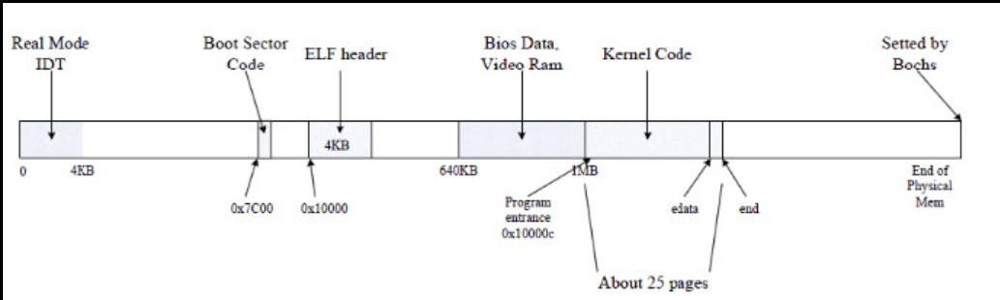
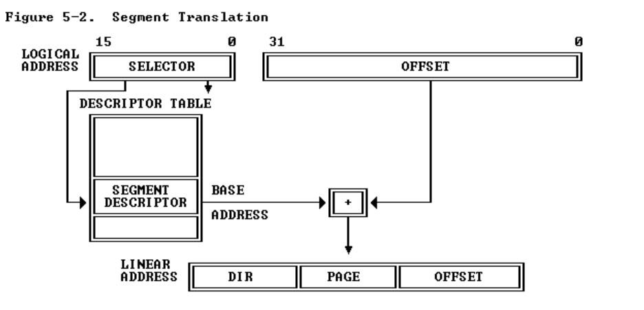
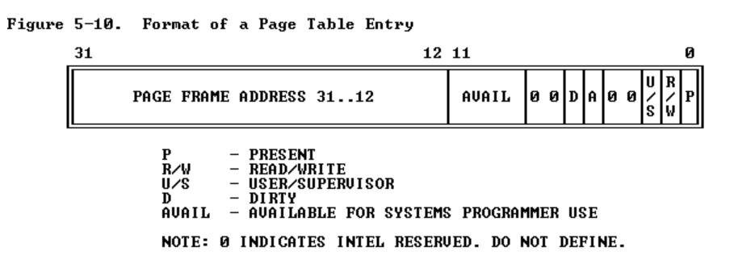
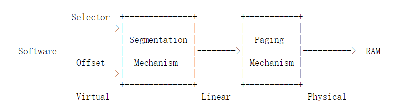
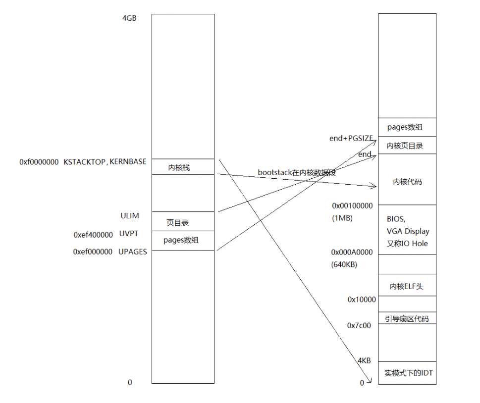
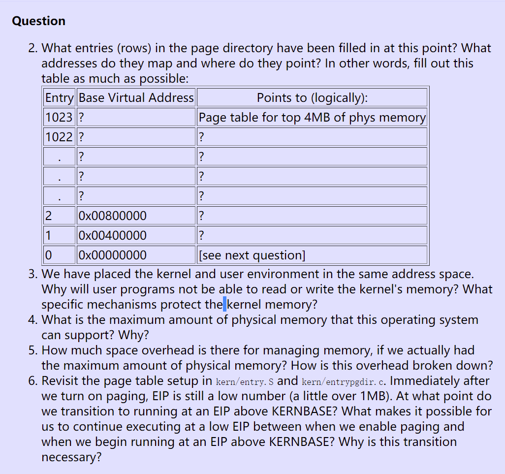

[TOC]

# Lab 2: Memory Management

**GOAL: **  write the memory management code

- physical memory allocator for the kernel

内核的物理内存分配器，以便内核可以分配内存并稍后释放它。分配器将以 4096 字节为单位进行操作，称为页。

 ---- 维护数据结构，记录哪些物理页面是空闲的，哪些已分配

---- 有多少进程正在共享每个分配的页面。

---- 分配和释放内存页的例程。

- *virtual memory*

虚拟内存，它将内核和用户软件使用的虚拟地址映射到物理内存中的地址。 x86 硬件的内存管理单元 (MMU) 在指令使用内存时执行映射，查询一组页表。

 --- 根据提供的规范修改 JOS 以设置 MMU 的页表。

- ```
  请特别注意 memlayout.h 和 pmap.h，因为本实验要求您使用和理解它们包含的许多定义。您可能还想查看 inc/mmu.h，因为它也包含许多对本实验有用的定义。
  ```

### Getting started

- 获取实验2资源：

```shell
$ cd ~/6.828/lab
$ add git
$ git pull
Already up-to-date.
$ git checkout -b lab2 origin/lab2
Branch lab2 set up to track remote branch refs/remotes/origin/lab2.
Switched to a new branch "lab2"
```

`git checkout -b` 命令实际上做了两件事：它首先基于课程人员提供的 origin/lab2 分支创建一个本地分支 lab2，其次，它更改你的 lab 目录的内容以反映文件存储在 lab2 分支上。 Git 允许使用 `git checkout branch-name` 在现有分支之间切换，但您应该在切换到另一个分支之前在一个分支上提交任何未完成的更改。

- lab1 分支中所做的更改合并到 lab2 分支中

```shell
$ git merge lab1
Merge made by recursive.
 kern/kdebug.c  |   11 +++++++++--
 kern/monitor.c |   19 +++++++++++++++++++
 lib/printfmt.c |    7 +++----
 3 files changed, 31 insertions(+), 6 deletions(-)
athena% 
```

- 实验 2 包含以下新源文件：

- `inc/memlayout.h`
- `kern/pmap.c`
- `kern/pmap.h`
- `kern/kclock.h`
- `kern/kclock.c`

- `memlayout.h` 描述了必须通过修改 `pmap.c` 来实现的虚拟地址空间的布局。
-  `memlayout.h` 和 `pmap.h` 定义了 `PageInfo` 结构，用来跟踪哪些物理内存页是空闲的。 
- `kclock.c` 和 `kclock.h` 操作 PC 的电池供电时钟(battery-backed clock)和 CMOS RAM 硬件，其中 BIOS 记录 PC 包含的物理内存量等。 
- `pmap.c` 中的代码需要读取这个设备硬件，以便计算出有多少物理内存，但这部分代码是为你完成的：你不需要知道 CMOS 硬件如何工作的细节。


## Part 1: Physical Page Management

物理页面管理

操作系统必须跟踪物理 RAM 的哪些部分是空闲的，哪些部分当前正在使用。 JOS 以**页面粒度(*page granularity*)**管理 PC 的物理内存，以便它可以使用 **MMU(Memoty Management Unit)** 来映射和保护每块分配的内存。

- **编写物理页面分配器( physical page allocator)**。它通过一个 `struct PageInfo` 对象的**链表**来跟踪哪些页面是空闲的（与 xv6 不同，它们没有嵌入到空闲页面本身中），每个页面对应一个物理页面。您需要先编写物理页分配器，然后才能编写其余的虚拟内存实现，因为页表管理代码需要分配物理内存来存储页表。


**Exercise 1**

在文件 kern/pmap.c 中，您必须为以下函数实现代码（可能按照给定的顺序）。

```c
boot_alloc()
mem_init() // (only up to the call to check_page_free_list(1))
page_init()
page_alloc()
page_free()
```

`check_page_free_list()` 和 `check_page_alloc()` 测试您的物理页面分配器。您应该启动 JOS 并查看 `check_page_alloc()` 是否报告成功。修复您的代码，使其通过。您可能会发现添加自己的 `assert()` 以验证您的假设是否正确很有帮助。

### 实验过程

#### `PageInfo`结构设计原理

- `PageInfo` --   `memlayout.h` 和 `pmap.h`   

 `memlayout.h`   --- 与物理页面分配器有关

```c
// All physical memory mapped at this address
// 映射到该地址的所有物理内存
#define KERNBASE        0xF0000000

/*
 * Page descriptor structures, mapped at UPAGES.
 * 页描述符结构，映射到 UPAGES --- 0xef000000
 * Read/write to the kernel, read-only to user programs.
 * 对内核进行读/写，对用户程序只读。
 *
 * Each struct PageInfo stores metadata for one physical page.
 * 每个 struct PageInfo 存储一个物理页面的元数据
 * Is it NOT the physical page itself, but there is a one-to-one
 * correspondence between physical pages and struct PageInfo's.
 * 它不是物理页面本身，而是物理页面和结构PageInfo 之间存在一一对应关系。
 * You can map a struct PageInfo * to the corresponding physical address
 * with page2pa() in kern/pmap.h.
 * 您可以使用 kern/pmap.h 中的 page2pa() 将 struct PageInfo * 映射到相应的物理地址。
 */
struct PageInfo {
        // Next page on the free list.
    	// 空闲链表下一页
        struct PageInfo *pp_link;   // 链接指针

        // pp_ref is the count of pointers (usually in page table entries)
        // to this page, for pages allocated using page_alloc.
        // Pages allocated at boot time using pmap.c's
        // boot_alloc do not have valid reference count fields.
    	// 对于使用 page_alloc 分配的页面，pp_ref 是指向该页面的指针
    	//（通常在页表条目中）的计数。
        // 在启动时使用 pmap.c 的 boot_alloc 分配的页面没有有效的引用计数字段。

        uint16_t pp_ref;  // 指针计数
};
```

- `kern/pmap.h`  ---  `page2pa()` :PageInfo 映射到相应的物理地址

```c
static inline physaddr_t
page2pa(struct PageInfo *pp)
{
        return (pp - pages) << PGSHIFT;  // 左移PGSHIFT位  PGSHIFT=12
}

static inline struct PageInfo*
pa2page(physaddr_t pa)
{
        if (PGNUM(pa) >= npages)
                panic("pa2page called with invalid pa");
        return &pages[PGNUM(pa)];
}
```

左移：丢弃最高位,0补最低位

数组`pages`的成员为所有的物理内存页面，其索引为`0~npage`。而`page_free_list`则是该数组中所有`pp_ref`值为0的元素的链表。页目录和页表其自身地址均在`KADDR`内，但二者中各项内容所含的地址值则都位于`0～256M`的物理地址空间内。而`pages`数组各元素只定义了一个成员`pp_ref,` 那么，这些元素是怎么和物理内存一一对应的呢？这是通过`pages`的索引和物理内存从`0M`开始的关系来联系起来的。`pages[X]`对应物理内存`X*4K~(X+1)*4K`. 具体实现如上。

- kern管理的物理页表 --- `kern/pmap.h`

```c
extern struct PageInfo *pages;  // extern可以跨文件访问 --- 页表数组
```

**pages 既是一个数组，也是一个链表。** 需要进行`pa`和`pageinfo`的映射的时候，那么就是数组，需要管理`page_free_list`的时候，通过`pp_link`，就能把数组中的一些值链接起来，就是链表！！！

- `PGSHIFT`  --- `inc/mmu.h`

```c
// Page directory and page table constants.  --- 页目录和页表常量。
#define NPDENTRIES      1024            // page directory entries per page directory                               // 每页页目录条目
#define NPTENTRIES      1024            // page table entries per page table
									    // 每个页表的页表条目

#define PGSIZE          4096            // bytes mapped by a page 页面映射的字节
#define PGSHIFT         12              // log2(PGSIZE)   --- 转移量

#define PTSIZE          (PGSIZE*NPTENTRIES) // bytes mapped by a page directory entry                                       // 由页目录映射的字节
#define PTSHIFT         22              // log2(PTSIZE)

#define PTXSHIFT        12              // offset of PTX in a linear address
										// PTX 在线性地址中的偏移量
#define PDXSHIFT        22              // offset of PDX in a linear address\
										// PDX 在线性地址中的偏移量
```

- `kern/entry.S` 

  ```assembly
  .data
  ###################################################################
  # boot stack
  ###################################################################
          .p2align        PGSHIFT         # force page alignment 强制页面对齐
          .globl          bootstack
  bootstack:
          .space          KSTKSIZE
          .globl          bootstacktop
  bootstacktop:
  ```

#### 编写 `kern/pmap.c`

```c
boot_alloc()
mem_init() // (only up to the call to check_page_free_list(1))
page_init()
page_alloc()
page_free()
```

- 基础结构定义

```c
// These variables are set by i386_detect_memory()
size_t npages;                  // Amount of physical memory (in pages)
							    // 物理内存量（以页为单位）
static size_t npages_basemem;   // Amount of base memory (in pages)
								// 基本内存量（以页为单位）

// These variables are set in mem_init()
pde_t *kern_pgdir;              // Kernel's initial page directory
								// 内核的初始页目录
struct PageInfo *pages;         // Physical page state array
								// 物理页状态数组
static struct PageInfo *page_free_list; // Free list of physical pages
										// 空闲物理链表
```

`i386_detect_memory()`    ---- 查询内存基本情况


加载内核后内存分布图如上，大致有三个部分：

1. 0x00000~0xA0000：这部分叫做basemem，是可用的。
2. 接着是0xA0000~0x100000：这部分叫做IO Hole，不可用。
3. 再接着就是0x100000以上的部分：这部分叫做extmem，可用。
   kern/pmap.c中的i386_detect_memory()统计有多少可用的物理内存，将总共的可用物理内存页数保存到全局变量npages中，basemem部分可用的物理内存页数保存到npages_basemem中。

```c
static void
i386_detect_memory(void)
{
        size_t basemem, extmem, ext16mem, totalmem;

        // Use CMOS calls to measure available base & extended memory.
        // (CMOS calls return results in kilobytes.)
    	// 使用 CMOS 调用来测量可用的基本内存和扩展内存。
    	//（CMOS 调用以千字节为单位返回结果。
        basemem = nvram_read(NVRAM_BASELO);
        extmem = nvram_read(NVRAM_EXTLO);
        ext16mem = nvram_read(NVRAM_EXT16LO) * 64;

        // Calculate the number of physical pages available in both base
        // and extended memory.
    	// 计算基本内存和扩展内存中可用的物理页数。
        if (ext16mem)
                totalmem = 16 * 1024 + ext16mem;
        else if (extmem)
                totalmem = 1 * 1024 + extmem;
        else
                totalmem = basemem;

        npages = totalmem / (PGSIZE / 1024);  // 物理内存量(页) PGSIZE = 4096
        npages_basemem = basemem / (PGSIZE / 1024); // 基本内存量(页)

        cprintf("Physical memory: %uK available, base = %uK, extended = %uK\n",
                totalmem, basemem, totalmem - basemem);
}
```

- `boot_alloc()`

```c
// This simple physical memory allocator is used only while JOS is setting
// up its virtual memory system.  page_alloc() is the real allocator.
//
// If n>0, allocates enough pages of contiguous physical memory to hold 'n'
// bytes.  Doesn't initialize the memory.  Returns a kernel virtual address.
//
// If n==0, returns the address of the next free page without allocating
// anything.
//
// If we're out of memory, boot_alloc should panic.
// This function may ONLY be used during initialization,
// before the page_free_list list has been set up.

// 这个简单的物理内存分配器仅在 JOS 设置其虚拟内存系统时使用。 
// page_alloc() 是真正的分配器。
//
// 如果 n>0，则分配足够的连续物理内存页来容纳“n”个字节。不初始化内存。返回内核虚拟地址。
// 如果 n==0，则返回下一个空闲页的地址而不分配任何内容。
// 如果内存不足，boot_alloc 应该会恐慌。这个函数只能在初始化期间使用，
// 在 page_free_list 列表被设置之前。
static void *
boot_alloc(uint32_t n)
{
        static char *nextfree;  // virtual address of next byte of free memory
    							// 空闲内存下一个字节的虚拟地址
        char *result;           // 返回值

        // Initialize nextfree if this is the first time.
        // 'end' is a magic symbol automatically generated by the linker,
        // which points to the end of the kernel's bss segment:
        // the first virtual address that the linker did *not* assign
        // to any kernel code or global variables.
    	// 如果这是第一次，则初始化 nextfree。
    	//'end' 是链接器自动生成的魔法符号， 它指向内核 bss 段的结尾：
    	// 链接器没有分配给任何内核代码或全局变量的第一个虚拟地址。
    
    	// nextfree = NULL,首次调用的时候，从内核的bss段结束处分配一个内存块。
        if (!nextfree) { 
                extern char end[];  // 指向内核 bss 段的结尾 -- 从内核末尾开始处分配
                nextfree = ROUNDUP((char *) end, PGSIZE);
        }

        // Allocate a chunk large enough to hold 'n' bytes, then update
        // nextfree.  Make sure nextfree is kept aligned
        // to a multiple of PGSIZE.
        //
    	// 分配一个足够大的块以容纳“n”个字节，然后更新 nextfree。
    	// 确保 nextfree 保持与 PGSIZE 的倍数对齐。
        // LAB 2: Your code here.
    	// 不是第一次调用分配
    	// return the address of the next free page
    	if (n == 0 )   // 可省略
            return nextfree;
    	// allocates enough pages
    	if ( n > 0)
            result = nextfree;
    		nextfree = ROUNDUP((char *)(nextfree + n), PGSIZE);
            
    	cprintf("boot_alloc memory at %x, next memory allocate at %x\n", result, nextfree);
        return result;  // 返回分配开始处
}
```

- `mem_init()` // (only up to the call to check_page_free_list(1))  ---- 内存初始化

初始化页表跟踪数组`*pages`

```c
// Set up a two-level page table:
//    kern_pgdir is its linear (virtual) address of the root
// 建立一个二级页表：kern_pgdir 是它的根的线性（虚拟）地址
//
// This function only sets up the kernel part of the address space
// (ie. addresses >= UTOP).  The user part of the address space
// will be set up later.
// 此函数仅设置地址空间的内核部分（即地址 >= UTOP）。地址空间的用户部分将在稍后设置。
// 
// From UTOP to ULIM, the user is allowed to read but not write.
// Above ULIM the user cannot read or write.
// 从 UTOP 到 ULIM，用户只能读不能写。高于 ULIM 用户无法读取或写入。
void
mem_init(void)
{
        uint32_t cr0;
        size_t n;

        // Find out how much memory the machine has (npages & npages_basemem).
    	// 找出机器有多少内存（npages & npages_basemem）。
        i386_detect_memory();

        // Remove this line when you're ready to test this function.
        panic("mem_init: This function is not finished\n");

        //////////////////////////////////////////////////////////////////////
        // create initial page directory.
    	// 创建初始页面目录。PGSIZE=4096 --- 一个页的大小 4K
        kern_pgdir = (pde_t *) boot_alloc(PGSIZE);
    	// kern_pgdir 是它的根的线性（虚拟）地址 --- 页表的表头地址
        memset(kern_pgdir, 0, PGSIZE);

        //////////////////////////////////////////////////////////////////////
        // Recursively insert PD in itself as a page table, to form
        // a virtual page table at virtual address UVPT.
        // (For now, you don't have understand the greater purpose of the
        // following line.)
    	//  将PD自身递归插入为页表，在虚拟地址UVPT处形成虚拟页表。

        // Permissions: kernel R, user R -- 权限：内核 R，用户 R
        kern_pgdir[PDX(UVPT)] = PADDR(kern_pgdir) | PTE_U | PTE_P;

        //////////////////////////////////////////////////////////////////////
        // Allocate an array of npages 'struct PageInfo's and store it in 'pages'.
    	// 分配一个npages 'struct PageInfo's 数组并将其存储在'pages' 中。
    
        // The kernel uses this array to keep track of physical pages: for
        // each physical page, there is a corresponding struct PageInfo in this
        // array.  'npages' is the number of physical pages in memory.  Use memset
        // to initialize all fields of each struct PageInfo to 0.
    	// 内核使用这个数组来跟踪物理页：对于每个物理页，这个数组中有一个对应的结构体 PageInfo。 
    	// 'npages' 是内存中的物理页数。使用 memset 将每个 struct PageInfo 的所有字段初始化为 0。
        // Your code goes here:
    	size = npages * (sizeof(struct PageInfo));
		pages = (struct PageInfo*) boot_alloc(size);
    	memset(pages, 0, sizeof(struct PageInfo) * npages); // initialize -- 0

        //////////////////////////////////////////////////////////////////////
        // Now that we've allocated the initial kernel data structures, we set
        // up the list of free physical pages. Once we've done so, all further
        // memory management will go through the page_* functions. In
        // particular, we can now map memory using boot_map_region
        // or page_insert
        page_init();

        check_page_free_list(1);
        check_page_alloc();
        check_page();
    
		 //////////////////////////////////////////////////////////////////////
        // Now we set up virtual memory

        //////////////////////////////////////////////////////////////////////
        // Map 'pages' read-only by the user at linear address UPAGES
        // Permissions:
        //    - the new image at UPAGES -- kernel R, user R
        //      (ie. perm = PTE_U | PTE_P)
        //    - pages itself -- kernel RW, user NONE
        // Your code goes here:

        //////////////////////////////////////////////////////////////////////
        // Use the physical memory that 'bootstack' refers to as the kernel
        // stack.  The kernel stack grows down from virtual address KSTACKTOP.
        // We consider the entire range from [KSTACKTOP-PTSIZE, KSTACKTOP)
        // to be the kernel stack, but break this into two pieces:
        //     * [KSTACKTOP-KSTKSIZE, KSTACKTOP) -- backed by physical memory
        //     * [KSTACKTOP-PTSIZE, KSTACKTOP-KSTKSIZE) -- not backed; so if
        //       the kernel overflows its stack, it will fault rather than
        //       overwrite memory.  Known as a "guard page".
        //     Permissions: kernel RW, user NONE
        // Your code goes here:

        //////////////////////////////////////////////////////////////////////
        // Map all of physical memory at KERNBASE.
        // Ie.  the VA range [KERNBASE, 2^32) should map to
        //      the PA range [0, 2^32 - KERNBASE)
        // We might not have 2^32 - KERNBASE bytes of physical memory, but
        // we just set up the mapping anyway.
        // Permissions: kernel RW, user NONE
        // Your code goes here:

        // Check that the initial page directory has been set up correctly.
        check_kern_pgdir();

        // Switch from the minimal entry page directory to the full kern_pgdir
        // page table we just created.  Our instruction pointer should be
        // somewhere between KERNBASE and KERNBASE+4MB right now, which is
        // mapped the same way by both page tables.
        //
        // If the machine reboots at this point, you've probably set up your
        // kern_pgdir wrong.
        lcr3(PADDR(kern_pgdir));

        check_page_free_list(0);

        // entry.S set the really important flags in cr0 (including enabling
        // paging).  Here we configure the rest of the flags that we care about.
        cr0 = rcr0();
        cr0 |= CR0_PE|CR0_PG|CR0_AM|CR0_WP|CR0_NE|CR0_MP;
        cr0 &= ~(CR0_TS|CR0_EM);
        lcr0(cr0);

        // Some more checks, only possible after kern_pgdir is installed.
        check_page_installed_pgdir();
}
```


- `page_init()`

**bootloader读入kernel后的内存分布**



**页面分配：**

- `[0, 0]` in use
-  `[1, npages_basemem)` is free.
-  `[IOPHYSMEM/PGSIZE, EXTPHYSMEM/PGSIZE)` in use
-  `[EXTPHYSMEM/PGSIZE, ...)`   extended memory - some in use, some is free

**对应内存分布：**

- [0, 0]对应于第一个页，占用内存4KB，物理地址实际上是[0, 4KB]。这部分内存是被占用不能分配的，用来保存real-mode IDT和BIOS。

- [1, npages_basemem)对应了接下来的一段空闲内存，映射到物理地址是`[PGSIZE, npages_basemem * PGSIZE)`。在函数page_init()插入一段打印语句，查看一下npages_basemem的值，就可以看到实际上是0x000000a0，而相应的物理地址是0x000a0000

- `[IOPHYSMEM/PGSIZE, EXTPHYSMEM/PGSIZE)`.由于地址的连续性，所以`IOPHYSMEM==npages_basemem * PGSIZE`。物理地址到EXTPHYSMEM为止，大小是0x00100000。

- `[EXTPHYSMEM/PGSIZE, ...)`这一区间比较麻烦。有些内存被占用，有些空闲。从上图的内存管理开看，0x100000开始就是ELF hearder，随后是大片大片的被占用的内存，包括BIOS, Kernel, Page Directory, pages。到pages结束，可以通过：

  ```c
  PGNUM((int)((char *)pages) + (sizeof(struct PageInfo) * npages) - 0xf0000000)
  ```

  求出pages最后占用的内存，也就是接下来更大片大片的空闲内存页的起始页。其中宏PGNUM在inc/mmu.h中定义，作用是根据物理地址求出页表序号。通过打印，可以看到到这里空闲页开始的页序号是405，而一共有$32768(=2^{15})$的页。由此可见，实际上被占用的页只占了页表中很小一部分，这也是符合常理的。

```c
// --------------------------------------------------------------
// Tracking of physical pages.
// The 'pages' array has one 'struct PageInfo' entry per physical page.
// Pages are reference counted, and free pages are kept on a linked list.
// 跟踪物理页面。 'pages' 数组的每个物理页有一个 'struct PageInfo' 条目。
// 页面被引用计数，空闲页面被保存在一个链接列表中。
// --------------------------------------------------------------

//
// Initialize page structure and memory free list.
// After this is done, NEVER use boot_alloc again.  ONLY use the page
// allocator functions below to allocate and deallocate physical
// memory via the page_free_list.
// 初始化页面结构和内存空闲列表。
// 完成此操作后，切勿再次使用 boot_alloc。
// 仅使用下面的页面分配器函数通过 page_free_list 分配和释放物理内存。
//
void
page_init(void)
{
        // The example code here marks all physical pages as free.
        // However this is not truly the case.  What memory is free?
        //  1) Mark physical page 0 as in use.
        //     This way we preserve the real-mode IDT and BIOS structures
        //     in case we ever need them.  (Currently we don't, but...)
        //  2) The rest of base memory, [PGSIZE, npages_basemem * PGSIZE)
        //     is free.
        //  3) Then comes the IO hole [IOPHYSMEM, EXTPHYSMEM), which must
        //     never be allocated.
        //  4) Then extended memory [EXTPHYSMEM, ...).
        //     Some of it is in use, some is free. Where is the kernel
        //     in physical memory?  Which pages are already in use for
        //     page tables and other data structures?
        //
    	// 这里的示例代码将所有物理页面标记为空闲。然而事实并非如此。什么内存是空闲的？
        // 1) 将物理页面 0 标记为正在使用。这样我们就可以保留实模式 IDT 和 BIOS 结构，
    	// 以防我们需要它们。 （目前我们没有，但是...）
        // 2) 剩余的基本内存，[PGSIZE, npages_basemem * PGSIZE) 是空闲的。
        // 3) 然后是 IO hole [IOPHYSMEM, EXTPHYSMEM)，绝不能分配。
        // 4) 然后扩展内存 [EXTPHYSMEM, ...)。有些正在使用，有些是空闲的。
    	// 物理内存中的内核在哪里？哪些页面已用于页表和其他数据结构？
        // Change the code to reflect this.
        // NB: DO NOT actually touch the physical memory corresponding to
        // free pages!
    	// 更改代码以反映这一点。
        // 注意：不要实际接触与空闲页面对应的物理内存！
		
    	// 1 in use, 0 is free
    	// Section 1
        size_t i;   // loop var
    	for (i = 0; i < npages; i++){
            if (i == 0){   // Mark physical page 0 as in use.
                pages[i].pp_ref = 1;
                pages[i].pp_link = NULL;
            }
            else if (i >= 1 && i < npages_basemem){ //  base memory
            	pages[i].pp_ref = 0;
        		pages[i].pp_link = page_free_list;
        		page_free_list = &pages[i];
            }
            else if (i >= IOPHYSMEM / PGSIZE && i < EXTPHYSMEM / PGSIZE){ // IO hole
                 pages[i].pp_ref = 1;
                 pages[i].pp_link = NULL; 
            }
            else{ // extended memory
                 if (i < PADDR(boot_alloc(0)) / PGSIZE) { // kernel zone
            		pages[i].pp_ref = 1;
                    pages[i].pp_link = NULL; 
        		}
                else {
            		pages[i].pp_ref = 0;
            		pages[i].pp_link = page_free_list;
            		page_free_list = &pages[i];
        		}
            }
        }
    
    
    	// settion 2
    	size_t i,j;
		physaddr_t physadd;
		page_free_list = NULL;
		for (i = 1; i < npages_basemem; i++) {
			pages[i].pp_ref = 0;
			pages[i].pp_link = page_free_list;
			page_free_list = &pages[i];
		}
		physadd = PADDR (nextfree);
		j = (int) (physadd) / PGSIZE;
		for (i = j; i< npages; i++) {
			pages[i].pp_ref = 0;
			pages[i].pp_link = page_free_list;
			page_free_list = &pages[i];
		} 	
    
    	// Section 3
    	 size_t i;
 		 uint32_t pages_end = PGNUM((int)((char *)pages) + (sizeof(struct PageInfo) * npages) - 0xf0000000);
 		 for (i = 0; i < npages; i++) {
    		if ((1 <= i && i < npages_basemem) || pages_end <= i){
     			pages[i].pp_ref = 0;
      			pages[i].pp_link = page_free_list;
      			page_free_list = &pages[i];
   			 }
 		 }
}
```

`PADDR`

```c
/* This macro takes a kernel virtual address -- an address that points above
 * KERNBASE, where the machine's maximum 256MB of physical memory is mapped --
 * and returns the corresponding physical address.  It panics if you pass it a
 * non-kernel virtual address.
 */
// 这个宏采用内核虚拟地址——一个指向 KERNBASE 之上的地址，机器的最大 256MB 物理内存被
// 映射到这里——并返回相应的物理地址。如果你传递给它一个非内核虚拟地址，它会发生恐慌。
#define PADDR(kva) _paddr(__FILE__, __LINE__, kva)

static inline physaddr_t
_paddr(const char *file, int line, void *kva)
{
        if ((uint32_t)kva < KERNBASE)
                _panic(file, line, "PADDR called with invalid kva %08lx", kva);
        return (physaddr_t)kva - KERNBASE;
}

```


- `page_alloc()`

  将`page_init()`组织的空闲页链表`page_free_list`的第一个页结点取出，将头指针指向下一个页结点，并且返还取下的结点指针。最后，将这取出的空闲页所对应的物理地址区间用零填充。

  ```c
  //
  // Allocates a physical page.  If (alloc_flags & ALLOC_ZERO), fills the entire
  // returned physical page with '\0' bytes.  Does NOT increment the reference
  // count of the page - the caller must do these if necessary (either explicitly
  // or via page_insert).
  // 分配一个物理页。如果 (alloc_flags & ALLOC_ZERO)，用0填充整个返回的物理页。
  // 不增加页面的引用计数 - 调用者必须在必要时执行这些操作（显式或通过 page_insert）。
  //
  // Be sure to set the pp_link field of the allocated page to NULL so
  // page_free can check for double-free bugs.
  // 确保将分配页面的 pp_link 字段设置为 NULL，以便 page_free 可以检查双重释放错误。
  //
  // Returns NULL if out of free memory.
  // 如果可用内存不足，则返回 NULL。
  //
  // Hint: use page2kva and memset
  // 提示：使用 page2kva 和 memset
  struct PageInfo *
  page_alloc(int alloc_flags)
  {
           if (page_free_list == NULL) // no free page
      		return NULL;
    
    		struct PageInfo * freePtr = page_free_list; // use from head of page_free_list
    		page_free_list = freePtr->pp_link;
      	freePtr->pp_link = NULL;
  
    		if (alloc_flags & ALLOC_ZERO){
      		memset(page2kva(ptr), 0, PGSIZE);
    		}
    		return freePtr;
  }
  ```

  ``` page2kva```

  ```c
  static inline void*
  page2kva(struct PageInfo *pp)
  {
          return KADDR(page2pa(pp));
  }
  
  /* This macro takes a physical address and returns the corresponding kernel
   * virtual address.  It panics if you pass an invalid physical address. */
  // 该宏采用物理地址并返回相应的内核虚拟地址。如果您传递无效的物理地址，它会发生恐慌
  #define KADDR(pa) _kaddr(__FILE__, __LINE__, pa)
  
  static inline void*
  _kaddr(const char *file, int line, physaddr_t pa)
  {
          if (PGNUM(pa) >= npages)
                  _panic(file, line, "KADDR called with invalid pa %08lx", pa);
          return (void *)(pa + KERNBASE);
  }
  ```

  

- `page_free()`

  链表操作 -- 前插法

```c
//
// Return a page to the free list.
// (This function should only be called when pp->pp_ref reaches 0.)
//
void
page_free(struct PageInfo *pp)
{
        // Fill this function in
        // Hint: You may want to panic if pp->pp_ref is nonzero or
        // pp->pp_link is not NULL.
    if (pp->pp_ref != 0 || pp->pp_link != NULL){
    	panic("page_free: cannot free page\n");
  	}
  	pp->pp_link = page_free_list;
  	page_free_list = pp;
}
```


#### test

- 注释`kern/pmap.c -- mem_init()`

```c
  // Remove this line when you're ready to test this function.
  // panic("mem_init: This function is not finished\n");
```

- 测试

```shell
6828 decimal is 15254 octal!
Physical memory: 131072K available, base = 640K, extended = 130432K
head of *pages in pmap.c: f0118000
check_page_free_list() succeeded!
check_page_alloc() succeeded!
kernel panic at kern/pmap.c:725: assertion failed: page_insert(kern_pgdir, pp1, 0x0, PTE_W) < 0
```


## Part 2: Virtual Memory

虚拟内存

先熟悉 x86 的**保护模式内存管理架构**：即分段(*segmentation* )和页面转换(*page translation*)。


**Exercise 2**

如果您还没有这样做，请查看 Intel 80386 参考手册的第 5 章和第 6 章。仔细阅读有关页面转换和基于页面的保护的部分（5.2 和 6.4）。我们建议您还浏览有关细分的部分；虽然 JOS 使用分页硬件进行虚拟内存和保护，但不能在 x86 上禁用段转换和基于段的保护，因此您需要对其有基本的了解。

#### 分页硬件

操作系统通过页表机制实现了对内存空间的控制。页表能够让不同进程各自的地址空间**映射**到相同的物理内存上，还能够为不同进程的内存提供**保护**。

**页表功能：**

- 利用页表来区分多个地址空间，保护内存。
- 把不同地址空间的多段内存映射到同一段物理内存（内核部分），在同一地址空间中多次映射同一段物理内存（用户部分的每一页都会映射到内核部分）
- 通过一个没有映射的页保护用户栈

x86 的指令（用户和内核均是如此）计算的都是虚拟地址。机器的 RAM，或者物理内存，则是用物理地址来作标记的。x86 的页表硬件通过映射机制将虚拟地址和物理地址联系起来。

一个 x86 页表就是一个包含$ 2^{20}$（1,048,576）条*页表条目*（PTEs）的数组。每条 PTE 包含了一个 20 位的物理页号（PPN）及一些标志位。分页硬件要找到一个虚拟地址对应的 PTE，只需使用其高20位来找到该虚拟地址在页表中的索引，然后把其高 20 位替换为对应 PTE 的 PPN。而低 12 位是会被分页硬件原样复制的。因此在虚拟地址-物理地址的翻译机制下，页表可以为操作系统提供对一块块大小为 4096（$2^{12}$）字节的内存片，这样的一个内存片就是一*页*。


如图 2-1 所示，实际上，地址的翻译有两个步骤。一个页表在物理内存中像一棵两层的树。树的根是一个 4096 字节的***页目录***，其中包含了 1024 个类似 PTE 的条目，但其实每个条目是指向一个*页表页*的引用。而每个页表页又是包含 1024 个 32 位 PTE 的数组。分页硬件使用虚拟地址的高 10 位来决定对应页目录条目。如果想要的条目已经放在了页目录中，分页硬件就会继续使用接下来的 10 位来从页表页中选择出对应的 PTE。否则，分页硬件就会抛出错误。通常情况下，大部分虚拟地址不会进行映射，而这样的**二级结构**就使得页目录可以忽略那些没有任何映射的页表页。

每个 PTE 都包含一些标志位，说明分页硬件对应的虚拟地址的使用权限。PTE_P 表示 PTE 是否陈列在页表中：如果不是，那么一个对该页的引用会引发错误（也就是：不允许被使用）。PTE_W 控制着能否对页执行写操作；如果不能，则只允许对其进行读操作和取指令。PTE_U 控制着用户程序能否使用该页；如果不能，则只有内核能够使用该页。图 2-1 对此进行了说明。这些的标志位和页表硬件相关的结构体都在 `mmu.h`（0700）定义。

下面对一些名词作出解释。物理内存是指 DRAM 中的储存单元。每个字节的物理内存都有一个地址，称为物理地址。而虚拟地址则是程序所使用的。分页硬件会将程序发出的虚拟地址翻译为物理地址，然后发送给 DRAM 硬件以读写存储器。这一层面的讨论中我们仅仅考虑虚拟地址，暂不考虑虚拟内存。

#### Chapter 5 Memory Management

80386通过两个步骤将逻辑地址(logical addresses )（即程序员所看到的地址）转换为物理地址(physical address)（即物理内存中的实际地址）：

- 段转换(Segment translation)，将逻辑地址(logical address )（由段选择器(segment selector)和段偏移量(segment offset)组成）转换为线性地址(linear address)。
- 页转换(Page translation)，将线性地址(linear address)转换为物理地址(physical address)。此步骤是可选的，由系统软件设计人员决定。

这些转换是以应用程序程序员不可见的方式执行的。图 5-1 以高抽象级别说明了这两种转换。


图 5-1 和本章的其余部分展示了 80386 寻址机制的简化视图。实际上，寻址机制还包括内存保护功能。然而，为简单起见，保护主题在另一章第 6 章中讨论。

#### 5.1 Segment Translation



图 5-2 更详细地显示了处理器如何将逻辑地址转换为线性地址。

为了执行这种转换，处理器使用以下数据结构：

- Descriptors  描述符 
- Descriptor tables  描述符表
- Selectors  选择器
- Segment Registers  段寄存器

##### 5.1.1 Descriptors    描述符 


段描述符(egment descriptor)为处理器提供将逻辑地址(logical address)映射到线性地址(linear address)所需的数据。描述符由编译器、链接器、加载器或操作系统创建，而不是由应用程序程序员创建。图 5-3 说明了两种通用描述符格式。所有类型的段描述符都采用这些格式之一。段描述符字段是：

`BASE`:定义段在 4 GB 线性地址空间内的位置。处理器连接基地址的三个片段以形成单个 32 位值。

`LIMIT`:定义段的大小。当处理器连接限制字段的两个部分时，会产生一个 20 位的值。处理器以两种方式之一解释限制字段，具体取决于粒度位(granularity bit)的设置：

- 以一字节为单位，定义最大为 1 兆字节的限制。
- 以 4 KB 为单位，定义最多 4 GB 的限制。加载时限制左移 12 位(The limit is shifted left by 12 bits)，并插入低位 1 位。

`Granularity bit`:指定解释 LIMIT 字段的单位。当该位清零时，限制以一字节为单位进行解释；设置后，限制以 4 KB 为单位进行解释。

`TYPE`:区分各种描述符。

`DPL`:(Descriptor Privilege Level)：由保护机制使用(参考第6章)。

`Segment-Present bit`:如果该位为零，则描述符不能用于地址转换；当描述符的选择器(selector )加载到段寄存器(segment register)中时，处理器将发出异常信号。图 5-4 显示了当前位为零时描述符的格式。操作系统可以自由使用标记为`AVAILABLE` 的位置。在以下任一情况下，实现基于段的虚拟内存的操作系统会清除当前位：

- 当分页机制未映射段所跨越的线性空间时。
- 当内存中不存在该段时。


`Accessed bit`:处理器在访问段时设置该位；即，描述符的选择器被加载到段寄存器中或被选择器测试指令使用。在段级别实现虚拟内存的操作系统可以通过定期测试和清除该位来监控段使用频率。

描述符的创建和维护是系统软件的责任，通常需要编译器、程序加载器或系统构建器以及评价系统的合作。

##### 5.1.2 Descriptor Tables   描述符表

段描述符(Segment descriptor)存储在两种描述符表中的任一种中：

- 全局描述符表 (GDT)  global descriptor table

- 本地描述符表 (LDT)   local descriptor table 


描述符表(descriptor table)只是一个包含描述符的 8 字节条目的存储器阵列(memory array)，如图 5-5 所示。描述符表的长度可变，最多可包含 8192 ($2^{13}$) 个描述符。但是，处理器不使用 GDT 的第一个条目 (`INDEX=0`)。

处理器通过 `GDTR` 和 `LDTR` 寄存器在内存中定位 `GDT` 和当前 `LDT`。这些寄存器将表的基地址( base addresses )存储在线性地址(linear address space )空间中并存储段限制(segment limits)。 LGDT 和 SGDT 指令允许访问 GDTR； LLDT 和 SLDT 指令允许访问 LDTR。

##### 5.1.3 Selectors   选择器


逻辑地址的选择器部分通过指定一个描述符表并在该表中索引一个描述符来标识一个描述符。选择器可能作为指针变量中的一个字段对应用程序可见，但选择器的值通常由链接器或链接加载器分配（固定）。图 5-6 显示了选择器的格式。

`Index`:在描述符表中选择 8192 个描述符之一。处理器简单地将该索引值乘以 8（描述符的长度），并将结果添加到描述符表的基地址(base address)，以便访问表中适当的段描述符。

`Table Indicator`:指定选择器引用哪个描述符表。0表示 GDT；1表示当前的 LDT。

`Requested Privilege Level`:由保护机制使用。 （请参阅第 6 章）

由于处理器不使用 GDT 的第一个条目，因此索引为0且表指示符为0的选择器（即指向 GDT 的第一个条目的选择器）可以用作空值选择器(null selector)。当段寄存器（除了 CS 或 SS）加载了空选择器时，处理器不会导致异常。但是，当使用段寄存器访问内存时，它会导致异常。此功能对于初始化未使用的段寄存器以捕获意外引用很有用。

##### 5.1.4 Segment Registers   段寄存器

80386 将来自描述符的信息存储在段寄存器中，从而避免每次访问内存时都需要查阅描述符表。

每个段寄存器都有一个“可见”部分和一个“不可见”部分，如图 5-7 所示。这些段地址寄存器的可见部分由程序操作，就好像它们只是 **16 位寄存器**一样。不可见部分由处理器操纵。


加载这些寄存器的操作是普通的程序指令（之前在第 3 章中描述过）。这些指令分为两类：

- 直接加载指令；例如，MOV、POP、LDS、LSS、LGS、LFS。这些指令明确引用段寄存器。

- 隐含负载指令；例如，CALL 和 JMP。这些指令隐式引用 CS 寄存器，并用新值加载它。

使用这些指令，程序加载带有 **16 位**选择器的段寄存器的可见部分。处理器自动从描述符表中获取基地址、限制、类型和其他信息，并将它们加载到段寄存器的不可见部分。

由于大多数指令引用的段中的数据的选择器已加载到段寄存器中，因此处理器可以将指令提供的段相对偏移量(segment-relative offset)添加到段基地址(segment base address )，而无需额外开销。


#### 5.2 Page Translation

在地址转换的第二阶段，80386 将线性地址( linear address i)转换为物理地址(physical address)。地址转换的这个阶段实现了面向页面的虚拟内存系统(page-oriented virtual-memory systems)和页面级保护(page-level protection)所需的基本功能。
页面转换(page-translation)步骤是可选的。页转换仅在 `CR0` 的 `PG` 位被设置时才有效。该位通常由操作系统在软件初始化期间设置。如果操作系统要实现多个虚拟 8086 任务、面向页面的保护或面向页面的虚拟内存，则必须设置 `PG` 位。

##### 5.2.1 Page Frame 页框

页框是一个 4K 字节的物理内存连续地址单元。页从字节边界开始，大小固定。

##### 5.2.2 Linear Address 

线性地址通过指定页表、该表内的页和该页内的偏移量间接引用物理地址。线性地址的格式如图 5-8 所示。


图 5-9 显示了处理器如何通过查询**两级页表**将线性地址的 `DIR`、`PAGE` 和 `OFFSET` 字段转换为物理地址。寻址机制使用

-  `DIR` 字段作为页目录(page directory)的索引
-  `PAGE` 字段作为页目录确定的页表(page table)的索引
-  `OFFSET` 字段对页表确定的页内的字节进行寻址。


##### 5.2.3 Page Tables

页表只是一个 **32** 位页说明符(page specifiers)的数组。页表本身就是一个页，因此包含 **4 KB** 内存或最多 1K 32 位条目(entries)。
**两级表**用于寻址一页内存。在更高级别是页目录。页目录最多可寻址 **1K** 个第二级页表。第二级页表最多可寻址 **1K** 页。因此，由一个页目录寻址的所有表可以寻址 **1M** 页 ($2^{20}$)。因为每页包含 4K 字节（$2^{12}$) 字节），一个页目录的表可以跨越 80386 的整个物理地址空间$2^{20}$)乘以 $2^{12}$ = $2^{32}$字节。

当前页目录的物理地址存储在 CPU 寄存器 **CR3** 中，也称为**页目录基址寄存器（page directory base register， PDBR）**。内存管理软件可以选择为所有任务使用一个页面目录，为每个任务使用一个页面目录，或者两者的某种组合。有关 CR3 初始化的信息，请参阅第 10 章。请参阅第 7 章以了解 CR3 如何针对每个任务进行更改。

##### 5.2.4 Page-Table Entries

任一级别页表中的条目具有相同的格式。图 5-10 说明了这种格式。



- **Page Frame Address**

页框地址(page frame address )指定页面的物理起始地址。由于页面位于 4K 边界上，因此**低 12 位始终为零**。在页目录中，页框地址就是页表的地址。在二级页表中，页框地址是包含所需内存操作数的页框地址。

- **Present Bit**

Present 位指示页表条目是否可用于地址转换( address translation)。 P=1 表示可以使用该条目。

当任一层页表中P=0时，该条目对地址转换无效，其余条目可供软件使用；条目中的其他位均未经过硬件测试。图 5-11 说明了 P=0 时页表条目的格式。


如果尝试使用页表条目进行地址转换时，任一级别页表中的 P=0，则处理器发出页异常信号。在支持分页虚拟内存的软件系统中，页面不存在异常处理程序可以将所需的页面带入物理内存。然后可以重新执行导致异常的指令。有关异常处理程序的更多信息，请参阅第 9 章。


- **Accessed and Dirty Bits**

这些位提供有关页表两个级别中的页使用情况的数据。除了页目录项中的脏位(dirty bit )外，这些位由硬件设置；但是，处理器不会清除这些位中的任何一位。

在对页面进行读或写操作之前，处理器将两级页表中的相应访问位设置为 1。

在写入该页表条目所覆盖的地址之前，处理器将第二级页表中的脏位设置为 1。目录条目中的脏位未定义。

当内存需求超过可用物理内存时，支持分页虚拟内存的操作系统可以使用这些位来确定从物理内存中删除哪些页面。操作系统负责测试和清除这些位。

有关 80386 如何协调对多处理器系统中访问位和脏位的更新，请参阅第 11 章。

-  **Read/Write and User/Supervisor Bits**

这些位不用于地址转换，而是用于页面级保护，处理器与地址转换同时执行。请参阅第 6 章，其中详细讨论了保护。

##### 5.2.5 Page Translation Cache

为了实现地址转换的最大效率，处理器将最近使用的页表数据存储在片上缓存(on-chip cache)中。只有当必要的分页信息不在缓存中时，才必须引用两级页表。

页转换缓存(page-translation cache)的存在对应用程序程序员是不可见的，但对系统程序员是可见的；每当页表发生更改时，操作系统程序员都必须刷新缓存。可以通过以下两种方法之一刷新页面转换缓存：

- 通过使用 MOV 指令重新加载 CR3；例如：MOV CR3, EAX

- 通过执行任务切换到具有与当前 TSS 不同的 CR3 图像的 TSS。 （有关任务切换的更多信息，请参阅第 7 章。）


#### 5.3 Combining Segment and Page Translation

图 5-12 结合图 5-2 和图 5-9 总结了启用分页时从逻辑地址到物理地址的转换的两个阶段。通过为这两个阶段选择适当的选项和参数，内存管理软件可以实现几种不同风格的内存管理。


##### 5.3.1 "Flat" Architecture

当 80386 用于执行为没有分段的架构设计的软件时，有效地“关闭”80386 的分段功能可能是有利的。**80386 没有禁用分段的模式**，但效果相同可以通过最初将包含整个 32 位线性地址空间的描述符的选择器加载到段寄存器来实现。加载后，不需要更改段寄存器。 80386 指令使用的 32 位偏移量足以寻址整个线性地址空间。

##### 5.3.2 Segments Spanning Several Pages

80386 的架构**允许段大于或小于页面大小（4 KB）**。例如，假设一个段用于寻址和保护跨越 132 KB 的大型数据结构。在支持分页虚拟内存的软件系统中，整个结构不必一次位于物理内存中。该结构分为 33 页，其中可能不存在任意数量的页。应用程序程序员不需要知道虚拟内存子系统正在以这种方式对结构进行分页。

##### 5.3.3 Pages Spanning Several Segments

另一方面，**段可能小于页面的大小**。例如，考虑一个小的数据结构，如信号量。由于段提供了保护和共享（参见第 6 章），为每个信号量创建一个单独的段可能很有用。但是，因为一个系统可能需要许多信号量，为每个信号量分配一个页面效率不高。因此，在一个页面内聚集许多相关的段可能很有用。

##### 5.3.4 Non-Aligned Page and Segment Boundaries

80386 的体系结构**不强制页面和段边界之间的任何对应关系**。一个页面包含一个段的结尾和另一个段的开头是完全允许的。同样，一个段可能包含一页的结尾和另一页的开头。

##### 5.3.5 Aligned Page and Segment Boundaries

然而，如果内存管理软件(Memory-management software )**强制页面和段边界之间的某种对应关系**，它可能会更简单。例如，如果段仅以一页为单位进行分配，则可以将段和页分配的逻辑结合起来。不需要逻辑来解释部分使用的页面。

##### 5.3.6 Page-Table per Segment

一种进一步简化空间管理软件的空间管理方法是**维护段描述符(segment descriptors )和页目录条目( page-directory entries)之间的一对一对应关系**，如图 5-13 所示。每个描述符都有一个基地址，其中低 22 位为零；换句话说，基地址由页表的第一个条目映射。一个段可以有 1 到 4 兆字节的任何限制。根据限制，该段包含在 1 到 1K 页帧中。因此，一个任务被限制为 1K 段（对于许多应用程序来说已经足够了），每个段最多包含 4 MB。描述符、相应的页目录条目和相应的页表可以同时分配和释放。


#### Chapter 6 Protection

##### 6.1 Why Protection?

80386 保护功能的目的是帮助检测和识别错误(detect and identify bugs)。 80386 支持复杂的应用程序，这些应用程序可能包含成百上千个程序模块。在此类应用中，问题是如何尽快发现和消除错误，以及如何严格限制其损害。为了帮助更快地调试应用程序并使它们在生产中更加稳健，80386 包含验证存储器访问和指令执行是否符合保护标准的机制。根据系统设计目标，可以使用或忽略这些机制。

##### 6.2 Overview of 80386 Protection Mechanisms

80386中的保护有五个方面：

- Type checking  类型检查

- Limit checking  限制检查

- Restriction of addressable domain  可寻址域的限制

- Restriction of procedure entry points  程序入口点的限制

- Restriction of instruction set  指令集限制

80386 的保护硬件是内存管理硬件的组成部分。保护适用于段转换( segment translation)和页转换(page translation.)。

每个对内存的引用都由硬件检查，以验证它是否满足保护标准(protection criteria)。所有这些检查都是在内存周期(memory cycle )开始之前进行的；任何违规都会阻止该循环开始并导致异常。由于检查与地址形成同时执行，因此没有性能损失。

访问内存的无效尝试会导致异常。有关异常机制的说明，请参阅第 9 章。本章定义了导致异常的保护违规。

“**特权(privilege)**”的概念是保护的几个方面的核心（前面列表中的数字 3、4 和 5）。应用于过程，特权是可以信任过程不会犯可能影响其他过程或数据的错误的程度。应用于数据，特权是数据结构应具有的保护程度，不受信任度较低的过程的影响。

特权(page protection)的概念适用于段保护(segment protection)和页保护(page protection)。


#### 6.4 Page-Level Protection

两种保护与页面相关：

- Restriction of addressable domain   可寻址域的限制
- Type checking  类型检查

##### 6.4.1 Page-Table Entries Hold Protection Parameters

图 6-10 突出显示了控制页面访问的 PDE 和 PTE 字段。


- **Restricting Addressable Domain**

页面特权的概念是通过将**每个页面分配到两个级别之一**来实现的：

-  主管级别(Supervisor level)（U/S=0）——用于操作系统和其他系统软件及相关数据。
-  用户级别(User level)（U/S=1）——用于应用程序和数据。 

当前级别（U 或 S）与 CPL 相关。如果 CPL 为 0、1 或 2，则处理器在主管级别(supervisor level)执行。如果 CPL 为 3，则处理器在用户级别(user level)执行。

 当处理器在主管级别执行时，所有页面都是可寻址的(addressable)，但是，当处理器在用户级别执行时，只有属于用户级别的页面是可寻址的。

- **Type Checking**

在页寻址级别，定义了两种类型：
- 只读访问 (R/W=0)
- 读/写访问（R/W=1）

当处理器在主管级别(supervisor level)执行时，所有页面都是可读和可写的。当处理器在用户级(user level)执行时，只有属于用户级并被标记为读写访问的页面是可写的；属于主管级别的页面从用户级别既不可读也不可写。

##### 6.4.2 Combining Protection of Both Levels of Page Tables

对于任何一页，其页目录项(page directory entry )的保护属性可能与其页表项(page table entry)的保护属性不同。 80386 通过检查目录和页表中的保护属性来计算页的有效保护属性。表 6-5 显示了可能的保护属性组合提供的有效保护。

##### 6.4.3 Overrides to Page Protection

即使 CPL = 3，某些访问也会被视为特权级别 0 引用进行检查：

- LDT、GDT、TSS、IDT 参考。
- 在环交叉 CALL/INT 期间访问内部堆栈。

#### 6.5 Combining Page and Segment Protection

启用分页时，80386 首先评估段保护(segment protection)，然后评估页面保护(page protection)。如果处理器在段或页级别检测到保护违规，则请求的操作将无法继续；而是发生保护异常。

例如，可以定义一个大数据段，它具有一些只读子单元和其他读写子单元。在这种情况下，只读子单元的页目录（或页表）条目的 U/S 和 R/W 位设置为 x0，表示该目录条目（或用于个别页面）。例如，可以在类 UNIX 系统中使用此技术来定义大数据段，其中一部分是只读的（对于共享数据或 ROMmed 常量）。这使得类 UNIX 系统能够将“扁平”数据空间定义为一个大段，使用“扁平”指针在这个“扁平”空间内进行寻址，同时能够保护共享数据、映射到虚拟空间的共享文件，以及主管领域。


### Virtual, Linear, and Physical Addresses

虚拟、线性和物理地址

在 x86 术语中：

- 虚拟地址(*virtual address*)由段选择器(segment selector)和段内的偏移量(offset within the segment)组成。
- 线性地址(*linear address*)是在段转换之后但在页转换之前得到的。
- 物理地址(*physical address* )是您在段和页面转换后最终获得的地址，以及最终通过硬件总线传输到 RAM 的地址。



C 指针是虚拟地址的“偏移量(offset)”组件。在 `boot/boot.S` 中，我们安装了一个全局描述符表 (`GDT`)，它通过将所有段基地址(segment base addresses)设置为 0 并将限制设置为 `0xffffffff` 来有效地禁用段转换。因此“选择器”不起作用，**线性地址总是等于虚拟地址的偏移量**。在实验 3 中，我们将不得不与分段进行更多交互以设置权限级别，但对于内存转换(memory translation)，我们可以在整个 JOS 实验中忽略分段，而只关注页面转换。

`boot/boot.S`  --- GDT

```assembly
# Bootstrap GDT
.p2align 2                                # force 4 byte alignment
gdt:
  SEG_NULL                              # null seg
  SEG(STA_X|STA_R, 0x0, 0xffffffff)     # code seg
  SEG(STA_W, 0x0, 0xffffffff)           # data seg

gdtdesc:
  .word   0x17                            # sizeof(gdt) - 1
  .long   gdt                             # address gdt
```

回想一下，在实验 1 的第 3 部分中，我们安装了一个简单的页表，以便内核可以在其链接地址 `0xf0100000` 处运行，即使它实际上加载到 ROM BIOS 上方 `0x00100000` 处的物理内存中。这个页表只映射了 4MB 的内存。在本实验中您要为 JOS 设置的虚拟地址空间布局中，我们将扩展它以映射从虚拟地址 `0xf0000000` 开始的前 256MB 物理内存，并映射虚拟地址空间的许多其他区域。

`kern/entrypgdir.c`

```assembly
#include <inc/mmu.h>
#include <inc/memlayout.h>

pte_t entry_pgtable[NPTENTRIES];

// The entry.S page directory maps the first 4MB of physical memory
// starting at virtual address KERNBASE (that is, it maps virtual
// addresses [KERNBASE, KERNBASE+4MB) to physical addresses [0, 4MB)).
// We choose 4MB because that's how much we can map with one page
// table and it's enough to get us through early boot.  We also map
// virtual addresses [0, 4MB) to physical addresses [0, 4MB); this
// region is critical for a few instructions in entry.S and then we
// never use it again.
//
// Page directories (and page tables), must start on a page boundary,
// hence the "__aligned__" attribute.  Also, because of restrictions
// related to linking and static initializers, we use "x + PTE_P"
// here, rather than the more standard "x | PTE_P".  Everywhere else
// you should use "|" to combine flags.
__attribute__((__aligned__(PGSIZE)))
pde_t entry_pgdir[NPDENTRIES] = {
        // Map VA's [0, 4MB) to PA's [0, 4MB)
        [0]
                = ((uintptr_t)entry_pgtable - KERNBASE) + PTE_P,
        // Map VA's [KERNBASE, KERNBASE+4MB) to PA's [0, 4MB)
        [KERNBASE>>PDXSHIFT]
                = ((uintptr_t)entry_pgtable - KERNBASE) + PTE_P + PTE_W
};

// Entry 0 of the page table maps to physical page 0, entry 1 to
// physical page 1, etc.
__attribute__((__aligned__(PGSIZE)))
pte_t entry_pgtable[NPTENTRIES] = {
        0x000000 | PTE_P | PTE_W,
        0x001000 | PTE_P | PTE_W,
        0x002000 | PTE_P | PTE_W,
        0x003000 | PTE_P | PTE_W,
		...
	    0x3fe000 | PTE_P | PTE_W,
        0x3ff000 | PTE_P | PTE_W,
};	
```


**Exercise 3**

虽然 GDB 只能通过虚拟地址访问 QEMU 的内存，但在设置虚拟内存时能够检查物理内存通常很有用。查看实验室工具指南中的 QEMU 监视器命令，尤其是 `xp `命令，它可以让您检查物理内存。要访问 QEMU 监视器，请在终端中按 `Ctrl-a c`（相同的绑定返回到串行控制台）。
使用 QEMU 监视器中的 `xp` 命令和 GDB 中的`x `命令检查相应物理和虚拟地址处的内存，并确保您看到相同的数据。
我们的 QEMU 补丁版本提供了一个 `info pg` 命令，它也可能被证明是有用的：它显示了当前页表的紧凑但详细的表示，包括所有映射的内存范围、权限和标志。 Stock QEMU 还提供了一个 `info mem` 命令，该命令显示映射了哪些虚拟地址范围以及具有哪些权限的概述。

**QEMU Commands**

- `Ctrl-a c ` --- 要进入监视器，请在运行 QEMU 的终端中按 `Ctrl-a c`。再次按 `Ctrl-a c `切换回串行控制台。
- `xp/Nx paddr` ---  显示从物理地址 paddr 开始的 N 个字的十六进制转储。如果省略 N，则默认为 1。这是 GDB 的 x 命令的物理内存模拟。
- `info mem` --- 显示映射的虚拟内存和权限。

```shell
ef7c0000-ef800000 00040000 urw
efbf8000-efc00000 00008000 -rw
```

告诉我们从 0xef7c0000 到 0xef800000 的 0x00040000 字节内存被映射为读/写和用户可访问，而从 0xefbf8000 到 0xefc00000 的内存被映射为读/写，但只有内核可访问。

- `info pg` ----  显示当前页表结构。输出类似于 `info mem`，但区分页目录条目(page directory entries )和页表条目( page table entries )，并分别赋予每个条目的权限。重复的 PTE 和整个页表折叠成一行。

```shell
VPN range     Entry         Flags        Physical page
[00000-003ff]  PDE[000]     -------UWP
  [00200-00233]  PTE[200-233] -------U-P 00380 0037e 0037d 0037c 0037b 0037a ..
[00800-00bff]  PDE[002]     ----A--UWP
  [00800-00801]  PTE[000-001] ----A--U-P 0034b 00349
  [00802-00802]  PTE[002]     -------U-P 00348
```

这显示了两个页目录条目，分别跨越虚拟地址 `0x00000000` 到 `0x003fffff` 和 `0x00800000` 到 `0x00bfffff`。两个 PDE 都存在、可写，并且用户也可以访问第二个 PDE。这些页表中的第二个映射三个页面，跨越虚拟地址 `0x00800000` 到 `0x00802fff`，其中前两个是存在、用户和访问的，第三个是仅存在和用户。这些 PTE 的第一个映射物理页面 `0x34b`。


**测试** --- `ctrl-a c`不好用

```shell
qemu-system-i386 -hda obj/kern/kernel.img -monitor stdio -gdb tcp::26000 -D qemu.log 
```


从在 CPU 上执行的代码来看，一旦我们处于**保护模式**（我们在 `boot/boot.S` 中首先输入），就无法直接使用线性或物理地址(linear or physical address)。所有内存引用(memory references)都被解释为虚拟地址并由 **MMU** 翻译，这意味着 C 中的所有指针都是虚拟地址。

JOS 内核通常需要将地址作为不透明值或整数进行操作，而不是取消引用它们，例如在物理内存分配器(physical memory allocator)中。有时这些是虚拟地址，有时它们是物理地址。为了帮助记录代码，JOS 源区分了两种情况：**类型 `uintptr_t` 表示不透明的虚拟地址，而 `physaddr_t` 表示物理地址。**这两种类型实际上只是 32 位整数 (`uint32_t`) 的同义词，因此编译器不会阻止您将一种类型分配给另一种类型！由于它们是整数类型（不是指针），如果您尝试取消引用它们，编译器会抱怨。

JOS 内核可以通过首先将 `uintptr_t` **强制转换**为指针类型来取消引用它。相比之下，**内核无法合理地取消引用物理地址，因为 MMU 会转换所有内存引用**。如果您将 `physaddr_t` 转换为指针并取消引用它，您可能能够加载并存储到结果地址（硬件会将其解释为虚拟地址），但您可能无法获得您想要的内存位置。

总结一下：


**Question**

假设下面的JOS内核代码是正确的，变量`x`应该是什么类型的，`uintptr_t`还是`physaddr_t`？

```c
	mystery_t x;
	char* value = return_a_pointer();
	*value = 10;
	x = (mystery_t) value;
```

**Ans:** Virtual Address --  使用了\* 操作符解析地址，所以变量x应该是uintptr_t类型。


- **物理地址===>虚拟地址**

JOS 内核有时需要读取或修改它**只知道物理地址的内存**。例如，向页表添加映射可能需要分配物理内存来存储页目录，然后初始化该内存。但是，内核无法绕过虚拟地址转换，因此无法直接加载和存储到物理地址。 JOS 重新映射从物理地址 0 开始到虚拟地址 `0xf0000000` 的所有物理内存的原因之一是帮助内核读取和写入它只知道物理地址的内存。为了将一个物理地址转换成内核可以实际读写的虚拟地址，内核必须在物理地址上加上`0xf0000000`，才能在重映射的区域中找到其对应的虚拟地址。您应该使用 `KADDR(pa)` 来进行添加。

```c
/* This macro takes a physical address and returns the corresponding kernel
 * virtual address.  It panics if you pass an invalid physical address. */
#define KADDR(pa) _kaddr(__FILE__, __LINE__, pa)

static inline void*
_kaddr(const char *file, int line, physaddr_t pa)
{
        if (PGNUM(pa) >= npages)
                _panic(file, line, "KADDR called with invalid pa %08lx", pa);
        return (void *)(pa + KERNBASE);
}
```


- **虚拟地址===>物理地址**

给定存储内核数据结构的内存的虚拟地址，JOS 内核有时也需要能够找到物理地址。 `boot_alloc()` 分配的内核全局变量和内存位于加载内核的区域，从 `0xf0000000` 开始，也就是我们映射所有物理内存的区域。因此，要将这个区域中的虚拟地址转换为物理地址，内核可以简单地减去 `0xf0000000`。您应该使用 PADDR(va) 来做减法。

```c
/* This macro takes a kernel virtual address -- an address that points above
 * KERNBASE, where the machine's maximum 256MB of physical memory is mapped --
 * and returns the corresponding physical address.  It panics if you pass it a
 * non-kernel virtual address.
 */
#define PADDR(kva) _paddr(__FILE__, __LINE__, kva)

static inline physaddr_t
_paddr(const char *file, int line, void *kva)
{
        if ((uint32_t)kva < KERNBASE)
                _panic(file, line, "PADDR called with invalid kva %08lx", kva);
        return (physaddr_t)kva - KERNBASE;
}
```

- **KERNBASE**   --- `0xf0000000  `

```c
/*
 * Virtual memory map:                                Permissions
 *                                                    kernel/user
 *
 *    4 Gig -------->  +------------------------------+
 *                     |                              | RW/--
 *                     ~~~~~~~~~~~~~~~~~~~~~~~~~~~~~~~~
 *                     :              .               :
 *                     :              .               :
 *                     :              .               :
 *                     |~~~~~~~~~~~~~~~~~~~~~~~~~~~~~~| RW/--
 *                     |                              | RW/--
 *                     |   Remapped Physical Memory   | RW/--
 *                     |                              | RW/--
 *    KERNBASE, ---->  +------------------------------+ 0xf0000000      --+
 *    KSTACKTOP        |     CPU0's Kernel Stack      | RW/--  KSTKSIZE   |
 *                     | - - - - - - - - - - - - - - -|                   |
 *                     |      Invalid Memory (*)      | --/--  KSTKGAP    |
 *                     +------------------------------+                   |
 *                     |     CPU1's Kernel Stack      | RW/--  KSTKSIZE   |
 *                     | - - - - - - - - - - - - - - -|                 PTSIZE
 *                     |      Invalid Memory (*)      | --/--  KSTKGAP    |
 *                     +------------------------------+                   |
 *                     :              .               :                   |
 *                     :              .               :                   |
 *    MMIOLIM ------>  +------------------------------+ 0xefc00000      --+
 *                     |       Memory-mapped I/O      | RW/--  PTSIZE
 * ULIM, MMIOBASE -->  +------------------------------+ 0xef800000
 *                     |  Cur. Page Table (User R-)   | R-/R-  PTSIZE
 *    UVPT      ---->  +------------------------------+ 0xef400000
 *                     |          RO PAGES            | R-/R-  PTSIZE
 *    UPAGES    ---->  +------------------------------+ 0xef000000
 *                     |           RO ENVS            | R-/R-  PTSIZE
 * UTOP,UENVS ------>  +------------------------------+ 0xeec00000
 * UXSTACKTOP -/       |     User Exception Stack     | RW/RW  PGSIZE
 *                     +------------------------------+ 0xeebff000
 *                     |       Empty Memory (*)       | --/--  PGSIZE
 *    USTACKTOP  --->  +------------------------------+ 0xeebfe000
 *                     |      Normal User Stack       | RW/RW  PGSIZE
 *                     +------------------------------+ 0xeebfd000
 *                     |                              |
 *                     |                              |
 *                     ~~~~~~~~~~~~~~~~~~~~~~~~~~~~~~~~
 *                     .                              .
 *                     .                              .
 *                     .                              .
 *                     |~~~~~~~~~~~~~~~~~~~~~~~~~~~~~~|
 *                     |     Program Data & Heap      |
 *    UTEXT -------->  +------------------------------+ 0x00800000
 *    PFTEMP ------->  |       Empty Memory (*)       |        PTSIZE
 *                     |                              |
 *    UTEMP -------->  +------------------------------+ 0x00400000      --+
 *                     |       Empty Memory (*)       |                   |
 *                     | - - - - - - - - - - - - - - -|                   |
 *                     |  User STAB Data (optional)   |                 PTSIZE
 *    USTABDATA ---->  +------------------------------+ 0x00200000        |
 *                     |       Empty Memory (*)       |                   |
 *    0 ------------>  +------------------------------+                 --+
 *
 * (*) Note: The kernel ensures that "Invalid Memory" is *never* mapped.
 *     "Empty Memory" is normally unmapped, but user programs may map pages
 *     there if desired.  JOS user programs map pages temporarily at UTEMP.
 */
```


### Reference counting

**引用计数**

在未来的实验中，您通常会将**相同的物理页面同时映射到多个虚拟地址**（或多个环境的地址空间中）。您将在与物理页对应的结构 `PageInfo` 的 `pp_ref `字段中记录对每个物理页的引用次数。**当一个物理页面的这个计数变为零时，该页面可以被释放，因为它不再被使用。**一般来说，这个计数应该等于物理页在所有页表中出现在`UTOP`之下的次数（UTOP之上的映射大多是内核在启动时设置的，永远不应该被释放，所以不需要参考数一数）。我们还将使用它来跟踪我们保留的指向页目录页的指针的数量，进而跟踪页目录对页表页的引用数量。

使用 `page_alloc` 时要小心。它返回的页面将始终具有 0 的引用计数，因此，只要您对返回的页面进行了某些操作（例如将其插入到页表中），就应该增加 `pp_ref`。有时这是由其他函数（例如，`page_insert`）处理的，有时调用 `page_alloc` 的函数必须直接执行此操作。

### Page Table Management

**页表管理**

现在您将编写一组例程来管理页表：插入和删除线性到物理映射，以及在需要时创建页表页。


**Exercise 4**

在文件 kern/pmap.c 中，您必须实现以下函数的代码。

```c
 		pgdir_walk()
 		boot_map_region()
        page_lookup()
        page_remove()
        page_insert()
```

从 `mem_init()` 调用的 `check_page()` 测试您的页表管理例程。在继续之前，您应该确保它报告成功。


#### 实验过程

```mmu.h```  --- 页表相关量

```c
/*
 *
 *      Part 1.  Paging data structures and constants.
 *
 */

// A linear address 'la' has a three-part structure as follows:
//
// +--------10------+-------10-------+---------12----------+
// | Page Directory |   Page Table   | Offset within Page  |
// |      Index     |      Index     |                     |
// +----------------+----------------+---------------------+
//  \--- PDX(la) --/ \--- PTX(la) --/ \---- PGOFF(la) ----/
//  \---------- PGNUM(la) ----------/
//
// The PDX, PTX, PGOFF, and PGNUM macros decompose linear addresses as shown.
// To construct a linear address la from PDX(la), PTX(la), and PGOFF(la),
// use PGADDR(PDX(la), PTX(la), PGOFF(la)).

// page number field of address  -- 地址的页码字段
#define PGNUM(la)       (((uintptr_t) (la)) >> PTXSHIFT)

// page directory index  -- 页目录索引
#define PDX(la)         ((((uintptr_t) (la)) >> PDXSHIFT) & 0x3FF)

// page table index  -- 页表索引
#define PTX(la)         ((((uintptr_t) (la)) >> PTXSHIFT) & 0x3FF)

// offset in page   -- 页面偏移
#define PGOFF(la)       (((uintptr_t) (la)) & 0xFFF)

// construct linear address from indexes and offset -- 从索引和偏移量构造线性地址
#define PGADDR(d, t, o) ((void*) ((d) << PDXSHIFT | (t) << PTXSHIFT | (o)))

// Page directory and page table constants.  -- 页目录和页表常量。
#define NPDENTRIES      1024            // page directory entries per page directory
#define NPTENTRIES      1024            // page table entries per page table

#define PGSIZE          4096            // bytes mapped by a page
#define PGSHIFT         12              // log2(PGSIZE)

#define PTSIZE          (PGSIZE*NPTENTRIES) // bytes mapped by a page directory entry
#define PTSHIFT         22              // log2(PTSIZE)

#define PTXSHIFT        12              // offset of PTX in a linear address
#define PDXSHIFT        22              // offset of PDX in a linear address

// Page table/directory entry flags. -- 页表/目录条目标志。
#define PTE_P           0x001   // Present
#define PTE_W           0x002   // Writeable
#define PTE_U           0x004   // User
#define PTE_PWT         0x008   // Write-Through
#define PTE_PCD         0x010   // Cache-Disable
#define PTE_A           0x020   // Accessed
#define PTE_D           0x040   // Dirty
#define PTE_PS          0x080   // Page Size
#define PTE_G           0x100   // Global

// The PTE_AVAIL bits aren't used by the kernel or interpreted by the
// hardware, so user processes are allowed to set them arbitrarily.
#define PTE_AVAIL       0xE00   // Available for software use

// Flags in PTE_SYSCALL may be used in system calls.  (Others may not.)
#define PTE_SYSCALL     (PTE_AVAIL | PTE_P | PTE_W | PTE_U)

// Address in page table or page directory entry
#define PTE_ADDR(pte)   ((physaddr_t) (pte) & ~0xFFF)

// Control Register flags
#define CR0_PE          0x00000001      // Protection Enable
#define CR0_MP          0x00000002      // Monitor coProcessor
#define CR0_EM          0x00000004      // Emulation
#define CR0_TS          0x00000008      // Task Switched
#define CR0_ET          0x00000010      // Extension Type
#define CR0_NE          0x00000020      // Numeric Errror
#define CR0_WP          0x00010000      // Write Protect
#define CR0_AM          0x00040000      // Alignment Mask
#define CR0_NW          0x20000000      // Not Writethrough
#define CR0_CD          0x40000000      // Cache Disable
#define CR0_PG          0x80000000      // Paging

#define CR4_PCE         0x00000100      // Performance counter enable
#define CR4_MCE         0x00000040      // Machine Check Enable
#define CR4_PSE         0x00000010      // Page Size Extensions
#define CR4_DE          0x00000008      // Debugging Extensions
#define CR4_TSD         0x00000004      // Time Stamp Disable
#define CR4_PVI         0x00000002      // Protected-Mode Virtual Interrupts
#define CR4_VME         0x00000001      // V86 Mode Extensions

// Eflags register
#define FL_CF           0x00000001      // Carry Flag
#define FL_PF           0x00000004      // Parity Flag
#define FL_AF           0x00000010      // Auxiliary carry Flag
#define FL_ZF           0x00000040      // Zero Flag
#define FL_SF           0x00000080      // Sign Flag
#define FL_TF           0x00000100      // Trap Flag
#define FL_IF           0x00000200      // Interrupt Flag
#define FL_DF           0x00000400      // Direction Flag
#define FL_OF           0x00000800      // Overflow Flag
#define FL_IOPL_MASK    0x00003000      // I/O Privilege Level bitmask
#define FL_IOPL_0       0x00000000      //   IOPL == 0
#define FL_IOPL_1       0x00001000      //   IOPL == 1
#define FL_IOPL_2       0x00002000      //   IOPL == 2
#define FL_IOPL_3       0x00003000      //   IOPL == 3
#define FL_NT           0x00004000      // Nested Task
#define FL_RF           0x00010000      // Resume Flag
#define FL_VM           0x00020000      // Virtual 8086 mode
#define FL_AC           0x00040000      // Alignment Check
#define FL_VIF          0x00080000      // Virtual Interrupt Flag
#define FL_VIP          0x00100000      // Virtual Interrupt Pending
#define FL_ID           0x00200000      // ID flag

// Page fault error codes
#define FEC_PR          0x1     // Page fault caused by protection violation
#define FEC_WR          0x2     // Page fault caused by a write
#define FEC_U           0x4     // Page fault occured while in user mode
```


##### `pgdir_walk()`

**功能介绍：**

- Function: 给定`pgdir`，一个指向页目录的指针，`pgdir_walk` 返回一个指向线性地址`va`的页表条目（PTE）的指针。这需要走**两级页表结构**。
- 相关的页表页面可能还不存在。如果这是真的，并且 `create == false`，则 `pgdir_walk` 返回 NULL。否则，`pgdir_walk` 用 `page_alloc` 分配一个新的页表页。
  - 如果分配失败，`pgdir_walk` 返回 NULL。
  - 否则，新页的引用计数增加，页被清除，`pgdir_walk` 返回一个指向新页表页的指针。
- 提示 1：您可以将 `PageInfo *` 转换为它引用的页面的物理地址，使用 `kern/pmap.h` 中的 `page2pa()`。
- 提示 2：x86 MMU 检查页目录和页表中的权限位，因此在页目录中保留比严格必要的权限更宽松的权限是安全的。
- 提示 3：查看 `inc/mmu.h` 以获得操作页表和页目录条目的有用宏。

**函数原型：**

```c
pte_t *
pgdir_walk(pde_t *pgdir, const void *va, int create)
```

- pgdir:页目录虚拟地址

- va:虚拟地址

- create:布尔值

**Step:**

- 通过页目录表求得这个虚拟地址所在的页表页对于与页目录中的页目录项地址 `dic_entry_ptr`。
- 判断这个页目录项对应的页表页是否已经在内存中。
- 如果在，计算这个页表页的基地址`page_base`，然后返回va所对应页表项的地址 `&page_base[page_off] `
- 如果不在则，且create为true则分配新的页，并且把这个页的信息添加到页目录项`dic_entry_ptr`中。
- 如果create为false，则返回NULL。

```c
// Given 'pgdir', a pointer to a page directory, pgdir_walk returns
// a pointer to the page table entry (PTE) for linear address 'va'.
// This requires walking the two-level page table structure.
//
// The relevant page table page might not exist yet.
// If this is true, and create == false, then pgdir_walk returns NULL.
// Otherwise, pgdir_walk allocates a new page table page with page_alloc.
//    - If the allocation fails, pgdir_walk returns NULL.
//    - Otherwise, the new page's reference count is incremented,
//      the page is cleared,
//      and pgdir_walk returns a pointer into the new page table page.
//
// Hint 1: you can turn a PageInfo * into the physical address of the
// page it refers to with page2pa() from kern/pmap.h.
//
// Hint 2: the x86 MMU checks permission bits in both the page directory
// and the page table, so it's safe to leave permissions in the page
// directory more permissive than strictly necessary.
//
// Hint 3: look at inc/mmu.h for useful macros that manipulate page
// table and page directory entries.
//
pte_t *
pgdir_walk(pde_t *pgdir, const void *va, int create)
{
    struct PageInfo* new_page = NULL;    // new page
    pde_t * pde_ptr = pgdir + PDX(va);   // Page directory entry address
    if (!(*pde_ptr & PTE_P)){   // page table in memory ?
        if(create)   // create != false
        {
            // Allocate a page as a page table
            new_page = page_alloc(1);
            if (new_page == NULL) return NULL; // no more mem
            new_page->pp_ref++;  // new page's reference count is incremented
            *pde_ptr = (page2pa(new_page) | PTE_P | PTE_W | PTE_U);   
        }
        else{
            return NULL;
        }
    }
    
    unsigned int page_off = PTX(va);
    pte_t * page_base = (pte_t *)KADDR(PTE_ADDR(*pde_ptr)); // Base address of page table page, KADDR return void*
    return &page_base[page_off];  // page_base + PTX(va)
}
```

- 涉及函数

```c
// page directory index  -- 页目录索引
#define PDX(la)         ((((uintptr_t) (la)) >> PDXSHIFT) & 0x3FF)

// page table index  -- 页表索引
#define PTX(la)         ((((uintptr_t) (la)) >> PTXSHIFT) & 0x3FF)

// Page table/directory entry flags. -- 页表/目录条目标志。
#define PTE_P           0x001   // Present
#define PTE_W           0x002   // Writeable
#define PTE_U           0x004   // User
```


##### `boot_map_region()`

**功能介绍：**

- 将虚拟地址空间的 `[va, va+size)` 映射到以 `pgdir` 为根的页表中的物理 `[pa, pa+size)`。 `size` 是 `PGSIZE` 的倍数，`va` 和 `pa` 都是页对齐的。对条目使用权限位 `perm |PTE_P`。
- 此函数仅用于在 UTOP 之上设置“静态”映射。因此，它应该*不*更改映射页面上的 `pp_ref` 字段。
- 提示：TA 解决方案使用 `pgdir_walk`

**目的：**

- 设置虚拟地址UTOP之上的地址范围，这一部分的地址映射是静态的，在操作系统的运行过程中不会改变，所以这个页的PageInfo结构体中的pp_ref域的值不会发生改变。

**Step:**

- 需要完成一个循环，在每一轮中，把一个虚拟页和物理页的映射关系存放到响应的页表项中。直到把`Size`个字节的内存都分配完。

**函数原型：**

```c
static void
boot_map_region(pde_t *pgdir, uintptr_t va, size_t size, physaddr_t pa, int perm)
```

- pgdir:页目录指针

- va:虚拟地址

- size:大小

- pa:物理地址

- perm:权限

```c
//
// Map [va, va+size) of virtual address space to physical [pa, pa+size)
// in the page table rooted at pgdir.  Size is a multiple of PGSIZE, and
// va and pa are both page-aligned.
// Use permission bits perm|PTE_P for the entries.
//
// This function is only intended to set up the ``static'' mappings
// above UTOP. As such, it should *not* change the pp_ref field on the
// mapped pages.
//
// Hint: the TA solution uses pgdir_walk
static void
boot_map_region(pde_t *pgdir, uintptr_t va, size_t size, physaddr_t pa, int perm)
{
    int i;
    for (i = 0; i < size / PGSIZE; ++i, va += PGSIZE, pa += PGSIZE) {
        pte_t *pte = pgdir_walk(pgdir, (void *) va, 1); // Get the table entry of this page.
        if (!pte) 
            panic("boot_map_region panic, out of memory");
        *pte = pa | perm | PTE_P;
    }
}
```


##### `page_lookup()`

**功能介绍：**

- 返回映射到虚拟地址 `va` 的页。如果 `pte_store` 不为零，那么我们在其中存储该页面的 `pte` 地址。这由 `page_remove` 使用，可用于验证系统调用参数的页面权限，但不应由大多数调用者使用。
- 如果没有映射到 `va` 的页，则返回 NULL。
- 提示：TA 解决方案使用 `pgdir_walk` 和 `pa2page`。

**函数原型：**

```c
struct PageInfo *
page_lookup(pde_t *pgdir, void *va, pte_t **pte_store)
```

- pgdir:页目录地址

- va:虚拟地址

- pte_store:一个指针类型，指向pte_t *类型的变量

**Step:**

- 调用pgdir_walk函数获取这个va对应的页表项，然后判断这个页是否已经在内存中，如果在则返回这个页的PageInfo结构体指针。并且把这个页表项的内容存放到pte_store中。

```c
//
// Return the page mapped at virtual address 'va'.
// If pte_store is not zero, then we store in it the address
// of the pte for this page.  This is used by page_remove and
// can be used to verify page permissions for syscall arguments,
// but should not be used by most callers.
//
// Return NULL if there is no page mapped at va.
//
// Hint: the TA solution uses pgdir_walk and pa2page.
//
struct PageInfo *
page_lookup(pde_t *pgdir, void *va, pte_t **pte_store)
{
    pte_t * ptep = pgdir_walk(pgdir, va, 0);   // Page table entry
	if(ptep && ((*ptep) & PTE_P)) {    //  ptep == NUll return Null;  in memory ?
		physaddr_t pa = PTE_ADDR(*ptep);  // va -- physic addr
		struct PageInfo * result = pa2page(pa);
		if(pte_store)    
			*pte_store = ptep;
		return result;
	}
	return NULL;
}
```


##### `page_remove()`

**功能介绍：**

- 取消映射虚拟地址 `va`处的物理页面。如果该地址没有物理页面，则静默不执行任何操作。

-  Details:

  - 物理页面上的引用计数应该减少。`pp_ref--`
  - 如果引用计数达到 0，则应释放物理页。
  - `va`对应的 pg 表条目应设置为 0。（如果存在这样的 PTE）
  - 如果从页表中删除条目，则必须使 TLB 无效。

- 提示：TA 方案是使用 `page_lookup` 实现的，`tlb_invalidate` 和 `page_decref`。

  - `tlb_invalidate`

  ```c
  //
  // Invalidate a TLB entry, but only if the page tables being
  // edited are the ones currently in use by the processor.
  // 使 TLB 条目无效，但前提是正在编辑的页表是处理器当前正在使用的页表。
  //
  void
  tlb_invalidate(pde_t *pgdir, void *va)
  {
          // Flush the entry only if we're modifying the current address space.
          // For now, there is only one address space, so always invalidate.
          invlpg(va);
  }
  ```

  - `page_decref`

  ```c
  //
  // Decrement the reference count on a page,
  // freeing it if there are no more refs.
  // 减少页面上的引用计数，如果没有更多 refs 则释放它。
  //
  void
  page_decref(struct PageInfo* pp)
  {
          if (--pp->pp_ref == 0)
                  page_free(pp);
  }
  ```

**函数原型：**

```c
void
page_remove(pde_t *pgdir, void *va)
```

- pgdir:页目录地址
- va:虚拟地址

- Func: 解除va的映射关系。

```c
//
// Unmaps the physical page at virtual address 'va'.
// If there is no physical page at that address, silently does nothing.
//
// Details:
//   - The ref count on the physical page should decrement.
//   - The physical page should be freed if the refcount reaches 0.
//   - The pg table entry corresponding to 'va' should be set to 0.
//     (if such a PTE exists)
//   - The TLB must be invalidated if you remove an entry from
//     the page table.
//
// Hint: The TA solution is implemented using page_lookup,
//      tlb_invalidate, and page_decref.
//
void
page_remove(pde_t *pgdir, void *va)
{
    pte_t * ptep = NULL;
	struct PageInfo *pp = page_lookup(pgdir, va, &ptep); // return va -- page
	if(!pp || !(*ptep & PTE_P))   // pp != NULL and in mem
		return;
	page_decref(pp);		   // the ref count of the physical page should decrement
	tlb_invalidate(pgdir, va);	// the TLB must be invalidated if you remove an entry from the page table
	*ptep = 0;    // The pg table entry corresponding to 'va' should be set to 0
}
```


##### `page_insert()`

**功能介绍：**

- 将物理页 `pp` 映射到虚拟地址 `va`。页表条目的权限（低 12 位）应设置为 `perm|PTE_P`。
- Requirements
  - 如果已经有一个页面映射到 `va`，它应该是 `page_remove()d`。
  - 如有必要，应按需分配页表并将其插入到`pgdir`中。
  - 如果插入成功，`pp->pp_ref` 应该增加。
  - 如果页面以前存在于`va`，则必须使 TLB 无效。
- 特殊情况提示：确保考虑在同一个 `pgdir` 中的同一个虚拟地址处重新插入同一个 `pp` 时会发生什么。但是，尽量不要在代码中区分这种情况，因为这经常会导致细微的错误；有一种优雅的方式可以在一个代码路径中处理所有内容。
-  RETURNS:
  - 0 on success
  - `-E_NO_MEM`，如果不能分配页表
- 提示：TA解决方案是使用`pgdir_walk`、`page_remove`、 `page2pa`。

**函数原型：**

```c
int
page_insert(pde_t *pgdir, struct PageInfo *pp, void *va, int perm)
```

- pgdir:页目录指针

- pp:PageInfo结构指针，代表一个物理页

- va:线性地址

- perm：权限
- return: 0代表成功，-E_NO_MEM代表物理空间不足

**Step:**

- 通过pgdir_walk函数求出虚拟地址va所对应的页表项。

- 修改pp_ref的值。
- 查看这个页表项，确定va是否已经被映射，如果被映射，则删除这个映射。
- 把va和pp之间的映射关系加入到页表项中。

```c
//
// Map the physical page 'pp' at virtual address 'va'.
// The permissions (the low 12 bits) of the page table entry
// should be set to 'perm|PTE_P'.
//
// Requirements
//   - If there is already a page mapped at 'va', it should be page_remove()d.
//   - If necessary, on demand, a page table should be allocated and inserted
//     into 'pgdir'.
//   - pp->pp_ref should be incremented if the insertion succeeds.
//   - The TLB must be invalidated if a page was formerly present at 'va'.
//
// Corner-case hint: Make sure to consider what happens when the same
// pp is re-inserted at the same virtual address in the same pgdir.
// However, try not to distinguish this case in your code, as this
// frequently leads to subtle bugs; there's an elegant way to handle
// everything in one code path.
//
// RETURNS:
//   0 on success
//   -E_NO_MEM, if page table couldn't be allocated
//
// Hint: The TA solution is implemented using pgdir_walk, page_remove,
// and page2pa.
//
int
page_insert(pde_t *pgdir, struct PageInfo *pp, void *va, int perm)
{
    pte_t * ptep = pgdir_walk(pgdir, va, 1);  // va --> page table entry
	if(!ptep)   // ptep == NULL no more mem  
		return -E_NO_MEM;

	pp->pp_ref++;   //  pp->pp_ref should be incremented if the insertion succeeds
	if((*ptep) & PTE_P)  // in mem ?? 
		page_remove(pgdir, va); // If there is already a page mapped at 'va', it should be page_remove()

	*ptep  = page2pa(pp) | PTE_P | perm;
	pgdir[PDX(va)] |= perm;    // when permission of PTE changes, PDE should also change
	return 0;
}
```


##### TEST

从 `mem_init()` 调用的 `check_page()` 测试您的页表管理例程。在继续之前，您应该确保它报告成功。

```shell
Physical memory: 131072K available, base = 640K, extended = 130432K
head of *pages in pmap.c: f011c000
check_page_free_list() succeeded!
check_page_alloc() succeeded!
check_page() succeeded!    # !!!!!!!!!!
kernel panic at kern/pmap.c:685: assertion failed: check_va2pa(pgdir, UPAGES + i) == PADDR(pages) + i
```


## Part 3: Kernel Address Space

**内核地址空间**

JOS 将处理器的 32 位线性地址空间分为两部分。我们将在实验 3 中开始加载和运行的用户环境（进程）将控制下部的布局和内容，而内核始终保持对上部的完全控制。分隔线由 `inc/memlayout.h` 中的符号 **ULIM** 随意定义，为内核保留了大约 256MB 的虚拟地址空间。这就解释了为什么我们需要在实验室 1 中给内核一个如此高的链接地址：否则内核的虚拟地址空间将没有足够的空间同时映射到它下面的用户环境。

您会发现参考 `inc/memlayout.h` 中的 JOS 内存布局图对本部分和后续实验很有帮助。

 **Virtual memory map**

```c
/*
 * Virtual memory map:                                Permissions
 *                                                    kernel/user
 *
 *    4 Gig -------->  +------------------------------+
 *                     |                              | RW/--
 *                     ~~~~~~~~~~~~~~~~~~~~~~~~~~~~~~~~
 *                     :              .               :
 *                     :              .               :
 *                     :              .               :
 *                     |~~~~~~~~~~~~~~~~~~~~~~~~~~~~~~| RW/--
 *                     |                              | RW/--
 *                     |   Remapped Physical Memory   | RW/--
 *                     |                              | RW/--
 *    KERNBASE, ---->  +------------------------------+ 0xf0000000      --+
 *    KSTACKTOP        |     CPU0's Kernel Stack      | RW/--  KSTKSIZE   |
 *                     | - - - - - - - - - - - - - - -|                   |
 *                     |      Invalid Memory (*)      | --/--  KSTKGAP    |
 *                     +------------------------------+                   |
 *                     |     CPU1's Kernel Stack      | RW/--  KSTKSIZE   |
 *                     | - - - - - - - - - - - - - - -|                 PTSIZE
 *                     |      Invalid Memory (*)      | --/--  KSTKGAP    |
 *                     +------------------------------+                   |
 *                     :              .               :                   |
 *                     :              .               :                   |
 *    MMIOLIM ------>  +------------------------------+ 0xefc00000      --+
 *                     |       Memory-mapped I/O      | RW/--  PTSIZE
 * ULIM, MMIOBASE -->  +------------------------------+ 0xef800000
 *                     |  Cur. Page Table (User R-)   | R-/R-  PTSIZE
 *    UVPT      ---->  +------------------------------+ 0xef400000
 *                     |          RO PAGES            | R-/R-  PTSIZE
 *    UPAGES    ---->  +------------------------------+ 0xef000000
 *                     |           RO ENVS            | R-/R-  PTSIZE
 * UTOP,UENVS ------>  +------------------------------+ 0xeec00000
 * UXSTACKTOP -/       |     User Exception Stack     | RW/RW  PGSIZE
 *                     +------------------------------+ 0xeebff000
 *                     |       Empty Memory (*)       | --/--  PGSIZE
 *    USTACKTOP  --->  +------------------------------+ 0xeebfe000
 *                     |      Normal User Stack       | RW/RW  PGSIZE
 *                     +------------------------------+ 0xeebfd000
 *                     |                              |
 *                     |                              |
 *                     ~~~~~~~~~~~~~~~~~~~~~~~~~~~~~~~~
 *                     .                              .
 *                     .                              .
 *                     .                              .
 *                     |~~~~~~~~~~~~~~~~~~~~~~~~~~~~~~|
 *                     |     Program Data & Heap      |
 *    UTEXT -------->  +------------------------------+ 0x00800000
 *    PFTEMP ------->  |       Empty Memory (*)       |        PTSIZE
 *                     |                              |
 *    UTEMP -------->  +------------------------------+ 0x00400000      --+
 *                     |       Empty Memory (*)       |                   |
 *                     | - - - - - - - - - - - - - - -|                   |
 *                     |  User STAB Data (optional)   |                 PTSIZE
 *    USTABDATA ---->  +------------------------------+ 0x00200000        |
 *                     |       Empty Memory (*)       |                   |
 *    0 ------------>  +------------------------------+                 --+
 *
 * (*) Note: The kernel ensures that "Invalid Memory" is *never* mapped.
 *     "Empty Memory" is normally unmapped, but user programs may map pages
 *     there if desired.  JOS user programs map pages temporarily at UTEMP.
 */
```

### Permissions and Fault Isolation

**权限和故障隔离**

**由于内核和用户内存都存在于每个环境的地址空间中，我们将不得不在 x86 页表中使用权限位来允许用户代码仅访问地址空间的用户部分。**否则用户代码中的错误可能会覆盖内核数据，导致崩溃或更微妙的故障；用户代码也可能窃取其他环境的私人数据。请注意，可写权限位 (`PTE_W`) 会影响用户和内核代码！

**用户环境将无权访问 `ULIM` 之上的任何内存，而内核将能够读取和写入此内存。**对于地址范围`[UTOP,ULIM)`，内核和用户环境都有相同的权限：可以读但不能写这个地址范围。该地址范围用于向用户环境公开某些只读的内核数据结构。最后，`UTOP`下面的地址空间是供用户环境使用的；用户环境将设置访问此内存的权限。

```c
// All physical memory mapped at this address -- 映射到该地址的所有物理内存
#define KERNBASE        0xF0000000

// At IOPHYSMEM (640K) there is a 384K hole for I/O.  From the kernel,
// IOPHYSMEM can be addressed at KERNBASE + IOPHYSMEM.  The hole ends
// at physical address EXTPHYSMEM.
#define IOPHYSMEM       0x0A0000
#define EXTPHYSMEM      0x100000

// Kernel stack.
#define KSTACKTOP       KERNBASE
#define KSTKSIZE        (8*PGSIZE)              // size of a kernel stack
#define KSTKGAP         (8*PGSIZE)              // size of a kernel stack guard

// Memory-mapped IO. -- 内存映射 IO。
#define MMIOLIM         (KSTACKTOP - PTSIZE)
#define MMIOBASE        (MMIOLIM - PTSIZE)

#define ULIM            (MMIOBASE)

/*
 * User read-only mappings! Anything below here til UTOP are readonly to user.
 * They are global pages mapped in at env allocation time.
 */

// User read-only virtual page table (see 'uvpt' below)
#define UVPT            (ULIM - PTSIZE)
// Read-only copies of the Page structures
#define UPAGES          (UVPT - PTSIZE)
// Read-only copies of the global env structures
#define UENVS           (UPAGES - PTSIZE)

/*
 * Top of user VM. User can manipulate VA from UTOP-1 and down!
 */

// Top of user-accessible VM -- 用户可访问的 VM 的顶部
#define UTOP            UENVS
// Top of one-page user exception stack
#define UXSTACKTOP      UTOP
// Next page left invalid to guard against exception stack overflow; then:
// Top of normal user stack
#define USTACKTOP       (UTOP - 2*PGSIZE)

// Where user programs generally begin
#define UTEXT           (2*PTSIZE)

// Used for temporary page mappings.  Typed 'void*' for convenience
#define UTEMP           ((void*) PTSIZE)
// Used for temporary page mappings for the user page-fault handler
// (should not conflict with other temporary page mappings)
#define PFTEMP          (UTEMP + PTSIZE - PGSIZE)
// The location of the user-level STABS data structure
#define USTABDATA       (PTSIZE / 2)
```


### Initializing the Kernel Address Space

**初始化内核地址空间**

现在您将在 `UTOP` 之上设置地址空间：地址空间的内核部分。 `inc/memlayout.h` 显示您应该使用的布局。您将使用刚刚编写的函数来设置适当的线性到物理映射。

**Exercise 5**


在调用 `check_page()` 之后，在 `mem_init()` 中填写缺失的代码。您的代码现在应该通过 `check_kern_pgdir()` 和 `check_page_installed_pgdir()` 检查。

#### 实验过程

把关于操作系统的一些重要的地址范围映射到现在的新页目录项上kern_pgdir上。

- **把pages数组映射到线性地址UPAGES，大小为一个PTSIZE。**
  - UPAGES 上的新图像——内核 R，用户 R（即 perm = PTE_U | PTE_P）
  - 页面本身——内核 RW，用户 NONE

```c
        //////////////////////////////////////////////////////////////////////
        // Map 'pages' read-only by the user at linear address UPAGES
        // Permissions:
        //    - the new image at UPAGES -- kernel R, user R
        //      (ie. perm = PTE_U | PTE_P)
        //    - pages itself -- kernel RW, user NONE
        // Your code goes here:
boot_map_region(kern_pgdir, UPAGES, PTSIZE, PADDR(pages), PTE_U);
```

`PTE_U` --- 这部分空间是kernel space和user space中的代码都能访问


- **使用`bootstack`称为内核堆栈的物理内存。**

  `kern/entry.S`

  ```assembly
  .data
  ###################################################################
  # boot stack
  ###################################################################
          .p2align        PGSHIFT         # force page alignment
          .globl          bootstack
  bootstack:
          .space          KSTKSIZE
          .globl          bootstacktop
  bootstacktop:
  ```

内核堆栈从虚拟地址 `KSTACKTOP` 开始向下增长。我们将 `[KSTACKTOP-PTSIZE, KSTACKTOP) `的整个范围视为内核堆栈，但将其分为两部分：

- `[KSTACKTOP-KSTKSIZE, KSTACKTOP)` -- 由物理内存支持，**映射关系加入页表中**
- `[KSTACKTOP-PTSIZE, KSTACKTOP-KSTKSIZE)` -- 不支持；所以如果内核溢出它的堆栈，它会出错而不是 覆盖内存。被称为“保护页”。**不进行映射**
- 权限：内核 RW，用户 NONE

```c
//////////////////////////////////////////////////////////////////////
        // Use the physical memory that 'bootstack' refers to as the kernel
        // stack.  The kernel stack grows down from virtual address KSTACKTOP.
        // We consider the entire range from [KSTACKTOP-PTSIZE, KSTACKTOP)
        // to be the kernel stack, but break this into two pieces:
        //     * [KSTACKTOP-KSTKSIZE, KSTACKTOP) -- backed by physical memory
        //     * [KSTACKTOP-PTSIZE, KSTACKTOP-KSTKSIZE) -- not backed; so if
        //       the kernel overflows its stack, it will fault rather than
        //       overwrite memory.  Known as a "guard page".
        //     Permissions: kernel RW, user NONE
        // Your code goes here:
boot_map_region(kern_pgdir, KSTACKTOP-KSTKSIZE, KSTKSIZE, PADDR(bootstack), PTE_W);
```


- **映射 KERNBASE 的所有物理内存**

例如：VA 范围 `[KERNBASE, 2^32)` 应映射到 PA 范围 `[0, 2^32 - KERNBASE)`

我们可能没有 `2^32 - KERNBASE` 字节的物理内存，但我们只是设置了映射。
权限：内核 RW，用户 NONE

```c
 //////////////////////////////////////////////////////////////////////
        // Map all of physical memory at KERNBASE.
        // Ie.  the VA range [KERNBASE, 2^32) should map to
        //      the PA range [0, 2^32 - KERNBASE)
        // We might not have 2^32 - KERNBASE bytes of physical memory, but
        // we just set up the mapping anyway.
        // Permissions: kernel RW, user NONE
        // Your code goes here:
boot_map_region(kern_pgdir, KERNBASE, 0xffffffff - KERNBASE, 0, PTE_W);
```

执行完mem_init()后kern_pgdir指向的内核页目录代表的虚拟地址空间到物理地址空间映射可以用下图来表示




如何仔细看图和上面的代码，会觉得奇怪，UVPT开始的这一页是什么时候映射的？实际上早在mem_init()开始的时候就有这么一句`kern_pgdir[PDX(UVPT)] = PADDR(kern_pgdir) | PTE_U | PTE_P;`，页目录表的低PDX(UVPT)项指向页目录本身，也就是说虚拟地址UVPT开始处的0x400000字节映射到物理地址PADDR(kern_pgdir)处。


#### OVER!!!

```shell
llf@ubuntu:~/Documents/6.828/lab$ ./grade-lab2
+ cc kern/pmap.c
+ ld obj/kern/kernel
ld: warning: section `.bss' type changed to PROGBITS
+ mk obj/kern/kernel.img
running JOS: (1.2s) 
  Physical page allocator: OK 
  Page management: OK 
  Kernel page directory: OK 
  Page management 2: OK 
Score: 70/70
```


### **Question**

[Q](https://www.cnblogs.com/fatsheep9146/p/5324692.html)



2、页面目录中的哪些条目（行）此时已被填充？它们映射哪些地址以及它们指向何处？换句话说，尽可能多地填写这张表：

| Entry | Base Virtual Address | Points to (logically):                |
| ----- | -------------------- | ------------------------------------- |
| 1023  | ?                    | Page table for top 4MB of phys memory |
| 1022  | ?                    | ?                                     |
| .     | ?                    | ?                                     |
| .     | ?                    | ?                                     |
| .     | ?                    | ?                                     |
| 2     | 0x00800000           | ?                                     |
| 1     | 0x00400000           | ?                                     |
| 0     | 0x00000000           | [see next question]                   |

3、我们已经将内核和用户环境放置在相同的地址空间中。为什么用户程序不能读写内核内存？什么具体机制保护内核内存？

4、此操作系统可以支持的最大物理内存量是多少？为什么？

5、如果我们实际上拥有最大数量的物理内存，那么管理内存有多少空间开销？这个开销是如何分解的？

6、重新访问 kern/entry.S 和 kern/entrypgdir.c 中的页表设置。在我们打开分页后，EIP 仍然是一个很小的数字（略高于 1MB）。我们在什么时候过渡到在 KERNBASE 之上的 EIP 上运行？是什么让我们可以在启用分页和开始在高于 KERNBASE 的 EIP 上运行之间继续以低 EIP 执行？为什么需要这种转变？


## 总结

该实验实现三个功能：

- 提供管理物理内存的数据结构和函数，可总结为下图：


- 提供修改页目录和页表树结构的函数，从而达到虚拟页到物理页映射的目的。可总结为下图：


- 用前面两部分的函数建立内核的线性地址空间。内核的线性地址空间到物理内存的映射可总结为下图：


【待定！！！】

### ***Challenge!*** 


我们使用了许多物理页来保存 KERNBASE 映射的页表。使用页目录条目中的 PTE_PS（“页大小”）位执行更节省空间的工作。原始 80386 不支持此位，但在更新的 x86 处理器上支持。因此，您必须参考当前英特尔手册的第 3 卷。确保您将内核设计为仅在支持它的处理器上使用此优化！


使用以下命令扩展 JOS 内核监视器：

- 以有用且易于阅读的格式显示适用于当前活动地址空间中特定范围的虚拟/线性地址的所有物理页面映射（或缺少）。例如，您可以输入“showmappings 0x3000 0x5000”以显示物理页面映射以及适用于虚拟地址 0x3000、0x4000 和 0x5000 处的页面的相应权限位。
- 显式设置、清除或更改当前地址空间中任何映射的权限。
- 转储给定虚拟或物理地址范围的内存范围的内容。当范围跨越页面边界时，确保转储代码的行为正确！
- 执行您认为稍后可能对调试内核有用的任何其他操作。 （很有可能是这样！）


### Address Space Layout Alternatives

**地址空间布局替代方案**

我们在 JOS 中使用的地址空间布局并不是唯一可能的。操作系统可能会将内核映射到低线性地址，而将线性地址空间的高部分留给用户进程。然而，x86 内核通常不采用这种方法，因为 x86 的一种向后兼容模式，称为**虚拟 8086 模式**，在处理器中“硬连线”以使用线性地址空间的底部，因此不能如果内核映射到那里，则根本不会使用。

甚至有可能将内核设计为不必为自己保留处理器线性或虚拟地址空间的任何固定部分，而是有效地允许用户级进程不受限制地使用整个 4GB虚拟地址空间 - 同时仍然完全保护内核免受这些进程的影响，并保护不同的进程相互之间！

***Challenge!*** 


每个用户级环境都映射内核。更改 JOS，以便内核拥有自己的页表，并且用户级环境以最少的映射内核页数运行。也就是说，每个用户级环境只映射足够多的页面，以便用户级环境可以正确地进入和离开内核。您还必须为内核制定一个计划来读取/写入系统调用的参数。


概述如何设计内核以允许用户环境不受限制地使用完整的 4GB 虚拟和线性地址空间。提示：先做前面的挑战练习，将内核减少到用户环境中的几个映射。提示：该技术有时被称为“跟随弹跳内核”。在您的设计中，一定要准确说明处理器在内核模式和用户模式之间转换时会发生什么，以及内核如何完成这种转换。还描述内核将如何访问该方案中的物理内存和 I/O 设备，以及内核将如何在系统调用等期间访问用户环境的虚拟地址空间。最后，从灵活性、性能、内核复杂度和其他你能想到的因素来思考和描述这种方案的优缺点。


由于我们的 JOS 内核的内存管理系统仅在页面粒度上分配和释放内存，因此我们没有任何可与我们可以在内核中使用的通用 malloc/free 设施相媲美的东西。如果我们想要支持某些类型的 I/O 设备需要大于 4KB 的物理连续缓冲区，或者如果我们希望用户级环境（而不仅仅是内核）能够分配和映射，这可能是一个问题4MB 超级页面可实现最大处理器效率。 （参见之前关于 PTE_PS 的挑战问题。）
概括内核的内存分配系统以支持各种 2 的幂分配单元大小的页面，从 4KB 到您选择的某个合理的最大值。确保您有某种方法可以根据需要将较大的分配单元划分为较小的分配单元，并在可能的情况下将多个小分配单元合并回较大的单元。想想在这样的系统中可能出现的问题。


这样就完成了实验室。确保你通过了所有的成绩测试，不要忘记在 answers-lab2.txt 中写下你对问题的答案和你的挑战练习解决方案的描述。提交您的更改（包括添加 answers-lab2.txt）并在实验室目录中输入 make handin 以提交您的实验室。
