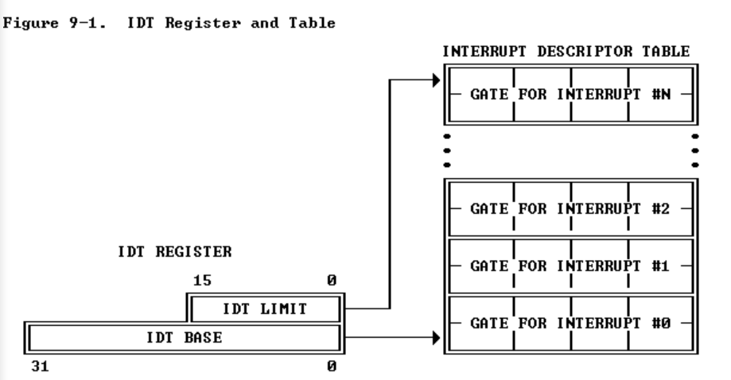
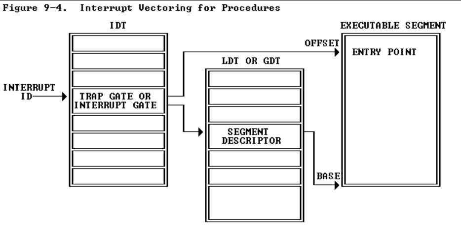
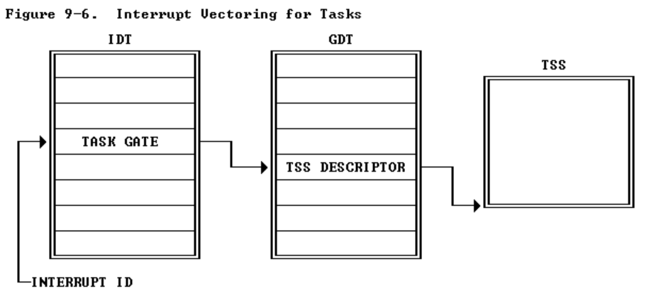
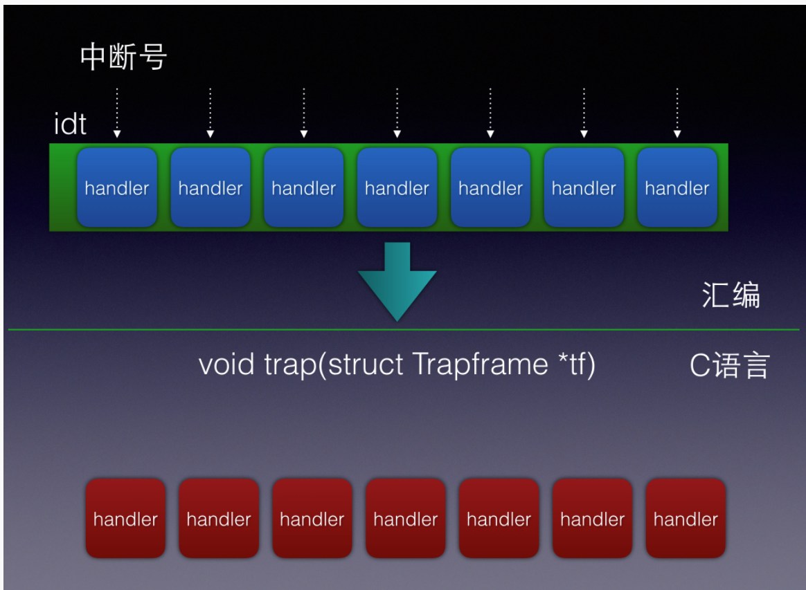
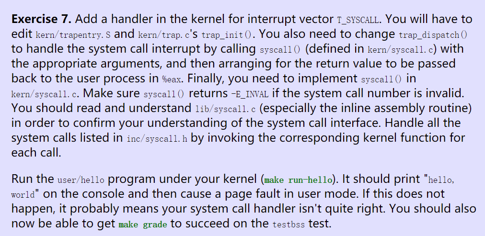

[TOC]

# Lab 3: User Environments

## Introduction

- **进程：**实现运行受保护的用户模式环境（即“进程”）所需的基本内核设施。 -- 以加载用户ELF文件并执行。
- **异常处理：**增强 JOS 内核以设置数据结构以跟踪用户环境、创建单个用户环境、将程序映像加载到其中并启动它运行。 -- 建立异常处理机制，异常发生时能从用户态进入内核进行处理，然后返回用户态。
- **系统调用：**使 JOS 内核能够处理用户环境进行的任何系统调用并处理它引起的任何其他异常。-- 借助异常处理机制，提供系统调用的能力。

注意：在本实验中，术语“环境”(*environment* )和“进程“(*process*)可互换 - 两者均指允许您运行程序的抽象。我们引入术语“环境”而不是传统术语“进程”是为了强调 JOS 环境和 UNIX 进程提供不同的接口，并且不提供相同的语义。

**环境即进程！！**

### Getting Started

实验 3 包含许多新的源文件，您应该浏览这些文件：


- `inc`
  -  `env.h`  --- 用户模式环境的公共定义
  -  `trap.h` --- 陷阱处理的公共定义
  -  `syscall.h`  --- 从用户环境到内核的系统调用的公共定义
  -  `lib.h`  --- 用户模式支持库的公共定义
- `kern`
  - `env.h` --- 用户模式环境的内核私有定义
  - `env.c` --- 用户模式环境的内核定义
  - `trap.h` --- 内核私有陷阱处理定义
  - `trap.c` --- 陷阱处理代码
  - `trapentry.S` --- 汇编语言陷阱处理程序入口点
  - `syscall.h` --- 系统调用处理的内核私有定义
  - `syscall.c` --- 系统调用实现代码
- `lib`
  - `Makefrag` --- 构建用户模式库的 Makefile 片段，obj/lib/libjos.a
  - `entry.S` --- 用户环境的汇编语言入口点
  - `libmain.c` --- 从 entry.S 调用的用户模式库设置代码
  - `syscall.c` --- 用户模式系统调用存根函数
  - `console.c` --- putchar 和 getchar 的用户模式实现，提供控制台 I/O
  - `exit.c` --- 退出的用户模式实现
  - `panic.c` --- `panic`的用户模式实现
- `user / * ` --- 用于检查内核实验室 3 代码的各种测试程序

此外，我们为 lab2 分发的一些源文件在 lab3 中进行了修改。要查看差异，您可以键入：

```shell
git diff lab2
```

### Inline Assembly

**内联汇编**

在本实验中，您可能会发现 GCC 的内联汇编语言功能很有用，尽管也可以不使用它来完成实验。至少，您需要能够理解我们提供给您的源代码中已经存在的内联汇编语言`asm`语句）的片段。您可以在类参考资料页面上找到有关 GCC 内联汇编语言的多个信息来源。


## Part A: User Environments and Exception Handling

**用户环境和异常处理**

新的包含文件 `inc/env.h `包含 JOS 中用户环境的基本定义。内核使用 Env 数据结构来跟踪每个用户环境。在本实验中，您最初将只创建一个环境，但您需要设计 JOS 内核以支持多种环境；实验 4 将通过允许用户环境分叉其他环境来利用此功能。

`inc/env.h`

```c
/* See COPYRIGHT for copyright information. */

#ifndef JOS_INC_ENV_H
#define JOS_INC_ENV_H

#include <inc/types.h>
#include <inc/trap.h>
#include <inc/memlayout.h>

typedef int32_t envid_t;

// An environment ID 'envid_t' has three parts:
//
// +1+---------------21-----------------+--------10--------+
// |0|          Uniqueifier             |   Environment    |
// | |                                  |      Index       |
// +------------------------------------+------------------+
//                                       \--- ENVX(eid) --/
//
// The environment index ENVX(eid) equals the environment's index in the
// 'envs[]' array.  The uniqueifier distinguishes environments that were
// created at different times, but share the same environment index.
//
// All real environments are greater than 0 (so the sign bit is zero).
// envid_ts less than 0 signify errors.  The envid_t == 0 is special, and
// stands for the current environment.

// 环境 ID 'envid_t' 包含三个部分
//
// +1+---------------21-----------------+--------10--------+
// |0|          Uniqueifier             |   Environment    |
// | |                                  |      Index       |
// +------------------------------------+------------------+
//                                       \--- ENVX(eid) --/
// 环境索引 ENVX(eid) 等于 'envs[]' 数组中的环境索引。 
// uniqueifier 区分在不同时间创建但共享相同环境索引的环境。
//
// 所有真实环境都大于 0（因此符号位为零）。
// envid_ts 小于 0 表示错误。 
// envid_t == 0 是特殊的，代表当前环境。


#define LOG2NENV                10
#define NENV                    (1 << LOG2NENV) // 最多同时活动的环境数
#define ENVX(envid)             ((envid) & (NENV - 1))

// Values of env_status in struct Env
// struct Env 中 env_status 的值  --- 进程状态
enum {
        ENV_FREE = 0,
        ENV_DYING,
        ENV_RUNNABLE,
        ENV_RUNNING,
        ENV_NOT_RUNNABLE
};

// Special environment types
// 特殊进程类型
enum EnvType {
        ENV_TYPE_USER = 0,
};

struct Env {
        struct Trapframe env_tf;        // Saved registers 保存的寄存器
        struct Env *env_link;           // Next free Env 下一个空闲环境
        envid_t env_id;                 // Unique environment identifier 唯一环境标识符
        envid_t env_parent_id;          // env_id of this env's parent env的父级env_id
        enum EnvType env_type;          // Indicates special system environments 表示特殊的系统环境
        unsigned env_status;            // Status of the environment 环境状态
        uint32_t env_runs;              // Number of times environment has run 环境运行的次数

        // Address space -- 地址空间
        pde_t *env_pgdir;               // Kernel virtual address of page dir 页面目录的内核虚拟地址
};

#endif // !JOS_INC_ENV_H
```


正如您在 `kern/env.c` 中看到的，内核维护着三个与环境相关的主要**全局变量**：

```c
struct Env *envs = NULL;		    // All environments -- 所有进程
struct Env *curenv = NULL;		    // The current env -- 当前进程
static struct Env *env_free_list;	// Free environment list -- 空闲进程
```

一旦 JOS 启动并运行，`envs` 指针就会指向一个表示系统中所有环境的 `Env` 结构数组。在我们的设计中，JOS 内核将支持最多 `NENV` 同时活动的环境，尽管在任何给定时间运行的环境通常会少得多。 （NENV 是 `inc/env.h` 中的常量）一旦分配，`envs` 数组将包含每个 NENV 可能环境的 Env 数据结构的单个实例。

JOS 内核在 `env_free_list` 中保留了所有不活动的 `Env` 结构。这种设计允许轻松分配和释放环境，因为它们只需添加到空闲列表或从空闲列表中删除。

内核使用 `curenv `符号在任何给定时间跟踪当前正在执行的环境。在启动期间，在运行第一个环境之前，`curenv` 最初设置为 NULL。

### Environment State  进程状态

**环境状态**

Env 结构在 `inc/env.h` 中定义如下（尽管在未来的实验室中将添加更多字段）：

````c
struct Env {
	struct Trapframe env_tf;	// Saved registers
	struct Env *env_link;		// Next free Env
	envid_t env_id;			// Unique environment identifier
	envid_t env_parent_id;		// env_id of this env's parent
	enum EnvType env_type;		// Indicates special system environments
	unsigned env_status;		// Status of the environment
	uint32_t env_runs;		// Number of times environment has run

	// Address space
	pde_t *env_pgdir;		// Kernel virtual address of page dir
};
````

以下是 Env 字段的用途：

- **env_tf**:

这个在 `inc/trap.h` 中定义的结构保存了该环境未运行时为该环境保存的寄存器值：即，当内核或其他环境正在运行时。**当从用户模式切换到内核模式时，内核会保存这些信息，以便稍后可以从中断处恢复环境。**

```c
struct Trapframe {
        struct PushRegs tf_regs;
        uint16_t tf_es;
        uint16_t tf_padding1;
        uint16_t tf_ds;
        uint16_t tf_padding2;
        uint32_t tf_trapno;
        /* below here defined by x86 hardware */
        uint32_t tf_err;
        uintptr_t tf_eip;
        uint16_t tf_cs;
        uint16_t tf_padding3;
        uint32_t tf_eflags;
        /* below here only when crossing rings, such as from user to kernel */
        uintptr_t tf_esp;
        uint16_t tf_ss;
        uint16_t tf_padding4;
} __attribute__((packed));

struct PushRegs {
        /* registers as pushed by pusha */
        uint32_t reg_edi;
        uint32_t reg_esi;
        uint32_t reg_ebp;
        uint32_t reg_oesp;              /* Useless */
        uint32_t reg_ebx;
        uint32_t reg_edx;
        uint32_t reg_ecx;
        uint32_t reg_eax;
} __attribute__((packed));
```

- **env_link**:

这是指向 `env_free_list` 上的下一个 Env 的指针。 `env_free_list` 指向列表中的第一个空闲环境。

- **env_id**:

内核在此处存储一个值，该值**唯一标识当前使用此 Env 结构的环境**（即，使用 `envs` 数组中的此特定插槽）。用户环境终止后，内核可能会将相同的 Env 结构重新分配给不同的环境 - 但即使新环境重新使用 `envs` 数组中的相同插槽，新环境也将具有与旧环境不同的 `env_id` .

- **env_parent_id**:

内核在此处存储创建此环境的父环境的 `env_id`。通过这种方式，环境可以形成一个“家谱”，这将有助于做出关于允许哪些环境对谁做什么的安全决策。

- **env_type**:

这用于区分特殊环境。对于大多数环境，它将是 `ENV_TYPE_USER`。我们将在后面的实验中为特殊系统服务环境引入更多类型。

```c
// Special environment types
// 特殊进程类型
enum EnvType {
        ENV_TYPE_USER = 0,
};
```


- **env_status**:    此变量包含以下值之一：
  - `ENV_FREE`:表示 Env 结构处于非活动状态，因此在 `env_free_list` 上。
  - `ENV_RUNNABLE`:表示 Env 结构代表一个正在等待在处理器上运行的环境。 - **就绪态**
  - `ENV_RUNNING`:表示Env结构代表当前运行的环境。- **运行态**
  - `ENV_NOT_RUNNABLE`:表示 Env 结构表示当前活动的环境，但它当前尚未准备好运行：例如，因为它正在等待来自另一个环境的进程间通信 (IPC)。 - **阻塞态**
  - `ENV_DYING`:表示Env结构代表僵尸环境。僵尸环境将在下一次陷入内核时被释放。在实验 4 之前我们不会使用这个标志。

```c
// Values of env_status in struct Env
// struct Env 中 env_status 的值  --- 进程状态
enum {
        ENV_FREE = 0,
        ENV_DYING,
        ENV_RUNNABLE,
        ENV_RUNNING,
        ENV_NOT_RUNNABLE
};
```

- **env_pgdir**:

这个变量保存了这个环境页面目录的**内核虚拟地址**。


与 Unix 进程一样，**JOS 环境将“线程”和“地址空间”的概念结合在一起。线程主要由保存的寄存器（`env_tf` 字段）定义，地址空间由 `env_pgdir` 指向的页目录和页表定义。**为了运行一个环境，内核必须用保存的寄存器和适当的地址空间设置 CPU。

我们的 `struct Env` 类似于 xv6 中的 `struct proc`。这两个结构都在 Trapframe 结构中保存环境（即进程的）用户模式寄存器状态。在 JOS 中，单个环境没有像 xv6 中的进程那样拥有自己的内核堆栈。**内核中一次只能有一个 JOS 环境处于活动状态，因此 JOS 只需要一个内核堆栈。**


### Allocating the Environments Array

**分配环境数组**

在实验 2 中，您在 `mem_init()` 中为 `pages[]` 数组分配了内存，该数组是内核用来跟踪哪些页是空闲的，哪些不是的表。您现在需要进一步修改 `mem_init()` 以分配一个类似的 Env 结构数组，称为 `envs`。


**Exercise 1**

修改 `kern/pmap.c` 中的 `mem_init()` 来分配和映射` envs` 数组。该数组完全由 Env 结构的 NENV 实例组成，分配方式与分配 pages 数组的方式非常相似。与 pages 数组一样，内存支持环境也应该在 UENVS（在 `inc/memlayout.h` 中定义）映射为**用户只读**，以便用户进程可以从该数组中读取。您应该运行您的代码并确保 check_kern_pgdir() 成功。

**实验过程：**

`kern/pmap.c - mem_init()`

- envs的初始化

```c
  pages = (struct PageInfo*) boot_alloc(sizeof(struct PageInfo) * npages);
  memset(pages, 0, sizeof(struct PageInfo) * npages); // initialize -- 0
  cprintf("head of *pages in pmap.c: %08x\n", pages);

//////////////////////////////////////////////////////////////////////
        // Make 'envs' point to an array of size 'NENV' of 'struct Env'.
        // LAB 3: Your code here.
envs = (struct Env*)boot_alloc(sizeof(struct Env) * NENV);
memset(envs, 0, sizeof(struct Env) * NENV);
```

- 映射到UENVS

```c
 //////////////////////////////////////////////////////////////////////        // Map 'pages' read-only by the user at linear address UPAGES        // Permissions:        //    - the new image at UPAGES -- kernel R, user R        //      (ie. perm = PTE_U | PTE_P)        //    - pages itself -- kernel RW, user NONE        // Your code goes here:        boot_map_region(kern_pgdir, UPAGES, PTSIZE, PADDR(pages), PTE_U);        //////////////////////////////////////////////////////////////////////        // Map the 'envs' array read-only by the user at linear address UENVS        // (ie. perm = PTE_U | PTE_P).        // Permissions:        //    - the new image at UENVS  -- kernel R, user R        //    - envs itself -- kernel RW, user NONE        // LAB 3: Your code here.		boot_map_region(kern_pgdir, UENVS, PTSIZE, PADDR(envs), PTE_U);
```

内核线性地址空间到物理地址空间的映射关系可用下图表示：


### Creating and Running Environments

**创建和运行环境**

您现在将在 `kern/env.c` 中编写运行用户环境所需的代码。因为我们还没有文件系统，我们将设置内核以加载嵌入内核本身的静态二进制映像( static binary image)。 JOS 将此二进制文件作为 ELF 可执行映像嵌入内核中。

```shell
llf@ubuntu:~/Documents/6.828/lab/obj/user$ ls
badsegment       buggyhello.asm  faultreadkernel       faultwrite.sym
badsegment.asm   buggyhello.o    faultreadkernel.asm   hello
badsegment.o     buggyhello.sym  faultreadkernel.o     hello.asm
badsegment.sym   divzero         faultreadkernel.sym   hello.o
breakpoint       divzero.asm     faultread.o           hello.sym
breakpoint.asm   divzero.o       faultread.sym         softint
breakpoint.o     divzero.sym     faultwrite            softint.asm
breakpoint.sym   evilhello       faultwrite.asm        softint.o
buggyhello       evilhello.asm   faultwritekernel      softint.sym
buggyhello2      evilhello.o     faultwritekernel.asm  testbss
buggyhello2.asm  evilhello.sym   faultwritekernel.o    testbss.asm
buggyhello2.o    faultread       faultwritekernel.sym  testbss.o
buggyhello2.sym  faultread.asm   faultwrite.o          testbss.sym
```

- **????**   二进制文件

  Lab 3 GNUmakefile 在 `obj/user/` 目录中生成许多二进制图像。如果您查看 `kern/Makefrag`，您会注意到一些魔法，将这些二进制文件直接“链接”到内核可执行文件中，就好像它们是` .o` 文件一样。链接器命令行上的 `-b `二进制选项导致这些文件被链接为“原始”未解释的二进制文件，而不是编译器生成的常规 `.o` 文件。 （就链接器而言，这些文件根本不必是 ELF 图像——它们可以是任何东西，例如文本文件或图片！）如果您在构建内核后查看 `obj/kern/kernel.sym`，您会注意到链接器“神奇地”产生了许多有趣的符号，它们的名称晦涩难懂，例如 `_binary_obj_user_hello_start`、`_binary_obj_user_hello_end` 和 `_binary_obj_user_hello_size`。链接器通过修改二进制文件的文件名来生成这些符号名；这些符号为常规内核代码提供了一种引用嵌入式二进制文件的方法。

在 `kern/init.c` 中的 `i386_init()` 中，您将看到在环境中运行这些二进制映像之一的代码。但是，设置用户环境的关键功能并不完整；你需要填写它们。


**Exercise 2**

在文件 `kern/env.c` 中，完成以下函数的代码：

- `env_init()`

初始化 `envs `数组中的所有 Env 结构并将它们添加到 `env_free_list`。还调用 `env_init_percpu`，它使用单独的段为权限级别 0（内核）和权限级别 3（用户）配置分段硬件。

- `env_setup_vm()`

为新环境分配页目录(page directory)并初始化新环境地址空间的内核部分。

- `region_alloc()`

为环境分配和映射物理内存(physical memory)

- `load_icode()`

您将需要解析一个 ELF 二进制映像( ELF binary image)，就像引导加载程序已经做的那样，并将其内容加载到新环境的用户地址空间中。

- `env_create()`

使用 `env_alloc` 分配环境并调用 `load_icode `将 ELF 二进制文件加载到其中。

- `env_run()`

启动在用户模式下运行的给定环境。


在编写这些函数时，您可能会发现新的 cprintf 动词 `%e `很有用——它会打印与错误代码对应的描述。例如，会因消息“env_alloc：内存不足”而恐慌

```c
r = -E_NO_MEM;panic("env_alloc: %e", r);
```


#### 实验过程

##### `env_init()`

**作用：**初始化 `envs `数组中的所有 Env 结构并将它们添加到 `env_free_list`。还调用 `env_init_percpu`，它使用单独的段为权限级别 0（内核）和权限级别 3（用户）配置分段硬件。

- `env_init_percpu`   --- 使用单独的段为权限级别 0（内核）和权限级别 3（用户）配置分段硬件

```c
// Load GDT and segment descriptors.  加载GDT和段描述符
// 初始化段寄存器gs, fs, es, ds, ss
void
env_init_percpu(void)
{
        lgdt(&gdt_pd);
        // The kernel never uses GS or FS, so we leave those set to
        // the user data segment.
    	// 内核从不使用 GS 或 FS，因此我们将这些设置留给用户数据段。 
        asm volatile("movw %%ax,%%gs" : : "a" (GD_UD|3));
        asm volatile("movw %%ax,%%fs" : : "a" (GD_UD|3));
        // The kernel does use ES, DS, and SS.  We'll change between
        // the kernel and user data segments as needed.
    	// 内核确实使用 ES、DS 和 SS。我们将根据需要在内核和用户数据段之间进行更改。 
        asm volatile("movw %%ax,%%es" : : "a" (GD_KD));
        asm volatile("movw %%ax,%%ds" : : "a" (GD_KD));
        asm volatile("movw %%ax,%%ss" : : "a" (GD_KD));
        // Load the kernel text segment into CS.
    	// 将内核文本段加载到 CS 中。
        asm volatile("ljmp %0,$1f\n 1:\n" : : "i" (GD_KT));
        // For good measure, clear the local descriptor table (LDT),
        // since we don't use it.
    	// 为了更好地衡量，清除本地描述符表 (LDT)，因为我们不使用它。 
        lldt(0);
}

```

- `GDT`  --- `kern/env.c`

```c
// Global descriptor table.
//
// Set up global descriptor table (GDT) with separate segments for
// kernel mode and user mode.  Segments serve many purposes on the x86.
// We don't use any of their memory-mapping capabilities, but we need
// them to switch privilege levels. 
//
// The kernel and user segments are identical except for the DPL.
// To load the SS register, the CPL must equal the DPL.  Thus,
// we must duplicate the segments for the user and the kernel.
//
// In particular, the last argument to the SEG macro used in the
// definition of gdt specifies the Descriptor Privilege Level (DPL)
// of that descriptor: 0 for kernel and 3 for user.
//
struct Segdesc gdt[] =
{
        // 0x0 - unused (always faults -- for trapping NULL far pointers)
        SEG_NULL,

        // 0x8 - kernel code segment
        [GD_KT >> 3] = SEG(STA_X | STA_R, 0x0, 0xffffffff, 0),

        // 0x10 - kernel data segment
        [GD_KD >> 3] = SEG(STA_W, 0x0, 0xffffffff, 0),

        // 0x18 - user code segment
        [GD_UT >> 3] = SEG(STA_X | STA_R, 0x0, 0xffffffff, 3),

        // 0x20 - user data segment
        [GD_UD >> 3] = SEG(STA_W, 0x0, 0xffffffff, 3),

        // 0x28 - tss, initialized in trap_init_percpu()
        [GD_TSS0 >> 3] = SEG_NULL
};

struct Pseudodesc gdt_pd = {
        sizeof(gdt) - 1, (unsigned long) gdt
};
```

- `env_init()`

将 `envs` 中的所有环境标记为空闲，将它们的 `env_ids` 设置为 0，并将它们插入到 `env_free_list `中。确保环境在空闲列表中的顺序与它们在 `envs` 数组中的顺序相同（即，第一次调用 `env_alloc()` 返回 `envs[0]`）

```c
// Mark all environments in 'envs' as free, set their env_ids to 0,
// and insert them into the env_free_list.
// Make sure the environments are in the free list in the same order
// they are in the envs array (i.e., so that the first call to
// env_alloc() returns envs[0]).
//
void
env_init(void)
{
        // Set up envs array
        // LAB 3: Your code here.
        env_free_list  = NULL;
        for (int i = NENV - 1; i >= 0; i--){
            envs[i].env_status = ENV_FREE;  // Mark all environments in 'envs' as free
            envs[i].env_id = 0; // set their env_ids to 0
            envs[i].env_link = env_free_list; // insert them into the env_free_list
            env_free_list = &envs[i];
        }

        // Per-CPU part of the initialization
        env_init_percpu(); // Load GDT and segment descriptors
}
```


##### `env_setup_vm()`

**作用：**为新环境分配页目录(page directory)并初始化新环境地址空间的内核部分。总的思路就是给`e`指向的Env结构分配页目录，并且继承内核的页目录结构，唯一需要修改的是UVPT需要映射到当前环境的页目录物理地址`e->env_pgdir`处，而不是内核的页目录物理地址`kern_pgdir`处。设置完页目录也就确定了当前用户环境线性地址空间到物理地址空间的映射。

**函数原型：**

```c
static intenv_setup_vm(struct Env *e)
```

- struct Env *e：ENV结构指针
- return: 0表示成功，-E_NO_MEM表示失败，没有足够物理地址。

**Detail:**

- 为环境`e`初始化内核虚拟内存布局。
- 分配一个页目录，相应地设置`e->env_pgdir`，并初始化新环境地址空间的内核部分。 不要（还）将任何内容映射到环境虚拟地址空间的用户部分。
- 成功返回 0，错误返回 < 0。错误包括： -E_NO_MEM 如果无法分配页目录或表
- 设置 e->env_pgdir 并初始化页面目录 --- HINT
  - 所有环境的 VA 空间在 UTOP 之上是相同的（除了我们在下面设置的 UVPT）。有关权限和布局，请参见 `inc/memlayout.h`。你可以使用 `kern_pgdir` 作为模板吗？提示：是的。（确保您在实验 2 中获得了正确的权限。）
  - UTOP 以下的初始 VA 为空。
  - 您不需要再调用 page_alloc。
  - **注意：**通常，`pp_ref` 不会为仅映射到 UTOP 之上的物理页面维护，但 `env_pgdir` 是一个例外——您需要增加 `env_pgdir` 的 `pp_ref` 才能使 `env_free` 正常工作。
  - `kern/pmap.h` 中的函数很方便。

```c
//
// Initialize the kernel virtual memory layout for environment e.
// Allocate a page directory, set e->env_pgdir accordingly,
// and initialize the kernel portion of the new environment's address space.
// Do NOT (yet) map anything into the user portion
// of the environment's virtual address space.
//
// Returns 0 on success, < 0 on error.  Errors include:
//      -E_NO_MEM if page directory or table could not be allocated.
//
static int
env_setup_vm(struct Env *e)
{
        int i;
        struct PageInfo *p = NULL;

        // Allocate a page for the page directory
    	// 为页目录分配一个页
        if (!(p = page_alloc(ALLOC_ZERO)))
                return -E_NO_MEM;

        // Now, set e->env_pgdir and initialize the page directory.
        //
        // Hint:
        //    - The VA space of all envs is identical above UTOP
        //      (except at UVPT, which we've set below).
        //      See inc/memlayout.h for permissions and layout.
        //      Can you use kern_pgdir as a template?  Hint: Yes.
        //      (Make sure you got the permissions right in Lab 2.)
        //    - The initial VA below UTOP is empty.
        //    - You do not need to make any more calls to page_alloc.
        //    - Note: In general, pp_ref is not maintained for
        //      physical pages mapped only above UTOP, but env_pgdir
        //      is an exception -- you need to increment env_pgdir's
        //      pp_ref for env_free to work correctly.
        //    - The functions in kern/pmap.h are handy.

        // LAB 3: Your code here.
    	// set e->env_pgdir
    	e->env_pgdir = (pde_t *)(page2kva(p));
    	// The initial VA below UTOP is empty -- Map the directory below UTOP
		for(int i = 0; i < PDX(UTOP); ++i)  // PDX(UTOP) = UTOP / PTSIZE
			e->env_pgdir[i] = 0;
		// Map the directory above UTOP
		for(int i = PDX(UTOP); i < NPDENTRIES; ++i)   // NPDENTRIES = 1024
			e->env_pgdir[i] = kern_pgdir[i];

		p->pp_ref++; // increment env_pgdir's pp_ref
   	
        // UVPT maps the env's own page table read-only.
        // Permissions: kernel R, user R
    	// UVPT 将 env 自己的页表映射为只读。
    	// 权限：内核 R，用户 R
        e->env_pgdir[PDX(UVPT)] = PADDR(e->env_pgdir) | PTE_P | PTE_U;

        return 0;
}
```


##### `region_alloc()`

**作用：**为用户环境分配和映射物理内存(physical memory)，需要把起始地址和终止地址进行**页对齐**，对其之后我们就可以以页为单位，为其一个页一个页的分配内存，并且修改页目录表和页表。

**函数原型：**

```c
static voidregion_alloc(struct Env *e, void *va, size_t len)
```

- struct Env *e：需要操作的用户环境

- void *va：虚拟地址

- size_t len：长度

**Detail:**

- 为环境` env` 分配 `len` 字节的物理内存，并将其映射到环境地址空间中的虚拟地址 `va`。不以任何方式归零或以其他方式初始化映射页面。页面应该是用户和内核可写的。如果任何分配尝试失败，则恐慌。
- **提示：**如果调用者可以传递非页面对齐的 `va` 和 `len` 值，则使用 region_alloc 会更容易。您应该将 `va` 向下舍入，并将 `(va + len)` 向上舍入。 （注意角落情况！）

```c
//
// Allocate len bytes of physical memory for environment env,
// and map it at virtual address va in the environment's address space.
// Does not zero or otherwise initialize the mapped pages in any way.
// Pages should be writable by user and kernel.
// Panic if any allocation attempt fails.
//
static void
region_alloc(struct Env *e, void *va, size_t len)
{
        // LAB 3: Your code here.
        // (But only if you need it for load_icode.)
        //
        // Hint: It is easier to use region_alloc if the caller can pass
        //   'va' and 'len' values that are not page-aligned.
        //   You should round va down, and round (va + len) up.
        //   (Watch out for corner-cases!)
    	void* start = (void*)ROUNDDOWN((uint32_t)va, PGSIZE); // round va down
    	void* end =  (void*)ROUNDUP((uint32_t)va+len, PGSIZE); // round (va + len) up
    	void* i; // loop  var
    	int r;
    	struct PageInfo *p = NULL;
    	for (i = start; i < end; i += PGSIZE){
            p = page_alloc(0);
            if (p == NULL)
                panic(" region alloc, allocation failed.\n");
            
            r = page_insert(e->env_pgdir, p, i, PTE_W | PTE_U);  // alloc 
            if (r != 0)
                panic("region_alloc error: %e\n", r);
        }
}
```


##### `load_icode()`

**作用：**您将需要解析一个 ELF 二进制映像( ELF binary image)，就像引导加载程序已经做的那样，并将其内容加载到新环境的用户地址空间中。即为每一个用户进程设置它的初始代码区，堆栈以及处理器标识位。**每个用户程序都是ELF文件**，所以我们要解析该ELF文件。

**函数原型：**

```c
static void
load_icode(struct Env *e, uint8_t *binary)
```

- `struct Env *e`：需要操作的用户环境

- `uint8_t *binary`：可执行用户代码的起始地址 

- Func: 加载binary地址开始处的ELF文件

**Detail:**

- 为用户进程设置初始程序二进制、堆栈和处理器标志。此函数仅在内核初始化期间调用，在运行第一个用户模式环境之前。
- 该函数将所有可加载段从 ELF 二进制映像加载到环境的用户内存中，从 ELF 程序头(ELF program header)中指示的适当虚拟地址(va)开始。同时，它将程序头中标记为已映射但实际上不存在于 ELF 文件中的这些段的任何部分**清零**, 即程序的 bss 部分。
- 所有这些与我们的**引导加载程序**所做的非常相似，除了引导加载程序还需要从磁盘读取代码。查看 `boot/main.c` 以获得想法。  `ELFHDR`

```c
#define SECTSIZE        512#define ELFHDR          ((struct Elf *) 0x10000) // scratch spacevoid readsect(void*, uint32_t);void readseg(uint32_t, uint32_t, uint32_t);voidbootmain(void){        struct Proghdr *ph, *eph;        // read 1st page off disk        readseg((uint32_t) ELFHDR, SECTSIZE*8, 0);        // is this a valid ELF?        if (ELFHDR->e_magic != ELF_MAGIC)                goto bad;        // load each program segment (ignores ph flags)        ph = (struct Proghdr *) ((uint8_t *) ELFHDR + ELFHDR->e_phoff);        eph = ph + ELFHDR->e_phnum;        for (; ph < eph; ph++)                // p_pa is the load address of this segment (as well                // as the physical address)                readseg(ph->p_pa, ph->p_memsz, ph->p_offset);        // call the entry point from the ELF header        // note: does not return!        ((void (*)(void)) (ELFHDR->e_entry))();bad:        outw(0x8A00, 0x8A00);        outw(0x8A00, 0x8E00);        while (1)                /* do nothing */;}
```

- 最后，该函数为程序的**初始堆栈映射一页**。
- **Error :** 如果遇到问题，load_icode 会发生恐慌。 load_icode 怎么会失败？给定的输入可能有什么问题？

**Hint:**

- 将每个程序段加载到 ELF 段头中指定的地址处的虚拟内存中。你应该只加载带有 `ph->p_type == ELF_PROG_LOAD` 的段。每个段的虚拟地址可以在 `ph->p_va` 中找到，它在内存中的大小可以在 `ph->p_memsz` 中找到。 ELF 二进制文件中的 `ph->p_filesz `字节，从`binary + ph->p_offset`开始，应该被复制到虚拟地址 `ph->p_va`。任何剩余的内存字节都应该被清除为零。（ELF 头应该有 `ph->p_filesz <= ph->p_memsz`。）使用上一个实验中的函数来分配和映射页面。

- 所有页面保护位现在应该是用户读/写。 **ELF 段不一定是页面对齐**的，但您可以假设对于此功能，没有两个段会接触同一个虚拟页面。

- 如果您可以将数据直接移动到存储在 ELF 二进制文件中的虚拟地址， 则加载段要简单得多。那么在此功能期间应该使用哪个页面目录？

- 您还必须对程序的入口点做一些事情，以确保环境在那里开始执行。

- 在我们将 ELF 文件加载到环境的用户内存后，我们应该再次切换到 kern_pgdir，因为我们仍然处于内核模式。

  ```c
  lcr3(PADDR(e->env_pgdir));
  ```

  

```c
// Set up the initial program binary, stack, and processor flags// for a user process.// This function is ONLY called during kernel initialization,// before running the first user-mode environment.// 为用户进程设置初始程序二进制、堆栈和处理器标志。// 此函数仅在内核初始化期间调用，在运行第一个用户模式环境之前。//// This function loads all loadable segments from the ELF binary image// into the environment's user memory, starting at the appropriate// virtual addresses indicated in the ELF program header.// At the same time it clears to zero any portions of these segments// that are marked in the program header as being mapped// but not actually present in the ELF file - i.e., the program's bss section.// 该函数将所有可加载段从 ELF 二进制映像加载到环境的用户内存中，// 从 ELF 程序头中指示的适当虚拟地址开始。// 同时，它将程序头中标记为已映射但实际上不存在于 ELF 文件中的这些段的任何部分清零，// 即程序的 bss 部分。// // All this is very similar to what our boot loader does, except the boot// loader also needs to read the code from disk.  Take a look at// boot/main.c to get ideas.// 所有这些与我们的引导加载程序所做的非常相似，除了引导加载程序还需要从磁盘读取代码。// 查看 boot/main.c 以获得想法。// // Finally, this function maps one page for the program's initial stack.// 最后，该函数为程序的初始堆栈映射一页。// // load_icode panics if it encounters problems.//  - How might load_icode fail?  What might be wrong with the given input?// 如果遇到问题，load_icode 会发生恐慌。 load_icode 怎么会失败？给定的输入可能有什么问题？// static voidload_icode(struct Env *e, uint8_t *binary){        // Hints:        //  Load each program segment into virtual memory        //  at the address specified in the ELF segment header.        //  You should only load segments with ph->p_type == ELF_PROG_LOAD.        //  Each segment's virtual address can be found in ph->p_va        //  and its size in memory can be found in ph->p_memsz.        //  The ph->p_filesz bytes from the ELF binary, starting at        //  'binary + ph->p_offset', should be copied to virtual address        //  ph->p_va.  Any remaining memory bytes should be cleared to zero.        //  (The ELF header should have ph->p_filesz <= ph->p_memsz.)        //  Use functions from the previous lab to allocate and map pages.        // 将每个程序段加载到 ELF 段头中指定的地址处的虚拟内存中。    	// 你应该只加载带有 ph->p_type == ELF_PROG_LOAD 的段。    	// 每个段的虚拟地址可以在 ph->p_va 中找到，它在内存中的大小可以在 ph->p_memsz 中找到。 		 // ELF 二进制文件中的 ph->p_filesz 字节，从“binary + ph->p_offset”开始，    	// 应该被复制到虚拟地址 ph->p_va。任何剩余的内存字节都应该被清除为零。    	// （ELF 头应该有 ph->p_filesz <= ph->p_memsz。）    	// 使用上一个实验中的函数来分配和映射页面。    	//         //  All page protection bits should be user read/write for now.        //  ELF segments are not necessarily page-aligned, but you can        //  assume for this function that no two segments will touch        //  the same virtual page.    	// 所有页面保护位现在应该是用户读/写。 ELF 段不一定是页面对齐的，    	// 但您可以假设对于此功能，没有两个段会接触同一个虚拟页面。        //        //  You may find a function like region_alloc useful.    	// 您可能会发现像 region_alloc 这样的函数很有用。        //        //  Loading the segments is much simpler if you can move data        //  directly into the virtual addresses stored in the ELF binary.        //  So which page directory should be in force during        //  this function?    	// 如果您可以将数据直接移动到存储在 ELF 二进制文件中的虚拟地址，    	// 则加载段要简单得多。那么在此功能期间应该使用哪个页面目录？        //        //  You must also do something with the program's entry point,        //  to make sure that the environment starts executing there.        //  What?  (See env_run() and env_pop_tf() below.)    	// 您还必须对程序的入口点做一些事情，以确保环境在那里开始执行。    	// 什么？ （请参阅下面的 env_run() 和 env_pop_tf()。）        // LAB 3: Your code here.    	//  access the ELF file    	struct Elf * ElfHeader = (struct Elf *)binary;    	if(ElfHeader->e_magic != ELF_MAGIC) {        	panic("load_icode failed: The binary we load is not ELF format.\n");        }    	if(ElfHeader->e_entry == 0){            panic("load_icode failed: The elf file can't be excuterd.\n");        }		struct Proghdr * ph = (struct Proghdr *) ((uint8_t *) ElfHeader + ElfHeader->e_phoff);  // program header		struct Proghdr * eph = ph + ElfHeader->e_phnum; // end program  header        	// load the ELF files to the enviroment's user memory    	// switch to env_pgdir    	lcr3(PADDR(e->env_pgdir));     	// Load each program segment into virtual memory		for(; ph < eph; ph++) {			if(ph->p_type == ELF_PROG_LOAD){				if(ph->p_memsz < ph->p_filesz)					panic("load_icode failed: p_memsz < p_filesz.\n");                				region_alloc(e, (void*)ph->p_va, ph->p_memsz);				memmove((void*)ph->p_va, (uint8_t *)binary + ph->p_offset, ph->p_filesz);				memset((void*)ph->p_va+ph->p_filesz, 0, ph->p_memsz-ph->p_filesz);			}		}		    	// switch to kern_pgdir again since we still in the kernel mode    	lcr3(PADDR(kern_pgdir));        	// program's entry point    	 e->env_tf.tf_eip = header->e_entry;        // Now map one page for the program's initial stack        // at virtual address USTACKTOP - PGSIZE.    	// 现在在虚拟地址 USTACKTOP - PGSIZE 处为程序的初始堆栈映射一页        // allocate space for the user stack    	region_alloc(e, (void*)(USTACKTOP-PGSIZE), PGSIZE);}
```

 ？？？？ ---   这里相当于实现一个ELF可执行文件加载器，不熟悉ELF文件结构的同学可以参考大佬之前的笔记[ELF格式](https://www.cnblogs.com/gatsby123/p/9750187.html)。ELF文件以一个ELF文件头开始，通过ELFHDR->e_magic字段判断该文件是否是ELF格式的，然后通过ELFHDR->e_phoff获取程序头距离ELF文件的偏移，ph指向的就是程序头的起始位置，相当于一个数组，程序头记录了有哪些Segment需要加载，加载到线性地址的何处？ph_num保存了总共有多少Segment。遍历ph数组，分配线性地址p_va开始的p_memsz大小的空间。并将ELF文件中`binary + ph[i].p_offset`偏移处的Segment拷贝到线性地址p_va处。
有一点需要注意，在执行for循环前，需要加载e->env_pgdir，也就是这句`lcr3(PADDR(e->env_pgdir));`因为我们要将Segment拷贝到用户的线性地址空间内，而不是内核的线性地址空间。
加载完Segment后需要设置`e->env_tf.tf_eip = ELFHDR->e_entry;`也就是程序第一条指令的位置。
最后`region_alloc(e, (void *) (USTACKTOP - PGSIZE), PGSIZE);`为用户环境分配栈空间。


##### `env_create()`

**作用：**使用 `env_alloc` 分配环境并调用 `load_icode `将 ELF 二进制文件加载到到用户环境中。

**函数原型：**

```c
voidenv_create(uint8_t *binary, enum EnvType type)
```

- `uint8_t *binary`：将要加载的可执行文件的起始位置
- `enum EnvType type`：用户环境类型 -- 进程类型

**Detail:**

- 从env_free_list链表拿一个Env结构，加载从binary地址开始处的ELF可执行文件到该Env结构。
- 使用 `env_alloc` 分配一个新的 env，使用 `load_icode` 将命名的 `elf` 二进制文件加载到其中，并设置其 `env_type`。此函数仅在内核初始化期间调用，在运行第一个用户模式环境之前。新环境的父 `ID` 设置为 0。

```c
//// Allocates a new env with env_alloc, loads the named elf// binary into it with load_icode, and sets its env_type.// This function is ONLY called during kernel initialization,// before running the first user-mode environment.// The new env's parent ID is set to 0.//voidenv_create(uint8_t *binary, enum EnvType type){        // LAB 3: Your code here.    	struct Env * env = NULL;		int r = env_alloc(&env, 0);		if(r != 0)			panic("env_create failed: %e", r);		load_icode(env, binary);		env->env_type = type;}
```


##### `env_run()`

**作用**：启动在用户模式下运行的给定环境。

**函数原型：**

```c
void
env_run(struct Env *e)
```

- `struct Env *e`：需要执行的用户环境

**Detail:**

- 上下文从 `curenv` 切换到 `env e`。注意：如果这是对 `env_run` 的第一次调用，则 `curenv `为 NULL。

**Step:**

- Step 1: 如果这是上下文切换（正在运行新环境）：
  - 如果是 `ENV_RUNNING`，则将当前环境（如果有）设置回 `ENV_RUNNABLE`（想想它可以处于哪些其他状态）
  - 将`curenv`设置为新环境
  - 将其状态设置为 `ENV_RUNNING`
  - 更新它的`env_runs`计数器
  - 使用 lcr3() 切换到其地址空间
- Step 2: 使用 `env_pop_tf()` 恢复环境的寄存器并在环境中进入用户模式。

**Hint:**

- 此函数从 `e->env_tf` 加载新环境的状态。回顾你上面写的代码，确保你已经将 `e->env_tf` 的相关部分设置为合理的值。

```c
//// Context switch from curenv to env e.// Note: if this is the first call to env_run, curenv is NULL.//// This function does not return.//voidenv_run(struct Env *e){        // Step 1: If this is a context switch (a new environment is running):        //         1. Set the current environment (if any) back to        //            ENV_RUNNABLE if it is ENV_RUNNING (think about        //            what other states it can be in),        //         2. Set 'curenv' to the new environment,        //         3. Set its status to ENV_RUNNING,        //         4. Update its 'env_runs' counter,        //         5. Use lcr3() to switch to its address space.        // Step 2: Use env_pop_tf() to restore the environment's        //         registers and drop into user mode in the        //         environment.        // Hint: This function loads the new environment's state from        //      e->env_tf.  Go back through the code you wrote above        //      and make sure you have set the relevant parts of        //      e->env_tf to sensible values.        // LAB 3: Your code here.    	if(e == NULL)			panic("env_run failed: invalid environment\n");		if(curenv != e && curenv != NULL) {			if(curenv->env_status == ENV_RUNNING)				curenv->env_status = ENV_RUNNABLE;		}    	    	curenv = e; 		curenv->env_status = ENV_RUNNING;  		curenv->env_runs++;  // Update its 'env_runs' counter		lcr3(PADDR(curenv->env_pgdir)); // switch to its address space		env_pop_tf(&(curenv->env_tf));  // restore the environment's registers and drop into user mode in the environment.        panic("env_run not yet implemented");}
```

```c
env_create()
    -->env_alloc()
        -->env_setup_vm()
    -->load_icode()
        -->region_alloc()
```


**调用用户代码之前的代码调用图**。确保您了解每个步骤的目的。

- `start` (`kern/entry.S`)
- `i386_init (kern/init.c`)
  - `cons_init`
  - `mem_init`
  - `env_init`
  - `trap_init` (still incomplete at this point)
  - `env_create`
  - `env_run`
    - `env_pop_tf`

完成后，您应该编译内核并在 QEMU 下运行它。如果一切顺利，您的系统应该进入用户空间并执行 `hello` 二进制文件，直到它使用 `int` 指令进行系统调用。那时会有麻烦，因为 JOS 还没有设置硬件来允许从用户空间到内核的任何类型的转换。当CPU发现它没有设置处理这个系统调用中断时，就会产生一个通用保护异常，发现它不能处理那个，产生一个双故障异常，发现它也不能处理那个，并最终放弃所谓的“**三重故障(triple fault)**”。通常，您会看到 CPU 复位和系统重新启动。虽然这对于遗留应用程序很重要（有关原因的解释，请参阅此博客文章），但对于内核开发来说却很痛苦，因此使用 6.828 修补的 QEMU，您将看到寄存器转储和“三重故障”信息。

### TEST

我们很快就会解决这个问题，但现在我们可以使用调试器来检查我们是否正在进入用户模式(user mode)。使用 `make qemu-gdb`并在 `env_pop_tf` 处设置 GDB 断点，这应该是您在实际进入用户模式之前点击的最后一个函数。使用 `si` 单步执行此功能；处理器应该在 `iret` 指令之后进入用户模式。然后，您应该会看到用户环境的可执行文件中的第一条指令，即 `lib/entry.S` 中标签 `start` 处的 `cmpl` 指令。现在使用 `b *0x...` 在 hello 中的 `sys_cputs()` 中的 `int $0x30` 处设置断点（有关用户空间地址，请参见 `obj/user/hello.asm`）。这个 `int` 是向控制台显示字符的系统调用。如果你不能执行到 `int`，那么你的地址空间设置或程序加载代码有问题；在继续之前返回并修复它。

**地址空间：**

- `obj/boot/boot.asm --- boot start`

boot loader

```assembly
00007c00 <start>:.set CR0_PE_ON,      0x1         # protected mode enable flag
```

- `obj/boot/boot.asm ---- bootmain`

加载ELF程序

```assembly
00007d25 <bootmain>:
```

- `obj/kern/kernel.asm  --- env_pop_tf`

```assembly
f0103474 <env_pop_tf>:
```

-  `obj/user/hello.asm  --- sys_cputs()`

```assembly
 800111:       3d ff 00 00 00          cmp    $0xff,%eax
 800116:       74 0b                   je     800123 <putch+0x37>
                sys_cputs(b->buf, b->idx);
  800bc9:       89 c6                   mov    %eax,%esi
  800bcb:       cd 30                   int    $0x30
```

**调试报错！！！！**

[PADDR](https://qiita.com/kagurazakakotori/items/334ab87a6eeb76711936)

For GCC 7 or later, after switching to `lab3` branch an error like `kernel panic at kern/pmap.c:147: PADDR called with invalid kva 00000000` will occur. This is a bug caused by the linker script, modify `kern/kernel.ld` as follow will fix it.

```shell
kernel panic at kern/pmap.c:145: PADDR called with invalid kva 00000000
```

```assembly
--- a/kern/kernel.ld
+++ b/kern/kernel.ld
@@ -50,6 +50,7 @@ SECTIONS
        .bss : {
                PROVIDE(edata = .);
                *(.bss)
+               *(COMMON)
                PROVIDE(end = .);
                BYTE(0)
        }
```

The details are here. If you are not interested, just skip this part.

```shell
The target architecture is assumed to be i8086[f000:fff0]    0xffff0:	ljmp   $0xf000,$0xe05b0x0000fff0 in ?? ()+ symbol-file obj/kern/kernel(gdb) b env_pop_tf   # 设置断点Breakpoint 1 at 0xf01037f1: file kern/env.c, line 492.(gdb) cContinuing.The target architecture is assumed to be i386=> 0xf01037f1 <env_pop_tf>:	endbr32 Breakpoint 1, env_pop_tf (tf=0xf01d2000) at kern/env.c:492492	{(gdb) si => 0xf01037f5 <env_pop_tf+4>:	push   %ebp0xf01037f5	492	{(gdb) si=> 0xf01037f6 <env_pop_tf+5>:	mov    %esp,%ebp0xf01037f6 in env_pop_tf (tf=0xf0103888 <env_run+95>) at kern/env.c:492492	{(gdb) si=> 0xf01037f8 <env_pop_tf+7>:	push   %ebx0xf01037f8	492	{(gdb) si=> 0xf01037f9 <env_pop_tf+8>:	sub    $0x8,%esp0xf01037f9 in env_pop_tf (tf=0xf011afd8) at kern/env.c:492492	{(gdb) si=> 0xf01037fc <env_pop_tf+11>:	call   0xf0100173 <__x86.get_pc_thunk.bx>0xf01037fc in env_pop_tf (tf=0x0) at kern/env.c:492492	{(gdb) si=> 0xf0100173 <__x86.get_pc_thunk.bx>:	mov    (%esp),%ebx0xf0100173 in __x86.get_pc_thunk.bx ()(gdb) si=> 0xf0100176 <__x86.get_pc_thunk.bx+3>:	ret    0xf0100176 in __x86.get_pc_thunk.bx ()(gdb) i r      # 用户模式前寄存器值eax            0xf01d2000          -266526720ecx            0x6                 6edx            0x3bc000            3915776ebx            0xf0103801          -267372543esp            0xf011afa8          0xf011afa8ebp            0xf011afb8          0xf011afb8esi            0x10094             65684edi            0x0                 0eip            0xf0100176          0xf0100176 <__x86.get_pc_thunk.bx+3>eflags         0x96                [ PF AF SF ]cs             0x8                 8ss             0x10                16ds             0x10                16es             0x10                16fs             0x23                35gs             0x23                35(gdb) si=> 0xf0103801 <env_pop_tf+16>:	add    $0x8981b,%ebx0xf0103801 in env_pop_tf (tf=0x0) at kern/env.c:492492	{(gdb) si=> 0xf0103807 <env_pop_tf+22>:	mov    0x8(%ebp),%esp493		asm volatile((gdb) si=> 0xf010380a <env_pop_tf+25>:	popa   0xf010380a in env_pop_tf (tf=0x0) at kern/env.c:493493		asm volatile((gdb) si=> 0xf010380b <env_pop_tf+26>:	pop    %es0xf010380b in env_pop_tf (    tf=<error reading variable: Unknown argument list address for `tf'.>)    at kern/env.c:493493		asm volatile((gdb) si=> 0xf010380c <env_pop_tf+27>:	pop    %ds0xf010380c	493		asm volatile((gdb) si=> 0xf010380d <env_pop_tf+28>:	add    $0x8,%esp0xf010380d	493		asm volatile((gdb) si=> 0xf0103810 <env_pop_tf+31>:	iret   0xf0103810	493		asm volatile((gdb) i r     # 查看进入用户模式后寄存器值eax            0x0                 0ecx            0x0                 0edx            0x0                 0ebx            0x0                 0esp            0xf01d2030          0xf01d2030ebp            0x0                 0x0esi            0x0                 0edi            0x0                 0eip            0xf0103810          0xf0103810 <env_pop_tf+31>eflags         0x96                [ PF AF SF ]cs             0x8                 8ss             0x10                16ds             0x23                35es             0x23                35fs             0x23                35gs             0x23                35(gdb) si=> 0x800020:	cmp    $0xeebfe000,%esp0x00800020 in ?? ()(gdb) i reax            0x0                 0ecx            0x0                 0edx            0x0                 0ebx            0x0                 0esp            0xeebfe000          0xeebfe000ebp            0x0                 0x0esi            0x0                 0edi            0x0                 0eip            0x800020            0x800020eflags         0x2                 [ ]cs             0x1b                27   # 0x18是用户代码段的在GDT中的偏移，用户权限是0x3，所以选择子正好是0x1bss             0x23                35   # 寄存器值在env_alloc设置ds             0x23                35es             0x23                35fs             0x23                35gs             0x23                35(gdb) b *0x800bc9Breakpoint 2 at 0x800bc9(gdb) cContinuing.=> 0x800bc9:	mov    %eax,%esiBreakpoint 2, 0x00800bc9 in ?? ()(gdb) si=> 0x800bcb:	int    $0x30    # 系统调用，发生中断0x00800bcb in ?? ()(gdb) si=> 0x800bcb:	int    $0x300x00800bcb in ?? ()(gdb) si=> 0x800bcb:	int    $0x300x00800bcb in ?? ()(gdb) si=> 0x800bcb:	int    $0x300x00800bcb in ?? ()
```

观察执行iret前后的cs段寄存器的值，执行iret前cs的值0x8正是内核代码段的段选择子（GD_KT定义在inc/memlayout.h中），执行后cs的值0x1b，0x18是用户代码段的在GDT中的偏移（GD_UT定义在inc/memlayout.h中），用户权限是0x3，所以选择子正好是0x1b。

**控制台信息：**

```shell
qemu-system-i386 -drive file=obj/kern/kernel.img,index=0,media=disk,format=raw -serial mon:stdio -gdb tcp::26000 -D qemu.log  -SGtk-Message: 23:48:43.213: Failed to load module "canberra-gtk-module"6828 decimal is 15254 octal!Physical memory: 131072K available, base = 640K, extended = 130432Khead of *pages in pmap.c: f0192000     # 函数测试成功！！！check_page_free_list() succeeded!check_page_alloc() succeeded!check_page() succeeded!check_kern_pgdir() succeeded!check_page_free_list() succeeded!check_page_installed_pgdir() succeeded![00000000] new env 00001000   # 新进程EAX=00000000 EBX=00000000 ECX=0000000d EDX=eebfde88ESI=00000000 EDI=00000000 EBP=eebfde60 ESP=eebfde54EIP=00800bcb EFL=00000092 [--S-A--] CPL=3 II=0 A20=1 SMM=0 HLT=0ES =0023 00000000 ffffffff 00cff300 DPL=3 DS   [-WA]  # 寄存器值，env_alloc设置CS =001b 00000000 ffffffff 00cffa00 DPL=3 CS32 [-R-]SS =0023 00000000 ffffffff 00cff300 DPL=3 DS   [-WA]DS =0023 00000000 ffffffff 00cff300 DPL=3 DS   [-WA]FS =0023 00000000 ffffffff 00cff300 DPL=3 DS   [-WA]GS =0023 00000000 ffffffff 00cff300 DPL=3 DS   [-WA]LDT=0000 00000000 00000000 00008200 DPL=0 LDTTR =0028 f018fb80 00000067 00408900 DPL=0 TSS32-avlGDT=     f011c300 0000002fIDT=     f018f360 000007ffCR0=80050033 CR2=00000000 CR3=003bc000 CR4=00000000DR0=00000000 DR1=00000000 DR2=00000000 DR3=00000000 DR6=ffff0ff0 DR7=00000400EFER=0000000000000000Triple fault.  Halting for inspection via QEMU monitor.EAX=00000000 EBX=00000000 ECX=0000000d EDX=eebfde88ESI=00000000 EDI=00000000 EBP=eebfde60 ESP=eebfde54EIP=00800bcb EFL=00000092 [--S-A--] CPL=3 II=0 A20=1 SMM=0 HLT=0ES =0023 00000000 ffffffff 00cff300 DPL=3 DS   [-WA]CS =001b 00000000 ffffffff 00cffa00 DPL=3 CS32 [-R-]SS =0023 00000000 ffffffff 00cff300 DPL=3 DS   [-WA]DS =0023 00000000 ffffffff 00cff300 DPL=3 DS   [-WA]FS =0023 00000000 ffffffff 00cff300 DPL=3 DS   [-WA]GS =0023 00000000 ffffffff 00cff300 DPL=3 DS   [-WA]LDT=0000 00000000 00000000 00008200 DPL=0 LDTTR =0028 f018fb80 00000067 00408900 DPL=0 TSS32-avlGDT=     f011c300 0000002fIDT=     f018f360 000007ffCR0=80050033 CR2=00000000 CR3=003bc000 CR4=00000000DR0=00000000 DR1=00000000 DR2=00000000 DR3=00000000 DR6=ffff0ff0 DR7=00000400EFER=0000000000000000Triple fault.  Halting for inspection via QEMU monitor.EAX=00000000 EBX=00000000 ECX=0000000d EDX=eebfde88ESI=00000000 EDI=00000000 EBP=eebfde60 ESP=eebfde54EIP=00800bcb EFL=00000092 [--S-A--] CPL=3 II=0 A20=1 SMM=0 HLT=0ES =0023 00000000 ffffffff 00cff300 DPL=3 DS   [-WA]CS =001b 00000000 ffffffff 00cffa00 DPL=3 CS32 [-R-]SS =0023 00000000 ffffffff 00cff300 DPL=3 DS   [-WA]DS =0023 00000000 ffffffff 00cff300 DPL=3 DS   [-WA]FS =0023 00000000 ffffffff 00cff300 DPL=3 DS   [-WA]GS =0023 00000000 ffffffff 00cff300 DPL=3 DS   [-WA]LDT=0000 00000000 00000000 00008200 DPL=0 LDTTR =0028 f018fb80 00000067 00408900 DPL=0 TSS32-avlGDT=     f011c300 0000002fIDT=     f018f360 000007ffCR0=80050033 CR2=00000000 CR3=003bc000 CR4=00000000DR0=00000000 DR1=00000000 DR2=00000000 DR3=00000000 DR6=ffff0ff0 DR7=00000400EFER=0000000000000000Triple fault.  Halting for inspection via QEMU monitor.  # int    $0x30
```

对应`env_alloc`函数

```c
//// Allocates and initializes a new environment.// On success, the new environment is stored in *newenv_store.//// Returns 0 on success, < 0 on failure.  Errors include://      -E_NO_FREE_ENV if all NENV environments are allocated//      -E_NO_MEM on memory exhaustion//intenv_alloc(struct Env **newenv_store, envid_t parent_id){        int32_t generation;        int r;        struct Env *e;        if (!(e = env_free_list))                return -E_NO_FREE_ENV;        // Allocate and set up the page directory for this environment.        if ((r = env_setup_vm(e)) < 0)                return r;        // Generate an env_id for this environment.        generation = (e->env_id + (1 << ENVGENSHIFT)) & ~(NENV - 1);        if (generation <= 0)    // Don't create a negative env_id.                generation = 1 << ENVGENSHIFT;        e->env_id = generation | (e - envs);        // Set the basic status variables.        e->env_parent_id = parent_id;        e->env_type = ENV_TYPE_USER;        e->env_status = ENV_RUNNABLE;        e->env_runs = 0;        // Clear out all the saved register state,        // to prevent the register values        // of a prior environment inhabiting this Env structure        // from "leaking" into our new environment.        memset(&e->env_tf, 0, sizeof(e->env_tf));        // Set up appropriate initial values for the segment registers.        // GD_UD is the user data segment selector in the GDT, and        // GD_UT is the user text segment selector (see inc/memlayout.h).        // The low 2 bits of each segment register contains the        // Requestor Privilege Level (RPL); 3 means user mode.  When        // we switch privilege levels, the hardware does various        // checks involving the RPL and the Descriptor Privilege Level        // (DPL) stored in the descriptors themselves.    	// 设置进程寄存器        e->env_tf.tf_ds = GD_UD | 3;  // 设置ds        e->env_tf.tf_es = GD_UD | 3;  // 设置es        e->env_tf.tf_ss = GD_UD | 3;  // 设置ss        e->env_tf.tf_esp = USTACKTOP; // 设置esp        e->env_tf.tf_cs = GD_UT | 3;  // 设置cs        // You will set e->env_tf.tf_eip later.        // commit the allocation        env_free_list = e->env_link;        *newenv_store = e;        cprintf("[%08x] new env %08x\n", curenv ? curenv->env_id : 0, e->env_id);        return 0;}
```

` set e->env_tf.tf_eip later.`  在`load_inode`中设置


### Handling Interrupts and Exceptions

**处理中断和异常**

此时，用户空间中的第一条 `int $0x30` 系统调用指令是一条死胡同：一旦处理器进入用户模式，就无法退出。您现在需要实现基本的异常和系统调用处理，以便内核可以从用户模式代码中恢复对处理器的控制。您应该做的第一件事是彻底熟悉 x86 中断和异常机制。


**Exercise 3**

如果您还没有阅读 80386 程序员手册（或 IA-32 开发人员手册的第 5 章）中的第 9 章，异常和中断。

在本实验中，我们通常遵循 Intel 的中断( interrupts)、异常(exceptions)等术语。但是，**异常**(exception)、**陷阱**(trap)、**中断**(interrupt)、**故障**(fault)和**中止**(abort)等术语在架构或操作系统之间没有标准含义，并且经常在不考虑它们在特定架构（例如 x86）上的细微区别的情况下使用。当您在本实验室之外看到这些术语时，其含义可能略有不同。

#### Chapter 9 Exceptions and Interrupts

中断和异常是特殊类型的**控制传输**(control transfer)；它们的工作方式有点像未编程的 CALL(unprogrammed [CALL](https://pdos.csail.mit.edu/6.828/2018/readings/i386/CALL.htm)s)。它们改变正常程序流以处理外部事件或报告错误或异常情况。中断和异常的区别在于，**中断**是用来处理处理器外部的异步事件，而**异常**是用来处理处理器自身在执行指令过程中检测到的情况。nterrupts are used to handle asynchronous events external to the processor, but exceptions handle conditions detected by the processor itself in the course of executing instructions.

外部中断有两个来源，异常有两个来源：

- Interrupts
  - 可屏蔽中断，通过 INTR 引脚发出信号。Maskable interrupts, which are signalled via the INTR pin.
  - 不可屏蔽中断，通过 NMI（不可屏蔽中断）引脚发出信号。Nonmaskable interrupts, which are signalled via the NMI (Non-Maskable Interrupt) pin.
- Exceptions
  - 检测到处理器。这些进一步分类为故障、陷阱和中止。Processor detected. These are further classified as faults, traps, and aborts.
  - 程序。 `INTO`、`INT 3`、`INT n` 和 `BOUND` 指令可以触发异常。这些指令通常被称为“软件中断(software interrupts)”，但处理器将它们作为异常处理。

本章解释了 80386 在保护模式下执行时提供的用于控制和响应中断的功能。

##### 9.1 Identifying Interrupts 识别中断

处理器将识别号(identifying number)与每种不同类型的中断或异常相关联。

处理器识别的 NMI 和异常被分配了 0 到 31 范围内的预定标识符。目前并非所有这些数字都被 80386 使用；此范围内未分配的标识符由 Intel 保留以供将来扩展使用。

可屏蔽中断(maskable interrupts )的标识符由外部中断控制器（例如 Intel 的 8259A 可编程中断控制器）确定，并在处理器的中断确认序列期间与处理器通信。 8259A PIC 分配的编号可以由软件指定。可以使用 32 到 255 范围内的任何数字。表 9-1 显示了中断和异常标识符的分配。


根据异常的报告方式以及是否支持重新启动导致异常的指令，异常分为故障、陷阱或中止。

- Faults 故障

故障是在导致异常的**指令**“**之前”**报告的异常。在指令开始执行之前或在指令执行期间检测到故障。如果在指令期间检测到，则报告故障，机器恢复到允许指令重新启动的状态。

- Traps 陷阱

陷阱是在检测到异常的指令**之后**立即在指令边界处报告的异常。

- Aborts 中止

中止是一种异常，既不允许精确定位导致异常的指令，也不允许重新启动导致异常的程序。中止用于报告**严重错误**，例如硬件错误以及系统表中的不一致或非法值。


##### 9.2 Enabling and Disabling Interrupts  启用和禁用中断

**处理器仅在一条指令结束和下一条指令开始之间处理中断和异常**。当重复前缀(repeat prefix)用于重复字符串指令时，重复之间可能会发生中断和异常。因此，对长字符串的操作不会延迟中断响应。

某些条件和标志设置会导致处理器在指令边界(instruction boundaries)禁止某些中断和异常。

- **NMI Masks Further NMIs**  --- NMI 屏蔽了更多 NMI

在执行 NMI 处理程序时，处理器会忽略 NMI 引脚上的更多中断信号，直到执行下一条 IRET 指令。

- **IF Masks INTR ** -- IF 屏蔽 INTR

IF（interrupt-enable flag， 中断启用标志）控制通过 INTR 引脚发出信号的外部中断的接受。**当IF=0时，INTR中断被禁止；当 IF=1 时，INTR 中断被启用。**与其他标志位一样，处理器响应 RESET 信号清除 IF。 CLI 和 STI 指令更改 IF 的设置。

CLI（Clear Interrupt-Enable Flag，清除中断启用标志）和 STI（Set Interrupt-Enable Flag，设置中断启用标志）显式更改 IF（标志寄存器中的第 9 位）。只有在 `CPL <= IOPL` 时才能执行这些指令。如果在 `CPL > IOPL` 时执行它们，则会发生保护异常(protection exception)。

IF 还受到以下操作的隐式影响：

- PUSHF 指令将所有标志（包括 IF）存储在可以检查它们的堆栈中。
- 任务开关(Task switches )和指令 POPF 和 IRET 加载标志寄存器；因此，它们可用于修改 IF。
- 通过中断门(interrupt gates )的中断会自动复位 IF，从而禁用中断。 （本章稍后将解释中断门。）

- **RF Masks Debug Faults**  -- RF屏蔽调试错误

EFLAGS 中的 RF 位控制调试故障的识别。这允许对给定指令最多引发一次调试错误，无论该指令重新启动多少次。 （有关调试的更多信息，请参阅第 12 章。）

- **MOV or POP to SS Masks Some Interrupts and Exceptions** - MOV 或 POP 到 SS 屏蔽一些中断和异常

需要改变堆栈段的软件通常使用一对指令；例如：

```assembly
MOV SS, AXMOV ESP, StackTop
```

如果在 SS 更改之后但在 ESP 收到相应更改之前处理中断或异常，则**堆栈指针** SS:ESP 的两部分在中断处理程序或异常处理程序的持续时间内是不一致的。    ---- **不一致**

为了防止这种情况，80386 在 MOV 到 SS 和 POP 到 SS 指令之后，在更改 SS 的指令之后的指令边界处禁止 NMI、INTR、调试异常和单步陷阱。一些异常仍然可能发生；即页面错误和一般保护错误。一直使用80386 LSS指令，不会出现问题。


##### 9.3 Priority Among Simultaneous Interrupts and Exceptions

同时发生的中断和异常的优先级

如果指令边界(instruction boundary)处有多个中断或异常未处理，则处理器一次只能为其中一个提供服务。中断和异常源类别之间的优先级如表 9-2 所示。处理器首先处理来自具有最高优先级的类的挂起中断或异常，将控制转移到中断处理程序(interrupt handler)的第一条指令。较低优先级的**异常**被丢弃(discarded)；较低优先级的**中断**保持挂起(held pending)。当中断处理程序将控制权返回到中断点时，将重新发现丢弃的异常。


##### 9.4 Interrupt Descriptor Table  中断描述符表

中断描述符表 (interrupt descriptor table, IDT) 将每个中断或异常标识符与服务相关事件的指令的描述符相关联。与 GDT 和 LDT 一样，IDT 是一个 8 字节描述符数组(**IDT is an array of 8-byte descriptors**)。与 GDT 和 LDT 不同，IDT 的第一个条目可能包含一个描述符。为了形成 IDT 的索引，处理器将中断或异常标识符乘以 8。因为只有 256 个标识符，所以 IDT 不需要包含超过 256 个描述符。它可以包含少于 256 个条目；只有实际使用的中断标识符才需要条目。



**IDT 可以驻留在物理内存中的任何位置**。如图 9-1 所示，处理器通过 **IDT 寄存器**（IDTR）定位 IDT。 LIDT 和 SIDT 指令在 IDTR 上运行。两条指令都有一个显式操作数：**6 字节区域的内存地址**。该区域的格式如图 9-2 所示。


- LIDT（Load IDT register, 加载 IDT 寄存器）将线性基地址(linear base address)和包含在内存操作数中的限制值(limit values contained in the memory operand)加载到 IDT 寄存器中。该指令只有在 CPL 为零时才能执行。在创建 IDT 时，它通常由操作系统的初始化逻辑使用。操作系统也可以使用它从一个 IDT 更改为另一个 IDT。

- SIDT（Store IDT register, 存储 IDT 寄存器）将存储在 IDTR 中的基值(base value)和限值(limit value)复制到存储位置。**该指令可以在任何权限级别执行。**


##### 9.5 IDT Descriptors    IDT 描述符

IDT 可能包含以下三种描述符中的任何一种：

- Task gates  任务门
- Interrupt gates 中断门
- Trap gates   陷阱门


图 9-3 说明了任务门和 80386 中断门和陷阱门的格式。 （IDT 中的任务门与第 7 章中已经讨论过的任务门相同。）


##### 9.6 Interrupt Tasks and Interrupt Procedures   中断任务和中断程序

正如 `CALL` 指令可以调用过程或任务一样，中断或异常也可以“调用”过程或任务的中断处理程序。在响应中断或异常时，处理器(processor)使用中断或异常标识符(identifier)来索引 IDT 中的描述符。

- 如果处理器索引到中断门或陷阱门(interrupt gate or trap gate)，它会以类似于对调用门的 CALL 的方式调用处理程序。
- 如果处理器找到任务门(task gate)，它会以类似于对任务门的 CALL 的方式引起任务切换(task switch )。

**9.6.1 Interrupt Procedures     中断程序** 

中断门或陷阱门(interrupt gate or trap gate)间接指向将在当前执行任务的上下文中执行的过程，如图 9-4 所示。门的选择器指向 GDT 或当前 LDT 中的可执行段描述符(executable-segment descriptor)。**门的偏移字段(offset field)指向中断或异常处理程序的开始(entry point)。**



80386 调用中断或异常处理过程的方式与它调用过程的方式大致相同；以下部分将解释这些差异。

-  **Stack of Interrupt Procedure **     中断程序栈

就像由于 CALL 指令引起的控制转移一样，到**中断或异常处理过程的控制转移使用堆栈来存储返回原始过程所需的信息。**如图 9-5 所示，中断将 EFLAGS 寄存器压入堆栈，然后是指向被中断指令的指针。

某些类型的异常还会导致将错误代码压入堆栈。异常处理程序可以使用错误代码来帮助诊断异常。


- **Returning from an Interrupt Procedure**  从中断过程返回

中断程序(interrupt procedure )在离开程序的方法上也不同于普通程序。 IRET 指令用于退出中断程序。 IRET 与 RET 类似，不同之处在于 IRET 将 ESP 增加四个字节（因为堆栈上的标志）并将保存的标志移动到 EFLAGS 寄存器中。 EFLAGS 的 IOPL 字段仅在 CPL 为零时才更改。 IF 标志仅在 CPL <= IOPL 时更改。

- **Flags Usage by Interrupt Procedure**   中断过程的标志使用

**保证中断处理过程中不会引发中断！！！**

在 TF 的当前值作为 EFLAGS 的一部分保存在堆栈上之后，**通过中断门或陷阱门向量的中断会导致 TF（陷阱标志）被重置**。通过此操作，处理器可防止使用单步执行的调试活动影响中断响应。随后的 IRET 指令将 TF 恢复为堆栈上 EFLAGS 映像中的值。

中断门和陷阱门的区别在于对 IF（中断使能标志）的影响。通过中断门引导的中断会重置 IF，从而防止其他中断干扰当前的中断处理程序。随后的 IRET 指令将 IF 恢复为堆栈上 EFLAGS 映像中的值。通过陷阱门的中断不会改变 IF。

- **Protection in Interrupt Procedures**  中断程序中的保护

管理中断过程的特权规则与过程调用的特权规则类似：**CPU 不允许中断将控制权转移到比当前特权级别低的特权（数字上更高的特权级别）段中的过程。**试图违反此规则会导致一般保护例外。

由于中断的发生通常是不可预测的，因此该特权规则有效地对中断和异常处理程序可以执行的特权级别施加了限制。可以采用以下任一策略来确保永远不会违反特权规则。

* 将处理程序放在符合要求的段中。此策略适合某些异常的处理程序（例如，划分错误）。这样的处理程序必须仅使用堆栈中可用的数据。如果它需要来自数据段的数据，则该数据段必须具有三级权限，从而使其不受保护。
* 将处理程序过程放在特权级别零段中。


**9.6.2 Interrupt Tasks**   中断任务

IDT 中的任务门间接指向一个任务(task)，如图 9-6 所示。门的选择器(selector)指向 GDT 中的一个 TSS 描述符。



当中断或异常指向 IDT 中的任务门时，会导致任务切换(task switch)。使用单独的任务(separate task)处理中断有两个优点：

- 整个上下文会自动保存。
- 中断处理程序(interrupt handler)可以通过给它一个单独的地址空间（通过它的 LDT 或通过它的页目录）与其他任务隔离。

处理器执行任务切换所采取的动作在第 7 章中讨论。中断任务(interrupt task)通过执行 IRET 指令返回到被中断的任务。

如果任务切换是由带有错误代码的异常引起的，处理器会自动将错误代码压入中断任务中第一条要执行的指令的特权级别对应的堆栈中。

80386在操作系统中使用中断任务时，实际上有两种调度器：**软件调度器(software scheduler )**（操作系统的一部分）和**硬件调度器(hardware scheduler)**（处理器中断机制的一部分）。软件调度器的设计应该考虑到硬件调度器可以在中断被启用时调度中断任务的事实。


#### 9.7 Error Code  错误代码


对于与特定段相关的异常，处理器将错误代码推送到异常处理程序(exception handler)（无论是过程还是任务）的堆栈上。错误代码格式如图9-7 所示。错误代码的格式类似于选择器的格式；但是，错误代码包含两个一位项目，而不是 RPL 字段：

- 如果程序外部的事件导致异常，则处理器设置 EXT 位。
- 如果错误代码的索引部分引用 IDT 中的门描述符(gate descriptor)，则处理器设置 I 位（IDT 位）

如果未设置 I 位，则 TI 位指示错误代码是指 GDT（值 0）还是 LDT（值 1）。剩下的 14 位是所涉及的段选择器的高 14 位。在某些情况下，堆栈上的错误代码为空，即低位字中的所有位都为零。


#### 9.8 Exception Conditions     异常条件

https://pdos.csail.mit.edu/6.828/2018/readings/i386/s09_08.htm


#### 9.9 Exception Summary   异常总结


#### 9.10 Error Code Summary


### Basics of Protected Control Transfer

**受保护控制转移的基础知识**

异常和中断都是“受保护的控制传输”，它们会导致**处理器从用户模式切换到内核模式 (CPL=0)**，而不会给用户模式代码任何机会干扰内核或其他环境的功能。在英特尔的术语中，**中断(*interrupt* )**是一种受保护的控制传输，它通常由处理器外部的异步事件(asynchronous event)引起，例如外部设备 I/O 活动的通知。相反，一个例外是由当前运行的代码同步引起的受保护的控制传输，例如由于被零除或无效的内存访问。

为了确保这些受保护的控制传输实际上受到保护，处理器的中断/异常机制(interrupt/exception mechanism)被设计成使得**当前运行的代码在中断或异常发生时不能随意选择进入内核的位置或方式**。相反，处理器确保只有在仔细控制的条件下才能进入内核。在 x86 上，两种机制协同工作以提供这种保护：

**The Interrupt Descriptor Table.**   **中断描述符表**

处理器确保中断和异常只能导致内核进入**由内核本身确定**的几个特定的、定义良好的入口点，而不是在发生中断或异常时运行的代码。

x86 允许多达 **256** 个不同的中断或异常**入口点**进入内核，每个都有不同的中断向量(*interrupt vector*)。向量是 0 到 255 之间的数字。中断向量由中断源(the source of the interrupt)决定：不同的设备、错误条件和对内核的应用程序请求会生成具有不同向量的中断。 CPU 使用向量作为处理器中断描述符表 (*interrupt descriptor table* ， IDT) 的**索引**，内核在内核私有内存中设置该表，很像 GDT。处理器从该表中的相应条目加载：

- 要加载到指令指针 (EIP) 寄存器中的值，**指向指定用于处理该类型异常的内核代码**。

- 要加载到代码段 (CS) 寄存器中的值，它在位 0-1 中包含异常处理程序运行的**特权级别**。 （在 JOS 中，所有异常都在内核模式下处理，特权级别为 0。）

**The Task State Segment.        ** **任务状态段**

处理器需要一个地方来**保存中断或异常发生之前的旧处理器状态**(*old* processor state)，例如处理器调用异常处理程序之前的 EIP 和 CS 的原始值，以便异常处理程序稍后可以恢复旧状态并恢复中断代码从它停止的地方开始。但是这个旧处理器状态的保存区域必须反过来保护不受非特权用户模式代码(user-mode code)的影响；否则错误或恶意的用户代码可能会危及内核。

出于这个原因，当 x86 处理器接受导致特权级别**从用户模式更改为内核模式的中断或陷阱时，它也会切换到内核内存中的堆栈**。称为**任务状态段 (*task state segment* )(TSS)** 的结构指定了此堆栈所在的段选择器(segment selector)和地址(address)。处理器推送（在这个新堆栈上）SS、ESP、EFLAGS、CS、EIP 和一个可选的错误代码(error code)。然后它从中断描述符(interrupt descriptor)中加载 CS 和 EIP，并设置 ESP 和 SS 以引用新堆栈。

尽管 TSS 很大并且可能有多种用途，但 JOS 仅使用它来定义处理器从用户模式转换到内核模式时应切换到的内核堆栈。**由于 JOS 中的“内核模式”在 x86 上是特权级别 0，因此处理器在进入内核模式时使用 TSS 的 ESP0 和 SS0 字段来定义内核堆栈。** JOS 不使用任何其他 TSS 字段。

### Types of Exceptions and Interrupts   异常和中断的类型

**异常和中断的类型**

x86 处理器可以在内部生成的所有同步异常(synchronous exceptions)都使用 0 到 31 之间的中断向量(interrupt vector)，因此映射到 IDT 条目 0-31。例如，页面错误总是通过向量 14 引起异常。大于 31 的中断向量仅用于软件中断(*software interrupts*)，它可以由 int 指令产生，或者异步硬件中断(*hardware interrupts*,)，由外部设备在需要注意时引起。

在本节中，我们将扩展 JOS 以处理向量 0-31 中内部生成的 x86 异常。在下一节中，我们将使 JOS 处理软件中断向量( software interrupt vector) 48 (`0x30`)，JOS（相当随意）将其用作其系统调用中断向量。在实验 4 中，我们将扩展 JOS 以处理外部生成的硬件中断(hardware interrupts)，例如时钟中断(clock interrupt)。

### An Example

让我们将这些部分放在一起并通过一个示例进行跟踪。假设处理器正在用户环境(user environment)中执行代码并遇到试图**除以零的除法指令**。

- 处理器切换到由 TSS 的 SS0 和 ESP0 字段定义的堆栈(stack)，在 JOS 中将分别保存值 GD_KD 和 KSTACKTOP。

- 处理器将异常参数(exception parameters )压入内核堆栈(kernel stack)，从地址 KSTACKTOP 开始：


- 因为我们正在处理除法错误，即 x86 上的中断向量(interrupt vector) 0，处理器读取 IDT 条目 0 并将 `CS:EIP` 设置为指向条目描述的处理程序函数(point to the handler function described by the entry)。

- 处理程序函数(handler function)取得控制权(*control*)并处理异常，例如通过终止用户环境。

对于某些类型的 x86 异常，除了上面的“标准”五个字外，处理器还会将另一个包含错误代码(*error code*)的字压入堆栈。页错误异常，编号 14，是一个重要的例子。请参阅 80386 手册以确定处理器推送错误代码的异常编号，以及错误代码在这种情况下的含义。当处理器推送错误代码时，**当从用户模式进入时，堆栈将在异常处理程序的开头**如下所示：


以上几步都是由硬件自动完成的。

### Nested Exceptions and Interrupts

**嵌套异常和中断**

处理器可以从内核和用户模式接受异常和中断。然而，**只有当从用户模式进入内核时，x86 处理器才会在将其旧寄存器状态推送到堆栈并通过 IDT 调用适当的异常处理程序之前自动切换堆栈 。如果在中断或异常发生时处理器已经处于内核模式（CS 寄存器的低 2 位已经为零），那么 CPU 只会在同一内核堆栈上压入更多值。**通过这种方式，内核可以优雅地处理由内核本身内的代码引起的嵌套异常(*nested exceptions*)。此功能是实施保护的重要工具，我们将在稍后有关系统调用的部分中看到。

如果处理器已经处于内核模式并出现嵌套异常，由于不需要切换堆栈，它不会保存旧的 SS 或 ESP 寄存器。对于不推送错误代码的异常类型，内核堆栈因此在**异常处理程序入口处**如下所示：


对于推送错误代码的异常类型，处理器会像以前一样在旧 EIP 之后立即推送错误代码。

处理器的嵌套异常功能有一个重要的警告。如果处理器在已经处于内核模式时发生异常，并且由于任何原因（例如堆栈空间不足）而无法将其旧状态推送到内核堆栈上，那么处理器无法进行任何恢复，因此它只会重置自己(reset)。不用说，内核的设计应该避免这种情况发生。

### Setting Up the IDT    设置 IDT

您现在应该拥有在 JOS 中设置 IDT 和处理异常所需的基本信息。现在，您将设置 IDT 来处理中断向量(interrupt vectors) 0-31（处理器异常）。我们将在本实验的稍后部分处理系统调用中断，并在稍后的实验中添加中断 32-47（设备 IRQ）。

头文件 `inc/trap.h` 和 `kern/trap.h` 包含与您需要熟悉的中断和异常相关的重要定义。文件 `kern/trap.h` 包含对内核严格私有的定义，而 `inc/trap.h` 包含对用户级程序和库也可能有用的定义。

注意：0-31 范围内的一些异常由 Intel 定义为保留。由于它们永远不会由处理器生成，因此您如何处理它们并不重要。做你认为最干净的事情。

您应该实现的**总体控制流程**如下所示：

每个异常或中断都应该在 `trapentry.S` 中有自己的处理程序，并且 `trap_init()` 应该用这些处理程序的地址**初始化 IDT**。每个处理程序都应该在堆栈上构建一个结构 `Trapframe`（参见 `inc/trap.h`）并使用指向 `Trapframe` 的指针调用 `trap()`（在 `trap.c` 中）。` trap()` 然后处理异常/中断或分派给特定的处理函数。


**总结：操作系统的中断控制流程**

- trap_init() 先将所有中断处理函数的起始地址放到中断向量表IDT中。
- 当中断发生时，不管是外部中断还是内部中断，处理器捕捉到该中断，进入核心态，根据中断向量去查询中断向量表，找到对应的表项
- 保存被中断的程序的上下文到内核堆栈中，调用这个表项中指明的中断处理函数。
- 执行中断处理函数。
- 执行完成后，恢复被中断的进程的上下文，返回用户态，继续运行这个进程。


**Exercise 4**

编辑 `trapentry.S` 和 `trap.c` 并实现上述功能。 `trapentry.S` 中的宏 `TRAPHANDLER` 和 `TRAPHANDLER_NOEC `以及 `inc/trap.h` 中的 `T_*` (中断向量)定义应该对您有所帮助。您需要为 `inc/trap.h` 中定义的每个陷阱在 `trapentry.S`（使用这些宏）中添加一个**入口点**，并且您必须提供 `TRAPHANDLER `宏引用的 `_alltraps`。您还需要修改 `trap_init()` 以将 `idt` 初始化为指向 `trapentry.S` 中定义的每个入口点； `SETGATE` 宏在这里会有帮助。

你的 `_alltraps` 应该：

- 压入值使堆栈看起来像一个结构体 `Trapframe`
- 将 `GD_KD` 加载到 `%ds` 和 `%es`
- `pushl %esp `将指向 `Trapframe` 的指针作为参数传递给 `trap()`
- `call trap`（`trap`可以返回吗？）

考虑使用`pushal`指令；它非常适合结构体 Trapframe 的布局。

在进行任何系统调用之前，使用用户目录中的一些导致异常的测试程序来测试您的陷阱处理代码，例如 `user/divzero`。此时，您应该能够在 `divzero`、`softint` 和 `badsegment` 测试中取得成功。

### 实验过程

#### 查看代码框架

- `kern/trapentry.S`    ---- 中断处理程序入口点定义  

  每个异常或中断都应该在 `trapentry.S` 中有自己的处理程序，设置程序入口点

  两个宏定义：

  -  `TRAPHANDLER`   ---- 定义了一个全局可见的函数来处理陷阱。它将陷阱编号压入堆栈，然后跳转到 `_alltraps`。将 TRAPHANDLER 用于 CPU **自动推送错误代码的陷阱**。您不应该从 C 调用 TRAPHANDLER 函数，但您可能需要在 C 中_声明_一个（例如，在 IDT 设置期间获取函数指针）。您可以使用 void NAME(); 声明函数。其中 NAME 是传递给 TRAPHANDLER 的参数。

  ```assembly
  #define TRAPHANDLER(name, num)                                          \
          .globl name;            /* define global symbol for 'name' */   \
          .type name, @function;  /* symbol type is function */           \
          .align 2;               /* align function definition */         \
          name:                   /* function starts here */              \
          pushl $(num);                                                   \
          jmp _alltraps
  ```

  - `TRAPHANDLER_NOEC`  ---  将 TRAPHANDLER_NOEC 用于 CPU **不推送错误代码的陷阱**。它推送一个 0 来代替错误代码，因此陷阱帧在任何一种情况下都具有相同的格式。

  ```assembly
  #define TRAPHANDLER_NOEC(name, num)                                     \
          .globl name;                                                    \
          .type name, @function;                                          \
          .align 2;                                                       \
          name:                                                           \
          pushl $0;                                                       \
          pushl $(num);                                                   \
          jmp _alltraps
  ```

```assembly
/* See COPYRIGHT for copyright information. */

#include <inc/mmu.h>
#include <inc/memlayout.h>
#include <inc/trap.h>


###################################################################
# exceptions/interrupts
###################################################################

/* TRAPHANDLER defines a globally-visible function for handling a trap.
 * It pushes a trap number onto the stack, then jumps to _alltraps.
 * Use TRAPHANDLER for traps where the CPU automatically pushes an error code.
 * TRAPHANDLER 定义了一个全局可见的函数来处理陷阱。它将陷阱编号压入堆栈，
 * 然后跳转到 _alltraps。将 TRAPHANDLER 用于 CPU 自动推送错误代码的陷阱。
 *
 * You shouldn't call a TRAPHANDLER function from C, but you may
 * need to _declare_ one in C (for instance, to get a function pointer
 * during IDT setup).  You can declare the function with
 *   void NAME();
 * where NAME is the argument passed to TRAPHANDLER.
 */
#define TRAPHANDLER(name, num)                                          \
        .globl name;            /* define global symbol for 'name' */   \
        .type name, @function;  /* symbol type is function */           \
        .align 2;               /* align function definition */         \
        name:                   /* function starts here */              \
        pushl $(num);                                                   \
        jmp _alltraps

/* Use TRAPHANDLER_NOEC for traps where the CPU doesn't push an error code.
 * It pushes a 0 in place of the error code, so the trap frame has the same
 * format in either case.
 * 将 TRAPHANDLER_NOEC 用于 CPU 不推送错误代码的陷阱。它推送一个 0 来代替错误代码，
 * 因此陷阱帧在任何一种情况下都具有相同的格式。
 */
#define TRAPHANDLER_NOEC(name, num)                                     \
        .globl name;                                                    \
        .type name, @function;                                          \
        .align 2;                                                       \
        name:                                                           \
        pushl $0;                                                       \
        pushl $(num);                                                   \
        jmp _alltraps

.text

/*
 * Lab 3: Your code here for generating entry points for the different traps.
 */


/*
 * Lab 3: Your code here for _alltraps
 */
```


-  `inc/trap.h`  由处理器定义的中断向量和上下文保存信息 -- 用户级程序和库相关定义

```c
ifndef JOS_INC_TRAP_H
#define JOS_INC_TRAP_H

// Trap numbers
// These are processor defined:
#define T_DIVIDE     0          // divide error
#define T_DEBUG      1          // debug exception
#define T_NMI        2          // non-maskable interrupt
#define T_BRKPT      3          // breakpoint
#define T_OFLOW      4          // overflow
#define T_BOUND      5          // bounds check
#define T_ILLOP      6          // illegal opcode
#define T_DEVICE     7          // device not available
#define T_DBLFLT     8          // double fault
/* #define T_COPROC  9 */       // reserved (not generated by recent processors)
#define T_TSS       10          // invalid task switch segment
#define T_SEGNP     11          // segment not present
#define T_STACK     12          // stack exception
#define T_GPFLT     13          // general protection fault
#define T_PGFLT     14          // page fault
/* #define T_RES    15 */       // reserved
#define T_FPERR     16          // floating point error
#define T_ALIGN     17          // aligment check
#define T_MCHK      18          // machine check
#define T_SIMDERR   19          // SIMD floating point error

// These are arbitrarily chosen, but with care not to overlap
// processor defined exceptions or interrupt vectors.
#define T_SYSCALL   48          // system call
#define T_DEFAULT   500         // catchall

#define IRQ_OFFSET      32      // IRQ 0 corresponds to int IRQ_OFFSET

// Hardware IRQ numbers. We receive these as (IRQ_OFFSET+IRQ_WHATEVER)
#define IRQ_TIMER        0
#define IRQ_KBD          1
#define IRQ_SERIAL       4
#define IRQ_SPURIOUS     7
#define IRQ_IDE         14
#define IRQ_ERROR       19

#ifndef __ASSEMBLER__

#include <inc/types.h>

struct PushRegs {
        /* registers as pushed by pusha */
        uint32_t reg_edi;
        uint32_t reg_esi;
        uint32_t reg_ebp;
        uint32_t reg_oesp;              /* Useless */
        uint32_t reg_ebx;
        uint32_t reg_edx;
        uint32_t reg_ecx;
        uint32_t reg_eax;
} __attribute__((packed));

struct Trapframe {
        struct PushRegs tf_regs;
        uint16_t tf_es;
        uint16_t tf_padding1;
        uint16_t tf_ds;
        uint16_t tf_padding2;
        uint32_t tf_trapno;
        /* below here defined by x86 hardware */
        uint32_t tf_err;
        uintptr_t tf_eip;
        uint16_t tf_cs;
        uint16_t tf_padding3;
        uint32_t tf_eflags;
        /* below here only when crossing rings, such as from user to kernel */
        uintptr_t tf_esp;
        uint16_t tf_ss;
        uint16_t tf_padding4;
} __attribute__((packed));


#endif /* !__ASSEMBLER__ */

#endif /* !JOS_INC_TRAP_H */
                                
```


- `kern/trap.h`    ----  对内核严格私有的定义

```c
/* See COPYRIGHT for copyright information. */

#ifndef JOS_KERN_TRAP_H
#define JOS_KERN_TRAP_H
#ifndef JOS_KERNEL
# error "This is a JOS kernel header; user programs should not #include it"
#endif

#include <inc/trap.h>
#include <inc/mmu.h>

/* The kernel's interrupt descriptor table */
// 内核中断描述符表
extern struct Gatedesc idt[];
extern struct Pseudodesc idt_pd;

void trap_init(void);
void trap_init_percpu(void);
void print_regs(struct PushRegs *regs);
void print_trapframe(struct Trapframe *tf);
void page_fault_handler(struct Trapframe *);
void backtrace(struct Trapframe *);

#endif /* JOS_KERN_TRAP_H */
```


- `kern/trap.c`   ---- 中断处理

```c
voidtrap(struct Trapframe *tf){        // The environment may have set DF and some versions        // of GCC rely on DF being clear        asm volatile("cld" ::: "cc");        // Check that interrupts are disabled.  If this assertion        // fails, DO NOT be tempted to fix it by inserting a "cli" in        // the interrupt path.        assert(!(read_eflags() & FL_IF));        cprintf("Incoming TRAP frame at %p\n", tf);        if ((tf->tf_cs & 3) == 3) {                // Trapped from user mode.                assert(curenv);                // Copy trap frame (which is currently on the stack)                // into 'curenv->env_tf', so that running the environment                // will restart at the trap point.                curenv->env_tf = *tf;                // The trapframe on the stack should be ignored from here on.                tf = &curenv->env_tf;        }        // Record that tf is the last real trapframe so        // print_trapframe can print some additional information.        last_tf = tf;        // Dispatch based on what type of trap occurred        trap_dispatch(tf);        // Return to the current environment, which should be running.        assert(curenv && curenv->env_status == ENV_RUNNING);        env_run(curenv);}
```


#### 编写代码

- 在 `kern/trapentry.S` 中定义对应的中断处理程序

当中断发生时，处理器切换到内核堆栈并推送旧的 SS、ESP、EFLAGS、CS 和 EIP。然后它将 CS:EIP 设置为指向条目描述的处理程序函数。处理程序函数取得控制权并处理异常。


 `inc/trap.h`

```c
// Trap numbers
// These are processor defined:
#define T_DIVIDE     0          // divide error
#define T_DEBUG      1          // debug exception
#define T_NMI        2          // non-maskable interrupt
#define T_BRKPT      3          // breakpoint
#define T_OFLOW      4          // overflow
#define T_BOUND      5          // bounds check
#define T_ILLOP      6          // illegal opcode
#define T_DEVICE     7          // device not available
#define T_DBLFLT     8          // double fault
/* #define T_COPROC  9 */       // reserved (not generated by recent processors)
#define T_TSS       10          // invalid task switch segment
#define T_SEGNP     11          // segment not present
#define T_STACK     12          // stack exception
#define T_GPFLT     13          // general protection fault
#define T_PGFLT     14          // page fault
/* #define T_RES    15 */       // reserved
#define T_FPERR     16          // floating point error
#define T_ALIGN     17          // aligment check
#define T_MCHK      18          // machine check
#define T_SIMDERR   19          // SIMD floating point error
```

`kern/trapentry.S`

TRAPHANDLER  --- error code

TRAPHANDLER_NOEC -- no error code

_alltraps  ---- 

1. push values to make the stack look like a struct Trapframe
2. load `GD_KD` into `%ds` and `%es`
3. `pushl %esp` to pass a pointer to the Trapframe as an argument to trap()
4. `call trap` (can `trap` ever return?)

 TRAPHANDLER 和 TRAPHANDLER_NOEC将错误代码和 trapno 压入堆栈。然后调用_alltraps

```assembly
/* See COPYRIGHT for copyright information. */

#include <inc/mmu.h>
#include <inc/memlayout.h>
#include <inc/trap.h>


###################################################################
# exceptions/interrupts
###################################################################

/* TRAPHANDLER defines a globally-visible function for handling a trap.
 * It pushes a trap number onto the stack, then jumps to _alltraps.
 * Use TRAPHANDLER for traps where the CPU automatically pushes an error code.
 * TRAPHANDLER 定义了一个全局可见的函数来处理陷阱。它将陷阱编号压入堆栈，
 * 然后跳转到 _alltraps。将 TRAPHANDLER 用于 CPU 自动推送错误代码的陷阱。
 *
 * You shouldn't call a TRAPHANDLER function from C, but you may
 * need to _declare_ one in C (for instance, to get a function pointer
 * during IDT setup).  You can declare the function with
 *   void NAME();
 * where NAME is the argument passed to TRAPHANDLER.
 */
#define TRAPHANDLER(name, num)                                          \
        .globl name;            /* define global symbol for 'name' */   \
        .type name, @function;  /* symbol type is function */           \
        .align 2;               /* align function definition */         \
        name:                   /* function starts here */              \
        pushl $(num);                                                   \
        jmp _alltraps

/* Use TRAPHANDLER_NOEC for traps where the CPU doesn't push an error code.
 * It pushes a 0 in place of the error code, so the trap frame has the same
 * format in either case.
 * 将 TRAPHANDLER_NOEC 用于 CPU 不推送错误代码的陷阱。它推送一个 0 来代替错误代码，
 * 因此陷阱帧在任何一种情况下都具有相同的格式。
 */
#define TRAPHANDLER_NOEC(name, num)                                     \
        .globl name;                                                    \
        .type name, @function;                                          \
        .align 2;                                                       \
        name:                                                           \
        pushl $0;                                                       \
        pushl $(num);                                                   \
        jmp _alltraps

.text

/*
 * Lab 3: Your code here for generating entry points for the different traps.
 */
	TRAPHANDLER_NOEC(th_divide, T_DIVIDE)
	TRAPHANDLER_NOEC(th_debug, T_DEBUG)
	TRAPHANDLER_NOEC(th_nmi, T_NMI)
	TRAPHANDLER_NOEC(th_brkpt, T_BRKPT)
	TRAPHANDLER_NOEC(th_oflow, T_OFLOW)
	TRAPHANDLER_NOEC(th_bound, T_BOUND)
	TRAPHANDLER_NOEC(th_illop, T_ILLOP)
	TRAPHANDLER_NOEC(th_device, T_DEVICE)
	TRAPHANDLER(th_dblflt, T_DBLFLT)
	TRAPHANDLER(th_tss, T_TSS)
	TRAPHANDLER(th_segnp, T_SEGNP)
	TRAPHANDLER(th_stack, T_STACK)
	TRAPHANDLER(th_gpflt, T_GPFLT)
	TRAPHANDLER(th_pgflt, T_PGFLT)
	TRAPHANDLER_NOEC(th_fperr, T_FPERR)
	TRAPHANDLER(th_align, T_ALIGN)
	TRAPHANDLER_NOEC(th_mchk, T_MCHK)
	TRAPHANDLER_NOEC(th_simderr, T_SIMDERR)
	TRAPHANDLER_NOEC(th_syscall, T_SYSCALL) # !!! 不要忘记这个


/*
 * Lab 3: Your code here for _alltraps
 */
 	_alltraps:
    pushl %ds
    pushl %es
    pushal
    movw $GD_KD, %ax
    movw %ax, %ds
    movw %ax, %es
    pushl %esp
    call trap
```

通过宏 TRAPHANDLER 和 TRAPHANDLER_NOEC 我们实际上声明了这样的代码：

```assembly
DIVIDE:							pushl $0;				pushl $(num);					jmp _alltraps
```

而x86的CPU硬件在遇到中断的时候，会进行自动化的处理。


- 修改 `trap_init()` 以将 `idt` 初始化为指向 `trapentry.S` 中定义的每个入口点

要获取这些中断处理程序的地址，我们需要使用 void NAME() 声明这些函数，如 trapentry.S 的注释所示。

GDT 中的内核代码段选择器是 `inc/memlayout.h` 中定义的 GD_KT。这里所有的门都是中断门，我们假设所有的门只能在 Ring 0 中调用。

 `inc/memlayout.h`  ---- `GD_KT`

```c
// Global descriptor numbers
#define GD_KT     0x08     // kernel text
#define GD_KD     0x10     // kernel data
#define GD_UT     0x18     // user text
#define GD_UD     0x20     // user data
#define GD_TSS0   0x28     // Task segment selector for CPU 0
```

`inc/mmu.h`   ----  `SETGATE ` --- 设置一个正常的中断/陷阱门描述符。

- istrap：1 表示陷阱（= 异常）门，0 表示中断门。

  请参阅 i386 参考的第 9.6.1.3 节：“中断门和陷阱门之间的区别在于对 IF（中断启用标志）的影响。通过中断门引导的中断会重置 IF，从而防止其他中断干扰当前中断处理程序。随后的 IRET 指令将 IF 恢复到堆栈上 EFLAGS 映像中的值。通过陷阱门的中断不会改变 IF。”

- sel：中断/陷阱处理程序的代码段选择器

- off：中断/陷阱处理程序的代码段中的偏移量

- dpl：描述符特权级别

  软件使用 int 指令显式调用此中断/陷阱门所需的特权级别。

```c
// Set up a normal interrupt/trap gate descriptor.
// 设置一个正常的中断/陷阱门描述符。
// - istrap: 1 for a trap (= exception) gate, 0 for an interrupt gate.
    //   see section 9.6.1.3 of the i386 reference: "The difference between
    //   an interrupt gate and a trap gate is in the effect on IF (the
    //   interrupt-enable flag). An interrupt that vectors through an
    //   interrupt gate resets IF, thereby preventing other interrupts from
    //   interfering with the current interrupt handler. A subsequent IRET
    //   instruction restores IF to the value in the EFLAGS image on the
    //   stack. An interrupt through a trap gate does not change IF."
// - sel: Code segment selector for interrupt/trap handler
// - off: Offset in code segment for interrupt/trap handler
// - dpl: Descriptor Privilege Level -
//        the privilege level required for software to invoke
//        this interrupt/trap gate explicitly using an int instruction.
#define SETGATE(gate, istrap, sel, off, dpl)                    \
{                                                               \
        (gate).gd_off_15_0 = (uint32_t) (off) & 0xffff;         \
        (gate).gd_sel = (sel);                                  \
        (gate).gd_args = 0;                                     \
        (gate).gd_rsv1 = 0;                                     \
        (gate).gd_type = (istrap) ? STS_TG32 : STS_IG32;        \
        (gate).gd_s = 0;                                        \
        (gate).gd_dpl = (dpl);                                  \
        (gate).gd_p = 1;                                        \
        (gate).gd_off_31_16 = (uint32_t) (off) >> 16;           \
}

// Set up a call gate descriptor. -- 设置调用门描述符
#define SETCALLGATE(gate, sel, off, dpl)                        \
{                                                               \
        (gate).gd_off_15_0 = (uint32_t) (off) & 0xffff;         \
        (gate).gd_sel = (sel);                                  \
        (gate).gd_args = 0;                                     \
        (gate).gd_rsv1 = 0;                                     \
        (gate).gd_type = STS_CG32;                              \
        (gate).gd_s = 0;                                        \
        (gate).gd_dpl = (dpl);                                  \
        (gate).gd_p = 1;                                        \
        (gate).gd_off_31_16 = (uint32_t) (off) >> 16;           \
}
```


`kern/trap.c`

这是因为`x86`的CPU硬件在遇到中断的时候，会进行自动化的处理。如果是在**ring 0**，那么直接使用当前的ss/esp； 如果是在**ring 3**, 那么使用当前tss段里面的ss0/esp0。然后开始压栈

```c
void
trap_init(void)
{
    extern struct Segdesc gdt[];

    void th_divide();
    void th_debug();
    void th_nmi();
    void th_brkpt();
    void th_oflow();
    void th_bound();
    void th_illop();
    void th_device();
    void th_dblflt();
    void th_tss();
    void th_segnp();
    void th_stack();
    void th_gpflt();
    void th_pgflt();
    void th_fperr();
    void th_align();
    void th_mchk();
    void th_simderr();
    void th_syscall();   // 不要忘记！！！

    // initialize IDT
    SETGATE(idt[T_DIVIDE], 0, GD_KT, &th_divide, 0);
    SETGATE(idt[T_DEBUG], 0, GD_KT, &th_debug, 0);
    SETGATE(idt[T_NMI], 0, GD_KT, &th_nmi, 0);
    SETGATE(idt[T_BRKPT], 0, GD_KT, &th_brkpt, 0);
    SETGATE(idt[T_OFLOW], 0, GD_KT, &th_oflow, 0);
    SETGATE(idt[T_BOUND], 0, GD_KT, &th_bound, 0);
    SETGATE(idt[T_ILLOP], 0, GD_KT, &th_illop, 0);
    SETGATE(idt[T_DEVICE], 0, GD_KT, &th_device, 0);
    SETGATE(idt[T_DBLFLT], 0, GD_KT, &th_dblflt, 0);
    SETGATE(idt[T_TSS], 0, GD_KT, &th_tss, 0);
    SETGATE(idt[T_SEGNP], 0, GD_KT, &th_segnp, 0);
    SETGATE(idt[T_STACK], 0, GD_KT, &th_stack, 0);
    SETGATE(idt[T_GPFLT], 0, GD_KT, &th_gpflt, 0);
    SETGATE(idt[T_PGFLT], 0, GD_KT, &th_pgflt, 0);
    SETGATE(idt[T_FPERR], 0, GD_KT, &th_fperr, 0);
    SETGATE(idt[T_ALIGN], 0, GD_KT, &th_align, 0);
    SETGATE(idt[T_MCHK], 0, GD_KT, &th_mchk, 0);
    SETGATE(idt[T_SIMDERR], 0, GD_KT, &th_simderr, 0);
	SETGATE(idt[T_SYSCALL], 1, GD_KT, &th_syscall, 3);
    
    // Per-CPU setup 
    trap_init_percpu(); // lidt(&idt_pd);   load IDT
}
```

**总结过程：**



**测试**

如果qemu为关闭，需先手动强制关闭后再测试！！！

```shell
llf@ubuntu:~/Documents/6.828/lab$ ./grade-lab3+ cc kern/init.c+ ld obj/kern/kernelld: warning: section `.bss' type changed to PROGBITS+ mk obj/kern/kernel.imgdivzero: OK (1.2s) softint: OK (1.1s) badsegment: OK (0.7s) Part A score: 30/30
```


### ***Challenge!*** 


您现在可能有很多非常相似的代码，在 trapentry.S 中的 TRAPHANDLER 列表和它们在 trap.c 中的安装之间。清理这个。更改 trapentry.S 中的宏以自动生成一个表供 trap.c 使用。请注意，您可以通过使用指令 .text 和 .data 在汇编程序中放置代码和数据之间进行切换。

**Questions**


在你的 answers-lab3.txt 中回答以下问题：

- 为每个异常/中断设置单独的处理函数的目的是什么？ （即，如果所有异常/中断都传递给同一个处理程序，则无法提供当前实现中存在的哪些功能？）

不同的中断或者异常当然需要不同的中断处理函数，因为不同的异常/中断可能需要不同的处理方式，比如有些异常是代表指令有错误，则不会返回被中断的命令。而有些中断可能只是为了处理外部IO事件，此时执行完中断函数还要返回到被中断的程序中继续运行。

- 您是否必须采取任何措施才能使 user/softint 程序正确运行？等级脚本预计它会产生一般保护错误（陷阱 13），但 softint 的代码显示 int \$14。为什么这会产生中断向量 13？如果内核实际上允许 softint 的 int $14 指令调用内核的页面错误处理程序（即中断向量 14）会发生什么？

　因为当前的系统正在运行在用户态下，特权级为3，而INT指令为系统指令，特权级为0。特权级为3的程序不能直接调用特权级为0的程序，会引发一个General Protection Exception，即trap 13。

实验的 A 部分到此结束。不要忘记添加 answers-lab3.txt，提交您的更改，并在 A 部分截止日期之前运行 make handin。


## Part B: Page Faults, Breakpoints Exceptions, and System Calls

**页面错误、断点异常和系统调用**

既然您的内核具有基本的异常处理功能，您将对其进行改进以提供依赖于异常处理的重要操作系统**原语(primitives )**。

### Handling Page Faults     处理页面错误

页**错误异常，中断向量 14 (T_PGFLT)**，是一个特别重要的异常，我们将在本实验和下一个实验中大量练习**。当处理器发生页面错误时，它会将导致错误的线性（即虚拟）地址存储在特殊的处理器控制寄存器 CR2 中。**在 `trap.c` 中，我们提供了一个特殊函数 `page_fault_handler()` 的开头，用于处理页面错误异常。


**Exercise 5**

修改 `trap_dispatch()` 以将缺页异常调度(dispatch)到 `page_fault_handler()`。您现在应该能够在 `faultread`、`faultreadkernel`、`faultwrite` 和 `faultwritekernel` 测试中取得成功。如果其中任何一个不起作用，请找出原因并修复它们。请记住，您可以使用 `make run-x` 或 `make run-x-nox` 将 JOS 引导到特定的用户程序。例如， `make run-hello-nox` 运行 hello 用户程序。


#### 实验过程

根据 trapentry.S 文件中的 TRAPHANDLER 函数可知，这个函数会把当前中断的中断码压入堆栈中，再根据 inc/trap.h 文件中的 Trapframe 结构体我们可以知道，Trapframe 中的 tf_trapno 成员代表这个中断的中断码。所以在 trap_dispatch 函数中我们需要根据输入的 Trapframe 指针 tf 中的 tf_trapno 成员来判断到来的中断是什么中断，这里我们需要判断是否是缺页中断，如果是则执行 page_fault_handler 函数：

```inc/trap.h     Trapframe`

```c
struct Trapframe {
        struct PushRegs tf_regs;
        uint16_t tf_es;
        uint16_t tf_padding1;
        uint16_t tf_ds;
        uint16_t tf_padding2;
        uint32_t tf_trapno;    // 中断号
        /* below here defined by x86 hardware */
        uint32_t tf_err;
        uintptr_t tf_eip;
        uint16_t tf_cs;
        uint16_t tf_padding3;
        uint32_t tf_eflags;
        /* below here only when crossing rings, such as from user to kernel */
        uintptr_t tf_esp;
        uint16_t tf_ss;
        uint16_t tf_padding4;
} __attribute__((packed));

```

`kern/trap.c    --- trap_dispatch()`

```c
static voidtrap_dispatch(struct Trapframe *tf){        // Handle processor exceptions.        // LAB 3: Your code here.    	switch(tf->tf_trapno){            case T_PGFLT:                page_fault_handler(tf);                return;            default:                 // Unexpected trap: The user process or the kernel has a bug.                 print_trapframe(tf);        		if (tf->tf_cs == GD_KT)                	panic("unhandled trap in kernel");        		else {                	env_destroy(curenv);                	return;        		}        }}
```

`kern/trap.c    ---  page_fault_handler()`

```c
voidpage_fault_handler(struct Trapframe *tf){        uint32_t fault_va;        // Read processor's CR2 register to find the faulting address    	// 读取处理器的 CR2 寄存器以查找故障地址        fault_va = rcr2();        // Handle kernel-mode page faults.        // LAB 3: Your code here.        // We've already handled kernel-mode exceptions, so if we get here,        // the page fault happened in user mode.        // Destroy the environment that caused the fault.        cprintf("[%08x] user fault va %08x ip %08x\n",                curenv->env_id, fault_va, tf->tf_eip);        print_trapframe(tf);        env_destroy(curenv);}
```


#### TEST

```shell
make gradefaultread: OK (1.1s)     (Old jos.out.faultread failure log removed)faultreadkernel: OK (1.0s)     (Old jos.out.faultreadkernel failure log removed)faultwrite: OK (1.0s)     (Old jos.out.faultwrite failure log removed)faultwritekernel: OK (1.1s)     (Old jos.out.faultwritekernel failure log removed)...Part B score: 20/50
```

**引导特定用户程序**

`make run-x`   `make run-x-nox`

当您实现系统调用时，您将在下面进一步细化内核的页面错误处理。


### The Breakpoint Exception

**断点异常**

**断点异常，中断向量 3 (T_BRKPT)**，通常用于允许调试器通过用特殊的 1 字节 `int3` 软件中断指令临时替换相关程序指令来在程序代码中插入断点。在 JOS 中，我们将稍微滥用此异常，将其转换为任何用户环境都可以用来调用 JOS 内核监视器(kernel monitor)的原始伪系统调用(primitive pseudo-system call)。如果我们将 JOS 内核监视器视为原始调试器，这种用法实际上有些合适。例如，`lib/panic.c` 中 `panic()` 的用户模式实现，在显示其恐慌消息后执行 `int3`。

```c
#include <inc/lib.h>

/*
 * Panic is called on unresolvable fatal errors.
 * It prints "panic: <message>", then causes a breakpoint exception,
 * which causes JOS to enter the JOS kernel monitor.
 */
void
_panic(const char *file, int line, const char *fmt, ...)
{
        va_list ap;

        va_start(ap, fmt);

        // Print the panic message
        cprintf("[%08x] user panic in %s at %s:%d: ",
                sys_getenvid(), binaryname, file, line);
        vcprintf(fmt, ap);
        cprintf("\n");

        // Cause a breakpoint exception
        while (1)
                asm volatile("int3");   // 执行int3  插入断点
}
```


**Exercise 6**

修改 `trap_dispatch()` 使断点异常调用内核监视器。您现在应该能够在`breakpoint`中取得成功。

### 实验过程

在 trap_dispatch 函数中我们需要根据输入的 Trapframe 指针 tf 中的 tf_trapno 成员来判断到来的中断是什么中断，这里我们需要判断是否是断点中断(T_BRPKT)，如果是则执行kernel monitor, 即定义在 kern/monitor.c 文件中的 monitor 函数

`kern/monitor.c`

```c
voidmonitor(struct Trapframe *tf){        char *buf;        cprintf("Welcome to the JOS kernel monitor!\n");        cprintf("Type 'help' for a list of commands.\n");        if (tf != NULL)                print_trapframe(tf);        while (1) {                buf = readline("K> ");                if (buf != NULL)                        if (runcmd(buf, tf) < 0)                                break;        }}
```

`kern/trap.c    --- trap_dispatch()`

```c
static voidtrap_dispatch(struct Trapframe *tf){        // Handle processor exceptions.        // LAB 3: Your code here.        switch(tf->tf_trapno){            case T_PGFLT:                page_fault_handler(tf);                return;            case T_BRPKT:                monitor(tf);                return;            default:                 // Unexpected trap: The user process or the kernel has a bug.                 print_trapframe(tf);                if (tf->tf_cs == GD_KT)                        panic("unhandled trap in kernel");                else {                        env_destroy(curenv);                        return;                }        }}
```


#### TEST

```shell
make gradebreakpoint: FAIL (0.9s) 
```

它不能通过断点测试，因为我们只允许内核触发断点异常。为了允许被用户程序触发，我们需要在 `kern/trap.c` 中的 `trap_init()` 中更改这一行

```c
SETGATE(idt[T_BRKPT], 0, GD_KT, th_brkpt, 0);
```

TO:

```c
SETGATE(idt[T_BRKPT], 0, GD_KT, th_brkpt, 3);
```


```shell
make gradefaultread: OK (0.8s) faultreadkernel: OK (1.1s) faultwrite: OK (0.9s) faultwritekernel: OK (1.0s) breakpoint: OK (1.2s)    # 通过    (Old jos.out.breakpoint failure log removed)...Part B score: 25/50
```


***Challenge!*** 


修改 JOS 内核监视器，以便您可以从当前位置“继续”执行（例如，在 int3 之后，如果内核监视器是通过断点异常调用的），并且您可以一次单步执行一条指令。您需要了解 EFLAGS 寄存器的某些位才能实现单步执行。

可选：如果您真的喜欢冒险，可以找到一些 x86 反汇编器源代码 - 例如，从 QEMU 或 GNU binutils 中提取它，或者只是自己编写 - 并扩展 JOS 内核监视器以能够反汇编和在您逐步执行时显示说明。结合实验 1 中的符号表加载，这就是制作真正内核调试器的内容。


### **Questions**


3. 断点测试用例将生成断点异常或一般保护错误，具体取决于您如何在 IDT 中初始化断点条目（即，您从 trap_init 调用 SETGATE）。为什么？您需要如何设置它才能使断点异常按照上面指定的方式工作，哪些不正确的设置会导致它触发一般保护故障？

当我们设置 IDT，或者更具体地说，IDT 中的门时，有一个 DPL 参数指示可以触发中断的最大权限级别。根据([Page 6-37 of Intel® 64 and IA-32 Architectures Software Developer's Manual: Volume 3](https://www.intel.com/content/www/us/en/architecture-and-technology/64-ia-32-architectures-software-developer-system-programming-manual-325384.html))，这些不正确的设置会导致处理器触发一般保护故障：

- 访问包含空段选择器的门。
- 当 CPL 大于引用的中断、陷阱或任务门的 DPL 时执行 INT n 指令。
- 调用、中断或陷阱门中的段选择器不指向代码段。

通过实验发现出现这个现象的问题就是在设置IDT表中的breakpoint exception的表项时，如果我们把表项中的DPL字段设置为3，则会触发break point exception，如果设置为0，则会触发general protection exception。DPL字段代表的含义是段描述符优先级（Descriptor Privileged Level），如果我们想要当前执行的程序能够跳转到这个描述符所指向的程序哪里继续执行的话，有个要求，就是要求当前运行程序的CPL，RPL的最大值需要小于等于DPL，否则就会出现优先级低的代码试图去访问优先级高的代码的情况，就会触发general protection exception。那么我们的测试程序首先运行于用户态，它的CPL为3，当异常发生时，它希望去执行 int 3指令，这是一个系统级别的指令，用户态命令的CPL一定大于 int 3 的DPL，所以就会触发general protection exception，但是如果把IDT这个表项的DPL设置为3时，就不会出现这样的现象了，这时如果再出现异常，肯定是因为我们还没有编写处理break point exception的程序所引起的，所以是break point exception。

3. 您认为这些机制的重点是什么，特别是考虑到 user/softint 测试程序的作用？

这些机制限制了用户程序可以做什么，因此，它们保护内核不受干扰或损坏。它们还将内核与用户程序隔离开来，从而增强了系统的健壮性。


### System calls        系统调用

**用户进程通过调用系统调用来要求内核为它们做事。**当用户进程调用系统调用时，处理器进入内核模式，处理器和内核协同保存用户进程的状态，内核执行适当的代码以进行系统调用，然后恢复用户进程。用户进程如何引起内核的注意以及它如何指定要执行的调用的确切细节因系统而异。

在 JOS 内核中，我们将使用 `int` 指令，该指令会导致处理器中断。特别地，我们将使用 `int $0x30` **作为系统调用中断**。我们已经为您定义了常量 `T_SYSCALL` 为 `48 (0x30)`。您必须设置中断描述符以允许用户进程引起该中断。注意中断`0x30`不能由硬件产生，所以不存在允许用户代码产生的歧义。

**应用程序将在寄存器中传递系统调用号(system call number)和系统调用参数(system call arguments)。**这样，内核就不需要在用户环境的堆栈或指令流中四处游荡。**系统调用号**将放在 `%eax` 中，**参数**（最多五个）将分别放在 `%edx、%ecx、%ebx、%edi 和 %esi` 中。内核将**返回值**传递回 `%eax`。调用系统调用的汇编代码已经在 `lib/syscall.c` 中的 `syscall()` 中为您编写。您应该通读它并确保您了解正在发生的事情。

`lib/syscall.c`   ---- 系统调用

- 通用系统调用：在AX中传递系统调用号，在DX、CX、BX、DI、SI中最多可传递五个参数。使用T_SYSCALL中断内核。
- 在"volatile"告诉汇编只是因为我们不使用返回值不以优化该指令的路程。
- 最后一个子句告诉汇编器这可能会改变条件代码和任意内存位置。

```c
// System call stubs.#include <inc/syscall.h>#include <inc/lib.h>static inline int32_tsyscall(int num, int check, uint32_t a1, uint32_t a2, uint32_t a3, uint32_t a4, uint32_t a5){        int32_t ret;        // Generic system call: pass system call number in AX,        // up to five parameters in DX, CX, BX, DI, SI.        // Interrupt kernel with T_SYSCALL.    	// 通用系统调用：在AX中传递系统调用号，在DX、CX、BX、DI、SI中最多可传递五个参数。		// 使用T_SYSCALL中断内核。        //        // The "volatile" tells the assembler not to optimize        // this instruction away just because we don't use the        // return value.    	// 在"volatile"告诉汇编只是因为我们不使用返回值不以优化该指令的路程。        //        // The last clause tells the assembler that this can        // potentially change the condition codes and arbitrary        // memory locations.    	// 最后一个子句告诉汇编器这可能会改变条件代码和任意内存位置。        asm volatile("int %1\n"                     : "=a" (ret)                     : "i" (T_SYSCALL),                       "a" (num),                       "d" (a1),                       "c" (a2),                       "b" (a3),                       "D" (a4),                       "S" (a5)                     : "cc", "memory");        if(check && ret > 0)                panic("syscall %d returned %d (> 0)", num, ret);        return ret;}// 将字符串打印到系统控制台。该字符串的长度正好是 'len' 个字符。voidsys_cputs(const char *s, size_t len){        syscall(SYS_cputs, 0, (uint32_t)s, len, 0, 0, 0);}// 从系统控制台读取字符而不阻塞。返回字符，如果没有输入等待，则返回 0。intsys_cgetc(void){        return syscall(SYS_cgetc, 0, 0, 0, 0, 0, 0);}// 销毁给定的环境（可能是当前运行的环境）。intsys_env_destroy(envid_t envid){        return syscall(SYS_env_destroy, 1, envid, 0, 0, 0, 0);}// 返回当前环境的envid。envid_tsys_getenvid(void){         return syscall(SYS_getenvid, 0, 0, 0, 0, 0, 0);}
```


`inc/syscall.h`   ----- 所有系统调用

```c
#ifndef JOS_INC_SYSCALL_H
#define JOS_INC_SYSCALL_H

/* system call numbers */
enum {
        SYS_cputs = 0,  // 将字符串打印到系统控制台。该字符串的长度正好是 'len' 个字符。
        SYS_cgetc, // 从系统控制台读取字符而不阻塞。返回字符，如果没有输入等待，则返回 0。
        SYS_getenvid, // 返回当前环境的envid。
        SYS_env_destroy, // 销毁给定的环境（可能是当前运行的环境）。
        NSYSCALLS
};

#endif /* !JOS_INC_SYSCALL_H */
```




**Exercise 7**

在内核中为中断向量 `T_SYSCALL` 添加一个处理程序。您必须编辑 `kern/trapentry.S` 和 `kern/trap.c` 的 `trap_init()` [前面已完成！！]。您还需要通过使用适当的参数调用 `syscall()`（在 `kern/syscall.c` 中定义）来更改 `trap_dispatch()` 以处理系统调用中断，然后安排返回值以 `% eax`传递回用户进程。最后，您需要在 `kern/syscall.c` 中实现 `syscall()`。如果系统调用号无效，请确保 `syscall()` 返回 `-E_INVAL`。您应该阅读并理解 `lib/syscall.c`（尤其是内联汇编程序）以确认您对系统调用接口的理解。通过为每个调用调用相应的内核函数来处理 `inc/syscall.h` 中列出的所有系统调用。

在内核下运行 `user/hello` 程序（`make run-hello`）。它应该在控制台上打印“hello, world”，然后在用户模式下导致页面错误。如果这没有发生，则可能意味着您的系统调用处理程序不太正确。您现在还应该能够在 `testbss` 测试中取得成功。

#### 实验过程

- 在内核中为中断向量 `T_SYSCALL` 添加一个处理程序。编辑 `kern/trapentry.S` 和 `kern/trap.c` 的 `trap_init()` [前面已完成！！]。

 `kern/trapentry.S`

```c
 TRAPHANDLER_NOEC(th_syscall, T_SYSCALL)
```

`kern/trap.c` 的 `trap_init()`

```c
  void th_syscall();  SETGATE(idt[T_SYSCALL], 1, GD_KT, th_syscall, 3); // 特权级别设置  p346
```

- 通过使用适当的参数调用 `syscall()`（在 `kern/syscall.c` 中定义）来更改 `trap_dispatch()` 以处理系统调用中断，然后安排返回值以 `% eax`传递回用户进程。

`kern/trap.c   --- trap_dispatch() `   ----- 异常调度

**系统调用号**将放在 `%eax` 中，**参数**（最多五个）将分别放在 `%edx、%ecx、%ebx、%edi 和 %esi` 中。内核将**返回值**传递回 `%eax`。

```c
static voidtrap_dispatch(struct Trapframe *tf){        // Handle processor exceptions.        // LAB 3: Your code here.        switch(tf->tf_trapno){            case T_PGFLT:                page_fault_handler(tf);                return;            case T_BRKPT:                monitor(tf);                return;            case T_SYSCALL:                tf->tf_regs.reg_eax = syscall(tf->tf_regs.reg_eax,                                              tf->tf_regs.reg_edx,                                              tf->tf_regs.reg_ecx,                                              tf->tf_regs.reg_ebx,                                             tf->tf_regs.reg_edi,                                             tf->tf_regs.reg_esi);                return;                                                          default:                 // Unexpected trap: The user process or the kernel has a bug.                 print_trapframe(tf);                if (tf->tf_cs == GD_KT)                        panic("unhandled trap in kernel");                else {                        env_destroy(curenv);                        return;                }        }}
```


- 在 `kern/syscall.c` 中实现 `syscall()`。如果系统调用号无效，请确保 `syscall()` 返回 `-E_INVAL`。

 `kern/syscall.c   syscall()` 

```c
#include <kern/console.h>

// Print a string to the system console.
// The string is exactly 'len' characters long.
// Destroys the environment on memory errors.
// 将字符串打印到系统控制台。该字符串的长度正好是 'len' 个字符。
// 破坏内存错误的环境。
static void
sys_cputs(const char *s, size_t len)
{
        // Check that the user has permission to read memory [s, s+len).
        // Destroy the environment if not.
    	// 检查用户是否有权限读取内存[s, s+len)。否则销毁环境。

        // LAB 3: Your code here.

        // Print the string supplied by the user.
    	// 打印用户提供的字符串。
        cprintf("%.*s", len, s);
}

// Read a character from the system console without blocking.
// Returns the character, or 0 if there is no input waiting.
// 从系统控制台读取字符而不阻塞。
// 返回字符，如果没有输入等待，则返回 0。
static int
sys_cgetc(void)
{
        return cons_getc();
}

// Returns the current environment's envid.
// 返回当前环境的envid。
static envid_t
sys_getenvid(void)
{
        return curenv->env_id;
}

// Destroy a given environment (possibly the currently running environment).
// 销毁给定的环境（可能是当前运行的环境）。
//
// Returns 0 on success, < 0 on error.  Errors are:
//      -E_BAD_ENV if environment envid doesn't currently exist,
//              or the caller doesn't have permission to change envid.
static int
sys_env_destroy(envid_t envid)
{
        int r;
        struct Env *e;

        if ((r = envid2env(envid, &e, 1)) < 0)
                return r;
        if (e == curenv)
                cprintf("[%08x] exiting gracefully\n", curenv->env_id);
        else
                cprintf("[%08x] destroying %08x\n", curenv->env_id, e->env_id);
        env_destroy(e);
        return 0;
}

// Dispatches to the correct kernel function, passing the arguments.
// 调度到正确的内核函数，传递参数。
int32_t
syscall(uint32_t syscallno, uint32_t a1, uint32_t a2, uint32_t a3, uint32_t a4, uint32_t a5)
{
        // Call the function corresponding to the 'syscallno' parameter.
    	// 调用与 'syscallno' 参数对应的函数。
        // Return any appropriate return value.
    	// 返回任何适当的返回值
        // LAB 3: Your code here.
    	switch (syscallno) {
    		case SYS_cputs:
        		sys_cputs((const char *)a1, a2);
        		return 0;
    		case SYS_cgetc:
        		return sys_cgetc();
    		case SYS_getenvid:
        		return sys_getenvid();
    		case SYS_env_destroy:
        		return sys_env_destroy(a1);
    		default:
        		return -E_INVAL;
    	}
}
```

合适的返回值参考： `lib/syscall.c` 

```c
// 将字符串打印到系统控制台。该字符串的长度正好是 'len' 个字符。voidsys_cputs(const char *s, size_t len){        syscall(SYS_cputs, 0, (uint32_t)s, len, 0, 0, 0);}// 从系统控制台读取字符而不阻塞。返回字符，如果没有输入等待，则返回 0。intsys_cgetc(void){        return syscall(SYS_cgetc, 0, 0, 0, 0, 0, 0);}// 销毁给定的环境（可能是当前运行的环境）。intsys_env_destroy(envid_t envid){        return syscall(SYS_env_destroy, 1, envid, 0, 0, 0, 0);}// 返回当前环境的envid。envid_tsys_getenvid(void){         return syscall(SYS_getenvid, 0, 0, 0, 0, 0, 0);}
```


**TEST**

在内核下运行 `user/hello` 程序（`make run-hello`）。它应该在控制台上打印“hello, world”，然后在用户模式下导致页面错误。如果这没有发生，则可能意味着您的系统调用处理程序不太正确。您现在还应该能够在 `testbss` 测试中取得成功。

```shell
llf@ubuntu:~/Documents/6.828/lab$ make run-hello-noxsed "s/localhost:1234/localhost:26000/" < .gdbinit.tmpl > .gdbinitmake[1]: Entering directory '/home/llf/Documents/6.828/lab'+ cc kern/init.c+ ld obj/kern/kernelld: warning: section `.bss' type changed to PROGBITS+ mk obj/kern/kernel.imgmake[1]: Leaving directory '/home/llf/Documents/6.828/lab'qemu-system-i386 -nographic -drive file=obj/kern/kernel.img,index=0,media=disk,format=raw -serial mon:stdio -gdb tcp::26000 -D qemu.log 6828 decimal is 15254 octal!Physical memory: 131072K available, base = 640K, extended = 130432Khead of *pages in pmap.c: f0192000check_page_free_list() succeeded!check_page_alloc() succeeded!check_page() succeeded!check_kern_pgdir() succeeded!check_page_free_list() succeeded!check_page_installed_pgdir() succeeded![00000000] new env 00001000Incoming TRAP frame at 0xefffffbchello, world      # 输出，运行成功Incoming TRAP frame at 0xefffffbc[00001000] user fault va 00000048 ip 0080005dTRAP frame at 0xf01d2000  edi  0x00000000  esi  0x00000000  ebp  0xeebfdfd0  oesp 0xefffffdc  ebx  0x00802000  edx  0xeebfde88  ecx  0x0000000d  eax  0x00000000  es   0x----0023  ds   0x----0023  trap 0x0000000e Page Fault    # 用户模式下页面错误  cr2  0x00000048  err  0x00000004 [user, read, not-present]  eip  0x0080005d  cs   0x----001b  flag 0x00000092  esp  0xeebfdfb8  ss   0x----0023[00001000] free env 00001000Destroyed the only environment - nothing more to do!Welcome to the JOS kernel monitor!Type 'help' for a list of commands.
```

### **系统调用的流程：**

```c
// hello, world#include <inc/lib.h>voidumain(int argc, char **argv){        cprintf("hello, world\n");        cprintf("i am environment %08x\n", thisenv->env_id);}
```

以user/hello.c为例，其中调用了`cprintf()`，注意这是`lib/printf.c`中的`cprintf()`

```c
intcprintf(const char *fmt, ...){        va_list ap;        int cnt;        va_start(ap, fmt);        cnt = vcprintf(fmt, ap);        va_end(ap);        return cnt;}
```

该`cprintf()`调用了`vcprintf()`,

```c
vcprintf(const char *fmt, va_list ap){        struct printbuf b;        b.idx = 0;        b.cnt = 0;        vprintfmt((void*)putch, &b, fmt, ap);        sys_cputs(b.buf, b.idx);        return b.cnt;}
```

然后会调用`lib/syscall.c`中的`sys_cputs()`，

```c
voidsys_cputs(const char *s, size_t len){        syscall(SYS_cputs, 0, (uint32_t)s, len, 0, 0, 0);}
```

`sys_cputs()`又会调用`lib/syscall.c`中的`syscall()`，

```c
static inline int32_tsyscall(int num, int check, uint32_t a1, uint32_t a2, uint32_t a3, uint32_t a4, uint32_t a5){        int32_t ret;        // Generic system call: pass system call number in AX,        // up to five parameters in DX, CX, BX, DI, SI.        // Interrupt kernel with T_SYSCALL.        //        // The "volatile" tells the assembler not to optimize        // this instruction away just because we don't use the        // return value.        //        // The last clause tells the assembler that this can        // potentially change the condition codes and arbitrary        // memory locations.        asm volatile("int %1\n"                     : "=a" (ret)                     : "i" (T_SYSCALL),                       "a" (num),                       "d" (a1),                       "c" (a2),                       "b" (a3),                       "D" (a4),                       "S" (a5)                     : "cc", "memory");        if(check && ret > 0)                panic("syscall %d returned %d (> 0)", num, ret);        return ret;}
```

`syscall()`函数将系统调用号放入`%eax`寄存器，五个参数依次放入 `DX, CX, BX, DI, SI`，然后执行指令`int 0x30`，发生中断后，去IDT(在`kern/trap.c`中的`trap_init()`中初始化)中查找中断处理函数，

```c
        SETGATE(idt[T_DIVIDE], 0, GD_KT, th_divide, 0);
        SETGATE(idt[T_DEBUG], 0, GD_KT, th_debug, 0);
        SETGATE(idt[T_NMI], 0, GD_KT, th_nmi, 0);
        SETGATE(idt[T_BRKPT], 0, GD_KT, th_brkpt, 3);
        SETGATE(idt[T_OFLOW], 0, GD_KT, th_oflow, 0);
        SETGATE(idt[T_BOUND], 0, GD_KT, th_bound, 0);
        SETGATE(idt[T_ILLOP], 0, GD_KT, th_illop, 0);
        SETGATE(idt[T_DEVICE], 0, GD_KT, th_device, 0);
        SETGATE(idt[T_DBLFLT], 0, GD_KT, th_dblflt, 0);
        SETGATE(idt[T_TSS], 0, GD_KT, th_tss, 0);
        SETGATE(idt[T_SEGNP], 0, GD_KT, th_segnp, 0);
        SETGATE(idt[T_STACK], 0, GD_KT, th_stack, 0);
        SETGATE(idt[T_GPFLT], 0, GD_KT, th_gpflt, 0);
        SETGATE(idt[T_PGFLT], 0, GD_KT, th_pgflt, 0);
        SETGATE(idt[T_FPERR], 0, GD_KT, th_fperr, 0);
        SETGATE(idt[T_ALIGN], 0, GD_KT, th_align, 0);
        SETGATE(idt[T_MCHK], 0, GD_KT, th_mchk, 0);
        SETGATE(idt[T_SIMDERR], 0, GD_KT, th_simderr, 0);
        SETGATE(idt[T_SYSCALL], 1, GD_KT, th_syscall, 3);
```

最终会走到`kern/trap.c`的`trap_dispatch()`中，

```c
case T_SYSCALL:
                        tf->tf_regs.reg_eax = syscall(tf->tf_regs.reg_eax,
                                                      tf->tf_regs.reg_edx,
                                                      tf->tf_regs.reg_ecx,
                                                      tf->tf_regs.reg_ebx,
                                                      tf->tf_regs.reg_edi,
                                                      tf->tf_regs.reg_esi);
                        return;
```

我们根据中断号`0x30`，又会调用`kern/syscall.c`中的`syscall()`函数（注意这时候我们已经进入了内核模式CPL=0），

```c
// Dispatches to the correct kernel function, passing the arguments.
int32_t
syscall(uint32_t syscallno, uint32_t a1, uint32_t a2, uint32_t a3, uint32_t a4, uint32_t a5)
{
        // Call the function corresponding to the 'syscallno' parameter.
        // Return any appropriate return value.
        // LAB 3: Your code here.
        switch (syscallno) {
                case SYS_cputs:
                        sys_cputs((const char *)a1, a2);
                        return 0;
                case SYS_cgetc:
                        return sys_cgetc();
                case SYS_getenvid:
                        return sys_getenvid();
                case SYS_env_destroy:
                        return sys_env_destroy(a1);
                default:
                        return -E_INVAL;
        }
}
```

在该函数中根据系统调用号调用`sys_cputs`函数【未完成】

```c
// Print a string to the system console.// The string is exactly 'len' characters long.// Destroys the environment on memory errors.static voidsys_cputs(const char *s, size_t len){        // Check that the user has permission to read memory [s, s+len).        // Destroy the environment if not.        // LAB 3: Your code here.        // Print the string supplied by the user.        cprintf("%.*s", len, s);}
```

该函数中调用`kern/print.c`中的`cprintf()`函数，

```c
// Simple implementation of cprintf console output for the kernel,
// based on printfmt() and the kernel console's cputchar().

#include <inc/types.h>
#include <inc/stdio.h>
#include <inc/stdarg.h>


static void
putch(int ch, int *cnt)
{
        cputchar(ch);
        *cnt++;
}

int
vcprintf(const char *fmt, va_list ap)
{
        int cnt = 0;

        vprintfmt((void*)putch, &cnt, fmt, ap);
        return cnt;
}

int
cprintf(const char *fmt, ...)
{
        va_list ap;
        int cnt;

        va_start(ap, fmt);
        cnt = vcprintf(fmt, ap);
        va_end(ap);

        return cnt;
}
```

该函数最终调用`vprintfmt()`和`kern/console.c`中的`cputchar()`将字符串打印到控制台。

```c
voidcputchar(int c){        cons_putc(c);}
```

当`trap_dispatch()`将返回值(0)存在寄存器`eax`中，

```c
 case T_SYSCALL:                        tf->tf_regs.reg_eax = syscall(tf->tf_regs.reg_eax,                                                      tf->tf_regs.reg_edx,                                                      tf->tf_regs.reg_ecx,                                                      tf->tf_regs.reg_ebx,                                                      tf->tf_regs.reg_edi,                                                      tf->tf_regs.reg_esi);                        return;
```

trap()会调用`env_run(curenv);`，该函数前面讲过，会将curenv->env_tf结构中保存的寄存器快照重新恢复到寄存器中，这样又会回到用户程序系统调用之后的那条指令运行，只是这时候已经执行了系统调用并且寄存器eax中保存着系统调用的返回值。任务完成重新回到用户模式CPL=3。

??????


***Challenge!***


### User-mode startup       启动用户模式

用户程序开始运行在 `lib/entry.S` 的顶部。经过一些设置后，此代码调用 `lib/libmain.c` 中的 `libmain()`。您应该修改 `libmain()` 以初始化全局指针 `thisenv` 以指向 `envs[]` 数组中此环境的结构 Env。 （请注意，`lib/entry.S` 已经定义了 `envs `以指向您在 A 部分中设置的 `UENVS` 映射。） 提示：查看 `inc/env.h` 并使用 `sys_getenvid`。

`libmain()` 然后调用 `umain`，在 `hello` 程序的情况下，它在 `user/hello.c` 中。请注意，在打印“hello, world”之后，它会尝试访问 `thisenv->env_id`。这就是它较早出错的原因。现在您已经正确地初始化了 `thisenv`，它应该不会出错。如果它仍然有问题，您可能没有映射用户可读的 `UENVS` 区域（回到 `pmap.c` 的 A 部分；这是我们第一次实际使用 `UENVS `区域）。


**Exercise 8**

将所需的代码添加到用户库，然后启动您的内核。您应该看到 `user/hello` 打印“hello, world”，然后打印`i am environment 00001000`。 `user/hello` 然后尝试通过调用 `sys_env_destroy()` 来“退出”（参见 `lib/libmain.c` 和 `lib/exit.c`）。由于内核目前只支持一个用户环境，它应该报告它已经破坏了唯一的环境，然后进入内核监视器。您应该能够获得成绩才能在 `hello` 测试中取得成功。

### **实验过程：**

#### 用户程序启动流程

- `lib/entry.S`      ----    用户程序开始运行在 `lib/entry.S` 的顶部。

```assembly
#include <inc/mmu.h>#include <inc/memlayout.h>.data// Define the global symbols 'envs', 'pages', 'uvpt', and 'uvpd'// so that they can be used in C as if they were ordinary global arrays.// 定义全局符号 'envs'、'pages'、'uvpt' 和 'uvpd'，// 以便它们可以在 C 中使用，就像它们是普通的全局数组一样。        .globl envs        .set envs, UENVS   # 设置envs映射        .globl pages        .set pages, UPAGES        .globl uvpt        .set uvpt, UVPT        .globl uvpd        .set uvpd, (UVPT+(UVPT>>12)*4)// Entrypoint - this is where the kernel (or our parent environment)// starts us running when we are initially loaded into a new environment.// 入口点 - 这是内核（或我们的父环境）在我们最初加载到新环境时开始运行的地方。.text.globl _start_start:        // See if we were started with arguments on the stack		// 看看我们是否从堆栈上的参数开始        cmpl $USTACKTOP, %esp        jne args_exist        // If not, push dummy argc/argv arguments.        // This happens when we are loaded by the kernel,        // because the kernel does not know about passing arguments.        // 如果没有，推送虚拟 argc/argv 参数。        // 当我们被内核加载时会发生这种情况，因为内核不知道传递参数。        pushl $0        pushl $0args_exist:        call libmain  # 调用libmain1:      jmp 1b
```

- 调用 `lib/libmain.c` 中的 `libmain()`。

```c
// Called from entry.S to get us going.// entry.S already took care of defining envs, pages, uvpd, and uvpt.// 从 entry.S 调用以让我们继续前进。 // entry.S 已经负责定义 envs、pages、uvpd 和 uvpt。#include <inc/lib.h>extern void umain(int argc, char **argv);const volatile struct Env *thisenv;const char *binaryname = "<unknown>";voidlibmain(int argc, char **argv){        // set thisenv to point at our Env structure in envs[].    	// 设置thisenv指向ENVS结构在envs[]中。        // LAB 3: Your code here.    	// envid_t envid = sys_getenvid(); // syscall: get env id     	// thisenv = envs + ENVX(envid);  // get Env structure point        thisenv = &envs[ENVX(sys_getenvid())];        // save the name of the program so that panic() can use it    	// 保存程序的名称，以便 panic() 可以使用它        if (argc > 0)                binaryname = argv[0];        // call user main routine    	// 调用用户主程序        umain(argc, argv);        // exit gracefully    	// 优雅地退出        exit();}
```

- `libmain()` 然后调用 `umain`，在 `hello` 程序的情况下，它在 `user/hello.c` 中。

```c
// hello, world#include <inc/lib.h>voidumain(int argc, char **argv){        cprintf("hello, world\n");        cprintf("i am environment %08x\n", thisenv->env_id);}
```

- `user/hello` 然后尝试通过调用 `sys_env_destroy()` 来“退出”（参见 `lib/libmain.c` 和 `lib/exit.c`）。

`lib/exit.c`

```c
#include <inc/lib.h>voidexit(void){        sys_env_destroy(0);}
```

- `kern/syscall.c  ---  sys_env_destroy()`

```c
//// Returns 0 on success, < 0 on error.  Errors are://      -E_BAD_ENV if environment envid doesn't currently exist,//              or the caller doesn't have permission to change envid.// 成功时返回 0，错误时返回 < 0。错误是：// 		-E_BAD_ENV 如果环境envid当前不存在，// 			或者调用者无权更改envid。// 		static intsys_env_destroy(envid_t envid){        int r;        struct Env *e;        if ((r = envid2env(envid, &e, 1)) < 0)                return r;        if (e == curenv)                cprintf("[%08x] exiting gracefully\n", curenv->env_id);        else                cprintf("[%08x] destroying %08x\n", curenv->env_id, e->env_id);        env_destroy(e);        return 0;}
```


#### TEST

```shell
make grade divzero: OK (1.0s) softint: OK (0.9s) badsegment: OK (1.1s) Part A score: 30/30faultread: OK (0.9s) faultreadkernel: OK (1.0s) faultwrite: OK (1.2s) faultwritekernel: OK (0.9s) breakpoint: OK (1.0s) testbss: OK (1.0s)     (Old jos.out.testbss failure log removed)hello: OK (1.1s)        # PASS!!!    (Old jos.out.hello failure log removed)....Part B score: 35/50make run-hello-nox...hello, worldIncoming TRAP frame at 0xefffffbci am environment 00001000     # PASS!!!Incoming TRAP frame at 0xefffffbc[00001000] exiting gracefully # exit !!![00001000] free env 00001000  # free !!!Destroyed the only environment - nothing more to do!...
```


### Page faults and memory protection

**页面错误和内存保护**

**内存保护(Memory protection)**是操作系统的一项重要功能，可确保一个程序中的错误不会损坏其他程序或损坏操作系统本身。

**操作系统通常依靠硬件支持来实现内存保护。**操作系统让硬件知道哪些虚拟地址( virtual addresses)有效，哪些无效。当程序试图访问无效地址或没有权限访问的地址时，处理器会在导致错误的指令处停止程序，然后将有关尝试操作的信息捕获到内核中。如果故障是可修复的，内核可以修复它并让程序继续运行。如果故障不可修复，则程序无法继续，因为它永远不会越过导致故障的指令。

作为可修复故障(fixable fault)的示例，请考虑**自动扩展堆栈**(automatically extended stack)。在许多系统中，内核最初分配单个堆栈页面(single stack page)，然后如果程序在访问堆栈下方的页面时出错，内核将自动分配这些页面并让程序继续运行。通过这样做，内核只分配程序所需的堆栈内存，但程序可以在拥有任意大堆栈的假象下工作。

系统调用为内存保护提出了一个有趣的问题。**大多数系统调用接口让用户程序将指针传递给内核。这些指针指向要读取或写入的用户缓冲区(user buffers)。然后内核在执行系统调用时取消引用这些指针。**这有两个问题：

- **内核中的页面错误可能比用户程序中的页面错误严重得多。**如果内核在操作自己的数据结构时出现页面错误，那就是内核错误，并且错误处理程序应该使内核（以及整个系统）恐慌。但是当内核取消引用用户程序给它的指针时，它需要一种方法来**记住**这些取消引用导致的任何页面错误实际上代表用户程序。
- **内核通常比用户程序具有更多的内存权限。**用户程序可能会传递一个指向系统调用的指针，该指针指向内核可以读取或写入但程序不能读取的内存。内核必须小心不要被欺骗取消引用这样的指针，因为这可能会泄露私有信息或破坏内核的完整性。

由于这两个原因，内核在处理用户程序提供的指针时必须非常小心。

您现在将使用一种机制来解决这两个问题，该机制会**检查从用户空间传递到内核的所有指针**。当程序向内核传递一个指针时，*内核将检查地址是否在地址空间的用户部分，以及页表是否允许内存操作。*

因此，内核永远不会因为取消引用用户提供的指针而遭受页面错误。如果内核发生页面错误，它应该恐慌并终止。


**Exercise 9**

如果内核模式中发生页面错误，请将 `kern/trap.c` 更改为 `panic`。

提示：判断故障是发生在用户态还是内核态，检查`tf_cs`的低位。

读取 `kern/pmap.c` 中的 `user_mem_assert` 并在同一个文件中实现 `user_mem_check`。

将 `kern/syscall.c` 更改为系统调用的完整性检查参数(check arguments )。

启动内核，运行 `user/buggyhello`。环境要破坏，内核不要慌。你应该看到：

```
[00001000] user_mem_check assertion failure for va 00000001
[00001000] free env 00001000
Destroyed the only environment - nothing more to do!
```

最后，将 `kern/kdebug.c` 中的 `debuginfo_eip` 更改为对 `usd`、`stabs` 和 `stabstr` 调用 `user_mem_check`。如果您现在运行`user/breakpoint`，您应该能够从内核监视器运行`backtrace`，并在内核因页面错误而恐慌之前看到回溯遍历到 `lib/libmain.c`。是什么导致了这个页面错误？您不需要修复它，但您应该了解它为什么会发生。

请注意，您刚刚实现的相同机制也适用于恶意用户应用程序（例如 `user/evilhello`）。

### 实验过程

**用户态内核态**：根据 CS 段寄存器的低2位，这两位的名称叫做 **CPL 位**，表示当前运行的代码的访问权限级别，0代表是内核态，3代表是用户态。

- 如果内核模式中发生页面错误，请将 `kern/trap.c` 更改为 `panic`。

```c
void
page_fault_handler(struct Trapframe *tf)
{
        uint32_t fault_va;

        // Read processor's CR2 register to find the faulting address
        fault_va = rcr2();

        // Handle kernel-mode page faults.

        // LAB 3: Your code here.
    	// equal to tf->tf_cs && 0x01 == 0
    	if ((tf->tf_cs & 0x3) == 0) { // tf_cs user mode, kernel mode
    		panic("page_fault_handler: page fault in kernel mode");
		}

        // We've already handled kernel-mode exceptions, so if we get here,
        // the page fault happened in user mode.

        // Destroy the environment that caused the fault.
        cprintf("[%08x] user fault va %08x ip %08x\n",
                curenv->env_id, fault_va, tf->tf_eip);
        print_trapframe(tf);
        env_destroy(curenv);
}
```


- 读取 `kern/pmap.c` 中的 `user_mem_assert` 并在同一个文件中实现 `user_mem_check`。

 `user_mem_assert`  ----- 

检查是否允许环境 `env` 以权限 `perm | PTE_U | PTE_P` 访问内存范围 `[va, va+len)`。

如果可以，则该函数仅返回。

如果不能，则 `env` 被销毁，如果 `env` 是当前环境，则此函数将不会返回。

```c
//
// Checks that environment 'env' is allowed to access the range
// of memory [va, va+len) with permissions 'perm | PTE_U | PTE_P'.
// If it can, then the function simply returns.
// If it cannot, 'env' is destroyed and, if env is the current
// environment, this function will not return.
//
void
user_mem_assert(struct Env *env, const void *va, size_t len, int perm)
{
        if (user_mem_check(env, va, len, perm | PTE_U) < 0) {
                cprintf("[%08x] user_mem_check assertion failure for "
                        "va %08x\n", env->env_id, user_mem_check_addr);
                env_destroy(env);       // may not return
        }
}
```

 `user_mem_check ` ---  检查一下当前用户态程序是否有对虚拟地址空间 [va, va+len] 的 perm| PTE_P 访问权限。

检查环境是否允许以权限 `perm | PTE_P` 访问内存范围 `[va, va+len)`。 。通常 `perm` 将至少包含 `PTE_U`，但这不是必需的。 `va` 和 `len` 不需要页面对齐( page-aligned)；您必须测试包含任何该范围的每个页面。您将测`len/PGSIZE`、`len/PGSIZE + 1`或`len/PGSIZE + 2`页面。

如果（1）地址低于 ULIM，并且（2）页表授予它权限，则用户程序可以访问虚拟地址。这些正是您应该在此处实施的测试。

如果有错误，将`user_mem_check_addr`变量设置为第一个错误的虚拟地址。

如果用户程序可以访问此地址范围，则返回 0，否则返回 `-E_FAULT`。

```c
static uintptr_t user_mem_check_addr;

//
// Check that an environment is allowed to access the range of memory
// [va, va+len) with permissions 'perm | PTE_P'.
// Normally 'perm' will contain PTE_U at least, but this is not required.
// 'va' and 'len' need not be page-aligned; you must test every page that
// contains any of that range.  You will test either 'len/PGSIZE',
// 'len/PGSIZE + 1', or 'len/PGSIZE + 2' pages.
//
// A user program can access a virtual address if (1) the address is below
// ULIM, and (2) the page table gives it permission.  These are exactly
// the tests you should implement here.
//
// If there is an error, set the 'user_mem_check_addr' variable to the first
// erroneous virtual address.
//
// Returns 0 if the user program can access this range of addresses,
// and -E_FAULT otherwise.
//
int
user_mem_check(struct Env *env, const void *va, size_t len, int perm)
{
        // LAB 3: Your code here.
    	cprintf("user_mem_check va: %x, len: %x\n", va, len);
		uint32_t addr = (uint32_t)va;
    	uint32_t begin = ROUNDDOWN(addr, PGSIZE);
    	uint32_t end = ROUNDUP(addr + len, PGSIZE);

    	for (; begin < end; begin += PGSIZE) {
        	pte_t *pte = pgdir_walk(env->env_pgdir, (void *)begin, 0);

        	if (begin >= ULIM || pte == NULL || !(*pte & PTE_P) || (*pte & perm) != perm) {
            	user_mem_check_addr = (begin < addr) ? addr : begin;
            	return -E_FAULT;
        	}
    	}
    
        return 0;
}
```

- 将 `kern/syscall.c` 更改为系统调用的完整性检查参数(check arguments )

`sys_cputs`函数要求检查用户程序对虚拟地址空间` [s, s+len]` 是否有访问权限，通过`user_mem_assert()` 来实现。

```c
voiduser_mem_assert(struct Env *env, const void *va, size_t len, int perm)
```

 `kern/syscall.c   -- sys_cputs()`

```c
// Print a string to the system console.
// The string is exactly 'len' characters long.
// Destroys the environment on memory errors.
// 将字符串打印到系统控制台。
// 该字符串正好是 'len' 个字符长。
// 在内存错误时破坏环境。
static void
sys_cputs(const char *s, size_t len)
{
        // Check that the user has permission to read memory [s, s+len).
        // Destroy the environment if not.
    	// 检查用户是否有权限读取内存[s, s+len)。
        // 如果没有，则销毁环境。

        // LAB 3: Your code here.
    	user_mem_assert(curenv, s, len, PTE_U);  // PTE_U = 0

        // Print the string supplied by the user.
        cprintf("%.*s", len, s);
}
```

- 将 `kern/kdebug.c` 中的 `debuginfo_eip` 更改为对 `usd`、`stabs` 和 `stabstr` 调用 `user_mem_check`。

```c
		// Find the relevant set of stabs
        if (addr >= ULIM) {
                stabs = __STAB_BEGIN__;
                stab_end = __STAB_END__;
                stabstr = __STABSTR_BEGIN__;
                stabstr_end = __STABSTR_END__;
        } else {
                // The user-application linker script, user/user.ld,
                // puts information about the application's stabs (equivalent
                // to __STAB_BEGIN__, __STAB_END__, __STABSTR_BEGIN__, and
                // __STABSTR_END__) in a structure located at virtual address
                // USTABDATA.
                const struct UserStabData *usd = (const struct UserStabData *) USTABDATA;

                // Make sure this memory is valid.
                // Return -1 if it is not.  Hint: Call user_mem_check.
                // LAB 3: Your code here.
				if (user_mem_check(curenv, usd, sizeof(struct UserStabData), PTE_U) < 0) 
    			return -1;

                stabs = usd->stabs;
                stab_end = usd->stab_end;
                stabstr = usd->stabstr;
                stabstr_end = usd->stabstr_end;

                // Make sure the STABS and string table memory is valid.
                // LAB 3: Your code here.
            	if (user_mem_check(curenv, stabs, stab_end - stabs, PTE_U) < 0) 
    				return -1;

				if (user_mem_check(curenv, stabstr, stabstr_end - stabstr, PTE_U) < 0) 
		    		return -1;

        }
```


### TEST

- 启动内核，运行 `user/buggyhello`。环境要破坏，内核不要慌。

```c
// buggy hello world -- unmapped pointer passed to kernel// kernel should destroy user environment in response#include <inc/lib.h>voidumain(int argc, char **argv){        sys_cputs((char*)1, 1);}
```


```shell
llf@ubuntu:~/Documents/6.828/lab$ make run-buggyhello-noxmake[1]: Entering directory '/home/llf/Documents/6.828/lab'+ cc kern/init.c+ ld obj/kern/kernelld: warning: section `.bss' type changed to PROGBITS+ mk obj/kern/kernel.imgmake[1]: Leaving directory '/home/llf/Documents/6.828/lab'qemu-system-i386 -nographic -drive file=obj/kern/kernel.img,index=0,media=disk,format=raw -serial mon:stdio -gdb tcp::26000 -D qemu.log 6828 decimal is 15254 octal!Physical memory: 131072K available, base = 640K, extended = 130432Khead of *pages in pmap.c: f0193000check_page_free_list() succeeded!check_page_alloc() succeeded!check_page() succeeded!check_kern_pgdir() succeeded!check_page_free_list() succeeded!check_page_installed_pgdir() succeeded![00000000] new env 00001000Incoming TRAP frame at 0xefffffbcIncoming TRAP frame at 0xefffffbcuser_mem_check va: 1, len: 1[00001000] user_mem_check assertion failure for va 00000001  # pass!!![00001000] free env 00001000Destroyed the only environment - nothing more to do!Welcome to the JOS kernel monitor!Type 'help' for a list of commands.
```


- 如果您现在运行`user/breakpoint`，您应该能够从内核监视器运行`backtrace`，并在内核因页面错误而恐慌之前看到回溯遍历到 `lib/libmain.c`。是什么导致了这个页面错误？您不需要修复它，但您应该了解它为什么会发生。

```c
// program to cause a breakpoint trap#include <inc/lib.h>voidumain(int argc, char **argv){        asm volatile("int $3");}
```

```shell
llf@ubuntu:~/Documents/6.828/lab$ make run-breakpoint-nox...[00000000] new env 00001000Incoming TRAP frame at 0xefffffbcIncoming TRAP frame at 0xefffffbcWelcome to the JOS kernel monitor!Type 'help' for a list of commands.TRAP frame at 0xf01d3000  edi  0x00000000  esi  0x00000000  ebp  0xeebfdff0        # 越界  oesp 0xefffffdc  ebx  0x00802000  edx  0x0080202c  ecx  0x00000000  eax  0xeec00000  es   0x----0023  ds   0x----0023  trap 0x00000003 Breakpoint   # 断点处  int $3  err  0x00000000  eip  0x00800038  cs   0x----001b  flag 0x00000082  esp  0xeebfdfc4   #   ss   0x----0023K> backtraceStack backtrace:  ebp efffff00  eip f0100a82  args 00000001 efffff28 f01d3000 f01068f4 f011bf48	     kern/monitor.c:143: monitor+363  ebp efffff80  eip f01042aa  args f01d3000 efffffbc f0151508 00000082 f011bfd8	     kern/trap.c:192: trap+304  ebp efffffb0  eip f0104369  args efffffbc 00000000 00000000 eebfdff0 efffffdc	     kern/syscall.c:69: syscall+0Incoming TRAP frame at 0xeffffe7ckernel panic at kern/trap.c:265: page_fault_handler: page fault in kernel mode
```

上面的 `PAGE FAULT`，很容易看出 PF 是由访问超出用户堆栈的内存 0xeebfe000 引起的：

检查 `0xeffffe7c` 处保存的 `%ebp` 指向什么，当它到达 lib/libmain.c 和 GDB 时。它指向 `0xeebfdff0`。该地址之后只有 3 个双字低于 USTACKTOP，但 `mon_backtrace()` 将打印 6 个双字。而根据`inc/memlayout.h`，USTACKTOP上面的页面是一个空页面。当它尝试访问位于 USTACKTOP 之上的 `0xeebfe000` 处的第 4 个时，会发生页面错误。

为了找出为什么 `0xeebfdff4` 处的堆栈帧如此不寻常，我查看了 `lib/entry.S` 并找到了答案。这里的 `_start` 函数将创建这个堆栈，因为它只将 `argc` 和 `argv` 的 2 个双字压入堆栈。所以它只有 2 个参数，而不是正常的 5 个。一个用户栈结构是这样的：

```c
              4              0              +--------------+ USTACKTOP      _start  | arg 1 (argv) |              | arg 0 (argc) |              | saved %eip   |              +--------------+              | saved %ebp   | <---+              | saved %esi   |     |stack frames  | arg 4        |     |like libmain  | arg 3        |     |              | arg 2        |     |              | arg 1        |     |              | arg 0        |     |              | saved %eip   |     |              +--------------+     |   %ebp --->  | saved %ebp   | ----+              | something    |   %esp --->  +--------------+
```

解决这个问题并不困难，尽管我们没有被要求这样做。只需像这样修改 `kern/monitor.c `中的 `mon_backtrace()` 即可修复它。

```c
intmon_backtrace(int argc, char **argv, struct Trapframe *tf){         uint32_t *ebp;         ebp = (uint32_t *)read_ebp();         struct Eipdebuginfo info;   // eip,func_name,filename,line_number         cprintf("Stack backtrace:\r\n");         // ebp = 0 is the end of trace         while (ebp)         {                cprintf("  ebp %08x  eip %08x  args %08x %08x %08x %08x %08x\r\n", ebp, ebp[1], ebp[2], ebp[3], ebp[4], ebp[5], ebp[6]);                memset(&info, 0, sizeof(struct Eipdebuginfo)); // initialize                debuginfo_eip(ebp[1], &info);  // return info                cprintf("\t%s:%d: %.*s+%u\r\n", info.eip_file, info.eip_line, info.eip_fn_namelen, info.eip_fn_name, ebp[1] - info.eip_fn_addr); // ebp[1] = eip             	if ((uint32_t)ebp == 0xeebfdff0) {  // handle the stack created by _start                       cprintf("  ebp %08x  eip %08x  args %08x %08x\n", ebp, eip, ebp[2], ebp[3]);               } else {                       cprintf("  ebp %08x  eip %08x  args %08x %08x %08x %08x %08x\n", ebp, eip, ebp[2], ebp[3], ebp[4], ebp[5], ebp[6]);+               }             	                ebp = (uint32_t *)*ebp;  // next ebp info         }        return 0;}
```


**Exercise 10**

启动内核，运行 `user/evilhello`。环境要破坏，内核不要慌。你应该看到：

```c
[00000000] new env 00001000
...
[00001000] user_mem_check assertion failure for va f010000c
[00001000] free env 00001000
```

```c
// evil hello world -- kernel pointer passed to kernel
// kernel should destroy user environment in response

#include <inc/lib.h>

void
umain(int argc, char **argv)
{
        // try to print the kernel entry point as a string!  mua ha ha!
        sys_cputs((char*)0xf010000c, 100);
}
```


```shell
llf@ubuntu:~/Documents/6.828/lab$ make run-evilhello-nox
sed "s/localhost:1234/localhost:26000/" < .gdbinit.tmpl > .gdbinit
make[1]: Entering directory '/home/llf/Documents/6.828/lab'
+ cc kern/init.c
+ ld obj/kern/kernel
ld: warning: section `.bss' type changed to PROGBITS
+ mk obj/kern/kernel.img
make[1]: Leaving directory '/home/llf/Documents/6.828/lab'
qemu-system-i386 -nographic -drive file=obj/kern/kernel.img,index=0,media=disk,format=raw -serial mon:stdio -gdb tcp::26000 -D qemu.log 
6828 decimal is 15254 octal!
Physical memory: 131072K available, base = 640K, extended = 130432K
head of *pages in pmap.c: f0193000
check_page_free_list() succeeded!
check_page_alloc() succeeded!
check_page() succeeded!
check_kern_pgdir() succeeded!
check_page_free_list() succeeded!
check_page_installed_pgdir() succeeded!
[00000000] new env 00001000     # PASS!!!
Incoming TRAP frame at 0xefffffbc
Incoming TRAP frame at 0xefffffbc
user_mem_check va: f010000c, len: 64     # PASS!!!
[00001000] user_mem_check assertion failure for va f010000c  # PASS!!!
[00001000] free env 00001000
Destroyed the only environment - nothing more to do!
Welcome to the JOS kernel monitor!
Type 'help' for a list of commands.
```


### PASS!!!!!

```shell
llf@ubuntu:~/Documents/6.828/lab$ ./grade-lab3+ cc kern/init.c+ ld obj/kern/kernelld: warning: section `.bss' type changed to PROGBITS+ mk obj/kern/kernel.imgdivzero: OK (0.6s) softint: OK (0.8s) badsegment: OK (1.2s) Part A score: 30/30faultread: OK (0.8s) faultreadkernel: OK (1.1s) faultwrite: OK (0.9s) faultwritekernel: OK (1.0s) breakpoint: OK (1.2s) testbss: OK (1.0s) hello: OK (1.0s) buggyhello: OK (1.0s)     (Old jos.out.buggyhello failure log removed)buggyhello2: OK (0.8s)     (Old jos.out.buggyhello2 failure log removed)evilhello: OK (1.0s)     (Old jos.out.evilhello failure log removed)Part B score: 50/50Score: 80/80
```


在提交之前，使用 git status 和 git diff 检查您的更改，不要忘记 git add answers-lab3.txt。准备好后，使用 git commit -am 'my solutions to lab 3' 提交更改，然后进行处理并按照说明进行操作。

```c
llf@ubuntu:~/Documents/6.828/lab$ git status
On branch lab3
Your branch is ahead of 'origin/lab3' by 4 commits.
  (use "git push" to publish your local commits)

Changes not staged for commit:
  (use "git add <file>..." to update what will be committed)
  (use "git restore <file>..." to discard changes in working directory)
	modified:   kern/env.c
	modified:   kern/kdebug.c
	modified:   kern/kernel.ld
	modified:   kern/monitor.c
	modified:   kern/pmap.c
	modified:   kern/syscall.c
	modified:   kern/trap.c
	modified:   kern/trapentry.S
	modified:   lib/libmain.c
```


### 总结：

本实验大致做了三件事

- 进程建立，可以加载用户ELF文件并执行。

  - 内核维护一个名叫envs的Env数组，每个Env结构对应一个进程，Env结构最重要的字段有Trapframe env_tf（该字段中断发生时可以保持寄存器的状态），pde_t *env_pgdir（该进程的页目录地址）。进程对应的内核数据结构可以用下图总结：

  

  - 定义了env_init()，env_create()等函数，初始化Env结构，将Env结构Trapframe env_tf中的寄存器值设置到寄存器中，从而执行该Env。

- 创建异常处理函数，建立并加载IDT，使JOS能支持中断处理。要能说出中断发生时的详细步骤。需要搞清楚内核态和用户态转换方式：通过中断机制可以从用户环境进入内核态。使用iret指令从内核态回到用户环境。中断发生过程以及中断返回过程和系统调用原理可以总结为下图：


- 利用中断机制，使JOS支持系统调用。要能说出遇到int 0x30这条系统调用指令时发生的详细步骤。见上图。

