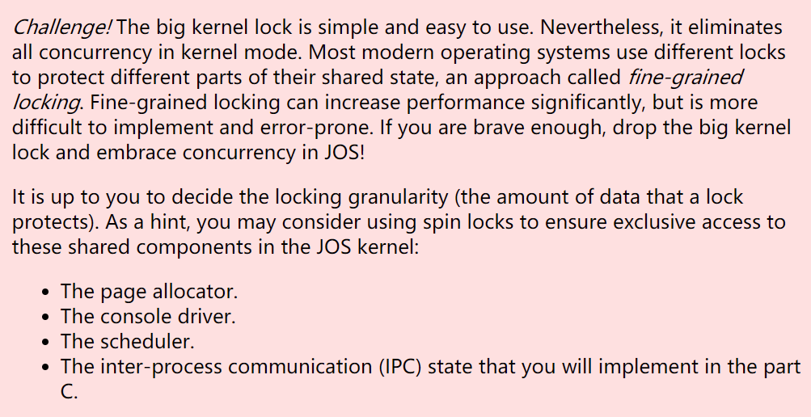

[TOC]

# Lab 4: Preemptive Multitasking

**抢占式多任务处理**

## Introduction

在本实验中，您将在多个同时处于活动状态的用户模式环境(**环境即进程**)中实施抢占式多任务处理。

- 在 A 部分，您将为 JOS 添加多处理器支持，实现循环调度(round-robin scheduling)，并添加基本的环境管理系统调用(basic environment management system calls )（创建和销毁环境以及分配/映射内存的调用）。  ---- **进程调度**

- 在 B 部分，您将实现一个类 Unix 的 `fork()`，它允许用户模式环境创建其自身的副本。 -- **进程创建**

- 在 C 部分，您将添加对**进程间通信 ( inter-process communication ， IPC)** 的支持，允许不同的用户模式环境显式地相互通信和同步。您还将添加对硬件时钟中断和抢占(clock interrupts and preemption)的支持。   ---- **进程通信**

### Getting Started

实验 4 包含许多新的源文件:

| `kern/cpu.h`      | Kernel-private definitions for multiprocessor support        |
| ----------------- | ------------------------------------------------------------ |
| `kern/mpconfig.c` | Code to read the multiprocessor configuration                |
| `kern/lapic.c`    | Kernel code driving the local APIC unit in each processor    |
| `kern/mpentry.S`  | Assembly-language entry code for non-boot CPUs               |
| `kern/spinlock.h` | Kernel-private definitions for spin locks, including the big kernel lock |
| `kern/spinlock.c` | Kernel code implementing spin locks                          |
| `kern/sched.c`    | Code skeleton of the scheduler that you are about to implement |

- `kern/cpu.h`  多处理器支持的内核私有定义

- `kern/mpconfig.c`  读取多处理器配置的代码
- `kern/lapic.c`  驱动每个处理器中的本地 APIC 单元的内核代码
- `kern/mpentry.S`   非引导 CPU 的汇编语言入口代码
- `kern/spinlock.h` 自旋锁(spin lock)的内核私有定义，包括大内核锁(big kernel lock)
- `kern/spinlock.c`  实现自旋锁的内核代码
- `kern/sched.c`  您将要实现的调度程序的代码框架


## Part A: Multiprocessor Support and Cooperative Multitasking

**多处理器支持和协作多任务处理**

在本实验的第一部分:

- 扩展 JOS 以在多处理器系统(multiprocessor system)上运行
- 实现一些新的 JOS 内核系统调用以允许**用户级环境创建额外的新环境**。
- 实现协作循环调度(*cooperative* round-robin scheduling)，当当前环境自愿放弃 CPU（或退出）时，允许内核从一种环境切换到另一种环境。
- C 部分中，您将实现抢占式调度(*preemptive* scheduling)，即使环境不合作，它也允许内核在经过一定时间后从环境中重新控制 CPU。

### Multiprocessor Support    多处理器支持

我们将让 JOS 支持“**对称多处理”（symmetric multiprocessing， SMP）**，这是一种多处理器模型，其中**所有 CPU 对系统资源（如内存和 I/O 总线）具有同等访问权限**。尽管 SMP 中所有 CPU 的功能都相同，但在引导过程(boot process)中它们可以分为两种类型：**引导处理器 (bootstrap processor, BSP)** 负责初始化系统和引导操作系统；只有在操作系统启动并运行后，BSP 才会激活**应用处理器（application processor, AP）**。哪个处理器是 BSP 由硬件和 BIOS 决定。到目前为止，您现有的所有 JOS 代码都已在 BSP 上运行。

在 SMP 系统中，每个 CPU 都有一个伴随的local**APIC (LAPIC)** 单元。 **LAPIC 单元负责在整个系统中传送中断。** **LAPIC 还为其连接的 CPU 提供唯一标识符。**在本实验中，我们使用 LAPIC 单元（在 `kern/lapic.c` 中）的以下基本功能：

- 读取 LAPIC 标识符 **(APIC ID**) 以判断我们的代码当前正在哪个 CPU 上运行（请参阅 `cpunum()`）。

```c
int
cpunum(void)
{
        if (lapic)
                return lapic[ID] >> 24;
        return 0;
}
```

- 将 `STARTUP` **处理器间中断** ( interprocessor interrupt, IPI) 从 BSP 发送到 AP 以启动其他 CPU（请参阅 `lapic_startap()`）。

```c
#define IO_RTC  0x70

// Start additional processor running entry code at addr.
// See Appendix B of MultiProcessor Specification.
void
lapic_startap(uint8_t apicid, uint32_t addr)
{
        int i;
        uint16_t *wrv;

        // "The BSP must initialize CMOS shutdown code to 0AH
        // and the warm reset vector (DWORD based at 40:67) to point at
        // the AP startup code prior to the [universal startup algorithm]."
        outb(IO_RTC, 0xF);  // offset 0xF is shutdown code
        outb(IO_RTC+1, 0x0A);
        wrv = (uint16_t *)KADDR((0x40 << 4 | 0x67));  // Warm reset vector
        wrv[0] = 0;
        wrv[1] = addr >> 4;

        // "Universal startup algorithm."
        // Send INIT (level-triggered) interrupt to reset other CPU.
        lapicw(ICRHI, apicid << 24);
        lapicw(ICRLO, INIT | LEVEL | ASSERT);
        microdelay(200);
        lapicw(ICRLO, INIT | LEVEL);
        microdelay(100);    // should be 10ms, but too slow in Bochs!

        // Send startup IPI (twice!) to enter code.
        // Regular hardware is supposed to only accept a STARTUP
        // when it is in the halted state due to an INIT.  So the second
        // should be ignored, but it is part of the official Intel algorithm.
        // Bochs complains about the second one.  Too bad for Bochs.
        for (i = 0; i < 2; i++) {
                lapicw(ICRHI, apicid << 24);
                lapicw(ICRLO, STARTUP | (addr >> 12));
                microdelay(200);
        }
}
```

- 在 C 部分，我们对 LAPIC 的内置定时器( built-in timer )进行编程以触发时钟中断(clock interrupts)以支持抢占式多任务处理(preemptive multitasking)（参见 `apic_init()`）。

**处理器使用内存映射 I/O (memory-mapped I/O, MMIO) 访问其 LAPIC。**在 MMIO 中，一部分物理内存(*physical* memory)硬连线到一些 I/O 设备的寄存器，因此通常用于访问内存的相同加载/存储指令( load/store instructions)可用于访问设备寄存器(device registers)。您已经在物理地址 `0xA0000` 处看到了一个 IO 孔(**IO hole**)（我们使用它来写入 VGA 显示缓冲区[VGA display buffer]）。 LAPIC 位于从物理地址 `0xFE000000`（32MB 比 4GB 短）开始的一个洞中，所以它太高了，我们无法使用我们通常在 KERNBASE 的直接映射来访问。 JOS 虚拟内存映射在 **MMIOBASE**上留下了 4MB 的空白，因此我们有一个地方可以映射这样的设备。由于后面的实验会引入更多的 MMIO 区域，您将编写一个简单的函数来从该区域分配空间并将设备内存映射到它。

 **MMIOBASE ---- MMIOLIM**

```c
/*
 * Virtual memory map:                                Permissions
 *                                                    kernel/user
 *
 *    4 Gig -------->  +------------------------------+
 *                     |                              | RW/--
 *                     ~~~~~~~~~~~~~~~~~~~~~~~~~~~~~~~~
 *                     :              .               :
 *                     :              .               :
 *                     :              .               :
 *                     |~~~~~~~~~~~~~~~~~~~~~~~~~~~~~~| RW/--
 *                     |                              | RW/--
 *                     |   Remapped Physical Memory   | RW/--
 *                     |                              | RW/--
 *    KERNBASE, ---->  +------------------------------+ 0xf0000000      --+
 *    KSTACKTOP        |     CPU0's Kernel Stack      | RW/--  KSTKSIZE   |
 *                     | - - - - - - - - - - - - - - -|                   |
 *                     |      Invalid Memory (*)      | --/--  KSTKGAP    |
 *                     +------------------------------+                   |
 *                     |     CPU1's Kernel Stack      | RW/--  KSTKSIZE   |
 *                     | - - - - - - - - - - - - - - -|                 PTSIZE
 *                     |      Invalid Memory (*)      | --/--  KSTKGAP    |
 *                     +------------------------------+                   |
 *                     :              .               :                   |
 *                     :              .               :                   |
 *    MMIOLIM ------>  +------------------------------+ 0xefc00000      --+
 *                     |       Memory-mapped I/O      | RW/--  PTSIZE
 * ULIM, MMIOBASE -->  +------------------------------+ 0xef800000
 *                     |  Cur. Page Table (User R-)   | R-/R-  PTSIZE
 *    UVPT      ---->  +------------------------------+ 0xef400000
 *                     |          RO PAGES            | R-/R-  PTSIZE
 *    UPAGES    ---->  +------------------------------+ 0xef000000
 *                     |           RO ENVS            | R-/R-  PTSIZE
 * UTOP,UENVS ------>  +------------------------------+ 0xeec00000
 * UXSTACKTOP -/       |     User Exception Stack     | RW/RW  PGSIZE
 *                     +------------------------------+ 0xeebff000
 *                     |       Empty Memory (*)       | --/--  PGSIZE
 *    USTACKTOP  --->  +------------------------------+ 0xeebfe000
 *                     |      Normal User Stack       | RW/RW  PGSIZE
 *                     +------------------------------+ 0xeebfd000
 *                     |                              |
 *                     |                              |
 *                     ~~~~~~~~~~~~~~~~~~~~~~~~~~~~~~~~
 *                     .                              .
 *                     .                              .
 *                     .                              .
 *                     |~~~~~~~~~~~~~~~~~~~~~~~~~~~~~~|
 *                     |     Program Data & Heap      |
 *    UTEXT -------->  +------------------------------+ 0x00800000
 *    PFTEMP ------->  |       Empty Memory (*)       |        PTSIZE
 *                     |                              |
 *    UTEMP -------->  +------------------------------+ 0x00400000      --+
 *                     |       Empty Memory (*)       |                   |
 *                     | - - - - - - - - - - - - - - -|                   |
 *                     |  User STAB Data (optional)   |                 PTSIZE
 *    USTABDATA ---->  +------------------------------+ 0x00200000        |
 *                     |       Empty Memory (*)       |                   |
 *    0 ------------>  +------------------------------+                 --+
 *
 * (*) Note: The kernel ensures that "Invalid Memory" is *never* mapped.
 *     "Empty Memory" is normally unmapped, but user programs may map pages
 *     there if desired.  JOS user programs map pages temporarily at UTEMP.
 */
```


**Exercise 1**

在 `kern/pmap.c` 中实现 `mmio_map_region`。要了解如何使用它，请查看 `kern/lapic.c` 中 `lapic_init` 的开头。在运行 `mmio_map_region` 测试之前，您还必须进行下一个练习。

- `kern/lapic.c` 

```c
void
lapic_init(void)
{
        if (!lapicaddr)
                return;

        // lapicaddr is the physical address of the LAPIC's 4K MMIO
        // region.  Map it in to virtual memory so we can access it.
    	// lapicaddr 是 LAPIC 的 4K MMIO 区域的物理地址。
    	// 将它映射到虚拟内存，以便我们可以访问它。
        lapic = mmio_map_region(lapicaddr, 4096);

        // Enable local APIC; set spurious interrupt vector.
    	// 启用本地 APIC；设置虚假中断向量。
        lapicw(SVR, ENABLE | (IRQ_OFFSET + IRQ_SPURIOUS));

        // The timer repeatedly counts down at bus frequency
        // from lapic[TICR] and then issues an interrupt.  
        // If we cared more about precise timekeeping,
        // TICR would be calibrated using an external time source.
    	// 定时器从 lapic[TICR] 以总线频率重复倒计时，然后发出中断。
    	// 如果我们更关心精确计时，TICR 将使用外部时间源进行校准。
        lapicw(TDCR, X1);
        lapicw(TIMER, PERIODIC | (IRQ_OFFSET + IRQ_TIMER));
        lapicw(TICR, 10000000);

        // Leave LINT0 of the BSP enabled so that it can get
        // interrupts from the 8259A chip.
        //
        // According to Intel MP Specification, the BIOS should initialize
        // BSP's local APIC in Virtual Wire Mode, in which 8259A's
        // INTR is virtually connected to BSP's LINTIN0. In this mode,
        // we do not need to program the IOAPIC.
        if (thiscpu != bootcpu)
                lapicw(LINT0, MASKED);

        // Disable NMI (LINT1) on all CPUs
        lapicw(LINT1, MASKED);

        // Disable performance counter overflow interrupts
        // on machines that provide that interrupt entry.
        if (((lapic[VER]>>16) & 0xFF) >= 4)
                lapicw(PCINT, MASKED);

        // Map error interrupt to IRQ_ERROR.
        lapicw(ERROR, IRQ_OFFSET + IRQ_ERROR);

        // Clear error status register (requires back-to-back writes).
        lapicw(ESR, 0);
        lapicw(ESR, 0);

        // Ack any outstanding interrupts.
        lapicw(EOI, 0);

        // Send an Init Level De-Assert to synchronize arbitration ID's.
        lapicw(ICRHI, 0);
        lapicw(ICRLO, BCAST | INIT | LEVEL);
        while(lapic[ICRLO] & DELIVS)
                ;

        // Enable interrupts on the APIC (but not on the processor).
        lapicw(TPR, 0);
}
```

- `kern/pmap.c `  ---  `mmio_map_region` 

参照`boot_map_region()`

```c
static void
boot_map_region(pde_t *pgdir, uintptr_t va, size_t size, physaddr_t pa, int perm)
{
        int i;
        for (i = 0; i < size / PGSIZE; ++i, va += PGSIZE, pa += PGSIZE) {
                pte_t *pte = pgdir_walk(pgdir, (void *) va, 1); // Get the table entry of this page.
                if (!pte)
                        panic("boot_map_region panic, out of memory");
                *pte = pa | perm | PTE_P;
        }
}
```


```c
//
// Reserve size bytes in the MMIO region and map [pa,pa+size) at this
// location.  Return the base of the reserved region.  size does *not*
// have to be multiple of PGSIZE.
//
// 在 MMIO 区域中保留 size 字节并在此位置映射 [pa,pa+size)。
// 返回保留区域的基址。
// 大小*不必*必须是 PGSIZE 的倍数。
void *
mmio_map_region(physaddr_t pa, size_t size)
{
        // Where to start the next region.  Initially, this is the
        // beginning of the MMIO region.  Because this is static, its
        // value will be preserved between calls to mmio_map_region
        // (just like nextfree in boot_alloc).
    	// 从哪里开始下一个区域。最初，这是 MMIO 区域的开始。
    	// 因为这是静态的，它的值将在调用 mmio_map_region 之间保留
    	//（就像 boot_alloc 中的 nextfree 一样）。
        static uintptr_t base = MMIOBASE;

        // Reserve size bytes of virtual memory starting at base and
        // map physical pages [pa,pa+size) to virtual addresses
        // [base,base+size).  Since this is device memory and not
        // regular DRAM, you'll have to tell the CPU that it isn't
        // safe to cache access to this memory.  Luckily, the page
        // tables provide bits for this purpose; simply create the
        // mapping with PTE_PCD|PTE_PWT (cache-disable and
        // write-through) in addition to PTE_W.  (If you're interested
        // in more details on this, see section 10.5 of IA32 volume
        // 3A.)
    	// 从基址开始保留大小字节的虚拟内存并将物理页 [pa,pa+size) 
    	// 映射到虚拟地址[base，base+size）。
    	// 由于这是设备内存而不是常规 DRAM，因此您必须告诉 CPU 缓存访问此内存是不安全的。
    	// 幸运的是，页表为此提供了位；除了 PTE_W 之外，只需使用 PTE_PCD|PTE_PWT
    	//（缓存禁用和直写）创建映射。 
        //
        // Be sure to round size up to a multiple of PGSIZE and to
        // handle if this reservation would overflow MMIOLIM (it's
        // okay to simply panic if this happens).
    	// 确保将size四舍五入为 PGSIZE 的倍数，并处理此保留是否会溢出 MMIOLIM
    	//（如果发生这种情况，可以简单地恐慌）。
        //
        // Hint: The staff solution uses boot_map_region.
        //
        // Your code here:
    	size = (size_t)ROUNDUP(pa + size, PGSIZE);
		pa = (physaddr_t)ROUNDDOWN(pa, PGSIZE);
		size = size - pa;
		if(base + size >= MMIOLIM)
			panic("mmio_map_region: not enough space\n");
		boot_map_region(kern_pgdir, base, size, pa, PTE_PCD | PTE_PWT | PTE_W);
		base += size;
		return (void *)(base - size);
}
```


#### Application Processor Bootstrap   应用处理器引导程序

在启动 AP(Application Processor) 之前，BSP( bootstrap processor)应首先收集有关多处理器系统的信息，例如 CPU 总数、它们的 APIC ID 和 LAPIC 单元的 MMIO 地址。 `kern/mpconfig.c` 中的 `mp_init()` 函数通过读取驻留在 BIOS 内存区域中的 MP 配置表(MP configuration table)来检索此信息。

`boot_aps()` 函数（在 `kern/init.c` 中）驱动 AP 引导程序(AP bootstrap process)。 AP 以实模式(real mode)启动，很像引导加载程序在 `boot/boot.S` 中的启动方式，因此 `boot_aps()` 将 AP 入口代码 (`kern/mpentry.S`) 复制到可在实模式下寻址的内存位置。与引导加载程序不同，我们可以控制 AP 开始执行代码的位置；我们将入口代码复制到 `0x7000` (`MPENTRY_PADDR`)，但任何未使用的、页面对齐的低于 640KB 的物理地址都可以使用。

之后，`boot_aps()` 通过向相应 AP 的 LAPIC 单元发送 `STARTUP` IPIs 以及 AP 应开始运行其入口代码的初始 `CS:IP` 地址（在我们的示例中为 `MPENTRY_PADDR`）来一个接一个地激活 AP。 `kern/mpentry.S` 中的入口代码与 `boot/boot.S` 中的入口代码非常相似。经过一些简短的设置后，它会将 AP 置于启用分页的保护模式，然后调用 C 设置例程 `mp_main()`（也在 `kern/init.c` 中）。 `boot_aps()` 等待 AP 在其 `struct CpuInfo` 的 `cpu_status` 字段中发送一个 `CPU_STARTED` 标志，然后继续唤醒下一个。


#### AP 引导期间的控制流传输 control flow transfer during the bootstrap of APs

- 在启动 AP(Application Processor) 之前，BSP( bootstrap processor)应首先收集有关多处理器系统的信息，例如 CPU 总数、它们的 APIC ID 和 LAPIC 单元的 MMIO 地址。

 `kern/mpconfig.c` 中的 `mp_init()` 函数通过读取驻留在 BIOS 内存区域中的 MP 配置表(MP configuration table)来检索此信息。

```c
void
mp_init(void)
{
        struct mp *mp;   // 浮动指针 [MP 4.1]
        struct mpconf *conf; // 配置表头 [MP 4.2]
        struct mpproc *proc; // 处理器表条目 [MP 4.3.1]
        uint8_t *p;
        unsigned int i;

        bootcpu = &cpus[0];
        if ((conf = mpconfig(&mp)) == 0)
                return;
        ismp = 1;
        lapicaddr = conf->lapicaddr;

        for (p = conf->entries, i = 0; i < conf->entry; i++) {
                switch (*p) {
                case MPPROC:
                        proc = (struct mpproc *)p;
                        if (proc->flags & MPPROC_BOOT)
                                bootcpu = &cpus[ncpu];
                        if (ncpu < NCPU) {
                                cpus[ncpu].cpu_id = ncpu;
                                ncpu++;
                        } else {
                                cprintf("SMP: too many CPUs, CPU %d disabled\n",
                                        proc->apicid);
                        }
                        p += sizeof(struct mpproc);
                        continue;
                case MPBUS:
                case MPIOAPIC:
                case MPIOINTR:
                case MPLINTR:
                        p += 8;
                        continue;
                default:
                        cprintf("mpinit: unknown config type %x\n", *p);
                        ismp = 0;
                        i = conf->entry;
                }
        }

        bootcpu->cpu_status = CPU_STARTED;
        if (!ismp) {
                // Didn't like what we found; fall back to no MP.
                ncpu = 1;
                lapicaddr = 0;
                cprintf("SMP: configuration not found, SMP disabled\n");
                return;
        }
        cprintf("SMP: CPU %d found %d CPU(s)\n", bootcpu->cpu_id,  ncpu);

        if (mp->imcrp) {
                // [MP 3.2.6.1] If the hardware implements PIC mode,
                // switch to getting interrupts from the LAPIC.
                cprintf("SMP: Setting IMCR to switch from PIC mode to symmetric I/O mode\n");
                outb(0x22, 0x70);   // Select IMCR
                outb(0x23, inb(0x23) | 1);  // Mask external interrupts.
        }
}
```

- `boot_aps()` 函数（在 `kern/init.c` 中）驱动 AP 引导程序(AP bootstrap process)。 AP 以实模式(real mode)启动，很像引导加载程序在 `boot/boot.S` 中的启动方式，因此 `boot_aps()` 将 AP 入口代码 (`kern/mpentry.S`) 复制到可在实模式下寻址的内存位置。与引导加载程序不同，我们可以控制 AP 开始执行代码的位置；我们将入口代码复制到 `0x7000` (`MPENTRY_PADDR`)，但任何未使用的、页面对齐的低于 640KB 的物理地址都可以使用。

   `kern/init.c` 

```c
// While boot_aps is booting a given CPU, it communicates the per-core
// stack pointer that should be loaded by mpentry.S to that CPU in
// this variable.
// 当 boot_aps 正在引导给定的 CPU 时，它会将应由 mpentry.S 加载到该变量中的每个核心
// 堆栈指针传达给该 CPU。
void *mpentry_kstack;

// Start the non-boot (AP) processors.
// 启动非引导 (AP) 处理器。
static void
boot_aps(void)
{
        extern unsigned char mpentry_start[], mpentry_end[];
        void *code;
        struct CpuInfo *c;

        // Write entry code to unused memory at MPENTRY_PADDR
    	// 将入口代码写入 MPENTRY_PADDR 处未使用的内存
        code = KADDR(MPENTRY_PADDR);
        memmove(code, mpentry_start, mpentry_end - mpentry_start);

        // Boot each AP one at a time
    	// 依次启动每个 AP
        for (c = cpus; c < cpus + ncpu; c++) {
                if (c == cpus + cpunum())  // We've started already. 
                        continue;

                // Tell mpentry.S what stack to use 
            	// 告诉 mpentry.S 使用什么堆栈
                mpentry_kstack = percpu_kstacks[c - cpus] + KSTKSIZE;
                // Start the CPU at mpentry_start
            	// 在 mpentry_start 启动 CPU
                lapic_startap(c->cpu_id, PADDR(code));
                // Wait for the CPU to finish some basic setup in mp_main()
            	// 等待 CPU 在 mp_main() 中完成一些基本设置
                while(c->cpu_status != CPU_STARTED)
                        ;
        }
}
```

`kern/mpentry.S`

`boot_aps()`（在 init.c 中）将此代码复制到 `MPENTRY_PADDR`（满足上述限制）。然后，对于每个 AP，它在 `mpentry_kstack` 中存储预先分配的每个核心堆栈的地址，发送 `STARTUP IPI`，并等待此代码确认它已启动（这发生在 init.c 中的 `mp_main` 中）。

```assembly
/* See COPYRIGHT for copyright information. */

#include <inc/mmu.h>
#include <inc/memlayout.h>

###################################################################
# entry point for APs ---- AP的入口点
###################################################################

# Each non-boot CPU ("AP") is started up in response to a STARTUP
# IPI from the boot CPU.  Section B.4.2 of the Multi-Processor
# Specification says that the AP will start in real mode with CS:IP
# set to XY00:0000, where XY is an 8-bit value sent with the
# STARTUP. Thus this code must start at a 4096-byte boundary.
# 每个非引导 CPU（“AP”）响应来自引导 CPU 的 STARTUP IPI 启动。
# 多处理器规范的 B.4.2 节说 AP 将以实模式启动，CS:IP 设置为 XY00:0000，
# 其中 XY 是随 STARTUP 发送的 8 位值。因此，此代码必须从 4096 字节边界开始。
#
# Because this code sets DS to zero, it must run from an address in
# the low 2^16 bytes of physical memory.
# 由于此代码将 DS 设置为零，因此它必须从物理内存的低 2^16 字节中的地址运行。
#
# boot_aps() (in init.c) copies this code to MPENTRY_PADDR (which
# satisfies the above restrictions).  Then, for each AP, it stores the
# address of the pre-allocated per-core stack in mpentry_kstack, sends
# the STARTUP IPI, and waits for this code to acknowledge that it has
# started (which happens in mp_main in init.c).
# boot_aps()（在 init.c 中）将此代码复制到 MPENTRY_PADDR（满足上述限制）。
# 然后，对于每个 AP，它在 mpentry_kstack 中存储预先分配的每个核心堆栈的地址，
# 发送 STARTUP IPI，并等待此代码确认它已启动（这发生在 init.c 中的 mp_main 中）。
#
# This code is similar to boot/boot.S except that
#    - it does not need to enable A20
#    - it uses MPBOOTPHYS to calculate absolute addresses of its
#      symbols, rather than relying on the linker to fill them
# 此代码类似于 boot/boot.S 不同之处在于
# 	- 它不需要启用 A20
# 	- 它使用 MPBOOTPHYS 计算其绝对地址符号，而不是依赖链接器来填充它们
#

#define RELOC(x) ((x) - KERNBASE)
#define MPBOOTPHYS(s) ((s) - mpentry_start + MPENTRY_PADDR)

.set PROT_MODE_CSEG, 0x8        # kernel code segment selector
.set PROT_MODE_DSEG, 0x10       # kernel data segment selector

.code16
.globl mpentry_start
mpentry_start:
        cli

        xorw    %ax, %ax
        movw    %ax, %ds
        movw    %ax, %es
        movw    %ax, %ss

        lgdt    MPBOOTPHYS(gdtdesc)
        movl    %cr0, %eax
        orl     $CR0_PE, %eax
        movl    %eax, %cr0

        ljmpl   $(PROT_MODE_CSEG), $(MPBOOTPHYS(start32))

.code32
start32:
        movw    $(PROT_MODE_DSEG), %ax
        movw    %ax, %ds
        movw    %ax, %es
        movw    %ax, %ss
        movw    $0, %ax
        movw    %ax, %fs
        movw    %ax, %gs

        # Set up initial page table. We cannot use kern_pgdir yet because
        # we are still running at a low EIP.
        movl    $(RELOC(entry_pgdir)), %eax
        movl    %eax, %cr3
        # Turn on paging.
        movl    %cr0, %eax
        orl     $(CR0_PE|CR0_PG|CR0_WP), %eax
        movl    %eax, %cr0
		        # Switch to the per-cpu stack allocated in boot_aps()
        movl    mpentry_kstack, %esp
        movl    $0x0, %ebp       # nuke frame pointer

        # Call mp_main().  (Exercise for the reader: why the indirect call?)
        movl    $mp_main, %eax
        call    *%eax

        # If mp_main returns (it shouldn't), loop.
spin:
        jmp     spin

# Bootstrap GDT
.p2align 2                                      # force 4 byte alignment
gdt:
        SEG_NULL                                # null seg
        SEG(STA_X|STA_R, 0x0, 0xffffffff)       # code seg
        SEG(STA_W, 0x0, 0xffffffff)             # data seg

gdtdesc:
        .word   0x17                            # sizeof(gdt) - 1
        .long   MPBOOTPHYS(gdt)                 # address gdt

.globl mpentry_end
mpentry_end:
        nop
```

- `boot_aps()` 通过向相应 AP 的 LAPIC 单元发送 `STARTUP IPI` 以及 AP 应开始运行其入口代码的初始 `CS:IP` 地址（在我们的示例中为 `MPENTRY_PADDR`）来一个接一个地激活 AP。

```c
		// Boot each AP one at a time
    	// 依次启动每个 AP
        for (c = cpus; c < cpus + ncpu; c++) {
                if (c == cpus + cpunum())  // We've started already. 
                        continue;

                // Tell mpentry.S what stack to use 
            	// 告诉 mpentry.S 使用什么堆栈
                mpentry_kstack = percpu_kstacks[c - cpus] + KSTKSIZE;
                // Start the CPU at mpentry_start
            	// 在 mpentry_start 启动 CPU
                lapic_startap(c->cpu_id, PADDR(code));
                // Wait for the CPU to finish some basic setup in mp_main()
            	// 等待 CPU 在 mp_main() 中完成一些基本设置
                while(c->cpu_status != CPU_STARTED)
                        ;
        }
```

-  `kern/mpentry.S` 中的入口代码与 `boot/boot.S` 中的入口代码非常相似。不同之处在于
  - 它不需要启用 A20
  - 它使用 MPBOOTPHYS 计算其绝对地址符号，而不是依赖链接器来填充它们
- 经过一些简短的设置后，它会将 AP 置于启用分页的保护模式，然后调用 C 设置例程 `mp_main()`（也在 `kern/init.c` 中）。 `boot_aps()` 等待 AP 在其 `struct CpuInfo` 的 `cpu_status` 字段中发送一个 `CPU_STARTED` 标志，然后继续唤醒下一个。

```c
// Setup code for APs
void
mp_main(void)
{
        // We are in high EIP now, safe to switch to kern_pgdir 
    	// 我们现在处于高 EIP，可以安全地切换到 kern_pgdir
        lcr3(PADDR(kern_pgdir));
        cprintf("SMP: CPU %d starting\n", cpunum());

        lapic_init();
        env_init_percpu();
        trap_init_percpu();
        xchg(&thiscpu->cpu_status, CPU_STARTED); // tell boot_aps() we're up 
    											 // 发送CPU_STARTED，已启动

        // Now that we have finished some basic setup, call sched_yield()
        // to start running processes on this CPU.  But make sure that
        // only one CPU can enter the scheduler at a time!
    	// 现在我们已经完成了一些基本的设置，调用 sched_yield() 
    	// 开始在这个 CPU 上运行进程。但是要确保一次只有一个 CPU 可以进入调度程序！
        //
        // Your code here:

        // Remove this after you finish Exercise 6
        for (;;);
}
```


**Exercise 2**

读取 `kern/init.c` 中的 `boot_aps()` 和 `mp_main()`，以及 `kern/mpentry.S` 中的汇编代码。确保您了解 AP 引导期间的控制流传输。然后在 `kern/pmap.c` 中修改 `page_init()` 的实现，以避免将 `MPENTRY_PADDR` 处的页面添加到空闲列表中，以便我们可以安全地在该物理地址复制和运行 AP 引导代码。您的代码应该通过更新的 `check_page_free_list()` 测试（但可能无法通过更新的 `check_kern_pgdir()` 测试，我们将很快修复）。

#### 实验过程

**控制流传输**：引导处理器 (BSP) 执行 `boot_aps()` 将 `kern/mpentry.S` 中的代码复制到 MPENTRY_PADDR，然后将 STARTUP IPI 发送到 AP。 AP 运行入口代码，然后 `mp_main()` 将初始化它并注意到它们已启动的 BSP。

这里需要在 page_init() 中实现的代码非常简单，因为我们知道 MPENTRY_PADDR 是 `0x7000`，它高于 PGSIZE 且**低于 IOPHYSMEM**。这里我们需要做的就是将MPENTRY_PADDR处的页面作为对应位置的特例进行初始化。

```c
//
// Initialize page structure and memory free list.
// After this is done, NEVER use boot_alloc again.  ONLY use the page
// allocator functions below to allocate and deallocate physical
// memory via the page_free_list.
//
void
page_init(void)
{
        // LAB 4:
        // Change your code to mark the physical page at MPENTRY_PADDR
        // as in us

        // The example code here marks all physical pages as free.
        // However this is not truly the case.  What memory is free?
        //  1) Mark physical page 0 as in use.
        //     This way we preserve the real-mode IDT and BIOS structures
        //     in case we ever need them.  (Currently we don't, but...)
        //  2) The rest of base memory, [PGSIZE, npages_basemem * PGSIZE)
        //     is free.
        //  3) Then comes the IO hole [IOPHYSMEM, EXTPHYSMEM), which must
        //     never be allocated.
        //  4) Then extended memory [EXTPHYSMEM, ...).
        //     Some of it is in use, some is free. Where is the kernel
        //     in physical memory?  Which pages are already in use for
        //     page tables and other data structures?
        //
        // Change the code to reflect this.
        // NB: DO NOT actually touch the physical memory corresponding to
        // free pages!

        // 1 in use, 0 is free
        size_t i;   // loop var
        for (i = 0; i < npages; i++){
            if (i == 0){   // Mark physical page 0 as in use.
                pages[i].pp_ref = 1;
                pages[i].pp_link = NULL;
            }
            else if (i >= 1 && i < npages_basemem){ //  base memory
                if (i == MPENTRY_PADDR / PGSIZE){ //  MPENTRY_PADDR
                	pages[i].pp_ref = 1;
                	pages[i].pp_link = NULL;
                    continue;
            	}
                else{
                	pages[i].pp_ref = 0;
                	pages[i].pp_link = page_free_list;
                	page_free_list = &pages[i];
                }
            }
            else if (i >= IOPHYSMEM / PGSIZE && i < EXTPHYSMEM / PGSIZE){ // IO hole
                 pages[i].pp_ref = 1;
                 pages[i].pp_link = NULL;
            }
            else{     // extended memory
                if (i < PADDR(boot_alloc(0)) / PGSIZE) { // kernel zone
                        pages[i].pp_ref = 1;
                        pages[i].pp_link = NULL;
                }
                else{
                        pages[i].pp_ref = 0;
                        pages[i].pp_link = page_free_list;
                        page_free_list = &pages[i];
                }
            }
        }
}
```

```C
/*
 * Virtual memory map:                                Permissions
 *                                                    kernel/user
 *
 *    4 Gig -------->  +------------------------------+
 *                     |                              | RW/--
 *                     ~~~~~~~~~~~~~~~~~~~~~~~~~~~~~~~~
 *                     :              .               :
 *                     :              .               :
 *                     :              .               :
 *                     |~~~~~~~~~~~~~~~~~~~~~~~~~~~~~~| RW/--
 *                     |                              | RW/--
 *                     |   Remapped Physical Memory   | RW/--
 *                     |                              | RW/--
 *    KERNBASE, ---->  +------------------------------+ 0xf0000000      --+
 *    KSTACKTOP        |     CPU0's Kernel Stack      | RW/--  KSTKSIZE   |
 *                     | - - - - - - - - - - - - - - -|                   |
 *                     |      Invalid Memory (*)      | --/--  KSTKGAP    |
 *                     +------------------------------+                   |
 *                     |     CPU1's Kernel Stack      | RW/--  KSTKSIZE   |
 *                     | - - - - - - - - - - - - - - -|                 PTSIZE
 *                     |      Invalid Memory (*)      | --/--  KSTKGAP    |
 *                     +------------------------------+                   |
 *                     :              .               :                   |
 *                     :              .               :                   |
 *    MMIOLIM ------>  +------------------------------+ 0xefc00000      --+
 *                     |       Memory-mapped I/O      | RW/--  PTSIZE
 * ULIM, MMIOBASE -->  +------------------------------+ 0xef800000
 *                     |  Cur. Page Table (User R-)   | R-/R-  PTSIZE
 *    UVPT      ---->  +------------------------------+ 0xef400000
 *                     |          RO PAGES            | R-/R-  PTSIZE
 *    UPAGES    ---->  +------------------------------+ 0xef000000
 *                     |           RO ENVS            | R-/R-  PTSIZE
 * UTOP,UENVS ------>  +------------------------------+ 0xeec00000
 * UXSTACKTOP -/       |     User Exception Stack     | RW/RW  PGSIZE
 *                     +------------------------------+ 0xeebff000
 *                     |       Empty Memory (*)       | --/--  PGSIZE
 *    USTACKTOP  --->  +------------------------------+ 0xeebfe000
 *                     |      Normal User Stack       | RW/RW  PGSIZE
 *                     +------------------------------+ 0xeebfd000
 *                     |                              |
 *                     |                              |
 *                     ~~~~~~~~~~~~~~~~~~~~~~~~~~~~~~~~
 *                     .                              .
 *                     .                              .
 *                     .                              .
 *                     |~~~~~~~~~~~~~~~~~~~~~~~~~~~~~~|
 *                     |     Program Data & Heap      |
 *    UTEXT -------->  +------------------------------+ 0x00800000
 *    PFTEMP ------->  |       Empty Memory (*)       |        PTSIZE
 *                     |                              |
 *    UTEMP -------->  +------------------------------+ 0x00400000      --+
 *                     |       Empty Memory (*)       |                   |
 *                     | - - - - - - - - - - - - - - -|                   |
 *                     |  User STAB Data (optional)   |                 PTSIZE
 *    USTABDATA ---->  +------------------------------+ 0x00200000        |
 *                     |       Empty Memory (*)       |                   |
 *    0 ------------>  +------------------------------+                 --+
 *
 * (*) Note: The kernel ensures that "Invalid Memory" is *never* mapped.
 *     "Empty Memory" is normally unmapped, but user programs may map pages
 *     there if desired.  JOS user programs map pages temporarily at UTEMP.
 */
```


#### TEST

```
llf@ubuntu:~/Documents/6.828/lab$ make grade
...
一堆BUG!!!
```

原因是默认qemu是单CPU，所以出BUG了！！！

使用`make qemu CPUS=4`或`make qemu-nox CPUS=4`运行： （后面看到的）

```shell
llf@ubuntu:~/Documents/6.828/lab$ make qemu CPUS=4
+ cc kern/init.c
+ ld obj/kern/kernel
+ mk obj/kern/kernel.img
qemu-system-i386 -drive file=obj/kern/kernel.img,index=0,media=disk,format=raw -serial mon:stdio -gdb tcp::26000 -D qemu.log -smp 4 
Gtk-Message: 07:56:52.507: Failed to load module "canberra-gtk-module"
6828 decimal is 15254 octal!
Physical memory: 131072K available, base = 640K, extended = 130432K
head of *pages in pmap.c: f0234000
check_page_free_list() succeeded!
check_page_alloc() succeeded!
check_page() succeeded!
check_kern_pgdir() succeeded!
check_page_free_list() succeeded!
check_page_installed_pgdir() succeeded!
SMP: CPU 0 found 4 CPU(s)
enabled interrupts: 1 2
SMP: CPU 1 starting
SMP: CPU 2 starting
SMP: CPU 3 starting
[00000000] new env 00001000
```


**Question**

1. 将 kern/mpentry.S 与 boot/boot.S 并排比较。考虑到 kern/mpentry.S 被编译并链接为在 KERNBASE 之上运行，就像内核中的其他一切一样，宏 MPBOOTPHYS 的目的是什么？为什么需要在 kern/mpentry.S 中而不是在 boot/boot.S 中？换句话说，如果在 kern/mpentry.S 中省略它会出什么问题？
   提示：回忆一下我们在实验 1 中讨论过的链接地址和加载地址之间的区别。

boot.S中，由于尚没有启用分页机制，所以我们能够指定程序开始执行的地方以及程序加载的地址；但是，在mpentry.S的时候，由于主CPU已经处于保护模式下了，因此是不能直接指定物理地址的，给定线性地址，映射到相应的物理地址是允许的。


#### Per-CPU State and Initialization   每个 CPU 状态和初始化

**在编写多处理器操作系统时，区分每个处理器私有的每个 CPU 状态和整个系统共享的全局状态很重要。** `kern/cpu.h` 定义了大部分 per-CPU 状态，包括 `struct CpuInfo`，它存储 per-CPU 变量。 `cpunum()` 总是返回调用它的 CPU 的 ID，它可以用作像 cpu 这样的数组的索引。或者，宏 `thiscpu` 是当前 CPU 的`struct CpuInfo` 的简写。

```c
#ifndef JOS_INC_CPU_H
#define JOS_INC_CPU_H

#include <inc/types.h>
#include <inc/memlayout.h>
#include <inc/mmu.h>
#include <inc/env.h>

// Maximum number of CPUs  -- CPU 的最大数量
#define NCPU  8

// Values of status in struct Cpu -- struct Cpu 中状态的值
enum {
        CPU_UNUSED = 0,
        CPU_STARTED,
        CPU_HALTED,
};

// Per-CPU state -- 每个 CPU 状态
struct CpuInfo {
        uint8_t cpu_id;   // Local APIC ID; index into cpus[] below
    					  // 本地APIC ID；索引到下面的 cpu[] 
        volatile unsigned cpu_status;   // The status of the CPU CPU的状态
        struct Env *cpu_env;            // The currently-running environment.
    									// 当前运行的环境
        struct Taskstate cpu_ts;    // Used by x86 to find stack for interrupt
    								// x86 使用它来查找中断堆栈
};

// Initialized in mpconfig.c -- 在 mpconfig.c 中初始化
extern struct CpuInfo cpus[NCPU];
extern int ncpu;                    // Total number of CPUs in the system 系统中的 CPU 总数
extern struct CpuInfo *bootcpu;     // The boot-strap processor (BSP) 自举处理器 (BSP)
extern physaddr_t lapicaddr;        // Physical MMIO address of the local APIC 本地APIC的物理MMIO地址

// Per-CPU kernel stacks 每 CPU 内核堆栈
extern unsigned char percpu_kstacks[NCPU][KSTKSIZE];

int cpunum(void);
#define thiscpu (&cpus[cpunum()])

void mp_init(void);
void lapic_init(void);
void lapic_startap(uint8_t apicid, uint32_t addr);
void lapic_eoi(void);
void lapic_ipi(int vector);

#endif
```

以下是您应该注意的每个 CPU 状态：

- **Per-CPU kernel stack**.  

由于多个 CPU 可以同时陷入内核，我们需要为每个处理器使用单独的内核堆栈，以防止它们干扰彼此的执行。数组 `percpu_kstacks[NCPU][KSTKSIZE]`为 NCPU 的内核堆栈保留空间。

在实验 2 中，您将 `bootstack` 所指的物理内存映射为 `KSTACKTOP` 下方的 BSP 内核堆栈。类似地，在本实验中，您将每个 CPU 的内核堆栈映射到该区域，保护页面充当它们之间的缓冲区。 `CPU 0` 的堆栈仍会从 `KSTACKTOP` 向下增长； `CPU 1` 的堆栈将从 `CPU 0 `堆栈底部下方的 `KSTKGAP` 字节开始，依此类推。 `inc/memlayout.h` 显示映射布局。

```c
/*
 * Virtual memory map:                                Permissions
 *                                                    kernel/user
 *
 *    4 Gig -------->  +------------------------------+
 *                     |                              | RW/--
 *                     ~~~~~~~~~~~~~~~~~~~~~~~~~~~~~~~~
 *                     :              .               :
 *                     :              .               :
 *                     :              .               :
 *                     |~~~~~~~~~~~~~~~~~~~~~~~~~~~~~~| RW/--
 *                     |                              | RW/--
 *                     |   Remapped Physical Memory   | RW/--
 *                     |                              | RW/--
 *    KERNBASE, ---->  +------------------------------+ 0xf0000000      --+
 *    KSTACKTOP        |     CPU0's Kernel Stack      | RW/--  KSTKSIZE   |
 *                     | - - - - - - - - - - - - - - -|                   |
 *                     |      Invalid Memory (*)      | --/--  KSTKGAP    |
 *                     +------------------------------+                   |
 *                     |     CPU1's Kernel Stack      | RW/--  KSTKSIZE   |
 *                     | - - - - - - - - - - - - - - -|                 PTSIZE
 *                     |      Invalid Memory (*)      | --/--  KSTKGAP    |
 *                     +------------------------------+                   |
 *                     :              .               :                   |
 *                     :              .               :                   |
 *    MMIOLIM ------>  +------------------------------+ 0xefc00000      --+
 *                     |       Memory-mapped I/O      | RW/--  PTSIZE
 * ULIM, MMIOBASE -->  +------------------------------+ 0xef800000
 *                     |  Cur. Page Table (User R-)   | R-/R-  PTSIZE
 *    UVPT      ---->  +------------------------------+ 0xef400000
 *                     |          RO PAGES            | R-/R-  PTSIZE
 *    UPAGES    ---->  +------------------------------+ 0xef000000
 *                     |           RO ENVS            | R-/R-  PTSIZE
 * UTOP,UENVS ------>  +------------------------------+ 0xeec00000
 * UXSTACKTOP -/       |     User Exception Stack     | RW/RW  PGSIZE
 *                     +------------------------------+ 0xeebff000
 *                     |       Empty Memory (*)       | --/--  PGSIZE
 *    USTACKTOP  --->  +------------------------------+ 0xeebfe000
 *                     |      Normal User Stack       | RW/RW  PGSIZE
 *                     +------------------------------+ 0xeebfd000
 *                     |                              |
 *                     |                              |
 *                     ~~~~~~~~~~~~~~~~~~~~~~~~~~~~~~~~
 *                     .                              .
 *                     .                              .
 *                     .                              .
 *                     |~~~~~~~~~~~~~~~~~~~~~~~~~~~~~~|
 *                     |     Program Data & Heap      |
 *    UTEXT -------->  +------------------------------+ 0x00800000
 *    PFTEMP ------->  |       Empty Memory (*)       |        PTSIZE
 *                     |                              |
 *    UTEMP -------->  +------------------------------+ 0x00400000      --+
 *                     |       Empty Memory (*)       |                   |
 *                     | - - - - - - - - - - - - - - -|                   |
 *                     |  User STAB Data (optional)   |                 PTSIZE
 *    USTABDATA ---->  +------------------------------+ 0x00200000        |
 *                     |       Empty Memory (*)       |                   |
 *    0 ------------>  +------------------------------+                 --+
 *
 * (*) Note: The kernel ensures that "Invalid Memory" is *never* mapped.
 *     "Empty Memory" is normally unmapped, but user programs may map pages
 *     there if desired.  JOS user programs map pages temporarily at UTEMP.
 */
```


- **Per-CPU TSS and TSS descriptor**.

每个 CPU 的任务状态段 (task state segment, TSS) 也需要用于指定每个 CPU 的内核堆栈所在的位置。 CPU i的TSS存储在`cpus[i].cpu_ts`中，对应的TSS描述符定义在GDT入口`gdt[(GD_TSS0 >> 3) + i]`中。 `kern/trap.c` 中定义的全局 `ts` 变量将不再有用。

```c
// Per-CPU state -- 每个 CPU 状态
struct CpuInfo {
        uint8_t cpu_id;   // Local APIC ID; index into cpus[] below
    					  // 本地APIC ID；索引到下面的 cpu[] 
        volatile unsigned cpu_status;   // The status of the CPU CPU的状态
        struct Env *cpu_env;            // The currently-running environment.
    									// 当前运行的环境
        struct Taskstate cpu_ts;    // Used by x86 to find stack for interrupt
    								// x86 使用它来查找中断堆栈
};
```


- **Per-CPU current environment pointer**.

由于每个 CPU 可以同时运行不同的用户进程，我们重新定义了符号 `curenv `来引用 `cpus[cpunum()].cpu_env`（或 `thiscpu->cpu_env`），它指向当前 CPU 上当前正在执行的环境（在其上运行的 CPU）代码正在运行）。(which points to the environment *currently* executing on the *current* CPU (the CPU on which the code is running).  ??????

- **Per-CPU system registers**.

所有寄存器，包括系统寄存器，都是 CPU 私有的。因此，初始化这些寄存器的指令，如`lcr3()`、`ltr()`、`lgdt()`、`lidt()`等，必须在每个CPU上执行一次。为此定义了函数 `env_init_percpu()` 和 `trap_init_percpu()`。

除此之外，如果您在解决方案中添加了任何额外的每个 CPU 状态或执行了任何额外的特定于 CPU 的初始化（例如，在 CPU 寄存器中设置新位）以挑战早期实验室中的问题，请务必复制它们在每个 CPU 上！

 `kern/env.c/env_init_percpu()` 

```c
// Load GDT and segment descriptors.
void
env_init_percpu(void)
{
        lgdt(&gdt_pd);
        // The kernel never uses GS or FS, so we leave those set to
        // the user data segment.
        asm volatile("movw %%ax,%%gs" : : "a" (GD_UD|3));
        asm volatile("movw %%ax,%%fs" : : "a" (GD_UD|3));
        // The kernel does use ES, DS, and SS.  We'll change between
        // the kernel and user data segments as needed.
        asm volatile("movw %%ax,%%es" : : "a" (GD_KD));
        asm volatile("movw %%ax,%%ds" : : "a" (GD_KD));
        asm volatile("movw %%ax,%%ss" : : "a" (GD_KD));
        // Load the kernel text segment into CS.
        asm volatile("ljmp %0,$1f\n 1:\n" : : "i" (GD_KT));
        // For good measure, clear the local descriptor table (LDT),
        // since we don't use it.
        lldt(0);
}
```

 `kern/trap.c/trap_init_percpu()`

```c
// Initialize and load the per-CPU TSS and IDT
void
trap_init_percpu(void)
{
        // The example code here sets up the Task State Segment (TSS) and
        // the TSS descriptor for CPU 0. But it is incorrect if we are
        // running on other CPUs because each CPU has its own kernel stack.
        // Fix the code so that it works for all CPUs.
        //
        // Hints:
        //   - The macro "thiscpu" always refers to the current CPU's
        //     struct CpuInfo;
        //   - The ID of the current CPU is given by cpunum() or
        //     thiscpu->cpu_id;
        //   - Use "thiscpu->cpu_ts" as the TSS for the current CPU,
        //     rather than the global "ts" variable;
        //   - Use gdt[(GD_TSS0 >> 3) + i] for CPU i's TSS descriptor;
        //   - You mapped the per-CPU kernel stacks in mem_init_mp()
        //   - Initialize cpu_ts.ts_iomb to prevent unauthorized environments
        //     from doing IO (0 is not the correct value!)
        //
        // ltr sets a 'busy' flag in the TSS selector, so if you
        // accidentally load the same TSS on more than one CPU, you'll
        // get a triple fault.  If you set up an individual CPU's TSS
        // wrong, you may not get a fault until you try to return from
        // user space on that CPU.
        //
        // LAB 4: Your code here:

        // Setup a TSS so that we get the right stack
        // when we trap to the kernel.
        ts.ts_esp0 = KSTACKTOP;
        ts.ts_ss0 = GD_KD;
        ts.ts_iomb = sizeof(struct Taskstate);

        // Initialize the TSS slot of the gdt.
        gdt[GD_TSS0 >> 3] = SEG16(STS_T32A, (uint32_t) (&ts),
                                        sizeof(struct Taskstate) - 1, 0);
        gdt[GD_TSS0 >> 3].sd_s = 0;

        // Load the TSS selector (like other segment selectors, the
        // bottom three bits are special; we leave them 0)
        ltr(GD_TSS0);

        // Load the IDT
        lidt(&idt_pd);
}
```


**Exercise 3**

修改 `mem_init_mp()`（在 `kern/pmap.c` 中）以映射从 `KSTACKTOP` 开始的每个 CPU 堆栈，如 `inc/memlayout.h` 中所示。每个堆栈的大小是 `KSTKSIZE` 字节加上未映射保护页的 `KSTKGAP` 字节。您的代码应该通过 `check_kern_pgdir() `中的新检查。

即，修改`kern_pdir`指向的页目录和页表，按照`inc/memlayout.h`中的结构进行映射。

```c
// Modify mappings in kern_pgdir to support SMP
//   - Map the per-CPU stacks in the region [KSTACKTOP-PTSIZE, KSTACKTOP)
// 修改 kern_pgdir 中的映射以支持 SMP
// 	- 映射区域中的 per-CPU 堆栈 [KSTACKTOP-PTSIZE, KSTACKTOP)
static void
mem_init_mp(void)
{
        // Map per-CPU stacks starting at KSTACKTOP, for up to 'NCPU' CPUs.
    	// 从 KSTACKTOP 开始映射每个 CPU 堆栈，最多可用于“NCPU”CPU。
        //
        // For CPU i, use the physical memory that 'percpu_kstacks[i]' refers
        // to as its kernel stack. CPU i's kernel stack grows down from virtual
        // address kstacktop_i = KSTACKTOP - i * (KSTKSIZE + KSTKGAP), and is
        // divided into two pieces, just like the single stack you set up in
        // mem_init:
        //     * [kstacktop_i - KSTKSIZE, kstacktop_i)
        //          -- backed by physical memory
        //     * [kstacktop_i - (KSTKSIZE + KSTKGAP), kstacktop_i - KSTKSIZE)
        //          -- not backed; so if the kernel overflows its stack,
        //             it will fault rather than overwrite another CPU's stack.
        //             Known as a "guard page".
        //     Permissions: kernel RW, user NONE
        // 对于 CPU i，使用“percpu_kstacks[i]”所指的物理内存作为其内核堆栈。
    	// CPU i 的内核栈从虚拟地址 
    	// kstacktop_i = KSTACKTOP - i * (KSTKSIZE + KSTKGAP) 向下增长，分为两块，		// 就像你在 mem_init 中设置的单栈一样：
    	//     * [kstacktop_i - KSTKSIZE, kstacktop_i)
        //          -- 由物理内存支持
        //     * [kstacktop_i - (KSTKSIZE + KSTKGAP), kstacktop_i - KSTKSIZE)
        //          -- 不支持；所以如果内核溢出它的堆栈，它会出错而不是覆盖另一个 CPU 的堆		   //			 栈。被称为“保护页”
        //     权限：内核 RW，用户 NONE
        // LAB 4: Your code here:
    	for (int i = 0; i < NCPU; i++){
            uintptr_t kstacktop_i = KSTACKTOP - i * (KSTKSIZE + KSTKGAP);
            boot_map_region(kern_pgdir, kstacktop_i - KSTKSIZE, KSTKSIZE, PADDR(percpu_kstacks[i]), PTE_W);
        }

}
```


**Exercise 4**

`trap_init_percpu()` (`kern/trap.c`) 中的代码初始化 BSP 的 TSS 和 TSS 描述符。它在实验室 3 中工作，但在其他 CPU 上运行时不正确。更改代码，使其可以在所有 CPU 上运行。 （注意：您的新代码不应再使用全局 `ts` 变量。）

完成上述练习后，使用 `make qemu CPUS=4`（或 `make qemu-nox CPUS=4`）在具有 4 个 CPU 的 QEMU 中运行 JOS，您应该看到如下输出：

```shell
...
Physical memory: 66556K available, base = 640K, extended = 65532K
check_page_alloc() succeeded!
check_page() succeeded!
check_kern_pgdir() succeeded!
check_page_installed_pgdir() succeeded!
SMP: CPU 0 found 4 CPU(s)
enabled interrupts: 1 2
SMP: CPU 1 starting
SMP: CPU 2 starting
SMP: CPU 3 starting
```

- `trap_init_percpu()` (`kern/trap.c`) 中的代码初始化 BSP 的 TSS 和 TSS 描述符。

```c
// Initialize and load the per-CPU TSS and IDT
// 初始化并加载每个 CPU TSS 和 IDT
void
trap_init_percpu(void)
{
        // The example code here sets up the Task State Segment (TSS) and
        // the TSS descriptor for CPU 0. But it is incorrect if we are
        // running on other CPUs because each CPU has its own kernel stack.
        // Fix the code so that it works for all CPUs.
    	// 这里的示例代码为 CPU 0 设置了任务状态段 (TSS) 和 TSS 描述符。
    	// 但是如果我们在其他 CPU 上运行，这是不正确的，因为每个 CPU 都有自己的内核堆栈。
    	// 修复代码，使其适用于所有 CPU。
        //
        // Hints:
        //   - The macro "thiscpu" always refers to the current CPU's
        //     struct CpuInfo;
        //   - The ID of the current CPU is given by cpunum() or
        //     thiscpu->cpu_id;
        //   - Use "thiscpu->cpu_ts" as the TSS for the current CPU,
        //     rather than the global "ts" variable;
        //   - Use gdt[(GD_TSS0 >> 3) + i] for CPU i's TSS descriptor;
        //   - You mapped the per-CPU kernel stacks in mem_init_mp()
        //   - Initialize cpu_ts.ts_iomb to prevent unauthorized environments
        //     from doing IO (0 is not the correct value!)
        // Hints:
    	//   - 宏“thiscpu”总是指向当前CPU的struct CpuInfo；
    	//   - 当前CPU的ID由cpunum()或thiscpu->cpu_id给出；
    	//   - 使用“thiscpu->cpu_ts”作为当前CPU的TSS，而不是全局的“ts”变量；
    	//   - 使用 gdt[(GD_TSS0 >> 3) + i] 作为 CPU i 的 TSS 描述符；
    	//   - 您在 mem_init_mp() 中映射了每个 CPU 的内核堆栈
    	//   - 初始化 cpu_ts.ts_iomb 以防止未经授权的环境进行 IO（0 不是正确的值！）
    	//
        // ltr sets a 'busy' flag in the TSS selector, so if you
        // accidentally load the same TSS on more than one CPU, you'll
        // get a triple fault.  If you set up an individual CPU's TSS
        // wrong, you may not get a fault until you try to return from
        // user space on that CPU.
    	// ltr 在 TSS 选择器中设置了一个“busy”标志，
    	// 因此如果您不小心在多个 CPU 上加载了相同的 TSS，您将遇到三重故障。
    	// 如果您将单个 CPU 的 TSS 设置错误，则在您尝试从该 CPU 上的用户空间返回之前，
    	// 您可能不会遇到错误。
        //
        // LAB 4: Your code here:

        // Setup a TSS so that we get the right stack
        // when we trap to the kernel.
    	// 设置 TSS，以便我们在陷入内核时获得正确的堆栈。
        ts.ts_esp0 = KSTACKTOP;
        ts.ts_ss0 = GD_KD;
        ts.ts_iomb = sizeof(struct Taskstate);

        // Initialize the TSS slot of the gdt.
    	// 初始化 gdt 的 TSS 槽。
        gdt[GD_TSS0 >> 3] = SEG16(STS_T32A, (uint32_t) (&ts),
                                        sizeof(struct Taskstate) - 1, 0);
        gdt[GD_TSS0 >> 3].sd_s = 0;

        // Load the TSS selector (like other segment selectors, the
        // bottom three bits are special; we leave them 0)
    	// 加载 TSS 选择器（与其他段选择器一样，底部三位是特殊的；我们将它们留为 0）
        ltr(GD_TSS0);

        // Load the IDT
    	// 加载IDT
        lidt(&idt_pd);
}
```

仿照更改：

```c
void
trap_init_percpu(void)
{
    int id = thiscpu->cpu_id;

    // Setup a TSS so that we get the right stack
    // when we trap to the kernel.
    thiscpu->cpu_ts.ts_esp0 =  KSTACKTOP - id*(KSTKSIZE + KSTKGAP); // 地址
    thiscpu->cpu_ts.ts_ss0 = GD_KD;
    thiscpu->cpu_ts.ts_iomb = sizeof(struct Taskstate);

    // Initialize the TSS slot of the gdt.
    gdt[(GD_TSS0 >> 3) + id] = SEG16(STS_T32A, (uint32_t) (&thiscpu->cpu_ts),
                    sizeof(struct Taskstate) - 1, 0);
    gdt[(GD_TSS0 >> 3) + id].sd_s = 0;

    // Load the TSS selector (like other segment selectors, the
    // bottom three bits are special; we leave them 0)
    ltr(GD_TSS0 + (id << 3));

    // Load the IDT
    lidt(&idt_pd);
}
```


#### TEST

```shell
llf@ubuntu:~/Documents/6.828/lab$ make qemu-nox CPUS=4
+ cc kern/trap.c
+ ld obj/kern/kernel
+ mk obj/kern/kernel.img
***
*** Use Ctrl-a x to exit qemu
***
qemu-system-i386 -nographic -drive file=obj/kern/kernel.img,index=0,media=disk,format=raw -serial mon:stdio -gdb tcp::26000 -D qemu.log -smp 4 
6828 decimal is 15254 octal!
Physical memory: 131072K available, base = 640K, extended = 130432K
head of *pages in pmap.c: f0234000
check_page_free_list() succeeded!
check_page_alloc() succeeded!
check_page() succeeded!
check_kern_pgdir() succeeded!
check_page_free_list() succeeded!
check_page_installed_pgdir() succeeded!
SMP: CPU 0 found 4 CPU(s)
enabled interrupts: 1 2
SMP: CPU 1 starting
SMP: CPU 2 starting
SMP: CPU 3 starting
[00000000] new env 00001000
...
```


#### Locking

我们当前的代码在 `mp_main()` 中初始化 AP 后自旋(spin)。在让 AP 更进一步之前，我们需要首先解决多个 CPU 同时运行内核代码时的竞争条件。实现这一点的最简单方法是使用**大内核锁**(*big kernel lock*)。**大内核锁(big kernel lock)是一个全局锁，每当环境进入内核模式时都会持有，并在环境返回用户模式时释放。在这个模型中，用户态的环境可以在任何可用的 CPU 上并发运行，但内核态下只能运行一个环境；任何其他尝试进入内核模式的环境都被迫等待。**

`kern/spinlock.h` 声明了大内核锁，即`kernel_lock`。它还提供了 `lock_kernel()` 和 `unlock_kernel()`，获取和释放锁的快捷方式。您应该在四个位置应用大内核锁：

- 在` i386_init()` 中，在 BSP(引导处理器 ) 唤醒其他 CPU 之前获取锁。
- 在`mp_main()`中，初始化AP后获取锁，然后调用`sched_yield()`开始在这个AP上运行环境。
- 在 `trap()` 中，从用户模式捕获时获取锁。要确定陷阱发生在用户模式还是内核模式，请检查 `tf_cs` 的低位。
- 在 `env_run()` 中，在切换到用户模式之前释放锁。不要太早或太晚这样做，否则你会遇到竞争或僵局(races or deadlocks)。

`kern/spinlock.h`   ---- 声明大内核锁

```c
#ifndef JOS_INC_SPINLOCK_H
#define JOS_INC_SPINLOCK_H

#include <inc/types.h>

// Comment this to disable spinlock debugging
// 注释此以禁用自旋锁调试
#define DEBUG_SPINLOCK

// Mutual exclusion lock.
// 互斥锁
struct spinlock {
        unsigned locked;       // Is the lock held? 锁被锁住了吗？

#ifdef DEBUG_SPINLOCK
        // For debugging: 用于调试：
        char *name;            // Name of lock. 锁的名称
        struct CpuInfo *cpu;   // The CPU holding the lock. 持有锁的 CPU
        uintptr_t pcs[10];     // The call stack (an array of program counters)
                               // that locked the lock.
    						   // 锁定锁的调用堆栈（程序计数器数组）。
#endif
};

void __spin_initlock(struct spinlock *lk, char *name);
void spin_lock(struct spinlock *lk);
void spin_unlock(struct spinlock *lk);

#define spin_initlock(lock)   __spin_initlock(lock, #lock)

extern struct spinlock kernel_lock;

static inline void
lock_kernel(void)
{
        spin_lock(&kernel_lock);
}

static inline void
unlock_kernel(void)
{
        spin_unlock(&kernel_lock);

        // Normally we wouldn't need to do this, but QEMU only runs
        // one CPU at a time and has a long time-slice.  Without the
        // pause, this CPU is likely to reacquire the lock before
        // another CPU has even been given a chance to acquire it.
    	// 通常我们不需要这样做，但 QEMU 一次只运行一个 CPU，并且有很长的时间片。
    	// 如果没有暂停，这个 CPU 很可能会在另一个 CPU 有机会获取它之前重新获取它。
        asm volatile("pause");
}

#endif
```

`kern/spinlock.c`   ----- 定义大内核锁

```c
// Mutual exclusion spin locks.  互斥自旋锁

#include <inc/types.h>
#include <inc/assert.h>
#include <inc/x86.h>
#include <inc/memlayout.h>
#include <inc/string.h>
#include <kern/cpu.h>
#include <kern/spinlock.h>
#include <kern/kdebug.h>

// The big kernel lock  大内核锁
struct spinlock kernel_lock = {
#ifdef DEBUG_SPINLOCK
        .name = "kernel_lock"
#endif
};

#ifdef DEBUG_SPINLOCK
// Record the current call stack in pcs[] by following the %ebp chain.
// 按照 %ebp 链在 pcs[] 中记录当前调用堆栈。
static void
get_caller_pcs(uint32_t pcs[])
{
        uint32_t *ebp;
        int i;

        ebp = (uint32_t *)read_ebp();
        for (i = 0; i < 10; i++){
                if (ebp == 0 || ebp < (uint32_t *)ULIM)
                        break;
                pcs[i] = ebp[1];          // saved %eip
                ebp = (uint32_t *)ebp[0]; // saved %ebp
        }
        for (; i < 10; i++)
                pcs[i] = 0;
}

// Check whether this CPU is holding the lock.
// 检查这个 CPU 是否持有锁
static int
holding(struct spinlock *lock)
{
        return lock->locked && lock->cpu == thiscpu;
}
#endif

void
__spin_initlock(struct spinlock *lk, char *name)
{
        lk->locked = 0;
#ifdef DEBUG_SPINLOCK
        lk->name = name;
        lk->cpu = 0;
#endif
}

// Acquire the lock.
// Loops (spins) until the lock is acquired.
// Holding a lock for a long time may cause
// other CPUs to waste time spinning to acquire it.
// 获得锁。
// 循环（自旋）直到获得锁。
// 长时间持有一个锁可能会导致其他 CPU 浪费时间旋转来获取它。
void
spin_lock(struct spinlock *lk)
{
#ifdef DEBUG_SPINLOCK
        if (holding(lk))
                panic("CPU %d cannot acquire %s: already holding", cpunum(), lk->name);
#endif
       // The xchg is atomic.
        // It also serializes, so that reads after acquire are not
        // reordered before it. 
    	// xchg 是原子的。
        // 它还进行序列化，因此获取之后的读取不会在其之前重新排序
        while (xchg(&lk->locked, 1) != 0)
                asm volatile ("pause");

        // Record info about lock acquisition for debugging.
    	// 记录有关锁定获取的信息以进行调试
#ifdef DEBUG_SPINLOCK
        lk->cpu = thiscpu;
        get_caller_pcs(lk->pcs);
#endif
}

// Release the lock.  释放锁
void
spin_unlock(struct spinlock *lk)
{
#ifdef DEBUG_SPINLOCK
        if (!holding(lk)) {
                int i;
                uint32_t pcs[10];
                // Nab the acquiring EIP chain before it gets released
            	// 在发布之前抓住获取 EIP 链
                memmove(pcs, lk->pcs, sizeof pcs);
                cprintf("CPU %d cannot release %s: held by CPU %d\nAcquired at:",
                        cpunum(), lk->name, lk->cpu->cpu_id);
                for (i = 0; i < 10 && pcs[i]; i++) {
                        struct Eipdebuginfo info;
                        if (debuginfo_eip(pcs[i], &info) >= 0)
                                cprintf("  %08x %s:%d: %.*s+%x\n", pcs[i],
                                        info.eip_file, info.eip_line,
                                        info.eip_fn_namelen, info.eip_fn_name,
                                        pcs[i] - info.eip_fn_addr);
                        else
                                cprintf("  %08x\n", pcs[i]);
                }
                panic("spin_unlock");
        }

        lk->pcs[0] = 0;
        lk->cpu = 0;
#endif

        // The xchg instruction is atomic (i.e. uses the "lock" prefix) with
        // respect to any other instruction which references the same memory.
        // x86 CPUs will not reorder loads/stores across locked instructions
        // (vol 3, 8.2.2). Because xchg() is implemented using asm volatile,
        // gcc will not reorder C statements across the xchg.
    	// xchg 指令相对于引用相同内存的任何其他指令是原子的（即使用“lock”前缀）。
    	// x86 CPU 不会跨锁定指令重新排序加载/存储（第 3 卷，8.2.2）。
    	// 因为 xchg() 是使用 asm volatile 实现的，所以 gcc 不会跨 xchg 重新排序 C 语句。
        xchg(&lk->locked, 0);
}               
```


**Exercise 5**

如上所述，通过在适当的位置调用 `lock_kernel()` 和 `unlock_kernel()` 来应用大内核锁。

如何测试您的锁定是否正确？你现在不能！但是在下一个练习中实现调度程序后，您将能够做到。

- 在` i386_init()` 中，在 BSP(引导处理器 ) 唤醒其他 CPU 之前获取锁。

`kern/init.c:i386_init()`:  在唤醒其他 `CPU` 前需要 `lock` ，防止唤醒的 `CPU` 启动进程

```c
void
i386_init(void)
{
        // Initialize the console.
        // Can't call cprintf until after we do this!
        cons_init();

        cprintf("6828 decimal is %o octal!\n", 6828);

        // Lab 2 memory management initialization functions
        mem_init();

        // Lab 3 user environment initialization functions
        env_init();
        trap_init();

        // Lab 4 multiprocessor initialization functions
        mp_init();
        lapic_init();

        // Lab 4 multitasking initialization functions
        pic_init();

        // Acquire the big kernel lock before waking up APs
        // Your code here:
    	lock_kernel();

        // Starting non-boot CPUs
        boot_aps();

#if defined(TEST)
        // Don't touch -- used by grading script!
        ENV_CREATE(TEST, ENV_TYPE_USER);
#else
        // Touch all you want.
        ENV_CREATE(user_primes, ENV_TYPE_USER);
#endif // TEST*

        // Schedule and run the first user environment!
        sched_yield();
}
```


- 在`mp_main()`中，初始化AP后获取锁，然后调用`sched_yield()`开始在这个AP上运行环境。

`kern/init.c : mp_main()`   初始化 `AP` 后，在调度之前需要 `lock`，防止其他 `CPU` 干扰进程的选择

```c
// Setup code for APs
void
mp_main(void)
{
        // We are in high EIP now, safe to switch to kern_pgdir 
        lcr3(PADDR(kern_pgdir));
        cprintf("SMP: CPU %d starting\n", cpunum());

        lapic_init();
        env_init_percpu();
        trap_init_percpu();
        xchg(&thiscpu->cpu_status, CPU_STARTED); // tell boot_aps() we're up

        // Now that we have finished some basic setup, call sched_yield()
        // to start running processes on this CPU.  But make sure that
        // only one CPU can enter the scheduler at a time!
        //
        // Your code here:
    	lock_kernel();
    	sched_yield();

        // Remove this after you finish Exercise 6
        for (;;);
}
```


- 在 `trap()` 中，从用户模式捕获时获取锁。要确定陷阱发生在用户模式还是内核模式，请检查 `tf_cs` 的低位。

```kern/trap.c : trap()`  用户态引发中断陷入内核态时，需要 `lock`

```c
void
trap(struct Trapframe *tf)
{
        // The environment may have set DF and some versions
        // of GCC rely on DF being clear
        asm volatile("cld" ::: "cc");

        // Halt the CPU if some other CPU has called panic()
        extern char *panicstr;
        if (panicstr)
                asm volatile("hlt");

        // Re-acqurie the big kernel lock if we were halted in
        // sched_yield()
        if (xchg(&thiscpu->cpu_status, CPU_STARTED) == CPU_HALTED)
                lock_kernel();
        // Check that interrupts are disabled.  If this assertion
        // fails, DO NOT be tempted to fix it by inserting a "cli" in
        // the interrupt path.
        assert(!(read_eflags() & FL_IF));

        if ((tf->tf_cs & 3) == 3) {
                // Trapped from user mode.
                // Acquire the big kernel lock before doing any
                // serious kernel work.
                // LAB 4: Your code here.
            	lock_kernel();
                assert(curenv);

                // Garbage collect if current enviroment is a zombie
                if (curenv->env_status == ENV_DYING) {
                        env_free(curenv);
                        curenv = NULL;
                        sched_yield();
                }

                // Copy trap frame (which is currently on the stack)
                // into 'curenv->env_tf', so that running the environment
                // will restart at the trap point.
                curenv->env_tf = *tf;
                // The trapframe on the stack should be ignored from here on.
                tf = &curenv->env_tf;
        }

        // Record that tf is the last real trapframe so
        // print_trapframe can print some additional information.
        last_tf = tf;

        // Dispatch based on what type of trap occurred
        trap_dispatch(tf);

        // If we made it to this point, then no other environment was
        // scheduled, so we should return to the current environment
        // if doing so makes sense.
        if (curenv && curenv->env_status == ENV_RUNNING)
                env_run(curenv);
        else
                sched_yield();
}
```


- 在 `env_run()` 中，在切换到用户模式之前释放锁。不要太早或太晚这样做，否则你会遇到竞争或僵局(races or deadlocks)。

`kern/env.c:env_run() `   离开内核态之前，需要 `unlock`

```c
  		curenv = e;
        curenv->env_status = ENV_RUNNING;
        curenv->env_runs++;  // Update its 'env_runs' counter
        lcr3(PADDR(curenv->env_pgdir)); // switch to its address space
		unlock_kernel();   // release the lock before switching to user mode
        env_pop_tf(&(curenv->env_tf));  // restore the environment's registers and drop into user mode in the environment.

```

`BPS` 启动 `AP` 前，获取内核锁，所以 `AP` 会在 `mp_main` 执行调度之前阻塞，在启动完 `AP` 后，`BPS` 执行调度，运行第一个进程，之后释放内核锁，这样一来，其中一个 `AP` 就可以开始执行调度，若有的话运行进程


**Question**

似乎使用大内核锁可以保证一次只有一个 CPU 可以运行内核代码。为什么我们仍然需要为每个 CPU 使用单独的内核堆栈？描述一个使用共享内核堆栈会出错的场景，即使有大内核锁的保护。

**ANS:** 当异常或中断被触发时，内核会在陷阱处理程序获取大内核锁之前将一些信息压入堆栈（这里是 TrapFrame）。因此，当一个 CPU 处于内核模式时，其他 CPU 可以推送 TrapFrame。如果所有 CPU 共享一个内核堆栈，则可能会发生这样的事情。 CPU0 正在处理陷阱，此时，CPU1 上的陷阱被触发，并将其 TrapFrame 压入堆栈。当 CPU0 完成工作时，它将弹出 CPU1 推送的堆栈而不是它自己的堆栈。在这种情况下，内核堆栈将被破坏，并且控制流不会按预期传输。





### Round-Robin Scheduling    循环调度

您在本实验中的下一个任务是更改 JOS 内核，以便它可以以“循环”方式在多个环境之间交替。 JOS 中的**循环调度工作**如下：

- 新的 `kern/sched.c `中的函数 `sched_yield()` 负责选择一个新的运行环境。它以循环方式顺序搜索 `envs[]` 数组，从之前运行的环境之后开始（或者如果之前没有运行环境，则在数组的开头），选择它找到的**第一个**状态为 ENV_RUNNABLE 的环境（参见`inc/env.h`)，并调用 `env_run()` 跳转到该环境。
- `sched_yield()` 绝不能同时在两个 CPU 上运行相同的环境。它可以判断环境当前正在某个 CPU（可能是当前 CPU）上运行，因为该环境的状态将是 ENV_RUNNING。
- 我们为您实现了一个新的系统调用 `sys_yield()`，用户环境可以调用它来调用内核的 `sched_yield()` 函数，从而自愿将 CPU 交给不同的环境。


**Exercise 6**

如上所述在 `sched_yield()` 中实现循环调度。不要忘记修改 `syscall()` 以调度 `sys_yield()`。

确保在 `mp_main` 中调用 `sched_yield()`。

修改 `kern/init.c` 以创建三个（或更多！）运行程序 `user/yield.c` 的环境。

运行 `make qemu`。在终止之前，您应该看到环境在彼此之间来回切换五次，如下所示。

还使用多个 CPU 进行测试：使 `qemu CPUS=2`。

```shell
...
Hello, I am environment 00001000.
Hello, I am environment 00001001.
Hello, I am environment 00001002.
Back in environment 00001000, iteration 0.
Back in environment 00001001, iteration 0.
Back in environment 00001002, iteration 0.
Back in environment 00001000, iteration 1.
Back in environment 00001001, iteration 1.
Back in environment 00001002, iteration 1.
...
```

`yield` 程序退出后，系统中将没有可运行的环境，调度程序应调用 JOS 内核监视器。如果其中任何一个没有发生，请在继续之前修复您的代码。


- `kern/sched.c`     ---- 实现简单的循环调度

1. 从该 CPU 上次运行的 env 之后开始，以循环方式在“envs”中搜索 ENV_RUNNABLE 环境。切换到第一个找到的这样的环境。
2. 如果没有envs可运行，但是之前在这个CPU上运行的环境还是ENV_RUNNING，选择那个环境就可以了。
3. 永远不要选择当前正在另一个 CPU 上运行的环境（env_status == ENV_RUNNING）。如果没有可运行的环境，只需跳入下面的代码即可停止 CPU。

```c
include <inc/assert.h>
#include <inc/x86.h>
#include <kern/spinlock.h>
#include <kern/env.h>
#include <kern/pmap.h>
#include <kern/monitor.h>

void sched_halt(void);

// Choose a user environment to run and run it.
// 选择一个用户环境来运行并运行它
void
sched_yield(void)
{
        struct Env *idle = curenv;

        // Implement simple round-robin scheduling.
    	// 实现简单的循环调度
        //
        // Search through 'envs' for an ENV_RUNNABLE environment in
        // circular fashion starting just after the env this CPU was
        // last running.  Switch to the first such environment found.
    	// 从该 CPU 上次运行的 env 之后开始，以循环方式在“envs”中搜索 ENV_RUNNABLE 
    	// 环境。切换到第一个找到的这样的环境。
        //
        // If no envs are runnable, but the environment previously
        // running on this CPU is still ENV_RUNNING, it's okay to
        // choose that environment.
    	// 如果没有envs可运行，但是之前在这个CPU上运行的环境还是ENV_RUNNING，
    	// 选择那个环境就可以了。
        //
        // Never choose an environment that's currently running on
        // another CPU (env_status == ENV_RUNNING). If there are
        // no runnable environments, simply drop through to the code
        // below to halt the cpu.
    	// 永远不要选择当前正在另一个 CPU 上运行的环境（env_status == ENV_RUNNING）。
    	// 如果没有可运行的环境，只需跳入下面的代码即可停止 CPU。

        // LAB 4: Your code here.
    	int idle_envid = (idle == NULL) ? -1 : ENVX(idle->env_id);
    	int i;
    
    	 // search envs after idle in envs
   		 for (i = idle_envid + 1; i < NENV; i++) {
         	if (envs[i].env_status == ENV_RUNNABLE) {
            	env_run(&envs[i]);
        	}
    	}
    
    	// find from 1st env if not found
    	for (i = 0; i < idle_envid; i++) {
        	if (envs[i].env_status == ENV_RUNNABLE) {
            	env_run(&envs[i]);
        	}
    	}
		
    	// if still not found, try idle
    	if(idle != NULL && idle->env_status == ENV_RUNNING) {
        	env_run(idle);
    	}
    
        // sched_halt never returns
        sched_halt();    // halt CPU
}

// Halt this CPU when there is nothing to do. Wait until the
// timer interrupt wakes it up. This function never returns.
// 无事可做时停止该 CPU。等到定时器中断唤醒它。这个函数永远不会返回。
void
sched_halt(void)
{
        int i;

        // For debugging and testing purposes, if there are no runnable
        // environments in the system, then drop into the kernel monitor.
    	// 出于调试和测试目的，如果系统中没有可运行的环境，则进入内核监视器。
        for (i = 0; i < NENV; i++) {
                if ((envs[i].env_status == ENV_RUNNABLE ||
                     envs[i].env_status == ENV_RUNNING ||
                     envs[i].env_status == ENV_DYING))
                        break;
        }
        if (i == NENV) {
                cprintf("No runnable environments in the system!\n");
                while (1)
                        monitor(NULL);
        }

        // Mark that no environment is running on this CPU
    	// 标记此 CPU 上没有运行任何环境
        curenv = NULL;
        lcr3(PADDR(kern_pgdir));

        // Mark that this CPU is in the HALT state, so that when
        // timer interupts come in, we know we should re-acquire the
        // big kernel lock
    	// 标记这个CPU处于HALT状态，这样当定时器中断进来时，我们知道应该重新获取大内核锁
        xchg(&thiscpu->cpu_status, CPU_HALTED);

        // Release the big kernel lock as if we were "leaving" the kernel
    	// 释放大内核锁，就像我们“离开”内核一样
        unlock_kernel();

        // Reset stack pointer, enable interrupts and then halt.
    	// 复位堆栈指针，使中断，然后停止
		asm volatile (
                "movl $0, %%ebp\n"
                "movl %0, %%esp\n"
                "pushl $0\n"
                "pushl $0\n"
                // Uncomment the following line after completing exercise 13
            	// 完成练习 13 后取消注释以下行
                //"sti\n"
                "1:\n"
                "hlt\n"
                "jmp 1b\n"
        : : "a" (thiscpu->cpu_ts.ts_esp0));
}
```


- 不要忘记修改 `syscall()` 以调度 `sys_yield()`。

`kern/syscall.c --- syscall()`

```c
// Dispatches to the correct kernel function, passing the arguments.
int32_t
syscall(uint32_t syscallno, uint32_t a1, uint32_t a2, uint32_t a3, uint32_t a4, uint32_t a5)
{
        // Call the function corresponding to the 'syscallno' parameter.
        // Return any appropriate return value.
        // LAB 3: Your code here.
        switch (syscallno) {
                case SYS_cputs:
                        sys_cputs((const char *)a1, a2);
                        return 0;
                case SYS_cgetc:
                        return sys_cgetc();
                case SYS_getenvid:
                        return sys_getenvid();
                case SYS_env_destroy:
                        return sys_env_destroy(a1);
            	case SYS_yield:    // dispatch sys_yield()
                		sys_yield();
                		return 0;
                default:
                        return -E_INVAL;
        }
}
```


- 确保在 `mp_main` 中调用 `sched_yield()`。

```c
void
mp_main(void)
{
        // We are in high EIP now, safe to switch to kern_pgdir 
        lcr3(PADDR(kern_pgdir));
        cprintf("SMP: CPU %d starting\n", cpunum());

        lapic_init();
        env_init_percpu();
        trap_init_percpu();
        xchg(&thiscpu->cpu_status, CPU_STARTED); // tell boot_aps() we're up

        // Now that we have finished some basic setup, call sched_yield()
        // to start running processes on this CPU.  But make sure that
        // only one CPU can enter the scheduler at a time!
        //
        // Your code here:
        lock_kernel();
        sched_yield();

        // Remove this after you finish Exercise 6
        // for (;;);    // 注释即可
}
```


- 修改 `kern/init.c` 以创建三个（或更多！）运行程序 `user/yield.c` 的环境。

`kern/init.c --- i386_init()`

 将`ENV_CREATE(user_primes, ENV_TYPE_USER);`注释，因为还没有实现`fork()`

```c

void
i386_init(void)
{
        // Initialize the console.
        // Can't call cprintf until after we do this!
        cons_init();

        cprintf("6828 decimal is %o octal!\n", 6828);

        // Lab 2 memory management initialization functions
        mem_init();

        // Lab 3 user environment initialization functions
        env_init();
        trap_init();

        // Lab 4 multiprocessor initialization functions
        mp_init();
        lapic_init();

        // Lab 4 multitasking initialization functions
        pic_init();

        // Acquire the big kernel lock before waking up APs
        // Your code here:
        lock_kernel();

        // Starting non-boot CPUs
        boot_aps();

#if defined(TEST)
        // Don't touch -- used by grading script!
        ENV_CREATE(TEST, ENV_TYPE_USER);
#else
        // Touch all you want.  创建三个环境
        // ENV_CREATE(user_primes, ENV_TYPE_USER);
#endif // TEST*
    	ENV_CREATE(user_yield, ENV_TYPE_USER);
    	ENV_CREATE(user_yield, ENV_TYPE_USER);
    	ENV_CREATE(user_yield, ENV_TYPE_USER);
        // Schedule and run the first user environment!
        sched_yield();
}
```


#### TEST

`CPUS=2`

```shell
llf@ubuntu:~/Documents/6.828/lab$ make qemu-nox CPUS=2
...
SMP: CPU 0 found 2 CPU(s)
enabled interrupts: 1 2
SMP: CPU 1 starting
[00000000] new env 00001000
[00000000] new env 00001001
[00000000] new env 00001002
Hello, I am environment 00001001.
Hello, I am environment 00001002.
Hello, I am environment 00001000.
Back in environment 00001001, iteration 0.
Back in environment 00001002, iteration 0.
Back in environment 00001000, iteration 0.
Back in environment 00001001, iteration 1.
Back in environment 00001002, iteration 1.
Back in environment 00001000, iteration 1.
Back in environment 00001001, iteration 2.
Back in environment 00001002, iteration 2.
Back in environment 00001000, iteration 2.
Back in environment 00001001, iteration 3.
Back in environment 00001002, iteration 3.
Back in environment 00001000, iteration 3.
Back in environment 00001001, iteration 4.
All done in environment 00001001.
[00001001] exiting gracefully
[00001001] free env 00001001
Back in environment 00001000, iteration 4.
All done in environment 00001000.
[00001000] exiting gracefully
[00001000] free env 00001000
Back in environment 00001002, iteration 4.
kernel panic on CPU 0 at kern/spinlock.c:65: CPU 0 cannot acquire kernel_lock: already holding
...
```

出现一个BUG：

```c
kernel panic on CPU 0 at kern/spinlock.c:65: CPU 0 cannot acquire kernel_lock: already holding
```

```shell
llf@ubuntu:~/Documents/6.828/lab$ make qemu-nox CPUS=4
...
SMP: CPU 0 found 4 CPU(s)
enabled interrupts: 1 2
SMP: CPU 1 starting
SMP: CPU 2 starting
SMP: CPU 3 starting
[00000000] new env 00001000
[00000000] new env 00001001
[00000000] new env 00001002
Hello, I am environment 00001000.
Hello, I am environment 00001001.
Hello, I am environment 00001002.
Back in environment 00001000, iteration 0.
Back in environment 00001001, iteration 0.
Back in environment 00001002, iteration 0.
Back in environment 00001000, iteration 1.
Back in environment 00001001, iteration 1.
Back in environment 00001002, iteration 1.
Back in environment 00001000, iteration 2.
Back in environment 00001001, iteration 2.
Back in environment 00001002, iteration 2.
Back in environment 00001000, iteration 3.
Back in environment 00001001, iteration 3.
Back in environment 00001002, iteration 3.
Back in environment 00001000, iteration 4.
All done in environment 00001000.
kernel panic on CPU 0 at kern/spinlock.c:65: CPU 0 cannot acquire kernel_lock: already holding
...
```

这个BUG出现的地方还不是固定的！主要是`CPU 0`获取锁的问题。

```c
 56 // Acquire the lock.
 57 // Loops (spins) until the lock is acquired.
 58 // Holding a lock for a long time may cause
 59 // other CPUs to waste time spinning to acquire it.
 60 void
 61 spin_lock(struct spinlock *lk)
 62 {
 63 #ifdef DEBUG_SPINLOCK
 64         if (holding(lk))
 65                 panic("CPU %d cannot acquire %s: already holding", cpunum()    , lk->name);
 66 #endif
 67 
 68         // The xchg is atomic.
 69         // It also serializes, so that reads after acquire are not
 70         // reordered before it. 
 71         while (xchg(&lk->locked, 1) != 0)
 72                 asm volatile ("pause");
 73 
 74         // Record info about lock acquisition for debugging.
 75 #ifdef DEBUG_SPINLOCK
 76         lk->cpu = thiscpu;
 77         get_caller_pcs(lk->pcs);
 78 #endif
 79 }
```

`kern/init.c`

```c
/*
 * Panic is called on unresolvable fatal errors.
 * It prints "panic: mesg", and then enters the kernel monitor.
 */
void
_panic(const char *file, int line, const char *fmt,...)
{
        va_list ap;

        if (panicstr)
                goto dead;
        panicstr = fmt;

        // Be extra sure that the machine is in as reasonable state
        asm volatile("cli; cld");

        va_start(ap, fmt);
        cprintf("kernel panic on CPU %d at %s:%d: ", cpunum(), file, line);
        vcprintf(fmt, ap);
        cprintf("\n");
        va_end(ap);

dead:
        /* break into the kernel monitor */
        while (1)
                monitor(NULL);
}
```

啊啊啊啊啊！！！！太难啦！！！这谁能想到？？？

这个BUG的根源来自返回值与锁的问题，具体之后在深究，大致意思函数调用后返回值的返回并不应该放在锁里，结果放在里面了，即把外层调用函数也放在锁里了？？？时间好快，一个下午就这么没了！！！

该`syscall()`函数即可。

```c
// Dispatches to the correct kernel function, passing the arguments.
int32_t
syscall(uint32_t syscallno, uint32_t a1, uint32_t a2, uint32_t a3, uint32_t a4, uint32_t a5)
{
        // Call the function corresponding to the 'syscallno' parameter.
        // Return any appropriate return value.
        // LAB 3: Your code here.
        switch (syscallno) {
                case SYS_cputs:
                        sys_cputs((const char *)a1, a2);
                        return 0;
                case SYS_yield:
                        sys_yield();  // 主要是这里，之前在这直接return 0,然后就一直BUG
                        break;
                case SYS_cgetc:
                        return sys_cgetc();
                case SYS_getenvid:
                        return sys_getenvid();
                case SYS_env_destroy:
                        return sys_env_destroy(a1);
                case SYS_exofork:
                        return sys_exofork();
                case SYS_env_set_status:
                        return sys_env_set_status(a1, a2);
                case SYS_page_alloc:
                        return sys_page_alloc(a1, (void *)a2, a3);
                case SYS_page_map:
                        return sys_page_map(a1, (void *)a2, a3, (void *)a4, a5);
                case SYS_page_unmap:
                        return sys_page_unmap(a1, (void *)a2);
                case SYS_env_set_pgfault_upcall:
                        return sys_env_set_pgfault_upcall(a1, (void *)a2);
                default:
                        return -E_INVAL;
        }

        return 0;
}
```

测试：

我大意了！！！！这错误是随机出现了，我。。。。。

```shell
llf@ubuntu:~/Documents/6.828/lab$ make qemu-nox CPUS=2
...
SMP: CPU 0 found 2 CPU(s)
enabled interrupts: 1 2
SMP: CPU 1 starting
[00000000] new env 00001000
[00000000] new env 00001001
[00000000] new env 00001002
Hello, I am environment 00001001.
Hello, I am environment 00001002.
Hello, I am environment 00001000.
Back in environment 00001001, iteration 0.
Back in environment 00001002, iteration 0.
Back in environment 00001000, iteration 0.
Back in environment 00001001, iteration 1.
Back in environment 00001002, iteration 1.
Back in environment 00001000, iteration 1.
Back in environment 00001001, iteration 2.
Back in environment 00001002, iteration 2.
Back in environment 00001000, iteration 2.
Back in environment 00001001, iteration 3.
Back in environment 00001002, iteration 3.
Back in environment 00001000, iteration 3.
Back in environment 00001001, iteration 4.
All done in environment 00001001.
[00001001] exiting gracefully
[00001001] free env 00001001
Back in environment 00001000, iteration 4.
All done in environment 00001000.
[00001000] exiting gracefully
[00001000] free env 00001000
Back in environment 00001002, iteration 4.
All done in environment 00001002.
[00001002] exiting gracefully
[00001002] free env 00001002
No runnable environments in the system!
Welcome to the JOS kernel monitor!
Type 'help' for a list of commands.
K> kernel panic on CPU 0 at kern/trap.c:343: page_fault_handler: page fault in kernel mode
Welcome to the JOS kernel monitor!
Type 'help' for a list of commands.
```


```c
lf@ubuntu:~/Documents/6.828/lab$ make qemu-nox CPUS=4
...
SMP: CPU 0 found 4 CPU(s)
enabled interrupts: 1 2
SMP: CPU 1 starting
SMP: CPU 2 starting
SMP: CPU 3 starting
[00000000] new env 00001000
[00000000] new env 00001001
[00000000] new env 00001002
Hello, I am environment 00001000.
Hello, I am environment 00001001.
Hello, I am environment 00001002.
Back in environment 00001000, iteration 0.
Back in environment 00001001, iteration 0.
Back in environment 00001002, iteration 0.
Back in environment 00001000, iteration 1.
Back in environment 00001001, iteration 1.
Back in environment 00001002, iteration 1.
Back in environment 00001000, iteration 2.
Back in environment 00001001, iteration 2.
Back in environment 00001002, iteration 2.
Back in environment 00001000, iteration 3.
Back in environment 00001001, iteration 3.
Back in environment 00001002, iteration 3.
Back in environment 00001000, iteration 4.
All done in environment 00001000.
[00001000] exiting gracefully
[00001000] free env 00001000
Back in environment 00001001, iteration 4.
kernel panic on CPU 0 at kern/spinlock.c:65: CPU 0 cannot acquire kernel_lock: already holding
Welcome to the JOS kernel monitor!
Type 'help' for a list of commands.
```


```c
llf@ubuntu:~/Documents/6.828/lab$ make qemu-nox-gdb
+ cc kern/init.c
+ ld obj/kern/kernel
+ mk obj/kern/kernel.img
***
*** Now run 'make gdb'.
***
qemu-system-i386 -nographic -drive file=obj/kern/kernel.img,index=0,media=disk,format=raw -serial mon:stdio -gdb tcp::26000 -D qemu.log -smp 1  -S
6828 decimal is 15254 octal!
Physical memory: 131072K available, base = 640K, extended = 130432K
head of *pages in pmap.c: f0237000
page_init: npages_basemem: a0
check_page_free_list() succeeded!
check_page_alloc() succeeded!
check_page() succeeded!
check_kern_pgdir() succeeded!
check_page_free_list() succeeded!
check_page_installed_pgdir() succeeded!
SMP: CPU 0 found 1 CPU(s)
enabled interrupts: 1 2
[00000000] new env 00001000
[00000000] new env 00001001
[00000000] new env 00001002
Hello, I am environment 00001000.
Hello, I am environment 00001001.
Hello, I am environment 00001002.
Back in environment 00001000, iteration 0.
Back in environment 00001001, iteration 0.
Back in environment 00001002, iteration 0.
Back in environment 00001000, iteration 1.
Back in environment 00001001, iteration 1.
Back in environment 00001002, iteration 1.
Back in environment 00001000, iteration 2.
Back in environment 00001001, iteration 2.
Back in environment 00001002, iteration 2.
Back in environment 00001000, iteration 3.
Back in environment 00001001, iteration 3.
Back in environment 00001002, iteration 3.
Back in environment 00001000, iteration 4.
All done in environment 00001000.
[00001000] exiting gracefully
[00001000] free env 00001000
Back in environment 00001001, iteration 4.
All done in environment 00001001.
[00001001] exiting gracefully
[00001001] free env 00001001
Back in environment 00001002, iteration 4.
All done in environment 00001002.
[00001002] exiting gracefully
[00001002] free env 00001002
No runnable environments in the system!
Welcome to the JOS kernel monitor!
Type 'help' for a list of commands.
```


**Question**

3. 在您的 `env_run()` 实现中，您应该调用 `lcr3()`。在调用 `lcr3()` 之前和之后，您的代码会引用（至少应该）变量 `e`，即 `env_run` 的参数。加载 `%cr3 `寄存器后，MMU 使用的寻址上下文会立即更改。但是虚拟地址（即 `e`）相对于给定的地址上下文具有意义——地址上下文指定了虚拟地址映射到的物理地址。为什么指针 `e `可以在寻址切换之前和之后都被取消引用？

   在 `env_setup_vm()` 中，注释说所有环境的虚拟地址空间从 UTOP 到 UVPT，以及内核的地址空间都是相同的。无论地址空间如何，`e `的虚拟地址总是相同的，因此它可以在寻址切换之前和之后取消引用。

4. 每当内核从一种环境切换到另一种环境时，它必须确保旧环境的寄存器得到保存，以便以后可以正确恢复。为什么？这是在哪里发生的？

   上下文切换需要确保环境可以在它停止的确切位置恢复执行，因为切换从未发生过。所以所有的寄存器都需要保存。当它触发 `sys_yield()` 系统调用时，它们被压入堆栈，然后陷阱处理程序（这里是 `kern/trap.c:trap()`）将它们保存在 `env_tf` 中。当 `env_run()` 执行时，它们由 `env_pop_tf()` 恢复。


### System Calls for Environment Creation 创建环境的系统调用

尽管您的内核现在能够在多个用户级环境之间运行和切换，但它仍然仅限于内核最初设置的运行环境。您现在将实现必要的 JOS 系统调用，以**允许用户环境创建和启动其他新用户环境**。

Unix 提供 `fork()` 系统调用作为其进程创建原语(process creation primitive)。 Unix `fork()` 复制调用进程（父进程）的整个地址空间(address space)以创建一个新进程（子进程）。从用户空间(user sapce)观察的两个可观察对象之间的唯一区别是它们的进程 ID 和父进程 ID（由 `getpid` 和 `getppid` 返回）。**在父进程中，`fork()` 返回子进程 ID，而在子进程中，`fork()` 返回 0。**默认情况下，每个进程都有自己的私有地址空间(private address space)，两个进程对内存的修改对另一个进程是不可见的。

您将提供不同的，更为原始的一套系统调用用于创建新的用户模式环境。有了这些系统调用，你将能够实现一个类Unix `fork（）`的完全在用户空间，除了其他样式环境的创造。您将为 JOS 编写的新**系统调用**如下：

- `sys_exofork`:

​	这个系统调用创建了一个几乎空白的新环境：在其地址空间的用户部分中没有映射任何内容，并且它是不可运行的。在 `sys_exofork` 调用时，新环境将具有与父环境相同的**寄存器状态**。在父级进程中，`sys_exofork `将返回新创建的环境的`envid_t`（如果环境分配失败，则返回负错误代码）。然而，在子进程中，它将返回 0。（由于子进程一开始被标记为不可运行，`sys_exofork` 实际上不会在子进程中返回，直到父进程通过使用......

- `sys_env_set_status`:

将指定环境的状态设置为 ENV_RUNNABLE 或 ENV_NOT_RUNNABLE。该系统调用通常用于标记新环境准备好运行，一旦其**地址空间**和**寄存器状态**已完全初始化。

- `sys_page_alloc`:

分配一页物理内存并将其**映射**到给定环境地址空间中的给定虚拟地址。

- `sys_page_map`:

将页面映射（不是页面的内容！）从一个环境的**地址空间**复制到另一个环境，保留内存**共享**安排(memory sharing arrangemen)，以便**新的和旧的映射都引用物理内存的同一页面**。

- `sys_page_unmap`:

**取消映射**在给定环境中的给定虚拟地址上映射的页面。

对于上述所有接受环境 ID 的系统调用，JOS 内核支持值 **0 表示“当前环境”**的约定。该约定由 `kern/env.c` 中的 `envid2env()` 实现。

```c
// If envid is zero, return the current environment.
        if (envid == 0) {
                *env_store = curenv;
                return 0;
        }
```

我们在测试程序 `user/dumbfork.c `中提供了一个非常原始的类 Unix `fork()` 实现。这个测试程序使用上面的系统调用来创建和运行一个带有自己地址空间副本的子环境。然后使用 `sys_yield `来回切换这两个环境，就像在前面的练习中一样。父进程在 10 次迭代后退出，而子进程在 20 次迭代后退出。


**Exercise 7**

在 `kern/syscall.c` 中实现上述系统调用，并确保 `syscall()` 调用它们。您将需要使用 `kern/pmap.c` 和 `kern/env.c` 中的各种函数，尤其是`envid2env()`。现在，无论何时调用 `envid2env()`，请在 `checkperm` 参数中传递 `1`。确保检查任何无效的系统调用参数，在这种情况下返回 `-E_INVAL`。使用 `user/dumbfork` 测试您的 JOS 内核并确保它在继续之前可以正常工作。

#### 实验过程：

所有函数在`kern/syscall.c`中实现

查看辅助函数：

`kern/env.c : envid2env()`   ---- Converts an envid to an env pointer.

```c
//
// Converts an envid to an env pointer.
// If checkperm is set, the specified environment must be either the
// current environment or an immediate child of the current environment.
// 将一个envid 转换为一个env 指针
// 如果设置了 checkperm，则指定的环境必须是当前环境或当前环境的直接子环境
// 
// RETURNS
//   0 on success, -E_BAD_ENV on error.
//   On success, sets *env_store to the environment.
//   On error, sets *env_store to NULL.
// 返回：
// 		0 成功，-E_BAD_ENV 错误。
// 		成功后，将 *env_store 设置为环境。
// 		出错时，将 *env_store 设置为 NULL。
int
envid2env(envid_t envid, struct Env **env_store, bool checkperm)
{
        struct Env *e;

        // If envid is zero, return the current environment.
    	// 如果envid 为零，则返回当前环境。
        if (envid == 0) {
                *env_store = curenv;
                return 0;
        }

        // Look up the Env structure via the index part of the envid,
        // then check the env_id field in that struct Env
        // to ensure that the envid is not stale
        // (i.e., does not refer to a _previous_ environment
        // that used the same slot in the envs[] array).
    	// 通过envid 的索引部分查找Env 结构，
    	// 然后检查该结构Env 中的env_id 字段以确保envid 不是过时的
    	//（即，不引用使用envs[] 中相同插槽的_previous_ 环境）。
        e = &envs[ENVX(envid)];
        if (e->env_status == ENV_FREE || e->env_id != envid) {
                *env_store = 0;
                return -E_BAD_ENV;
        }

        // Check that the calling environment has legitimate permission
        // to manipulate the specified environment.
        // If checkperm is set, the specified environment
        // must be either the current environment
        // or an immediate child of the current environment.
    	// 检查调用环境是否具有操作指定环境的合法权限。
    	// 如果设置了 checkperm，则指定的环境必须是当前环境或当前环境的直接子环境。
        if (checkperm && e != curenv && e->env_parent_id != curenv->env_id) {
                *env_store = 0;
                return -E_BAD_ENV;
        }

        *env_store = e;
        return 0;
}
```


- `sys_exofork`:

​	这个系统调用创建了一个几乎空白的新环境：在其地址空间的用户部分中没有映射任何内容，并且它是不可运行的。在 `sys_exofork` 调用时，新环境将具有与父环境相同的**寄存器状态**。在父级进程中，`sys_exofork `将返回新创建的环境的`envid_t`（如果环境分配失败，则返回负错误代码）。然而，在子进程中，它将返回 0。（由于子进程一开始被标记为不可运行，`sys_exofork` 实际上不会在子进程中返回，直到父进程通过使用......

```c
// Allocate a new environment.
// Returns envid of new environment, or < 0 on error.  Errors are:
//      -E_NO_FREE_ENV if no free environment is available.
//      -E_NO_MEM on memory exhaustion.
// 分配一个新环境
// 返回新环境的envid，或错误时< 0。错误是：
// 		-E_NO_FREE_ENV 如果没有可用的空闲环境。
//      -E_NO_MEM 内存耗尽。
// 
static envid_t
sys_exofork(void)
{
        // Create the new environment with env_alloc(), from kern/env.c.
        // It should be left as env_alloc created it, except that
        // status is set to ENV_NOT_RUNNABLE, and the register set is copied
        // from the current environment -- but tweaked so sys_exofork
        // will appear to return 0.
    	// 从 kern/env.c 使用 env_alloc() 创建新环境。
    	// 它应该保留为 env_alloc 创建它，除了状态设置为 ENV_NOT_RUNNABLE，
    	// 并且寄存器集是从当前环境复制的——但经过调整，使 sys_exofork 看起来返回 0。

        // LAB 4: Your code here.
    	struct Env * newenv_store;
    	int r = env_alloc(&newenv_store, curenv->env_id);
    	if(r != 0){
            return r;
        }
    
    	newenv_store->env_status = ENV_NOT_RUNNABLE; // status is set to ENV_NOT_RUNNABLE
    	newenv_store->env_tf = curenv->env_tf;  // same register status with parent
    	newenv_store->env_tf.tf_regs.reg_eax = 0;  // return 0 to child
    	return newenv_store->env_id;
}
```

```c
//
// Allocates and initializes a new environment.
// On success, the new environment is stored in *newenv_store.
// 分配并初始化一个新环境。
// 成功时，新环境存储在 *newenv_store 中。
//
// Returns 0 on success, < 0 on failure.  Errors include:
//      -E_NO_FREE_ENV if all NENV environments are allocated
//      -E_NO_MEM on memory exhaustion
// 成功返回 0，失败返回 < 0。错误包括：
// 		-E_NO_FREE_ENV 如果分配了所有 NENV 环境
// 		-E_NO_MEM 内存耗尽
//
int
env_alloc(struct Env **newenv_store, envid_t parent_id)
```


- `sys_env_set_status`:

将指定环境的状态设置为 ENV_RUNNABLE 或 ENV_NOT_RUNNABLE。该系统调用通常用于标记新环境准备好运行，一旦其**地址空间**和**寄存器状态**已完全初始化。

```c
// Set envid's env_status to status, which must be ENV_RUNNABLE 
// or ENV_NOT_RUNNABLE. 
// 将envid的env_status设置为status，必须是ENV_RUNNABLE或者ENV_NOT_RUNNABLE
// 
// Returns 0 on success, < 0 on error.  Errors are: 
//      -E_BAD_ENV if environment envid doesn't currently exist, 
//              or the caller doesn't have permission to change envid. 
//      -E_INVAL if status is not a valid status for an environment. 
// 成功时返回 0，错误时返回 < 0。错误是：
// 		-E_BAD_ENV 如果环境envid当前不存在，或者调用者无权更改envid。
// 		-E_INVAL 如果状态不是环境的有效状态。
static int 
sys_env_set_status(envid_t envid, int status) 
{ 
        // Hint: Use the 'envid2env' function from kern/env.c to translate an 
        // envid to a struct Env. 
        // You should set envid2env's third argument to 1, which will 
        // check whether the current environment has permission to set 
        // envid's status. 
    	// 提示：使用 kern/env.c 中的“envid2env”函数将一个envid 转换为一个结构Env。
    	// 您应该将envid2env的第三个参数设置为1，这将检查当前环境是否有权限设置envid的状态。
 
        // LAB 4: Your code here. 
       	struct Env * env_store;
    
    	if (status != ENV_RUNNABLE && status != ENV_NOT_RUNNABLE) {
        	return -E_INVAL;
    	}
    	
    	int r = envid2env(envid, &env_store, 1);
    	if (r != 0){
            return r;
        }
    	
    	env_store->env_status = status;
    	return 0;
}
```

```c
//
// Converts an envid to an env pointer.
// If checkperm is set, the specified environment must be either the
// current environment or an immediate child of the current environment.
// 将一个envid 转换为一个env 指针
// 如果设置了 checkperm，则指定的环境必须是当前环境或当前环境的直接子环境
// 
// RETURNS
//   0 on success, -E_BAD_ENV on error.
//   On success, sets *env_store to the environment.
//   On error, sets *env_store to NULL.
// 返回：
// 		0 成功，-E_BAD_ENV 错误。
// 		成功后，将 *env_store 设置为环境。
// 		出错时，将 *env_store 设置为 NULL。
int
envid2env(envid_t envid, struct Env **env_store, bool checkperm)
```


- `sys_page_alloc`:

分配一页物理内存并将其**映射**到给定环境地址空间中的给定虚拟地址。

```c
// offset in page
#define PGOFF(la)       (((uintptr_t) (la)) & 0xFFF)
```

```c
// Allocate a page of memory and map it at 'va' with permission
// 'perm' in the address space of 'envid'.
// The page's contents are set to 0.
// If a page is already mapped at 'va', that page is unmapped as a
// side effect.
// 分配一页内存并将其映射到 'va' 并具有 'envid' 地址空间中的权限 'perm'。
// 该页面的内容设置为 0。
// 如果页面已在 'va' 上映射，则该页面将作为副作用取消映射
//
// perm -- PTE_U | PTE_P must be set, PTE_AVAIL | PTE_W may or may not be set,
//         but no other bits may be set.  See PTE_SYSCALL in inc/mmu.h.
// perm -- PTE_U | PTE_P 必须设置，PTE_AVAIL | PTE_W 可以设置也可以不设置，
// 但不能设置其他位。参见 inc/mmu.h 中的 PTE_SYSCALL。
//
// Return 0 on success, < 0 on error.  Errors are:
//      -E_BAD_ENV if environment envid doesn't currently exist,
//              or the caller doesn't have permission to change envid.
//      -E_INVAL if va >= UTOP, or va is not page-aligned.
//      -E_INVAL if perm is inappropriate (see above).
//      -E_NO_MEM if there's no memory to allocate the new page,
//              or to allocate any necessary page tables.
// 成功返回 0，错误返回 < 0。错误是：
// 		-E_BAD_ENV 如果环境envid当前不存在，或者调用者无权更改envid。
// 		-E_INVAL 如果 va >= UTOP，或者 va 不是页面对齐的。
// 		-E_INVAL 如果perm不合适（见上文）。
// 		-E_NO_MEM 如果没有内存分配新页面，
// 
static int
sys_page_alloc(envid_t envid, void *va, int perm)
{
        // Hint: This function is a wrapper around page_alloc() and
        //   page_insert() from kern/pmap.c.
        //   Most of the new code you write should be to check the
        //   parameters for correctness.
        //   If page_insert() fails, remember to free the page you
        //   allocated!
    	// 提示：这个函数是对 kern/pmap.c 中 page_alloc() 和 page_insert() 的封装。
		// 你写的大部分新代码应该是检查参数的正确性。
    	// 如果 page_insert() 失败，请记住释放您分配的页面！

        // LAB 4: Your code here.
    	//  -E_INVAL if va >= UTOP, or va is not page-aligned.
        if ((uint32_t)va >= UTOP || PGOFF(va) != 0) 
        	return -E_INVAL;
   	 	
    	// -E_INVAL if perm is inappropriate
    	if ((perm & (PTE_U | PTE_P)) != (PTE_U | PTE_P))
            return -E_INVAL;
    	if ((perm & ~PTE_SYSCALL) != 0)
        	return -E_INVAL;
    
    	struct Env *e;
    	int r;
    	r = envid2env(envid, &e, 1);
    	if (r < 0)
            return r;
    
    	// Allocate a page of memory
    	struct PageInfo *pp = page_alloc(ALLOC_ZERO);
    	if (pp == NULL)
            return -E_NO_MEM;
    
    	//  map it at 'va' with permission 'perm' in the address space of 'envid'.
    	r =  page_insert(e->env_pgdir, pp, va, perm);
    	if(r != 0){ 
            page_free(pp); // If page_insert() fails, remember to free the page
            return -E_NO_MEM;
        }
    
    	return 0;
}
```

`inc/mmu.h -- PTE_SYSCALL`

```c
// Flags in PTE_SYSCALL may be used in system calls.  (Others may not.)
// PTE_SYSCALL 中的标志可用于系统调用。 （其他人可能不会。）
#define PTE_SYSCALL     (PTE_AVAIL | PTE_P | PTE_W | PTE_U)
```

`kern/pmap.c --- page_alloc()`

```c
// Allocates a physical page.  分配一个物理页
// Returns NULL if out of free memory. 如果可用内存不足，则返回 NULL。
struct PageInfo *
page_alloc(int alloc_flags)
```

`kern/pmap.c --- page_insert()`

```c
// 将物理页面 'pp' 映射到虚拟地址 'va'。
// RETURNS:
//   0 on success
//   -E_NO_MEM, if page table couldn't be allocated
int
page_insert(pde_t *pgdir, struct PageInfo *pp, void *va, int perm)
```


- `sys_page_map`:

将页面映射（不是页面的内容！）从一个环境的**地址空间**复制到另一个环境，保留内存**共享**安排(memory sharing arrangemen)，以便**新的和旧的映射都引用物理内存的同一页面**。

```c
// Map the page of memory at 'srcva' in srcenvid's address space
// at 'dstva' in dstenvid's address space with permission 'perm'.
// Perm has the same restrictions as in sys_page_alloc, except
// that it also must not grant write access to a read-only
// page.
// 使用权限'perm'将位于dstenvid地址空间中'dstva'的srcenvid地址空间中'srcva'的内存
// 页面映射。 Perm 与 sys_page_alloc 具有相同的限制，除了它也不能授予对只读页面的写访问权限
//
// Return 0 on success, < 0 on error.  Errors are:
//      -E_BAD_ENV if srcenvid and/or dstenvid doesn't currently exist,
//              or the caller doesn't have permission to change one of them.
//      -E_INVAL if srcva >= UTOP or srcva is not page-aligned,
//              or dstva >= UTOP or dstva is not page-aligned.
//      -E_INVAL is srcva is not mapped in srcenvid's address space.
//      -E_INVAL if perm is inappropriate (see sys_page_alloc).
//      -E_INVAL if (perm & PTE_W), but srcva is read-only in srcenvid's
//              address space.
//      -E_NO_MEM if there's no memory to allocate any necessary page tables.
// 成功返回 0，错误返回 < 0。错误是：
// 		-E_BAD_ENV 如果 srcenvid 和/或 dstenvid 当前不存在，或者调用者无权更改其中之一。
// 		-E_INVAL 如果 srcva >= UTOP 或 srcva 不是页面对齐的，或 dstva >= UTOP 或 
//				  dstva 不是页面对齐的。
// 		-E_INVAL 是 srcva 没有映射到 srcenvid 的地址空间。
// 		-E_INVAL 如果 perm 不合适（参见 sys_page_alloc）。
// 		-E_INVAL if (perm & PTE_W), 但 srcva 在 srcenvid 中是只读的地址空间。
// 		-E_NO_MEM 如果没有内存来分配任何必要的页表。
static int
sys_page_map(envid_t srcenvid, void *srcva,
             envid_t dstenvid, void *dstva, int perm)
{
        // Hint: This function is a wrapper around page_lookup() and
        //   page_insert() from kern/pmap.c.
        //   Again, most of the new code you write should be to check the
        //   parameters for correctness.
        //   Use the third argument to page_lookup() to
        //   check the current permissions on the page.
    	// 提示：这个函数是对 kern/pmap.c 中 page_lookup() 和 page_insert() 的封装。
    	// 同样，您编写的大部分新代码应该是检查参数的正确性。
    	// 使用 page_lookup() 的第三个参数来检查页面上的当前权限。

        // LAB 4: Your code here.
    	//  if srcva >= UTOP or srcva is not page-aligned, or dstva >= UTOP or dstva is not page-aligned.
    	if ((uint32_t)srcva >= UTOP || PGOFF(srcva) != 0) {
        	return -E_INVAL;
    	}
    	if ((uint32_t)dstva >= UTOP || PGOFF(dstva) != 0) {
        	return -E_INVAL;
    	}
    
    	// if perm is inappropriate
    	if ((perm & (PTE_U | PTE_P)) != (PTE_U | PTE_P)) {
        	return -E_INVAL;
    	}
    	if ((perm & ~PTE_SYSCALL) != 0){
        	return -E_INVAL;
        }
    	
    	// if srcenvid and/or dstenvid doesn't currently exist,
        // or the caller doesn't have permission to change one of them.
    	int r;
    	struct Env *srcenv, *dstenv;
    	if ((r = envid2env(srcenvid, &srcenv, 1)) != 0) {
        	return r;
    	}
    	if ((r = envid2env(dstenvid, &dstenv, 1)) != 0) {
        	return r;
    	}
    	
    	// Map the page of memory at 'srcva' in srcenvid's address space
		// at 'dstva' in dstenvid's address space with permission 'perm'
    	struct PageInfo *pp;
    	pte_t *pte;
    	if ((pp = page_lookup(srcenv->env_pgdir, srcva, &pte)) == NULL) {
        	return -E_INVAL;
    	}
    	// if (perm & PTE_W), but srcva is read-only in srcenvid's address space.
    	if ((*pte & PTE_W) == 0 && (perm & PTE_W) == PTE_W) {
        	return -E_INVAL;
    	}
    	if ((r = page_insert(dstenv->env_pgdir, pp, dstva, perm)) != 0) {
        	return -E_NO_MEM;
    	}
    
    	// SUCESS
    	return 0;
}
```

`kern/pmap.c --- page_lookup()`

```c
// 返回映射到虚拟地址 'va' 的页面。如果 pte_store 不为零，则我们在其中存储此页面的 pte 地址。
// Return NULL if there is no page mapped at va.
struct PageInfo *
page_lookup(pde_t *pgdir, void *va, pte_t **pte_store)
```

`kern/pmap.c -- page_insert()`

```c
// 将物理页面 'pp' 映射到虚拟地址 'va'。
// RETURNS:
//   0 on success
//   -E_NO_MEM, if page table couldn't be allocated
int
page_insert(pde_t *pgdir, struct PageInfo *pp, void *va, int perm)
```


- `sys_page_unmap`:

**取消映射**在给定环境中的给定虚拟地址上映射的页面。

```c
// Unmap the page of memory at 'va' in the address space of 'envid'.
// If no page is mapped, the function silently succeeds.
// 取消映射 'envid' 地址空间中 'va' 的内存页。
// 如果没有页面被映射，则默认成功。
//
// Return 0 on success, < 0 on error.  Errors are:
//      -E_BAD_ENV if environment envid doesn't currently exist,
//              or the caller doesn't have permission to change envid.
//      -E_INVAL if va >= UTOP, or va is not page-aligned.
// 成功返回 0，错误返回 < 0。错误是：
// 		-E_BAD_ENV 如果环境envid当前不存在，或者调用者无权更改envid。
//	    -E_INVAL 如果 va >= UTOP，或者 va 不是页面对齐的。
static int
sys_page_unmap(envid_t envid, void *va)
{
        // Hint: This function is a wrapper around page_remove().
    	// 提示：此函数是 page_remove() 的包装器。

        // LAB 4: Your code here.
		// if va >= UTOP, or va is not page-aligned.
    	if ((uint32_t)va >= UTOP || PGOFF(va) != 0) {
        	return -E_INVAL;
    	}
    
    	// if environment envid doesn't currently exist,
		// or the caller doesn't have permission to change envid.
    	struct Env *e;
    	int r;
    	if ((r = envid2env(envid, &e, 1)) != 0) {
        	return  -E_BAD_ENV;
   		}
    
    	page_remove(e->env_pgdir, va);
   		return 0;       
}
```

`kern/pmap.c --- page_remove()`

```c
//
// Unmaps the physical page at virtual address 'va'.
// If there is no physical page at that address, silently does nothing.
// 取消映射虚拟地址“va”处的物理页面。
// 如果该地址没有物理页，则静默不做任何事情。
void
page_remove(pde_t *pgdir, void *va)
```


- 最后，不要忘记修改 `kern/syscall.c` 中的 `syscall()` 来调度上面的系统调用。

```c
// Dispatches to the correct kernel function, passing the arguments.
int32_t
syscall(uint32_t syscallno, uint32_t a1, uint32_t a2, uint32_t a3, uint32_t a4, uint32_t a5)
{
        // Call the function corresponding to the 'syscallno' parameter.
        // Return any appropriate return value.
        // LAB 3: Your code here.
        switch (syscallno) {
                case SYS_cputs:
                        sys_cputs((const char *)a1, a2);
                        return 0;
                case SYS_yield:
                        sys_yield();
                        return 0;
                case SYS_cgetc:
                        return sys_cgetc();
                case SYS_getenvid:
                        return sys_getenvid();
                case SYS_env_destroy:
                        return sys_env_destroy(a1);
                case SYS_exofork:
    				return sys_exofork();
				case SYS_env_set_status:
    				return sys_env_set_status(a1, a2);
				case SYS_page_alloc:
    				return sys_page_alloc(a1, (void *)a2, a3);
				case SYS_page_map:
    				return sys_page_map(a1, (void *)a2, a3, (void *)a4, a5);
				case SYS_page_unmap:
    				return sys_page_unmap(a1, (void *)a2);
                default:
                        return -E_INVAL;
        }
}
```


#### TEST

使用 `user/dumbfork` 测试您的 JOS 内核并确保它在继续之前可以正常工作。

BUG!!!    --- Timeout!!!

```
dumbfork: Timeout! FAIL (30.4s) 

qemu: terminating on signal 15 from pid 9869
```

此消息意味着 qemu 已被另一个进程杀死 ?????

`make grade`出现超时，然后`qemu-system-riscv64: terminating on signal 15 from pid 45444 (make)`。可以通过直接增大文件`grade-lab-fs`里timeout的时间解决。

超时原因：

```c
size = (size_t)ROUNDUP(size, PGSIZE);
        // pa = (physaddr_t)ROUNDDOWN(pa, PGSIZE);
        // size = size - pa;
        if(base + size >= MMIOLIM)
                panic("mmio_map_region: not enough space\n");
        boot_map_region(kern_pgdir, base, size, pa, PTE_PCD | PTE_PWT | PTE_W);
        base += size;
        return (void *)(base - size);
```

注释了两行就好多了，具体原因可能是强制转换问题？但出发了三重故障(Triple fault)

```c
dumbfork: FAIL (0.9s) 
    AssertionError: ...
         SMP: CPU 0 found 1 CPU(s)
         enabled interrupts: 1 2
    GOOD [00000000] new env 00001000
         [00000000] new env 00001001
         [00000000] new env 00001002
    ...
         DR0=00000000 DR1=00000000 DR2=00000000 DR3=00000000 
         DR6=ffff0ff0 DR7=00000400
         EFER=0000000000000000
         Triple fault.  Halting for inspection via QEMU monitor.
         qemu: terminating on signal 15 from pid 32694
```


**Triple fault**

当发生故障时，CPU 调用异常处理程序。如果在尝试调用异常处理程序时发生错误，这称为双重错误，CPU 会尝试使用另一个异常处理程序来处理。如果该调用也导致故障，系统会以三重故障重新启动。

请注意，在故障处理程序已经运行时发生的故障本身不会导致双重或三重故障。例如，如果在处理程序启动后发生 Segment Not Present Fault，则 Segment Not Present 处理程序将正常运行。但是，如果原始处理程序的代码段本身不存在，那么由于原始处理程序尚未启动，就会发生双重（或三重）错误。

三重错误通常表示调用的异常处理程序有问题，或者更糟的是，系统中的整个异常处理都搞砸了。 （**LDT 或 GDT 问题、虚假指针或错误的内存映射是常见的问题。**）

三重故障的另一个常见原因是内核堆栈溢出。如果堆栈到达无效页面（当前位清除的页面），则会生成页面错误。但是，CPU 在尝试将异常信息推送到堆栈时出错，因此会产生双重错误。同样的问题仍然存在，因此产生了三重故障。

#### 我终于解决了！！耗时两天呀

```c
lf@ubuntu:~/Documents/6.828/lab$ make run-dumbfork-nox
...
SMP: CPU 0 found 1 CPU(s)
enabled interrupts: 1 2
[00000000] new env 00001000
[00000000] new env 00001001
[00000000] new env 00001002
[00000000] new env 00001003
[00001000] new env 00001004
0: I am the parent!
Hello, I am environment 00001001.
Hello, I am environment 00001002.
Hello, I am environment 00001003.
0: I am the child!
1: I am the parent!
Back in environment 00001001, iteration 0.
Back in environment 00001002, iteration 0.
Back in environment 00001003, iteration 0.
1: I am the child!
2: I am the parent!
Back in environment 00001001, iteration 1.
Back in environment 00001002, iteration 1.
Back in environment 00001003, iteration 1.
2: I am the child!
3: I am the parent!
Back in environment 00001001, iteration 2.
Back in environment 00001002, iteration 2.
Back in environment 00001003, iteration 2.
3: I am the child!
4: I am the parent!
Back in environment 00001001, iteration 3.
Back in environment 00001002, iteration 3.
Back in environment 00001003, iteration 3.
4: I am the child!
5: I am the parent!
Back in environment 00001001, iteration 4.
All done in environment 00001001.
[00001001] exiting gracefully
[00001001] free env 00001001
6: I am the parent!
Back in environment 00001002, iteration 4.
All done in environment 00001002.
[00001002] exiting gracefully
[00001002] free env 00001002
7: I am the parent!
Back in environment 00001003, iteration 4.
All done in environment 00001003.
[00001003] exiting gracefully
[00001003] free env 00001003
8: I am the parent!
5: I am the child!
9: I am the parent!
6: I am the child!
[00001000] exiting gracefully
[00001000] free env 00001000
7: I am the child!
8: I am the child!
9: I am the child!
10: I am the child!
11: I am the child!
12: I am the child!
13: I am the child!
14: I am the child!
15: I am the child!
16: I am the child!
17: I am the child!
18: I am the child!
19: I am the child!
[00001004] exiting gracefully
[00001004] free env 00001004
No runnable environments in the system!
Welcome to the JOS kernel monitor!
Type 'help' for a list of commands.
```


```c
make grade
dumbfork: OK (1.0s) 
Part A score: 5/5
...
```

至于原因，确实是内存映射的错误，更具体将是`.bss`段映射错误。在链接处出现问题`kern/kernel.ld`。在lab3已经出现过一次，只是在与lab4做merge的时候由于冲突被我删了。即

lab3中：

```assembly
/* Adjust the address for the data segment to the next page */
        . = ALIGN(0x1000);

        /* The data segment */
        .data : {
                *(.data .data.*)
        }

        .bss : {
                PROVIDE(edata = .);
                *(.dynbss)
                *(.bss)
                PROVIDE(end = .);
        }
```

后加入`*(COMMMON)`

```assembly
/* Adjust the address for the data segment to the next page */
        . = ALIGN(0x1000);

        /* The data segment */
        .data : {
                *(.data .data.*)
        }

        .bss : {
                PROVIDE(edata = .);
                *(.dynbss)
                *(.bss)
                *(COMMON)
                PROVIDE(end = .);
        }
```

合并后因冲突删去了后

```assembly
/* Adjust the address for the data segment to the next page */
        . = ALIGN(0x1000);

        /* The data segment */
        .data : {
                *(.data .data.*)
        }

        .bss : {
                PROVIDE(edata = .);
                *(.dynbss)
                *(.bss .bss.*)
                *(.bss)
                PROVIDE(end = .);
        }
```

这就是错误的根源，很可能是bss段大的加载问题出错，具体原因等学了汇编后再详解。

加入`*(COMMON)`后正常执行了，哦，MY GOD!!!

```assembly
/* Adjust the address for the data segment to the next page */
        . = ALIGN(0x1000);

        /* The data segment */
        .data : {
                *(.data .data.*)
        }

        .bss : {
                PROVIDE(edata = .);
                *(.dynbss)
                *(.bss .bss.*)
                *(COMMON)
                PROVIDE(end = .);
        }
```


这样就完成了实验室的一部分，确保它可以通过所有的A部分的测试，当你运行`make grade`，并用`make handin`提交。如果你想弄清楚为什么一个特定的测试案例失败，运行`./grade-lab4 -v`，它会显示你的内核输出构建和运行QEMU每个测试，直到测试失败。当测试失败时，脚本将停止，然后您可以检查 `jos.out` 以查看内核实际打印的内容。


## Part B: Copy-on-Write Fork

如前所述，Unix 提供 `fork() `系统调用作为其主要的进程创建原语(process creation primitive)。 `fork()` 系统调用**复制调用进程（父进程）的地址空间以创建新进程（子进程）。**

xv6 Unix 通过将所有数据从父进程的页面(page)复制到为子进程分配的新页面来实现 fork()。这基本上与 `dumbfork()` 所采用的方法相同。将父进程地址空间复制到子进程是 fork() 操作中开销最大的部分。

然而，**在子进程中调用 `fork()` 之后经常几乎立即调用 `exec()`，这会用新程序替换子进程的内存。**例如，这就是 shell 通常所做的。在这种情况下，复制父进程的地址空间所花费的时间在很大程度上被浪费了，因为子进程在调用 `exec()` 之前将使用很少的内存。

出于这个原因，后来的 Unix 版本利用**虚拟内存硬件(virtual memory hardware)**来允许父进程和子进程**共享(share)**映射到各自地址空间的内存，直到其中一个进程实际修改它。这种技术称为**写时复制(*copy-on-write***)。为此，在 `fork()` 上，**内核会将地址空间映射从父级复制到子级，而不是映射页面的内容，同时将现在共享的页面标记为只读。**当两个进程之一尝试写入这些共享页面之一时，该进程会出现页面错误。此时，Unix 内核意识到该页面实际上是一个“虚拟(virtual)”或“写时复制(copy-on-write)”副本，因此它为故障进程(faulting process)制作了一个**新的、私有的、可写**的页面副本。这样，单个页面的内容在实际写入之前不会被实际复制。这种优化使得子进程中的 `fork()` 后跟 `exec()` 花销差不多多：子进程在调用 `exec()` 之前可能只需要复制一页（其堆栈的当前页, the current page of its stack）。

在本实验的下一部分中，您将实现一个“正确的”类 Unix `fork()` 和 copy-on-write，作为用户空间库例程。在用户空间中实现 `fork()` 和 copy-on-write 支持的好处是内核更简单，因此更有可能是正确的。它还允许各个用户模式程序为 `fork()` 定义自己的语义。一个想要稍微不同的实现的程序（例如，昂贵的始终复制版本，如 `dumbfork()`，或者之后父子进程实际共享内存的程序）可以很容易地提供自己的实现。


### User-level page fault handling   用户级页面错误处理

用户级`copy-on-write fork()` 需要了解写保护页面(write-protected page)上的页面错误，因此这是您首先要实现的。写时复制只是用户级页面错误处理的众多可能用途之一。

设置地址空间是很常见的，以便页面错误指示何时需要执行某些操作。例如，大多数 Unix 内核最初只映射新进程堆栈区域中的单个页面，然后随着进程的堆栈消耗增加并在尚未映射的堆栈地址上导致页面错误，“按需”分配和映射额外的堆栈页面。典型的 Unix 内核必须跟踪在进程空间的每个区域发生页面错误时要采取的操作。例如，堆栈区域中的错误通常会分配和映射物理内存的新页面。程序的 BSS 区域中的错误通常会分配一个新页面，用零填充它，然后映射它。在具有按需分页可执行文件的系统中，文本区域中的错误将从磁盘读取二进制文件的相应页面，然后将其映射。

这是内核要跟踪的大量信息。与采用传统的 Unix 方法不同，您将决定如何处理用户空间中的每个页面错误，其中错误的破坏性较小。这种设计的额外好处是允许程序在定义其内存区域时具有很大的灵活性；稍后您将使用用户级页面错误处理来映射和访问基于磁盘的文件系统上的文件。


#### Setting the Page Fault Handler 设置页面错误处理程序

为了处理自己的页面错误，用户环境需要向 JOS 内核注册一个页面错误处理程序入口点(*page fault handler entrypoint*)。用户环境通过新的 `sys_env_set_pgfault_upcall` 系统调用注册其页面错误入口点。我们在 Env 结构中添加了一个新成员 `env_pgfault_upcall`，以记录此信息。

`inc/env.h  -- Env`   ---- 缺页调用入口点 `env_pgfault_upcall`

```c
struct Env {
        struct Trapframe env_tf;        // Saved registers
        struct Env *env_link;           // Next free Env
        envid_t env_id;                 // Unique environment identifier
        envid_t env_parent_id;          // env_id of this env's parent
        enum EnvType env_type;          // Indicates special system environments
        unsigned env_status;            // Status of the environment
        uint32_t env_runs;              // Number of times environment has run
        int env_cpunum;                 // The CPU that the env is running on

        // Address space
        pde_t *env_pgdir;               // Kernel virtual address of page dir

        // Exception handling
        void *env_pgfault_upcall;       // Page fault upcall entry point
    									// 缺页调用入口点

        // Lab 4 IPC
        bool env_ipc_recving;           // Env is blocked receiving
        void *env_ipc_dstva;            // VA at which to map received page
        uint32_t env_ipc_value;         // Data value sent to us
        envid_t env_ipc_from;           // envid of the sender
        int env_ipc_perm;               // Perm of page mapping received
};
```


**Exercise 8**

实现 `sys_env_set_pgfault_upcall` 系统调用。在查找目标环境的环境 ID 时一定要启用权限检查，因为这是一个“危险”的系统调用。

`kern/syscall.c  --- sys_env_set_pgfault_upcall()`

```c
// Set the page fault upcall for 'envid' by modifying the corresponding struct
// 通过修改相应的结构为“envid”设置页面错误调用
// 
// Env's 'env_pgfault_upcall' field.  When 'envid' causes a page fault, the
// kernel will push a fault record onto the exception stack, then branch to
// 'func'.
// Env 的 'env_pgfault_upcall' 字段。当“envid”导致页面错误时，
// 内核会将错误记录推入异常堆栈，然后跳转到“func”。
//
// Returns 0 on success, < 0 on error.  Errors are:
//      -E_BAD_ENV if environment envid doesn't currently exist,
//              or the caller doesn't have permission to change envid.
// 成功时返回 0，错误时返回 < 0。错误是：
//		 -E_BAD_ENV 如果环境envid当前不存在，或者调用者无权更改envid。
// 
static int
sys_env_set_pgfault_upcall(envid_t envid, void *func)
{
        // LAB 4: Your code here.
    	// check envid permission
    	struct Env *e;
    	if (envid2env(envid, &e, 1) < 0)
        	return -E_BAD_ENV;
    	e->env_pgfault_upcall = func;
    	return 0;
}
```

添加到`syscall()`中

```c
case SYS_env_set_pgfault_upcall:
    return sys_env_set_pgfault_upcall(a1, (void *)a2);
```


#### Normal and Exception Stacks in User Environments

**用户环境中的正常和异常堆栈**

在正常执行期间，JOS 中的用户环境将在**正常用户堆栈(*normal* user stack)**上运行：它的 ESP 寄存器开始指向 `USTACKTOP`，并且它推送(push)的堆栈数据驻留在 `USTACKTOP-PGSIZE` 和 `USTACKTOP-1` 之间的页面上。然而，当在用户模式下发生页面错误时，内核将重新启动用户环境，在不同的堆栈上运行指定的用户级页面错误处理程序，即**用户异常堆栈( *user exception* stack)**。本质上，我们将让 JOS 内核代表用户环境实现自动“堆栈切换”，这与 x86 处理器在从用户模式转换到内核模式时已经代表 JOS 实现堆栈切换非常相似！

JOS 用户异常堆栈(user exception stack)也是一页大小，其顶部定义为虚拟地址 `UXSTACKTOP`，因此用户异常堆栈的有效字节是从 `UXSTACKTOP-PGSIZE` 到 `UXSTACKTOP-1`（含）。在这个异常堆栈上运行时，用户级缺页处理程序(user-level page fault handler)可以使用 JOS 的常规系统调用来映射新页面或调整映射，以修复最初导致页面错误的任何问题。然后，用户级页面错误处理程序通过汇编语言存根(assembly language stub)返回原始堆栈上的错误代码。

每个想要支持用户级页面错误处理的用户环境都需要使用 A 部分介绍的 `sys_page_alloc()` 系统调用为其自己的**异常堆栈分配内存**。

#### Invoking the User Page Fault Handler 调用用户页面错误处理程序

您现在需要更改 `kern/trap.c` 中的页面错误处理代码以处理来自用户模式的页面错误，如下所示。我们将故障时用户环境的状态称为**陷阱时间状态(***trap-time* state)。

如果没有注册页面错误处理程序，JOS 内核会像以前一样用消息破坏用户环境。否则，内核会在异常堆栈上设置一个**陷阱帧( trap frame )**，看起来像 `inc/trap.h` 中的 `struct UTrapframe`：

```c
                    <-- UXSTACKTOP
trap-time esp
trap-time eflags
trap-time eip
trap-time eax       start of struct PushRegs
trap-time ecx
trap-time edx
trap-time ebx
trap-time esp
trap-time ebp
trap-time esi
trap-time edi       end of struct PushRegs
tf_err (error code)
fault_va            <-- %esp when handler is run
```

然后内核安排用户环境恢复执行，页面错误处理程序运行在具有这个堆栈帧(stack frame)的异常堆栈上；你必须弄清楚如何做到这一点。 `fault_va` 是导致页面错误的虚拟地址。

如果用户环境已经在用户异常堆栈(user exception stack )上运行发生异常时，则页面错误处理程序本身出现了故障。在这种情况下，你应该只在当前`TF-> tf_esp`而不是在`UXSTACKTOP`启动新的堆栈帧。你应该先推一个空的32位字，然后是`struct UTrapframe`。

为了测试是否`TF-> tf_esp`已经在用户异常堆栈，检查它是否在`UXSTACKTOP-PGSIZE`和`UXSTACKTOP-1`（含）之间的范围内。


**Exercise 9**

在 `kern/trap.c` 中的 `page_fault_handler` 中实现将页面错误分派到用户模式处理程序所需的代码。写入异常堆栈时，请务必采取适当的预防措施。 （如果用户环境用完异常堆栈上的空间会怎样？）

```c
void
page_fault_handler(struct Trapframe *tf)
{
        uint32_t fault_va;

        // Read processor's CR2 register to find the faulting address
    	// 读取处理器的 CR2 寄存器以查找故障地址
        fault_va = rcr2();

        // Handle kernel-mode page faults.
    	// 处理内核模式页面错误。

        // LAB 3: Your code here.
        if ((tf->tf_cs & 0x3) == 0) { // tf_cs user mode = 3, kernel mode = 0
                panic("page_fault_handler: page fault in kernel mode");
        }

        // We've already handled kernel-mode exceptions, so if we get here,
        // the page fault happened in user mode.
    	// 我们已经处理了内核模式异常，所以如果我们到这里，页面错误发生在用户模式。

        // Call the environment's page fault upcall, if one exists.  Set up a
        // page fault stack frame on the user exception stack (below
        // UXSTACKTOP), then branch to curenv->env_pgfault_upcall.
    	// 如果存在，则调用环境的页面错误向上调用。在用户异常堆栈（UXSTACKTOP下方）
    	// 上设置一个缺页错误堆栈帧，然后跳转到 curenv->env_pgfault_upcall。
        //
        // The page fault upcall might cause another page fault, in which case
        // we branch to the page fault upcall recursively, pushing another
        // page fault stack frame on top of the user exception stack.
    	// 页错误向上调用可能会导致另一个页错误，在这种情况下，我们递归地分支到页错误
    	// 向上调用，将另一个页错误堆栈帧推送到用户异常堆栈的顶部。
        //
        // It is convenient for our code which returns from a page fault
        // (lib/pfentry.S) to have one word of scratch space at the top of the
        // trap-time stack; it allows us to more easily restore the eip/esp. In
        // the non-recursive case, we don't have to worry about this because
        // the top of the regular user stack is free.  In the recursive case,
        // this means we have to leave an extra word between the current top of
        // the exception stack and the new stack frame because the exception
        // stack _is_ the trap-time stack.
    	// 对于我们从页面错误返回的代码来说很方便(lib/pfentry.S) 在陷阱时间堆栈的顶部有		 // 一个字的暂存空间；它使我们能够更轻松地恢复 eip/esp。在非递归情况下，我们不必担		   // 心这一点，因为常规用户堆栈的顶部是空闲的。在递归情况下，这意味着我们必须在异常堆		  // 栈的当前顶部和新堆栈帧之间留下一个额外的字，因为异常堆栈_是_陷阱时间堆栈。
        //
        // If there's no page fault upcall, the environment didn't allocate a
        // page for its exception stack or can't write to it, or the exception
        // stack overflows, then destroy the environment that caused the fault.
        // Note that the grade script assumes you will first check for the page
        // fault upcall and print the "user fault va" message below if there is
        // none.  The remaining three checks can be combined into a single test.
        // 如果没有页错误向上调用，环境没有为其异常堆栈分配页面或无法写入，或者异常堆栈溢			// 出，则破坏导致故障的环境。请注意，等级脚本假定您将首先检查页面错误调用，如果没			// 有，则打印下面的“用户错误 va”消息。其余三项检查可以合并为一个测试。
    
        // Hints:
        //   user_mem_assert() and env_run() are useful here.
        //   To change what the user environment runs, modify 'curenv->env_tf'
        //   (the 'tf' variable points at 'curenv->env_tf').
    	// 提示：
        // user_mem_assert() 和 env_run() 在这里很有用。
        // 要更改用户环境运行的内容，请修改“curenv->env_tf”（“tf”变量指向“curenv->env_tf”）。

        // LAB 4: Your code here.
    	if (curenv->env_pgfault_upcall) {
        	struct UTrapframe *utf;

        	// Determine the location
        	if (tf->tf_esp >= UXSTACKTOP - PGSIZE && tf->tf_esp < UXSTACKTOP){
            	*(uint32_t *)(tf->tf_esp - 4) = 0;  // push an empty 32-bit word
            	utf = (struct UTrapframe *)(tf->tf_esp - 4 - sizeof(struct UTrapframe));
        	} else {
            	utf = (struct UTrapframe *)(UXSTACKTOP - sizeof(struct UTrapframe));
        	}

        	// Check permission
       	 	user_mem_assert(curenv, (void *)utf, sizeof(struct UTrapframe), PTE_W | PTE_U);

        	// Set up the user trap frame
        	utf->utf_esp = tf->tf_esp;
        	utf->utf_eflags = tf->tf_eflags;
        	utf->utf_eip = tf->tf_eip;
        	utf->utf_regs = tf->tf_regs;
        	utf->utf_err = tf->tf_err;
        	utf->utf_fault_va = fault_va;

        	// Switch the environment
        	tf->tf_esp = (uint32_t)utf;
        	tf->tf_eip = (uint32_t)curenv->env_pgfault_upcall;
        	env_run(curenv);
    	}

        // Destroy the environment that caused the fault.
    	// 破坏导致故障的环境
        cprintf("[%08x] user fault va %08x ip %08x\n",
                curenv->env_id, fault_va, tf->tf_eip);
        print_trapframe(tf);
        env_destroy(curenv);
}
```


#### User-mode Page Fault Entrypoint

**用户模式页面错误入口点**

接下来，您需要实现汇编例程，该例程将负责调用 C 页错误处理程序并在原始错误指令处恢复执行。该汇编例程是将使用 `sys_env_set_pgfault_upcall()` 向内核注册的处理程序。


**Exercise 10**

在 `lib/pfentry.S` 中实现 `_pgfault_upcall` 例程。有趣的部分是返回到用户代码中导致页面错误的原始点。您将直接返回那里，而无需返回内核。困难的部分是同时切换堆栈和重新加载 EIP。

```assembly
#include <inc/mmu.h>
#include <inc/memlayout.h>

// Page fault upcall entrypoint.

// This is where we ask the kernel to redirect us to whenever we cause
// a page fault in user space (see the call to sys_set_pgfault_handler
// in pgfault.c).
// 每当我们在用户空间中引起页面错误时，我们都会要求内核将我们重定向到这里
//（参见 pgfault.c 中对 sys_set_pgfault_handler 的调用）。
//
// When a page fault actually occurs, the kernel switches our ESP to
// point to the user exception stack if we're not already on the user
// exception stack, and then it pushes a UTrapframe onto our user
// exception stack:
//
//      trap-time esp
//      trap-time eflags
//      trap-time eip
//      utf_regs.reg_eax
//      ...
//      utf_regs.reg_esi
//      utf_regs.reg_edi
//      utf_err (error code)
//      utf_fault_va            <-- %esp
//
// If this is a recursive fault, the kernel will reserve for us a
// blank word above the trap-time esp for scratch work when we unwind
// the recursive call.
// 当页面错误实际发生时，如果我们不在用户异常堆栈上，
// 内核会将我们的 ESP 切换为指向用户异常堆栈，
// 然后将一个 UTrapframe 推送到我们的用户异常堆栈上：
//
//      trap-time esp
//      trap-time eflags
//      trap-time eip
//      utf_regs.reg_eax
//      ...
//      utf_regs.reg_esi
//      utf_regs.reg_edi
//      utf_err (error code)
//      utf_fault_va            <-- %esp
//
// 如果这是一个递归错误，当我们展开递归调用时，
// 内核会在陷阱时间 esp 上方为我们保留一个空白字用于临时工作。
// 
// We then have call up to the appropriate page fault handler in C
// code, pointed to by the global variable '_pgfault_handler'.
// 然后我们在 C 代码中调用适当的页面错误处理程序，由全局变量“_pgfault_handler”指向。

.text
.globl _pgfault_upcall
_pgfault_upcall:
        // Call the C page fault handler.
        // 调用 C 页错误处理程序
        pushl %esp                      // function argument: pointer to UTF
        movl _pgfault_handler, %eax
        call *%eax
        addl $4, %esp                   // pop function argument

        // Now the C page fault handler has returned and you must return
        // to the trap time state.
        // Push trap-time %eip onto the trap-time stack.
        // 现在 C 页面错误处理程序已经返回，您必须返回到陷阱时间状态。
        // 将陷阱时间 %eip 推入陷阱时间堆栈。
        //
        // Explanation:
        //   We must prepare the trap-time stack for our eventual return to
        //   re-execute the instruction that faulted.
        //   Unfortunately, we can't return directly from the exception stack:
        //   We can't call 'jmp', since that requires that we load the address
        //   into a register, and all registers must have their trap-time
        //   values after the return.
        //   We can't call 'ret' from the exception stack either, since if we
        //   did, %esp would have the wrong value.
        //   So instead, we push the trap-time %eip onto the *trap-time* stack!
        //   Below we'll switch to that stack and call 'ret', which will
        //   restore %eip to its pre-fault value.
        // 我们必须准备陷阱时间堆栈，以便我们最终返回重新执行出错的指令。
        // 不幸的是，我们不能直接从异常堆栈返回：
		// 我们不能调用'jmp'，因为这要求我们加载地址到一个寄存器中，
		// 并且所有寄存器在返回后都必须有它们的陷阱时间值。
		// 我们也不能从异常堆栈中调用 'ret'，因为如果我们这样做， %esp 将具有错误的值。
		// 因此，我们将陷阱时间 %eip 推入 *trap-time* 堆栈！
		// 下面我们将切换到该堆栈并调用“ret”，这会将 %eip 恢复到其故障前的值。
        //
        //   In the case of a recursive fault on the exception stack,
        //   note that the word we're pushing now will fit in the
        //   blank word that the kernel reserved for us.
        // 在异常堆栈上出现递归错误的情况下，请注意我们现在推送的字
        // 将适合内核为我们保留的空白字。
        //
        // Throughout the remaining code, think carefully about what
        // registers are available for intermediate calculations.  You
        // may find that you have to rearrange your code in non-obvious
        // ways as registers become unavailable as scratch space.
        // 在剩下的代码中，仔细考虑哪些寄存器可用于中间计算。
        // 您可能会发现您必须以不明显的方式重新排列代码，因为寄存器作为暂存空间变得不可用。
        //
        // LAB 4: Your code here.
        // Save trap-time eip next to previous stack (that's why we need the 		 // empty dword)
		movl 0x30(%esp), %ecx    // save trap-time esp in ecx
		subl $4, %ecx            // enlarge the previous stack for 4 bytes
		movl %ecx, 0x30(%esp)    // write the modified esp back
		movl 0x28(%esp), %edx    // save trap-time eip in edx
		movl %edx, (%ecx)        // save eip at new esp for return
        
		// Restore the trap-time registers.  After you do this, you
        // can no longer modify any general-purpose registers.
        // 恢复陷阱时间寄存器。执行此操作后，您将无法再修改任何通用寄存器。
        // LAB 4: Your code here.
		addl $8, %esp            // skip fault_va and tf_err
		popal                    // pop PushRegs
		
        // Restore eflags from the stack.  After you do this, you can
        // no longer use arithmetic operations or anything else that
        // modifies eflags.
        // 从堆栈中恢复 eflags。执行此操作后，您将无法再使用算术运算
        // 或任何其他修改 eflags 的方法。
        // LAB 4: Your code here.
		addl $4, %esp            // skip eip
		popfl                    // pop eflags
		
        // Switch back to the adjusted trap-time stack.
        // 切换回调整后的陷阱时间堆栈。
        // LAB 4: Your code here.
		pop %esp
		
        // Return to re-execute the instruction that faulted.
        // 返回重新执行出错的指令。
        // LAB 4: Your code here.
        ret
```

第一处：往 `trap-time esp` 所指的栈顶（可能是普通栈也可能是异常栈）后面的空位写入 `trap-time eip` 并将 `trap-time esp` 往下移指向该位置
第二处：跳过 `fault_va` 和 `err`，然后恢复通用寄存器
第三处：跳过 `eip`，然后恢复 `efalgs`，如果先恢复 `eip` 的话，指令执行的位置会改变，所以这里必须跳过
第四处：恢复 `esp`，如果第一处不将 `trap-time esp` 指向下一个位置，这里 `esp` 就会指向之前的栈顶
第五处：由于第一处的设置，现在 `esp` 指向的值为 `trap-time eip`，所以直接 `ret` 即可达到恢复上一次执行的效果


最后，需要实现用户级页面错误处理机制的C用户库端。


为用户异常栈分配页面并设置异常处理函数

```c
// User-level page fault handler support.
// Rather than register the C page fault handler directly with the
// kernel as the page fault handler, we register the assembly language
// wrapper in pfentry.S, which in turns calls the registered C
// function.
// 用户级页面错误处理程序支持。我们不是直接向内核注册 C 页面错误处理程序作为
// 页面错误处理程序，而是在 pfentry.S 中注册汇编语言包装器，它依次调用注册的 C 函数。

#include <inc/lib.h>


// Assembly language pgfault entrypoint defined in lib/pfentry.S.
// 在 lib/pfentry.S 中定义的汇编语言 pgfault 入口点。
extern void _pgfault_upcall(void);

// Pointer to currently installed C-language pgfault handler.
// 指向当前安装的 C 语言 pgfault 处理程序的指针。
void (*_pgfault_handler)(struct UTrapframe *utf);

//
// Set the page fault handler function.
// If there isn't one yet, _pgfault_handler will be 0.
// The first time we register a handler, we need to
// allocate an exception stack (one page of memory with its top
// at UXSTACKTOP), and tell the kernel to call the assembly-language
// _pgfault_upcall routine when a page fault occurs.
//
// 设置缺页处理函数。
// 如果还没有，_pgfault_handler 将为 0。
// 第一次注册处理程序时，我们需要分配一个异常堆栈（一页内存，其顶部位于 UXSTACKTOP），
// 并告诉内核在发生页面错误时调用汇编语言 _pgfault_upcall 例程。

void
set_pgfault_handler(void (*handler)(struct UTrapframe *utf))
{
        int r;

        if (_pgfault_handler == 0) {
                // First time through!
                // LAB 4: Your code here.
                 if ((r = sys_page_alloc(thisenv->env_id, (void *)(UXSTACKTOP - PGSIZE), PTE_W | PTE_U | PTE_P)) != 0) {
            		panic("set_pgfault_handler: %e", r);
        		}
        		if ((r = sys_env_set_pgfault_upcall(thisenv->env_id, _pgfault_upcall)) != 0) {
            		panic("set_pgfault_handler: %e", r);
        		}
        }

        // Save handler pointer for assembly to call.
        _pgfault_handler = handler;
}
```


#### Testing

Run `user/faultread` (`make run-faultread`). You should see:

```c
...
[00000000] new env 00001000
[00001000] user fault va 00000000 ip 0080003a
TRAP frame ...
[00001000] free env 00001000
```

Run `user/faultdie`. You should see:

```c
...
[00000000] new env 00001000
i faulted at va deadbeef, err 6
[00001000] exiting gracefully
[00001000] free env 00001000
```

Run `user/faultalloc`. You should see:

```c
...
[00000000] new env 00001000
fault deadbeef
this string was faulted in at deadbeef
fault cafebffe
fault cafec000
this string was faulted in at cafebffe
[00001000] exiting gracefully
[00001000] free env 00001000
```

If you see only the first "this string" line, it means you are not handling recursive page faults properly.

Run `user/faultallocbad`. You should see:

```c
...
[00000000] new env 00001000
[00001000] user_mem_check assertion failure for va deadbeef
[00001000] free env 00001000
```


确保您了解为什么 `user/faultalloc` 和 `user/faultallocbad` 行为不同。


### Implementing Copy-on-Write Fork

您现在拥有完全在用户空间中实现写时复制 `fork() `的内核设施。

我们在 `lib/fork.c` 中为您的 `fork()` 提供了一个框架。和`dumbfork()`一样，`fork()`应该创建一个新环境，然后扫描父环境的整个地址空间，并在子环境中设置相应的页面映射。关键区别在于，当 `dumbfork() `复制页面时，`fork()` 最初只会复制页面映射。 `fork()` 只会在其中一个环境尝试写入时复制每一页。

`fork()` 的**基本控制流程**如下：

- 父级进程安装 `pgfault()` 作为 C 级页面错误处理程序，使用您在上面实现的 `set_pgfault_handler()` 函数。

- 父进程调用 `sys_exofork()` 来创建子环境。

- 对于 UTOP 以下地址空间中的每个**可写或写时复制**页面，父级进程调用 `duppage`，它应该将写时复制页面映射到子级的地址空间，然后重新映射(*remap* )页面复制时写入自己的地址空间。 [注意：这里的排序（即，在将页面标记为父页面之前在子页面中将页面标记为 COW）实际上很重要！你明白为什么吗？尝试考虑颠倒顺序可能会导致麻烦的特定情况。 ] `duppage `设置两个 PTE 以使页面不可写，并在“avail”字段中包含 PTE_COW 以区分写时复制页面和真正的只读页面。

  然而，异常堆栈不会以这种方式重新映射。相反，您需要在子级中为异常堆栈分配一个新页面。由于页面错误处理程序将进行实际的复制，并且页面错误处理程序在异常堆栈上运行，因此不能将异常堆栈设为写时复制：谁来复制它？

  `fork() `还需要处理存在但不可写或写时复制的页面。

- 父级进程将子级的用户页面错误入口点设置为看起来像它自己的。

- 子进程现在准备好运行了，所以父进程将它标记为可运行。

每次其中一个环境写入尚未写入的写时复制页面时，都会发生页面错误。这是**用户页面错误处理程序的控制流**：

- 内核将页面错误传到 `_pgfault_upcall`，后者调用 `fork() `的 `pgfault()` 处理程序。
- `pgfault()` 检查错误是由于写入（检查错误代码中的 FEC_WR）并且页面的 PTE 标记为 PTE_COW。如果没有，panic。
- `pgfault()` 分配一个映射在临时位置的新页面，并将故障页面的内容复制到其中。然后故障处理程序将新页面映射到具有读/写权限的适当地址，代替旧的只读映射。

用户级 `lib/fork.c` 代码必须为上述几个操作查询环境的页表（例如，页面的 PTE 标记为 PTE_COW）。为此，内核在 UVPT 上映射环境的页表。它使用了一种巧妙的映射技巧，使其可以轻松查找用户代码的 PTE。 `lib/entry.S` 设置了 `uvpt` 和 `uvpd`，方便你在 `lib/fork.c` 中查找页表信息。


**Exercise 12**

在 `lib/fork.c` 中实现 `fork`、`duppage` 和 `pgfault`。

使用 `forktree` 程序测试您的代码。它应该产生以下消息，其中散布着“新环境”、“自由环境”和“优雅退出”消息。消息可能不会按此顺序出现，并且环境 ID 可能不同。

```
	1000: I am ''
	1001: I am '0'
	2000: I am '00'
	2001: I am '000'
	1002: I am '1'
	3000: I am '11'
	3001: I am '10'
	4000: I am '100'
	1003: I am '01'
	5000: I am '010'
	4001: I am '011'
	2002: I am '110'
	1004: I am '001'
	1005: I am '111'
	1006: I am '10
```


- `pgfault()`

分配一个映射在临时位置的新页面，并将故障页面的内容复制到其中。

```c
     0                 4                 8                                ...
     +-----------------+-----------------+-----+----------------------+-----+
UVPT | PTEs for 0x0000 | PTEs for 0x1000 | ... | PTEs for UVPT / PDEs | ... | UVPT+PGSIZE
     +-----------------+-----------------+-----+----------------------+-----+
     ^ uvpt[]                                  ^ uvpd[]
```

```c
// PTE_COW marks copy-on-write page table entries.
// It is one of the bits explicitly allocated to user processes (PTE_AVAIL).
// PTE_COW 标记写时复制页表条目。
// 它是显式分配给用户进程的位之一 (PTE_AVAIL)。
#define PTE_COW         0x800

//
// Custom page fault handler - if faulting page is copy-on-write,
// map in our own private writable copy.
// 自定义页面错误处理程序 - 如果错误页面是写时复制，则映射到我们自己的私有可写副本中。
//
static void
pgfault(struct UTrapframe *utf)
{
        void *addr = (void *) utf->utf_fault_va;
        uint32_t err = utf->utf_err;
        int r;

        // Check that the faulting access was (1) a write, and (2) to a
        // copy-on-write page.  If not, panic.
    	// 检查错误访问是 (1) 写入，和 (2) 写入时复制页面。如果没有，panic。
        // Hint:
        //   Use the read-only page table mappings at uvpt
        //   (see <inc/memlayout.h>).
    	// 提示： 在 uvpt 使用只读页表映射（见<inc/memlayout.h>）。

        // LAB 4: Your code here.
		if (!((err & FEC_WR) && (uvpt[PGNUM(addr)] & PTE_COW))) {               
                panic("pgfault():not cow");
        }


        // Allocate a new page, map it at a temporary location (PFTEMP),
        // copy the data from the old page to the new page, then move the new
        // page to the old page's address.
    	// 分配一个新页面，将其映射到一个临时位置（PFTEMP），
    	// 将数据从旧页面复制到新页面，然后将新页面移动到旧页面的地址。
        // Hint:
        //   You should make three system calls.

        // LAB 4: Your code here.
    	addr = ROUNDDOWN(addr, PGSIZE);
		if ((r = sys_page_map(0, addr, 0, PFTEMP, PTE_U|PTE_P)) < 0)		//将当前进程PFTEMP也映射到当前进程addr指向的物理页
			panic("sys_page_map: %e", r);
		if ((r = sys_page_alloc(0, addr, PTE_P|PTE_U|PTE_W)) < 0)	//令当前进程addr指向新分配的物理页
			panic("sys_page_alloc: %e", r);
		memmove(addr, PFTEMP, PGSIZE);								//将PFTEMP指向的物理页拷贝到addr指向的物理页
		if ((r = sys_page_unmap(0, PFTEMP)) < 0)					//解除当前进程PFTEMP映射
			panic("sys_page_unmap: %e", r);

}
```


- `duppage()`

```c
//
// Map our virtual page pn (address pn*PGSIZE) into the target envid
// at the same virtual address.  If the page is writable or copy-on-write,
// the new mapping must be created copy-on-write, and then our mapping must be
// marked copy-on-write as well.  (Exercise: Why do we need to mark ours
// copy-on-write again if it was already copy-on-write at the beginning of
// this function?)
// 将我们的虚拟页面 pn（地址 pn*PGSIZE）映射到相同虚拟地址的目标环境中。
// 如果页面是可写或写时复制，则新映射必须创建时复制，然后我们的映射也必须标记为写时复制。
//（练习：如果在这个函数开始时它已经是写时复制，为什么我们需要再次标记我们的写时复制？）
//
// Returns: 0 on success, < 0 on error.
// It is also OK to panic on error.
//
static int
duppage(envid_t envid, unsigned pn)
{
        int r;

        // LAB 4: Your code here.
        void *addr = (void*) (pn * PGSIZE);
		if (uvpt[pn] & PTE_SHARE) {
			sys_page_map(0, addr, envid, addr, PTE_SYSCALL);		//对于表示为PTE_SHARE的页，拷贝映射关系，并且两个进程都有读写权限
		} else if ((uvpt[pn] & PTE_W) || (uvpt[pn] & PTE_COW)) { //对于UTOP以下的可写的或者写时拷贝的页，拷贝映射关系的同时，需要同时标记当前进程和子进程的页表项为PTE_COW
			if ((r = sys_page_map(0, addr, envid, addr, PTE_COW|PTE_U|PTE_P)) < 0)
				panic("sys_page_map：%e", r);
			if ((r = sys_page_map(0, addr, 0, addr, PTE_COW|PTE_U|PTE_P)) < 0)
				panic("sys_page_map：%e", r);
		} else {
			sys_page_map(0, addr, envid, addr, PTE_U|PTE_P);	//对于只读的页，只需要拷贝映射关系即可
		}
        return 0;
}
```


- `fork()`

```c
//
// User-level fork with copy-on-write.
// Set up our page fault handler appropriately.
// Create a child.
// Copy our address space and page fault handler setup to the child.
// Then mark the child as runnable and return.
//
// Returns: child's envid to the parent, 0 to the child, < 0 on error.
// It is also OK to panic on error.
//
// Hint:
//   Use uvpd, uvpt, and duppage.
//   Remember to fix "thisenv" in the child process.
//   Neither user exception stack should ever be marked copy-on-write,
//   so you must allocate a new page for the child's user exception stack.
//
envid_t
fork(void)
{
        // LAB 4: Your code here.
        extern void _pgfault_upcall(void);
	set_pgfault_handler(pgfault);	//设置缺页处理函数
	envid_t envid = sys_exofork();	//系统调用，只是简单创建一个Env结构，复制当前用户环境寄存器状态，UTOP以下的页目录还没有建立
	if (envid == 0) {				//子进程将走这个逻辑
		thisenv = &envs[ENVX(sys_getenvid())];
		return 0;
	}
	if (envid < 0) {
		panic("sys_exofork: %e", envid);
	}

	uint32_t addr;
	for (addr = 0; addr < USTACKTOP; addr += PGSIZE) {
		if ((uvpd[PDX(addr)] & PTE_P) && (uvpt[PGNUM(addr)] & PTE_P) //为什么uvpt[pagenumber]能访问到第pagenumber项页表条目：https://pdos.csail.mit.edu/6.828/2018/labs/lab4/uvpt.html
			&& (uvpt[PGNUM(addr)] & PTE_U)) {
			duppage(envid, PGNUM(addr));	//拷贝当前进程映射关系到子进程
		}
	}
	int r;
	if ((r = sys_page_alloc(envid, (void *)(UXSTACKTOP-PGSIZE), PTE_P | PTE_W | PTE_U)) < 0)	//为子进程分配异常栈
		panic("sys_page_alloc: %e", r);
	sys_env_set_pgfault_upcall(envid, _pgfault_upcall);		//为子进程设置_pgfault_upcall

	if ((r = sys_env_set_status(envid, ENV_RUNNABLE)) < 0)	//设置子进程为ENV_RUNNABLE状态
		panic("sys_env_set_status: %e", r);
	return envid;  
}
```


#### TEST

```shell
make grade
...
faultread: OK (1.1s) 
faultwrite: OK (0.9s) 
faultdie: OK (1.0s) 
faultregs: OK (1.1s) 
faultalloc: OK (1.0s) 
faultallocbad: OK (1.0s) 
faultnostack: OK (1.1s) 
faultbadhandler: OK (0.9s) 
faultevilhandler: OK (1.0s) 
forktree: OK (1.0s) 
Part B score: 50/50
...
```


B 部分到此结束。确保在运行 make Grade 时通过了所有 B 部分测试。像往常一样，您可以使用 make handin 提交您的提交。


## Part C: Preemptive Multitasking and Inter-Process communication (IPC)

在实验 4 的最后部分，您将修改内核以抢占不合作的环境(uncooperative environments)并允许环境明确地相互传递消息。

- uncooperative environments
- environment's communication

### Clock Interrupts and Preemption   时钟中断和抢占

运行`user/spin`测试程序。这个测试程序fork出一个子环境，一旦它获得对 CPU 的控制，它就会在一个紧密的循环中永远旋转。父环境和内核都不会重新获得 CPU。就保护系统免受用户模式环境中的错误或恶意代码的影响而言，这显然不是理想的情况，因为任何用户模式环境都可以通过进入无限循环而使整个系统停止，并且永不回馈中央处理器。为了让内核抢占运行环境，强行夺回对 CPU 的控制，我们必须扩展 JOS 内核以支持来自时钟硬件(clock hardware)的外部硬件中断(**external hardware interrupts**)。

#### Interrupt discipline  中断纪律

外部中断（External interrupts ,即设备中断, device interrupts）称为 IRQ。有 16 个可能的 IRQ，编号为 0 到 15。从 IRQ 编号到 IDT 条目的映射不是固定的。 `picirq.c` 中的 `pic_init` 将 IRQ 0-15 映射到 IDT 条目 `IRQ_OFFSET` 到 `IRQ_OFFSET+15`。

```c
// Current IRQ mask.
// Initial IRQ mask has interrupt 2 enabled (for slave 8259A).
// 当前 IRQ 掩码。
// 初始 IRQ 掩码启用了中断 2（对于从 8259A）。
uint16_t irq_mask_8259A = 0xFFFF & ~(1<<IRQ_SLAVE);
static bool didinit;

/* Initialize the 8259A interrupt controllers. */
void
pic_init(void)
{
        didinit = 1;

        // mask all interrupts
    	// 屏蔽所有中断
        outb(IO_PIC1+1, 0xFF);
        outb(IO_PIC2+1, 0xFF);

        // Set up master (8259A-1)

        // ICW1:  0001g0hi
        //    g:  0 = edge triggering, 1 = level triggering
        //    h:  0 = cascaded PICs, 1 = master only
        //    i:  0 = no ICW4, 1 = ICW4 required
        outb(IO_PIC1, 0x11);

        // ICW2:  Vector offset
        outb(IO_PIC1+1, IRQ_OFFSET);

        // ICW3:  bit mask of IR lines connected to slave PICs (master PIC),
        //        3-bit No of IR line at which slave connects to master(slave PIC).
        outb(IO_PIC1+1, 1<<IRQ_SLAVE);

        // ICW4:  000nbmap
        //    n:  1 = special fully nested mode
        //    b:  1 = buffered mode
        //    m:  0 = slave PIC, 1 = master PIC
        //        (ignored when b is 0, as the master/slave role
        //        can be hardwired).
        //    a:  1 = Automatic EOI mode
        //    p:  0 = MCS-80/85 mode, 1 = intel x86 mode
        outb(IO_PIC1+1, 0x3);

        // Set up slave (8259A-2)
        outb(IO_PIC2, 0x11);                    // ICW1
        outb(IO_PIC2+1, IRQ_OFFSET + 8);        // ICW2
        outb(IO_PIC2+1, IRQ_SLAVE);             // ICW3
        // NB Automatic EOI mode doesn't tend to work on the slave.
        // Linux source code says it's "to be investigated".
        outb(IO_PIC2+1, 0x01);                  // ICW4

        // OCW3:  0ef01prs
        //   ef:  0x = NOP, 10 = clear specific mask, 11 = set specific mask
        //    p:  0 = no polling, 1 = polling mode
        //   rs:  0x = NOP, 10 = read IRR, 11 = read ISR
        outb(IO_PIC1, 0x68);             /* clear specific mask */
        outb(IO_PIC1, 0x0a);             /* read IRR by default */

        outb(IO_PIC2, 0x68);               /* OCW3 */
        outb(IO_PIC2, 0x0a);               /* OCW3 */

        if (irq_mask_8259A != 0xFFFF)
                irq_setmask_8259A(irq_mask_8259A);
}
```


在 `inc/trap.h` 中，IRQ_OFFSET 被定义为十进制 32。因此 **IDT 条目 32-47 对应于 IRQ 0-15**。例如，时钟中断是 IRQ 0。因此，IDT[IRQ_OFFSET+0]（即 IDT[32]）包含内核中时钟中断处理程序的地址。选择这个 IRQ_OFFSET 是为了使设备中断不会与处理器异常重叠，这显然会导致混淆。 （事实上，在运行 MS-DOS 的 PC 的早期，IRQ_OFFSET 实际上为零，这确实在处理硬件中断和处理处理器异常之间造成了巨大的混乱！）

```c
#define IRQ_OFFSET      32      // IRQ 0 corresponds to int IRQ_OFFSET

// Hardware IRQ numbers. We receive these as (IRQ_OFFSET+IRQ_WHATEVER)
#define IRQ_TIMER        0
#define IRQ_KBD          1
#define IRQ_SERIAL       4
#define IRQ_SPURIOUS     7
#define IRQ_IDE         14
#define IRQ_ERROR       19
```


在 JOS 中，与 xv6 Unix 相比，我们做了一个关键的简化。**外部设备中断在内核中总是被禁用（并且像 xv6 一样，在用户空间中启用）。**外部中断由 `%eflags` 寄存器的 `FL_IF` 标志位控制（参见 `inc/mmu.h`）。当该位被设置时，外部中断被启动。虽然可以通过多种方式修改该位，但由于我们的简化，我们将**仅通过在进入和离开用户模式时保存和恢复 `%eflags` 寄存器的过程来处理它**。

```c
// Eflags register
#define FL_CF           0x00000001      // Carry Flag
#define FL_PF           0x00000004      // Parity Flag
#define FL_AF           0x00000010      // Auxiliary carry Flag
#define FL_ZF           0x00000040      // Zero Flag
#define FL_SF           0x00000080      // Sign Flag
#define FL_TF           0x00000100      // Trap Flag
#define FL_IF           0x00000200      // Interrupt Flag
#define FL_DF           0x00000400      // Direction Flag
#define FL_OF           0x00000800      // Overflow Flag
#define FL_IOPL_MASK    0x00003000      // I/O Privilege Level bitmask
#define FL_IOPL_0       0x00000000      //   IOPL == 0
#define FL_IOPL_1       0x00001000      //   IOPL == 1
#define FL_IOPL_2       0x00002000      //   IOPL == 2
#define FL_IOPL_3       0x00003000      //   IOPL == 3
#define FL_NT           0x00004000      // Nested Task
#define FL_RF           0x00010000      // Resume Flag
#define FL_VM           0x00020000      // Virtual 8086 mode
#define FL_AC           0x00040000      // Alignment Check
#define FL_VIF          0x00080000      // Virtual Interrupt Flag
#define FL_VIP          0x00100000      // Virtual Interrupt Pending
#define FL_ID           0x00200000      // ID flag
```


您必须确保**在用户环境运行时在用户环境中设置 `FL_IF `标志，以便在中断到达时将其传递给处理器并由您的中断代码处理**。否则，中断将被屏蔽或忽略，直到重新启用中断。我们用引导加载程序的第一条指令屏蔽了中断，到目前为止我们还没有考虑重新启用它们。


**Exercise 13**

修改 `kern/trapentry.S` 和 `kern/trap.c` 以初始化 IDT 中的相应条目并为 IRQ 0 到 15 提供处理程序。然后修改 `kern/env.c` 中 `env_alloc()` 中的代码以确保用户环境始终处于在启用中断的情况下运行。

还要取消注释 `sched_halt()` 中的 `sti` 指令，以便空闲 CPU 取消屏蔽中断。

处理器在调用硬件中断处理程序时从不推送错误代码。此时，您可能需要重新阅读 80386 参考手册的  [IA-32 Intel Architecture Software Developer's Manual, Volume 3](https://pdos.csail.mit.edu/6.828/2018/readings/ia32/IA32-3A.pdf)

做完这个练习后，如果你用任何运行时间很长（例如，`spin`）的测试程序运行你的内核，你应该看到内核打印硬件中断的陷阱帧。虽然现在处理器中启用了中断，但 JOS 尚未处理它们，因此您应该看到它错误地将每个中断分配给当前运行的用户环境并销毁它。最终它应该耗尽环境来销毁并放入监视器。

- 修改 `kern/trapentry.S` 和 `kern/trap.c` 以初始化 IDT 中的相应条目并为 IRQ 0 到 15 提供处理程序

`kern/trapentry.S`

```c
  		TRAPHANDLER_NOEC(th_divide, T_DIVIDE)
        TRAPHANDLER_NOEC(th_debug, T_DEBUG)
        TRAPHANDLER_NOEC(th_nmi, T_NMI)
        TRAPHANDLER_NOEC(th_brkpt, T_BRKPT)
        TRAPHANDLER_NOEC(th_oflow, T_OFLOW)
        TRAPHANDLER_NOEC(th_bound, T_BOUND)
        TRAPHANDLER_NOEC(th_illop, T_ILLOP)
        TRAPHANDLER_NOEC(th_device, T_DEVICE)
        TRAPHANDLER(th_dblflt, T_DBLFLT)
        TRAPHANDLER(th_tss, T_TSS)
        TRAPHANDLER(th_segnp, T_SEGNP)
        TRAPHANDLER(th_stack, T_STACK)
        TRAPHANDLER(th_gpflt, T_GPFLT)
        TRAPHANDLER(th_pgflt, T_PGFLT)
        TRAPHANDLER_NOEC(th_fperr, T_FPERR)
        TRAPHANDLER(th_align, T_ALIGN)
        TRAPHANDLER_NOEC(th_mchk, T_MCHK)
        TRAPHANDLER_NOEC(th_simderr, T_SIMDERR)
            
        TRAPHANDLER_NOEC(th_syscall, T_SYSCALL)
            
		TRAPHANDLER_NOEC(th_irq_timer, IRQ_OFFSET + IRQ_TIMER)
		TRAPHANDLER_NOEC(th_irq_kbd, IRQ_OFFSET + IRQ_KBD) 
		TRAPHANDLER_NOEC(th_irq_serial, IRQ_OFFSET + IRQ_SERIAL) 
		TRAPHANDLER_NOEC(th_irq_spurious, IRQ_OFFSET + IRQ_SPURIOUS) 
		TRAPHANDLER_NOEC(th_irq_ide, IRQ_OFFSET + IRQ_IDE) 
		TRAPHANDLER_NOEC(th_irq_error, IRQ_OFFSET + IRQ_ERROR) 
```

```kern/trap.c`

```c
@@ -90,3 +90,9 @@ trap_init(void)
        void th_mchk();
        void th_simderr();
        void th_syscall();
+       void th_irq_timer();
+       void th_irq_kbd();
+       void th_irq_serial();
+       void th_irq_spurious();
+       void th_irq_ide();
+       void th_irq_error();
@@ -110,3 +116,9 @@ trap_init(void)
        SETGATE(idt[T_MCHK], 0, GD_KT, th_mchk, 0);
        SETGATE(idt[T_SIMDERR], 0, GD_KT, th_simderr, 0);

        SETGATE(idt[T_SYSCALL], 0, GD_KT, th_syscall, 3);

+       SETGATE(idt[IRQ_OFFSET + IRQ_TIMER], 0, GD_KT, th_irq_timer, 0);
+       SETGATE(idt[IRQ_OFFSET + IRQ_KBD], 0, GD_KT, th_irq_kbd, 0);
+       SETGATE(idt[IRQ_OFFSET + IRQ_SERIAL], 0, GD_KT, th_irq_serial, 0);
+       SETGATE(idt[IRQ_OFFSET + IRQ_SPURIOUS], 0, GD_KT, th_irq_spurious, 0);
+       SETGATE(idt[IRQ_OFFSET + IRQ_IDE], 0, GD_KT, th_irq_ide, 0);
+       SETGATE(idt[IRQ_OFFSET + IRQ_ERROR], 0, GD_KT, th_irq_error, 0);
```

第一个 0 是 istrap 字段。如果关闭，CPU 在切换到内核时清除 `%eflags` 中的 FL_IF 位。这就是我们如何强制执行在 JOS 内核中始终禁用中断的规则。

第二个 0 是 dpl 字段。如果是 3，则用户程序可以使用 int 指令引发此异常。我们绝对不希望这种情况发生。不过，请记住为系统调用将其设置为 3。


- 修改 `kern/env.c` 中 `env_alloc()` 中的代码以确保用户环境始终处于在启用中断的情况下运行

用户环境运行时在用户环境中设置 `FL_IF `标志，以便在中断到达时将其传递给处理器并由您的中断代码处理。

```c
//
// Allocates and initializes a new environment.
// 分配并初始化一个新环境
// On success, the new environment is stored in *newenv_store.
// 成功后，新环境存储在 *newenv_store 中
//
// Returns 0 on success, < 0 on failure.  Errors include:
//      -E_NO_FREE_ENV if all NENV environments are allocated
//      -E_NO_MEM on memory exhaustion
//
// 成功返回 0，失败返回 < 0。错误包括：
// 		-E_NO_FREE_ENV 如果分配了所有 NENV 环境
// 		-E_NO_MEM 内存耗尽
// 
int
env_alloc(struct Env **newenv_store, envid_t parent_id)
{
        int32_t generation;
        int r;
        struct Env *e;

        if (!(e = env_free_list))
                return -E_NO_FREE_ENV;

        // Allocate and set up the page directory for this environment.
    	// 为此环境分配和设置页面目录
        if ((r = env_setup_vm(e)) < 0)
                return r;

        // Generate an env_id for this environment.
    	// 为这个环境生成一个 env_id
        generation = (e->env_id + (1 << ENVGENSHIFT)) & ~(NENV - 1);
        if (generation <= 0)    // Don't create a negative env_id. 不要创建一个负的 env_id
                generation = 1 << ENVGENSHIFT;
        e->env_id = generation | (e - envs);

        // Set the basic status variables.
    	// 设置基本状态变量
        e->env_parent_id = parent_id;
        e->env_type = ENV_TYPE_USER;
        e->env_status = ENV_RUNNABLE;
        e->env_runs = 0;

        // Clear out all the saved register state,
        // to prevent the register values
        // of a prior environment inhabiting this Env structure
        // from "leaking" into our new environment.
    	// 清除所有保存的寄存器状态，以防止居住在此 Env 结构
    	// 中的先前环境的寄存器值“泄漏”到我们的新环境中。
        memset(&e->env_tf, 0, sizeof(e->env_tf));

        // Set up appropriate initial values for the segment registers.
        // GD_UD is the user data segment selector in the GDT, and
        // GD_UT is the user text segment selector (see inc/memlayout.h).
        // The low 2 bits of each segment register contains the
        // Requestor Privilege Level (RPL); 3 means user mode.  When
        // we switch privilege levels, the hardware does various
        // checks involving the RPL and the Descriptor Privilege Level
        // (DPL) stored in the descriptors themselves.
    	// 为段寄存器设置适当的初始值。
    	// GD_UD 是 GDT 中的用户数据段选择器，
    	// GD_UT 是用户文本段选择器（参见 inc/memlayout.h）。
    	// 每个段寄存器的低 2 位包含请求者特权级别（RPL）； 3 表示用户模式。
    	// 当我们切换权限级别时，硬件会执行各种检查，
    	// 包括 RPL 和存储在描述符本身中的描述符权限级别 (DPL)。
        e->env_tf.tf_ds = GD_UD | 3;
        e->env_tf.tf_es = GD_UD | 3;
        e->env_tf.tf_ss = GD_UD | 3;
        e->env_tf.tf_esp = USTACKTOP;
        e->env_tf.tf_cs = GD_UT | 3;
        // You will set e->env_tf.tf_eip later.

        // Enable interrupts while in user mode.
    	// 在用户模式下启用中断
        // LAB 4: Your code here.
		e->env_tf.tf_eflags |= FL_IF; 
    
        // Clear the page fault handler until user installs one.
    	// 清除页面错误处理程序，直到用户安装一个
        e->env_pgfault_upcall = 0;

        // Also clear the IPC receiving flag.
    	// 同时清除 IPC 接收标志。
        e->env_ipc_recving = 0;
}
```


- 取消注释 `sched_halt()` 中的 `sti` 指令，以便空闲 CPU 取消屏蔽中断

```c
// Halt this CPU when there is nothing to do. Wait until the
// timer interrupt wakes it up. This function never returns.
//
void
sched_halt(void)
{
        int i;

        // For debugging and testing purposes, if there are no runnable
        // environments in the system, then drop into the kernel monitor.
        for (i = 0; i < NENV; i++) {
                if ((envs[i].env_status == ENV_RUNNABLE ||
                     envs[i].env_status == ENV_RUNNING ||
                     envs[i].env_status == ENV_DYING))
                        break;
        }
        if (i == NENV) {
                cprintf("No runnable environments in the system!\n");
                while (1)
                        monitor(NULL);
        }

        // Mark that no environment is running on this CPU
        curenv = NULL;
        lcr3(PADDR(kern_pgdir));

        // Mark that this CPU is in the HALT state, so that when
        // timer interupts come in, we know we should re-acquire the
        // big kernel lock
        xchg(&thiscpu->cpu_status, CPU_HALTED);

        // Release the big kernel lock as if we were "leaving" the kernel
        unlock_kernel();

        // Reset stack pointer, enable interrupts and then halt.
        asm volatile (
                "movl $0, %%ebp\n"
                "movl %0, %%esp\n"
                "pushl $0\n"
                "pushl $0\n"
                // Uncomment the following line after completing exercise 13
                "sti\n"
                "1:\n"
                "hlt\n"
                "jmp 1b\n"
        : : "a" (thiscpu->cpu_ts.ts_esp0));
}
```


#### TEST

`user/spin.c`

```c
// Test preemption by forking off a child process that just spins forever.
// Let it run for a couple time slices, then kill it.

#include <inc/lib.h>

void
umain(int argc, char **argv)
{
        envid_t env;

        cprintf("I am the parent.  Forking the child...\n");
        if ((env = fork()) == 0) {
                cprintf("I am the child.  Spinning...\n");
                while (1)
                        /* do nothing */;
        }

        cprintf("I am the parent.  Running the child...\n");
        sys_yield();
        sys_yield();
        sys_yield();
        sys_yield();
        sys_yield();
        sys_yield();
        sys_yield();
        sys_yield();

        cprintf("I am the parent.  Killing the child...\n");
        sys_env_destroy(env);
}
```

如果你用任何运行时间很长（例如，`spin`）的测试程序运行你的内核，你应该看到内核打印硬件中断的陷阱帧。虽然现在处理器中启用了中断，但 JOS 尚未处理它们，因此您应该看到它错误地将每个中断分配给当前运行的用户环境并销毁它。最终它应该耗尽环境来销毁并放入监视器。

```shell
llf@ubuntu:~/Documents/6.828/lab$ make run-spin-nox
...
SMP: CPU 0 found 1 CPU(s)
enabled interrupts: 1 2
[00000000] new env 00001000
[00000000] new env 00001001
[00000000] new env 00001002
[00000000] new env 00001003
kernel panic on CPU 0 at kern/trap.c:305: assertion failed: !(read_eflags() & FL_IF)
Welcome to the JOS kernel monitor!
```

无法通过断言。 [解决参考](https://www.jianshu.com/p/8d8425e45c49)

```c
    assert(!(read_eflags() & FL_IF));
```

参考了大佬的错误，跟我的差不多。在网上多方比较代码后，发现其实是 Lab3 的 Exercise 4 中的遗留问题。它虽然不影响之前的练习，但是这里却暴露出来。实际上是对 `SETGATE` 这个宏理解不够导致的。当时我根据对注释的理解，把 `SETGATE` 的第二个参数写成了 1。主要是被注释中的 `istrap: 1 for a trap (= exception) gate, 0 for an interrupt gate.` 误导。

```c
SETGATE(idt[T_SYSCALL], 1, GD_KT, th_syscall, 3);
```

但是，根据 `SETGATE` 的注释，其真实的区别在于，设为 1 就会在开始处理中断时将 FL_IF 位重新置1，而设为 0 则保持 FL_IF 位不变。根据这里的需求，显然应该置0。

```c
// Set up a normal interrupt/trap gate descriptor.
// - istrap: 1 for a trap (= exception) gate, 0 for an interrupt gate.
    //   see section 9.6.1.3 of the i386 reference: "The difference between
    //   an interrupt gate and a trap gate is in the effect on IF (the
    //   interrupt-enable flag). An interrupt that vectors through an
    //   interrupt gate resets IF, thereby preventing other interrupts from
    //   interfering with the current interrupt handler. A subsequent IRET
    //   instruction restores IF to the value in the EFLAGS image on the
    //   stack. An interrupt through a trap gate does not change IF."
// - sel: Code segment selector for interrupt/trap handler
// - off: Offset in code segment for interrupt/trap handler
// - dpl: Descriptor Privilege Level -
//    the privilege level required for software to invoke
//    this interrupt/trap gate explicitly using an int instruction.
#define SETGATE(gate, istrap, sel, off, dpl)            \
{                               \
    (gate).gd_off_15_0 = (uint32_t) (off) & 0xffff;     \
    (gate).gd_sel = (sel);                  \
    (gate).gd_args = 0;                 \
    (gate).gd_rsv1 = 0;                 \
    (gate).gd_type = (istrap) ? STS_TG32 : STS_IG32;    \
    (gate).gd_s = 0;                    \
    (gate).gd_dpl = (dpl);                  \
    (gate).gd_p = 1;                    \
    (gate).gd_off_31_16 = (uint32_t) (off) >> 16;       \
}
```


#### Handling Clock Interrupts

在 `user/spin` 程序中，子环境第一次运行后，它只是在一个循环中旋转，内核再也没有获得控制权。我们需要对硬件进行编程以定期生成**时钟中断(clock interrupts)，这将强制控制回到内核**，在那里我们可以将控制切换到不同的用户环境。

我们为您编写的对 `lapic_init` 和 `pic_init` 的调用（来自 `init.c` 中的 `i386_init`）设置时钟和中断控制器以生成中断。您现在需要编写代码来处理这些中断。

`init.c/i386_init()`

```c
 		// Lab 4 multiprocessor initialization functions
        mp_init();
        lapic_init();

        // Lab 4 multitasking initialization functions
        pic_init();
```


**Exercise 14**

修改内核的 `trap_dispatch()` 函数，使其在发生时钟中断时调用 `sched_yield()` 以查找并运行不同的环境。

您现在应该能够让`user/spin`测试工作：父环境应该分叉子级， `sys_yield()` 到它几次，但在每种情况下，在一个时间片后重新获得对 CPU 的控制，最后杀死子环境并优雅地终止。

```c
static void
trap_dispatch(struct Trapframe *tf)
{
        // Handle processor exceptions.
        // LAB 3: Your code here.
        switch(tf->tf_trapno){
                ...
                case IRQ_OFFSET + IRQ_TIMER:
                        lapic_eoi();
                        sched_yield();
                        return;
                default:
                ...
}

```


这是进行一些回归测试( some *regression t*)的好时机。确保您没有通过启用中断来破坏该实验室以前可以工作的任何部分（例如 `forktree`）。此外，尝试使用 `make CPUS=2 target`在多个 CPU 上运行。你现在也应该能够通过`stresssched`。运行 `make grade` 来确定。您现在应该在本实验中获得 65/80 分的总分。

```shell
llf@ubuntu:~/Documents/6.828/lab$ make grade
...
dumbfork: OK (1.3s) 
    (Old jos.out.dumbfork failure log removed)
Part A score: 5/5

faultread: OK (1.0s) 
faultwrite: OK (1.0s) 
faultdie: OK (1.0s) 
faultregs: OK (1.0s) 
faultalloc: OK (1.1s) 
faultallocbad: OK (1.0s) 
faultnostack: OK (1.0s) 
faultbadhandler: OK (1.0s) 
faultevilhandler: OK (1.1s) 
forktree: OK (1.0s) 
Part B score: 50/50

spin: OK (1.0s) 
    (Old jos.out.spin failure log removed)
stresssched: OK (1.2s) 
...
Part C score: 10/25

Score: 65/80
```


### Inter-Process communication (IPC)  进程间通信 (IPC)

我们一直专注于操作系统的**隔离**(isolation)方面，它提供了每个程序都拥有一台机器的错觉的方式。操作系统的另一个重要服务是允许程序在需要时相互**通信**。让程序与其他程序交互是非常强大的。 Unix 管道模型(pipe model)是典型的例子。

进程间通信有很多模型。即使在今天，仍然存在关于哪种模型最好的争论。我们不会参与那场辩论。相反，我们将实现一个简单的 IPC 机制，然后尝试一下。

#### IPC in JOS

您将实现一些额外的 JOS 内核系统调用，它们共同提供了一个简单的**进程间通信机制(nterprocess communication mechanism)**。您将实现两个系统调用，`sys_ipc_recv` 和 `sys_ipc_try_send`。然后您将实现两个库包装器(library wrappers) `ipc_recv` 和 `ipc_send`。

用户环境可以使用 JOS 的 IPC 机制相互发送的“消息”由两个组件组成：单个 32 位值和可选的单个页面映射(a single 32-bit value, and optionally a single page mapping. )。允许环境在消息中传递页面映射提供了一种传输比单个 32 位整数所能容纳的更多数据的有效方法，并且还允许环境轻松设置共享内存安排。

#### Sending and Receiving Messages  发送和接收消息

为了接收消息，环境调用 `sys_ipc_recv`。这个系统调用取消了当前环境的调度，并且在收到消息之前不会再次运行它。当一个环境正在等待接收消息时，任何其他环境都可以向它发送消息 - 不仅仅是特定环境，也不仅仅是与接收环境有父/子安排的环境。换句话说，您在 A 部分中实施的权限检查不适用于 IPC，因为 IPC 系统调用经过精心设计以确保“安全”：**一个环境不能仅通过向其发送消息而导致另一个环境发生故障（除非目标环境也有问题）。**

为了尝试发送一个值，环境调用 `sys_ipc_try_send` 与接收者的环境 ID 和要发送的值。如果指定的环境实际上正在接收（它已经调用了 `sys_ipc_recv` 并且还没有得到一个值），那么发送将传递消息并返回 0。否则发送返回 -E_IPC_NOT_RECV 以指示目标环境当前不期望接收值.

用户空间中的库函数 `ipc_recv` 将负责调用 `sys_ipc_recv`，然后在当前环境的 `struct Env` 中查找有关接收值的信息。同样，库函数 `ipc_send` 将负责重复调用 `sys_ipc_try_send` 直到发送成功。


#### Transferring Pages   传输页面

当环境使用有效的 `dstva` 参数（低于 UTOP）调用 `sys_ipc_recv` 时，环境表明它愿意接收页面映射。如果发送方发送一个页面，那么该页面应该映射到接收方地址空间中的 `dstva`。如果接收方已经在 `dstva` 上映射了一个页面，则该前一个页面将被取消映射。

当环境使用有效的 `srcva`（低于 UTOP）调用` sys_ipc_try_send` 时，这意味着发送方希望将当前映射在 `srcva` 的页面发送给接收方，并且权限为 `perm`。 IPC 成功后，发送方在其地址空间中的 `srcva` 处保留其原始页面的映射，但接收方也在接收方地址空间中在接收方最初指定的 `dstva` 处获得同一物理页面的映射。因此，此页面在发送方和接收方之间**共享**。

如果发送方或接收方未指示应传送页面，则不传送页面。在任何 IPC 之后，内核将接收者的 Env 结构中的新字段 `env_ipc_perm` 设置为接收到的页面的权限，如果没有接收到页面，则设置为零。

#### Implementing IPC


**Exercise 15**

在 `kern/syscall.c` 中实现 `sys_ipc_recv` 和 `sys_ipc_try_send`。在实施之前阅读两者的评论，因为它们必须一起工作。当你在这些例程中调用`envid2env`时，你应该将`checkperm`标志设置为`0`，这意味着任何环境都可以向任何其他环境发送IPC消息，内核除了验证目标`envid`是否有效之外不做任何特殊的权限检查。

然后实现的`lib/ipc.c`的`ipc_recv`和`ipc_send`功能。

使用 `user/pingpong` 和 `user/primes` 函数来测试您的 IPC 机制。 `user/primes` 将为每个素数生成一个新环境，直到 JOS 用完环境。您可能会发现阅读 `user/primes.c` 以查看幕后发生的所有分叉和 IPC 很有趣。

### 实验过程

- 查看消息结构

`inc/env.h`

```c
struct Env {
        struct Trapframe env_tf;        // Saved registers
        struct Env *env_link;           // Next free Env
        envid_t env_id;                 // Unique environment identifier
        envid_t env_parent_id;          // env_id of this env's parent
        enum EnvType env_type;          // Indicates special system environments
        unsigned env_status;            // Status of the environment
        uint32_t env_runs;              // Number of times environment has run
        int env_cpunum;                 // The CPU that the env is running on

        // Address space
        pde_t *env_pgdir;               // Kernel virtual address of page dir

        // Exception handling
        void *env_pgfault_upcall;       // Page fault upcall entry point

        // Lab 4 IPC
        bool env_ipc_recving;           // Env is blocked receiving env 被阻止接收
        void *env_ipc_dstva;            // VA at which to map received page 映射接收页面的 VA
        uint32_t env_ipc_value;         // Data value sent to us 发送给我们的数据值
        envid_t env_ipc_from;           // envid of the sender 发送方id
        int env_ipc_perm;               // Perm of page mapping received 收到的页面映射权限
};
```


- 在 `kern/syscall.c` 中实现 `sys_ipc_recv` 和 `sys_ipc_try_send`。当你在这些例程中调用`envid2env`时，你应该将`checkperm`标志设置为`0`，这意味着任何环境都可以向任何其他环境发送IPC消息，内核除了验证目标`envid`是否有效之外不做任何特殊的权限检查。

 `sys_ipc_try_send`

```c
// Try to send 'value' to the target env 'envid'.
// If srcva < UTOP, then also send page currently mapped at 'srcva',
// so that receiver gets a duplicate mapping of the same page.
// 尝试将“值”发送到目标环境“envid”。
// 如果 srcva < UTOP，则还发送当前映射在 'srcva' 的页面，以便接收者获得同一页面的重复映射。
//
// The send fails with a return value of -E_IPC_NOT_RECV if the
// target is not blocked, waiting for an IPC.
// 发送失败，返回值为 -E_IPC_NOT_RECV，如果目标未被阻塞，则等待 IPC。
//
// The send also can fail for the other reasons listed below.
// 由于下面列出的其他原因，发送也可能失败。
//
// Otherwise, the send succeeds, and the target's ipc fields are
// updated as follows:
//    env_ipc_recving is set to 0 to block future sends;
//    env_ipc_from is set to the sending envid;
//    env_ipc_value is set to the 'value' parameter;
//    env_ipc_perm is set to 'perm' if a page was transferred, 0 otherwise.
// The target environment is marked runnable again, returning 0
// from the paused sys_ipc_recv system call.  (Hint: does the
// sys_ipc_recv function ever actually return?)
// 否则，发送成功，目标的 ipc 字段更新如下：
// 	  env_ipc_recving 设置为 0 以阻止未来的发送；
//	  env_ipc_from 设置为发送的环境id；
//    env_ipc_value 设置为“value”参数；
//    如果页面已传输，则 env_ipc_perm 设置为“perm”，否则设置为 0。
//
// If the sender wants to send a page but the receiver isn't asking for one,
// then no page mapping is transferred, but no error occurs.
// The ipc only happens when no errors occur.
// 如果发送方想要发送一个页面，但接收方没有要求，则不会传输页面映射，
// 但不会发生错误。ipc 仅在没有错误发生时发生。
//
// Returns 0 on success, < 0 on error.
// Errors are:
//      -E_BAD_ENV if environment envid doesn't currently exist.
//              (No need to check permissions.)
//      -E_IPC_NOT_RECV if envid is not currently blocked in sys_ipc_recv,
//              or another environment managed to send first.
//      -E_INVAL if srcva < UTOP but srcva is not page-aligned.
//      -E_INVAL if srcva < UTOP and perm is inappropriate
//              (see sys_page_alloc).
//      -E_INVAL if srcva < UTOP but srcva is not mapped in the caller's
//              address space.
//      -E_INVAL if (perm & PTE_W), but srcva is read-only in the
//              current environment's address space.
//      -E_NO_MEM if there's not enough memory to map srcva in envid's
//              address space.
// 成功时返回 0，错误时返回 < 0。
// 错误是：
// 		-E_BAD_ENV 如果环境envid当前不存在。 （无需检查权限。）
// 		-E_IPC_NOT_RECV 如果envid 当前没有在sys_ipc_recv 中被阻止，或者其他环境设法
//           首先发送。
// 		-E_INVAL 如果 srcva < UTOP 但 srcva 不是页面对齐的。
// 		-E_INVAL 如果 srcva < UTOP 并且 perm 不合适（参见 sys_page_alloc）。
// 		-E_INVAL 如果 srcva < UTOP 但 srcva 未映射到调用者的地址空间中。
// 		-E_INVAL if (perm & PTE_W)，但 srcva 在当前环境的地址空间中是只读的。
// 		-E_NO_MEM 如果没有足够的内存来映射 srcva 到envid 的地址空间。

static int
sys_ipc_try_send(envid_t envid, uint32_t value, void *srcva, unsigned perm)
{
        // LAB 4: Your code here.
    	// check envid
    	int r;
    	struct Env *e = NULL;
    	if ((r = envid2env(envid, &e, 0)) != 0) {
        	return r;
    	}
    
    	// if envid is not currently blocked in sys_ipc_recv,  or another environment managed to send first.
        if (e->env_ipc_recving == false || (e->env_status != ENV_NOT_RUNNABLE)) {
        	return -E_IPC_NOT_RECV;
    	}
    	
    	//  if srcva < UTOP
    	if((uint32_t)srcva < UTOP){
            // but srcva is not page-aligned.
            if(PGOFF(srcva) != 0){
            	return -E_INVAL;
            }
            // and perm is inappropriate
            if((perm & (PTE_U | PTE_P)) != (PTE_U | PTE_P)){
                return -E_INVAL;
			}
            // but srcva is not mapped in the caller's address space.
            struct PageInfo *pp;
    		pte_t *pte;
            if ((pp = page_lookup(curenv->env_pgdir, srcva, &pte)) == NULL) {
            	return -E_INVAL;
        	}
            // if (perm & PTE_W), but srcva is read-only in the current 
            // environment's address space.
            if ((*pte & PTE_W) == 0 && (perm & PTE_W) == PTE_W) {
           		return -E_INVAL;
        	}
            // if there's not enough memory to map srcva in envid's
			// address space.
            if ((r = page_insert(e->env_pgdir, pp, e->env_ipc_dstva, perm)) != 0) {
            	return r;
        	}
            
            // env_ipc_perm is set to 'perm' if a page was transferred, 
            // 0 otherwise.
			e->env_ipc_perm = perm;
        }
    	else{
             e->env_ipc_perm = 0;
        }
    
    	// updated ipc fields
    	e->env_ipc_recving = 0;
    	e->env_ipc_from = curenv->env_id;
   		e->env_ipc_value = value;
    	e->env_status = ENV_RUNNABLE;
    
    	// syscall return 
    	return 0;
}
```


`sys_ipc_recv` 

```c
// Block until a value is ready.  Record that you want to receive
// using the env_ipc_recving and env_ipc_dstva fields of struct Env,
// mark yourself not runnable, and then give up the CPU.
// 阻塞直到一个值准备好。使用struct Env的env_ipc_recving和env_ipc_dstva字段记录
// 你要接收，标记自己不可运行，然后放弃CPU。
//
// If 'dstva' is < UTOP, then you are willing to receive a page of data.
// 'dstva' is the virtual address at which the sent page should be mapped.
// 如果'dstva' < UTOP，那么您愿意接收一页数据。 'dstva' 是应该映射发送页面的虚拟地址。
//
// This function only returns on error, but the system call will eventually
// return 0 on success.
// Return < 0 on error.  Errors are:
//      -E_INVAL if dstva < UTOP but dstva is not page-aligned.
// 这个函数只在出错时返回，但系统调用最终会成功返回 0。
// 出错时返回 < 0。错误是：
// -E_INVAL 如果 dstva < UTOP 但 dstva 不是页面对齐的。

static int
sys_ipc_recv(void *dstva)
{
        // LAB 4: Your code here.
        // if dstva < UTOP but dstva is not page-aligned.
    	if ((uint32_t)dstva < UTOP && PGOFF(dstva) != 0) {
        	return -E_INVAL;
    	}
    
    	// set values
    	curenv->env_ipc_recving = true;
    	curenv->env_ipc_dstva = dstva;
    	curenv->env_status = ENV_NOT_RUNNABLE;
    
        return 0;
}
```


加入到`syscall()`中

```c
case SYS_ipc_recv:
    return sys_ipc_recv((void *)a1);
case SYS_ipc_try_send:
    return sys_ipc_try_send(a1, a2, (void *)a3, a4);
```


- 实现的`lib/ipc.c`的`ipc_recv`和`ipc_send`功能。

```c
// User-level IPC library routines
// 用户级 IPC 库例程

#include <inc/lib.h>

// Receive a value via IPC and return it.
// If 'pg' is nonnull, then any page sent by the sender will be mapped at
//      that address.
// If 'from_env_store' is nonnull, then store the IPC sender's envid in
//      *from_env_store.
// If 'perm_store' is nonnull, then store the IPC sender's page permission
//      in *perm_store (this is nonzero iff a page was successfully
//      transferred to 'pg').
// If the system call fails, then store 0 in *fromenv and *perm (if
//      they're nonnull) and return the error.
// Otherwise, return the value sent by the sender
//
// Hint:
//   Use 'thisenv' to discover the value and who sent it.
//   If 'pg' is null, pass sys_ipc_recv a value that it will understand
//   as meaning "no page".  (Zero is not the right value, since that's
//   a perfectly valid place to map a page.)
// 
// 通过 IPC 接收一个值并返回它。
// 如果 'pg' 非空，则发送者发送的任何页面都将映射到该地址。
// 如果'from_env_store' 为非空，则将IPC 发送方的envid 存储在*from_env_store 中。
// 如果 'perm_store' 为非空，则将 IPC 发送者的页面权限存储在 *perm_store 中（如果页面已成功传输到 'pg'，则此值非零）。
// 如果系统调用失败，则将 0 存储在 *fromenv 和 *perm 中（如果它们非空）并返回错误。
// 否则，返回发送者发送的值
//
// 暗示：
// 使用 'thisenv' 来发现值和发送者。
// 如果 'pg' 为空，则向 sys_ipc_recv 传递一个值，它会理解为“无页面”的意思。 
//（零不是正确的值，因为这是映射页面的完全有效的位置。）
// 
int32_t
ipc_recv(envid_t *from_env_store, void *pg, int *perm_store)
{
        // LAB 4: Your code here.
        //If 'pg' is null, pass sys_ipc_recv a value that it will
        // understand as meaning "no page".  
    	if (pg == NULL) {
        	pg = (void *)UTOP;
    	}
    	
    	// If the system call fails, then store 0 in *fromenv and *perm (if
        // they're nonnull) and return the error.
    	int r;
    	if ((r = sys_ipc_recv(pg)) < 0) {
        	if (from_env_store != NULL) {
            	*from_env_store = 0;
        	}
        	if (perm_store != NULL) {
            	*perm_store = 0;
       		}
        	return r;
   		}
    	
        // If 'pg' is nonnull, then any page sent by the sender will be 
        // mapped at that address.
    	if (from_env_store != NULL) {
        	*from_env_store = thisenv->env_ipc_from;
    	}
    	// If 'from_env_store' is nonnull, then store the IPC sender's 
        // envid in *from_env_store.
    	if (perm_store != NULL) {
        	*perm_store = thisenv->env_ipc_perm;
    	}
    
    	return thisenv->env_ipc_value;
}

// Send 'val' (and 'pg' with 'perm', if 'pg' is nonnull) to 'toenv'.
// This function keeps trying until it succeeds.
// It should panic() on any error other than -E_IPC_NOT_RECV.
//
// Hint:
//   Use sys_yield() to be CPU-friendly.
//   If 'pg' is null, pass sys_ipc_try_send a value that it will understand
//   as meaning "no page".  (Zero is not the right value.)
// 
// 将 'val'（以及 'pg' 和 'perm'，如果 'pg' 非空）发送到 'toenv'。
// 这个函数会一直尝试直到成功。
// 对于除 -E_IPC_NOT_RECV 以外的任何错误，它都应该 panic()。
//
// 暗示：
// 使用 sys_yield() 对 CPU 友好。
// 如果 'pg' 为 null，则向 sys_ipc_try_send 传递一个值，它会理解为“无页面”的意思。 
//（零不是正确的值。）
void
ipc_send(envid_t to_env, uint32_t val, void *pg, int perm)
{
        // LAB 4: Your code here.
    	// If 'pg' is null, pass sys_ipc_try_send a value that
    	// it will understand as meaning "no page". 
        if (pg == NULL) {
        	pg = (void *)UTOP;
    	}
    
    	// loop : This function keeps trying until it succeeds.
    	int r;
    	do {
        	r = sys_ipc_try_send(to_env, val, pg, perm);
        	if (r < 0 && r != -E_IPC_NOT_RECV) {
            	panic("ipc_send: %e", r);
        	}
        	sys_yield();
    	} while(r != 0);	
}

// Find the first environment of the given type.  We'll use this to
// find special environments.
// Returns 0 if no such environment exists.
// 找到给定类型的第一个环境。我们将使用它来查找特殊环境。
// 如果不存在这样的环境，则返回 0。
envid_t
ipc_find_env(enum EnvType type)
{
        int i;
        for (i = 0; i < NENV; i++)
                if (envs[i].env_type == type)
                        return envs[i].env_id;
        return 0;
}
```


#### TEST

使用 `user/pingpong` 和 `user/primes` 函数来测试您的 IPC 机制。 `user/primes` 将为每个素数生成一个新环境，直到 JOS 用完环境。您可能会发现阅读 `user/primes.c` 以查看幕后发生的所有分叉和 IPC 很有趣。

-  `user/pingpong` 

```c
// Ping-pong a counter between two processes.
// Only need to start one of these -- splits into two with fork.

#include <inc/lib.h>

void
umain(int argc, char **argv)
{
        envid_t who;

        if ((who = fork()) != 0) {
                // get the ball rolling
                cprintf("send 0 from %x to %x\n", sys_getenvid(), who);
                ipc_send(who, 0, 0, 0);
        }

        while (1) {
                uint32_t i = ipc_recv(&who, 0, 0);
                cprintf("%x got %d from %x\n", sys_getenvid(), i, who);
                if (i == 10)
                        return;
                i++;
                ipc_send(who, i, 0, 0);
                if (i == 10)
                        return;
        }

}
```

```shell
llf@ubuntu:~/Documents/6.828/lab$ make run-pingpong-nox
...
send 0 from 1000 to 1004
1004 got 0 from 1000./
1000 got 1 from 1004
1004 got 2 from 1000
1000 got 3 from 1004
1004 got 4 from 1000
1000 got 5 from 1004
1004 got 6 from 1000
1000 got 7 from 1004
1004 got 8 from 1000
1000 got 9 from 1004
1004 got 10 from 1000
...
```

- `user/primes`

```c
// Concurrent version of prime sieve of Eratosthenes.
// Invented by Doug McIlroy, inventor of Unix pipes.
// See http://swtch.com/~rsc/thread/.
// The picture halfway down the page and the text surrounding it
// explain what's going on here.
//
// Since NENV is 1024, we can print 1022 primes before running out.
// The remaining two environments are the integer generator at the bottom
// of main and user/idle.

#include <inc/lib.h>

unsigned
primeproc(void)
{
        int i, id, p;
        envid_t envid;

        // fetch a prime from our left neighbor
top:
        p = ipc_recv(&envid, 0, 0);
        cprintf("CPU %d: %d ", thisenv->env_cpunum, p);

        // fork a right neighbor to continue the chain
        if ((id = fork()) < 0)
                panic("fork: %e", id);
        if (id == 0)
                goto top;

        // filter out multiples of our prime
        while (1) {
                i = ipc_recv(&envid, 0, 0);
                if (i % p)
                        ipc_send(id, i, 0, 0);
        }
}

void
umain(int argc, char **argv)
{
        int i, id;

        // fork the first prime process in the chain
        if ((id = fork()) < 0)
                panic("fork: %e", id);
        if (id == 0)
                primeproc();

        // feed all the integers through
        for (i = 2; ; i++)
                ipc_send(id, i, 0, 0);
}
```

```shell
llf@ubuntu:~/Documents/6.828/lab$ make run-primes-nox CPUS=4
...
CPU 0: 2 [00001004] new env 00002002
CPU 0: 3 [00002002] new env 00002001
CPU 1: 5 [00002001] new env 00002003
CPU 0: 7 [00002003] new env 00001005
CPU 0: 11 [00001005] new env 00001006
CPU 3: 13 [00001006] new env 00001007
CPU 3: 17 [00001007] new env 00001008
CPU 2: 19 [00001008] new env 00001009
CPU 0: 23 [00001009] new env 0000100a
CPU 1: 29 [0000100a] new env 0000100b
CPU 3: 31 [0000100b] new env 0000100c
CPU 1: 37 [0000100c] new env 0000100d
CPU 0: 41 [0000100d] new env 0000100e
CPU 2: 43 [0000100e] new env 0000100f
CPU 0: 47 [0000100f] new env 00001010
...
CPU 3: 8123 [000013fe] new env 000013ff
CPU 2: 8147 [000013ff] user panic in <unknown> at lib/fork.c:108: sys_exofork: out of environments
Welcome to the JOS kernel monitor!
Type 'help' for a list of commands.
TRAP frame at 0xf02dbf84 from CPU 2
  edi  0xfffffffb
  esi  0x0080155a
  ebp  0xeebfdf40
  oesp 0xeffdffdc
  ebx  0xeebfdf54
  edx  0xeebfddf8
  ecx  0x00000001
  eax  0x00000001
  es   0x----0023
  ds   0x----0023
  trap 0x00000003 Breakpoint
  err  0x00000000
  eip  0x008001a6
  cs   0x----001b
  flag 0x00000282
  esp  0xeebfdf38
  ss   0x----0023
```


```shell
make grade
...
dumbfork: OK (3.0s) 
Part A score: 5/5
...
faultread: OK (2.1s) 
faultwrite: OK (2.1s) 
faultdie: OK (2.1s) 
faultregs: OK (2.1s) 
faultalloc: OK (2.0s) 
faultallocbad: OK (2.9s) 
faultnostack: OK (3.1s) 
faultbadhandler: OK (3.0s) 
faultevilhandler: OK (3.1s) 
forktree: OK (2.2s) 
Part B score: 50/50
...
spin: OK (2.9s) 
stresssched: OK (3.6s) 
sendpage: OK (3.1s) 
pingpong: OK (3.2s) 
primes: OK (6.9s) 
Part C score: 25/25

Score: 80/80
```


C 部分到此结束。确保您通过了所有成绩测试，并且不要忘记在 answers-lab4.txt 中写下您对问题的答案和挑战练习解决方案的描述。

在提交之前，使用 `git status` 和` git diff` 检查您的更改，不要忘记 `git add answers-lab4.txt`。准备好后，使用 `git commit -am 'my solutions to lab 4'` 提交更改，然后进行处理并按照说明进行操作。

### 总结：

https://ypl.coffee/6-828-2018-lab4/

https://qiita.com/kagurazakakotori/items/917cd94a726fee491071

https://www.cnblogs.com/gatsby123/p/9930630.html

本lab还是围绕进程这个概念来展开的。主要介绍了四部分：

- **支持多处理器**。现代处理器一般都是多核的，这样每个CPU能同时运行不同进程，实现并行。需要用锁解决多CPU的竞争。 CPU和进程在内核中的数据结构如下图所示：


- 实现**进程调度**算法。 一种是非抢占式式的，另一种是抢占式的，借助时钟中断实现，时钟中断到来时，内核调用sched_yield()选择另一个Env结构执行。

- 实现写时拷贝fork（**进程创建**）。fork()是库函数，会调用sys_exofork(void)这个系统调用，该系统调用在内核中为子进程创建一个新的Env结构，然将父进程的寄存器状态复制给该Env结构，复制页表，对于PTE_W为1的页目录，复制的同时，设置PTE_COW标志。为父进程和子进程设置缺页处理函数，处理逻辑：当缺页中断发生是因为写写时拷贝的地址，分配一个新的物理页，然后将该虚拟地址映射到新的物理页。

原理总结如下：


- 实现**进程间通信**。本质还是进入内核修改Env结构的的页映射关系。原理总结如下：
