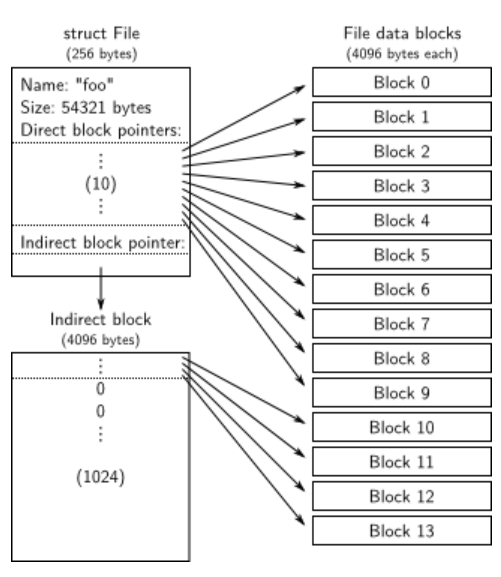
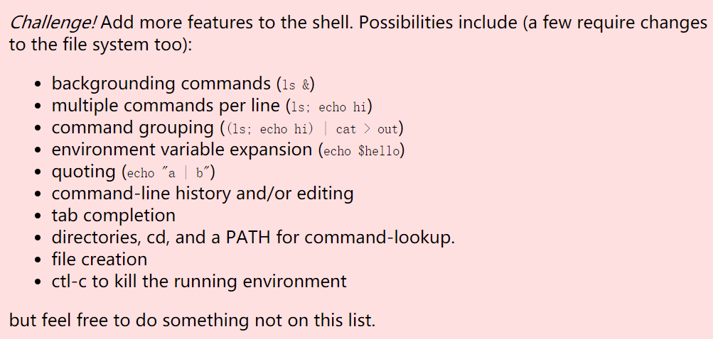

[TOC]

# Lab 5: File system, Spawn and Shell

**文件系统、Spawn 和 Shell**

## Introduction

- implement `spawn`, a library call that loads and runs on-disk executables
- flesh out your kernel and library operating system enough to run a shell on the console
- read/write file system

- 实现 spawn，这是一个加载和运行磁盘可执行文件的库调用。
- 充实您的内核和库操作系统，足以在控制台上运行 shell。
- 一个简单的读/写文件系统。


### Getting Started

实验室这部分的主要新组件是文件系统环境，位于新的 `fs` 目录中。浏览此目录中的所有文件以了解所有新内容。此外，在 `user` 和 `lib` 目录中有一些新的文件系统相关的源文件

| `fs/fs.c`       | Code that mainipulates the file system's on-disk structure.mainipulates 文件系统的磁盘结构的代码。 |
| --------------- | ------------------------------------------------------------ |
| `fs/bc.c`       | A simple block cache built on top of our user-level page fault handling facility.一个简单的块缓存建立在我们的用户级页面错误处理设施之上。 |
| `fs/ide.c`      | Minimal PIO-based (non-interrupt-driven) IDE driver code.最小的基于 PIO（非中断驱动）的 IDE 驱动程序代码。 |
| `fs/serv.c`     | The file system server that interacts with client environments using file system IPCs.使用文件系统 IPC 与客户端环境交互的文件系统服务器。 |
| `lib/fd.c`      | Code that implements the general UNIX-like file descriptor interface.实现通用类 UNIX 文件描述符接口的代码。 |
| `lib/file.c`    | The driver for on-disk file type, implemented as a file system IPC client.磁盘文件类型的驱动程序，作为文件系统 IPC 客户端实现。 |
| `lib/console.c` | The driver for console input/output file type.控制台输入/输出文件类型的驱动程序。 |
| `lib/spawn.c`   | Code skeleton of the `spawn` library call.`spawn` 库调用的代码框架。 |


在合并新的实验 5 代码后，您应该再次运行实验 4 中的`pingpong`、`primes`和`forktree`测试用例。您需要注释掉 `kern/init.c` 中的 `ENV_CREATE(fs_fs)` 行，因为 `fs/fs.c` 尝试执行一些 JOS 还不允许的 I/O。同理，暂时注释掉`lib/exit.c`中`close_all()`的调用；此函数调用您将在实验室稍后实现的子例程，因此如果调用它会发生恐慌。如果您的实验室 4 代码不包含任何错误，则测试用例应该可以正常运行。在他们工作之前不要继续。开始练习 1 时，不要忘记取消注释这些行。

### OK!!

如果它们不起作用，请使用 `git diff lab4` 检查所有更改，确保没有您为 lab4（或之前）编写的任何代码在 lab 5 中丢失。确保 lab 4 仍然有效。


# File system preliminaries  

**文件系统预备知识**

您将使用的文件系统比包括 xv6 UNIX 在内的大多数“真实”文件系统要简单得多，但它足够强大以提供基本功能：**创建、读取、写入和删除以分层目录结构组织的文件**。creating, reading, writing, and deleting files organized in a hierarchical directory structure.

我们（无论如何）目前只开发一个单用户操作系统(single-user operating system)，它提供的保护足以捕获错误，但不能保护多个相互可疑的用户彼此。因此，我们的文件系统不支持文件所有权或权限的 UNIX 概念。我们的文件系统目前也不像大多数 UNIX 文件系统那样支持硬链接、符号链接、时间戳或特殊设备文件。

## On-Disk File System Structure 磁盘文件系统结构

大多数 UNIX 文件系统将可用磁盘空间(disk space)划分为两种主要类型的区域：**inode 区域**(*inode* regions)和**数据区域**(*data* regions)。 UNIX 文件系统为文件系统中的每个文件分配一个 inode；文件的 inode 保存有关文件的关键元数据，例如其 `stat` 属性和指向其数据块的指针。数据区域被划分为更大（通常为 8KB 或更多）的数据块(*data blocks*)，文件系统在其中存储文件数据(file data)和目录元数据(directory meta-data)。**目录条目**(Directory entries )包含文件名和指向 inode 的指针；如果文件系统中的多个目录条目引用该文件的 inode，则称该文件是**硬链接**(*hard-linked* )的。由于我们的文件系统不支持硬链接，因此我们不需要这种间接级别，因此可以进行方便的简化：我们的文件系统根本不会使用 inode，而是简单地存储所有文件（或子目录）描述该文件的（一个且唯一的）目录条目中的元数据。

文件和目录在逻辑上都由一系列数据块(data blocks)组成，这些数据块可能分散在整个磁盘中，就像环境(进程)虚拟地址空间的页面可以分散在整个物理内存中一样。文件系统环境隐藏了**块布局**(block layout)的细节，提供了用于读取和写入文件内任意偏移量的字节序列的接口。文件系统环境在内部处理对目录的所有修改，作为执行文件创建和删除等操作的一部分。我们的文件系统确实允许用户环境直接读取目录元数据（例如，使用 `read`），这意味着用户环境可以自己执行目录扫描操作（例如，实现 `ls` 程序），而不必依赖额外的特殊调用到文件系统。这种目录扫描方法的缺点，也是大多数现代 UNIX 变体不鼓励它的原因，是它使应用程序依赖于目录元数据的格式，从而很难在不改变或至少改变文件系统的内部布局的情况下改变文件系统的内部布局。重新编译应用程序也是如此。

### Sectors and Blocks   扇区和块

**大多数磁盘不能以字节粒度(byte granularity)进行读写，而是以扇区为单位进行读写。**在 JOS 中，每个扇区为 512 字节。文件系统实际上以块为单位分配和使用磁盘存储。注意这两个术语之间的区别：**扇区大小是磁盘硬件的属性，而块大小是使用磁盘的操作系统的一个方面。文件系统的块大小必须是底层磁盘扇区大小的倍数。**

UNIX xv6 文件系统使用 512 字节的块大小，与底层磁盘的扇区大小相同。然而，大多数现代文件系统使用更大的块大小，因为存储空间变得更便宜，并且以更大的粒度管理存储更有效。我们的文件系统将使用 **4096 字节的块大小**，方便地匹配处理器的页面大小。

### Superblocks  超级块

文件系统通常在磁盘上“易于查找”的位置（例如开头或结尾）保留某些磁盘块，以保存描述整个文件系统属性的元数据(meta-data)，例如块大小、磁盘大小、查找根目录所需的任何元数据、文件系统上次挂载的时间、文件系统上次检查错误的时间等。这些特殊块被称为**超级块**(*superblocks*)。


我们的文件系统将只有一个超级块，它始终位于磁盘上的**块 1**。它的布局由 `inc/fs.h` 中的 `struct Super` 定义。**块 0 通常保留用于保存引导加载程序和分区表，因此文件系统通常不使用第一个磁盘块。**许多“真正的”文件系统维护多个超级块，在磁盘的多个间隔很宽的区域中进行复制，因此如果其中一个被损坏或磁盘在该区域出现介质错误，则仍然可以找到其他超级块并用于访问文件系统。

```c
struct Super {
    	// 幻数：FS_MAGIC
        uint32_t s_magic;               // Magic number: FS_MAGIC
    	// 磁盘上的块总数
        uint32_t s_nblocks;             // Total number of blocks on disk
    	// 根目录节点
        struct File s_root;             // Root directory node
};
```


### File Meta-data

在我们的文件系统中描述文件的元数据的布局由 `inc/fs.h` 中的 `struct File` 描述。此元数据包括文件的名称、大小、类型（常规文件或目录）以及指向组成文件的块的指针。如上所述，我们没有 inode，因此此元数据存储在磁盘上的目录条目(directory entry)中。与大多数“真实”文件系统不同，为简单起见，我们将使用这种文件结构来表示文件元数据，因为它同时出现在磁盘和内存中。

```c
// Maximum size of a complete pathname, including null
#define MAXPATHLEN      1024

// Number of block pointers in a File descriptor
#define NDIRECT         10
// Number of direct block pointers in an indirect block
#define NINDIRECT       (BLKSIZE / 4)

#define MAXFILESIZE     ((NDIRECT + NINDIRECT) * BLKSIZE)

struct File {
        char f_name[MAXNAMELEN];        // filename
        off_t f_size;                   // file size in bytes
        uint32_t f_type;                // file type

        // Block pointers.
        // A block is allocated iff its value is != 0.
        uint32_t f_direct[NDIRECT];     // direct blocks
        uint32_t f_indirect;            // indirect block

        // Pad out to 256 bytes; must do arithmetic in case we're compiling
        // fsformat on a 64-bit machine.
        uint8_t f_pad[256 - MAXNAMELEN - 8 - 4*NDIRECT - 4];
} __attribute__((packed));      // required only on some 64-bit machines
```




`struct File` 中的 `f_direct` 数组包含空间来存储文件的前 10 个（NDIRECT）块的块号，我们称之为文件的**直接块**(file's *direct* blocks)。对于大小不超过 10*4096 = 40KB 的小文件，这意味着所有文件块的块号将直接适合文件结构本身。然而，对于较大的文件，我们需要一个地方来保存文件的其余块编号。因此，对于任何大于 40KB 的文件，我们分配一个额外的磁盘块，称为文件的**间接块**(file's *indirect block*)，以容纳多达 4096/4 = 1024 个额外的块号。因此，我们的文件系统允许文件最大为 1034 个块，或略高于 4 兆字节。为了支持更大的文件，“真正的”文件系统通常也支持双重和三重间接块。


### Directories versus Regular Files  目录与常规文件

我们文件系统中的 `File` 结构可以表示一个普通文件或一个目录；这两种类型的“文件”通过文件结构中的类型字段(`type`)来区分。**文件系统以完全相同的方式管理常规文件和目录文件**，除了它根本不解释与常规文件关联的数据块的内容，而文件系统将目录文件(directory-file)的内容解释为一系列描述目录中的文件和子目录的`File`结构。

我们文件系统中的**超级块**包含一个`File`结构（`struct Super` 中的`root`字段），它保存文件系统**根目录的元数据**。该目录文件的内容是描述位于文件系统根目录中的文件和目录的`File`结构序列。根目录中的任何子目录又可能包含更多表示子子目录的`File`结构，依此类推。


# The File System

本实验的目标不是让您实现整个文件系统，而是让您只实现某些关键组件。特别是，您将负责将块读入块缓存并将它们刷新回磁盘；分配磁盘块；将文件偏移量映射到磁盘块；并在IPC接口中实现读、写和打开。因为您不会自己实现所有文件系统，所以熟悉所提供的代码和各种文件系统接口非常重要。

- reading blocks into the block cache and flushing them back to disk
- allocating disk blocks
- mapping file offsets to disk blocks
-  implementing read, write, and open in the IPC interface


## Disk Access  磁盘访问

我们操作系统中的文件系统环境需要能够访问磁盘，但是我们还没有在我们的内核中实现任何磁盘访问功能。我们没有采用传统的**“单体”操作系统策略**("monolithic" operating system)，即向内核添加 IDE 磁盘驱动程序以及允许文件系统访问它的必要系统调用，而是将 IDE 磁盘驱动程序实现为用户级文件的一部分系统环境。我们仍然需要稍微修改内核，以便进行设置，以便文件系统环境具有实现磁盘访问本身所需的权限。

只要我们依靠轮询(polling)、基于“程序化 I/O”(programmed I/O, PIO) 的磁盘访问并且不使用磁盘中断，就很容易以这种方式在用户空间中实现磁盘访问。也可以在用户模式下实现中断驱动的设备驱动程序（例如，L3 和 L4 内核执行此操作），但由于内核必须现场设备中断并将它们分派到正确的用户模式环境，因此更加困难.

**x86 处理器使用 EFLAGS 寄存器中的 IOPL 位来确定是否允许保护模式代码执行特殊的设备 I/O 指令，例如 IN 和 OUT 指令。**由于我们需要访问的所有 IDE 磁盘寄存器都位于 x86 的 I/O 空间中而不是内存映射，因此我们唯一需要为文件系统环境提供“**I/O 特权**”以便允许文件系统访问这些寄存器。实际上，EFLAGS 寄存器中的 IOPL 位为内核提供了一种简单的“全有或全无”(all-or-nothing)方法来控制用户模式代码是否可以访问 I/O 空间。在我们的例子中，我们希望文件系统环境能够访问 I/O 空间，但我们根本不希望任何其他环境能够访问 I/O 空间。


**Exercise 1**

`i386_init` 通过将类型 ENV_TYPE_FS 传递给您的环境创建函数 `env_create` 来识别文件系统环境。修改 `env.c` 中的 `env_create`，使其赋予文件系统环境 I/O 特权，但永远不会将该特权赋予任何其他环境。

确保您可以启动文件环境而不会导致常规保护错误。您应该通过 `make grade` 中的`fs i/o`测试。

权限在`inc/mmu.h`中定义

```c
// Eflags register
#define FL_CF           0x00000001      // Carry Flag
#define FL_PF           0x00000004      // Parity Flag
#define FL_AF           0x00000010      // Auxiliary carry Flag
#define FL_ZF           0x00000040      // Zero Flag
#define FL_SF           0x00000080      // Sign Flag
#define FL_TF           0x00000100      // Trap Flag
#define FL_IF           0x00000200      // Interrupt Flag
#define FL_DF           0x00000400      // Direction Flag
#define FL_OF           0x00000800      // Overflow Flag
#define FL_IOPL_MASK    0x00003000      // I/O Privilege Level bitmask       
#define FL_IOPL_0       0x00000000      //   IOPL == 0
#define FL_IOPL_1       0x00001000      //   IOPL == 1
#define FL_IOPL_2       0x00002000      //   IOPL == 2
#define FL_IOPL_3       0x00003000      //   IOPL == 3
#define FL_NT           0x00004000      // Nested Task
#define FL_RF           0x00010000      // Resume Flag
#define FL_VM           0x00020000      // Virtual 8086 mode
#define FL_AC           0x00040000      // Alignment Check
#define FL_VIF          0x00080000      // Virtual Interrupt Flag
#define FL_VIP          0x00100000      // Virtual Interrupt Pending
#define FL_ID           0x00200000      // ID flag
```


```c
void
env_create(uint8_t *binary, enum EnvType type)
{
        struct Env * env = NULL;
        int r = env_alloc(&env, 0);
        if(r != 0)
                panic("env_create failed: %e", r);

        load_icode(env, binary);
        env->env_type = type;
    	
    	// If this is the file server (type == ENV_TYPE_FS) give it I/O privileges.
        // LAB 5: Your code here.
        if (type == ENV_TYPE_FS) {
    		env->env_tf.tf_eflags |= FL_IOPL_MASK;
		}
}
```

也可以设置FL_IOPL_3，因为文件系统环境是一个特殊的用户环境。

```shell
make grade
...
fs i/o: OK 
...
```


**Question**

当您随后从一种环境切换到另一种环境时，您是否需要做任何其他事情来确保此 I/O 权限设置得到正确保存和恢复？为什么？

否。I/O 权限存储在 `eflags` 寄存器中。在环境之间切换时会自动保存和恢复。


请注意，本实验中的 GNUmakefile 文件将 QEMU 设置为使用文件 `obj/kern/kernel.img` 作为磁盘 0（通常在 DOS/Windows 下为“驱动器 C”）的映像，并使用（新）文件`obj/fs/fs.img` 作为磁盘 1（“驱动器 D”）的映像。在本实验中，我们的文件系统应该只接触磁盘 1；**磁盘 0 仅用于引导内核。**如果您设法以某种方式损坏了任一磁盘映像，您只需键入以下内容即可将它们重置为原始的“原始”版本：

```sh
$ rm obj/kern/kernel.img obj/fs/fs.img
$ make
```

or by doing:

```shell
$ make clean
$ make
```


## The Block Cache    块缓存

在我们的文件系统中，我们将在处理器的虚拟内存系统的帮助下实现一个简单的“**缓冲区缓存(buffer cache**)”（实际上只是一个块缓存）。块缓存的代码在 `fs/bc.c` 中。

我们的文件系统将仅限于处理 3GB 或更小的磁盘。我们为文件系统环境的地址空间保留了一个大的、固定的 3GB 区域，从` 0x10000000 `(DISKMAP) 到 `0xD0000000` (DISKMAP+DISKMAX)，作为磁盘的“内存映射”版本。例如**磁盘块 0 映射到虚拟地址 0x10000000, 磁盘块 1 映射到虚拟地址 0x10001000**，依此类推。 `fs/bc.c` 中的 `diskaddr` 函数实现了从磁盘块号到虚拟地址的转换（以及一些完整性检查）。

```c
// Return the virtual address of this disk block.
void*
diskaddr(uint32_t blockno)
{
        if (blockno == 0 || (super && blockno >= super->s_nblocks))
                panic("bad block number %08x in diskaddr", blockno);
        return (char*) (DISKMAP + blockno * BLKSIZE);
}
```

由于我们的文件系统环境有自己的虚拟地址空间，独立于系统中所有其他环境的虚拟地址空间，而且文件系统环境唯一需要做的就是实现**文件访问(file access)**，所以以这种方式保留大部分的空间是合理的文件系统环境的地址空间。由于现代磁盘大于 3GB，因此在 32 位机器上执行真正的文件系统实现会很尴尬。这种缓冲区缓存管理(buffer cache management)方法在具有 64 位地址空间的机器上可能仍然是合理的。

当然，将整个磁盘读入内存需要很长时间，所以我们将实现一种形式的**请求分页**(*demand paging*)，即我们只在磁盘映射区域中分配页面，并从磁盘中读取相应的块以响应此区域中的页面错误。这样，我们就可以假装整个磁盘都在内存中。


**Exercise 2**

在 `fs/bc.c` 中实现 `bc_pgfault` 和 `flush_block` 函数。 `bc_pgfault` 是一个页面错误处理程序，就像您在上一个实验室中为写时复制 `fork` 编写的处理程序一样，除了它的工作是从磁盘加载页面以响应页面错误。编写此内容时，请记住 (1) `addr` 可能未与块边界对齐，并且 (2) `ide_read` 在扇区中操作，而不是在块中操作。

如有必要，`flush_block` 函数应将一个块写入磁盘。如果块甚至不在块缓存中（即页面未映射）或者它不脏，`flush_block` 不应该做任何事情。我们将使用 VM 硬件来跟踪磁盘块自上次从磁盘读取或写入磁盘后是否已被修改。要查看块是否需要写入，我们可以查看 `uvpt` 条目中是否设置了 PTE_D“脏”位。 （PTE_D 位由处理器设置以响应对该页的写入；请参阅 386 参考手册[第 5 章](http://pdos.csail.mit.edu/6.828/2011/readings/i386/s05_02.htm)中的 5.2.4.3。）将块写入磁盘后，`flush_block` 应使用 `sys_page_map` 清除 PTE_D 位。

使用 `make grade` 来测试你的代码。您的代码应该通过`check_bc`、`check_super`和`check_bitmap`。

#### 实验过程

-  `bc_pgfault` 是一个页面错误处理程序，就像您在上一个实验室中为写时复制 `fork` 编写的处理程序一样，除了它的工作是从磁盘加载页面以响应页面错误。编写此内容时，请记住 (1) `addr` 可能未与块边界对齐，并且 (2) `ide_read` 在扇区中操作，而不是在块中操作。

```c
struct UTrapframe {
        /* information about the fault */
        uint32_t utf_fault_va;  /* va for T_PGFLT, 0 otherwise */
        uint32_t utf_err;
        /* trap-time return state */
        struct PushRegs utf_regs;
        uintptr_t utf_eip;
        uint32_t utf_eflags;
        /* the trap-time stack to return to */
        uintptr_t utf_esp;
} __attribute__((packed));
```


```c
// Fault any disk block that is read in to memory by
// loading it from disk.
// 通过从磁盘加载读入内存的任何磁盘块出错。
static void
bc_pgfault(struct UTrapframe *utf)
{
        void *addr = (void *) utf->utf_fault_va;
        uint32_t blockno = ((uint32_t)addr - DISKMAP) / BLKSIZE;
        int r;

        // Check that the fault was within the block cache region
    	// 检查故障是否在块缓存区域内
        if (addr < (void*)DISKMAP || addr >= (void*)(DISKMAP + DISKSIZE))
                panic("page fault in FS: eip %08x, va %08x, err %04x",
                      utf->utf_eip, addr, utf->utf_err);

        // Sanity check the block number.
    	// 完整性检查块号。
        if (super && blockno >= super->s_nblocks)
                panic("reading non-existent block %08x\n", blockno);

        // Allocate a page in the disk map region, read the contents
        // of the block from the disk into that page.
        // Hint: first round addr to page boundary. fs/ide.c has code to read
        // the disk.
    	// 在磁盘映射区域中分配一个页面，将块的内容从磁盘读入该页面。
        // 提示：页面边界的第一轮地址。 fs/ide.c 有读取磁盘的代码。
        //
        // LAB 5: you code here:
    	// addr may not be aligned to a block boundary
    	addr = ROUNDDOWN(addr, PGSIZE);
    	// Allocate a page
    	if ((r = sys_page_alloc(0, addr, PTE_W | PTE_U | PTE_P)) != 0) {
    		panic("bc_pgfault: %e", r);
		}
    	// ide_read operates in sectors, not blocks.
		if ((r = ide_read(blockno * BLKSECTS, addr, BLKSECTS)) != 0) {
    		panic("bc_pgfault: %e", r);
		}

        // Clear the dirty bit for the disk block page since we just read the
        // block from disk
    	// 清除磁盘块页面的脏位，因为我们只是从磁盘读取块
        if ((r = sys_page_map(0, addr, 0, addr, uvpt[PGNUM(addr)] & PTE_SYSCALL)) < 0)
                panic("in bc_pgfault, sys_page_map: %e", r);

        // Check that the block we read was allocated. (exercise for
        // the reader: why do we do this *after* reading the block
        // in?)
    	// 检查我们读取的块是否已分配。 （读者练习：为什么我们*在*读完块之后要这样做？）
        if (bitmap && block_is_free(blockno))
                panic("reading free block %08x\n", blockno);
}
```

读取磁盘块代码实例：

`fs/ide.c`

```c
int
ide_read(uint32_t secno, void *dst, size_t nsecs)
{
        int r;

        assert(nsecs <= 256);

        ide_wait_ready(0);

        outb(0x1F2, nsecs);
        outb(0x1F3, secno & 0xFF);
        outb(0x1F4, (secno >> 8) & 0xFF);
        outb(0x1F5, (secno >> 16) & 0xFF);
        outb(0x1F6, 0xE0 | ((diskno&1)<<4) | ((secno>>24)&0x0F));
        outb(0x1F7, 0x20);      // CMD 0x20 means read sector

        for (; nsecs > 0; nsecs--, dst += SECTSIZE) {
                if ((r = ide_wait_ready(1)) < 0)
                        return r;
                insl(0x1F0, dst, SECTSIZE/4);
        }

        return 0;
}
```


- `flush_block` 函数应将一个块写入磁盘。如果块甚至不在块缓存中（即页面未映射）或者它不脏，`flush_block` 不应该做任何事情。将块写入磁盘后，`flush_block` 应使用 `sys_page_map` 清除 PTE_D 位。

```c
// Flush the contents of the block containing VA out to disk if
// necessary, then clear the PTE_D bit using sys_page_map.
// If the block is not in the block cache or is not dirty, does
// nothing.
// Hint: Use va_is_mapped, va_is_dirty, and ide_write.
// Hint: Use the PTE_SYSCALL constant when calling sys_page_map.
// Hint: Don't forget to round addr down.
// 如有必要，将包含 VA 的块的内容刷新到磁盘，然后使用 sys_page_map 清除 PTE_D 位。
// 如果块不在块缓存中或不脏，则不执行任何操作。
// 提示：使用 va_is_mapped、va_is_dirty 和 ide_write。
// 提示：调用 sys_page_map 时使用 PTE_SYSCALL 常量。
// 提示：不要忘记将 addr 向下舍入。
void
flush_block(void *addr)
{
        uint32_t blockno = ((uint32_t)addr - DISKMAP) / BLKSIZE;

        if (addr < (void*)DISKMAP || addr >= (void*)(DISKMAP + DISKSIZE))
                panic("flush_block of bad va %08x", addr);

        // LAB 5: Your code here.
        if (!va_is_mapped(addr) || !va_is_dirty(addr)) {
        	return;
    	}
    
    	//  Don't forget to round addr down.
    	addr = ROUNDDOWN(addr, PGSIZE);
    	int r;
    	// write a block out to disk 
    	if ((r = ide_write(blockno * BLKSECTS, addr, BLKSECTS)) != 0) {
        	panic("flush_block: %e", r);
    	}
    	//  clear the PTE_D bit using sys_page_map
    	if ((r = sys_page_map(0, addr, 0, addr, uvpt[PGNUM(addr)] & PTE_SYSCALL)) != 0) {
        	panic("flush_block: %e", r);
    	}
}
```

```c
// Is this virtual address mapped?
bool
va_is_mapped(void *va)
{
        return (uvpd[PDX(va)] & PTE_P) && (uvpt[PGNUM(va)] & PTE_P);
}

// Is this virtual address dirty?
bool
va_is_dirty(void *va)
{
        return (uvpt[PGNUM(va)] & PTE_D) != 0;
}
```

```c
int
ide_write(uint32_t secno, const void *src, size_t nsecs)
{
        int r;

        assert(nsecs <= 256);

        ide_wait_ready(0);

        outb(0x1F2, nsecs);
        outb(0x1F3, secno & 0xFF);
        outb(0x1F4, (secno >> 8) & 0xFF);
        outb(0x1F5, (secno >> 16) & 0xFF);
        outb(0x1F6, 0xE0 | ((diskno&1)<<4) | ((secno>>24)&0x0F));
        outb(0x1F7, 0x30);      // CMD 0x30 means write sector

        for (; nsecs > 0; nsecs--, src += SECTSIZE) {
                if ((r = ide_wait_ready(1)) < 0)
                        return r;
                outsl(0x1F0, src, SECTSIZE/4);
        }

        return 0;
}
```


#### TEST

使用 `make grade` 来测试你的代码。您的代码应该通过`check_bc`、`check_super`和`check_bitmap`。

```shell
make grade
...
  fs i/o: OK 
  check_bc: OK 
  check_super: OK 
  check_bitmap: OK 
...
```


`fs/fs.c` 中的 `fs_init` 函数是如何使用块缓存的主要示例。初始化块缓存后，它只是将指针存储到`super`全局变量中的磁盘映射区域中。在此之后，我们可以简单地从`super`结构中读取，就好像它们在内存中一样，我们的页面错误处理程序将根据需要从磁盘读取它们。

```c
// Initialize the file system
// 初始化文件系统
void
fs_init(void)
{
        static_assert(sizeof(struct File) == 256);

        // Find a JOS disk.  Use the second IDE disk (number 1) if available
    	// 找一个 JOS 磁盘。如果可用，请使用第二个 IDE 磁盘（编号 1）
        if (ide_probe_disk1())
                ide_set_disk(1);
        else
                ide_set_disk(0);
        bc_init();

        // Set "super" to point to the super block.
    	// 设置“super”指向超级块。
        super = diskaddr(1);
        check_super();

        // Set "bitmap" to the beginning of the first bitmap block.
    	// 将“bitmap”设置为第一个位图块的开头。
        bitmap = diskaddr(2);
        check_bitmap();

}
```


## The Block Bitmap  块位图

在 `fs_init` 设置`bitmap`指针后，我们可以将`bitmap`视为一组位的压缩数组，磁盘上的每个块一个。例如，参见 `block_is_free`，它只是检查给定块在位图中是否标记为空闲。

```c
// Check to see if the block bitmap indicates that block 'blockno' is free.
// Return 1 if the block is free, 0 if not.
// 检查块位图是否指示块 'blockno' 是空闲的。
// 如果块空闲则返回 1，否则返回 0。
bool
block_is_free(uint32_t blockno)
{
        if (super == 0 || blockno >= super->s_nblocks)
                return 0;
        if (bitmap[blockno / 32] & (1 << (blockno % 32)))
                return 1;
        return 0;
}
```


**Exercise 3**

以`free_block`为模型在`fs/fs.c`中实现`alloc_block`，它应该在位图中找到一个空闲的磁盘块，将其标记为已使用，并返回该块的编号。分配块时，应立即使用`flush_block` 将更改的位图块刷新到磁盘，以帮助文件系统一致性。

使用 `make grade` 来测试你的代码。您的代码现在应该通过`alloc_block`。

```c
// Mark a block free in the bitmap
// 在位图中标记一个空闲块
void
free_block(uint32_t blockno)
{
        // Blockno zero is the null pointer of block numbers.
    	// Blockno 0 是块号的空指针。
        if (blockno == 0)
                panic("attempt to free zero block");
        bitmap[blockno/32] |= 1<<(blockno%32);
}
```


```c
// Search the bitmap for a free block and allocate it.  When you
// allocate a block, immediately flush the changed bitmap block
// to disk.
//
// Return block number allocated on success,
// -E_NO_DISK if we are out of blocks.
//
// Hint: use free_block as an example for manipulating the bitmap.
// 
// 在位图中搜索空闲块并分配它。分配块时，立即将更改的位图块刷新到磁盘。
//
// 返回成功分配的块号，
// 		-E_NO_DISK 如果我们没有块。
//
// 提示：使用 free_block 作为操作位图的示例。
int
alloc_block(void)
{
        // The bitmap consists of one or more blocks.  A single bitmap block
        // contains the in-use bits for BLKBITSIZE blocks.  There are
        // super->s_nblocks blocks in the disk altogether.
    	// 位图由一个或多个块组成。单个位图块包含 BLKBITSIZE 块的使用位。
    	// 磁盘中总共有 super->s_nblocks 块。

        // LAB 5: Your code here.
        for (int i = 0; i < super->s_nblocks; i++) {
        	if (block_is_free(i)) {
            	bitmap[i / 32] &= ~(1 << (i % 32)); // mark it used
            	flush_block(&bitmap[i / 32]); // flush the block to disk
            	return i;
        	}
   		}
        return -E_NO_DISK;
}
```


```shell
make grade
...
  fs i/o: OK 
  check_bc: OK 
  check_super: OK 
  check_bitmap: OK 
  alloc_block: OK 
...
```


## File Operations

我们在 `fs/fs.c` 中提供了多种函数来实现解释和管理`File`结构、扫描和管理目录文件条目以及从根遍历文件系统以解析绝对文件所需的基本工具路径名。通读 `fs/fs.c` 中的所有代码，并确保在继续之前了解每个函数的作用。

- `inc/fs.h  ---- struct File`

```c
// Maximum size of a filename (a single path component), including null
// Must be a multiple of 4
#define MAXNAMELEN      128

// Maximum size of a complete pathname, including null
#define MAXPATHLEN      1024

// Number of block pointers in a File descriptor
#define NDIRECT         10
// Number of direct block pointers in an indirect block
#define NINDIRECT       (BLKSIZE / 4)

#define MAXFILESIZE     ((NDIRECT + NINDIRECT) * BLKSIZE)

struct File {
        char f_name[MAXNAMELEN];        // filename
        off_t f_size;                   // file size in bytes
        uint32_t f_type;                // file type

        // Block pointers.
        // A block is allocated iff its value is != 0.
        uint32_t f_direct[NDIRECT];     // direct blocks
        uint32_t f_indirect;            // indirect block

        // Pad out to 256 bytes; must do arithmetic in case we're compiling
        // fsformat on a 64-bit machine.
        uint8_t f_pad[256 - MAXNAMELEN - 8 - 4*NDIRECT - 4];
} __attribute__((packed));      // required only on some 64-bit machines
```


- **Super block**

```c
include <inc/string.h>
#include <inc/partition.h>

#include "fs.h"

// --------------------------------------------------------------
// Super block
// --------------------------------------------------------------

// Validate the file system super-block.
// 验证文件系统超级块。
void
check_super(void)
{
        if (super->s_magic != FS_MAGIC)
                panic("bad file system magic number");

        if (super->s_nblocks > DISKSIZE/BLKSIZE)
                panic("file system is too large");

        cprintf("superblock is good\n");
}
```

-  **Free block bitmap**

```c
// --------------------------------------------------------------
// Free block bitmap
// --------------------------------------------------------------

// Check to see if the block bitmap indicates that block 'blockno' is free.
// Return 1 if the block is free, 0 if not.
// 检查块位图是否指示块 'blockno' 是空闲的。
// 如果块空闲则返回 1，否则返回 0。
bool
block_is_free(uint32_t blockno)
{
        if (super == 0 || blockno >= super->s_nblocks)
                return 0;
        if (bitmap[blockno / 32] & (1 << (blockno % 32)))
                return 1;
        return 0;
}

// Mark a block free in the bitmap
// 在位图中标记一个空闲块
void
free_block(uint32_t blockno)
{
        // Blockno zero is the null pointer of block numbers.
    	// Blockno 0 是块号的空指针。
        if (blockno == 0)
                panic("attempt to free zero block");
        bitmap[blockno/32] |= 1<<(blockno%32);
}

// Search the bitmap for a free block and allocate it.  When you
// allocate a block, immediately flush the changed bitmap block
// to disk.
//
// Return block number allocated on success,
// -E_NO_DISK if we are out of blocks.
//
// Hint: use free_block as an example for manipulating the bitmap.
// 
// 在位图中搜索空闲块并分配它。分配块时，立即将更改的位图块刷新到磁盘。
//
// 返回成功分配的块号，
// 		-E_NO_DISK 如果我们没有块。
//
// 提示：使用 free_block 作为操作位图的示例。
int
alloc_block(void)
{
        // The bitmap consists of one or more blocks.  A single bitmap block
        // contains the in-use bits for BLKBITSIZE blocks.  There are
        // super->s_nblocks blocks in the disk altogether.
    	// 位图由一个或多个块组成。单个位图块包含 BLKBITSIZE 块的使用位。
    	// 磁盘中总共有 super->s_nblocks 块。

        // LAB 5: Your code here.
        for (int i = 0; i < super->s_nblocks; i++) {
        	if (block_is_free(i)) {
            	bitmap[i / 32] &= ~(1 << (i % 32)); // mark it used
            	flush_block(&bitmap[i / 32]); // flush the block to disk
            	return i;
        	}
   		}
        return -E_NO_DISK;
}

// Validate the file system bitmap.
//
// Check that all reserved blocks -- 0, 1, and the bitmap blocks themselves -
// are all marked as in-use.
// 验证文件系统位图。
//
// 检查所有保留块——0、1，以及位图块本身—— 都标记为使用中。
void
check_bitmap(void)
{
        uint32_t i;

        // Make sure all bitmap blocks are marked in-use
    	// 确保所有位图块都被标记为正在使用
        for (i = 0; i * BLKBITSIZE < super->s_nblocks; i++)
                assert(!block_is_free(2+i));

        // Make sure the reserved and root blocks are marked in-use.
    	// 确保保留块和根块被标记为正在使用。
        assert(!block_is_free(0));
        assert(!block_is_free(1));

        cprintf("bitmap is good\n");
}
```

- **File system structures**

```c
// --------------------------------------------------------------
// File system structures
// --------------------------------------------------------------


// Initialize the file system
// 初始化文件系统
void
fs_init(void)
{
        static_assert(sizeof(struct File) == 256);

        // Find a JOS disk.  Use the second IDE disk (number 1) if available
    	// 找到一个 JOS 磁盘。如果可用，请使用第二个 IDE 磁盘（编号 1）
        if (ide_probe_disk1())
                ide_set_disk(1);
        else
                ide_set_disk(0);
        bc_init();

        // Set "super" to point to the super block.
		// 设置“super”指向超级块。
        super = diskaddr(1);
        check_super();

        // Set "bitmap" to the beginning of the first bitmap block.
    	// 将“bitmap”设置为第一个位图块的开头。
        bitmap = diskaddr(2);
        check_bitmap();
}

// Find the disk block number slot for the 'filebno'th block in file 'f'.
// Set '*ppdiskbno' to point to that slot.
// The slot will be one of the f->f_direct[] entries,
// or an entry in the indirect block.
// When 'alloc' is set, this function will allocate an indirect block
// if necessary.
//
// Returns:
//      0 on success (but note that *ppdiskbno might equal 0).
//      -E_NOT_FOUND if the function needed to allocate an indirect block, but
//              alloc was 0.
//      -E_NO_DISK if there's no space on the disk for an indirect block.
//      -E_INVAL if filebno is out of range (it's >= NDIRECT + NINDIRECT).
//
// Analogy: This is like pgdir_walk for files.
// Hint: Don't forget to clear any block you allocate.
// 
// 找到文件 'f' 中第 'filebno' 个块的磁盘块号槽。
// 设置 '*ppdiskbno' 指向那个插槽。
// 该插槽将是 f->f_direct[] 条目之一，或间接块中的条目。
// 当设置了 'alloc' 时，该函数将在必要时分配一个间接块。
//
// 返回：
// 成功时为 0（但请注意 *ppdiskbno 可能等于 0）。
// 		-E_NOT_FOUND 如果函数需要分配一个间接块，但 alloc 为 0。
// 		-E_NO_DISK 如果磁盘上没有用于间接块的空间。
// 		-E_INVAL 如果 filebno 超出范围（它是 >= NDIRECT + NINDIRECT）。
//
// 类比：这就像文件的 pgdir_walk。
// 提示：不要忘记清除您分配的任何块。
static int
file_block_walk(struct File *f, uint32_t filebno, uint32_t **ppdiskbno, bool alloc)
{
       // LAB 5: Your code here.
       panic("file_block_walk not implemented");
}

// Set *blk to the address in memory where the filebno'th
// block of file 'f' would be mapped.
//
// Returns 0 on success, < 0 on error.  Errors are:
//      -E_NO_DISK if a block needed to be allocated but the disk is full.
//      -E_INVAL if filebno is out of range.
//
// Hint: Use file_block_walk and alloc_block.
// 将 *blk 设置为内存中文件 'f' 的第一个文件块将被映射的地址。
//
// 成功返回 0，错误返回 < 0。错误是：
// 		-E_NO_DISK 如果需要分配块但磁盘已满。
// 		-E_INVAL 如果 filebno 超出范围。
//
// 提示：使用file_block_walk 和alloc_block。
int
file_get_block(struct File *f, uint32_t filebno, char **blk)
{
       // LAB 5: Your code here.
       panic("file_get_block not implemented");
}

// Try to find a file named "name" in dir.  If so, set *file to it.
//
// Returns 0 and sets *file on success, < 0 on error.  Errors are:
//      -E_NOT_FOUND if the file is not found
// 尝试在目录中查找名为“name”的文件。如果是这样，请将 *file 设置为它。
//
// 返回 0 并设置 *file 成功，< 0 错误。错误是：
// 		-E_NOT_FOUND 如果文件未找到
static int
dir_lookup(struct File *dir, const char *name, struct File **file)
{
        int r;
        uint32_t i, j, nblock;
        char *blk;
        struct File *f;

        // Search dir for name.
        // We maintain the invariant that the size of a directory-file
        // is always a multiple of the file system's block size.
    	// 在目录中搜索名称。
        // 我们保持不变性，即目录文件的大小始终是文件系统块大小的倍数。
        assert((dir->f_size % BLKSIZE) == 0);
        nblock = dir->f_size / BLKSIZE;
        for (i = 0; i < nblock; i++) {
                if ((r = file_get_block(dir, i, &blk)) < 0)
                        return r;
                f = (struct File*) blk;
                for (j = 0; j < BLKFILES; j++)
                        if (strcmp(f[j].f_name, name) == 0) {
                                *file = &f[j];
                                return 0;
                        }
        }
        return -E_NOT_FOUND;
}

// Set *file to point at a free File structure in dir.  The caller is
// responsible for filling in the File fields.
// 将 *file 设置为指向 dir 中的空闲文件结构。调用者负责填写文件字段。
static int
dir_alloc_file(struct File *dir, struct File **file)
{
        int r;
        uint32_t nblock, i, j;
        char *blk;
        struct File *f;

        assert((dir->f_size % BLKSIZE) == 0);
        nblock = dir->f_size / BLKSIZE;
        for (i = 0; i < nblock; i++) {
                if ((r = file_get_block(dir, i, &blk)) < 0)
                        return r;
                f = (struct File*) blk;
                for (j = 0; j < BLKFILES; j++)
                        if (f[j].f_name[0] == '\0') {
                                *file = &f[j];
                                return 0;
                        }
        }
        dir->f_size += BLKSIZE;
        if ((r = file_get_block(dir, i, &blk)) < 0)
                return r;
        f = (struct File*) blk;
        *file = &f[0];
        return 0;
}

// Skip over slashes.
// 跳过斜线。
static const char*
skip_slash(const char *p)
{
        while (*p == '/')
                p++;
        return p;
}

// Evaluate a path name, starting at the root.
// On success, set *pf to the file we found
// and set *pdir to the directory the file is in.
// If we cannot find the file but find the directory
// it should be in, set *pdir and copy the final path
// element into lastelem.
// 评估一个路径名，从根开始。
// 成功时，将 *pf 设置为我们找到的文件，并将 *pdir 设置为文件所在的目录。
// 如果我们找不到文件但找到了它应该在的目录，设置 *pdir 并将最终路径元素复制到lastelem。
static int
walk_path(const char *path, struct File **pdir, struct File **pf, char *lastelem)
{
        const char *p;
        char name[MAXNAMELEN];
        struct File *dir, *f;
        int r;

        // if (*path != '/')
        //      return -E_BAD_PATH;
        path = skip_slash(path);
        f = &super->s_root;
        dir = 0;
        name[0] = 0;

        if (pdir)
                *pdir = 0;
        *pf = 0;
        while (*path != '\0') {
                dir = f;
                p = path;
                while (*path != '/' && *path != '\0')
                        path++;
                if (path - p >= MAXNAMELEN)
                        return -E_BAD_PATH;
                memmove(name, p, path - p);
                name[path - p] = '\0';
                path = skip_slash(path);

                if (dir->f_type != FTYPE_DIR)
                        return -E_NOT_FOUND;

                if ((r = dir_lookup(dir, name, &f)) < 0) {
                        if (r == -E_NOT_FOUND && *path == '\0') {
                                if (pdir)
                                        *pdir = dir;
                                if (lastelem)
                                        strcpy(lastelem, name);
                                *pf = 0;
                        }
                        return r;
                }
        }

        if (pdir)
                *pdir = dir;
        *pf = f;
        return 0;
}

```


- **File operations**

```c
// --------------------------------------------------------------
// File operations
// --------------------------------------------------------------

// Create "path".  On success set *pf to point at the file and return 0.
// On error return < 0.
// 创建“路径”。成功时将 *pf 设置为指向文件并返回 0。
// 错误返回 < 0。
int
file_create(const char *path, struct File **pf)
{
        char name[MAXNAMELEN];
        int r;
        struct File *dir, *f;

        if ((r = walk_path(path, &dir, &f, name)) == 0)
                return -E_FILE_EXISTS;
        if (r != -E_NOT_FOUND || dir == 0)
                return r;
        if ((r = dir_alloc_file(dir, &f)) < 0)
                return r;

        strcpy(f->f_name, name);
        *pf = f;
        file_flush(dir);
        return 0;
}

// Open "path".  On success set *pf to point at the file and return 0.
// On error return < 0.
// 打开“路径”。成功时将 *pf 设置为指向文件并返回 0。
// 错误返回 < 0。
int
file_open(const char *path, struct File **pf)
{
        return walk_path(path, 0, pf, 0);
}

// Read count bytes from f into buf, starting from seek position
// offset.  This meant to mimic the standard pread function.
// Returns the number of bytes read, < 0 on error.
// 从 f 中读取 count 个字节到 buf 中，从查找位置偏移开始。
// 这意味着模仿标准的 pread 函数。
// 返回读取的字节数，错误时 < 0。
ssize_t
file_read(struct File *f, void *buf, size_t count, off_t offset)
{
        int r, bn;
        off_t pos;
        char *blk;

        if (offset >= f->f_size)
                return 0;

        count = MIN(count, f->f_size - offset);

        for (pos = offset; pos < offset + count; ) {
                if ((r = file_get_block(f, pos / BLKSIZE, &blk)) < 0)
                        return r;
                bn = MIN(BLKSIZE - pos % BLKSIZE, offset + count - pos);
                memmove(buf, blk + pos % BLKSIZE, bn);
                pos += bn;
                buf += bn;
        }

        return count;
}
// Remove a block from file f.  If it's not there, just silently succeed.
// Returns 0 on success, < 0 on error.
// 从文件 f 中删除一个块。如果它不在那里，就默默地成功。
// 成功返回 0，错误返回 < 0。
static int
file_free_block(struct File *f, uint32_t filebno)
{
        int r;
        uint32_t *ptr;

        if ((r = file_block_walk(f, filebno, &ptr, 0)) < 0)
                return r;
        if (*ptr) {
                free_block(*ptr);
                *ptr = 0;
        }
        return 0;
}

// Remove any blocks currently used by file 'f',
// but not necessary for a file of size 'newsize'.
// For both the old and new sizes, figure out the number of blocks required,
// and then clear the blocks from new_nblocks to old_nblocks.
// If the new_nblocks is no more than NDIRECT, and the indirect block has
// been allocated (f->f_indirect != 0), then free the indirect block too.
// (Remember to clear the f->f_indirect pointer so you'll know
// whether it's valid!)
// Do not change f->f_size.
// 删除文件 'f' 当前使用的所有块，但对于大小为 'newsize' 的文件不是必需的。
// 对于旧的和新的大小，计算出需要的块数，然后将块从 new_nblocks 清除到 old_nblocks。
// 如果 new_nblocks 不超过 NDIRECT，并且间接块已经被分配（f->f_indirect != 0），那么也释放间接块。
// （记得清除 f->f_indirect 指针，这样你就会知道它是否有效！）
// 不要改变 f->f_size。
static void
file_truncate_blocks(struct File *f, off_t newsize)
{
        int r;
        uint32_t bno, old_nblocks, new_nblocks;

        old_nblocks = (f->f_size + BLKSIZE - 1) / BLKSIZE;
        new_nblocks = (newsize + BLKSIZE - 1) / BLKSIZE;
        for (bno = new_nblocks; bno < old_nblocks; bno++)
                if ((r = file_free_block(f, bno)) < 0)
                        cprintf("warning: file_free_block: %e", r);

        if (new_nblocks <= NDIRECT && f->f_indirect) {
                free_block(f->f_indirect);
                f->f_indirect = 0;
        }
}

// Set the size of file f, truncating or extending as necessary.
// 设置文件 f 的大小，根据需要截断或扩展。
int
file_set_size(struct File *f, off_t newsize)
{
        if (f->f_size > newsize)
                file_truncate_blocks(f, newsize);
        f->f_size = newsize;
        flush_block(f);
        return 0;
}
// Flush the contents and metadata of file f out to disk.
// Loop over all the blocks in file.
// Translate the file block number into a disk block number
// and then check whether that disk block is dirty.  If so, write it out.
// 将文件 f 的内容和元数据刷新到磁盘。
// 遍历文件中的所有块。
// 将文件块号转换为磁盘块号，然后检查该磁盘块是否是脏的。如果是这样，写出来。
void
file_flush(struct File *f)
{
        int i;
        uint32_t *pdiskbno;

        for (i = 0; i < (f->f_size + BLKSIZE - 1) / BLKSIZE; i++) {
                if (file_block_walk(f, i, &pdiskbno, 0) < 0 ||
                    pdiskbno == NULL || *pdiskbno == 0)
                        continue;
                flush_block(diskaddr(*pdiskbno));
        }
        flush_block(f);
        if (f->f_indirect)
                flush_block(diskaddr(f->f_indirect));
}


// Sync the entire file system.  A big hammer.
// 同步整个文件系统。
void
fs_sync(void)
{
        int i;
        for (i = 1; i < super->s_nblocks; i++)
                flush_block(diskaddr(i));
}
```


**Exercise 4**

实现 `file_block_walk`和 `file_get_block`。 `file_block_walk` 从文件中的块偏移量映射到结构文件或间接块中该块的指针，非常类似于 `pgdir_walk` 对页表所做的。 `file_get_block` 更进一步，映射到实际磁盘块，必要时分配一个新块。

使用 `make grade` 来测试你的代码。您的代码应该通过`file_open`、`file_get_block`、`file_flush/file_truncated/file rewrite`和`testfile`。


- `file_block_walk` 从文件中的块偏移量映射到结构文件或间接块中该块的指针，非常类似于 `pgdir_walk` 对页表所做的。

```c
// Find the disk block number slot for the 'filebno'th block in file 'f'.
// Set '*ppdiskbno' to point to that slot.
// The slot will be one of the f->f_direct[] entries,
// or an entry in the indirect block.
// When 'alloc' is set, this function will allocate an indirect block
// if necessary.
//
// Returns:
//      0 on success (but note that *ppdiskbno might equal 0).
//      -E_NOT_FOUND if the function needed to allocate an indirect block, but
//              alloc was 0.
//      -E_NO_DISK if there's no space on the disk for an indirect block.
//      -E_INVAL if filebno is out of range (it's >= NDIRECT + NINDIRECT).
//
// Analogy: This is like pgdir_walk for files.
// Hint: Don't forget to clear any block you allocate.
// 
// 找到文件 'f' 中第 'filebno' 个块的磁盘块号槽。
// 设置 '*ppdiskbno' 指向那个插槽。
// 该插槽将是 f->f_direct[] 条目之一，或间接块中的条目。
// 当设置了 'alloc' 时，该函数将在必要时分配一个间接块。
//
// 返回：
// 成功时为 0（但请注意 *ppdiskbno 可能等于 0）。
// 		-E_NOT_FOUND 如果函数需要分配一个间接块，但 alloc 为 0。
// 		-E_NO_DISK 如果磁盘上没有用于间接块的空间。
// 		-E_INVAL 如果 filebno 超出范围（它是 >= NDIRECT + NINDIRECT）。
//
// 类比：这就像文件的 pgdir_walk。
// 提示：不要忘记清除您分配的任何块。
static int
file_block_walk(struct File *f, uint32_t filebno, uint32_t **ppdiskbno, bool alloc)
{
       	// LAB 5: Your code here.
    	// if filebno is out of range (it's >= NDIRECT + NINDIRECT)
    	if (filebno >= NDIRECT + NINDIRECT) {
        	return -E_INVAL;
    	}
    	if (filebno < NDIRECT) { 
            // The slot will be one of the f->f_direct[] entries
            if(ppdiskbno)
        		*ppdiskbno = &(f->f_direct[filebno]);
            else
                return 0;
    	}
    	
        // an entry in the indirect block
        if (!f->f_indirect && !alloc) {
            return -E_NOT_FOUND;
        }
        if (!f->f_indirect && alloc) {
            uint32_t newbno;

            if ((newbno = alloc_block()) < 0) {
                return -E_NO_DISK;
            }
                
            f->f_indirect = newbno;
            memset(diskaddr(newbno), 0, BLKSIZE);
            flush_block(diskaddr(newbno));
        }
    	
    	if(ppdiskbno){
        	*ppdiskbno = (uint32_t *)diskaddr(f->f_indirect) + filebno;
        }
    	
    	return 0;
}
```


-  `file_get_block` 更进一步，映射到实际磁盘块，必要时分配一个新块。

```c
// Set *blk to the address in memory where the filebno'th
// block of file 'f' would be mapped.
//
// Returns 0 on success, < 0 on error.  Errors are:
//      -E_NO_DISK if a block needed to be allocated but the disk is full.
//      -E_INVAL if filebno is out of range.
//
// Hint: Use file_block_walk and alloc_block.
// 将 *blk 设置为内存中文件 'f' 的第一个文件块将被映射的地址。
//
// 成功返回 0，错误返回 < 0。错误是：
// 		-E_NO_DISK 如果需要分配块但磁盘已满。
// 		-E_INVAL 如果 filebno 超出范围。
//
// 提示：使用file_block_walk 和alloc_block。
int
file_get_block(struct File *f, uint32_t filebno, char **blk)
{
        // LAB 5: Your code here.
        uint32_t *pdiskbno;
    	int r;

    	if ((r = file_block_walk(f, filebno, &pdiskbno, 1)) != 0) {
        	return r;
    	}
    	if (!*pdiskbno) {
        	uint32_t newbno;

       	 	if ((newbno = alloc_block()) < 0) {
            	return -E_NO_DISK;
        	}
        	*pdiskbno = newbno;
        	memset(diskaddr(newbno), 0, BLKSIZE);
            flush_block(diskaddr(newbno));
    	}
    
    	*blk = diskaddr(*pdiskbno);
    	return 0;
}
```


##### TEST

使用 `make grade` 来测试你的代码。您的代码应该通过`file_open`、`file_get_block`、`file_flush/file_truncated/file rewrite`和`testfile`。

```shell
make grade
...
fs/fs.c: In function ‘file_block_walk’:
fs/fs.c:152:24: error: taking address of packed member of ‘struct File’ may result in an unaligned pointer value [-Werror=address-of-packed-member]
  152 |           *ppdiskbno = &(f->f_direct[filebno]);
      |                        ^~~~~~~~~~~~~~~~~~~~~~~
cc1: all warnings being treated as errors
...
```

错误：获取“struct File”的打包成员的地址可能会导致未对齐的指针值 [-Werror=address-of-packed-member]。这个错误与操作系统没有关系，主要是GCC的特有语法。

在`inc/fs.h`中：

```c
struct File {
        char f_name[MAXNAMELEN];        // filename
        off_t f_size;                   // file size in bytes
        uint32_t f_type;                // file type

        // Block pointers.
        // A block is allocated iff its value is != 0.
        uint32_t f_direct[NDIRECT];     // direct blocks
        uint32_t f_indirect;            // indirect block

        // Pad out to 256 bytes; must do arithmetic in case we're compiling
        // fsformat on a 64-bit machine.
        uint8_t f_pad[256 - MAXNAMELEN - 8 - 4*NDIRECT - 4];
} __attribute__((packed));   // required only on some 64-bit machines
```

注意到：

```c
 __attribute__((packed)); 
```

- ` __attribute__ ((packed))` 的作用就是告诉编译器取消结构在编译过程中的优化对齐,按照实际占用字节数进行对齐，是GCC特有的语法。这个功能是跟操作系统没关系，跟编译器有关，gcc编译器不是紧凑模式的。

- `__attribute__`关键字主要是用来在函数或数据声明中设置其属性。给函数赋给属性的主要目的在于让编译器进行优化。函数声明中的__attribute__((noreturn))，就是告诉编译器这个函数不会返回给调用者，以便编译器在优化时去掉不必要的函数返回代码。

- packed是类型属性（Type Attribute）的一个参数，使用packed可以减小对象占用的空间。需要注意的是，attribute属性的效力与你的连接器也有关，如果你的连接器最大只支持16字节对齐，那么你此时定义32字节对齐也是无济于事的。

  使用该属性对struct或者union类型进行定义，设定其类型的每一个变量的内存约束。当用在enum类型定义时，暗示了应该使用最小完整的类型（it indicates that the smallest integral type should be used）。

我选择将其注释。

###### TEST AGAIN

```shell
make grade
...
  fs i/o: OK 
  check_bc: OK 
  check_super: OK 
  check_bitmap: OK 
  alloc_block: OK 
  file_open: OK 
  file_get_block: OK 
  file_flush/file_truncate/file rewrite: OK 
testfile: OK (0.9s) 
...
```


`file_block_walk`和`file_get_block`是文件系统的工作主力。例如，FILE_READ和FILE_WRITE是略多于簿记顶上必要`file_get_block`复制散块和连续缓冲区之间的字节。


## The file system interface 文件系统界面

现在我们在文件系统环境中拥有了必要的功能，我们必须让其他希望使用文件系统的环境可以访问它。由于其他环境无法直接调用文件系统环境中的函数，因此我们将**通过构建在 JOS 的 IPC 机制之上的远程过程调用(*remote procedure call*, RPC)、抽象来公开对文件系统环境的访问**。从图形上看，这是对文件系统服务器的调用(例如，读取):

```
   Regular env           FS env
   +---------------+   +---------------+
   |      read     |   |   file_read   |
   |   (lib/fd.c)  |   |   (fs/fs.c)   |
...|.......|.......|...|.......^.......|...............
   |       v       |   |       |       | RPC mechanism
   |  devfile_read |   |  serve_read   |
   |  (lib/file.c) |   |  (fs/serv.c)  |
   |       |       |   |       ^       |
   |       v       |   |       |       |
   |     fsipc     |   |     serve     |
   |  (lib/file.c) |   |  (fs/serv.c)  |
   |       |       |   |       ^       |
   |       v       |   |       |       |
   |   ipc_send    |   |   ipc_recv    |
   |       |       |   |       ^       |
   +-------|-------+   +-------|-------+
           |                   |
           +-------------------+
```

虚线下方的所有内容只是从**常规环境**(regular environment)到**文件系统环境**( file system environment)获取读取请求的机制。从一开始，`read`（我们提供）适用于任何文件描述符(file descriptor )，并简单地分派到适当的设备读取函数(device read function)，在本例中为 `devfile_read`（我们可以有更多的设备类型，如管道）。 `devfile_read` 实现了专门针对磁盘文件的读取。这个和 `lib/file.c` 中的其他 `devfile_* `函数实现了 FS 操作的客户端，并且都以大致相同的方式工作，将参数捆绑在一个请求结构中，调用 `fsipc` 发送 IPC 请求，并解包并返回结果。 `fsipc` 函数只是处理向服务器发送请求和接收回复的常见细节。

文件系统服务器代码可以在 `fs/serv.c` 中找到。它在服务函数中循环，通过 IPC 无休止地接收请求，将该请求分派给适当的处理函数，并通过 IPC 将结果发送回。在读取示例中，`serve` 将调度到 `serve_read`，它会处理特定于读取请求的 IPC 细节，例如解包请求结构，最后调用 `file_read` 来实际执行文件读取。

#### RPC机制

- `lib/fd.c  --- read()` --- 适用于任何文件描述符(file descriptor )，并简单地分派到适当的设备读取函数(device read function)，将参数捆绑在一个请求结构中，调用 `fsipc` 发送 IPC 请求，并解包并返回结果。

```c
ssize_t
read(int fdnum, void *buf, size_t n)
{
        int r;
        struct Dev *dev;
        struct Fd *fd;

        if ((r = fd_lookup(fdnum, &fd)) < 0
            || (r = dev_lookup(fd->fd_dev_id, &dev)) < 0)
                return r;
        if ((fd->fd_omode & O_ACCMODE) == O_WRONLY) {
                cprintf("[%08x] read %d -- bad mode\n", thisenv->env_id, fdnum);
                return -E_INVAL;
        }
        if (!dev->dev_read)
                return -E_NOT_SUPP;
        return (*dev->dev_read)(fd, buf, n);
}
```


- `lib/file.c  ---  devfile_read`  : 专门针对磁盘文件的读取。

```c
// Read at most 'n' bytes from 'fd' at the current position into 'buf'.
//
// Returns:
//      The number of bytes successfully read.
//      < 0 on error.
// 从当前位置的 'fd' 中最多读取 'n' 个字节到 'buf' 中。
//
// 返回：
// 		成功读取的字节数。
// 		< 0 错误。
static ssize_t
devfile_read(struct Fd *fd, void *buf, size_t n)
{
        // Make an FSREQ_READ request to the file system server after
        // filling fsipcbuf.read with the request arguments.  The
        // bytes read will be written back to fsipcbuf by the file
        // system server.
    	// 使用请求参数填充 fsipcbuf.read 后，向文件系统服务器发出 FSREQ_READ 请求。		 // 读取的字节将被文件系统服务器写回 fsipcbuf。
        int r;

        fsipcbuf.read.req_fileid = fd->fd_file.id;
        fsipcbuf.read.req_n = n;
        if ((r = fsipc(FSREQ_READ, NULL)) < 0)
                return r;
        assert(r <= n);
        assert(r <= PGSIZE);
        memmove(buf, fsipcbuf.readRet.ret_buf, r);
        return r;
}
```


-  `lib/file.c--- fsipc` 函数只是处理向服务器发送请求和接收回复的常见细节。

```c
// Send an inter-environment request to the file server, and wait for
// a reply.  The request body should be in fsipcbuf, and parts of the
// response may be written back to fsipcbuf.
// type: request code, passed as the simple integer IPC value.
// dstva: virtual address at which to receive reply page, 0 if none.
// Returns result from the file server.
// 向文件服务器发送环境间请求，并等待回复。请求主体应该在 fsipcbuf 中，
// 响应的部分可能会写回 fsipcbuf。
// 类型：请求代码，作为简单整数 IPC 值传递。
// dstva：接收回复页面的虚拟地址，如果没有则为0。
// 从文件服务器返回结果。
static int
fsipc(unsigned type, void *dstva)
{
        static envid_t fsenv;
        if (fsenv == 0)
                fsenv = ipc_find_env(ENV_TYPE_FS);

        static_assert(sizeof(fsipcbuf) == PGSIZE);

        if (debug)
                cprintf("[%08x] fsipc %d %08x\n", thisenv->env_id, type, *(uint32_t *)&fsipcbuf);

        ipc_send(fsenv, type, &fsipcbuf, PTE_P | PTE_W | PTE_U);
        return ipc_recv(NULL, dstva, NULL);
}
```


- `ipc_send   -------- ipc_recv`


- `fs/serv.c  --- serve` : 文件系统服务器代码。它在服务函数中循环，通过 IPC 无休止地接收请求，将该请求分派给适当的处理函数，并通过 IPC 将结果发送回。在读取示例中，`serve` 将调度到 `serve_read`。

```c
void
serve(void)
{
        uint32_t req, whom;
        int perm, r;
        void *pg;

        while (1) {
                perm = 0;
                req = ipc_recv((int32_t *) &whom, fsreq, &perm);
                if (debug)
                        cprintf("fs req %d from %08x [page %08x: %s]\n",
                                req, whom, uvpt[PGNUM(fsreq)], fsreq);

                // All requests must contain an argument page
                if (!(perm & PTE_P)) {
                        cprintf("Invalid request from %08x: no argument page\n",
                                whom);
                        continue; // just leave it hanging...
                }

                pg = NULL;
                if (req == FSREQ_OPEN) {
                        r = serve_open(whom, (struct Fsreq_open*)fsreq, &pg, &perm);
                } else if (req < ARRAY_SIZE(handlers) && handlers[req]) {
                        r = handlers[req](whom, fsreq);
                } else {
                        cprintf("Invalid request code %d from %08x\n", req, whom);
                        r = -E_INVAL;
                }
                ipc_send(whom, r, pg, perm);
                sys_page_unmap(0, fsreq);
        }
}
```


- `fs/serv.c  ---- serve_read` : 它会处理特定于读取请求的 IPC 细节，例如解包请求结构，最后调用 `file_read` 来实际执行文件读取。

```c
// Read at most ipc->read.req_n bytes from the current seek position
// in ipc->read.req_fileid.  Return the bytes read from the file to
// the caller in ipc->readRet, then update the seek position.  Returns
// the number of bytes successfully read, or < 0 on error.
// 从ipc->read.req_fileid 中的当前查找位置最多读取ipc->read.req_n 个字节。
// 在ipc->readRet中将从文件读取的字节返回给调用者，然后更新seek位置。
// 返回成功读取的字节数，错误时返回 < 0。
int
serve_read(envid_t envid, union Fsipc *ipc)
{
        struct Fsreq_read *req = &ipc->read;
        struct Fsret_read *ret = &ipc->readRet;

        if (debug)
                cprintf("serve_read %08x %08x %08x\n", envid, req->req_fileid, req->req_n);

        // Lab 5: Your code here:
        return 0;
}
```


- `fs/fs.c  --- file_read` : 文件读取。

```c
// Read count bytes from f into buf, starting from seek position
// offset.  This meant to mimic the standard pread function.
// Returns the number of bytes read, < 0 on error.
// 从 f 中读取 count 个字节到 buf 中，从查找位置偏移开始。
// 这意味着模仿标准的 pread 函数。
// 返回读取的字节数，错误时 < 0。
ssize_t
file_read(struct File *f, void *buf, size_t count, off_t offset)
{
        int r, bn;
        off_t pos;
        char *blk;

        if (offset >= f->f_size)
                return 0;

        count = MIN(count, f->f_size - offset);

        for (pos = offset; pos < offset + count; ) {
                if ((r = file_get_block(f, pos / BLKSIZE, &blk)) < 0)
                        return r;
                bn = MIN(BLKSIZE - pos % BLKSIZE, offset + count - pos);
                memmove(buf, blk + pos % BLKSIZE, bn);
                pos += bn;
                buf += bn;
        }

        return count;
}
```


回想一下，JOS 的 IPC 机制允许环境发送单个 32 位数字，并且可以选择共享页面。要将请求从客户端发送到服务器，我们使用 32 位数字作为请求类型(request type)（文件系统服务器 RPC 已编号，就像系统调用的编号方式一样）并将请求的参数存储在 `union Fsipc` 中通过 IPC 共享的页面。在客户端，我们总是在 `fsipcbuf` 共享页面；在服务器端，我们将传入的请求页面映射到 `fsreq (0x0ffff000)`。

服务器还通过 IPC 发回响应。我们使用 32 位数字作为函数的返回码。对于大多数 RPC，这就是它们返回的全部内容。 `FSREQ_READ` 和 `FSREQ_STAT` 也返回数据，它们只是将这些数据写入客户端发送请求的页面。不需要在响应 IPC 中发送此页面，因为客户端首先与文件系统服务器共享它。此外，在其响应中，`FSREQ_OPEN` 与客户端共享一个新的“Fd  page”。我们将很快返回到文件描述符页( file descriptor page)。


**Exercise 5**

在 `fs/serv.c` 中实现 `serve_read`。

`serve_read` 的繁重工作将由 `fs/fs.c` 中已经实现的 `file_read` 完成（反过来，它只是对 `file_get_block` 的一堆调用）。 `serve_read` 只需要提供用于文件读取的 RPC 接口。查看 `serve_set_size` 中的注释和代码，以大致了解服务器功能的结构。

使用 `make grade` 来测试你的代码。您的代码应通过`serve_open/file_stat/file_close`和`file_read`以获得 70/150 的分数。

#### 实验

文件服务器(file server)使用`struct OpenFile`来记录一个打开的文件，这些记录保存在`opentab[]`中。在执行读取或写入等文件操作之前，应先打开文件。

`fs/serv.c`

```c
// The file system server maintains three structures
// for each open file.
//
// 1. The on-disk 'struct File' is mapped into the part of memory
//    that maps the disk.  This memory is kept private to the file
//    server.
// 2. Each open file has a 'struct Fd' as well, which sort of
//    corresponds to a Unix file descriptor.  This 'struct Fd' is kept
//    on *its own page* in memory, and it is shared with any
//    environments that have the file open.
// 3. 'struct OpenFile' links these other two structures, and is kept
//    private to the file server.  The server maintains an array of
//    all open files, indexed by "file ID".  (There can be at most
//    MAXOPEN files open concurrently.)  The client uses file IDs to
//    communicate with the server.  File IDs are a lot like
//    environment IDs in the kernel.  Use openfile_lookup to translate
//    file IDs to struct OpenFile.

struct OpenFile {
        uint32_t o_fileid;      // file id
        struct File *o_file;    // mapped descriptor for open file
        int o_mode;             // open mode
        struct Fd *o_fd;        // Fd page
};
```


服务器还使用`union Fsipc` 来保存文件操作请求的 IPC 消息。它在 `inc/fs.h` 中定义。

```c
union Fsipc {
        struct Fsreq_open {
                char req_path[MAXPATHLEN];
                int req_omode;
        } open;
        struct Fsreq_set_size {
                int req_fileid;
                off_t req_size;
        } set_size;
        struct Fsreq_read {
                int req_fileid;
                size_t req_n;
        } read;
        struct Fsret_read {
                char ret_buf[PGSIZE];
        } readRet;
        struct Fsreq_write {
                int req_fileid;
                size_t req_n;
                char req_buf[PGSIZE - (sizeof(int) + sizeof(size_t))];
        } write;
        struct Fsreq_stat {
                int req_fileid;
        } stat;
        struct Fsret_stat {
                char ret_name[MAXNAMELEN];
                off_t ret_size;
                int ret_isdir;
        } statRet;
        struct Fsreq_flush {
                int req_fileid;
        } flush;
        struct Fsreq_remove {
                char req_path[MAXPATHLEN];
        } remove;

        // Ensure Fsipc is one page
        char _pad[PGSIZE];
};
```


- `serve_read()` : 检查请求的文件是否已打开、读取文件、更新查找位置并发送响应。

```c
// Read at most ipc->read.req_n bytes from the current seek position
// in ipc->read.req_fileid.  Return the bytes read from the file to
// the caller in ipc->readRet, then update the seek position.  Returns
// the number of bytes successfully read, or < 0 on error.
// 从ipc->read.req_fileid 中的当前查找位置最多读取ipc->read.req_n 个字节。
// 在ipc->readRet中将从文件读取的字节返回给调用者，然后更新seek位置。
// 返回成功读取的字节数，错误时返回 < 0。
int
serve_read(envid_t envid, union Fsipc *ipc)
{
        struct Fsreq_read *req = &ipc->read;
        struct Fsret_read *ret = &ipc->readRet;

        if (debug)
                cprintf("serve_read %08x %08x %08x\n", envid, req->req_fileid, req->req_n);

        // Lab 5: Your code here:
    	struct OpenFile *o;
    	int r;
    	if ((r = openfile_lookup(envid, req->req_fileid, &o)) != 0) {
        	return r;
    	}
    	if ((r = file_read(o->o_file, ret->ret_buf, req->req_n, o->o_fd->fd_offset)) > 0) {
        	o->o_fd->fd_offset += r;
    	}
        return r;
}
```


#### TEST

使用 `make grade` 来测试你的代码。您的代码应通过`serve_open/file_stat/file_close`和`file_read`以获得 70/150 的分数。

```shell
make grade
...
internal FS tests [fs/test.c]: OK (1.8s) 
  fs i/o: OK 
  check_bc: OK 
  check_super: OK 
  check_bitmap: OK 
  alloc_block: OK 
  file_open: OK 
  file_get_block: OK 
  file_flush/file_truncate/file rewrite: OK 
testfile: OK (0.9s) 
  serve_open/file_stat/file_close: OK 
  file_read: OK 
...
```


**Exercise 6**

在 `fs/serv.c` 中实现 `serve_write`，在 `lib/file.c` 中实现 `devfile_write`。

使用 `make grade` 来测试你的代码。您的代码应通过`file_write`、`file_read after file_write`、`open`和`large file`以获得 90/150 的分数。

#### 实验

- 在 `fs/serv.c` 中实现 `serve_write`

```c
// Write req->req_n bytes from req->req_buf to req_fileid, starting at
// the current seek position, and update the seek position
// accordingly.  Extend the file if necessary.  Returns the number of
// bytes written, or < 0 on error.
// 将req->req_n 字节从req->req_buf 写入req_fileid，从当前搜索位置开始，
// 并相应地更新搜索位置。如有必要，请扩展文件。返回写入的字节数，或 < 0 出错。
int
serve_write(envid_t envid, struct Fsreq_write *req)
{
        if (debug)
                cprintf("serve_write %08x %08x %08x\n", envid, req->req_fileid, req->req_n);

        // LAB 5: Your code here.
        struct OpenFile *o;
    	int r;
    	if ((r = openfile_lookup(envid, req->req_fileid, &o)) != 0) {
        	return r;
    	}
    	if ((r = file_write(o->o_file, req->req_buf, req->req_n, o->o_fd->fd_offset)) > 0) {
        	o->o_fd->fd_offset += r;
    	}
    	return r;
}
```


- 在 `lib/file.c` 中实现 `devfile_write`

`devfile_write()` 准备写入请求，并将其发送到服务器。这里请求和响应都需要检查。 `req_buf` 不应超过 `PGSIZE - (sizeof(int) + sizeof(size_t))`，如 `struct Fsreq_write` 的定义所示，并且响应值应大于 0。


```c
// Write at most 'n' bytes from 'buf' to 'fd' at the current seek position.
//
// Returns:
//       The number of bytes successfully written.
//       < 0 on error.
// 在当前查找位置将最多 'n' 个字节从 'buf' 写入到 'fd'。
//
// 返回：
// 		成功写入的字节数。
// 		< 0 错误。
static ssize_t
devfile_write(struct Fd *fd, const void *buf, size_t n)
{
        // Make an FSREQ_WRITE request to the file system server.  Be
        // careful: fsipcbuf.write.req_buf is only so large, but
        // remember that write is always allowed to write *fewer*
        // bytes than requested.	
		// 向文件系统服务器发出 FSREQ_WRITE 请求。
    	// 小心： fsipcbuf.write.req_buf 只是这么大，
    	// 但请记住 write 总是允许写入比请求*更少的*字节。
        // LAB 5: Your code here
        int r;

   		fsipcbuf.write.req_fileid = fd->fd_file.id;
    	fsipcbuf.write.req_n = n;
    	assert(n <= PGSIZE - (sizeof(int) + sizeof(size_t)));
    	memmove(fsipcbuf.write.req_buf, buf, n);
    	if ((r = fsipc(FSREQ_WRITE, NULL)) < 0)
        	return r;
    	assert(r <= n);
    	return r;
}
```


#### TEST

使用 `make grade` 来测试你的代码。您的代码应通过`file_write`、`file_read after file_write`、`open`和`large file`以获得 90/150 的分数。

```shell
make grade
...
  file_write: OK 
  file_read after file_write: OK 
  open: OK 
  large file: OK 
...
Score: 90/150
```


# Spawning Processes

我们已经为您提供了 `spawn` 的代码（参见 `lib/spawn.c`），它**创建一个新环境，将文件系统中的程序映像加载到其中，然后启动运行该程序的子环境。然后父进程独立于子进程继续运行。** `spawn` 函数的作用类似于 UNIX 中的 `fork`，然后是子进程中的立即 `exec`。

我们实现了 `spawn` 而不是 UNIX 风格的 `exec`，因为 `spawn` 更容易以“外内核方式(exokernel fashion)”从用户空间实现，而无需内核的特殊帮助。考虑一下为了在用户空间中实现 `exec` 必须做什么，并确保您理解为什么它更难。


**Exercise 7**

`spawn` 依赖于新的系统调用 `sys_env_set_trapframe` 来初始化新创建环境的状态。在 `kern/syscall.c` 中实现 `sys_env_set_trapframe`（不要忘记在 `syscall()` 中调度新的系统调用）。

通过运行 `kern/init.c` 中的 `user/spawnhello` 程序来测试您的代码，该程序将尝试从文件系统中生成 `/hello`。

使用 `make grade` 来测试你的代码。

#### 实验

- `kern/syscall.c` 中实现 `sys_env_set_trapframe`

`sys_env_set_trapframe()` 使用提供的框架设置环境的trap frame。陷阱帧应修改为在 `Ring 3 `运行（CS 和 SS 寄存器的最低 2 位应设置为 3）、启用中断（设置 EFLAGS 中的 IF 位）和 IOPL 为 0（清除 2 位 IOPL 字段在 EFLAGS 中）。

```c
// Set envid's trap frame to 'tf'.
// tf is modified to make sure that user environments always run at code
// protection level 3 (CPL 3), interrupts enabled, and IOPL of 0.
//
// Returns 0 on success, < 0 on error.  Errors are:
//      -E_BAD_ENV if environment envid doesn't currently exist,
//              or the caller doesn't have permission to change envid.
// 将envid 的陷阱帧设置为'tf'。 
// tf 被修改以确保用户环境始终以代码保护级别 3 (CPL 3)、中断启用和 IOPL 为 0 运行。
//
// 成功返回 0，错误返回 < 0。错误是：
// 		-E_BAD_ENV 如果环境envid当前不存在，或者调用者无权更改envid。
static int
sys_env_set_trapframe(envid_t envid, struct Trapframe *tf)
{
        // LAB 5: Your code here.
        // Remember to check whether the user has supplied us with a good
        // address!
        struct Env *e;
    	int r;

    	if ((r = envid2env(envid, &e, 1)) != 0) {
        	return r;
    	}
    	user_mem_assert(e, tf, sizeof(struct Trapframe), PTE_U);
   	 	//tf->tf_cs |= 3;
    	//tf->tf_ss |= 3;
    	tf->tf_eflags |= FL_IF;
    	tf->tf_eflags &= ~FL_IOPL_MASK;
    	e->env_tf = *tf;
    	return 0;
}
```

```c
case SYS_env_set_trapframe:
    return sys_env_set_trapframe(a1, (struct Trapframe *)a2);
```


#### TEST

```shell
make grade
...
spawn via spawnhello: OK (0.8s) 
    (Old jos.out.spawn failure log removed)
...
```


## Sharing library state across fork and spawn

**跨 fork 和 spawn 共享库状态**

UNIX 文件描述符是一个通用概念，还包括管道、控制台 I/O 等。在 JOS 中，这些设备类型中的每一种都有一个相应的`struct Dev`，带有指向为该设备类型实现读/写等的函数的指针. `lib/fd.c` 在此之上实现了通用的类 UNIX 文件描述符接口。每个 `struct Fd` 指示其设备类型，并且 `lib/fd.c` 中的大多数函数只是将操作分派到适当的 `struct Dev` 中的函数。

```c
static struct Dev *devtab[] =
{
        &devfile,
        &devpipe,
        &devcons,
        0
};
```

`lib/fd.c` 还在每个应用程序环境的地址空间中维护文件描述符表(*file descriptor table*)区域，从 FDTABLE 开始。该区域为应用程序可以同时打开的最多 MAXFD（当前为 32 个）文件描述符中的每一个保留一个页面值 (4KB) 的地址空间。在任何给定时间，当且仅当相应的文件描述符正在使用中时，才会映射特定的文件描述符表页面。每个文件描述符在以 FILEDATA 开始的区域中还有一个可选的“数据页”，设备可以选择使用这些数据页。

`lib/fd.c`

```c
// Maximum number of file descriptors a program may hold open concurrently
// 程序可以同时打开的最大文件描述符数
#define MAXFD           32
// Bottom of file descriptor area
// 文件描述符区域底部
#define FDTABLE         0xD0000000
// Bottom of file data area.  We reserve one data page for each FD,
// which devices can use if they choose.
// 文件数据区的底部。我们为每个 FD 保留一个数据页，如果他们选择可以使用哪些设备。
#define FILEDATA        (FDTABLE + MAXFD*PGSIZE)

// Return the 'struct Fd*' for file descriptor index i
// 返回文件描述符索引 i 的“struct Fd*”
#define INDEX2FD(i)     ((struct Fd*) (FDTABLE + (i)*PGSIZE))
// Return the file data page for file descriptor index i
// 返回文件描述符索引 i 的文件数据页
#define INDEX2DATA(i)   ((char*) (FILEDATA + (i)*PGSIZE))
```


我们希望在 `fork` 和 `spawn` 之间共享文件描述符状态，但文件描述符状态保存在用户空间内存中。现在，在 `fork` 上，内存将被标记为 `copy-on-write`，因此状态将被复制而不是共享。 （这意味着环境将无法在它们自己没有打开的文件中查找，并且管道无法跨分支工作。）在`spawn`上，内存将被留下，根本不会被复制。 （实际上，生成的环境(spawned environment)从没有打开的文件描述符开始。）

我们将更改 `fork` 以知道某些内存区域被“库操作系统(library operating system)”使用并且应该始终共享。我们不是在某处硬编码(hard-code)区域列表，而是在页表条目中设置一个其他未使用的位（就像我们在 `fork` 中使用 PTE_COW 位所做的那样）。

我们在 `inc/lib.h` 中定义了一个新的 PTE_SHARE 位。该位是 Intel 和 AMD 手册中标记为“可用于软件使用(available for software use)”的三个 PTE 位之一。我们将建立约定，如果一个页表条目设置了这个位，PTE 应该在 `fork` 和 `spawn` 中直接**从父级复制到子级**。请注意，这与将其标记为写时复制(copy-on-write)不同：如第一段所述，我们希望确保共享对页面的更新。

```c
// fork.c
#define PTE_SHARE       0x400
```


**Exercise 8**

更改 `lib/fork.c` 中的 `duppage` 以遵循新约定。如果页表条目设置了 PTE_SHARE 位，则直接复制映射。 （您应该使用 PTE_SYSCALL，而不是 `0xfff`，来屏蔽页表条目中的相关位。`0xfff` 也拾取访问的位和脏位。）

同样，在 `lib/spawn.c` 中实现 `copy_shared_pages`。它应该遍历当前进程中的所有页表条目（就像 fork 所做的那样），将任何设置了 PTE_SHARE 位的页映射复制到子进程中。

使用 `make run-testpteshare` 检查您的代码是否正常运行。您应该看到“fork handles PTE_SHARE right”和“spawn handles PTE_SHARE right”的行。

使用 `make run-testfdsharing` 检查文件描述符是否正确共享。您应该会看到“read in child succeeded”和“read in parent succeeded”的行。


#### 实验

-  `lib/fork.c` 中的 `duppage` 以遵循新约定。如果页表条目设置了 PTE_SHARE 位，则直接复制映射。 （您应该使用 PTE_SYSCALL，而不是 `0xfff`，来屏蔽页表条目中的相关位。`0xfff` 也拾取访问的位和脏位。）

```c
//
// Map our virtual page pn (address pn*PGSIZE) into the target envid
// at the same virtual address.  If the page is writable or copy-on-write,
// the new mapping must be created copy-on-write, and then our mapping must be
// marked copy-on-write as well.  (Exercise: Why do we need to mark ours
// copy-on-write again if it was already copy-on-write at the beginning of
// this function?)
//
// Returns: 0 on success, < 0 on error.
// It is also OK to panic on error.
//
static int
duppage(envid_t envid, unsigned pn)
{
        int r;

        // LAB 4: Your code here.
        void *addr = (void*) (pn * PGSIZE);
        if (uvpt[pn] & PTE_SHARE) {
                sys_page_map(0, addr, envid, addr, PTE_SYSCALL);                //对于表示为PTE_SHARE的页，拷贝映射关系，并且两个进程都有读写权限
        } else if ((uvpt[pn] & PTE_W) || (uvpt[pn] & PTE_COW)) { //对于UTOP以下的可写的或者写时拷贝的页，拷贝映射关系的同时，需要同时标记当前进程和子进程的页表项为PTE_COW
                if ((r = sys_page_map(0, addr, envid, addr, PTE_COW|PTE_U|PTE_P)) < 0)
                        panic("sys_page_map：%e", r);
                if ((r = sys_page_map(0, addr, 0, addr, PTE_COW|PTE_U|PTE_P)) < 0)
                        panic("sys_page_map：%e", r);
        } else {
                sys_page_map(0, addr, envid, addr, PTE_U|PTE_P);        //对于只读的页，只需要拷贝映射关系即可
        }
        return 0;
}
```


- 在 `lib/spawn.c` 中实现 `copy_shared_pages`。它应该遍历当前进程中的所有页表条目（就像 fork 所做的那样），将任何设置了 PTE_SHARE 位的页映射复制到子进程中。

```c
// Copy the mappings for shared pages into the child address space.
static int
copy_shared_pages(envid_t child)
{
        // LAB 5: Your code here.
    	envid_t parent_envid = sys_getenvid();
    	uint32_t addr;
    	int r;

    	for (addr = 0; addr < USTACKTOP; addr += PGSIZE) {
        	if ((uvpd[PDX(addr)] & PTE_P) == PTE_P && (uvpt[PGNUM(addr)] & PTE_P) == PTE_P && (uvpt[PGNUM(addr)] & PTE_SHARE) == PTE_SHARE) {
            	if ((r = sys_page_map(parent_envid, (void *)addr, child, (void *)addr, uvpt[PGNUM(addr)] & PTE_SYSCALL)) != 0) {
                	panic("copy_shared_pages: %e", r);
            }
        }
    }
    return 0;
  
}
```


#### TEST

- 使用 `make run-testpteshare` 检查您的代码是否正常运行。您应该看到“fork handles PTE_SHARE right”和“spawn handles PTE_SHARE right”的行。

```shell
llf@ubuntu:~/Documents/6.828/lab$ make run-testpteshare-nox
...
fork handles PTE_SHARE right
...
spawn handles PTE_SHARE right
...
```


- 使用 `make run-testfdsharing` 检查文件描述符是否正确共享。您应该会看到“read in child succeeded”和“read in parent succeeded”的行。

```c
llf@ubuntu:~/Documents/6.828/lab$ make run-testfdsharing-nox
...
read in child succeeded
read in parent succeeded
...
```


# The keyboard interface

为了让 shell 工作，我们需要一种方法来输入它。 QEMU 一直在显示我们写入 CGA 显示器(CGA display )和串行端口(serial port)的输出，但到目前为止我们只在内核监视器中获取输入。在 QEMU 中，在图形窗口中输入的输入显示为从键盘输入到 JOS，而输入到控制台的输入显示为串行端口上的字符。 `kern/console.c` 已经包含自实验 1 以来内核监视器使用的键盘和串行驱动程序，但现在您需要将它们附加到系统的其余部分。


**Exercise 9**

在你的 `kern/trap.c` 中，调用 `kbd_intr` 来处理陷阱 IRQ_OFFSET+IRQ_KBD 和 `serial_intr` 来处理陷阱 IRQ_OFFSET+IRQ_SERIAL。

```c
 				case IRQ_OFFSET + IRQ_KBD:
                        kbd_intr();
                        return;
                case IRQ_OFFSET + IRQ_SERIAL:
                        serial_intr();
                        return;
```


我们在 `lib/console.c` 中为您实现了控制台输入/输出文件类型。 `kbd_intr` 和 `serial_intr` 用最近读取的输入填充缓冲区，而控制台文件类型会耗尽缓冲区（控制台文件类型默认用于 `stdin/stdout`，除非用户重定向它们）。


通过运行 `make run-testkbd` 并键入几行来测试您的代码。当您完成它们时，系统应该将您的台词回显给您。尝试在控制台和图形窗口中输入，如果两者都可用的话。

```
llf@ubuntu:~/Documents/6.828/lab$ make run-testkbd
...
Type a line: hello world!
hello world!
Type a line: good!
good!
```


# The Shell

运行 `make run-icode` 或 `make run-icode-nox`。这将运行您的内核并启动`user/icode`。 `icode` 运行 `init`，它将把控制台设置为文件描述符 0 和 1（标准输入和标准输出）。然后它会spawn `sh`，shell。您应该能够运行以下命令：

```shell
	echo hello world | cat
	cat lorem |cat
	cat lorem |num
	cat lorem |num |num |num |num |num
	lsfd
```

请注意，用户库例程 `cprintf` 直接打印到控制台，而不使用文件描述符代码。这对于调试非常有用，但对于管道到其他程序来说却不是很好。要将输出打印到特定文件描述符（例如，1，标准输出），请使用 `fprintf(1, "...", ...)`。 `printf("...", ...)` 是打印到 FD 1 的快捷方式。有关示例，请参见 `user/lsfd.c`。


**Exercise 10.**

shell 不支持 I/O 重定向。运行 `sh <script` 而不是必须像上面那样手动输入脚本中的所有命令会很好。将 < 的 I/O 重定向添加到 `user/sh.c`。

通过在 shell 中输入 `sh <script` 来测试你的实现。

```c
case '<':       // Input redirection
                        // Grab the filename from the argument list
                        if (gettoken(0, &t) != 'w') {
                                cprintf("syntax error: < not followed by word\n");
                                exit();
                        }
                        // Open 't' for reading as file descriptor 0
                        // (which environments use as standard input).
                        // We can't open a file onto a particular descriptor,
                        // so open the file as 'fd',
                        // then check whether 'fd' is 0.
                        // If not, dup 'fd' onto file descriptor 0,
                        // then close the original 'fd'.

                        // LAB 5: Your code here.
                        if ((fd = open(t, O_RDONLY)) < 0) {
                            fprintf(2,"file %s is no exist\n", t);
                            exit();
                        }
						if (fd != 0) {
                            dup(fd, 0);
                            close(fd);
                        }
                        break;

```


运行 `make run-testshell` 来测试你的 shell。 testshell 只是将上述命令（也可以在 `fs/testshell.sh` 中找到）输入 shell，然后检查输出是否与 `fs/testshell.key` 匹配。

https://juejin.cn/post/6844903695717498887

#### TEST

```shell
make grade
...
start the shell [icode]: Timeout! OK (30.4s) 
testshell: FAIL (0.8s) 
    AssertionError: ...
         ===
         No runnable environments in the system!
         Welcome to the JOS kernel monitor!
         Type 'help' for a list of commands.
         qemu: terminating on signal 15 from pid 7284
    MISSING 'shell ran correctly'
...
```


```shell
make run-testshell
...
running sh -x < testshell.sh | cat
Back in environment 00001003, iteration 3.
Back in environment 00001004, iteration 3.
Back in environment 00001002, iteration 3.
Back in environment 00001003, iteration 4.
All done in environment 00001003.
Back in environment 00001002, iteration 4.
All done in environment 00001002.
Back in environment 00001004, iteration 4.
All done in environment 00001004.
shell produced incorrect output.
expected:
===
...
This is the end of the script.
===
got:
===
===
...
```

根据报错信息，找到源码

```c
...
		for (off=0;; off++) {
                n1 = read(rfd, &c1, 1);
                n2 = read(kfd, &c2, 1);
                if (n1 < 0)
                        panic("reading testshell.out: %e", n1);
                if (n2 < 0)
                        panic("reading testshell.key: %e", n2);
                if (n1 == 0 && n2 == 0)
                        break;
                if (n1 != 1 || n2 != 1 || c1 != c2)
                        wrong(rfd, kfd, nloff);
                if (c1 == '\n')
                        nloff = off+1;
        }
        cprintf("shell ran correctly\n");
...

void
wrong(int rfd, int kfd, int off)
{
        char buf[100];
        int n;

        seek(rfd, off);
        seek(kfd, off);

        cprintf("shell produced incorrect output.\n");
        cprintf("expected:\n===\n");
        while ((n = read(kfd, buf, sizeof buf-1)) > 0)
                sys_cputs(buf, n);
        cprintf("===\ngot:\n===\n");
        while ((n = read(rfd, buf, sizeof buf-1)) > 0)
                sys_cputs(buf, n);
        cprintf("===\n");
        exit();
}
```

这说明运行了`wrong`函数，主要弄清楚：

```c
 if (n1 != 1 || n2 != 1 || c1 != c2)
                        wrong(rfd, kfd, nloff);
```

返回值的具体含义。查看`inc/lib.h`中提供的函数调用接口：

```c
// fd.c
int     close(int fd);
ssize_t read(int fd, void *buf, size_t nbytes);
...
```

在`lib/fd.c`中有具体定义：

```c
ssize_t
read(int fdnum, void *buf, size_t n)
{
        int r;
        struct Dev *dev;
        struct Fd *fd;

        if ((r = fd_lookup(fdnum, &fd)) < 0
            || (r = dev_lookup(fd->fd_dev_id, &dev)) < 0)
                return r;
        if ((fd->fd_omode & O_ACCMODE) == O_WRONLY) {
                cprintf("[%08x] read %d -- bad mode\n", thisenv->env_id, fdnum);
                return -E_INVAL;
        }
        if (!dev->dev_read)
                return -E_NOT_SUPP;
        return (*dev->dev_read)(fd, buf, n);
}
```


找到了，是`alloc_block`错了,更改一下就可以了。

```c
alloc_block(void)
{
	// The bitmap consists of one or more blocks.  A single bitmap block
	// contains the in-use bits for BLKBITSIZE blocks.  There are
	// super->s_nblocks blocks in the disk altogether.

	// LAB 5: Your code here.
	uint32_t bmpblock_start = 2;
	for (uint32_t blockno = 0; blockno < super->s_nblocks; blockno++) {
		if (block_is_free(blockno)) {					//搜索free的block,free为1
			bitmap[blockno / 32] &= ~(1 << (blockno % 32));		//标记为已使用
			flush_block(diskaddr(bmpblock_start + (blockno / 32) / NINDIRECT));	//将刚刚修改的bitmap block写到磁盘中
			return blockno;
		}
	}
	return -E_NO_DISK;
}
```


```shell
make grade
...
internal FS tests [fs/test.c]: OK (0.8s) 
  fs i/o: OK 
  check_bc: OK 
  check_super: OK 
  check_bitmap: OK 
  alloc_block: OK 
  file_open: OK 
  file_get_block: OK 
  file_flush/file_truncate/file rewrite: OK 
testfile: OK (1.5s) 
  serve_open/file_stat/file_close: OK 
  file_read: OK 
  file_write: OK 
  file_read after file_write: OK 
  open: OK 
  large file: OK 
spawn via spawnhello: OK (0.7s) 
    (Old jos.out.spawn failure log removed)
Protection I/O space: OK (0.8s) 
PTE_SHARE [testpteshare]: OK (1.1s) 
PTE_SHARE [testfdsharing]: OK (0.9s) 
start the shell [icode]: Timeout! OK (30.5s) 
testshell: OK (1.6s) 
primespipe: OK (3.6s) 
Score: 150/150
```


此时您的代码应该通过所有测试。像往常一样，您可以使用 `make grade` 对您的提交进行评分，然后使用 `make handin` 提交。

这样就完成了实验室。像往常一样，不要忘记运行 `make grade` 并写下您的答案和对挑战练习解决方案的描述。在提交之前，使用 `git status` 和 `git diff` 来检查你的更改，不要忘记 `git add answers-lab5.txt`。准备好后，使用 `git commit -am 'my solutions to lab 5'` 提交您的更改，然后 `make handin` 提交您的解决方案。




向shell添加更多功能。可能包括（一些也需要更改文件系统）：

- 后台命令 (ls &)
- 每行多个命令（ls；echo hi）
- 命令分组 ((ls; echo hi) | cat > out)
- 环境变量扩展（echo $hello）
- 引用 (echo "a | b")
- 命令行历史和/或编辑
- 制表符补全
- 目录、cd 和用于命令查找的 PATH。
- 文件创建
- ctl-c 杀死运行环境

但可以随意做一些不在此列表中的事情。


参考资料：

https://www.cnblogs.com/gatsby123/p/9950705.html

https://qiita.com/kagurazakakotori/items/a7d93161f733d5800517

https://www.bbsmax.com/A/rV57Y8xEzP/
