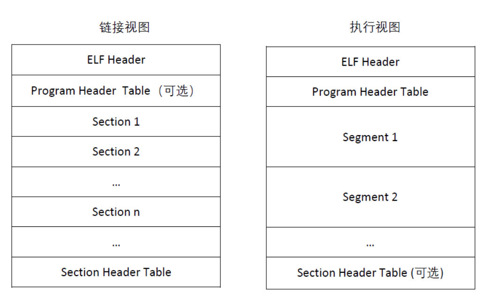
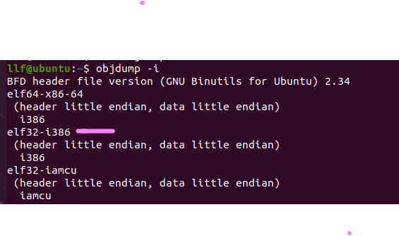

[TOC]

# tools

- X86 emulator --  **QEMU**  ===>  run  kernel
- compiler toolchain ----- assembler --> linker ---> C compiler --> debugger ==> compile and test kernel
- Debathena Machine  |  virtual machine 
- envs: Linux(recommand)   | windows(Cygmin)


## Compiler Toolchain

code ------ execuable binaries : C compiler  assemblers   linkers

32-Intel (X86)  ====> **ELF** binary format 

### objdump ---- ELF文件

- ELF文件   **Executable and Linkable Format**  **可执行可链接文件格式**

  - 

  - 链接视图

    静态链接器（即编译后参与生成最终ELF过程的链接器，如`ld` ）会以链接视图解析ELF。编译时生成的 **.o（目标文件**）以及链接后的 **.so （共享库**）均可通过链接视图解析，链接视图可以没有段表（如目标文件不会有段表）。

  - 执行视图

    **动态链接器**（即加载器，如x86架构 linux下的 /lib/ld-linux.so.2或者安卓系统下的 /system/linker均为动态链接器）会以执行视图解析ELF并动态链接，执行视图可以没有节表。

  - 文件头

    **ELF的结构声明位于系统头文件 elf.h 中**，ELF格式分为32位与64位两种，除了重定位类型稍有区别，其它大致相同，为了简化描述，后续说明将省略32/64字样。

    ELF Header

    ```
    #define EI_NIDENT (16)
    typedef struct  # 文件头结构体
    {
        unsigned char	e_ident[EI_NIDENT];	/* Magic number and other info */
        Elf_Half		e_type;			/* Object file type */
        Elf_Half		e_machine;		/* Architecture */
        Elf_Word	        e_version;		/* Object file version */
        Elf_Addr		e_entry;		/* Entry point virtual address */
        Elf_Off		e_phoff;		/* Program header table file offset */
        Elf_Off		e_shoff;		/* Section header table file offset */
        Elf_Word	        e_flags;		/* Processor-specific flags */
        Elf_Half		e_ehsize;		/* ELF header size in bytes */
        Elf_Half		e_phentsize;		/* Program header table entry size */
        Elf_Half		e_phnum;		/* Program header table entry count */
        Elf_Half		e_shentsize;		/* Section header table entry size */
        Elf_Half		e_shnum;		/* Section header table entry count */
        Elf_Half		e_shstrndx;		/* Section header string table index */
    } Elf_Ehdr;
    ```

- **objdump** 

```shell
# 安装objdump 
sudo apt install binutils
```

wiki: **objdump**是在[类Unix](https://zh.wikipedia.org/wiki/类Unix)[操作系统](https://zh.wikipedia.org/wiki/操作系统)上显示关于[目标文件](https://zh.wikipedia.org/wiki/目标文件)的各种信息的[命令行](https://zh.wikipedia.org/wiki/命令行界面)程序。例如，它可用作[反汇编器](https://zh.wikipedia.org/wiki/反汇编器)来以汇编代码形式查看[可执行文件](https://zh.wikipedia.org/wiki/可执行文件)。它是[GNU Binutils](https://zh.wikipedia.org/wiki/GNU_Binutils)的一部分，用于在可执行文件和其他二进制数据上进行精细粒度控制。objdump使用[BFD](https://zh.wikipedia.org/wiki/二进制文件描述库)库来读取目标文件的内容。类似工具还有[readelf](https://zh.wikipedia.org/wiki/Readelf)、[Microsoft](https://zh.wikipedia.org/wiki/Microsoft) [DUMPBIN](https://zh.wikipedia.org/w/index.php?title=DUMPBIN&action=edit&redlink=1)和[Borland](https://zh.wikipedia.org/wiki/Borland) [TDUMP](https://zh.wikipedia.org/w/index.php?title=TDUMP&action=edit&redlink=1)。

注意在特定平台（比如Mac OS X）上，objdump二进制文件可能实际上被连接到[llvm](https://zh.wikipedia.org/wiki/LLVM)的objdump，它有着不同的命令选项和表现

`objdump` 实用程序读取二进制或可执行文件，并将汇编语言指令转储到屏幕上。汇编语言知识对于理解 `objdump` 命令的输出至关重要。

请记住：汇编语言是特定于体系结构的。

```shell
objdump -i
```



第二行是elf32-i386

- objdump基本命令

  ```shell
  -a
  --archive-header
      假如任何一个objfile是库文件，则显示相应的header信息（输出格式类似于ls -l命令）。除了可以列出
      ar tv所能展示的信息，objdump -a还可以显示lib文件中每一个对象文件的格式。
  
  --adjust-vma=offset
      当使用objdump命令来dump信息的时候，将section addresses都加上offset。此选项主要用于section
      addresses与符号表不对应的情形下，比如我们需要将相应的section放到某一个特殊的地址处时。
  
  -b bfdname
  --target=bfdname
      为obj文件指定对象码(object-code)格式。本选项是非必需的，objdump命令可以自动的识别许多种格式。
      例如：
         objdump -b oasys -m vax -h fu.o
      上面的命令用于fu.o的头部摘要信息，并明确指出了fu.o这个对象文件是vax平台上由oasys编译器编译而来。
      我们可以使用-i选项来列出所支持的所有平台格式
  
  -C
  --demangle[=style]
      将底层(low-level)的符号名解码成用户级(user-level)的名称。除了会去掉由系统添加的头部下划线之外，
      还使得C++的函数名以便于理解的方式显示出来。
  
  -g
  --debugging
      用于显示调试信息。这会使得objdump命令尝试解析STABS和IEEE格式的调试信息，然后以C语言语法格式将相应
      的调试信息进行输出。仅仅支持某些类型的调试信息。有些其他的格式被readelf -w支持
  
  -e
  --debugging-tags
      类似于-g选项。但是产生的输出信息格式兼容ctags工具
  
  -d
  --disassemble
      从objfile中对机器指令进行反汇编。本选项只对那些包含指令的section进行反汇编。
  
  
  -D
  --disassemble-all
      类似于-d，但是本选项会对所有的sections进行反汇编，而不仅仅是那些包含指令的sections。
  
      本选项会微妙的影响代码段的反汇编。当使用-d选项的时候，objdump会假设代码中出现的所有symbols都在对应
      的boundary范围之内，并且不会跨boundary来进行反汇编； 而当使用-D选项时，则并不会有这样的假设。这就
      意味着-d与-D选项在反汇编时，可能输出结果会有些不同，比如当数据存放在代码段的情况下。
  
  
  --prefix-addresses
      反汇编的时候，显示每一行的完整地址。这是一种比较老的反汇编格式
  
  -EB
  -EL
  --endian={big|little}
      指定目标文件的大小端。这仅仅会影响到反汇编。这在对某一些并未指定大小端信息的obj文件进行反汇编时很有
      用，比如S-records
  
  -f
  --file-headers
      显示每一个obj文件的整体头部摘要信息
  
  -F
  --file-offsets
      当在对sections进行反汇编时，无论是否显示相应的symbol，都会显示其在文件内的偏移(offset)。
  
  -h
  --section-headers
  --headers
      显示obj文件各个sections的头部摘要信息。
  
      obj文件中segments可能会被relocate，比如在ld时通过使用-Ttext、-Tdata或者-Tbss选项。然而，有一些
      对象文件格式，比如a.out，其本身并没有保存起始地址信息。在这种情况下，尽管ld可以正确的对这些sections
      进行relocate，但是使用objdump -h来查看各sections的头部摘要信息时则不能正确的显示地址信息。
  
  -H
  --help
      objdump的帮助信息
  
  -i
  --info
      显示objdump所支持的所有arch以及obj格式。-m和-b选项可用到这
  
  
  -j name
  --section=name
      仅仅显示指定名称为name的section的信息
  
  
  -l
  --line-numbers
      用文件名和行号标注相应的目标代码，仅仅和-d、-D或者-r一起使用时有效。通常要求具有调试信息，即编译时使用
      了-g之类的选项。
  
  
  -m machine
  --architecture=machine
      指定反汇编目标文件时使用的架构。当待反汇编的目标文件其本身并没有包含arch信息时(如S-records文件)，我们
      就可以使用此选项来进行指定。我们可以使用objdump -i来列出所支持的arch。
  
  -p
  --private-headers
      显示objfile文件格式的专属信息。具体的输出取决于object file的格式，对于某一些格式，可能并没有一些额外
      的信息输出
  
  -r
  --reloc
      显示文件的重定位入口。如果和-d或者-D一起使用，重定位部分以反汇编后的格式显示出来
  
  -R
  --dynamic-reloc
      显示文件的动态重定位入口，仅仅对于动态目标文件意义，比如某些共享库。
  
  -s
  --full-contents
      显示指定section的所有内容。默认情况下，对于所有非空section都会显示
  
  -S
  --source
      将反汇编代码与源代码交叉显示。通常在调试版本能够较好的显示尤其当编译的时候指定了-g这种调试参数时，
      效果比较明显。隐含了-d参数。
  
  --show-raw-insn
      在进行反汇编时，显示每条汇编指令对应的机器码。默认情况下会显示，除非使用了--prefix-addresses
  
  --no-show-raw-insn
      反汇编时，不显示汇编指令的机器码。当使用了--prefix-addresses时，默认就不会显示机器码
  
  --start-address=address
      从指定地址开始显示数据，该选项影响-d、-r和-s选项的输出
  
  --stop-address=address
      显示数据直到指定地址为止，该项影响-d、-r和-s选项的输出
  
  -t
  --syms 
      显示文件的符号表入口。类似于nm -s提供的信息 
  
  -T
  --dynamic-syms
      显示文件的动态符号表入口，仅仅对动态目标文件意义，比如某些共享库。它显示的信息类似于 nm -D(--dynamic)
      显示的信息
  
  -V
  --version
      打印objdump的版本信息
  
  -x
  --all-headers
      显示所可用的header信息，包括符号表、重定位入口。-x 等价于-a -f -h -r -t 同时指定
  
  -z
  --disassemble-zeroes
      一般反汇编输出将省略大块的零，该选项使得这些零块也被反汇编
  
  @file
      可以将选项集中到一个文件中，然后使用这个@file选项载入
  ```

  

 ### 安装编译工具

```shell
# 测试工具是否安装


# 安装gcc
sudo apt install gcc 
# 查看安装是否成功
llf@ubuntu:~$ gcc -v
Using built-in specs.
COLLECT_GCC=gcc
COLLECT_LTO_WRAPPER=/usr/lib/gcc/x86_64-linux-gnu/9/lto-wrapper
OFFLOAD_TARGET_NAMES=nvptx-none:hsa
OFFLOAD_TARGET_DEFAULT=1
Target: x86_64-linux-gnu
Configured with: ../src/configure -v --with-pkgversion='Ubuntu 9.3.0-17ubuntu1~20.04' --with-bugurl=file:///usr/share/doc/gcc-9/README.Bugs --enable-languages=c,ada,c++,go,brig,d,fortran,objc,obj-c++,gm2 --prefix=/usr --with-gcc-major-version-only --program-suffix=-9 --program-prefix=x86_64-linux-gnu- --enable-shared --enable-linker-build-id --libexecdir=/usr/lib --without-included-gettext --enable-threads=posix --libdir=/usr/lib --enable-nls --enable-clocale=gnu --enable-libstdcxx-debug --enable-libstdcxx-time=yes --with-default-libstdcxx-abi=new --enable-gnu-unique-object --disable-vtable-verify --enable-plugin --enable-default-pie --with-system-zlib --with-target-system-zlib=auto --enable-objc-gc=auto --enable-multiarch --disable-werror --with-arch-32=i686 --with-abi=m64 --with-multilib-list=m32,m64,mx32 --enable-multilib --with-tune=generic --enable-offload-targets=nvptx-none=/build/gcc-9-HskZEa/gcc-9-9.3.0/debian/tmp-nvptx/usr,hsa --without-cuda-driver --enable-checking=release --build=x86_64-linux-gnu --host=x86_64-linux-gnu --target=x86_64-linux-gnu
Thread model: posix
gcc version 9.3.0 (Ubuntu 9.3.0-17ubuntu1~20.04) 

# 测试安装
llf@ubuntu:~$ gcc -m32 -print-libgcc-file-name
/usr/lib/gcc/x86_64-linux-gnu/9/libgcc.a
```

```shell
# gdb安装
sudo apt-get install -y build-essential gdb

llf@ubuntu:~$ gdb -v
GNU gdb (Ubuntu 9.2-0ubuntu1~20.04) 9.2
Copyright (C) 2020 Free Software Foundation, Inc.
License GPLv3+: GNU GPL version 3 or later <http://gnu.org/licenses/gpl.html>
This is free software: you are free to change and redistribute it.
There is NO WARRANTY, to the extent permitted by law.

# 64位上安装32的部分包  => __udivdi3 not found and __muldi3 not found
sudo apt-get install gcc-multilib

llf@ubuntu:~$ gcc -m32 -print-libgcc-file-name
/usr/lib/gcc/x86_64-linux-gnu/9/32/libgcc.a  # 32位
```


### QEMU Emulator ---- 2021.7.19 安装失败！！！

版本：2.3.0  => x86

```shell
# 安装git 
sudo apt install git

llf@ubuntu:~$ git version
git version 2.25.1

# clone IPA 6.828 qemu
git clone https://github.com/mit-pdos/6.828-qemu.git qemu

# 安装依赖库
sudo apt install libsdl1.2-dev libtool-bin libglib2.0-dev libz-dev libpixman-1-dev

# 配置源代码
Configure the source code (optional arguments are shown in square brackets; replace PFX with a path of your choice

Linux: ./configure --disable-kvm --disable-werror [--prefix=PFX] [--target-list="i386-softmmu x86_64-softmmu"]

OS X: ./configure --disable-kvm --disable-werror --disable-sdl [--prefix=PFX] [--target-list="i386-softmmu x86_64-softmmu"] 

The prefix argument specifies where to install QEMU; without it QEMU will install to /usr/local by default. The target-list argument simply slims down the architectures QEMU will build support for.


# 安装vim 
sudo apt install vim 

# 配置
./configure --disable-kvm --disable-werror --prefix=/usr/local/ --target-list="i386-softmmu x86_64-softmmu"

ERROR: Python not found. Use --python=/path/to/python

# 安装python
sudo apt install python   # 安装2.7，3.6版本没有找到

llf@ubuntu:~/qemu$ python
Python 2.7.18 (default, Mar  8 2021, 13:02:45) 
[GCC 9.3.0] on linux2

# 重新配置
./configure --disable-kvm --target-list="i386-softmmu x86_64-softmmu" 

# 编译安装
make && make install

deprecated  --- 弃用

qga/main.c: In function ‘ga_log’:
qga/main.c:268:5: error: ‘GTimeVal’ is deprecated: Use 'GDateTime' instead [-Werror=deprecated-declarations]
  268 |     GTimeVal time;
      |     ^~~~~~~~
In file included from /usr/include/glib-2.0/glib/galloca.h:32,
                 from /usr/include/glib-2.0/glib.h:30,
                 from qga/main.c:16:
/usr/include/glib-2.0/glib/gtypes.h:547:8: note: declared here
  547 | struct _GTimeVal
      |        ^~~~~~~~~
qga/main.c:283:9: error: ‘g_get_current_time’ is deprecated: Use 'g_get_real_time' instead [-Werror=deprecated-declarations]
  283 |         g_get_current_time(&time);
      |         ^~~~~~~~~~~~~~~~~~
In file included from /usr/include/glib-2.0/glib/giochannel.h:33,
                 from /usr/include/glib-2.0/glib.h:54,
                 from qga/main.c:16:
/usr/include/glib-2.0/glib/gmain.h:679:8: note: declared here
  679 | void   g_get_current_time                 (GTimeVal       *result);
      |        ^~~~~~~~~~~~~~~~~~
cc1: all warnings being treated as errors
make: *** [/home/llf/qemu/rules.mak:57: qga/main.o] Error 1

# pkg-config 管理包程序
 pkg-config --cflags --libs gtk+-2.0 # gcc编译gtk+2.0所需要的所有选项（头文件目录和库文件）
```

**debugging!!!!!!!!!!!!!!!!!!!!!!!!!!!!!!!!!!!!!!**

- gdk/gdk.h找不到！！！

- gtk/gtk.h找不到！！！！

  

## 安装QEMU ---- 2021.7.20 安装成功！！！

```shell
# clone
git clone https://github.com/mit-pdos/6.828-qemu.git qemu

# 安装依赖库 
sudo apt install libsdl1.2-dev
sudo apt install libtool-bin
sudo apt install libglib2.0-dev
sudo apt install libz-dev
sudo apt install libpixman-1-dev

# 编译
make

# 报错
/home/llf/qemu/qga/commands-posix.c:633: undefined reference to `major'
/usr/bin/ld: /home/llf/qemu/qga/commands-posix.c:634: undefined reference to `minor'
collect2: error: ld returned 1 exit status
make: *** [Makefile:288: qemu-ga] Error 1

# 解决报错
vim qga/commands-posix.c
# 加入头文件
#include <sys/sysmacros.h>

# 安装
sudo make install
```

